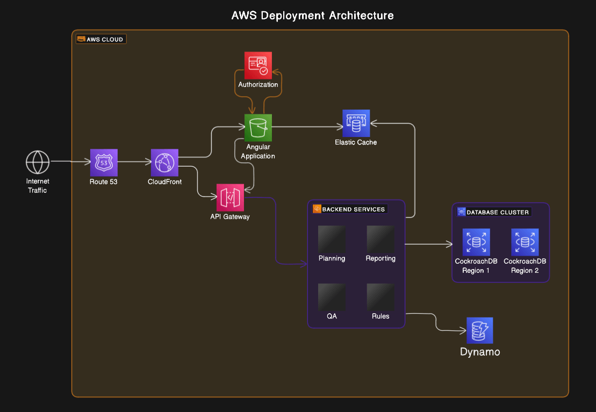

# Alliance Research Indicators (ARI)

The **Alliance Research Indicators (ARI)** platform is the system of record for CGIAR Alliance research results reporting. It centralizes the capture, validation, governance, and publication of research **Results** (innovations, capacity sharing, policy change, OICRs, IP rights, knowledge products, etc.) so that contributors, MEL experts, and center admins can move from raw evidence to formally reported research outcomes against indicators, contracts, levers, and strategic outcomes.

This monorepo contains:

- **`server/researchindicators/`** — the NestJS backend API, RabbitMQ microservice listener, Socket.IO gateway, and embedded `/admin` SSR panel. Fully documented in [`docs/`](./docs/).
- **`client/research-indicators/`** — the **STAR** frontend (sibling app). Owned independently; out of scope of this README.

> 📚 **New here? Start with the documentation map below**, not with this README's tech-stack section.

---

## Table of contents

1. [Documentation map](#documentation-map)
2. [What ARI does](#what-ari-does)
3. [Personas & consumers](#personas--consumers)
4. [Architecture overview](#architecture-overview)
5. [Repository layout](#repository-layout)
6. [Tech stack](#tech-stack)
7. [Getting started](#getting-started)
8. [Project structure (server)](#project-structure-server)
9. [API surface conventions](#api-surface-conventions)
10. [Authentication & authorization](#authentication--authorization)
11. [Integrations](#integrations)
12. [Database & migrations](#database--migrations)
13. [Testing](#testing)
14. [Real-time channel & messaging](#real-time-channel--messaging)
15. [Admin SSR panel](#admin-ssr-panel)
16. [Cross-functional requirements](#cross-functional-requirements)
17. [SDD workflow (how to add a feature)](#sdd-workflow-how-to-add-a-feature)
18. [License](#license)

---

## Documentation map

The full SDD constitutional baseline lives under [`docs/`](./docs/). Always read these before designing or changing anything:

| File | What it is | When to consult |
| --- | --- | --- |
| [`docs/prd.md`](./docs/prd.md) | Product Requirements — problem, personas, goals, scope, user stories, acceptance criteria, open questions. | Scope, audience, or business intent questions. |
| [`docs/system-design/design.md`](./docs/system-design/design.md) | System / UX-of-the-platform blueprint — IA, API consumer flows, response envelope, admin panel, design tokens, a11y, decisions log, open gaps. | Changes affecting how humans or machines experience the platform. |
| [`docs/detailed-design/detailed-design.md`](./docs/detailed-design/detailed-design.md) | Technical implementation blueprint — module layout, data model, API rules, workflows, integrations, security, observability, testing. | Changes that touch code, schema, integrations, or infra-adjacent settings. |
| [`docs/specs/general-setup/`](./docs/specs/general-setup/) | Methodology templates every module-level spec MUST follow (`requirements.md`, `design.md`, `task.md`). | Whenever you create a new spec under `docs/specs/<module>/<feature>/`. |

Agent-facing working manuals:

- [`CLAUDE.md`](./CLAUDE.md) — root agent guide, links the constitutional baseline.
- [`server/researchindicators/src/CLAUDE.md`](./server/researchindicators/src/CLAUDE.md) — code-level manual for working inside the NestJS source tree.

---

## What ARI does

CGIAR research outputs are produced across many centers, contracts, and reporting platforms, each with its own conventions and validation rules. ARI replaces duplicated data entry, inconsistent taxonomies, and weak audit trails with **a single, governed source of truth**, exposed through:

- A **versioned REST API** at `/api/v{n}/...` documented at `/swagger`.
- A **Socket.IO** channel for real-time UI updates.
- An **OpenSearch** surface for partner platforms.
- A **RabbitMQ** microservice for cross-system events.
- An embedded **`/admin`** SSR panel for operators.

See [`docs/prd.md`](./docs/prd.md) for the full problem statement, goals, scope, user stories, and open questions.

---

## Personas & consumers

**Primary personas** — humans interacting via the STAR frontend:

| Persona | Role |
| --- | --- |
| **Result Contributor** | CGIAR researcher / project staff reporting results. |
| **MEL Regional Expert** | Monitoring, Evaluation & Learning expert validating and curating results. |
| **Center / General Admin** | Center-level admin overseeing reporting, contracts, and users. |
| **System Admin / Tech Support / Developer** | Platform operator and integrator. |

**Machine consumers** — first-class API clients:

- **STAR frontend** (`client/research-indicators`) — primary human UI.
- **PRMS / TIP / AICCRA** — partner CGIAR platforms reading from ARI.
- **AI/ML formalization pipeline** — pushes raw AI-extracted results via `/results/ai/formalize`.
- **Internal `/admin` SSR panel** — embedded React 19 SSR.

---

## Architecture overview



High-level topology (see [`docs/detailed-design/detailed-design.md` §1](./docs/detailed-design/detailed-design.md) for details):

```
             ┌────────────────┐
             │   STAR (UI)    │  client/research-indicators
             └───────┬────────┘
                     │ HTTPS + WS
             ┌───────▼────────┐         ┌──────────────────┐
             │ ARI Server     │◄────────┤  AI Pipeline     │
             │ (NestJS)       │   REST  └──────────────────┘
             │  /api/v{n}     │
             │  /swagger      │◄────────┤ PRMS / TIP / AICCRA (machine token)
             │  /admin (SSR)  │
             │  Socket.IO     │────────►│ STAR (real-time)
             └──┬──┬──┬──┬──┬─┘
                │  │  │  │  │
    ┌───────────┘  │  │  │  └────────────┐
    ▼              ▼  ▼  ▼               ▼
  MySQL       OpenSearch  DynamoDB    RabbitMQ
  (TypeORM)   (Results,   (Feedback)  (Microservice
               PRMS,                   queue ARI_QUEUE)
               Alliance
               Staff)

  External: ROAR Management (auth), CLARISA (master data),
            AGRESSO (MSSQL + SOAP), TIP integration.
```

---

## Repository layout

```
alliance-research-indicators-main/
├── CLAUDE.md                              # Root agent working manual
├── README.md                              # ← you are here
├── Architecture.png                       # Architecture diagram
├── docs/                                  # SDD constitutional baseline
│   ├── prd.md
│   ├── system-design/design.md
│   ├── detailed-design/detailed-design.md
│   └── specs/general-setup/{requirements,design,task}.md
├── server/
│   └── researchindicators/                # NestJS backend (this repo's focus)
│       ├── src/                           # see "Project structure"
│       │   └── CLAUDE.md                  # Code-level working manual
│       ├── test/                          # Jest e2e suite
│       └── package.json
├── client/
│   └── research-indicators/               # STAR frontend (sibling, out of scope)
├── .husky/                                # Git hooks
└── package.json                           # Husky management at repo root
```

---

## Tech stack

| Concern | Choice |
| --- | --- |
| Language | TypeScript 5.7 |
| Runtime | Node.js ≥ 20.11.1 |
| Framework | NestJS 10 |
| ORM / DB | TypeORM 0.3 / MySQL (utf8mb4, `utf8mb4_unicode_520_ci`) |
| Search | OpenSearch (mapping driven by `@OpenSearchProperty` decorator) |
| Real-time | Socket.IO 4 |
| Messaging | RabbitMQ (AMQPS) via `@nestjs/microservices` |
| Auxiliary store | AWS DynamoDB (feedback) |
| Auth | ROAR Management JWT + base64 `{client_id, client_secret}` machine token |
| Admin UI | React 19 + Vite 7 (SSR via `ReactRendererService`) |
| External integrations | CLARISA (HTTP), AGRESSO (MSSQL + SOAP), TIP, Azure |
| Build | `tsc` for NestJS, Vite for admin client |
| Lint | ESLint 9 + Prettier 3 |
| Tests | Jest 29 (`ts-jest`) + Supertest 7 |
| API docs | Swagger / OpenAPI (`@nestjs/swagger`) at `/swagger` |
| Vulnerability scan | `npm audit` |
| Security headers | Helmet + CSP |

---

## Getting started

### Prerequisites

- Node.js ≥ 20.11.1, npm 10+.
- MySQL database reachable via the `ARI_MYSQL_*` env vars.
- RabbitMQ broker reachable via `ARI_MQ_*`.
- OpenSearch cluster (optional for local, required for search features).
- DynamoDB credentials (optional locally; required for feedback).
- Access to ROAR, CLARISA, AGRESSO, and TIP credentials (or stubbed endpoints for local dev).

### Install

```bash
git clone <repo-url>
cd alliance-research-indicators-main/server/researchindicators
npm install
```

### Environment variables

Create a `.env` file in `server/researchindicators/` based on the following keys:

```env
# HTTP
ARI_PORT=3000

# MySQL — CORE datasource
ARI_MYSQL_HOST=
ARI_MYSQL_NAME=
ARI_MYSQL_USER_NAME=
ARI_MYSQL_USER_PASS=
DB_PORT=3306

# MySQL — TEST datasource (used by integration tests)
ARI_TEST_MYSQL_HOST=
ARI_TEST_MYSQL_NAME=
ARI_TEST_MYSQL_USER_NAME=
ARI_TEST_MYSQL_USER_PASS=

# RabbitMQ microservice
ARI_MQ_HOST=
ARI_MQ_USER=
ARI_MQ_PASSWORD=
ARI_QUEUE=ari_queue

# Logging
SEE_ALL_LOGS=false
```

Additional integration-specific variables (CLARISA, AGRESSO, ROAR, TIP, OpenSearch, DynamoDB, Azure) live under their respective `domain/tools/<integration>/` modules — consult the module sources for the exact keys.

### Run

From `server/researchindicators/`:

```bash
# Dev — runs NestJS + Vite admin together
npm run dev

# Dev — NestJS only
npm run start:dev

# Dev — Vite admin only (http://localhost:5173)
npm run dev:admin

# Build (NestJS + admin)
npm run build

# Production
npm run start:prod
```

Once running:

- API: `http://localhost:${ARI_PORT}/api/v{n}/...`
- Swagger UI: `http://localhost:${ARI_PORT}/swagger`
- Admin panel: `http://localhost:${ARI_PORT}/admin`

### Database migrations

```bash
npm run migration:generate -- ./src/db/migrations/<camelCaseName>
npm run migration:dev:execute        # apply to local DB (via ts-node)
npm run migration:execute            # apply built dist (production path)
npm run migration:revert             # rollback the last migration
```

> **Migrations are append-only.** Never edit a migration after it's merged to `main`. See [`docs/detailed-design/detailed-design.md` §3.6](./docs/detailed-design/detailed-design.md).

---

## Project structure (server)

```
server/researchindicators/src/
├── main.ts                       # bootstraps HTTP + microservice apps
├── app.module.ts                 # HTTP composition root
├── app-microservice.module.ts    # RabbitMQ composition root
├── admin/                        # /admin SSR panel (Vite + React 19)
├── controllers/                  # cross-cutting controllers (Azure)
├── db/
│   ├── config/mysql/             # TypeORM datasource (CORE / TEST)
│   ├── config/dynamo/            # DynamoDB module + service
│   └── migrations/               # 238+ migrations (append-only)
└── domain/
    ├── routes/main.routes.ts     # RouterModule registration tree
    ├── entities/<module>/        # one Nest module per entity cluster
    ├── complementary-entities/   # secondary entities (e.g. user)
    ├── tools/                    # external integrations
    │   ├── agresso/  broker/  clarisa/  cron-jobs/
    │   ├── dynamo-feedback/  open-search/  roar-management/
    │   ├── socket/  tip-integration/
    └── shared/                   # interceptors, guards, pipes, filters, utils
```

Detailed conventions: [`server/researchindicators/src/CLAUDE.md`](./server/researchindicators/src/CLAUDE.md).

---

## API surface conventions

- **Global prefix:** `/api`
- **Versioning:** URI-based (`/api/v1/...`, `/api/v2/...`)
- **Response envelope** — every success and error response follows `ServerResponseDto`:

  ```json
  {
    "data": <payload | []>,
    "status": <HttpStatus>,
    "description": "<human-readable summary>",
    "errors": <string | string[] | null>,
    "timestamp": "<ISO 8601>",
    "path": "<request.url>"
  }
  ```

- **List endpoints** use `page`, `limit`, `sort-order`, `sort-field`, and kebab-case filters parsed by `QueryParseBool` / `ListParseToArrayPipe`.
- **Swagger** — every endpoint MUST declare `@ApiTags`, `@ApiBearerAuth`, `@ApiOperation`, and per-param `@ApiQuery` / `@ApiBody`.
- **Errors** — flow through `GlobalExceptions`; throw Nest HTTP exceptions (`UnauthorizedException`, `BadRequestException`, etc.), never raw `Error`s on the HTTP path.

See [`docs/system-design/design.md` §6](./docs/system-design/design.md) for layout patterns and [`docs/detailed-design/detailed-design.md` §4](./docs/detailed-design/detailed-design.md) for the full rule set.

---

## Authentication & authorization

ARI accepts **two token shapes** validated by `JwtMiddleware`:

1. **ROAR JWT** — for human users. Validated against ROAR Management.
2. **Machine token** — `Bearer base64({"client_id":"...","client_secret":"..."})`. Validated against `app_secrets` + `app_secret_host_list` (origin/IP allowlist).

Routes excluded from the JWT middleware: `/admin*`, `/admin/public*`, `/.well-known*`, `GET /`, `GET /favicon.ico`, `GET /api/configuration/:key`.

**Roles** (`SecRolesEnum`):

| Role | Notes |
| --- | --- |
| `SYSTEM_ADMIN (1)` | Bypasses all `@Roles(...)` checks. |
| `CONTRIBUTOR (3)` | Result contributor. |
| `TECHNICAL_SUPPORT (7)` | Developer / support. |
| `CENTER_ADMIN (9)` | Center-level admin. |
| `MEL_REGIONAL_EXPERT (10)` | MEL reviewer. |
| _Deprecated_ | `IT_SUPPORT(2)`, `GLOBAL(4)`, `CONTRACT_CONTRIBUTOR(5)`, `RESULT_CONTRIBUTOR(6)`, `TESTER(8)` — migration plan TBD. |

`RolesGuard` reads `@Roles(...)` metadata. `ResultStatusGuard` gates result-mutating endpoints by the lifecycle state defined in `result_status_workflow`.

See [`docs/detailed-design/detailed-design.md` §8](./docs/detailed-design/detailed-design.md).

---

## Integrations

| System | Folder | Transport | Direction |
| --- | --- | --- | --- |
| **ROAR Management** | `domain/tools/roar-management/` | HTTP | ARI → ROAR (token validation) |
| **CLARISA** | `domain/tools/clarisa/` | HTTP | ARI ↔ CLARISA (master data) |
| **AGRESSO** | `domain/tools/agresso/` | MSSQL + SOAP | ARI → AGRESSO (contracts, staff) |
| **TIP** | `domain/tools/tip-integration/` | HTTP | ARI ↔ TIP |
| **OpenSearch** | `domain/tools/open-search/` | HTTP | ARI → OpenSearch (Results / PRMS / Alliance Staff) |
| **DynamoDB** | `domain/tools/dynamo-feedback/` | AWS SDK v3 | ARI ↔ DynamoDB (feedback store) |
| **RabbitMQ** | `domain/tools/broker/` | AMQPS | ARI ↔ broker (queue `ARI_QUEUE`) |
| **Socket.IO** | `domain/tools/socket/` | WS | ARI → clients (real-time events) |
| **Azure** | `src/controllers/azure-*.controller.ts` | HTTP | inbound |

Integration rules (enforced):

- Every integration encapsulates transport inside a single Nest service.
- Controllers MUST NOT call transport clients directly.
- Cron-driven integrations live under `domain/tools/cron-jobs/` and MUST log status to `sync_process_log`.

See [`docs/detailed-design/detailed-design.md` §7](./docs/detailed-design/detailed-design.md).

---

## Database & migrations

- **Engine:** MySQL with `utf8mb4` / `utf8mb4_unicode_520_ci`.
- **ORM:** TypeORM 0.3, `synchronize: false`, `migrationsRun: false`.
- **Datasource targets:** `CORE` and `TEST` (env-isolated) in `src/db/config/mysql/orm.config.ts`.
- **Auditable base:** every domain entity extends `AuditableEntity`; mutations populate audit fields from `request.user`.
- **Naming:**
  - Tables `snake_case`; entities `PascalCase`.
  - Indexes named `idx_<table>_<purpose>` (see `Result` entity for examples).
  - Migration files: `<timestamp>-<camelCaseAction>.ts`.
- **OpenSearch:** searchable columns are decorated with `@OpenSearchProperty({...})`. The same TypeORM entity is the source of truth for the OpenSearch mapping.

The **Result** aggregate is the canonical example — `result_id` (PK) + `result_official_code` (business key), versioning via `version_id` / `is_snapshot` / `report_year_id`, and ~30 `OneToMany` relations covering all result types and attachments.

---

## Testing

```bash
npm test            # unit tests (sibling *.spec.ts)
npm run test:watch
npm run test:cov    # with coverage
npm run test:e2e    # supertest-based end-to-end (test/jest-e2e.json)
```

- **Framework:** Jest 29 + ts-jest.
- **Coverage threshold (global):** branches / functions / lines / statements ≥ **60%**.
- **Coverage excludes:** `*.entity.ts`, `db/migrations/**`, `*.enum.ts`, `*.spec.ts`.
- **Convention:** every controller, service, guard, interceptor, and middleware ships a sibling `*.spec.ts`. New role-restricted or status-guarded handlers MUST include both an "allowed" and a "denied" test case.

---

## Real-time channel & messaging

- **Socket.IO gateway** — `domain/tools/socket/server.gateway.ts`. Used to emit result-update events to STAR for real-time UI refresh.
- **RabbitMQ microservice** — bootstrapped in `main.ts` (`Transport.RMQ`, queue `ARI_QUEUE`, durable). Message handlers live in `domain/tools/broker/` (`AlianceManagementApp`, `AiRoarMiningApp`, `SelfApp`, `MessageMicroservice`).

> Socket.IO event names and RabbitMQ message contracts are tracked as open work (see [`docs/system-design/design.md` §13](./docs/system-design/design.md) OG-4). Add new events through a module spec, not ad hoc.

---

## Admin SSR panel

The `/admin` route serves a React 19 + Vite SSR panel hosted inside the Nest app. See [`server/researchindicators/src/admin/README-REACT.md`](./server/researchindicators/src/admin/README-REACT.md) for the page-recipe (component → route → controller → sidebar entry).

Current state: `/admin` is excluded from the JWT middleware. **Before any production exposure**, the admin module MUST add an `AdminGuard` bound to the appropriate roles (`SYSTEM_ADMIN`, `TECHNICAL_SUPPORT`). Tracked in [`docs/system-design/design.md` §13 OG-3](./docs/system-design/design.md).

---

## Cross-functional requirements

These principles apply across the platform. Detailed practices and tool choices are kept here intentionally to set expectations for new contributors.

### Scalability
Handle increasing loads without compromising performance. Practices: AWS Elastic Beanstalk auto-scaling, Redis caching, query-tier optimization on `Result` relations. Tools: AWS Elastic Beanstalk, AWS Auto Scaling.

### Security
Confidentiality, integrity, availability. Practices: SSL/TLS in transit, encryption at rest, RBAC via `RolesGuard` + `SecRolesEnum`, machine-token allowlist (`app_secret_host_list`), Helmet CSP. Tools: AWS Cognito, AWS IAM, AWS KMS.

### Reliability
Fault-tolerant architecture with redundancy. Practices: Multi-AZ RDS, automated backups, disaster recovery. Tools: AWS RDS Multi-AZ, AWS Backup.

### Performance
Fast response times and low latency. Practices: efficient TypeORM queries with selective `relations`, OpenSearch for heavy list operations, CDN for static assets. Tools: AWS CloudWatch, AWS CloudFront. _Target API p95 ≤ 100 ms — proposed, see [PRD §4](./docs/prd.md)._

### Maintainability
Strict layering (`entities/<module>`, `tools/<integration>`, `shared/`), uniform response envelope, sibling `*.spec.ts` for every code unit, ESLint + Prettier enforced via Husky.

### Monitoring
Centralized logging via `LoggerUtil`, structured per-request context via `LoggingInterceptor` / `SetUpInterceptor`, status-based log levels in `ResponseInterceptor`. Tools: AWS CloudWatch, ELK stack.

### Cost Optimization
Right-size provisioning, retire unused resources, use AWS Cost Explorer / Trusted Advisor.

### High Availability
Multi-AZ deployments, load balancing, health checks. Tools: AWS ELB, Route 53.

### Data Integrity
Schema-enforced via TypeORM + MySQL constraints, audit fields via `AuditableEntity`, `result_status_transitions` log for lifecycle changes, append-only migrations.

### Version Control
Git + GitHub. Commit convention: `<type>(<scope>): <subject>` (e.g. `fix(results.service): ...`). Husky hooks active — never bypass with `--no-verify` unless explicitly approved by a human.

### Documentation
Architecture diagram (`Architecture.png`), full SDD baseline under `docs/`, Swagger at `/swagger`, agent guides in `CLAUDE.md` files.

### Compliance
PII / donor-restricted data handling under review — see open question [`docs/prd.md` §9 OQ-7](./docs/prd.md). Until resolved, treat contributor data as confidential.

### Interoperability
RESTful API + OpenSearch + Socket.IO + RabbitMQ. JWT (RFC 7519) for auth; machine tokens for partner platforms.

### Performance Testing
Recommended tools: Apache JMeter, Gatling, Locust. No fixed cadence yet — see [PRD §9](./docs/prd.md).

### CI/CD
Husky pre-commit hooks enforce lint/format. Pipeline specifics are tracked in ops docs (out of scope of this README).

---

## SDD workflow (how to add a feature)

1. **Read** the relevant section(s) of `docs/prd.md`, `docs/system-design/design.md`, and `docs/detailed-design/detailed-design.md`.
2. **Create a spec folder** under `docs/specs/<module>/<feature-slug>/` containing three files copied from the templates in `docs/specs/general-setup/`:
   - `requirements.md`
   - `design.md`
   - `task.md`
3. **Get approval** on the spec (engineering lead + product + security/devops if applicable).
4. **Implement** following the canonical recipe in [`server/researchindicators/src/CLAUDE.md` §4](./server/researchindicators/src/CLAUDE.md): migration → entity → DTO → service → controller → routes → tests → docs.
5. **Verify** locally: `npm run lint && npm test && npm run test:e2e`, confirm the endpoint appears in Swagger, confirm migrations apply and revert cleanly.
6. **Open a PR** with a message in the project's `<type>(<scope>): <subject>` style; the spec's tasks should be checked off as they land.

---

## License

See [`LICENSE`](./LICENSE).
