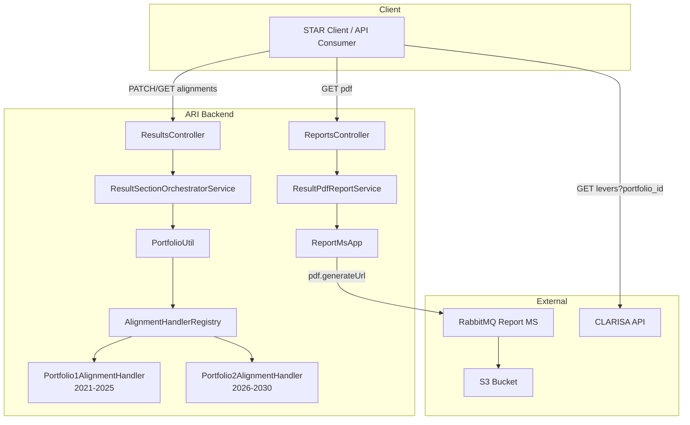

# Pull Request: `staging` → `main`

**Repository:** [AllianceBioversityCIAT/alliance-research-indicators-main](https://github.com/AllianceBioversityCIAT/alliance-research-indicators-main)  
**Comparison:** [`main...staging`](https://github.com/AllianceBioversityCIAT/alliance-research-indicators-main/compare/main...staging)  
**Scope:** `server/researchindicators` (ARI backend)  
**Stats:** 34 commits · 173 files changed · +13,323 / −396 lines

---

## Summary

This release prepares the Alliance Research Indicators (ARI) backend for the **2026 portfolio cycle** while delivering **PDF report generation** for results and a **portfolio-aware alignment architecture**. The work spans new domain modules, database migrations (including stored-procedure updates), CLARISA lever enhancements, and a refactor of result alignment to route behaviour through portfolio-specific handlers.

The changes are grouped around four main initiatives:

| Initiative | Ticket(s) | Description |
| --- | --- | --- |
| 2026 Portfolio & Alignment | AC-1646 | Portfolios, strategic objectives, impact outcomes, research areas, portfolio handlers |
| PDF Report Service | AC-1647 | Result PDF section retrieval, Report MS integration, capacity-sharing template |
| CLARISA Levers — "Other" | AC-1642 | Custom lever name support, "Other" lever, portfolio-scoped levers |
| Lever Autocomplete Control | AC-1658 | Portfolio-filtered lever listing; disable autocomplete on result creation |

---

## Highlights

### 1. Portfolio management (2026 cycle)

A new **Portfolios** module introduces first-class portfolio entities tied to reporting year ranges:

| Portfolio | ID | Years | Behaviour |
| --- | --- | --- | --- |
| Portfolio 1 | `1` | 2021–2025 | Legacy alignment (primary/contributor levers, SDGs, contracts) |
| Portfolio 2 | `2` | 2026–2030 | New alignment model (research areas, strategic objectives, impact outcomes) |

**New REST endpoints** (under `/api/v1`):

| Method | Path | Roles (mutations) |
| --- | --- | --- |
| `POST` | `/portfolios` | TECHNICAL_SUPPORT, SYSTEM_ADMIN, CENTER_ADMIN |
| `GET` | `/portfolios` | Authenticated |
| `GET` | `/portfolios/:id` | Authenticated |
| `PATCH` | `/portfolios/:id` | TECHNICAL_SUPPORT, SYSTEM_ADMIN, CENTER_ADMIN |
| `DELETE` | `/portfolios/:id` | SYSTEM_ADMIN |

**Supporting modules:**

- **Strategic Objectives** — `/api/v1/strategic-objectives` (CRUD, scoped to `portfolio_id`)
- **Impact Outcomes** — `/api/v1/impact-outcomes` (CRUD, scoped to `portfolio_id`)
- **Result Strategic Objectives** — join entity linking results to strategic objectives with role metadata
- **Result Impact Outcomes** — join entity linking results to impact outcomes with role metadata

### 2. Portfolio-aware result alignment

Alignment save/read is refactored behind a **portfolio handler orchestrator** without changing the public HTTP routes:

```
PATCH / GET  /api/v1/results/:result_code/alignments
        ↓
ResultsController
        ↓
ResultSectionOrchestratorService
        ↓
PortfolioUtil  (resolved from portfolio_id query param or report_year)
        ↓
AlignmentHandlerRegistry
        ↓
Portfolio1AlignmentHandler  |  Portfolio2AlignmentHandler
```

**`ResultAlignmentDto` — extended fields:**

| Field | Portfolio 1 | Portfolio 2 |
| --- | --- | --- |
| `contracts` | ✓ | ✓ |
| `primary_levers` | ✓ | — (cleared on save) |
| `contributor_levers` | ✓ | — (cleared on save) |
| `result_sdgs` | ✓ | ✓ |
| `research_areas` | — | ✓ (with optional `custom_lever_name`) |
| `strategic_objectives` | — | ✓ |
| `impact_outcomes` | — | ✓ (conditionally persisted by indicator type) |

**Portfolio 2 alignment handler** (`Portfolio2AlignmentHandler`):

- Clears legacy primary/contributor levers on save
- Persists **research areas** via `ResultLeversService` with role `RESEARCH_AREAS_ALIGNMENT`
- Persists **strategic objectives** and **impact outcomes** through dedicated services
- Supports **`custom_lever_name`** on levers (e.g. when lever ID = "Other")

**Shared infrastructure:**

- `PortfolioUtil` — resolves the active portfolio from `portfolio_id` query param or `report_year`
- `@getPortfolio()` decorator — injects portfolio context into controllers (e.g. CLARISA levers)
- `SetUpInterceptor` — extended to initialise `PortfolioUtil` per request

### 3. CLARISA levers enhancements

| Change | Detail |
| --- | --- |
| **"Other" lever** | New lever record (ID `9`) for free-text custom names |
| **`custom_lever_name`** | New column on `result_lever`; propagated through alignment and OICR flows |
| **`portfolio_id`** | Levers are now scoped to a portfolio |
| **`icon`** | Native icon field on `clarisa_levers`; `iconMapper` removed from controller |
| **Portfolio filtering** | `GET /clarisa/levers?portfolio_id=` returns levers for the requested portfolio |
| **CRUD expansion** | Full create/update/delete endpoints with role guards |

### 4. PDF report generation

New capability to build PDF reports for individual results via the Report microservice.

**Endpoint:**

```
GET /api/v1/reports/:result_code/pdf
```

**Query parameters:**

| Param | Required | Default | Description |
| --- | --- | --- | --- |
| `report_name` | Yes | `cap_sharing` | PDF template identifier (`PdfTemplates` enum) |
| `is-html` | No | `false` | Return HTML preview instead of PDF URL |
| `paper-width` | No | `600` | Paper width in pixels |
| `paper-height` | No | `1000` | Paper height in pixels |

**Architecture:**

```
ReportsController
        ↓
ResultPdfReportService.buildReport()
        ↓
ResultPdfReportMapper  +  ResultPdfIndicatorSectionRegistry
        ↓
ReportMsApp  →  RabbitMQ  →  pdf.generateUrl
        ↓
S3 URL (or HTML via PdfViewerService)
```

**Sections mapped for PDF:**

- General information
- Metadata (including result status)
- Alliance alignment (levers, SDGs, contracts)
- Geographic scope
- Evidence
- IP rights
- Partners
- Indicator-specific sections (e.g. **Capacity Sharing** via `CapSharingPdfSectionHandler`)

**New integrations:**

- `ReportMsApp` — RabbitMQ client for `pdf.generateUrl` pattern
- `PdfViewerService` — HTML rendering for preview mode
- `AppConfigService.getEnv()` — typed config retrieval with error handling for missing keys

### 5. App configuration

- New `app_config` key: `ARI_CLARISA_API_KEY` (seeded via migration)
- `AppConfigService.getEnv(key)` method with unit tests
- Used by `ReportMsApp` for PDF generation authentication

---

## Database migrations

**20 new migrations** (append-only). Run with:

```bash
cd server/researchindicators
npm run migration:dev:execute   # development (ts-node)
npm run migration:execute       # production (dist)
```

| Migration | Purpose |
| --- | --- |
| `AddNewEnvCl` | Seed `ARI_CLARISA_API_KEY` in `app_config` |
| `AddOtherLever` | Insert "Other" lever (ID 9) |
| `AddCustomLeverNameInResultLever` | `custom_lever_name` column on `result_lever` |
| `updateAligmentValidation` | Update alignment validation stored procedures |
| `updateSpVersion` | Stored procedure version bump (large) |
| `updateAligmentValidationSdgs` | SDG alignment validation updates |
| `CreatePlatformsTable` | `platforms` reference table |
| `AddedPortfolioIdClarisaLevers` | `portfolio_id` FK on `clarisa_levers` |
| `CreateStrategicObjectivesTable` | `strategic_objectives` table |
| `InsertNewResearchAreas` | Seed research area levers for Portfolio 2 |
| `createImpactOutcomesTable` | `impact_outcomes` table |
| `CreateResultStrategicAndResultOutcomesTables` | Join tables for result ↔ objective/outcome |
| `AddedIconClarisaLever` | `icon` column on `clarisa_levers` |
| `InsertIconClarisaLever` | Seed lever icons |
| `InsertLeverRole` | New lever role for research areas alignment |
| `CreateGetPortfolioIdFunction` | MySQL function to resolve portfolio from year |
| `UpdateAlignmentValidation` | Further alignment validation SP updates |
| `UpdateRoleColumnObjetives` | Rename `roles_id` → `role_id` on objective/outcome join tables |
| `UpdatePortfolio1Years` | Adjust Portfolio 1 year range (2021–2025) |
| `UpdateDeleteAndVersionSp` | Stored procedure delete + version update (large) |

> **Deployment note:** Two migrations (`updateSpVersion`, `UpdateDeleteAndVersionSp`) contain large stored-procedure bodies (~1,800–2,200 lines each). Ensure sufficient migration timeout and review DBA procedures before production apply.

---

## API surface changes

### New routes

| Path prefix | Module |
| --- | --- |
| `/api/v1/portfolios` | PortfoliosModule |
| `/api/v1/strategic-objectives` | StrategicObjectivesModule |
| `/api/v1/impact-outcomes` | ImpactOutcomesModule |
| `/api/v1/reports/:result_code/pdf` | ReportsModule (new handler) |

### Modified routes

| Path | Change |
| --- | --- |
| `GET/PATCH /api/v1/results/:result_code/alignments` | Now routes through `ResultSectionOrchestratorService` and portfolio handlers |
| `GET /api/v1/clarisa/levers` | Accepts `portfolio_id` query param; returns portfolio-scoped levers with native `icon` |
| `POST/PATCH/DELETE /api/v1/clarisa/levers` | New mutation endpoints |

### Entity / DTO changes

| Entity | New fields |
| --- | --- |
| `ResultLever` | `custom_lever_name` |
| `ResultSdg` | `clarisa_sdg_id` (Swagger `@ApiProperty`) |
| `ClarisaLever` | `portfolio_id`, `icon` |
| `Result` | Portfolio-related metadata fields |
| `ResultAlignmentDto` | `research_areas`, `strategic_objectives`, `impact_outcomes` |

---

## Environment variables

Ensure the following are configured before deploying:

| Variable | Used by |
| --- | --- |
| `ARI_REPORT_MS_QUEUE` | `ReportMsApp` — RabbitMQ queue for PDF generation |
| `ARI_REPORT_MS_BUCKET` | `ReportMsApp` — S3 bucket for generated PDFs |
| `ARI_CLARISA_API_KEY` | `ReportMsApp` — API key for Report MS authentication |

The `ARI_CLARISA_API_KEY` value should also be stored in the `app_config` table (seeded by migration).

---

## Testing

Unit test coverage was added or extended across all touched modules. Key test suites:

| Area | Spec files |
| --- | --- |
| Portfolio handlers | `portfolio-1-alignment.handler.spec.ts`, `portfolio-2-alignment.handler.spec.ts`, `result-alignment-operations.service.spec.ts`, `result-section-orchestrator.service.spec.ts` |
| Portfolios | `portfolios.controller.spec.ts`, `portfolios.service.spec.ts` |
| Strategic objectives | `strategic-objectives.controller.spec.ts`, `strategic-objectives.service.spec.ts` |
| Impact outcomes | `impact-outcomes.controller.spec.ts`, `impact-outcomes.service.spec.ts` |
| PDF reports | `result-pdf-report.service.spec.ts`, `result-pdf-report.mapper.spec.ts`, `cap-sharing-pdf-section.handler.spec.ts`, `reports.controller.spec.ts` |
| CLARISA levers | `clarisa-levers.controller.spec.ts`, `clarisa-levers.service.spec.ts` |
| Broker / PDF | `report-ms.app.spec.ts`, `pdf-viewer.service.spec.ts` |
| Utilities | `portfolio.util.spec.ts`, `format-date.util.spec.ts`, `app-config.service.spec.ts` |

**Run tests:**

```bash
cd server/researchindicators
npm test
npm run test:cov
npm run test:e2e
npm run lint
```

---

## Test plan (manual / QA)

### Portfolio & alignment

- [ ] Verify Portfolio 1 results (report year 2021–2025) still save/read primary/contributor levers, SDGs, and contracts
- [ ] Verify Portfolio 2 results (report year 2026+) save/read research areas, strategic objectives, and impact outcomes
- [ ] Verify `custom_lever_name` persists when selecting the "Other" lever (ID 9)
- [ ] Verify alignment validation stored procedures reject invalid combinations per portfolio
- [ ] Verify `portfolio_id` query param and `report_year` both resolve the correct portfolio

### CLARISA levers

- [ ] `GET /clarisa/levers?portfolio_id=1` returns Portfolio 1 levers only
- [ ] `GET /clarisa/levers?portfolio_id=2` returns Portfolio 2 levers (including research areas)
- [ ] Lever icons render from the native `icon` field (no client-side mapping)
- [ ] CRUD operations respect role guards

### PDF reports

- [ ] `GET /reports/:result_code/pdf?report_name=cap_sharing` returns a valid S3 URL
- [ ] `GET /reports/:result_code/pdf?is-html=true` returns HTML preview
- [ ] PDF includes result status, alignment, evidence, partners, and capacity-sharing sections
- [ ] Custom `paper-width` / `paper-height` are honoured

### Migrations

- [ ] All 20 migrations apply cleanly on a fresh database
- [ ] All 20 migrations apply cleanly on an existing production-like database
- [ ] Stored procedure updates do not break existing alignment validation flows
- [ ] `getPortfolioId(year)` function returns correct portfolio ID

### Regression

- [ ] Existing result CRUD, status workflow, and OpenSearch indexing unaffected
- [ ] Agresso contract queries still resolve portfolio context correctly
- [ ] Auth (ROAR JWT + machine tokens) works on all new endpoints

---

## Breaking changes & migration notes

| Item | Impact | Mitigation |
| --- | --- | --- |
| Alignment handler routing | Internal refactor; same HTTP routes and response shape | Clients should see no breaking change; verify integration tests |
| `roles_id` → `role_id` | Column rename on result strategic objective / impact outcome join tables | Migration handles rename; update any raw SQL queries |
| CLARISA lever `iconMapper` removed | Icons now come from DB `icon` column | Frontend should use `icon` field directly |
| Portfolio 2 alignment clears legacy levers | `primary_levers` / `contributor_levers` are emptied on save for Portfolio 2 | Expected behaviour for 2026+ results |
| New env vars required | PDF generation fails without `ARI_REPORT_MS_*` and `ARI_CLARISA_API_KEY` | Configure before enabling PDF endpoint in production |

---

## Commit history (feature commits)

<details>
<summary>34 commits (click to expand)</summary>

```
1f071be6 Merge branch 'staging' into AC-1646-New-fields-for-2026-portfolio
e636d6d5 Merge branch 'AC-1658-Disable-autocomplete-for-levers-when-creating-the-result' into staging
9544ab6d Merge branch 'staging' into AC-1647-Creation-of-the-service-to-obtain-the-data-from-the-PDF
085ce2bb Merge branch 'staging' into AC-1646-New-fields-for-2026-portfolio
20b3e856 refactor(result-oicr): add custom_lever_name field to lever mappings
e2548401 refactor(result-repository): improve SQL expression construction
05ccf93c Merge branch 'staging' into AC-1646-New-fields-for-2026-portfolio
e2b24c4e refactor(portfolio-2-alignment): parse strategic objective IDs correctly
26ff28aa refactor(entities): rename roles_id to role_id; handle research areas with custom lever names
9df32faf refactor(result-alignment): add custom_lever_name to lever mappings
8f44b8d1 refactor(tests): enhance BilateralController tests with mock providers
0eb94f83 refactor(portfolio-alignment): handle legacy levers; conditional impact outcomes
c5af77c9 feat(results): add research areas, strategic objectives, impact outcomes to alignment
d38ae4fa refactor(migrations): standardize formatting
de589dcf Merge branch 'AC-1642-Add-a-other-to-lever-list' into AC-1646-New-fields-for-2026-portfolio
d9efcf83 refactor(clarisa-levers): remove iconMapper; return native icon field
27a4ee2a refactor(results): rename alignment flow methods; remove unused DTO
27f4fe8f feat(results): implement ResultImpactOutcomes and ResultStrategicObjectives modules
22038d84 feat(reports): add result status mapping to PDF report generation
38beee9e feat(portfolios): enhance portfolio validation; integrate ImpactOutcomesModule
d4425bc6 fix(migrations): update lever ID from 100 to 9 in AddOtherLever migration
ae8f0cec feat(portfolios): integrate StrategicObjectivesModule; enhance portfolio DTO validation
abde5544 refactor(portfolios): improve code formatting
b814660f feat(portfolios): add PortfoliosModule
c58b4308 refactor(results): remove unused lever mapping and related tests
612542fa feat(result-sdg): add ApiProperty for clarisa_sdg_id; enhance SDG target persistence
577119ae feat(result-lever): add custom_lever_name property
32cb45cb refactor(reports): adjust formatting; update default paper dimensions
5523954a refactor(report-ms): improve error logging in PDF generation
347ff98a feat(reports): enhance PDF report generation with HTML output and paper dimensions
64f876d9 feat(reports): integrate ReportMsApp for PDF report generation
cba77a4a feat(app-config): implement getEnv method with unit tests
ec2bc41e feat(reports): add capacity sharing section mapping for PDF reports
00b0dda5 feat(reports): implement PDF report section retrieval in ReportsController
```

</details>

---

## Architecture diagram



---

## Related documentation

- Portfolio handlers README: `server/researchindicators/src/domain/entities/results/portfolio-handlers/README.md`
- Constitutional baseline: `docs/prd.md`, `docs/system-design/design.md`, `docs/detailed-design/detailed-design.md`
- Source guide: `server/researchindicators/src/CLAUDE.md`

---

## Reviewers checklist

- [ ] All 20 migrations reviewed (especially large SP migrations)
- [ ] New env vars documented in deployment runbook
- [ ] Portfolio 1 regression verified (2021–2025 results)
- [ ] Portfolio 2 alignment verified (2026+ results)
- [ ] PDF generation end-to-end tested with Report MS
- [ ] Unit test coverage meets 60% threshold (`npm run test:cov`)
- [ ] Lint passes (`npm run lint`)
- [ ] Swagger docs updated for new endpoints (`/swagger`)
