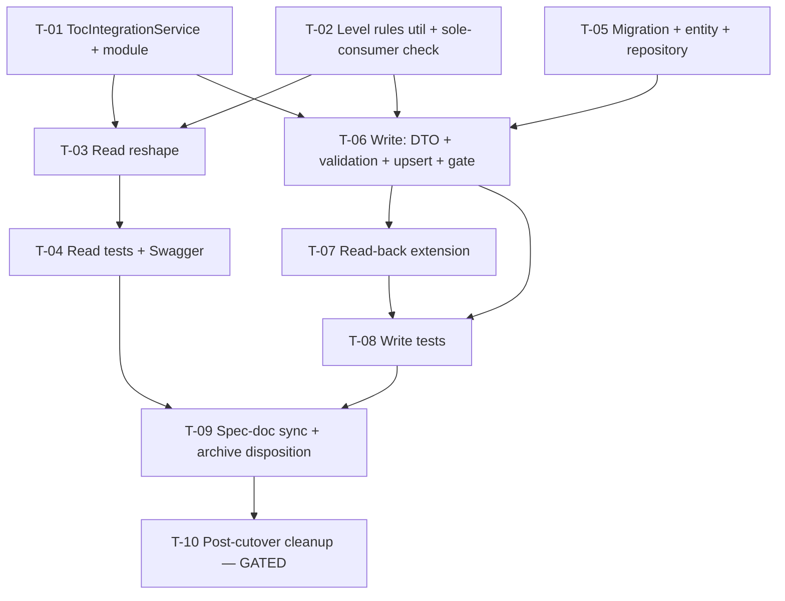

# Tasks — Bilateral module / ToC Mapping v2 (lambda-toc integration)

> **SDD spec.** Follows [`docs/specs/general-setup/task.md`](../../general-setup/task.md).
> Inputs: [`./requirements.md`](./requirements.md), [`./design.md`](./design.md).
> Companion documents: [`./requirements.md`](./requirements.md), [`./design.md`](./design.md), [`./proposal.md`](./proposal.md).

---

## 1. Document control

| Field | Value |
| --- | --- |
| Spec id | 2026-06-toc-mapping-v2 |
| Module | bilateral-module |
| Status | Not started — pending Phase 3 approval |
| Owner | Eng: Juanca |
| Linked requirements | [`./requirements.md`](./requirements.md) |
| Linked design | [`./design.md`](./design.md) |
| Branch | `AC-1594-bilateral-module-v2` |
| Last updated | 2026-06-09 |

All commands run from `server/researchindicators/`. Verification baseline per task: `npm run lint` + `npm test` green; new handlers visible in `/swagger`.

---

## 2. Dependency graph

Critical path for the 2026-06-11 testing demo: **T-01 → T-03 → T-04** (read flow; FE integrates against it). T-05/T-06 can proceed in parallel after T-01/T-02.

---

## 3. Task list

### T-01 — TocIntegrationService: lambda-toc client with cache + resilience

- **Requirements covered:** R-BIL-090 (sourcing), NFR-BIL-090, NFR-BIL-091, NFR-BIL-092
- **Design refs:** §3.1, §6.2
- **Files touched (intended):**
  - `src/domain/tools/toc-integration/toc-integration.module.ts` (new)
  - `src/domain/tools/toc-integration/toc-integration.service.ts` (new)
  - `src/domain/tools/toc-integration/dto/toc-integration.types.ts` (new)
  - `src/domain/tools/toc-integration/toc-integration.service.spec.ts` (new)
  - env utils target for `ARI_TOC_INTEGRATION_HOST` + `.env.example`
- **Description:** New tool module calling `GET {host}/api/toc-integration/toc/results/category/{LEVEL}/initiative/{SP}`. In-memory cache TTL 5 min keyed `${sp}:${level}`; warm-stale-on-failure with warn log; cold-cache → 503; `{"response":[]}` cached as valid empty; `getTocResultsForSps(sps, levels)` parallel fan-out; missing host → 503. Types mirror handoff §2 verbatim (`unit_messurament` included).
- **Implementation notes:**
  - Copy the resilience skeleton from `prms-toc.service.ts`; do not import from it.
  - Singleton scope (D-PI-12 constraint); no request-scoped injects.
  - Unknown-level responses are empty 200s upstream — never derive level validity here (design §6.2).
- **Acceptance / done check:**
  - [x] Spec covers: TTL expiry (fake timers), warm-stale + warn, cold 503, empty-payload caching, fan-out call count ≤ sps×levels, missing env.
  - [x] `npm test -- toc-integration` green; lint green.
- **Dependencies:** none
- **Estimated effort:** M
- **Status:** done — 2026-06-09, Reviewer PASS attempt 1 (see `execution.md`)
- **Skills:** `nestjs-expert`, `error-handling-patterns`

### T-02 — Level rules util + version constant + sole-consumer verification

- **Requirements covered:** R-BIL-091, R-BIL-097 (constant), risk R-2
- **Design refs:** §3.1, §6.1, D-V2-3, D-V2-7
- **Files touched (intended):**
  - `src/domain/entities/bilateral/utils/toc-level-rules.util.ts` (new)
  - `src/domain/entities/bilateral/utils/toc-level-rules.util.spec.ts` (new)
- **Description:** Pure util exporting `resolveResultTypeKey(indicatorId)`, `allowedLevelsFor(key)` (capacity_sharing→[OUTPUT], innovation_dev→[OUTPUT], policy_change→[OUTCOME,EOI], else []), and `MAPPABLE_LIVE_VERSION = 2026`. Also: verify and record (in §7 below) that the STAR FE is the only consumer of `hlos-indicators` (grep envelope keys across repos + check API consumers) before T-03 lands.
- **Acceptance / done check:**
  - [x] Util spec covers all four rule rows incl. unknown type → `[]` (12 tests).
  - [x] Sole-consumer note recorded in §7 risks log with evidence (RB-2 closed).
- **Dependencies:** none
- **Estimated effort:** S
- **Status:** done — 2026-06-09, Reviewer PASS attempt 1 (see `execution.md`)
- **Skills:** `nestjs-expert`

### T-03 — Reshape `GET …/hlos-indicators` to the frozen FE envelope

- **Requirements covered:** R-BIL-090, R-BIL-091, R-BIL-097 (read flag)
- **Design refs:** §5 (read), §6.1, D-V2-2
- **Files touched (intended):**
  - `src/domain/entities/bilateral/bilateral.service.ts` (`getHlosIndicatorsForResult` rewrite)
  - `src/domain/entities/bilateral/dto/bilateral-hlos-indicators.response.dto.ts` (rewrite)
  - `src/domain/entities/bilateral/bilateral.module.ts` (import `TocIntegrationModule`)
- **Description:** Replace the (SP, AOW)-pair fan-out with `allowed_levels`-driven catalog assembly per design §6.1: rules util → version flag → SP chain (unchanged) → `getTocResultsForSps` → wire mapping (`aow_code`, `unit_of_measurement`, single 2026 target, `type_value` passthrough). `allowed_levels: []` or unmapped ⇒ `catalogs: []`, zero upstream calls. Drop `pairs`/`aow_status`/`no_aow_mappings` from the DTO. Leave `PrmsTocService` wiring compilable but unused (removed in T-10).
- **Acceptance / done check:**
  - [x] Manual smoke against testing/local with a mapped result returns the §5 shape; no `pairs` key. *(Covered by deep-equality service specs against handoff-parity fixtures; live smoke pending env access — verify alongside T-04 FE demo.)*
  - [x] R-BIL-090 AC.1–AC.5 and R-BIL-091 AC.1–AC.2 expressible against the implementation (tests land in T-04).
  - [x] Build green.
- **Dependencies:** T-01, T-02
- **Estimated effort:** M
- **Status:** done — 2026-06-10, Reviewer PASS attempt 1 (see `execution.md`)
- **Skills:** `nestjs-expert`, `api-design-principles`

### T-04 — Read-path tests + Swagger (FE demo gate)

- **Requirements covered:** R-BIL-090, R-BIL-091, NFR-BIL-091
- **Design refs:** §11
- **Files touched (intended):**
  - `src/domain/entities/bilateral/bilateral.service.spec.ts`
  - `src/domain/entities/bilateral/bilateral.controller.spec.ts`
  - `src/domain/entities/bilateral/bilateral.controller.ts` (Swagger annotations)
- **Description:** Update service/controller specs for the reshaped read: mapped (multi-SP, multi-level), unmapped, empty upstream catalog, `allowed_levels: []` (zero upstream calls asserted), `version_locked`, target resolution (with/without 2026 target). Fixtures = handoff §2 payloads (FE parity). Update `@ApiOperation`/`@ApiResponse` DTO annotations.
- **Acceptance / done check:**
  - [x] All R-BIL-090/091 ACs covered by passing tests; coverage ≥ 60% holds (global 80.0/70.7/80.8/79.8).
  - [x] `/swagger` renders the new response schema. *(Verified programmatically — typed `@ApiResponse` + `DECORATORS.API_MODEL_PROPERTIES_ARRAY` metadata asserted in controller spec; eyeball the rendered page alongside the FE demo.)*
  - [x] This task closing = read path ready for FE integration (2026-06-11 demo).
- **Dependencies:** T-03
- **Estimated effort:** M
- **Status:** done — 2026-06-10, Reviewer PASS attempt 1 (see `execution.md`)
- **Skills:** `nestjs-expert`

### T-05 — Migration + entity + repository for `result_pool_funding_toc_alignment`

- **Requirements covered:** R-BIL-092 (schema), R-BIL-095 (snapshot columns), data reqs §8
- **Design refs:** §4, D-V2-1
- **Files touched (intended):**
  - `src/db/migrations/<timestamp>-createResultPoolFundingTocAlignment.ts` (new)
  - `src/domain/entities/bilateral/entities/result-pool-funding-toc-alignment.entity.ts` (new)
  - `src/domain/entities/bilateral/repositories/result-pool-funding-toc-alignment.repository.ts` (new)
  - `src/domain/entities/bilateral/bilateral.module.ts` (register)
  - datasource targets if entities are listed explicitly
- **Description:** Table per design §4 incl. generated `active_result_sp` + unique `idx_rpfta_active_result_sp` (pattern from migration `1779190000014`) and `idx_rpfta_result`. Repository methods: `findActiveByResultId`, `upsertForSp` (update-in-place or insert), `deactivateForSps`.
- **Acceptance / done check:**
  - [x] `npm run migration:run` applies; `npm run migration:revert` reverts cleanly. *(Verified live on dev DB 2026-06-10 — sole-pending check, apply, revert, re-apply; left applied for T-06.)*
  - [x] Inserting two active rows for the same (result, sp_code) fails on the unique index (manual or test). *(Live ER_DUP_ENTRY proof on `idx_rpfta_active_result_sp`; inactive duplicate allowed; test rows cleaned.)*
- **Dependencies:** none
- **Estimated effort:** M
- **Status:** done — 2026-06-10, Reviewer PASS attempt 1 (see `execution.md`)
- **Skills:** `nestjs-expert`

### T-06 — Write path: DTO + validation + per-SP upsert + cascade + version gate

- **Requirements covered:** R-BIL-092, R-BIL-093, R-BIL-094, R-BIL-095, R-BIL-097
- **Design refs:** §5 (PATCH), §6.3, D-V2-7, D-V2-8
- **Files touched (intended):**
  - `src/domain/entities/bilateral/dto/update-pool-funding-alignment.dto.ts` (`TocAlignmentInputDto`)
  - `src/domain/entities/bilateral/bilateral.service.ts` (`updateAlignment` extension)
  - `src/domain/entities/bilateral/bilateral.controller.ts` (Swagger body/errors)
- **Description:** Implement design §6.3 inside the existing transaction: 409 gate on `report_year_id !== 2026` (only when `toc_alignments` present); structural + catalog validation collecting `errors.toc_alignments[{sp_code, field, error}]` with the six error codes; atomic 400; per-SP independent upsert with snapshots on "Yes" / nulls on "No"; cascade deactivation for deselected SPs; legacy body (no `toc_alignments`) bypasses all of it. Preserve existing `_sp` recreate behavior, review-history entry, socket emit.
- **Acceptance / done check:**
  - [x] R-BIL-092 AC.1–AC.4, R-BIL-093 AC.1–AC.2, R-BIL-094 AC.1–AC.3, R-BIL-097 AC.1–AC.3 implementable and smoke-verified locally (5 smoke tests; exhaustive matrix in T-08).
  - [x] Legacy PATCH bodies behave byte-identically to before (all pre-existing updateAlignment suites pass with provider-stub-only diffs).
- **Dependencies:** T-05, T-02, T-01
- **Estimated effort:** L
- **Status:** done — 2026-06-10, Reviewer PASS attempt 1 (see `execution.md`)
- **Skills:** `nestjs-expert`, `error-handling-patterns`

### T-07 — Read-back: extend `AlignmentResponse` with `toc_alignments[]` + `version_locked`

- **Requirements covered:** R-BIL-096, R-BIL-095 (snapshot-sourced reads)
- **Design refs:** §5 (GET alignment), D-V2-5
- **Files touched (intended):**
  - `src/domain/entities/bilateral/bilateral.service.ts` (`getAlignment`)
  - response interface/DTO + Swagger
- **Description:** `getAlignment` (and the PATCH response, which reuses it) returns active ToC rows mapped to the frozen §5 read-back shape — snapshot columns only, `unit_messurament` exposed as `unit_of_measurement`, plus `version_locked`. Relay the frozen shape to the FE (comms note).
- **Acceptance / done check:**
  - [x] R-BIL-096 AC.1–AC.2 hold (GET ≡ PATCH response — PATCH returns `getAlignment(...)` directly; pinned by mechanism test).
  - [x] Read-back works with upstream mocked empty (R-BIL-095 AC.1 drift test — zero `TocIntegrationService` calls).
  - [x] FE relay note recorded in §7 log (RB-4).
- **Dependencies:** T-06
- **Estimated effort:** S
- **Status:** done — 2026-06-10, Reviewer PASS attempt 1 (see `execution.md`)
- **Skills:** `nestjs-expert`

### T-08 — Write-path + read-back tests

- **Requirements covered:** R-BIL-092…097 (all ACs), NFR-BIL-090 (validation-path 503)
- **Design refs:** §11
- **Files touched (intended):**
  - `src/domain/entities/bilateral/bilateral.service.spec.ts`
  - `src/domain/entities/bilateral/bilateral.controller.spec.ts`
  - repository spec for the new repository
- **Description:** Tests for: per-SP independence (SP03 untouched at row level), "No" persistence, single-active-row upsert, cascade + fresh re-add, all six per-alignment 400 codes, `unknown_sp_codes` legacy contract, 409 gate + legacy-body bypass, snapshot persistence + drift read-back, validation-time cold-cache 503 persists nothing, role denial (403).
- **Acceptance / done check:**
  - [x] Every R-BIL-092…097 AC has a passing test; `npm test` + coverage threshold green (284 suites / 1660 tests; coverage 80.2/71.5/80.9 vs 60 floor; AC→test map in `execution.md`).
- **Dependencies:** T-06, T-07
- **Estimated effort:** M
- **Status:** done — 2026-06-10, Reviewer PASS attempt 1 (see `execution.md`)
- **Skills:** `nestjs-expert`

### T-09 — Spec-doc sync + archive disposition (handoff §6)

- **Requirements covered:** R-BIL-098 (preparation), proposal §5.8
- **Design refs:** §12 (rollout/comms)
- **Files touched (intended):**
  - `docs/specs/bilateral-module/{requirements,design,tasks}.md` (parent sync: mark superseded read shape)
  - `docs/specs/bilateral-module/indicator-mapping/` (archive banner on ToC-read material)
  - `docs/specs/bilateral-module/pending-items/` (archive banner on AOW-pair sections; T-15.12 lineage note)
- **Description:** Mark the retired (SP, AOW) read contract as superseded by this spec; keep contract/SP-resolution/alignment GET-PATCH material live. Record OQ-V2-9 resolution and D-V2-* decisions where the parent docs reference the old envelope. No code.
- **Acceptance / done check:**
  - [x] No parent doc presents `pairs[]`/`aow_status` as current behavior; banners link here (9 docs bannered/synced; Reviewer grep-verified; constitutional docs needed nothing).
- **Dependencies:** T-04, T-08
- **Estimated effort:** S
- **Status:** done — 2026-06-10, Reviewer PASS attempt 1 (see `execution.md`)

### T-10 — Post-cutover cleanup: delete the PRMS pair path — **GATED**

- **Requirements covered:** R-BIL-098
- **Design refs:** §12 step 3
- **Gate:** do NOT start until a cutover-verified note (FE integration green in testing + cache behavior observed) is recorded in §7 below.
- **Files touched (intended):**
  - delete `src/domain/tools/prms-toc/` (module, service, types, spec)
  - remove `ARI_PRMS_TOC_HOST` from env utils + `.env.example`
  - `bilateral.service.ts` / `bilateral.module.ts` — remove dead wiring + AOW fan-out remnants
- **Description:** Isolated removal PR. `getAreasOfWorkBySp` and `ClarisaCgiarEntitiesService` stay (only this flow's usage goes).
- **Acceptance / done check:**
  - [ ] `grep -r "ARI_PRMS_TOC_HOST\|PrmsTocService" src/` returns nothing; build/lint/test green.
  - [ ] Lands as its own PR (R-BIL-098 AC.2).
- **Dependencies:** T-09 + cutover gate
- **Estimated effort:** S
- **Status:** todo (blocked by gate)

---

## 4. Requirements coverage matrix

| Requirement | Tasks |
| --- | --- |
| R-BIL-090 | T-01, T-03, T-04 |
| R-BIL-091 | T-02, T-03, T-04 |
| R-BIL-092 | T-05, T-06, T-08 |
| R-BIL-093 | T-06, T-08 |
| R-BIL-094 | T-06, T-08 |
| R-BIL-095 | T-05, T-06, T-07, T-08 |
| R-BIL-096 | T-07, T-08 |
| R-BIL-097 | T-02, T-06, T-08 |
| R-BIL-098 | T-09, T-10 |
| NFR-BIL-090/091/092 | T-01, T-04, T-08 |

---

## 5. Testing expectations

Per template §5: lint + unit green per task; migration forward/revert verified in T-05; Swagger checked in T-04/T-06/T-07. Fixtures mirror handoff §2 so backend tests and FE Jest fixtures stay contract-identical. Global 60% coverage threshold unchanged.

---

## 6. Execution conventions

- Branch: continue on `AC-1594-bilateral-module-v2`; one PR per task where practical; squash on merge.
- Commit style: `<type>(<module>): <subject>` with `[SPEC:bilateral-module]`/task tag as in recent history (e.g. `feat(bilateral-module): T-01 toc-integration service`).
- Never edit merged migrations; never `--no-verify`.

---

## 7. Risks & blockers log

| # | Date | Risk / Blocker | Mitigation | Owner | Status |
| --- | --- | --- | --- | --- | --- |
| RB-1 | 2026-06-09 | lambda-toc DNS resolution caveat (needed 8.8.8.8 locally) | Flag to infra before testing deploy; warm-cache resilience absorbs blips | Juanca | open |
| RB-2 | 2026-06-09 | Sole-consumer assumption for in-place reshape | **Verified 2026-06-09 (T-02):** server-side, `hlos-indicators` + `aow_status`/`no_aow_mappings` are referenced only inside `src/domain/entities/bilateral/` (controller/service/DTO + specs); client-side, only STAR FE surfaces (`api.service.ts`, `hlo-selection-modal`, `pool-funding-alignment.interface.ts`, fixtures), all migrating in lockstep per the client's own toc-mapping-v2 spec. No third-party consumers. In-place reshape cleared. | Juanca | closed |
| RB-3 | 2026-06-09 | FE demo deadline 2026-06-11 | **Resolved 2026-06-10:** T-01→T-04 all landed; read path FE-ready (handoff-parity fixtures, Swagger schema wired). Remaining: human smoke on testing env + `/swagger` eyeball during the demo window. | Juanca | closed |
| RB-4 | 2026-06-10 | **FE relay (D-V2-5), pending send** — read-back + write contracts frozen at T-06/T-07 | Relay to STAR FE: (1) extended `AlignmentResponse` — `version_locked` + snapshot-sourced `toc_alignments[]` (11 fields, `unit_of_measurement` renamed from `unit_messurament`, `quantitative_contribution` as JSON number, active rows `sp_code` ASC, `[]` when result ineligible), PATCH response ≡ GET; (2) hlos read coerces upstream null `description`/`unit_of_measurement`/`type_value` to `''`; (3) PATCH errors — 400 `errors.toc_alignments[{sp_code,field,error}]` (six codes; `missing_required_fields` one entry per missing field), 409 keyed by `errors.code: 'toc_mapping_version_locked'`. Wire examples in `execution.md` T-06/T-07. | Juanca | open |
| RB-4 | 2026-06-09 | OQ-V2-2/3/5/6 pending BA | Build assumptions recorded (requirements §11–12); none block build | BA via Juanca | open |

---

## 8. Done definition

- [x] T-01…T-09 done (T-10 separately gated on cutover verification). *(Completed 2026-06-10; every task Reviewer PASS attempt 1.)*
- [x] All R-BIL-090…097 ACs checked (T-04/T-08 test matrices); R-BIL-098 prepared (T-09) — execution (T-10) pending the cutover gate.
- [ ] Coverage green; Swagger current; migration reverts cleanly.
- [ ] Frozen read-back shape relayed to the STAR FE; OQ statuses relayed to BA.
- [ ] Rollout note (date, owner, backout = revert PR + `migration:revert`) recorded here.
