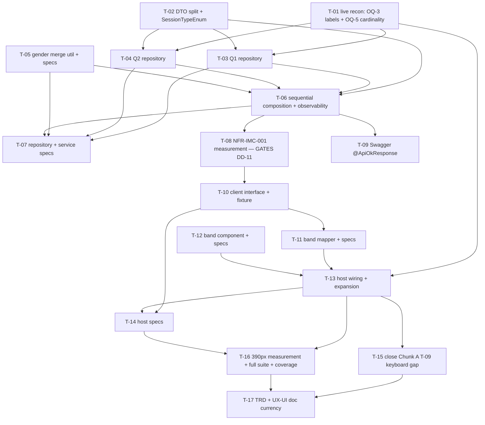

# Tasks — Project Dashboard / Indicator-metadata charts

- **Module:** project-dashboard (STAR client) + agresso (server reports)
- **Spec id:** 2026-07-indicator-metadata-charts
- **Status:** ✅ **complete — all 17 tasks done (2026-07-31)**, each with a Reviewer PASS recorded in [`execution.md`](./execution.md). OQ-3, OQ-5 and OQ-6 all closed. **Two owner-owned items remain outside the task list** — the **DC-8 visual check** and the product-owner acknowledgement (§8) — which is by design: `requirements.md` §9 states the spec is not done when the tasks are done. *(This line read "in-progress — T-01 done; T-02 … T-17 todo" until 2026-07-31, sixteen tasks after it stopped being true. Corrected at `/akili-validate`, recorded rather than silently overwritten — a stale header is what `/akili-resume` would have re-dispatched the whole spec from, and it is the same bookkeeping-drift class T-14's own status line already demonstrated once.)*
- **Owner:** d.casanas@cgiar.org
- **Linked requirements:** [`./requirements.md`](./requirements.md)
- **Linked design:** [`./design.md`](./design.md) — **revision 4**
- **Linked judgment:** [`./judgment.md`](./judgment.md) — 3 rounds, terminal receipt **`ESCALATED ⚠️`**
- **Visual reference:** [`./mockup/index.html`](./mockup/index.html) — measured at 500 / 768 / 1440 px; **390 px outstanding** (T-16)
- **Budget (tripwire):** design §13 says **16 tasks · ~1,580 LOC · 2–3 review rounds**. This list is **17 tasks · ~1,600 LOC** — see §9 for the declared delta and its single cause.
- **Last updated:** 2026-07-31

> **Two provenance warnings that change how this list should be read.**
>
> 1. **`design.md` revision 4 carries no judgment warrant.** Judgment Day terminated **ESCALATED** with one confirmed SEVERE live; the remedy plus three warnings were applied afterwards under owner authorisation, outside the judged lineage (`judgment.md`, Post-terminal record). The recurring failure mode across three rounds was *a correction record asserting more than the source supports*. **Treat the first Reviewer pass of `/akili-execute` as the missing audit** — especially on DD-8 / §6.2 (the gender merge) and DD-11 (sequential composition), the two places the lineage kept breaking. Recorded as **RB-1**.
> 2. **DD-11 is contingent, not settled.** Its acceptance depends on the NFR-IMC-001 measurement, which is **T-08 and is ordered before all client work on purpose**. A breach invalidates sequential composition and forces `Promise.all` **plus** an explicit `poolSize` change — an architecture change, not a tolerance to absorb. Discovering that after the client is built is the expensive path.

---

## 1. Task numbering

`T-01` … `T-17` within this spec. **Higher numbers do not imply higher priority** — but in this list the numbering *does* follow the intended execution order, because two ordering constraints are non-negotiable (§2).

**`T-15` is the carry-forward of Chunk A's deferred `T-09`.** It exists because **OQ-6 was resolved by the owner on 2026-07-30 as *pull T-09 in and close it***. It is not an advisory inherited on agent initiative — `/akili-execute` §2.4 forbids that route, and the owner's explicit decision is what makes it in scope. See its entry for the **DD-6 tension it creates**, which is the one thing about this pull-in that is not free.

Each task maps to at least one `R-IMC-*` / `NFR-IMC-*` id, is small enough to land inside one PR, and carries an observable done check plus a **no-pass clause**.

## 2. Dependency graph

**Two non-negotiable ordering constraints:**

- **The latency measurement (T-08) lands before any client work.** It is the gate on DD-11 (design §1, §11; `judgment.md` standing instruction). Sequencing it at the end converts an architecture decision into late rework across two packages.
- **Every spec lands with the behaviour it gates, never later.** T-05's specs ship inside T-05; T-07 ships with the repositories; T-11/T-12 carry their own specs; T-14 lands with T-13's PR. **KZ-001 has recurrence 5** — the highest in the log — and every instance of it started as "we'll add the spec in the next task".

**Parallelisable:** `T-02` and `T-05` are independent (DTO surface vs. pure util). `T-12` is independent of `T-10`/`T-11` (band chrome is presentational). Everything else is a chain.

---

## 3. Task list

### T-01 — Live-environment reconnaissance: close OQ-3, answer OQ-5

- **Requirements covered:** enables R-IMC-001 AC.3, R-IMC-002; scopes NFR-IMC-002 · closes `requirements.md` **OQ-3**, answers **OQ-5**
- **Files touched (intended):** none — this task produces **evidence recorded in `execution.md`**, not code
- **Description:** Two questions cannot be answered from the repository and both gate later tasks. **OQ-3:** which label column to read for readiness (`clarisa_innovation_readiness_levels.level` vs `.name`) and for maturity (`maturity_levels.name` vs `.full_name`). Both columns exist; only live rows say which is the human-readable label. **OQ-5:** the row count of the three **CLARISA-synced** lookups (`clarisa_innovation_readiness_levels`, `clarisa_innovation_types`, `clarisa_innovation_characteristics`), which are sync-populated and not seeded — this decides how many metadata cards exceed 5 categories, and therefore how much expansion surface (and T-15 surface) this spec actually creates.
- **Implementation notes:**
  - Inspect **actual rows**, not just the schema: `SELECT id, level, name FROM clarisa_innovation_readiness_levels ORDER BY id;` and the equivalent for maturity, plus `SELECT COUNT(*)` on the three CLARISA lookups.
  - The IRL scale is 0–9, so readiness > 5 categories is the expected answer — **but expected is not measured.** Record the actual number.
  - The five seeded lookups (`session_formats`, `session_types`, `session_lengths`, `gender`, `degrees`) need **no** confirmation: append-only migration `1727119632564-InsertDataControl.ts` asserts every id (`requirements.md` A-1/A-2, design DD-4). Do not re-verify them — revision 1's "verify enums against live rows" task was removed for exactly this reason.
  - **There is no `## Local Environment` contract in `docs/infrastructure.md`** (verified 2026-07-30 — the file has no such section). The Leader must resolve the database route with the owner **before** spawning this task. Recorded as **RB-2**.
- **Acceptance / done check:**
  - [ ] The chosen label column for readiness and for maturity is recorded in `execution.md` **with the sample rows that decided it**, and OQ-3 is struck in `requirements.md` §10 and `design.md` §14.
  - [ ] The three CLARISA row counts are recorded as **numbers**, and the list of which of the 10 charts exceed 5 categories is written down — T-13 and T-15 both consume it.
  - [ ] If a lookup is empty in the environment used, that is stated as **"unknown, environment not representative"** — not as "≤ 5".
- **Evidence that does NOT count:** reading the entity decorator or a migration to infer a label column — both columns exist in the schema, which is precisely why the question is open. **An empty or seed-only database is not evidence about a sync-populated table**; reporting "0 rows, therefore no expansion needed" would silently disarm T-15 and DC-13. If no representative environment is reachable, the honest outcome is **inconclusive**, and T-13 must then implement the expansion contract unconditionally (which design §7.2 requires anyway) rather than skipping it.
- **Dependencies:** none
- **Effort:** S · **Skills:** none (investigation)
- **Status:** **done — 2026-07-30.** See [`execution.md`](./execution.md) § T-01. **Executed inline by the Leader, so it carries no independent Reviewer audit** — mitigated by the scripts being read-only and reproducible.
- **Consumed by later tasks:**
  - **Join map + label columns → `requirements.md` §4.1**, now amended with an executed **Join column** column. **The join column is not uniformly `id`:** `clarisa_innovation_types` joins on **`code`**, the seven seeded lookups on `<table>_id`, and **`gender.id` does not exist**. T-03/T-04 must read §4.1, not assume `.id`.
  - **Label decisions:** readiness `CONCAT(level,'. ',name)` · maturity `full_name` · **`policy_stage` `description`, not `name`** (its `name` is only `"Stage 1"` — a third OQ-3 case nobody had asked about).
  - **OQ-5 answered:** readiness **10** categories, types 4, characteristics 4 → **exactly one card of ten engages the expansion contract.** T-13 implements it unconditionally; T-14's DC-13 boundary test has a real subject.
  - **All 10 joins executed successfully** against `alliancereportingdb`, which substantially de-risks T-03/T-04 — but **does not discharge T-03's real-schema gate** (these were plain grouped joins; the CTE-across-UNION pattern of **RB-3** is still unexecuted).
  - **Two design claims now measured, not argued:** the R-IMC-006 conjunction is worth **54 → 36 rows** (the wrong filter over-counts by 18 from stale `degree_id`), and group-format gender contributes **6,057 M / 31,436 F** against individual's 99 records — so DD-8's prohibited rule would have discarded ~37,000 reported participants, not merely degraded the chart. T-05's group-only fixture is gating a defect worth three orders of magnitude.
  - **T-08 dataset recorded:** `results` 14,647 · innovation 939 · oicr 127 · policy 208 · capacity 1,701 — owner-confirmed representative, recorded so the judgement is checkable.

---

### T-02 — DTO surface: base/full split, metadata section DTOs, `SessionTypeEnum`

- **Requirements covered:** R-IMC-007 (AC.1, AC.2, AC.4), R-IMC-012 AC.1 (partial — `@ApiProperty`) · design DD-3, DD-4
- **Files touched (intended):**
  - `server/…/agresso-contract/dto/reports-indicator-metadata.dto.ts` *(new)*
  - `server/…/agresso-contract/dto/reports-full.dto.ts` *(modified)*
  - `server/…/agresso-contract/repositories/agresso-contract.repository.ts` *(modified — **signature only**)*
  - `server/…/session-types/enum/session-type.enum.ts` *(new)*
- **Description:** Create `MetadataCountDto` (`{ id: number; name: string; count: number }`) and the 10 section fields, then split `reports-full.dto.ts` into `ContractBaseReportsDto` (the 7 existing fields) and `ContractFullReportsDto extends` it (+10). The existing repository's return type becomes `ContractBaseReportsDto` — **its body is not touched**. Add `SessionTypeEnum { TRAINING = 1, ENGAGEMENT = 2 }`.
- **Implementation notes:**
  - The split exists because "byte-for-byte unchanged" was unachievable: 10 new required fields break the 7-property return literal with `TS2739` (DD-3). The six existing sections stay **structurally** protected; the merge step is **test**-gated (T-07), not structurally guaranteed — do not claim otherwise.
  - **Do not create `SessionFormatEnum` or `SessionLengthEnum`.** They already exist (`session-formats/enums/session-format.enum.ts`, `session-lengths/enum/session-lengths.enum.ts`) and are imported. Revision 1 would have created duplicates (DD-4).
  - `SessionTypeEnum` carries a doc-comment citing seed migration `1727119632564` as the authority for its ids, following `DegreesEnum`'s existing convention.
  - `@ApiProperty` on every new field — necessary but **not sufficient** for R-IMC-012 AC.1; T-09 owns the part that makes the schema actually render.
- **Acceptance / done check:**
  - [ ] `ContractFullReportsDto` exposes the 7 original field names **unchanged in name and type**, inherited rather than re-declared.
  - [ ] All 10 new fields are typed `MetadataCountDto[]` and are **non-optional** — the contract is "always an array, empty rather than absent or null" (R-IMC-007 AC.2).
  - [ ] `agresso-contract.repository.ts` diff is the return type and its import **only** — zero body lines changed.
  - [ ] `npm run lint` clean; `npm run build` compiles with no `TS2739`.
- **Evidence that does NOT count:** a green build. The build passes if the fields are declared optional (`?`) — which would let a later task ship `undefined` sections and satisfy the compiler while breaking R-IMC-007 AC.2 for every consumer. Assert the **non-optional** shape by construction (the T-07 spec asserts the runtime `[]`).
- **Dependencies:** none
- **Effort:** S · **Skills:** `nestjs-expert`, `api-design-principles`
- **Status:** **done — 2026-07-30, Reviewer PASS attempt 1.** See [`execution.md`](./execution.md) § T-02.
- **Consumed by later tasks:**
  - `MetadataCountDto` (`{ id, name, count }`) and `IndicatorMetadataSectionsDto` live in `agresso-contract/dto/reports-indicator-metadata.dto.ts`. `ContractFullReportsDto extends ContractBaseReportsDto implements IndicatorMetadataSectionsDto`.
  - **The 10 field names are now fixed and Reviewer-verified character-for-character** against design §5: `innovation_nature`, `innovation_type`, `innovation_readiness`, `oicr_maturity`, `policy_type`, `policy_stage`, `session_format`, `session_type`, `gender_distribution`, `degree`. T-03/T-04/T-06 populate these; T-10 mirrors them client-side.
  - **`implements` makes optionality a compile error**, not a convention — if T-06 needs an intermediate shape, do not relax it there.
  - `SessionTypeEnum { TRAINING = 1, ENGAGEMENT = 2 }` at `session-types/enum/session-type.enum.ts`, values verified against migration `1727119632564` by the Reviewer. **Import the pre-existing `SessionFormatEnum` / `SessionLengthEnum`** — do not create duplicates (DD-4).
  - **Sequencing risk for T-06:** after T-02, `ContractFullReportsDto` is referenced by **nothing** in `server/src`. The enriched contract exists only as a type declaration until T-06 composes it — a slip there leaves 10 fields declared and never populated, with nothing failing.
  - **Known citation error to fix on the next touch of this file** (owner-escalated, not folded into any task): the doc-comment at `reports-indicator-metadata.dto.ts:31` attributes *"Evidence that does NOT count"* to `design.md` DD-3; it is in `tasks.md` § T-02.

---

### T-03 — Q1: simple-indicator union repository (6 sections, CTE-bound)

- **Requirements covered:** R-IMC-001 (all AC), R-IMC-002 (all AC), R-IMC-003 (all AC) · design §6.1, DD-1
- **Files touched (intended):** `server/…/agresso-contract/repositories/indicator-metadata-reports.repository.ts` *(new)*
- **Description:** New repository whose first method issues **one** query: a CTE wrapping `buildPrimaryContractResultsSubquery()` (`agresso-contract.repository.ts:642`), then **6 UNION branches** over `result_innovation_dev`, **`result_oicrs`** and `result_policy_change`, producing the sections `innovation_nature`, `innovation_type`, `innovation_readiness`, `oicr_maturity`, `policy_type`, `policy_stage`. Group the returned rows into sections by the `section` discriminator.
- **Implementation notes:**
  - **The CTE is load-bearing, not stylistic.** It binds the contract id **once per query** instead of once per branch, which structurally removes DC-12: a misplaced positional parameter binding a contract id into a lookup-id comparison returns **zero rows instead of erroring**. The repository's own precedent is at `:766-769`.
  - **Table names — four are irregular** relative to their folder: `gender`, `policy_stage` (singular), `maturity_levels` (plural), **`result_oicrs`** (plural, folder is `result-oicr`). Revision 1 said `result_oicr`, which does not exist and would fail `ER_NO_SUCH_TABLE`. `requirements.md` §4.1 is the single source — and it was re-derived from `@Entity()` decorators, so if in doubt re-derive again rather than trusting any table.
  - **Uniform branch shape** `(section VARCHAR, id BIGINT, name TEXT, count BIGINT)` with the discriminator first, so rows bucket contiguously.
  - **`ORDER BY section, count DESC, id ASC` applied once to the union as a whole.** Per-branch ordering is either a syntax error or not guaranteed to survive the union in MySQL (W-3), and R-IMC-001's AC makes ordering a hard criterion — it must not be left to the optimizer.
  - Every branch: inner-join the CTE · filter the fact row `is_active = TRUE` (all four fact entities extend `AuditableEntity`) · **inner**-join the lookup, which excludes NULL metadata ids as a side effect and satisfies R-IMC-001 AC.2 without a separate predicate.
  - **Join columns and label columns come from `requirements.md` §4.1 as amended by T-01 — executed facts, not guesses. Do not assume `.id`:** charts 1, 3 and 4 join on `id`, **chart 2 joins `clarisa_innovation_types` on `code`**, and charts 5–10 join on `<table>_id`. Labels: readiness `CONCAT(level,'. ',name)`, maturity `full_name`, **`policy_stage` `description`** (its `name` is only `"Stage 1"`).
  - `COUNT(*)` is safe because all four fact tables are 1:1 with `results` (`result_id` is the PK on each) — **R-6**. If that ever stops being true this double-counts.
- **Acceptance / done check:**
  - [ ] All 6 sections are returned as arrays, **empty rather than absent**, from a contract with no results at all.
  - [ ] The query executes against a **real schema** without `ER_NO_SUCH_TABLE` / `ER_BAD_FIELD_ERROR` (R-IMC-003 AC.3) — the CTE-across-UNION-branches pattern is valid MySQL 8 but has **no precedent in this repository and has never been executed**, so this is a first run, not a re-run (**RB-3**).
  - [ ] Exactly **one** parameter bind for the contract id in the generated SQL.
  - [ ] `npm run lint` clean.
- **Evidence that does NOT count:** a spec over mocked query results — it proves the grouping code, not the SQL, and the two dominant defect classes here (wrong table name, mis-bound parameter) live entirely in the SQL. A branch that legitimately returns zero rows also proves nothing: **zero rows is exactly what a mis-bound parameter looks like.** T-07 owns the fixture that makes zero rows falsifiable; this task's own gate is a real-schema execution.
- **Dependencies:** T-01, T-02
- **Effort:** M · **Skills:** `nestjs-expert`, `systematic-debugging`
- **Status:** **done — 2026-07-30, Reviewer PASS attempt 1** (reviewed jointly with T-04 — they share one file). See [`execution.md`](./execution.md) § T-03 + T-04.
- **Consumed by later tasks:**
  - `IndicatorMetadataReportsRepository.getSimpleIndicatorSections(contractId)` returns `SimpleIndicatorMetadataSections` — a `Pick` of the 10-section DTO, so it cannot drift from the wire contract.
  - **RB-3 is discharged:** the CTE-across-UNION pattern executed against the real schema (~35–48 ms, 1 bind). No Pivot needed.
  - **§4.2 is now satisfied via the shared helper** — see RB-10. Q1 calls `buildPrimaryContractResultsScopeSql()`; do not reintroduce a local copy.

---

### T-04 — Q2: capacity-sharing union repository (7 branches → 4 sections)

- **Requirements covered:** R-IMC-004 (all AC), R-IMC-005 (AC.1, AC.2, AC.4, AC.6), R-IMC-006 (all AC) · design §6.1, §6.2, §6.3, DD-2, DD-8
- **Files touched (intended):** `server/…/agresso-contract/repositories/indicator-metadata-reports.repository.ts` *(modified — second method)*
- **Description:** The second and final query: one CTE, **7 UNION branches** over `result_capacity_sharing`, producing `session_format`, `session_type`, `degree`, and the **two raw shapes** that T-05's util merges into `gender_distribution` (`gender_individual` grouped by `gender_id`, plus three literal `gender_group` branches).
- **Implementation notes:**
  - **Gender group participation is three fixed columns, not rows**, so it cannot be grouped like the others. Emit **three explicit branches** carrying the seeded id *and* name as literals: `('gender_group', 1, 'Male', COALESCE(SUM(session_participants_male),0))`, Female→2, Non-binary→3. This is what gives every branch the uniform four-column shape (W-1).
  - `COALESCE(...,0)` on each participant column is R-IMC-005 AC.2 — a NULL column is **0 participants**, not a missing category.
  - **`gender_individual`** filters `session_format_id = SessionFormatEnum.INDIVIDUAL`, groups by `gender_id`, inner-joins `gender` (singular table).
  - **Degree is a two-condition conjunction** (R-IMC-006): `session_type_id = SessionTypeEnum.TRAINING` **AND** `session_length_id = SessionLengthEnum.LONG_TERM`, joined to `degrees`. It **must not** filter on `degree_id IS NOT NULL` — the form clears the field via `clearDegreeIdIfNotLongTerm` (`capacity-sharing.component.ts:85-93`), but historical rows switched away from long-term may retain a **stale** `degree_id`, and filtering on presence would count them.
  - **Resolve Training by id, not by name.** Revision 1 resolved it by lookup name on the false premise that no id was asserted anywhere — seed migration `1727119632564` line 9 asserts `session_types (1,'Training')`. `session_types.name` is `TEXT`; a label edit would **silently empty the Degree chart with no error**, whereas a wrong id is caught by T-07's fixture.
  - **Join columns (T-01, executed):** `gender.gender_id` — **`gender.id` does not exist**; `session_formats.session_format_id`; `session_types.session_type_id`; `session_lengths.session_length_id`; `degrees.degree_id`. All five confirmed against live rows, and the seeded ids match migration `1727119632564` exactly.
  - Same union-level `ORDER BY` as T-03 — with the explicit exception that `gender_distribution`'s final order **cannot** come from here (T-05 owns it, because summing happens after SQL).
- **Acceptance / done check:**
  - [ ] All 7 branches emit the identical four-column shape; the union executes against a real schema.
  - [ ] The degree branch's generated SQL contains **both** conditions joined by `AND`.
  - [ ] The three `gender_group` branches return a row **each**, with `0` where the participant column is NULL — not an absent row.
  - [ ] Exactly one contract-id bind. `npm run lint` clean.
- **Evidence that does NOT count:** a degree fixture that contains only Training + Long-term rows. It passes whether or not the conjunction was implemented, so it proves nothing — **DC-2 requires an Engagement row and a Short-term row that both carry a `degree_id` and must both be excluded.** T-07 owns that fixture; a "green" degree assertion without both rows present is decorative.
- **Dependencies:** T-01, T-02
- **Effort:** M · **Skills:** `nestjs-expert`, `systematic-debugging`
- **Status:** **done — 2026-07-30, Reviewer PASS attempt 1** (reviewed jointly with T-03). See [`execution.md`](./execution.md) § T-03 + T-04.
- **Consumed by later tasks:**
  - `getCapacitySharingMetadata(contractId)` returns `CapacitySharingMetadataSections`: the three real sections (`session_format`, `session_type`, `degree`) `Pick`ed from the DTO, **plus the two intermediate raw shapes** `gender_individual` and `gender_group`, which are **not payload fields** — they are T-05's util inputs. Do not expose them on the wire.
  - **T-06 must feed both raw shapes to `mergeGenderDistribution()`** to produce `gender_distribution`. The types are structurally identical to `MetadataCountDto`, so the handoff is assignable — **confirm it explicitly rather than assuming** (T-05's carried note).
  - **T-06: do NOT add a second debug log.** Both methods already emit a `LoggerUtil._debug` line with `elapsedMs`, `totalRows` and per-section counts, which satisfies design §9 where timing is actually attributable and pre-satisfies T-06's own logging acceptance box. **T-08 should read these lines as its measurement source.**
  - **T-07 still owes the DC-2 fixture.** The degree conjunction was proven on *live* production data (`G228`: loose 6 → strict 2; `A1618`: an Engagement/MSc row excluded; global 54 → 36), which is stronger evidence than a fixture — but **those contracts are not a test asset** and cannot gate CI.
  - **T-10 must not assume non-null labels.** Three label columns are nullable in their entities (`clarisa_innovation_types.name`, `clarisa_innovation_characteristics.name`, `policy_stage.description`). Live rows are populated and no AC requires a fallback, so the SQL was left alone — but if a fallback is ever wanted, prefer it client-side over a `COALESCE` that would mint an unlabelled category.
  - `if (!bucket) continue;` is unreachable (section values are SQL literals) and **will read as an uncovered branch in T-07's coverage run** — same caveat the gender util carries.

---

### T-05 — Gender merge util (pure) + its specs

- **Requirements covered:** R-IMC-005 (AC.1, AC.2, AC.3, AC.4, **AC.6**, **AC.7**) · design §6.2, DD-2, DD-8 · gates **DC-3**
- **Files touched (intended):**
  - `server/…/agresso-contract/utils/gender-distribution.util.ts` *(new)*
  - `server/…/agresso-contract/utils/gender-distribution.util.spec.ts` *(new)*
- **Description:** A pure function with no `DataSource` that merges T-04's two raw gender shapes into `gender_distribution`: a **symmetric sum over the union of `gender_id`s**, dropping zero totals, then **re-sorted `count DESC, id ASC`**.
- **Implementation notes:**
  - **Key on `gender_id`, never on normalised names.** The seed migration fixes 1/2/3 permanently; a `gender.name` label edit would silently break a name match (S-3).
  - **Symmetry is the whole point, and it is where this design failed review three times.** Neither side is subordinate. An id present on **only one side is carried through unchanged**. **Do not reintroduce a "skip the group row if it matches no individual row" rule** — an earlier revision carried one, and because this util is pure and has no access to the `gender` table, the only thing it could match against is the individual result, which is *empty for a group-only project*. That rule returns an **empty Gender chart for every group-only project despite real reported participants** (DD-8, prohibited by §6.2).
  - **Re-sorting is required, not incidental.** `gender_distribution` is the one section whose counts are produced *after* SQL, and addition reorders the ranking: SQL emitting Female(5) before Male(1) is wrong the moment a group branch adds 20 to Male (AC.7). The union-level `ORDER BY` cannot reach this section.
  - Zero-total categories are dropped (AC.3), which is also what keeps any unexpected pass-through id invisible unless it carries real data.
- **Acceptance / done check:**
  - [ ] 3 individual Male records + one group record with `session_participants_male = 10` → **Male = 13** (AC.1).
  - [ ] **A group-only fixture (zero individual rows) yields the summed counts for every category with a non-zero total, zero-total categories dropped per AC.3** (AC.6; wording corrected 2026-07-31 — see `execution.md` § *Owner escalation*). This is the assertion that fails a subordinating merge and passes nothing else.
  - [ ] NULL participant column → treated as `0`; a category whose total is 0 is **absent** from the output (AC.2, AC.3).
  - [ ] No double-counting in either direction (AC.4).
  - [ ] An id present on only one side is carried through unchanged (DD-8).
  - [ ] **A fixture where summing reorders the ranking** proves the output is sorted `count DESC, id ASC` (AC.7).
  - [ ] `npm run lint` clean; the spec is **mutation-killable** — delete the re-sort, see the AC.7 case go red; make the merge left-biased, see the group-only case go red. Verify both reds, then restore.
- **Evidence that does NOT count:** a single mixed individual+group fixture. **A merge that subordinates group rows to individual rows passes it and fails only the group-only case** — that is precisely the defect this spec exists to catch, so a suite without the group-only fixture is green over the bug (**KZ-001**, recurrence 5). Equally: asserting the output *contains* the right counts without asserting **order** leaves AC.7 ungated.
- **Dependencies:** none
- **Effort:** M · **Skills:** `nestjs-expert`
- **Status:** **done — 2026-07-30, Reviewer PASS attempt 1.** See [`execution.md`](./execution.md) § T-05.
- **Consumed by later tasks:**
  - Entry point is `mergeGenderDistribution(individualRows, groupRows)` in `agresso-contract/utils/gender-distribution.util.ts`. It is pure, has no `DataSource`, and expects both sides already bucketed to `{ id, name, count }`.
  - **T-04 owes it the shape it assumes:** `gender_individual` **grouped by `gender_id` in SQL** (so "3 individual Male records" arrives as one row with `count: 3`), plus the three literal `gender_group` rows. The AC.1 fixture models that contract — if T-04 does not group, the fixture is testing something else.
  - **T-06 owes a reconciliation:** the util declares its own `GenderDistributionRow` because the scope fence forbade touching DTOs and T-02 had not landed. The two types are structurally identical, so TS assignability makes this free — **but confirm it explicitly or add a thin adapter; do not assume it.**
  - **T-06 must not widen the util's input surface without revisiting `toSafeCount`** — it guards `null`/`undefined` but not `NaN`, and a `NaN` drops the whole category including the valid side (advisory, `execution.md` § T-05).
  - **The util's 30-line doc-comment must survive any refactor verbatim.** It is the only thing explaining why the symmetry matters, and therefore the real guard against a future reader collapsing the two `accumulate` calls back into the prohibited subordinating merge.
  - Branch coverage on this file sits at **70 %** because the defensive guards are unreachable by design. **Do not read that as a coverage signal.**

---

### T-06 — Sequential composition in the service + query observability

- **Requirements covered:** R-IMC-007 (AC.1, AC.2), NFR-IMC-001 (enables measurement) · design §3, §9, **DD-11**
- **Files touched (intended):**
  - `server/…/agresso-contract/agresso-contract.service.ts` *(modified)*
  - `server/…/agresso-contract/agresso-contract.module.ts` *(modified — provider registration)*
- **Description:** `getFullContractReports()` at `agresso-contract.service.ts:208-210` **already exists** as a one-line pass-through and is edited to compose: `await` the existing repository (step 1, 8 concurrent, body untouched), **then** `await` `IndicatorMetadataReportsRepository.getIndicatorMetadata()` (step 2, 2 concurrent), then merge into `ContractFullReportsDto`. Time and log both queries via `LoggerUtil` at debug with section group and row count.
- **Implementation notes:**
  - **The two steps must be awaited in sequence and must not be raced.** This is DD-11 and it is load-bearing: `Promise.all` here peaks at **10** concurrent connections against an un-configured pool whose mysql2 default limit is **10**, so one dashboard request monopolises every connection and everything else queues behind it. Sequential keeps peak at `max(8, 2) = 8` — **exactly today's value**, which is what removes the infrastructure prerequisite from this spec.
  - Revision 1 called this a "NEW composition seam". It is not new — it is an edit to an existing pass-through.
  - The debug logging is not decoration: it is the **source** for T-08's measurement and for attributing a slow aggregation to a specific query.
  - The merge is where R-IMC-007 AC.1 can break (DD-3 protects the six existing sections structurally but **not** the merge step). Spread the base result rather than re-listing its fields.
- **Acceptance / done check:**
  - [ ] The generated code path shows step 2 awaited **after** step 1 resolves — no `Promise.all` spanning both, no `.then` chain that overlaps them.
  - [ ] The response contains all 17 fields (`contract_id` + 16 sections), with the 7 original ones **identical in name, shape and content** to the pre-change response for the same contract.
  - [ ] Both queries emit a debug log line carrying elapsed ms and row count.
  - [ ] `npm run lint` clean; existing `agresso-contract.service.spec.ts` passes.
- **Evidence that does NOT count:** "the response has more fields, so composition works." That does not distinguish sequential from parallel composition — and parallel is the failure mode this task exists to avoid, one that is **invisible in the payload** and only shows up as pool exhaustion under concurrent load. Assert the ordering at the code level (and, if the mechanism allows, that the second repository is not invoked before the first resolves).
- **Dependencies:** T-02, T-03, T-04, T-05
- **Effort:** M · **Skills:** `nestjs-expert`, `error-handling-patterns`
- **Status:** **done — 2026-07-30, Reviewer PASS attempt 1.** See [`execution.md`](./execution.md) § T-06.
- **Consumed by later tasks:**
  - **DD-11's shape, settled with five citations:** step 1 is awaited to resolution, **then** step 2 runs `Promise.all([Q1, Q2])`. Peak `max(8, 2) = 8`. **Q1 ‖ Q2 is required by the design, not tolerated** — §3 annotates step 2 "2 concurrent", DD-1 says "two keeps step 2 at 2", DD-11's arithmetic is `max(8,2)`, and this task's own Description says "(step 2, 2 concurrent)". **Do not sequentialise step 2**: it would raise the bar T-08 must clear.
  - **T-08 — `T_metadata` is `max(Q1, Q2)`, NOT `Q1 + Q2`.** Step 2 is a `Promise.all`, and **no log line records step 2's own wall clock** — only each query's. Computing the metadata batch as a sum would inflate it and could **manufacture a false breach of a decision the spec says a breach invalidates**. Read the two existing `LoggerUtil._debug` lines and take the max.
  - **T-07 must EXTEND `agresso-contract.service.spec.ts`, never rewrite it.** §4 co-assigns that file to T-06 and T-07; T-06's assertions already landed there (sequencing, 17-field merge with the 7 base fields unchanged, gender merge/sort/drop-zero, no raw-shape leak, 9-section pass-through). **Do not touch or "consolidate" the `getFullContractReports — T-06 sequential composition (DD-11)` block** — its `callOrder` assertion is DD-11's only mechanical guard, and deleting it silently reopens the pool-exhaustion failure mode.
  - **T-07 owes two additions here** (both identified by T-06's review, ~6 lines each): **(a)** the **"step 2 = 2 concurrent" gate** — `callOrder` proves step 2 follows step 1 but **cannot distinguish `Promise.all([Q1,Q2])` from `await Q1; await Q2`** (proven: both emit the identical array), so the property DD-1's arithmetic and T-08's bound rest on is **ungated**; assert both Q1 and Q2 are *invoked* before either *resolves*. **(b)** a **service-level empty-payload case** — all 10 sections `[]` for a contract with no results (R-IMC-007 AC.2 at runtime). T-06 proved it on live data (`A1001`) but **not in CI**; all its fixtures are non-empty.
  - `IndicatorMetadataReportsRepository` is registered in `providers` but **not exported** — zero consumers outside the module. It injects only `DataSource`, so it **cascades no REQUEST scope** into `AgressoContractService`, which matters given that constructor's documented `forwardRef` hazard.
  - **T-05's carried type debt is discharged mechanically:** `GenderDistributionRow[]` → `MetadataCountDto[]` is assignable with no adapter, verified by a Reviewer-built type-probe rather than assumed.

---

### T-07 — Server specs: Q1/Q2 grouping, binding, scoping, ordering

- **Requirements covered:** R-IMC-001 … R-IMC-004, R-IMC-006, R-IMC-007 (AC.2, AC.3) · gates **DC-1, DC-2, DC-12**
- **Files touched (intended):**
  - `server/…/agresso-contract/repositories/indicator-metadata-reports.repository.spec.ts` *(new)*
  - `server/…/agresso-contract/agresso-contract.service.spec.ts` *(modified)*
- **Description:** Specs over seeded fixtures covering per-section grouping, NULL exclusion, primary-contract scoping, union-level ordering, the degree conjunction, and **parameter binding**.
- **Implementation notes:**
  - **The binding fixture must carry distinct, non-empty data in every branch.** A fixture where any branch is legitimately empty **cannot distinguish "no data" from "mis-bound parameter"** — both read as zero rows, and DC-12's whole hazard is that the mis-bind is silent.
  - The degree fixture must contain an **Engagement** row **and** a **Short-term** row that both carry a `degree_id` and must both be excluded (DC-2). Without both, the conjunction is unproven.
  - Include a **non-primary** result that must be excluded from every section (R-IMC-001 AC.4) — the scoping rule is inherited from `buildPrimaryContractResultsSubquery()` and no aggregation may invent its own.
  - Assert `[]` (not `null`, not absent) for a section with no data — R-IMC-007 AC.2 at runtime, complementing T-02's type-level guarantee.
  - Assert ordering explicitly: `count DESC, id ASC` within each section.
- **Acceptance / done check:**
  - [ ] Every one of the 10 sections has at least one grouping assertion, plus a NULL-exclusion assertion where the requirement names one.
  - [ ] The distinct-data-per-branch binding fixture exists and each branch's rows are asserted to land in **their own** section.
  - [ ] Non-primary exclusion asserted. Empty section returns `[]`.
  - [ ] `npm test` passes; `npm run test:cov` shows server global coverage **≥ 60 %** and not lower than before (NFR-IMC-004).
- **Evidence that does NOT count:** a passing suite whose fixture leaves any branch empty — see above; it is green over the exact defect DC-12 names. Also: asserting section **contents** while ignoring **order** leaves R-IMC-001's ordering AC ungated, and ordering here is a hard acceptance criterion, not a nicety.
- **Dependencies:** T-03, T-04, T-05, T-06
- **Effort:** L · **Skills:** `nestjs-expert`
- **Status:** **done — 2026-07-31, Reviewer PASS on attempt 2. 1 rework round consumed** (the run's first). See [`execution.md`](./execution.md) § T-07.
- **Consumed by later tasks:**
  - **The SQL-semantics gate is branch-position pinned.** Both queries' specs split the squashed SQL on `' UNION ALL '` and assert each branch's `'<section>' AS section` literal against its own `INNER JOIN … = f.<fk>` at a **fixed index**. **The indices are load-bearing:** a semantically neutral branch reorder, or a future `UNION ALL` inside the scope CTE, will redden up to 12 assertions. Both fail *closed*, so this is maintenance cost rather than a correctness risk — but anyone reordering branches must update the spec deliberately, not treat the reds as flaky.
  - **Why pinning and not a plain `toContain`:** a whole-SQL `toContain("'innovation_nature' AS section")` **passes under a cross-wire**, because both swapped literals still exist in the text. The Leader proved the unpinned version green (12/12) against a production-side swap; pinning is what makes it red.
  - **Known and accepted, not a hole:** within a `gender_group` segment the `<n> AS id, '<Label>' AS name` pairing is **not** anchored to its own `COALESCE(SUM(…))`, so swapping a label/id pair between those three branches would mislabel counts and stay green. This is **DC-4** (wrong-but-valid label mapping), which `requirements.md` §9 already declares has **no jest gate** — the spec accepted that class of risk before this task existed.
  - **Row-level exclusion stays real-schema-proven, not fixture-proven** (T-03/T-04: `G228` 6 → 2, `A1618` excludes Engagement/MSc, global 54 → 36). A mocked `DataSource` cannot execute SQL. T-07 gates the SQL that produces those exclusions; the exclusions themselves were proven live. **Evidence and gate are different things.**
  - Two `if (!bucket) continue;` guards are unreachable by construction and show **0 % branch coverage** on that file. **Do not read it as a coverage signal** and do not "fix" them.

---

### T-08 — Measure NFR-IMC-001 — the gate on DD-11

> **This task can invalidate the design.** It is ordered here, before all client work, for that reason.

- **Requirements covered:** **NFR-IMC-001** · gates **DC-9** and design **DD-11**
- **Files touched (intended):** none — evidence recorded in `execution.md`
- **Description:** *(Rewritten 2026-07-30 after the Pivot. The original demanded p95 **≤ 1.5×** the pre-change p95 and framed the task around `T_metadata ≤ 0.5 × T_existing`; that bound is **retired** — see `requirements.md` NFR-IMC-001.)* Time the pre-change repository method against the composed service method and check the **three current bounds**: **(a)** absolute p95 ≤ 3 s — **met, 174.5 ms**; **(b)** added latency `max(Q1, Q2)` ≤ 250 ms — **met, 92.7 ms**; **(c)** each query's **server-side** execution time ≤ 50 ms p95, isolated from network — **outstanding, and the only remaining gate on client work.**
- **Implementation notes:**
  - Baseline the **pre-change** code path on the same contract and environment, not a remembered number.
  - Use T-06's debug log lines to attribute the metadata batch's share, so a breach points at Q1 or Q2 rather than at "the endpoint".
  - **`T_metadata` is `max(Q1, Q2)`, NOT `Q1 + Q2`** (T-06's review, R-2). Step 2 is a `Promise.all`, and **no log line records step 2's own wall clock** — only each query's `elapsedMs`. Summing them would inflate the metadata batch and could **manufacture a false breach of a decision the spec says a breach invalidates**. Take the max of the two existing debug lines.
  - Needs a live stack and a representative dataset. **Route resolved (RB-2):** the active `ARI_MYSQL_*` block in `server/researchindicators/.env` → `alliancereportingdb`, owner-confirmed volume-representative (`results` 14,647). **Read credentials at runtime; never write them into a file** — a prior agent wrote them into throwaway scripts and it became a security cleanup (RB-11).
  - **If the bound is breached, STOP and escalate — do not absorb it.** The fallback is `Promise.all` **plus** an explicit `poolSize` change: an architecture change that reopens the pool question this design was built to avoid, and therefore a **Pivot**, not a rework attempt.
- **Acceptance / done check:**
  - [ ] Pre-change and post-change p95 recorded as numbers, with the contract id, the run count, and the **spread across runs**.
  - [x] Absolute p95 stated against **3 s** — 174.5 ms, met. *(The original box asked for a ratio against 1.5×; that bound is retired — the ratio was 3.997×, and the Pivot Record explains why the number measures round-trip count rather than query cost.)*
  - [ ] **(c)** Each query's **server-side** execution p95 stated against **50 ms**, with network cost isolated — **outstanding.**
  - [ ] The metadata batch's own elapsed time is recorded separately from the existing batch's.
  - [ ] The outcome is one of exactly three words: **pass**, **breach**, or **inconclusive** — and a breach triggers the Pivot Protocol before any client task starts.
- **Evidence that does NOT count (DC-9 no-pass clause):** **if three runs vary by more than the effect being measured, the number is not evidence.** Report the spread and mark the check **inconclusive**. An inconclusive result MUST NOT be recorded as a pass, and a single run is never a p95. A measurement taken on an empty or toy dataset is also not evidence — `T_metadata ≤ 0.5 × T_existing` is a claim about *real* row counts, and two multi-branch UNION aggregations over four fact tables are exactly where a small dataset flatters the design.
- **Dependencies:** T-06
- **Effort:** M · **Skills:** `systematic-debugging`
- **Status:** **done — 2026-07-31. All three amended bounds MET. Verdict `pass`.** Client work is **unblocked** (design §11's gate released). See [`execution.md`](./execution.md) § T-08 and § *Pivot Record: T-08*.
  - **(a) Absolute p95 ≤ 3 s** — ✅ **met**, 174.5 ms on contract A1578 (521 primary results), ~17× margin.
  - **(b) Added-latency ceiling ≤ 250 ms** — ✅ **met**, 92.7 ms (`max(Q1, Q2)`, never the sum).
  - **(c) Server-side p95 ≤ 50 ms per query** — ✅ **met, 19.45 ms** worst case (~2.5× headroom), measured via **`SHOW PROFILES`**, which reports execution *inside the server* and therefore excludes the link rather than trying to subtract it. Instrument floor 0.29 ms for a no-op, so the numbers sit at ~67× the floor.
  - **Two approaches failed first, and the failures are the useful part.** Paired differences (`SELECT 1` immediately before each query, same connection) collapsed: **25 of 60 differences came out negative**, meaning link noise exceeded the signal even under pairing — the harness's own sanity clause voided the `BREACH` it had printed. `performance_schema.events_statements_history` is access-denied for this user.
  - **The cross-check that makes (c) credible:** its numbers **scale with data volume** (18.69/19.45 ms on 521 results vs 12.80/14.15 ms on 242), which is exactly what the VPN wall-clock measurement failed to do (174.54 vs 173.92, flat). The flat number measured the link; this one measures the queries.
  - **The retired 1.5× bound and why:** see `requirements.md` NFR-IMC-001 and `execution.md` § *Pivot Record: T-08*. **DD-11 stands** — it was left unverified, never invalidated, and the new **DD-12** records that step 2's Q1 ‖ Q2 concurrency is required by DD-11's own arithmetic.
  - **Lesson for any future measurement task in this repo: characterise the environment's noise floor before trusting a ratio.** T-08's harness was otherwise exemplary — interleaved, warmed up, 25 samples, two contracts, `T_metadata` two ways — and still reached a wrong verdict because it measured the arms' variance without measuring the link's. A `SELECT 1` probe costs one line.
- **Original blocked attempt, same day:** 2026-07-30, after VPN was restored. The Implementer executed the full harness (A1578/521 results + A1566/242, 25 samples per arm, 3-way interleaved) and reported **`breach`**: ratio **3.997×** against the 1.5× bound. **The Leader overrode that to `inconclusive`** after measuring the environment's noise floor: **`SELECT 1` — zero query work — costs p95 155.5 ms over this VPN, more than the entire 8-query existing batch (43.67 ms), with a 6× range.** DC-9's clause applies on its own terms — the noise exceeds the effect, so the ratio measures round-trip count, not query cost. **DD-11 is unverified, not invalidated.** Separately: the spec's own prescribed fallback (`Promise.all` + `poolSize`) would give ratio **2.12×** and **also fail the 1.5× bound**, which points at the requirement rather than the code. Full analysis and recommendation in [`execution.md`](./execution.md) § **Pivot Record: T-08**.
- **Earlier attempt, same day — blocked before measurement:** The DB host is a private `192.168.x` LAN address and the VPN tunnel is down: TCP 3306 hangs (verified independently by the Leader), ICMP 100 % loss, no `utun` route. It **was** reachable earlier in this same session (T-01 … T-06 all ran against it), so this is transient, not structural. **Not a work failure and not a DC-9 inconclusive** — DC-9's inconclusive is "variance comparable to the effect"; this is "no distribution exists at all". Recording it as `pass` or `breach` would be fabrication in either direction. See [`execution.md`](./execution.md) § T-08.
- **Groundwork already verified by source reading, so the re-run is one pass:**
  - Pre-change arm: `AgressoContractRepository.getFullContractReports()` at `agresso-contract.repository.ts:1161-1197`, body confirmed untouched, 8 concurrent (6 `Promise.all` branches, one nesting its own `Promise.all` of 3).
  - Post-change arm: `AgressoContractService.getFullContractReports()` at `agresso-contract.service.ts:247-278`.
  - `T_metadata` two ways: harness wall-clock around its own `Promise.all([Q1, Q2])` (**preferred**), cross-checked against `max(Q1, Q2)` parsed from the two existing `_debug` lines at `indicator-metadata-reports.repository.ts:224-228` and `:402-406`.
  - **Constructor stubs suffice to run the real methods with no code changes** — `AgressoContractRepository` needs `CurrentUserUtil` / `AlianceManagementApp` only for `findContractsByUser`, which is not on this path; `IndicatorMetadataReportsRepository` needs only `DataSource`; the service method touches none of `currentUser` / `moduleRef` / `appConfig` / `clarisaLeversService`. **Sanity-check this with one successful 17-field call before collecting samples** — it is assumed from reading, not yet executed.
  - Connection via the project's own `getDataSource(dataSourceTarget.CORE, true)`, which reads `.env` at runtime — the credential-safe path.
- **To unblock:** reconnect the VPN that routes to the `alliancereportingdb` host (FortiClientVPN or GlobalProtect — both installed, neither tunnelling). Confirm with a read-only probe, then re-run. **This is an owner action** — the tunnel needs interactive login/2FA.

---

### T-09 — Swagger: make the response schema actually render

- **Requirements covered:** **R-IMC-012 AC.1** · gates **DC-10** · design §5, §3.1 (W-6)
- **Files touched (intended):** `server/…/agresso-contract/agresso-contract.controller.ts` *(modified)*
- **Description:** Add `@ApiOkResponse({ type: ContractFullReportsDto })` to the handler at `agresso-contract.controller.ts:156-176`.
- **Implementation notes:**
  - **`@ApiProperty` alone changes nothing here.** The handler carries no `@ApiOkResponse` / `@ApiResponse` / `@ApiExtraModels` today, so `ContractFullReportsDto` is referenced by no schema and is **not emitted into the OpenAPI document at all**. Decorating an unreferenced class leaves the rendered page identical — which is why AC.1 was rewritten to name the handler decorator.
  - Handler behaviour, guards, roles and the response envelope are unchanged.
- **Acceptance / done check:**
  - [ ] `/swagger` renders `ContractFullReportsDto` with **all 17 fields**, each new one typed as an array of `MetadataCountDto`.
  - [ ] The 7 pre-existing fields still appear, unchanged.
  - [ ] `npm run lint` clean.
- **Evidence that does NOT count:** confirming the decorator is present in the source. The defect class is *"the schema does not appear on the rendered page"*, and the decorator being present is what everyone already believed was sufficient. **Open `/swagger` and look** (DC-10 is a manual gate by design).
- **Dependencies:** T-06
- **Effort:** S · **Skills:** `api-design-principles`, `nestjs-expert`
- **Status:** **done — 2026-07-31, Reviewer PASS attempt 1.** See [`execution.md`](./execution.md) § T-09.
- **What was proven, and how:** design §5 / W-6's claim held exactly — **BEFORE the decorator, `ContractFullReportsDto` and `MetadataCountDto` were absent from `components.schemas` entirely** and the 200 response was `{"description":""}`. AFTER: 17 properties, the 10 new ones as `array` → `items.$ref: MetadataCountDto`, 200 carrying the `$ref`. Measured at **document level** by both Implementer and Reviewer independently — not by checking that a decorator exists, which this task's clause explicitly rejects.
- **Also verified (nobody asked):** **zero dangling `$ref`s** across all 12 transitively referenced DTOs, so the 7 pre-existing fields render fully rather than as broken refs; and `nest-cli.json` carries **no `@nestjs/swagger` CLI plugin**, so the verification harness cannot diverge from the build in decorator inference.
- **Carried advisory (recorded, not applied):** `@ApiOkResponse({ type: ContractFullReportsDto })` documents the **unwrapped** payload while the wire response is `ServerResponseDto` via `ResponseInterceptor`. Spec-conformant as prescribed, but a consumer reading `/swagger` would think the body *is* the DTO. Repo precedent `bilateral.controller.ts:113` pairs the pattern with a description naming the wrapper.
- **Candidate follow-up, escalated not minted:** a permanent ~15-line spec asserting Swagger emission (**the 200 carries a `$ref`** and **no `$ref` dangles** — *not* the 17 field names, which would be churn). DC-10 is currently a **manual** gate, and this repo already contains one instance of the same silent defect class left as a code comment rather than a gate (`bilateral-hlos-indicators.response.dto.ts:12`).

---

### T-10 — Client data layer: interface mirror + canonical fixture extension

- **Requirements covered:** R-IMC-007 (AC.3) · design §3.1 (S-1)
- **Files touched (intended):**
  - `client/…/shared/interfaces/contract-full-reports.interface.ts` *(modified)*
  - `client/…/app/testing/contract-full-reports.mock.ts` *(modified)*
- **Description:** Mirror the 10 new sections client-side and extend the canonical fixture. `GetFullContractReportsService` already holds a `payload` signal with per-section `computed` accessors (Chunk A, DD-2r) — add accessors for the new sections there rather than introducing a second source of truth.
- **Implementation notes:**
  - The fixture is the shared substrate for T-11, T-13 and T-14, so it must carry the cases those tasks need: **one section with > 5 categories** (so DC-13's boundary is reachable), **one with exactly 5**, **one with 3**, **one empty array**, and **one deliberately out-of-order** section.
  - Whether a real chart exceeds 5 categories is T-01's answer — but the **fixture** must contain such a section regardless, or the expansion assertions in T-14 have nothing to bind to.
  - Existing dashboard and `GetFullContractReportsService` specs must pass with **fixture extension only** (R-IMC-007 AC.3) — no spec rewrites.
- **Acceptance / done check:**
  - [ ] All 10 sections present on the interface, typed as arrays, matching the server DTO field names **exactly**.
  - [ ] Fixture carries the >5 / =5 / 3 / empty / out-of-order cases.
  - [ ] Every pre-existing client spec passes **unmodified apart from fixture extension** — verified by the diff, not by assertion.
  - [ ] `npm run lint` clean; `npm run build` passes `strictTemplates`.
- **Evidence that does NOT count:** a hand-written mock inside a single spec file. It disarms every downstream per-instance assertion by letting each spec invent its own shape, which is how a section-name typo survives to runtime. The canonical fixture is the mechanism; a local mock is not.
- **Dependencies:** T-08 *(the DD-11 gate must be clear before client work starts)*
- **Effort:** S · **Skills:** `angular-developer`
- **Status:** **done — 2026-07-31, Reviewer PASS attempt 1.** See [`execution.md`](./execution.md) § T-10.
- *(Corrected: the "Files touched (intended)" list above named 2 files while this task's Description mandates the service accessors too. The third file — `get-full-contract-reports.service.ts` — was authorised by the Description; the file list was the stale half. Fixed so it is not later read as scope creep.)*
- **Consumed by later tasks:**
  - **`IndicatorMetadataCount` is `{ id: number; name: string | null; count: number }`.** The nullable `name` is **spec-mandated by § T-04's carried note**, not an improvisation — three label columns are genuinely nullable and the server deliberately does not `COALESCE` them.
  - **T-11 cannot compile without resolving that nullability.** The card's item type is `ProjectDashboardRankedListItem { id: string; label: string; count: number }` (`project-dashboard.interface.ts:5`), so the mapper must explicitly convert `name: string | null → label: string` **and** `id: number → string`. That compile error **is** the gate — T-04 said the fallback belongs client-side, and this is where it lands.
  - **Fixture cases, verified by execution:** `innovation_readiness` **10** (>5, DC-13's toggle case) · `policy_type` **exactly 5** (DC-13's *no*-toggle boundary) · `oicr_maturity` **3** · `policy_stage` **`[]`** · `session_type` **out-of-order** (the only section that fails `count DESC, id ASC`, so ordering assertions cannot pass by accident). Entry point remains `mockContractFullReports(overrides?)`.
  - **Service accessors** are `computed` off the single `payload` signal per Chunk A's **DD-2r** — `innovationNature`, `innovationType`, `innovationReadiness`, `oicrMaturity`, `policyType`, `policyStage`, `sessionFormat`, `sessionType`, `genderDistribution`, `degree`. **They are currently referenced by nothing in production or test** — see T-14's prerequisite below.
  - **Open advisory, owner-escalated:** the **server** side of the nullability asymmetry is the wrong one. `MetadataCountDto.name!: string` and `design.md` §5's inline shape both over-promise. Cheapest to correct **now**, because this spec's own `@ApiOkResponse` publishes that schema for the **first time** — there is no consumer to break, only a known-false contract to avoid shipping.

---

### T-11 — Band mapper (pure) + per-entry specs

- **Requirements covered:** R-IMC-008 (AC.1, AC.2, AC.3), R-IMC-009 (AC.2), R-IMC-010 · design §7.1, DD-5 · gates **DC-5** (**KZ-005**)
- **Files touched (intended):**
  - `client/…/project-dashboard/indicator-metadata-bands.mapper.ts` *(new)*
  - `client/…/project-dashboard/indicator-metadata-bands.mapper.spec.ts` *(new)*
- **Description:** A pure function mapping the payload + `indicatorsWithResults()` into a band model — bands, each with an indicator, a result count and its cards — so the template is a loop, not 10 hand-written instances.
- **Implementation notes:**
  - Band composition: Innovation Development (3 cards), Capacity Sharing (4), Policy Change (2), OICR (1). **Band order = descending result count; card order within a band = `requirements.md` §4.1.**
  - Per-card variation rides as optional model fields: the **Gender provenance note** (R-IMC-005 AC.5) and the **Degree filter-scope pill** (R-IMC-006 AC.4).
  - The **unanswered-field** case (R-IMC-010) is a model flag, not a template branch: indicator has results, section is empty.
  - **This is why the mapper exists** — with a data model, "each card is bound to its own section" becomes cheap per-entry assertions, and a card added later inherits the gate (KZ-005). Ten hand-written instances would need ten hand-written tests, and the 11th would have none.
- **Acceptance / done check:**
  - [ ] **Per-entry assertions for all 10 cards** — each card's model entry carries the title from §4.1 **and the data of its own section**, asserted separately, not once at mechanism level.
  - [ ] Band order asserted against a fixture whose result counts are deliberately not in declaration order.
  - [ ] An indicator with zero results contributes **no band entry** (R-IMC-009 AC.2 via `indicatorsWithResults()`).
  - [ ] An indicator with results but an empty section produces a card flagged **empty, not absent** (R-IMC-010 AC.2).
  - [ ] Mutation-killable: swap two sections in the mapper, see the specific per-card assertions go red (not just a count assertion). Verify red, then restore.
- **Evidence that does NOT count:** asserting "10 cards were produced". A count passes while two cards are cross-wired — **the exact defect DC-5 names**, and the reason R-IMC-008 AC.2 says *"verified per instance, not once at mechanism level"*. Ten distinct data assertions, or the gate does not exist.
- **Dependencies:** T-10
- **Effort:** M · **Skills:** `angular-developer`
- **Status:** **done — 2026-07-31, Reviewer PASS attempt 1** (reviewed jointly with T-12; **T-11 needed no rework**). See [`execution.md`](./execution.md).
- **Consumed by later tasks:**
  - Entry point `buildIndicatorMetadataBands(payload, indicatorsWithResults)` — **pure**, reaches into no component. Returns `IndicatorMetadataBandModel[]` with `{ indicatorId, indicatorLabel, resultCount, color, cards }`; each card is `{ sectionKey, title, items, empty, … }` with `items` already `ProjectDashboardRankedListItem[]`, ready for the card with no further transformation.
  - **`color` is load-bearing, not decorative** — T-12's review established that the mockup shows **four different** band dots and that the live screen already binds `[style.background-color]="indicator.color"` one section above. **T-13 must pass `band.color` to the band component's `color` input.**
  - Bands are **sorted explicitly** by `resultCount` descending inside the mapper — the guarantee is the mapper's, not inherited from `indicatorsWithResults()`'s incidental order.
  - `UNLABELLED_CATEGORY_FALLBACK = 'Unspecified'` resolves `name: string | null`. Its exact wording, and the Gender/Degree note copy, are **the Implementer's own** and are **DC-8 territory** — the owner may adjust them at the visual pass.
  - **Indicator ids are matched by `indicatorId`, never by label** (the DD-4 lesson). Ids 4 (Policy Change) and 5 (OICR) are declared **locally** with in-file citations because no exported constant exists; the Reviewer confirmed the codebase writes bare `indicator_id === 5` in at least four places, so **two named local constants are strictly better than the prevailing convention.** Unifying them is real scope creep — do not send it back.

---

### T-12 — `IndicatorMetadataBandComponent` + specs

- **Requirements covered:** R-IMC-008 (AC.4), **NFR-IMC-002** · design §7.3, §7.4, DD-7, DD-9
- **Files touched (intended):**
  - `client/…/project-dashboard/indicator-metadata-band.component.{ts,html}` *(new)*
  - `client/…/project-dashboard/indicator-metadata-band.component.spec.ts` *(new)*
- **Description:** Presentational band chrome — indicator dot, title, result-count chip, collapse toggle, responsive grid. **State is owned by the host** (DD-9: in-memory, not persisted, mirroring Chunk A's `expanded` signal).
- **Implementation notes:**
  - **Layout is settled by measurement (KZ-006), not by CSS reasoning:** grid `repeat(auto-fill, minmax(300px, 1fr))` — **`auto-fill`, not `auto-fit`**, because `auto-fit` stretches a single-card band (OICR) to full width. 4-card bands use `minmax(400px, 1fr)` for 2×2, avoiding a 3+1 orphan row. `align-items: start` — `stretch` produced large voids in low-cardinality cards.
  - **Mobile:** one column below 720 px, and **the two-class band selector must be named in the media query or it out-specifies it.**
  - The collapse toggle is a real `<button>`, Tab-reachable, `Enter`/`Space` operable, exposing `aria-expanded`, with an **accessible name that includes the band's indicator** so the four toggles are distinguishable (NFR-IMC-002). This mirrors how Chunk A's `toggleAriaLabel` distinguishes four otherwise-identical controls.
  - Use token utilities / CSS variables. Design §7.6's hexes record *which* tokens — they are **not literals to paste**.
- **Acceptance / done check:**
  - [ ] Collapsing hides the band's cards and flips `aria-expanded` (R-IMC-008 AC.4).
  - [ ] The toggle is a real `<button>`, reachable by `Tab`, operable by `Enter` **and** `Space`, with a visible `:focus-visible`.
  - [ ] Its accessible name **resolves** and includes the indicator name — asserted for two different bands so distinguishability is actually proven.
  - [ ] `npm run lint` clean; `npm run build` passes `strictTemplates`.
- **Evidence that does NOT count:** asserting the `aria-expanded` attribute is present in the template, or that a `<button>` element exists. jsdom reports attributes whether or not the control is operable. **Assert `document.activeElement` after a focus call and assert the accessible name resolves** — not that an attribute string is there. Layout claims from reading CSS are also not evidence; T-16 owns the measurement.
- **Dependencies:** none
- **Effort:** M · **Skills:** `angular-developer`, `ui-ux-pro-max`
- **Status:** **done — 2026-07-31, Reviewer PASS on attempt 2.** One rework round (the spec's second). See [`execution.md`](./execution.md) § T-12.
- **Consumed by later tasks:**
  - **Five primitive inputs** — `indicator`, `resultCount`, `cardCount`, `collapsed`, **`color`** — plus a parameterless `collapseToggled` output. **Primitives are deliberate** (§7.3 calls the component *presentational*); **T-13 passes the five values individually rather than binding T-11's model object.**
  - **`cardCount` drives the 2×2 wide grid** at exactly 4 cards; it is host-supplied, not inferred from projected content.
  - Collapse uses `@if`, so cards are **removed from the DOM** rather than CSS-hidden — stronger than R-IMC-008 AC.4 requires, and safe because expansion state is host-owned (DD-9/DD-10).
  - **New tokens `--ac-chip-blue-bg` / `--ac-chip-blue-fg`** in `src/styles/colors.scss` with a `[data-theme='dark']` override — **6.00:1 light / 7.09:1 dark**, recomputed independently three times. The light pair is **identical to the chip's existing live values**, so this tokenises the current design rather than restyling it: **no visual drift in light mode.**
  - **⚠ T-17 inherits one item:** folding `--ac-chip-blue-*` into the **constitutional** `docs/ux-ui/design.md` §7 token registry. T-12 was explicitly barred from that file and flagged the hand-off in `design.md` §7.6.
  - **T-12's green `npm run build` does NOT prove `strictTemplates`** for this template — the component is imported by nothing outside its own spec, so it is absent from the AOT graph. **The real proof arrives with T-13.**
  - **The chip's contrast has no CI gate** (mutation (b) confirmed: reverting the token leaves 15/15 green). See T-14's recommended addition below.

---

### T-13 — Host wiring: bands, visibility, expansion contract, empty states

- **Requirements covered:** R-IMC-008 (all), R-IMC-009 (all), R-IMC-010, R-IMC-011 (AC.4), R-IMC-005 AC.5, R-IMC-006 AC.4 · design §7.2, §7.5, **DD-10**, DD-6
- **Files touched (intended):**
  - `client/…/project-dashboard/project-dashboard.component.{ts,html}` *(modified)*
- **Description:** Render the new *Indicator metadata* section below *Result analytics* from T-11's band model, driving visibility from the existing `indicatorsWithResults()` computed (`project-dashboard.component.ts:121`). The host owns **two** signal-backed state sets: band collapse, and **per-card expansion**.
- **Implementation notes:**
  - **The metadata cards join the expansion contract — revision 1 had this backwards.** `visibleLimit === null` **is** the expanded state. Leaving it unbound makes any card with > 5 categories render an out-of-flow overlay, an `invisible` duplicate beneath it, and a stuck **"Show less"** button wired to an output nobody handles.
  - **Binding a large number (`999`) does not fix it.** `canExpand = items().length > COLLAPSED_ITEM_LIMIT` reads **item count alone**, so the toggle still renders — now labelled "Show more" — and still emits `expandToggled` into a host that ignores it. A dead button is a smaller defect than a broken overlay, but it is still a defect.
  - So: bind `visibleLimit` (collapsed → `COLLAPSED_ITEM_LIMIT`, expanded → `null`) and **handle `expandToggled`**, exactly as Chunk A's ranked cards do. Cards with ≤ 5 categories never show a toggle because `canExpand()` is false — the seeded-lookup charts (gender 3, degrees 4, policy_stage 3, formats/types 2) are unaffected either way. **T-01's cardinality answer says which charts genuinely engage this**; implement it unconditionally regardless, because the payload is live data and today's row counts are not a contract.
  - **`ProjectDashboardCardComponent` is NOT modified here (DD-6).** It is rendered by several hosts and editing it triggers KZ-003's blast radius. This task uses its **existing** contract. *(T-15 is the one narrow, owner-authorised exception — see its entry.)*
  - **Empty-state wording is constrained (W-7).** Band visibility derives from `project().indicators.count_results`, which has **no primary/non-primary distinction**, while the aggregations scope to `is_primary = TRUE`. The two populations differ, so a project whose results are all linked non-primary shows a **visible band over empty sections**. The copy therefore **must not assert why** the section is empty — it says no data is recorded for this field on this project, **not** "N results left this unanswered", which would be false.
  - Loading / error / retry inherit from the card's existing states — **no new pattern** (R-IMC-011 AC.4, `docs/ux-ui/design.md` OG-6).
- **Acceptance / done check:**
  - [ ] All 10 cards render with §4.1's titles, each bound to its **own** section.
  - [ ] An indicator with zero results contributes **no band and no cards to the DOM** — not a collapsed or empty band (R-IMC-009 AC.1).
  - [ ] No indicator with results ⇒ **no section heading at all** (R-IMC-009 AC.3).
  - [ ] A > 5-category card renders a **working** toggle whose `expandToggled` the host handles; a ≤ 5-category card renders **none**.
  - [ ] Gender card shows the provenance note; Degree card surfaces its filter scope.
  - [ ] The four Chunk A ranked cards and the geographic card are **byte-identical to HEAD** (R-IMC-008 AC.5) — verified in the diff.
  - [ ] `npm run lint` clean; `npm run build` passes `strictTemplates`.
- **Evidence that does NOT count:** a rendered dashboard that "looks right" with the standard fixture. Every seeded-lookup chart has ≤ 5 categories, so **the expansion defect is invisible unless a > 5 section is fed in** — and the mockup caps every list at 5, so it cannot show this either (DC-13). Likewise "no band appeared" is not evidence for R-IMC-009 AC.1 unless the DOM is asserted; a band rendered with `display:none` satisfies the eye and fails the requirement.
- **Dependencies:** T-01, T-11, T-12
- **Effort:** L · **Skills:** `angular-developer`, `ui-ux-pro-max`
- **Status:** **done — 2026-07-31, Reviewer PASS attempt 1.** See [`execution.md`](./execution.md) § T-13.
- **⚠ NOT independently verified, and this must not be lost.** T-13's boxes 5–7 are proven now; **boxes 1–4 are structurally sound with their mechanical proof owed by T-14** (`tasks.md` §4 assigns the host spec to T-14). **If T-14 drops or softens any of those four, T-13's boxes go unproven with no owner.**
- **Consumed by later tasks:**
  - **The expansion contract is live and mirrors Chunk A character-for-character:** `[visibleLimit]="metadataCardVisibleLimit(card.sectionKey)"` (→ `COLLAPSED_ITEM_LIMIT` collapsed, `null` expanded) with `(expandToggled)` handled. Per-card state keyed by `sectionKey`; band collapse keyed by `indicatorId`, empty by default so **bands default open**.
  - **R-IMC-009 AC.1/AC.3 are structurally guaranteed**, not merely untested: one `@if`/`@for` path, **no `display:none`, no `[hidden]`, no CSS-hiding branch** in the added markup, and AC.3's `@if` wraps the **heading itself**. T-14 still owes the assertions.
  - **The Gender and Degree notes ride the card's existing `description` input** (DD-6 — the card is untouched). Verified to render at `project-dashboard-card.component.html:9-10`, in the header **above** the loading/error/empty branch — so **the Degree note still shows on an empty Degree card**.
  - `layout` is `columns` for every ≤4-category section and `rows` only for `innovation_readiness` — a direct read of §7.4 against §4.1's counts (4,4,**10**,3,3,3,2,2,3,4), with **no section on the 5 boundary**.
  - ✅ **Empty-state copy corrected 2026-07-31, owner-authorised, before T-14 wrote any assertion against it.** The wording is now two **separate** sentences: *"No data is recorded for this field on this project. (N result(s).)"* The separation is load-bearing, not stylistic — the earlier form bound the emptiness claim **to `N`**, and `N` is `count_results`, **precisely the population that diverges** from the `is_primary = TRUE` aggregation. In the all-non-primary case the field may genuinely be recorded on those N results, just not on the primary ones the section counts, which made the old sentence arguably false in a *second* way even though W-7 (no stated reason) held either way. Verified before changing: **zero specs referenced the old string**, so nothing had to be rewritten — the reason it was worth doing *now* rather than at the visual pass.
  - Fixture note: T-13 changed the shared `GET_ResultsCount` mock's `indicator_id` from `1` to `10` because `1` is the real `CAPACITY_SHARING_INDICATOR_ID`. **`10` matches no real indicator** (the real set is 1–6); `3` or `6` were band-free *and* realistic. Behaviourally identical, recorded rather than reworked.

---

### T-14 — Host specs: visibility, per-instance bindings, expansion boundary, states

- **Requirements covered:** R-IMC-008 (AC.2, AC.4, AC.5), R-IMC-009 (all), R-IMC-010 (all), R-IMC-011 (all) · gates **DC-5, DC-6, DC-13**
- **Files touched (intended):** `client/…/project-dashboard/project-dashboard.component.spec.ts` *(modified)*
- **Description:** The host's gate. Four visibility cases, ten per-instance binding assertions, the expansion boundary in **both** directions, and the loading/error/retry chain.
- **⚠ SECOND HARD PREREQUISITE, found by T-13's review before this task started.** `setup(contractId, options)` accepts only `{ isAdmin, emptyOverview, rejectOverviewFetch }` — **there is no `indicators` hook**, and `apiMock.GET_ResultsCount` is **hard-coded inside it**. So **this task cannot produce a single band** until `setup()` gains one. Same failure shape as the prerequisite below.
  - **One way T-13's fixture change helps you:** the shared fixture now yields **zero bands** (its ids 10/99/null match none of 1, 2, 4, 5), and that default state **is R-IMC-009 AC.3** — no section heading at all. Assert it against the default fixture; it is free.
  - **Superset hazard:** once bands exist, `getCardDebugElements()` returns ranked **plus** metadata cards. Key the ten per-instance assertions off the existing **`getCardByTitle()`** helper and **never index or count**. And if you re-point the *shared* fixture at a band id (1/2/4/5), Chunk A's R-PDB-007 title test breaks again — the durable fix then is to **scope that query to the ranked-card container**, not to relax its expected array.
- **~~⚠ HARD PREREQUISITE~~ → mock-fidelity improvement. CORRECTED 2026-07-31 — the stated mechanism was false.** `createReportsMock` / `applyFixtureToReportsMock` did not carry the 10 new sections, and this block originally claimed the ten per-instance DC-5 assertions would therefore **"bind to `undefined` and pass vacuously."** **That was wrong.** The host reads `this.reports.payload()` directly (`project-dashboard.component.ts:275`) and **no production code consumes the ten accessors at all**, so a mock missing those signals could never have made the assertions vacuous — `payload()` was fully populated either way, and the fixture's sections are pairwise-distinct in label *and* count, so the substrate was genuinely discriminating.
  - **Provenance of the error, recorded because it matters:** the claim originated in T-10's review, the Leader **amplified it into two documents without verifying the mechanism**, and it was caught by T-14's Implementer and confirmed by a one-minute `grep`. `tasks.md` **RB-1** names *"a correction record asserting more than the source supports"* as this spec's recurring failure mode — **this was the Leader committing it.**
  - **What was actually true:** extending the mock was worth doing on **fidelity** grounds — `createReportsMock` is injected as the whole `GetFullContractReportsService`, so an incomplete double is a trap the moment anything reaches an accessor — but it **blocked nothing**. 20 lines, zero behavioural change.
- **Recommended addition (owner-escalated, not mandated):** ten one-line assertions in `get-full-contract-reports.service.spec.ts` for T-10's new `computed` accessors, mirroring the existing `:94-99` pattern that covers the six Chunk A accessors. **Why it matters:** a *typo* in an accessor is a compile error, but a **cross-wire** (`innovationType = computed(() => payload()?.innovation_nature)`) compiles cleanly, and **nothing currently reaches those accessors** — this spec stubs the service with independent writable signals, so the real `computed`s are never exercised. That makes them recurrence **3** of this spec's dead-artifact pattern (T-02's DTO, the T-03/T-04 repository, now these).
- **Implementation notes:**
  - **Visibility: present / absent / all-null / all-non-primary** (DC-6). The last case is not hypothetical bookkeeping — it is the scenario design §7.5 identifies where a **visible band sits over empty sections**, and it is the case that would expose empty-state copy asserting a false reason.
  - **Ten per-instance binding assertions** (DC-5 / R-IMC-008 AC.2). A single component-level test does not cover this.
  - **DC-13 needs both directions at the 5-category boundary:** a card fed 6 categories renders a toggle, `aria-expanded` is correct, `expandToggled` is handled, and the overlay behaves; a card fed 5 renders **no** toggle.
  - Retry re-fetches **once** and repopulates **every** band (R-IMC-011 AC.3).
  - A card stub is legitimate here for input/output assertions — but **only** for those. Anything that depends on the card's rendered template belongs to the card's own spec, not to a stub (**KZ-001**, recurrence 5: a double that does not render what it stands in for produces a green suite over broken behaviour).
- **Acceptance / done check:**
  - [ ] Four visibility cases asserted, including **all-non-primary**.
  - [ ] Ten separate per-card data assertions.
  - [ ] Toggle present at 6 categories, **absent at 5** — both asserted.
  - [ ] Loading, error and retry asserted across all 10 cards; retry repopulates every band.
  - [ ] `npm test` passes; client coverage floors held (stmts 40 / branches 20 / lines 45 / funcs 30) and **not lower than before** (NFR-IMC-004).
  - [ ] Mutation-killable: cross-wire two sections in the host template, see a **specific** per-card assertion go red. Verify red, then restore.
- **Evidence that does NOT count:** a stub that reports its inputs without rendering them, used to assert anything about what the user sees — that is KZ-001 exactly, and it is the highest-recurrence lesson in the log. Also: asserting the toggle's presence at 6 categories **without** asserting its absence at 5 leaves half of DC-13 open, and the absent direction is the one a 999-style workaround would break.
- **Dependencies:** T-10, T-13
- **Effort:** L · **Skills:** `angular-developer`
- **Status:** **done — 2026-07-31, Reviewer PASS attempt 1.** See [`execution.md`](./execution.md) § T-14 and commit `876ccf39`.
  - *Bookkeeping correction, 2026-07-31 (found at archive readiness check):* this line read `todo` from the task's completion until now — the Reviewer PASS, the execution entry and the commit all landed, but **the status line was never flipped.** This is the recoverable direction of the ordering rule in `/akili-execute` §3 (evidence written, checkbox missed); had it been the reverse, the PASS would have been unreconstructable. Recorded rather than silently flipped, since a stale `todo` on a shipped task is exactly what `/akili-resume` would have re-dispatched.

---

### T-15 — Close Chunk A's deferred T-09: make the expanded scroll container keyboard-operable

> **Origin: owner decision on OQ-6, 2026-07-30 — *pull T-09 in and close it*.** This is the carry-forward of `docs/specs/archive/2026-07-30-project-dashboard--full-payload-show-more/tasks.md` § T-09, owner-deferred on 2026-07-29. It is in scope because the owner chose it, not because an advisory was inherited.

- **Requirements covered:** **NFR-IMC-002** (the renegotiated target) · PRD **C-4** (WCAG 2.1 AA on every changed screen) · WCAG **2.1.1 Keyboard**
- **Files touched (intended):**
  - `client/…/project-dashboard-card/project-dashboard-card.component.html` *(modified)*
  - `client/…/project-dashboard-card/project-dashboard-card.component.spec.ts` *(modified)*
- **Description:** The DD-14 overlay carrying an expanded list is a plain `
` (`tabIndex = -1`, `role = null`), so it cannot receive focus and **a keyboard-only user cannot scroll it** — they open the list and reach none of the content past the visible window. Measured on the shipped code: **5,903 px of content inside a 228 px box** for the partners card. Add `tabindex="0"`, a `role`, and an accessible name derived from `title()`.
- **Why this task is here at all:** under DD-10 this spec makes metadata cards with > 5 categories engage that same overlay, so it **extends T-09's surface** from four ranked cards to those plus the high-cardinality metadata cards. `requirements.md` NFR-IMC-002's original "MUST NOT widen that gap" was **not satisfiable as written** (R-5), and the owner resolved it by closing the gap rather than renegotiating the target.
- **The DD-6 tension — read this before starting.** Design **DD-6 says do not modify `ProjectDashboardCardComponent`**, because it is multi-host and editing it triggers KZ-003's blast radius. This task modifies it. That is a **deliberate, owner-authorised, narrowly-scoped exception**, not an oversight in DD-6 and not a licence to touch anything else in the card:
  - The change is **attribute-only** on the overlay element. No geometry, no logic, no new input, no template restructuring.
  - **KZ-003 therefore applies in full:** a targeted card-spec run confirms the brief was followed; only a **full client suite** shows the blast radius is clean. T-16 runs it, and this task re-runs the card suite itself.
- **Implementation notes:**
  - Expected shape is one line: `tabindex="0"` plus `role="group"` (or `region`) and an accessible name from `title()`, matching how `toggleAriaLabel` already distinguishes four otherwise-identical controls.
  - **Cost to weigh, not to ignore:** this adds one tab stop per expanded card. Consider whether the accessible name makes each stop self-explanatory, and whether `role="region"` (which lands in landmark navigation) is preferable to `role="group"`.
  - **Do not disturb the DD-14 geometry.** The overlay's `absolute inset-0 overflow-y-auto pr-[6px]` classes are load-bearing and were verified by measurement across six viewports.
  - The card spec's DOM helpers filter on `aria-hidden` **from the row outward**. Adding `role`/`tabindex` must not disturb that discriminator — **6 of the suite's cases go red if `aria-hidden` semantics shift.**
- **Acceptance / done check:**
  - [ ] The expanded overlay is focusable and scrollable **by keyboard alone** (`Tab` to it, then arrows / `Page Down`).
  - [ ] Its accessible name identifies **which chart** it belongs to — asserted for two cards, so distinguishability is proven, not assumed.
  - [ ] The spacer stays `aria-hidden` and still contains **no** focusable node — an `aria-hidden` subtree containing a tab stop is itself a WCAG violation.
  - [ ] **No geometry change** — re-run `docs/specs/archive/2026-07-30-project-dashboard--full-payload-show-more/evidence/dd14-geometry-probe.html` and confirm the delta is still zero.
  - [ ] The card spec passes in full (its pre-existing cases **plus** the new ones), and `npm run lint` / `strictTemplates` are clean.
  - [ ] Mutation-killable: remove `tabindex`, see red. Verify, then restore.
- **Evidence that does NOT count:** asserting `tabindex="0"` is present in the template. **jsdom reports the attribute whether or not the element can be reached** — assert `document.activeElement` after a focus call and assert the accessible name **resolves**. A green card suite alone is also not enough here: the risk this task carries is the *other* hosts, and only the full suite (T-16) speaks to that.
- **⊕ TWO ADDITIONS folded in by owner authorisation, 2026-07-31** — both surfaced by T-14's review, both one-item, neither T-14's to fix:
  - **A-1 — replace a tautological assertion.** In `project-dashboard.component.spec.ts`'s all-non-primary test, `expect(message).not.toMatch(/unanswered|left this|primary/i)` takes a **test-local literal** as its subject: it asserts the test against itself and **cannot fail from any production change**. Worse, updating that literal for new copy would **silently carry the W-7 protection away with it.** Change the subject to `card.emptyMessage` inside the loop so it becomes a real W-7 gate that survives a copy edit. *(W-7 is gated today by the exact-string equality two lines above, so this is hardening, not a hole.)*
  - **A-2 — gate the host's band-collapse seam.** Nothing references `collapsedBands`, `toggleBandCollapse` or `isBandCollapsed`; **deleting `(collapseToggled)` or `[collapsed]` from `project-dashboard.component.html:324-325` leaves the entire suite green** — the A-07.6 mutant shape. T-12's spec proves the collapse *mechanism*; nothing proves **the host connects it**, so a dead Collapse button would ship. **One test closes it entirely** — the metadata cards come from a **single `@for`**, so unlike A-07.6 there is no per-instance multiplication.
- **Dependencies:** T-13
- **Effort:** S *(+2 one-item additions)* · **Skills:** `angular-developer`, `ui-ux-pro-max`
- **Status:** **done — 2026-07-31, Reviewer PASS attempt 1.** Both additions landed. See [`execution.md`](./execution.md) § T-15.
- **What shipped:** `tabindex="0" role="group" [attr.aria-label]="title()"` on the DD-14 overlay — **attribute-only**, `.component.ts` untouched, DD-14 classes character-for-character identical. **`role` is load-bearing beyond landmark hygiene:** on a generic `
` an `aria-label` is **not exposed at all**, so some role was required for the name to resolve; `group` is the minimal one, and `region` would have put up to 14 landmarks on one page.
- **⚠ Two corrections to this task's own record:**
  - The *"re-run the geometry probe"* box is satisfied, but **the probe evidences harness reproducibility only** — it cannot observe the Angular template. **The no-geometry-change property is evidenced by the class-list diff.** The same defective gate wording came from archived T-09 and has now been fixed in **T-16's charter** before dispatch.
  - The box *"scrollable by keyboard alone"* was **never observed** (jsdom cannot scroll); T-15's evidence covers **focusability** only. **Routed to T-16's real-browser session** — three lines.

---

### T-16 — Responsive measurement at 390 px, full client suite, coverage

- **Requirements covered:** **NFR-IMC-003**, **NFR-IMC-004**, **NFR-IMC-005** · gates **DC-7, DC-11**
- **Files touched (intended):** an evidence artifact under `./evidence/` *(new)*; no source changes
- **Description:** Three closing verifications: real-browser layout measurement, the full client suite, and coverage floors.
- **⚠ CHARTER AMENDED 2026-07-31, BEFORE DISPATCH — the measurement subject is now named, because this task's original wording could have produced a vacuous result.** T-15's review exposed a spec-level artifact carried verbatim from archived T-09: a "no geometry change" gate whose named artifact (`dd14-geometry-probe.html`) **structurally cannot observe the Angular template** — 205 self-contained lines, no `src=`, no import, no reference to the component, so its output was byte-identical **before** the change was made and would have been identical had the geometry been deleted outright. **This task's charter had the same hole in a worse form:** it said only *"an evidence artifact under `./evidence/`; no source changes"* and referenced **the mockup** — so on the plain reading it would measure a **static replica** and report NFR-IMC-003 met on numbers describing hand-built HTML.
  - **The subject is THE RUNNING ANGULAR APP, not the mockup.** Measure the real rendered dashboard at 390 / 768 / 1440 px.
  - **If the mockup is used for any measurement, its fidelity must first be re-established for the NEW band DOM.** Chunk A's A-08.3 did verify mockup fidelity — seven viewports, zero delta on all four links, with a `max-height` control reproducing the real component's **+52 px / +13 px** failures — **but only for the DD-14 ranked cards.** The metadata bands and cards are new DOM that verification never touched, and this spec's `mockup/` is itself new. **Replica numbers transfer only after fidelity is measurement-verified**; without that, a 390 px result closes nothing.
  - **NFR-IMC-003 is this spec's only outstanding responsive claim**, so this is the measurement that either earns it or leaves it unverified. **"Unverified" is a legitimate, reportable outcome — a replica number dressed as an app number is not.**
- **⊕ ADDED 2026-07-31: close T-15's one unobserved acceptance box.** `tasks.md` § T-15's box *"scrollable by keyboard alone (Tab to it, then arrows / Page Down)"* was **never observed** — jsdom cannot scroll, so T-15's evidence covers **focusability only**. Not a defect (the behaviour is native to a focused `overflow-y` container, and the prescribed attribute shape is what shipped), but the box is **not literally earned.** You already stand up a real browser: **focus the overlay, dispatch `Page Down`, read `scrollTop`.** Three lines, and it converts an assumed box into an observed one.
- **Implementation notes:**
  - **Measure in real headless Chrome at 390 / 768 / 1440 px, reproducing a known-overflow control first.** The control is what makes a zero mean something — a run that reports 0 px overflow without first reproducing a real failure has not demonstrated it can detect one (**KZ-006**).
  - **390 px is new evidence, not a re-run.** The mockup was measured at **500 px (the headless harness floor)**, 768 and 1440. 390 px is the narrowest and most overflow-prone width NFR-IMC-003 names and **has never been measured** — Chunk A's harness floor is exactly why. Resolving that floor is part of this task, not an excuse to skip the width.
  - Also assert bands collapse to **one column below 720 px**.
  - **Full `npm test` in the client package, not a targeted run** (NFR-IMC-005 / KZ-003) — `project-dashboard-card` has several hosts and T-15 edited it.
  - Coverage: `npm run test:coverage` (client) and `npm run test:cov` (server); floors held and **neither regressed**.
- **Acceptance / done check:**
  - [x] **0 px horizontal overflow at 390, 768 and 1440 px**, each recorded as a measured number, with the control's reproduced failure recorded alongside. — **0 px at document, page-wrapper AND grid level** at all three widths; the KZ-006 control (`control_forced_390`) reproduces **594 px / 598 px** of wrapper/grid overflow *while the document metric still reads 0*, which is precisely why all three levels are reported. `evidence/t16-report.md` §C.
  - [x] One-column collapse below 720 px measured. — 1 track at 719 px on both bands, both sidebar states. **Bounded claim:** the `(width < 720px)` media query is demonstrated as the *mechanism* only on the single-card band (`675.047px` → `330px 330px` across the boundary at a ~1 px container change); on the 4-card wide band the isolated pair is masked by width scarcity and demonstrates nothing. §Q1.
  - [x] Full client suite green; full server suite green. — Client **306/306 suites, 6,292/6,292 tests**; server **324/324 suites, 2,069/2,069 tests**. Re-run fresh today by the Implementer *and independently again by the Reviewer*, identical both times, all exit 0. §A.
  - [x] Coverage numbers recorded against floors (server ≥ 60 %; client 40 / 20 / 45 / 30) and compared to the pre-change values. — Client **99.33 / 98.03 / 99.14 / 99.56**, byte-identical to T-15's recorded baseline (`execution.md:605`). Server **84.16 / 74.62 / 84.67 / 84.22**, all far above the 60 % floor. **Stated limitation:** the server "not regressed" half is *directional only* — the sole recorded server baseline (83.32 %, T-07) is one task older and single-dimension, so no byte-precise four-way delta exists. Recorded as a limitation rather than rounded up, per this task's own "Evidence that does NOT count" clause. §B.
- **Evidence that does NOT count:** CSS review, or a measurement whose control did **not** reproduce a known failure — a harness that cannot detect overflow reports zero for a broken layout and a correct one alike. **A 500 px measurement is not a 390 px measurement**, and reporting the narrowest width as covered because the harness floor blocked it would repeat exactly the gap this task exists to close. If 390 px is genuinely unreachable, NFR-IMC-003 is **unverified** — say that, do not round it to met.
- **Dependencies:** T-13, T-14, T-15
- **Effort:** M · **Skills:** `ui-ux-pro-max`, `systematic-debugging` *(Leader deviation: ran with `systematic-debugging` + `cognitive-doc-design` — no CSS work remained and the deliverable is an artifact written to be audited. Recorded in `execution.md` § T-16 → Decisions made.)*
- **Status:** **done — 2026-07-31, Reviewer PASS attempt 1.** See [`execution.md`](./execution.md) § T-16 and [`evidence/t16-report.md`](./evidence/t16-report.md).
  - **⚠ Two findings this task surfaced are T-17's to carry, and T-17 will land a half-fix without both:** (a) **DD-7's unscoped "2×2 for 4-card bands" is contradicted at 1440 px *and* at 768 px** in the app's default collapsed-sidebar state (3+1, and a single stacked column, respectively) — `design.md:249` / `design.md:338` carry no width or sidebar qualifier; (b) the `(width < 720px)` collapse is mechanism-proven only on the single-card band. **Neither was fixed here** — T-16 ships no source changes by charter.
  - **Also corrected in this task's commit:** `evidence/README.md` had described five archived HTML files as "the rendered DOM of the harness". They are byte-identical copies of the **un-rendered** shell, captured while the harness bootstrap was failing. The Leader authored that claim; T-16's Reviewer caught it. It is the RB-1 pattern, and it is recorded as such rather than quietly edited.

---

### T-17 — Documentation currency: TRD ×2 + UX/UI design record

- **Requirements covered:** **R-IMC-012** (AC.2, AC.3, AC.4) · design §11
- **Files touched (intended):**
  - `docs/trd/trd.md` *(modified — two places)*
  - `docs/ux-ui/design.md` *(modified)*
  - `docs/specs/project-dashboard/indicator-metadata-charts/design.md` *(modified — DD-7 correction at §7.4 / DD-7, **plus the §10 AND §6.2 wording**)* **⊕ owner-authorised 2026-07-31**
  - `docs/specs/project-dashboard/indicator-metadata-charts/requirements.md` *(modified — §9 DC-3 wording)* **⊕ owner-authorised 2026-07-31**
  - `docs/specs/project-dashboard/indicator-metadata-charts/tasks.md` *(modified — § T-05 wording + this task's own charter/acceptance bookkeeping)* **⊕ owner-authorised 2026-07-31**
  - `docs/specs/project-dashboard/indicator-metadata-charts/execution.md` *(modified — Owner-escalation closure row, Document Control, and the T-16 verdict correction)*
  - `docs/specs/project-dashboard/indicator-metadata-charts/evidence/t16-report.md` *(modified — in-place retraction of the ⊕ `scroll_probe` verdict)*
  - *Corrected 2026-07-31: this list previously omitted `execution.md` and `evidence/t16-report.md`, both of which this task modifies and one of which an acceptance box requires; and the `design.md` entry did not name §6.2, the fourth wording location.*
- **Description:** The three documentation owners design §11 names (the fourth, Swagger, is T-09), **plus two owner-authorised corrections added after T-16 (see the amendment block below).**

### ⚠ CHARTER AMENDED 2026-07-31, BEFORE DISPATCH — two owner-authorised additions

**Owner decision, 2026-07-31:** *"solo documenta DD-7 en T-17, y cierra la contradicción de redacción."* Both items below are recorded here rather than absorbed silently, because `/akili-execute` §2.4 forbids the Leader widening an approved task on its own authority. This widening is the owner's, and it is dated.

**⊕ ADDITION 1 — correct DD-7 to describe reality. Documentation only; do NOT change any CSS.**

T-16 measured the shipped components in real Chrome and DD-7's claim does not hold:

| Width | Sidebar state | Measured result | DD-7 claims |
| --- | --- | --- | --- |
| 1440 px | **collapsed — the app's default** | **3 columns + 1 wrapped card** (`422.391px ×3`, 4th card at `y: 374.75`) | 2×2 |
| 1440 px | expanded | 2×2, genuinely (`553.25px ×2`) | 2×2 ✓ |
| 768 px | collapsed (default) | **one column, four stacked cards** (`660.797px`) | 2×2 |

- **The claim is stated UNSCOPED at `design.md:249` (§7.4) and `design.md:338` (DD-7)** — no width qualifier, no sidebar qualifier — while DD-7's warrant names "Measured in real Chrome at 500/768/1440". The default state really is collapsed: `cache.service.ts:70` is `signal(localStorage.getItem('isSidebarCollapsed') !== 'false')`, i.e. `true` on a fresh browser.
- **Correct the text to describe the actual behaviour:** `repeat(auto-fill, minmax(400px,1fr))` reflows by available width, so the 4-card band is 1 / 3+1 / 2×2 depending on container width, and 2×2 at 1440 px is reachable only with the sidebar expanded. **Do not delete DD-7** — restate it accurately and date the correction.
- **⚠ Fixing only the 1440 case is a half-fix.** `evidence/t16-report.md` §Q2 caught 1440; T-16's Reviewer caught **768** as well (ADVISORY 2 in `execution.md` § T-16). Both must land.
- **Also correct, in the same pass:** the `(width < 720px)` collapse is demonstrated as the acting *mechanism* only on the single-card band. On the 4-card band the isolation pair is masked by width scarcity and proves nothing. Do not let any document claim the media query is proven for both bands.

**⊕ ADDITION 2 — close the three-document wording contradiction (the last item open in `## Owner escalation`).**

`tasks.md` § T-05, `design.md` §10 and `requirements.md` §9 DC-3 all require the group-only fixture to yield *"all three categories with their summed counts"*. That is **literally unsatisfiable alongside AC.3**, which mandates dropping zero totals — and `requirements.md`'s own *Scenario: Group-only project* expects Male=10, Female=4, **Non-binary=0**.

- **The gate is already closed and the shipped code is correct** — a second group-only case asserting three non-zero categories was added and mutation-killed on 2026-07-30. **Only the prose still overstates.** Change wording; change no test and no code.
- **Correct all three occurrences** to something that is true alongside AC.3 — e.g. *"the summed counts for every category with a non-zero total, zero-total categories dropped per AC.3"*. Use consistent wording in all three places.
- Once done, mark the corresponding row in `execution.md` § *Owner escalation → Resolution as applied* (the `⬜ Open` row) as closed, dated.
- **Implementation notes:**
  - **`trd.md:299`** — `reports/full` returns **17 fields (16 sections + `contract_id`)**, not "six sections".
  - **`trd.md:128` PERF-5 — use the restated wording (AC.3), not the original.** PERF-5 counts **client HTTP requests** (4), which this spec does not change; the original "reflects the new query count" was **unsatisfiable** because it conflated two different quantities. The correct note is: `reports/full` issues **10 SQL queries in two sequential batches, peak concurrency 8**, against a pool whose default limit is 10.
  - **`docs/ux-ui/design.md`** — chart inventory gains the 10 cards and the band pattern; the decisions log gains dated entries for **DD-5** (data-driven bands), **DD-7** (measured grid), **DD-9** (in-memory collapse) and **DD-10** (metadata cards join the expansion contract).
  - **If T-15 shipped, update §10.1's honest T-09 disclosure** — that gap is now closed for the cards in scope. **Do not overstate it as full WCAG 2.1.1 conformance**; state exactly which container became operable.
  - **Every factual claim must be checked against the code**, not against this spec. The failure mode this whole spec lineage kept producing was *a document asserting more than its source supports* — three judgment rounds, four occurrences. Do not add a fifth here.
- **Acceptance / done check:**
  - [x] `trd.md:299` states 17 fields / 16 sections; no "six sections" text survives. — Verified against `ContractFullReportsDto` (`server/researchindicators/src/domain/entities/agresso-contract/dto/reports-full.dto.ts:34-139`): 7 base properties (`ContractBaseReportsDto`) + 10 added = 17, of which `contract_id` is the one scalar, leaving 16 sections.
  - [x] PERF-5 carries the **10 queries / two sequential batches / peak concurrency 8** note and **does not** claim the client request count changed. — `trd.md:128`. **Re-verified against code directly, own count, 2026-07-31 (rework attempt 2):** `agresso-contract.service.ts:247-278` — `getFullContractReports` awaits `baseReport` (batch 1) to resolve *before* starting `Promise.all([getSimpleIndicatorSections, getCapacitySharingMetadata])` (batch 2) — sequential, confirming DD-11. Batch 1 — `agresso-contract.repository.ts:1168-1182`, `Promise.all` of 6 calls, of which 5 are single-query methods (`this.query` at `:975`, `:1022`, `:1071`, `:1120`, `:1146`) and the 6th, `getGeoScopeReport`, runs its own nested `Promise.all` of 3 queries at `:735-739` → **5 + 3 = 8**. Batch 2 — `indicator-metadata-reports.repository.ts`: `getSimpleIndicatorSections` issues one query at `:203`, `getCapacitySharingMetadata` one at `:380` → **2**. **Total 8 + 2 = 10; peak `max(8,2) = 8`**, matching the box. Pool: `db/config/mysql/orm.config.ts:42-62` sets no `connectionLimit` in `extra` (`:58-61`), so mysql2's own default of 10 applies. My count agrees with the box as written; no discrepancy found. The existing "**4** requests" client-side claim (`trd.md:128`) is left untouched — it counts a different thing (client HTTP calls, not server SQL queries).
  - [x] `docs/ux-ui/design.md` records the band pattern in the chart inventory and DD-5 / DD-7 / DD-9 / DD-10 in the decisions log, each dated. — §8.1 new "Indicator metadata bands" bullet; §12.2 four new dated entries (DD-5, DD-7, DD-9, DD-10).
  - [x] If T-15 shipped, §10.1's T-09 note is updated **without** implying blanket conformance. — T-15 shipped (`git log` `a3fbf5dd`, this file's own T-15 entry: "done — 2026-07-31"). `docs/ux-ui/design.md` §10.1 updated to name the DD-14 overlay specifically and states the scope explicitly ("not... blanket WCAG 2.1.1... conformance").
  - [x] Every number in the diff traced to a line of code or a recorded measurement, named in the commit body. — See this task's report to the Leader for the full file:line / measurement-key list.
  - [x] **⊕ DD-7 corrected at BOTH `design.md:249` and `design.md:338`**, describing the real reflow behaviour and naming the sidebar-state dependency. **Both the 1440 px (3+1) and the 768 px (single column) contradictions addressed** — fixing only 1440 fails this box. — Both lines corrected; both widths named; `cache.service.ts:70` cited for the sidebar default.
  - [x] **⊕ No document claims the `(width < 720px)` media query is mechanism-proven on the 4-card wide band.** — **`design.md:338` (DD-7) is the one place that carries the mechanism scoping**, and it scopes it to the single-card band. Verified absent as an over-claim from `design.md`, `requirements.md`, `execution.md` and `docs/ux-ui/design.md`. *Corrected 2026-07-31: this line previously also cited "the §7.4 row", which states no such thing — `design.md:249` merely delegates to DD-7. The operative negative assertion was true; the warrant named a source that does not support it, which is the RB-1 shape in miniature.*
  - [x] **⊕ The *"all three categories"* wording corrected in all FOUR places** — `tasks.md:208` (§ T-05), `design.md:298` (§10), `requirements.md:427` (§9 DC-3) and `design.md:183` (§6.2) — all four now consistent and satisfiable alongside AC.3's zero-dropping rule.
    - **⊕⊕ Fourth location added 2026-07-31 by owner authorisation**, after the Implementer surfaced it in its `Not Done` field and correctly declined to absorb it. `design.md:183` (§6.2) **read** *"yields **the three** group categories with their summed counts"* — the same unsatisfiable shape as the other three, in a document belonging to this very spec — and was **corrected 2026-07-31** in the same pass. The owner's instruction was to **close the contradiction**; leaving a fourth live instance would have closed it in name only.
    - *Leader correction, 2026-07-31:* this box and the note above previously read *"Fourth pending"* and described `design.md:183` in the **present tense** as still carrying the defect, after the correction had already landed in this very diff. T-17's Reviewer caught it (FAIL issue 1). A tracking record asserting a state its own named source contradicts is the RB-1 defect inverted — understating completed work while quoting retracted text as current. Restated here rather than silently overwritten.
  - [x] **⊕ No test, fixture or source file changed by this task.** It is a documentation task; the gates it describes are already closed and mutation-verified. — `git status` shows only `.md` files changed; verified below.
  - [x] **⊕ `execution.md` § *Owner escalation* — the `⬜ Open` wording row marked closed and dated.** — Row now reads "✅ Closed 2026-07-31 (T-17)".
- **Evidence that does NOT count:** copying figures out of `design.md`. `design.md` revision 4 **carries no judgment warrant** — its post-terminal edits were never audited, and the specific defect the lineage kept producing was a correction record asserting more than the source supports. Verify against the code and against T-08's / T-16's recorded measurements. A doc claim traceable only to another doc claim is unverified.
- **Dependencies:** T-15, T-16
- **Effort:** S · **Skills:** `cognitive-doc-design`
- **Status:** **done — 2026-07-31, Reviewer PASS on attempt 3** (FAIL → FAIL → PASS; 2 rework rounds). Documentation-only diff across 7 `.md` files. No test/fixture/source file touched. See [`execution.md`](./execution.md) § T-17.
  - **Both FAILs were the Leader's own correction records, not the documentation work** — including one that misattributed its own defect *inside* the paragraph incrementing the RB-1 counter. Recorded in full rather than compressed, because it is the clearest demonstration this spec produced of RB-1's actual mechanism: correction records are the highest-risk artifact class, and writing one about your own error is where it bites hardest.
  - **Open, owner's call:** `indicator-metadata-band.component.scss:114` still comments *"4-card bands use a wider track so they land 2x2 instead of a 3+1 orphan row"* — the claim DD-7 just retracted, alive in code. T-17 is forbidden from touching CSS and the owner declined the layout change, so it stands and will outlive the doc fix.

---

## 4. Testing expectations

| Spec | Owner task | Doubles policy |
| --- | --- | --- |
| `indicator-metadata-reports.repository.spec.ts` | T-07 | Seeded fixtures with **distinct non-empty data in every branch** — a legitimately empty branch cannot distinguish "no data" from "mis-bound" (DC-12) |
| `gender-distribution.util.spec.ts` | T-05 | Plain fixtures, **no DataSource** — the util is pure, which is the whole point. Must include the **group-only** fixture (DC-3) |
| `agresso-contract.service.spec.ts` | T-06, T-07 | Existing pattern; asserts sequential composition and the 17-field merge |
| `indicator-metadata-bands.mapper.spec.ts` | T-11 | Pure data in / data out — **10 per-entry assertions** (KZ-005 / DC-5) |
| `indicator-metadata-band.component.spec.ts` | T-12 | Real template; `document.activeElement` for focus claims |
| `project-dashboard.component.spec.ts` | T-14 | Card stub legitimate for **input/output assertions only** (KZ-001) |
| `project-dashboard-card.component.spec.ts` | T-15 | **No stub. Real template.** The only place the overlay's focusability is expressible |
| Full client + server suites | T-16 | — |

**No e2e tests, no migration tests:** the endpoint, its route, its guards and the schema are all unchanged — the change is additive fields on an existing handler. **But T-03 and T-04 must each execute against a real schema** (see their done checks): the union/CTE SQL is the one thing no unit spec can vouch for, and two of this spec's likeliest defects (wrong table name, mis-bound parameter) live there.

## 5. Execution conventions

- One PR per group in §6; **squash on merge** (repo convention).
- PR title format `<type>(<module>): <subject>` — e.g. `feat(agresso-contract): add ten indicator-metadata aggregations to reports/full`.
- Branch from the current integration branch (`dev` at time of writing) — confirm with the engineering lead before the first PR.
- Commit prefix `[SPEC:project-dashboard/indicator-metadata-charts]`; commit bodies name the requirement ids they close.
- Never `--no-verify`; do not bypass husky.
- Add `// @akili-spec project-dashboard/indicator-metadata-charts` at the top of the new repository, the gender util and the band mapper — the three files whose logic a future auditor will most want traced back here.

## 6. PR strategy

≈1,600 changed LOC is far past the ~400 single-PR guideline, so **four chained PRs**. The boundary is chosen so **nothing a user sees changes until PR 3**, and so the DD-11 gate is cleared before any client work is written.

| PR | Tasks | ~LOC | User-visible | Why this boundary |
| --- | --- | --- | --- | --- |
| **1** | T-01 … T-05, T-07 | ~620 | **none** | The queries, the pure util and their specs. **Nothing calls them yet**, so this is reviewable in isolation and revertable without touching the endpoint. T-01's recon rides here because its answers are what the SQL is written against |
| **2** | T-06, T-08, T-09 | ~120 | **none** | The endpoint's payload grows; no consumer reads the new fields. **Carries the NFR-IMC-001 measurement** — this is the PR that either confirms DD-11 or pivots the design, and it must merge before PR 3 is written |
| **3** | T-10 … T-14 | ~700 | **yes** — the whole *Indicator metadata* section | The first PR a user notices. **Carries the DC-8 human check and the T6 visual review** — the only gates for this spec's dominant defect class |
| **4** | T-15, T-16, T-17 | ~160 | minor (a11y) | The card a11y fix, the closing measurements and the doc updates. Isolated because T-15 touches a **multi-host** component (KZ-003) and deserves its own blast-radius run |

Each PR description follows `cognitive-doc-design` review-empathy rules: what to review first, what is deliberately out of scope, links to the previous and next PR. **PR 2 must state the measurement result explicitly** — including *inconclusive*, if that is what it was. **PR 3 must carry the human-check result**, because DC-8 has no mechanical gate at all.

## 7. Risks & blockers log

| # | Date | Risk / blocker | Mitigation | Status |
| --- | --- | --- | --- | --- |
| **RB-1** | 2026-07-30 | **`design.md` revision 4 has no independent review.** Judgment Day terminated `ESCALATED`; the final delta (DD-8's rewrite, DD-11's cost model, DD-1's arithmetic, §15's six missing rows) was applied under owner authorisation and never re-judged. The lineage's recurring failure was **a correction record asserting more than the source supports — four occurrences across three rounds** | Treat the **first Reviewer pass in `/akili-execute` as the missing audit**, weighted on T-05 (DD-8/§6.2 symmetry) and T-06 (DD-11 sequencing) | open |
| **RB-2** | 2026-07-30 | **No `## Local Environment` contract exists in `docs/infrastructure.md`** (verified — the file has no such section), yet **T-01 and T-08 both need a live database with representative data**. Without a resolved route, both degrade to *inconclusive*, and T-08 is the gate on DD-11 | **Route resolved 2026-07-30:** the active `ARI_MYSQL_*` block in `server/researchindicators/.env` points at the **"allianza test"** environment (`alliancereportingdb`); there is **no local database** — `docker-compose.yml` runs the app only. T-01 ran there under owner authorisation, and the owner confirmed the volume representative for T-08. **The documentation gap itself stands** — recommend `/akili-constitution` Step 6B so the next spec does not rediscover this | **mitigated for this spec; doc gap open** |
| **RB-3** | 2026-07-30 | **The CTE-across-UNION-branches pattern has no precedent in this repository and has never been executed.** It is valid MySQL 8 and it is the structural fix for DC-12 — but "valid in the manual" and "runs against this schema" are different claims | T-03's real-schema execution is the gate, and it is deliberately early. If it fails, this is a **Pivot**, not a rework attempt — the whole DD-1 consolidation rests on it | ✅ **closed — discharged 2026-07-30 by T-03.** The CTE-across-UNION pattern executed against the real `alliancereportingdb` schema (~35–48 ms, exactly 1 contract-id bind, no `ER_NO_SUCH_TABLE` / `ER_BAD_FIELD_ERROR`). No Pivot needed; DD-1's consolidation is proven rather than assumed. *(Status column corrected at `/akili-validate` 2026-07-31 — T-03's body recorded the discharge, this column did not.)* |
| **RB-4** | 2026-07-30 | **DD-11 is contingent.** If T-08 breaches 1.5×, sequential composition is invalid and the fallback is `Promise.all` + explicit `poolSize` — an architecture change touching shared infra, with DevOps implications this spec claims not to have | T-08 is ordered **before all client work** precisely so a breach costs the server PRs and not the client ones. A breach triggers the Pivot Protocol | ✅ **closed 2026-07-31 by T-08, verdict `pass`.** The 1.5× bound this row was written against was **retired** by the T-08 Pivot as unmeasurable over VPN and unsatisfiable even by its own named fallback (2.12×); the three replacement bounds are all met — (a) 174.5 ms ≤ 3 s, (b) 92.7 ms ≤ 250 ms, (c) 19.45 ms ≤ 50 ms server-side. **DD-11 stands**, never invalidated. No `Promise.all` + `poolSize` change was needed, so the shared-infra edit this row feared did not happen. *(Status column corrected at `/akili-validate` 2026-07-31.)* |
| **RB-5** | 2026-07-30 | **T-15 modifies `ProjectDashboardCardComponent`, which DD-6 says not to touch.** Owner-authorised via OQ-6 and narrowly scoped to attributes — but it is a multi-host component and the tension is real, not resolved by declaring it narrow | Attribute-only diff, geometry probe re-run, and a **full** client suite (T-16), not a targeted one (KZ-003) | open |
| **RB-6** | 2026-07-30 | **DC-8 (visual quality) has no mechanical gate at all** — `axe` cannot judge contrast over rendered output and no checker distinguishes plausible-but-wrong labelling | Human check at PR 3's HITL pause **plus** a T6 Multimodal screenshot review. **If neither happens, this spec ships its dominant defect class unguarded** — recorded in `requirements.md` §9 as an accepted risk so that is a decision, not an oversight | open |
| **RB-7** | 2026-07-30 | **D-2: conflicts with Chunk C1**, which shares `project-dashboard.component.*` | Do not run concurrently | open |
| **RB-11** | 2026-07-30 | **Credential leak (contained).** During T-04, an Implementer extracted the live MySQL password from `.env` and **hardcoded it into 10 throwaway verification scripts** in the session scratchpad. Root cause is partly the brief: it said *"never print credentials"*, which the agent obeyed — by writing them to disk instead | **Contained and verified:** all 10 files deleted, zero files outside `.env` still contain the value, the value appears in **no commit on any branch**, and it never left the machine. `.env` is gitignored. **Brief wording corrected for every subsequent task:** *"read the `.env` at runtime; never embed the value in a file and never print it."* Owner notified. **Owner decision 2026-07-31: "está bien controlado" — no rotation. Closed.** The exposure was local, in a session temp directory, ~14 minutes, never in git and never off the machine; the owner accepts the residual with the facts on record | ✅ **closed — owner-accepted, no rotation** |
| **RB-9** | 2026-07-30 | **`isolation: worktree` created the worktree from an unrelated old `main` commit** (`a25df379`) rather than from the session's `HEAD`. That tree had no `.agents/`, no `docs/specs/`, and none of T-01/T-02/T-05's landed work — so an Implementer that did not notice would have written code against a tree with no `MetadataCountDto`. T-03's Implementer caught it and realigned to `AC-1672` (`53d95a9b`) with a clean status and zero commits of its own | **Every worktree brief must state the expected base commit and instruct the agent to verify it before writing code.** Recorded so the next parallel wave does not rediscover it | open |
| **RB-10** | 2026-07-30 | **`requirements.md` §4.2 requires all aggregations to scope via the existing `buildPrimaryContractResultsSubquery()`, but that method is `private` on `AgressoContractRepository` and `IndicatorMetadataReportsRepository` is a separate class, not a subclass** — so it is unreachable. T-03 duplicated the SQL byte-identically with a sync warning and declared it. **The scoping predicate is the single thing all 16 sections depend on; two copies mean a future edit to one silently changes what half the dashboard counts, with nothing failing** | ✅ **Closed 2026-07-30.** Owner authorised extraction. `buildPrimaryContractResultsScopeSql()` now lives in `agresso-contract/utils/primary-contract-results.util.ts`; `AgressoContractRepository.buildPrimaryContractResultsSubquery()` is a one-line delegate so its **eight call sites are untouched** and the blast radius on the six pre-existing sections is provably zero. **Reviewer verified byte-equivalence by hand on both `includeGeoScope` paths**, and a new `primary-contract-results.util.spec.ts` now gates it mechanically (mutation-verified). `requirements.md` §4.2 amended so its citation no longer points at the delegate | ✅ **closed** |
| **RB-8** | 2026-07-30 | **Two parallel Implementers sharing one working tree collide on git state.** During the T-02 ‖ T-05 wave, T-02's malformed `git stash push` transiently staged T-05's untracked files and its `git restore --staged` silently undid the `git add -N` used to generate T-05's review diff — the Reviewer's `git diff` returned nothing. File contents were unaffected (verified), and it recovered only because the brief carried an explicit fallback to reading the files directly | **Spawn future parallel waves with `isolation: worktree`.** Until then, keep review briefs' diff instructions dual-path (git command **plus** direct file paths), and re-verify `git status` before extracting any diff | open |

## 8. Done definition

The spec is complete when:

- [x] All `T-01` … `T-17` are `done` with a Reviewer PASS recorded in `execution.md`. — 17/17, each dated. `validation-report.md` §3.
- [x] Every AC in `requirements.md` §6–§7 is checked, **or** explicitly recorded as unverified with the reason. — All 47 checked 2026-07-31, each traced requirement → file:line → gate in `validation-report.md` §6, with every `AND IT MUST` / `BUT it must NOT` clause walked separately.
- [x] **NFR-IMC-001 reports `pass`, `breach` or `inconclusive` — never a rounded-up pass** (DC-9). — **`pass`**, and the word was earned the hard way: an intermediate `breach` was overridden to `inconclusive` after the environment's noise floor was measured, then re-measured server-side via `SHOW PROFILES`. See § T-08 and § *Pivot Record*.
- [x] **NFR-IMC-003's 390 px measurement exists**, with its control's reproduced failure alongside (KZ-006). — 0 px at document, page-wrapper **and** grid level; `control_forced_390` reproduces 594/598 px *while the document metric reads 0*, which is why all three levels are reported. `evidence/t16-report.md` §C.
- [ ] The **DC-8 human check** (PR 3) and the T6 visual review are run and recorded, or NFR/DC-8 is explicitly reported unguarded. — ⬜ **OPEN — owner's.** The commitment is recorded (`execution.md` § *Owner decisions* item 4); the check is not. This is this spec's **dominant** defect class and the one thing the 630 suites cannot see. Confirmed still open at `/akili-validate` 2026-07-31.
- [x] Full client and server suites green; coverage floors held and not regressed (NFR-IMC-004, NFR-IMC-005). — Re-run independently at `/akili-validate`: client **306/6292**, server **324/2069**, coverage 99.33/98.03/99.14/99.56 and 84.21/74.62/84.76/84.27. *Stated limitation carried forward:* the server "not regressed" half stays **directional** — the ≤0.09 pp delta against T-16's figures is unexplained on identical source, positive in direction, and far above the 60 % floor.
- [x] `/swagger` renders all 17 fields — **verified by looking, not by decorator presence** (DC-10). — Proven at **document level** by Implementer and Reviewer independently (before: the DTOs were absent from `components.schemas` entirely and the 200 read `{"description":""}`), and since 2026-07-31 **CI-gated** by `agresso-contract.swagger.spec.ts`.
- [x] `trd.md` (×2) and `docs/ux-ui/design.md` updated, every claim traced to code or measurement. — `trd.md:299` (17 fields), `trd.md:128` (PERF-5's restated note), `docs/ux-ui/design.md` §8.1 + §12.2. **Completed 2026-07-31 at `/akili-validate`:** `--ac-chip-blue-*` folded into `docs/ux-ui/design.md` §7.1 — the hand-off `design.md` §7.6 assigned to T-17 that T-17's charter never carried.
- [x] **Budget actuals compared** against §Budget (17 / ~1,600 / 2–3) and any overrun surfaced at the moment it happened, not absorbed. — 17 tasks as declared; **rework rounds 4 vs 2–3 — breached and declared**, with the cause isolated to correction-record meta-work rather than the feature. `execution.md` Document Control.
- [x] OQ-3 closed; **OQ-5 answered or explicitly recorded as inconclusive**; OQ-6 closed (it is — see §9). — All three closed by T-01 / owner decision; see §10.
- [ ] Product owner has acknowledged the new dashboard section. — ⬜ **OPEN — owner's.**

> **Two boxes remain, both owner-owned, and that is the designed state rather than an oversight.** `requirements.md` §9 says it in as many words: *"The spec is not done when the tasks are done."* Everything mechanical is earned; what is left is the owner looking at the rendered dashboard. Full audit: [`./validation-report.md`](./validation-report.md).
>
> **Residual bookkeeping, observed at `/akili-validate` and deliberately not swept:** several task-level acceptance boxes in §3 (T-08's and T-09's, most visibly) still read `[ ]` while their Status blocks record the evidence in full. Same drift class as this section's own, but it is *per-task* bookkeeping rather than the done-definition, and flipping 40-odd boxes on tasks this validation did not individually re-audit would be the very move — a record asserting more than its source supports — that **RB-1** names as this spec's recurring failure mode. Left for whoever re-touches those tasks.

## 9. Budget delta — declared, not absorbed

`design.md` §13's tripwire was written while **OQ-6 was still open**, so it could not include the T-09 pull-in.

| Metric | Design §13 | This list | Cause |
| --- | --- | --- | --- |
| Tasks | 16 | **17** | **+1 = T-15**, created by the owner's OQ-6 decision on 2026-07-30 (*pull T-09 in and close it*) |
| LOC | ~1,580 | **~1,600** | +~20 for T-15 (attribute change + its specs) |
| Review rounds | 2–3 | 2–3 | unchanged |

**This is the whole delta, and it has one cause.** Surfacing it here means `/akili-execute`'s tripwire compares against a number that already accounts for the owner's decision — rather than firing at T-15 for an overrun that was authorised before execution began.

## 10. Open questions still carried into execution

| ID | Status |
| --- | --- |
| ~~OQ-3~~ | ✅ **Closed 2026-07-30 by T-01.** Readiness `CONCAT(level,'. ',name)` · maturity `full_name` · **`policy_stage` `description`** (a third case the question had missed). One item left to the owner: `maturity_levels.description` is available as a shorter label than `full_name` if the card proves cramped |
| ~~OQ-5~~ | ✅ **Answered 2026-07-30 by T-01:** 10 / 4 / 4 rows → **exactly one card engages the expansion contract**. T-13 implements it unconditionally regardless |
| ~~OQ-6~~ | ✅ **Closed 2026-07-30 by owner decision — pull T-09 in.** Became **T-15**; NFR-IMC-002's original target stands rather than being renegotiated |

**One new open item, raised by T-01 rather than carried in:** `requirements.md` §4.1 has now been found incomplete **three times** (revision 1 `result_oicr`; revision 4 label columns; T-01 the join column) while each time presenting itself as verified. It is now backed by executed joins, which is a different class of evidence — but T-03 and T-04 should still **re-derive from the schema on contact** rather than trusting it, and say so if they find a fourth gap.
