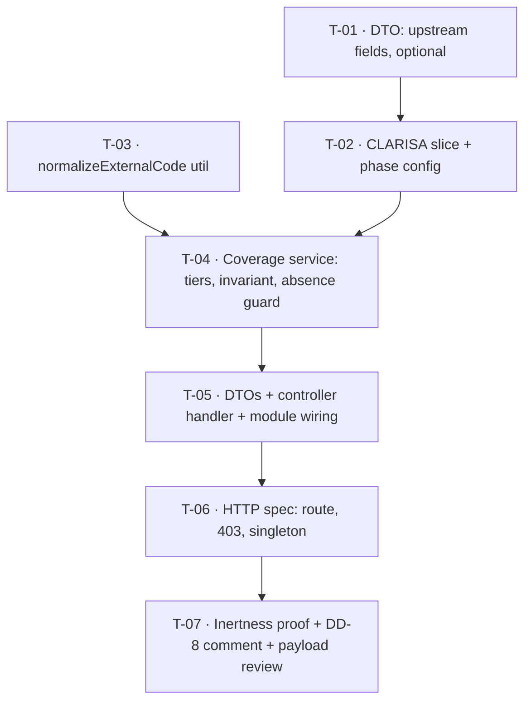

# Tasks — Bilateral / CLARISA project auto-mapping — **S1: Coverage Measurement**

- **Module:** bilateral (`domain/tools/clarisa/projects` + `domain/entities/bilateral-project-mapping`)
- **Spec id:** `2026-08-clarisa-project-automapping` (stage **S1**)
- **Status:** not-started
- **Owner:** ARI squad — J. Cadavid
- **Linked requirements:** [`./requirements.md`](./requirements.md)
- **Linked design:** [`./design.md`](./design.md) — judgment-day round 1 applied
- **Last updated:** 2026-08-14
- **Budget (tripwire, not a cap):** 7 tasks · ~680 LOC · 2 review rounds. Escalate rather than continue past it; the likely overrun source is `coverage-report.dto.ts`.

---

## 0. Read this first

**S1 writes nothing.** No migration, no row, no cron. If any task starts producing one, stop — the scope has drifted and the stage's whole safety argument (ship ahead of CLARISA's production promotion, back out with `git revert`) is gone.

**Two failure modes are invisible to ordinary unit tests** and are why T-06 exists as its own task:

| Failure | Why unit specs miss it |
| --- | --- |
| The handler is declared after `@Get(':id')` → `ParseIntPipe` eats `coverage-report` → **400 forever** | Controller unit specs call methods directly; Nest never routes |
| A request-scoped provider sneaks in → the **existing** CRUD controller silently becomes request-scoped | Every functional test still passes |

Both would otherwise be found by the deliverable failing in front of the user.

---

## 1. Dependency graph

**Parallel-safe:** T-01 and T-03 may run concurrently (different files, no shared symbol). Everything else is a chain. **Not parallel-safe with any other bilateral spec** — same module (proposal Document Control).

---

## 2. Task list

### T-01 — Extend `ClarisaProject` with the upstream fields, all optional

- **Requirements covered:** R-CPA-001 (AC.1, AC.2, AC.3)
- **Files touched:**
  - `src/domain/tools/clarisa/projects/dto/clarisa-project.types.ts`
  - `src/domain/tools/clarisa/projects/clarisa-projects.service.spec.ts` (extend)
- **Description:** Add `external_code?`, `phase?`, `source_center_acronym?` to the `ClarisaProject` interface. Every field optional and nullable, so the same build runs against test (fields present) and production (fields absent). Add only these three — the file's own header rule is to add upstream fields on first need, not to carry the other ten.
- **Implementation notes:**
  - Do **not** add runtime validation that rejects a payload lacking them (R-CPA-001 behavior bullet).
  - Do not touch `listBilateralProjects` or `findProjectById` in this task.
- **Tests:** extend `clarisa-projects.service.spec.ts` with (a) a **fields-absent** fixture and (b) a `listBilateralProjects()` regression assertion that pins the expected project **ids**, not just the count.
- **Verification:** `npm test -- --silent -- clarisa-projects` and `npx eslint src/domain/tools/clarisa/projects/`
  - **Input that would make it FAIL:** change any existing filter in `listBilateralProjects` — the pinned-id assertion reddens. If it does not redden, the assertion is pinning nothing and is not evidence.
  - **Disqualifier:** a passing run where the fields-absent fixture was never actually exercised (e.g. the fixture object still carries the new fields) proves nothing. Confirm the fixture literally omits them.
- **Done check:**
  - [x] Fields-absent fixture deserializes and every consumer returns pre-change results (AC.1) — Reviewer verified the fixture *literally omits* the three keys
  - [x] Fields-present fixture exposes all three (AC.2)
  - [x] `listBilateralProjects()` returns an identical **id set** before and after (AC.3)
- **Dependencies:** none · **Effort:** S · **Status:** **[x] done** — 2026-08-14, 2 attempts (attempt 1 failed the eslint half of the gate), Reviewer PASS. Evidence: [`./execution.md`](./execution.md) → *T-01*.
- **Skills:** `nestjs-expert`

---

### T-02 — Add `listProjectsForCoverage(phase)` returning `{ all, slice }`, plus phase config

- **Requirements covered:** R-CPA-002 (AC.1–AC.4 + the funding-source scenario)
- **Design:** §2.1, §5 steps 1–2, **DD-13**, **DD-14**
- **Files touched:**
  - `src/domain/tools/clarisa/projects/clarisa-projects.service.ts`
  - `src/domain/tools/clarisa/projects/clarisa-projects.service.spec.ts` (extend)
- **Description:** One new public method returning **both** the full cached payload (`all`) and the Alliance slice (`slice`). Both are required: `all` feeds the availability guard and `alliance_selector_agreement`; `slice` feeds classification. `getCachedAll()` is `private` and the two existing public reads are both filtered, so without this the spec's most important behavior has no data source (DD-14).
- **Implementation notes:**
  - Slice = `source_center_acronym` trimmed + upper-cased ∈ `{CIAT, BIOVERSITY}` **AND** `phase` numerically equal to the resolved phase (so `2026` and `"2026"` both match).
  - Phase resolution: caller-supplied → `process.env.ARI_CLARISA_PROJECTS_PHASE` → `2026`. **There is no `EnvUtil` in this repo** (DD-13); read `process.env` directly, mirroring `clarisa.connection.ts:10`.
  - **Do NOT filter on `source_of_funding` or `project_mappings_array`** — DD-2. Filtering them here silently decides OQ-5 and OQ-2, which is precisely what this spec exists to avoid.
  - Leave `listBilateralProjects` and `findProjectById` untouched, including their case-sensitivity defect (DD-9).
- **Tests:** mixed-case centre fixture (`ciat`, `Bioversity`, `CIAT `); numeric/string/wrong phase fixture; a non-Alliance centre; a phase-override case.
- **Verification:** `npm test -- --silent -- clarisa-projects` · `npx eslint src/domain/tools/clarisa/projects/`
  - **Input that would make it FAIL:** replace the normalized compare with `=== 'CIAT'` — the mixed-case fixture reddens (defect class D4).
  - **Disqualifier:** if every fixture project shares one centre casing, the test cannot distinguish normalized from exact compare. Each casing variant must appear at least once.
- **Done check:**
  - [x] AC.1 mixed-case centres all included · [x] AC.2 numeric + string phase both match, `2025` excluded
  - [x] AC.3 non-Alliance excluded · [x] AC.4 phase changes via env, no code edit
  - [x] **`window3` projects are IN the returned slice** (the scenario's `BUT it must NOT` drop them)
  - [x] `all` returns the unfiltered payload — asserted by a fixture whose payload contains a project the slice excludes
- **Dependencies:** T-01 · **Effort:** M · **Status:** **[x] done** — 2026-08-14, 3 attempts (1 substantive FAIL: silent `NaN` phase filter; 2 formatting), Reviewer PASS. Return widened to `{ all, slice, phaseUsed }` per the DD-14 amendment. Evidence: [`./execution.md`](./execution.md) → *T-02*.
- **Skills:** `nestjs-expert`

---

### T-03 — `normalizeExternalCode()` pure util + collision detection

- **Requirements covered:** R-CPA-003 (AC.1–AC.4 + the "must not merge two projects" scenario)
- **Design:** §2.1, **DD-4**, **DD-7**
- **Files touched:**
  - `src/domain/entities/bilateral-project-mapping/utils/external-code.util.ts` (new)
  - `src/domain/entities/bilateral-project-mapping/utils/external-code.util.spec.ts` (new)
- **Description:** Pure function, no DI: trim → upper-case → strip a leading prefix from the **closed set `{B-, C-}`**, at most once. Returns `{ normalized, rule }` where `rule ∈ {NONE, STRIP_CENTRE_PREFIX}` so every match can later be explained.
- **Implementation notes:**
  - **Closed set, not a pattern.** A greedy `^[A-Z]-` would strip prefixes that are not centre codes, converting a visible `UNRESOLVED` into a **silent wrong match** — the worst outcome for a join that will drive result attribution (DD-4).
  - Apply once: `C-C-A1` → `C-A1`, never `A1`.
  - Keep it module-local — `shared/` requires two consumers and the second arrives in S2 (DD-7).
- **Tests:** table-driven — `C-A132`→`A132`/`STRIP_CENTRE_PREFIX`; `B-A1080`→`A1080`; `A1463`→`A1463`/`NONE`; ` c-a132 `→`A132`; **`X-A132`→`X-A132` unchanged**; `C-C-A1`→`C-A1`.
- **Verification:** `npm test -- --silent -- external-code` · `npx eslint src/domain/entities/bilateral-project-mapping/utils/`
  - **Input that would make it FAIL:** swap the closed set for `/^[A-Z]-/` — the `X-A132` case reddens immediately (defect class D3).
  - **Disqualifier:** a suite with no unknown-prefix case cannot detect over-stripping, no matter how green. `X-A132` is mandatory.
- **Done check:**
  - [x] AC.1–AC.3 per the table above
  - [x] AC.4 — collision detection returns a count and the colliding codes, proven by a `C-A500` + `A500` fixture
  - [x] The collision fixture's contract classifies as `AMBIGUOUS`, **never** `NORMALIZED_CODE` (the scenario's `AND IT MUST`) — asserted here at util level, re-asserted end-to-end in T-04
- **Dependencies:** none (parallel with T-01) · **Effort:** S · **Status:** **[x] done** — 2026-08-14, 2 attempts, Reviewer PASS. Evidence: [`./execution.md`](./execution.md) → *T-03*. K-004 demo performed (greedy-prefix defect reddened exactly the 2 unknown-prefix cases).
- **Skills:** `nestjs-expert`, `tdd`

---

### T-04 — Coverage service: tiers, sum invariant, absence guard, determinism

- **Requirements covered:** R-CPA-004 (AC.1–AC.6 + the one-tier scenario), R-CPA-005 (AC.1–AC.5 + the production scenario), NFR-CPA-001, NFR-CPA-003
- **Design:** §5 steps 3–8, **DD-3**, **DD-6**, **DD-10**, **DD-11**
- **Files touched:**
  - `src/domain/entities/bilateral-project-mapping/bilateral-mapping-coverage.service.ts` (new)
  - `src/domain/entities/bilateral-project-mapping/bilateral-mapping-coverage.service.spec.ts` (new)
- **Description:** The instrument itself. Builds two code maps over the slice, reads bilateral AGRESSO contracts through `DataSource`, classifies each contract into exactly one tier, and aggregates counts, percentages (each carrying numerator + denominator), collisions, `alliance_selector_agreement`, and capped samples.
- **Implementation notes:**
  - **Inject `ClarisaProjectsService` and `DataSource` only.** Do **not** inject `AgressoContractRepository` — it injects `CurrentUserUtil`, which is `Scope.REQUEST`, and would re-scope this module's shipped controller (DD-11).
  - **Absence guard runs first** and short-circuits: if no project in `all` has a non-null `external_code`, null out `resolution`, `agresso`, `normalization` **and** `samples`, emit the `clarisa` block, return. Steps 4–6 do not run.
  - Tier order is fixed and first-hit-wins: `EXACT_CODE` → `NORMALIZED_CODE` → `FULL_NAME` → `UNRESOLVED`; collided key or multi-project hit → `AMBIGUOUS`.
  - Assert the sum invariant in code and throw `500` on violation — a report that miscounts is worse than no report (DD-6).
  - One AGRESSO query per report (NFR-CPA-003); build maps rather than nested scans.
- **Tests:** 4-project/4-contract tier fixture; sum-equals-total; double-run deep-equal on `resolution`; no-`external_code` payload; collision fixture; a `jest.fn()` query double asserted **called once**; a repository double asserted to receive **no** `save`/`update`/`delete`.
- **Verification:** `npm test -- --silent -- bilateral-mapping-coverage` · `npx eslint src/domain/entities/bilateral-project-mapping/`
  - **Input that would make it FAIL:** let a contract match both `EXACT_CODE` and `NORMALIZED_CODE` without the first-hit-wins guard — the sum assertion exceeds the total and reddens (defect class D1).
  - **Disqualifier (measured-signal clause):** the determinism check is only evidence if the two runs share **one** upstream fixture. If the double returns a fresh object per call, deep-equality proves nothing about determinism — report it as inconclusive rather than as a pass. Likewise, **Kaizen KZ-001**: a double returning the same three contracts in every case cannot demonstrate the sum invariant; build fixtures per case.
- **Done check:**
  - [ ] AC.1 one contract in each of the four resolvable tiers
  - [ ] AC.2 every percentage carries numerator + denominator
  - [ ] AC.3 tier counts sum **exactly** to the bilateral total (the scenario's `AND IT MUST`)
  - [ ] The dual-match contract appears in `EXACT_CODE` and **not** in `NORMALIZED_CODE` (the scenario's `BUT it must NOT`)
  - [ ] AC.5 funding-source and has-mappings splits present · [ ] AC.6 `alliance_selector_agreement` reports all three populations
  - [ ] R-CPA-005 AC.1–AC.3: no percentage anywhere on the absence path; `upstream_contract_available` false; host named
  - [ ] R-CPA-005 AC.4: `agresso` / `normalization` / `samples` are **null**, not `0` / `[]` (the production scenario's `BUT it must NOT`)
  - [ ] R-CPA-005 AC.5: the `clarisa` block is still populated (the scenario's `AND IT MUST`)
  - [ ] NFR-CPA-003: the AGRESSO query double is asserted called exactly once
- **Dependencies:** T-02, T-03 · **Effort:** L · **Status:** **[x] done** — 2026-08-14, 4 attempts. Reviewer FAIL on a *gate* defect (no test could distinguish `all` from `slice`); fixed test-only, mutation now proves the guard reddens. DD-6 invariant confirmed unreachable — classification is total. Evidence: [`./execution.md`](./execution.md).
- **Skills:** `nestjs-expert`, `tdd`, `systematic-debugging`

---

### T-05 — Response/query DTOs, controller handler, module wiring

- **Requirements covered:** R-CPA-004 (AC.4 envelope), R-CPA-006 (AC.1, AC.2, AC.4)
- **Design:** §2.1, §4, **DD-12**
- **Files touched:**
  - `src/domain/entities/bilateral-project-mapping/dto/coverage-report.dto.ts` (new — **the largest artifact; the budget tripwire points here**)
  - `src/domain/entities/bilateral-project-mapping/dto/coverage-report.query.dto.ts` (new)
  - `src/domain/entities/bilateral-project-mapping/bilateral-project-mapping.controller.ts`
  - `src/domain/entities/bilateral-project-mapping/bilateral-project-mapping.module.ts`
- **Description:** The HTTP edge. Response DTO with `@ApiProperty` on every block, query DTO with `class-validator`, one handler wrapped via `ResponseUtils.format`, and module wiring that provides the coverage service and imports `ClarisaProjectsModule`.
- **Implementation notes:**
  - **Declare `@Get('coverage-report')` ABOVE the existing `@Get(':id')`** (currently at `bilateral-project-mapping.controller.ts:69`). Nest matches in declaration order; below it, `ParseIntPipe` rejects the literal string and the endpoint returns **400 forever** (DD-12).
  - **The URL has no `/v1`** — `main.ts:53-56` enables URI versioning with no `defaultVersion` and this controller declares no `@Version`. The live path is `/api/bilateral-project-mappings/coverage-report`.
  - **Do NOT import `AgressoContractModule`** (DD-11).
  - Roles are inherited from the controller-level `@Roles(CENTER_ADMIN, SYSTEM_ADMIN)`; add no new auth path.
  - Swagger: `@ApiOperation` + `@ApiQuery` × 2 are mandatory (server guide §4).
- **Tests:** extend `bilateral-project-mapping.controller.spec.ts` for the happy path and query-DTO validation. **Role behavior is NOT proved here** — see T-06.
- **Verification:** `npm test -- --silent -- bilateral-project-mapping` · `npx eslint src/domain/entities/bilateral-project-mapping/`
  - **Input that would make it FAIL:** an out-of-range `limit-samples` (0 or 51) must yield `400`.
  - **Disqualifier / presence-assertion warning:** a controller unit spec **cannot** prove the route resolves or that the guard denies — it calls handler methods directly. Do not record T-05's green run as evidence for R-CPA-006 AC.3; that belongs to T-06.
- **Done check:**
  - [ ] AC.4 — response arrives inside `ServerResponseDto`
  - [ ] AC.4 (R-CPA-006) — endpoint visible in `/swagger` under `Bilateral / Admin` with the bearer lock (**manual check**, no automated gate)
  - [ ] `@Get('coverage-report')` is physically above `@Get(':id')` in the class body
  - [ ] `bilateral-project-mapping.module.ts` imports `ClarisaProjectsModule` and **not** `AgressoContractModule`
- **Dependencies:** T-04 · **Effort:** M · **Status:** **[x] done** — 2026-08-14, 3 attempts. DTOs moved (not copied) per user decision; `description` now branches on `upstream_contract_available`, closing a clause that had no owner. Evidence: [`./execution.md`](./execution.md).
- **Skills:** `nestjs-expert`, `api-design-principles`

---

### T-06 — HTTP-level spec: route resolution, 403 envelope, singleton scope

- **Requirements covered:** R-CPA-006 (AC.3), R-CPA-007 (AC.4), NFR-CPA-002 — defect classes **D6, D10, D11**
- **Design:** §10, **DD-11**, **DD-12**
- **Files touched:**
  - `src/domain/entities/bilateral-project-mapping/coverage-report.http.spec.ts` (new)
- **Description:** The only gate in this spec that exercises the real HTTP path. Bootstraps a `TestingModule` → `createNestApplication()`, **replicating `setGlobalPrefix('api')` and `enableVersioning({type: VersioningType.URI})` from `main.ts`**, doubles `ClarisaProjectsService` and the `DataSource` query, then drives it with supertest. Without this task, two likely failures reach the user instead of a test.
- **Implementation notes:**
  - The bootstrap **must** replicate prefix + versioning, or the spec asserts a path the real app does not serve — a check that cannot fail for the reason it was written (**Kaizen K-004**).
  - Singleton assertion: call the endpoint twice, capture the service instance each time (e.g. via a spy on a method, or `app.get()` resolution), assert identity.
  - No MySQL, no live CLARISA. Classic e2e under `test/jest-e2e.json` is **not** added.
- **Verification:** `npm test -- --silent -- coverage-report.http` · `npx eslint src/domain/entities/bilateral-project-mapping/`
  - **Inputs that would make it FAIL — all three must be demonstrated once before this gate is trusted (K-004):**
    1. Move `@Get('coverage-report')` below `@Get(':id')` → the route test returns `400` instead of `200`.
    2. Delete `@Roles(...)` from the controller → the denial test stops returning `403`.
    3. Inject `AgressoContractRepository` into the coverage service → two requests yield two different instances and the identity assertion reddens.
  - **Disqualifier:** if the denial case returns `403` even with `@Roles` removed, the test is asserting something other than the guard (e.g. a missing token) and is not evidence for D6.
- **Done check:**
  - [ ] `SYSTEM_ADMIN` → `200` on `/api/bilateral-project-mappings/coverage-report` (AC.1)
  - [ ] `CENTER_ADMIN` → `200` (AC.2)
  - [ ] Neither role → `403` **in the standard error envelope** (AC.3)
  - [ ] Two successive calls served by the **same** service instance (R-CPA-007 AC.4)
  - [ ] All three break-it-on-purpose demonstrations recorded in the execution log
- **Dependencies:** T-05 · **Effort:** M · **Status:** **[~] BLOCKED** — 2026-08-14, **6 attempts**, HALTED. Suite design verified correct; blocked by a TypeORM harness constraint (`BilateralProjectMappingRepository extends Repository` needs live connection metadata). D10 and D11 mitigated by Leader inspection; **D6 (403 envelope) remains uncovered**. Full history: [`./execution.md`](./execution.md) → *T-06*.
- **Skills:** `nestjs-expert`, `tdd`

---

### T-07 — Inertness proof, DD-8 comment correction, payload self-description review

- **Requirements covered:** R-CPA-007 (AC.1–AC.3), NFR-CPA-004; closes **DD-8**
- **Design:** §3, §12 DD-8, §9
- **Files touched:**
  - `src/domain/entities/bilateral-project-mapping/entities/bilateral-project-mapping.entity.ts` (**header comment only**)
- **Description:** Prove the stage is inert and retire the dead premise. The entity header still asserts *"no upstream join field exists per D-PI-8"* (lines 8-9) — factually false since CLARISA published `external_code`, and the sentence that justified the whole manual flow. Replace it with a pointer to DD-8's supersession. **Comment only — no column, no migration.**
- **Implementation notes:**
  - Do **not** rewrite the archived D-PI-8 decision in place; it is superseded, not deleted (archive contract).
  - Confirm the `LoggerUtil` lines from design §9 exist, including the `warn` on `upstream_contract_available: false`.
  - Do **not** add a `sync_process_logs` row — nothing was synced.
- **Verification:**
  - `git diff --stat` → **zero** files under `src/db/migrations/` (R-CPA-007 AC.1)
  - `npm test -- --silent` — **full suite**, not targeted. Kaizen **KZ-003**: a targeted run confirms the brief was followed, not that the blast radius is clean.
  - `npx eslint <all changed paths>` — bare, no `--fix` (**K-001**: `npm run lint` mutates and cannot verify)
  - **Input that would make it FAIL:** add any file under `src/db/migrations/` → AC.1 reddens.
  - **Disqualifier:** a green *targeted* suite is not evidence for AC.3. Only the full-suite run counts.
- **Done check:**
  - [ ] AC.1 — no migration file in the diff
  - [ ] AC.2 — no write path invoked during a report run (asserted in T-04, re-confirmed here)
  - [ ] AC.3 — **full** `npm test` green, existing `bilateral-project-mapping` and `clarisa-projects` suites unchanged
  - [ ] The `bilateral_project_mapping` row count is identical before and after a report call (the scenario's `THEN`)
  - [ ] No `AI_SUGGESTED` row created (the scenario's `BUT it must NOT`); no `sync_process_logs` row written (the scenario's `AND IT MUST NOT`)
  - [ ] Entity comment no longer claims the join field does not exist
  - [ ] **NFR-CPA-004 (manual):** a reader of the payload can name the environment, phase and normalization rule without opening the code — reviewed at the HITL pause
- **Dependencies:** T-06 · **Effort:** S · **Status:** **[x] done** — 2026-08-14, 1 attempt. Entity header now supersedes D-PI-8 (preserved, not rewritten); safe `[SPEC …]` comment form per K-006. **Zero migrations in the diff — R-CPA-007 AC.1 verified.**
- **Skills:** `nestjs-expert`

---

## 3. Coverage closure — clause level, not ID level

A requirement "appearing in a task" is the weakest possible claim. Every **scenario** and every `BUT it must NOT` / `AND IT MUST` clause is owned below by exact quote.

| Requirement | Clause | Owner |
| --- | --- | --- |
| R-CPA-001 | AC.1–AC.3 | T-01 |
| R-CPA-002 | *"it must NOT drop the `window3` projects from the denominator"* | T-02 |
| R-CPA-002 | *"IT MUST normalize the funding-source string (case + trim) before grouping"* | T-02 (compute), T-04 (report) |
| R-CPA-003 | *"it must NOT report either project as a confident resolution"* | T-03 |
| R-CPA-003 | *"IT MUST classify any contract matching a collided code as `AMBIGUOUS`"* | T-03 (util), T-04 (end-to-end) |
| R-CPA-004 | *"it must NOT also appear in the `NORMALIZED_CODE` count"* | T-04 |
| R-CPA-004 | *"IT MUST make the sum of all tier counts equal the total"* | T-04 |
| R-CPA-004 | AC.4 (envelope) | T-05 |
| R-CPA-005 | *"it must NOT emit `0%`, `0` resolved, or any tier percentage"* | T-04 |
| R-CPA-005 | *"IT MUST still report the slice size it did observe"* | T-04 |
| R-CPA-005 | *"`description` states the contract is unavailable in the measured environment"* / *"AND the description says the upstream contract is not published in this environment"* | **T-05** — ⚠️ **this row was missing from the original table.** The clause had no owner and shipped uncovered until T-04's Reviewer caught it as a carry-forward. Added 2026-08-14 during execution. The clause-level table is only as good as its completeness, and this is the proof: writing the table did not make it exhaustive |
| R-CPA-006 | AC.1, AC.2 (200s), AC.3 (403) | T-06 |
| R-CPA-006 | AC.4 (Swagger) | T-05 — **manual check, no automated gate** |
| R-CPA-007 | *"it must NOT create any `AI_SUGGESTED` row"* / *"IT MUST NOT write a `sync_process_logs` row"* | T-07 |
| R-CPA-007 | AC.4 (singleton scope) | T-06 |
| NFR-CPA-001 | determinism | T-04 |
| NFR-CPA-002 | allowed + denied | T-06 |
| NFR-CPA-003 | one query | T-04 |
| NFR-CPA-004 | self-description | T-07 — **manual review at the HITL pause** |

**Declared gaps** (not silently absent): R-CPA-006 AC.4 and NFR-CPA-004 have **no automated gate** and are discharged by human check. Requirements §8 D8/D9 remain accepted risks — no test can assert a fact about production data this environment does not hold.

---

## 4. PR strategy

**Estimated LOC:** ~680 (≈ 400 production, ≈ 280 test).

**Recommendation: two PRs.** The total sits above the ~400-LOC single-PR threshold, and there is a clean seam.

| PR | Tasks | Why this boundary |
| --- | --- | --- |
| **PR 1 — the instrument's parts** | T-01, T-02, T-03 | Pure/contract-level work: DTO fields, a slice reader, a normalization function. Independently reviewable, no HTTP surface, ~230 LOC. Review first: **`external-code.util.ts` is the highest-risk file in the spec** — an over-greedy strip converts a visible failure into a silent wrong match |
| **PR 2 — the endpoint and its gates** | T-04, T-05, T-06, T-07 | The service, the HTTP edge and the three gates that prove it works. ~450 LOC. Review order: `bilateral-mapping-coverage.service.ts` (the invariant) → controller (**handler declaration order**) → `coverage-report.http.spec.ts` |

Per `cognitive-doc-design` review-empathy: each PR description should state what to review first, what is deliberately out of scope (**no migration — by design**; the DD-9 picker defect is **not** fixed here), and link the sibling PR.

Single-PR is acceptable if the team prefers it — the seam is a convenience, not a dependency break.

---

## 5. Risks & blockers log

| # | Date | Risk / Blocker | Mitigation | Owner | Status |
| --- | --- | --- | --- | --- | --- |
| RB-1 | 2026-08-14 | **DEV MySQL unreachable** during proposal analysis. If still down, the D8 human reading — the actual deliverable — cannot be taken | Code ships and is inert; the reading is retried when DEV returns. **Do not start S2 without it** | Squad | open |
| RB-2 | 2026-08-14 | CLARISA production does not publish the upstream fields (proposal R-1) | Blocks S2 release, **not** S1. R-CPA-005 makes it visible | CLARISA team | open |
| RB-3 | 2026-08-14 | The CLARISA test slice yields only 5/380 projects with mappings (OQ-2) — the reading may be unrepresentative | Reported as a dimension, not filtered. If the reading is thin, say so and hold S2 | Product | open |
| RB-4 | 2026-08-14 | **Pre-existing defect:** `listBilateralProjects()` is case-sensitive, so the live admin picker currently offers **0 of 342** Alliance-2026 bilateral projects | Deliberately out of scope (DD-9); escalated as **OQ-7**. May warrant its own bugfix spec ahead of S2 | **User decision** | **open — escalated** |
| RB-5 | 2026-08-14 | Judgment-day ran with **one** delivered verdict, not two; the corrected design was not re-judged | Every severe finding independently verified against source before fixing; recorded in `judgment.md` | Squad | open |

---

## 6. Done definition

- [ ] All T-01…T-07 `done`
- [ ] Every requirement AC checked, including the clause table in §3
- [ ] Coverage thresholds still green (global 60%)
- [ ] Swagger documents the endpoint
- [ ] **No file under `src/db/migrations/` in the diff**
- [ ] The three break-it-on-purpose demonstrations for T-06 are recorded (K-004)
- [x] **The D8 reading has been taken with the user** — 2026-08-14, over VPN against DEV, using the real service. Both environments read. *S1 is not complete when the code merges; it is complete when the measurement exists — and it now does.* See [`./evidence/D8-reading-2026-08-14.md`](./evidence/D8-reading-2026-08-14.md)
- [x] OQ-2 answered (**no** — 5/380 makes "has SPs" the wrong filter) · OQ-5 population measured (342/38) · **OQ-7 still open and now more urgent** — the two Alliance selectors proved *disjoint*, so the legacy picker is selecting a different population, not merely a case-folded subset
