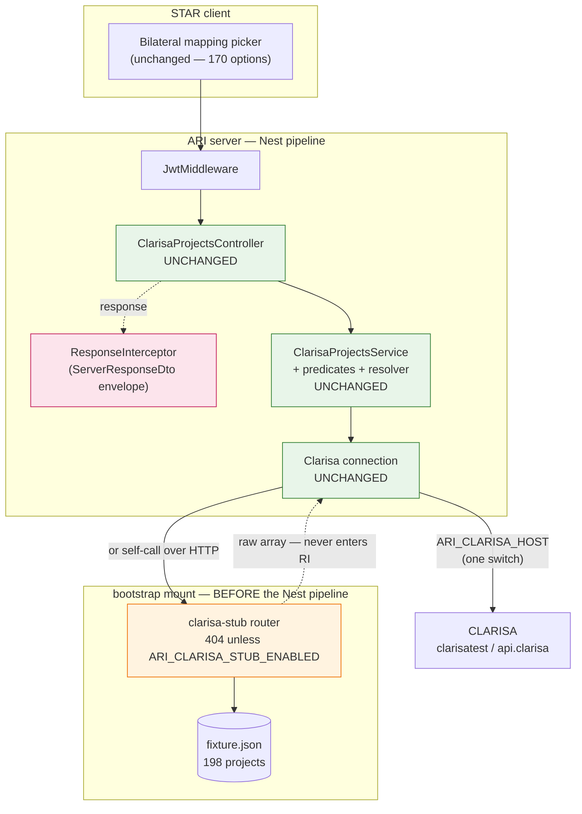

# Design — bilateral / clarisa-fixture-stub

- **Module:** clarisa (served from `bilateral/`)
- **Spec id:** 2026-08-clarisa-fixture-stub
- **Status:** draft
- **Owner:** Juan Carlos Cadavid
- **Linked requirements:** [./requirements.md](./requirements.md)
- **Linked TRD:** `docs/trd/trd.md` — integrations (CLARISA), API contracts, security
- **Depth:** Standard
- **Last updated:** 2026-08-18

## Divergences from `proposal.md`

Three, all evidence-driven. The proposal remains the approved intent; these are implementation discoveries.

| # | Proposal said | Design says | Why |
|---|---|---|---|
| V-1 | Two Nest routes serving the fixture | Two routes served by a **bootstrap-mounted Express router, outside the Nest pipeline** | The global `ResponseInterceptor` silently replaces both payloads with `{"data":[],…}` (M-16, executed). A Nest controller cannot return CLARISA's raw shape without an escape hatch |
| V-2 | "**+1 entry** — see R-2" on the JWT `exclude` list | **No change to `app.module.ts`** | A bootstrap mount runs ahead of `JwtMiddleware` (M-19, executed). The widening is unnecessary — the security review target changes rather than disappearing (R-CFS-006) |
| V-3 | `phase` set to `2026`; `project_mappings_array` "with its real nesting" | Same, **plus** a committed dictionary of 13 real `global_unit_object` values harvested verbatim; entity codes are **22/23/24 per program**, never uniformly 22 | Real feed: `{22: 339, 23: 66, 24: 88}` over 493 mappings (M-11/M-12). Uniform 22 would make `has_science_programs` 170 instead of 140 — the KZ-001 failure |

---

## 1. Goals & non-goals

**Goals**
1. Serve the real phase-2026 data in CLARISA's exact wire shape, switchable by `ARI_CLARISA_HOST` alone (R-CFS-001, R-CFS-003).
2. Keep the consumption path byte-for-byte unchanged (NFR-CFS-002).
3. Make every fidelity divergence explicit and executable (R-CFS-002, R-CFS-005).
4. Leave production indistinguishable from not having the stub (R-CFS-004, R-CFS-006).
5. Regenerate reproducibly and delete cleanly (R-CFS-007, R-CFS-008).

**Non-goals** — S2's matcher · any UI change · any change to `ClarisaProjectsService`/predicates/resolver · loading data into CLARISA · serving CLARISA endpoints other than `api/projects` · automating the stub's lifecycle · Swagger documentation of the stub.

---

## 2. Architecture

The stub is a **transport substitution**, not a consumer branch. Two request paths exist; the domain layer cannot tell them apart.

**The load-bearing property:** the stub sits *outside* the box that would corrupt it. Green = untouched, orange = new and env-gated, pink = the interceptor the stub must never reach.

### 2.1 Composition

Everything new lives under one folder so removal is a single `rm -rf` plus two small reverts.

| Path | Responsibility |
|---|---|
| `src/domain/tools/clarisa/stub/clarisa-stub.router.ts` | The Express router: `POST auth/login`, `GET api/projects`. Reads the fixture once, lazily. Never throws (see §5.3) |
| `src/domain/tools/clarisa/stub/clarisa-stub.config.ts` | Flag parsing (`ARI_CLARISA_STUB_ENABLED`), the mount prefix constant, and the removal-condition header comment |
| `src/domain/tools/clarisa/stub/fixtures/clarisa-projects.fixture.json` | **Generated.** 198 projects in CLARISA's 32-field shape |
| `src/domain/tools/clarisa/stub/fixtures/clarisa-projects.provenance.json` | Source filename, export date, reference-capture date + host, expected counts, removal condition |
| `src/domain/tools/clarisa/stub/fixtures/clarisa-global-units.dictionary.json` | **Generated.** 13 real `global_unit_object` values, keyed by `smo_code` |
| `src/domain/tools/clarisa/stub/fixtures/clarisa-reference-capture.json` | **Generated.** A trimmed real `GET /api/projects` response — the fidelity baseline |
| `src/domain/tools/clarisa/stub/tools/harvest-reference.ts` | One-shot: capture CLARISA live → reference capture + dictionary |
| `src/domain/tools/clarisa/stub/tools/convert-export.ts` | The converter: export + dictionary → fixture + provenance. Deterministic |
| `src/domain/tools/clarisa/stub/clarisa-stub.fidelity.spec.ts` | The fidelity check (R-CFS-005) — runs in `npm test` |
| `src/domain/tools/clarisa/stub/clarisa-stub.router.spec.ts` | Raw-shape, flag-gating and mount-narrowness tests |
| `src/domain/tools/clarisa/stub/clarisa-stub.mount.ts` | **Added 2026-08-19 (DD-11).** The `mountClarisaStub(app)` helper, so `main.ts` changes by exactly one call and its boot semantics are untouched |
| `test/clarisa-stub.e2e-spec.ts` | The ordering proof — the only place a bootstrap-registered mount's precedence over `JwtMiddleware` is observable |

**Modified existing files — exactly three** *(amended 2026-08-19 during execution; was two)*:

| Path | Change |
|---|---|
| `src/main.ts` | One **unconditional** `app.use(prefix, router)` block, placed **after** `helmet`/`json`/`enableCors` and **before** `listen()`. See DD-9 — this must **not** be wrapped in an `if` |
| `.env.example` | Document `ARI_CLARISA_STUB_ENABLED`, the stub `ARI_CLARISA_HOST` values, the trailing slash, and the removal condition |
| **`nest-cli.json`** | **+1 `assets` entry** so the fixture reaches `dist`. See DD-10 |

> **Why the count moved from two to three.** T-05's Reviewer found that the running application
> **never sees the fixture**. `clarisa-stub.router.ts` resolves it as `join(__dirname, 'fixtures', …)`,
> but the app always runs from `dist` (`start:prod` is `node dist/main`; the Dockerfile production
> stage copies only `/app/dist` + `node_modules` and **no `src`**), and nothing puts that JSON in
> `dist`: `nest-cli.json`'s single `assets` entry covers only `domain/entities/reports/assets/**/*`,
> and `tsc` emits only **imported** `.json` — this file is read through `fs`, never imported.
> Verified by the Leader against `nest-cli.json`, `package.json` and `Dockerfile:54-74`.
>
> **The symptom is the one R-2 exists to prevent:** ENOENT → the handler's JSON 500 →
> `Clarisa.get()` wraps it in a `BadRequestException` → reads as a CLARISA outage. **No test could
> catch it**: both `jest.config` and `test/jest-e2e.json` run ts-jest over `src`, so `__dirname`
> resolves into the source tree and all 20 of T-05's tests pass against a file that will not exist in
> the field. This is the *harness structurally cannot evaluate the property* case, arriving in a place
> the spec's own DC table never anticipated.

### 2.2 Reuse

Consumes `exceljs` (already a dependency) for the converter and `LoggerUtil` for the stub's own log lines. Deliberately reuses **nothing** from the Nest DI graph — the router must not depend on the injector, or it cannot be mounted before the pipeline.

---

## 3. Data model

**No data model changes.** No entity, column, index, migration, seed, or OpenSearch decoration. Nothing is written to MySQL or DynamoDB. The Dev database was read (`SELECT` only) to answer OQ-1 and is otherwise untouched.

The only "schema" is the fixture's JSON contract, which is defined by the reference capture rather than by this spec — that is the point of R-CFS-001.

---

## 4. API surface

Two routes, deliberately **not** Swagger-documented and **not** version-prefixed: they impersonate CLARISA, they are not ARI API surface.

### POST `/api/clarisa-stub/auth/login`
- **Handler:** `clarisa-stub.router.ts`
- **Auth:** none — mounted ahead of `JwtMiddleware` (M-19)
- **Body:** ignored entirely (credentials are not validated, compared, or logged)
- **Response:** bare `{ "access_token": "<non-empty string>" }`, HTTP 200
- **Disabled:** 404 when the flag is off
- **Why it exists:** `Clarisa.getToken()` throws `BadRequestException` on login failure, aborting the whole `get()`. A static host serving only the JSON would fail before reaching the array

### GET `/api/clarisa-stub/api/projects`
- **Handler:** `clarisa-stub.router.ts`
- **Auth:** none (same reason). The real CLARISA requires a bearer token; the stub accepts and ignores whatever arrives
- **Response:** bare JSON array of **198** projects, HTTP 200, `content-type: application/json`
- **Disabled:** 404 when the flag is off
- **Errors:** on an unreadable or unparseable fixture, an explicit `500` with a JSON body — because `GlobalExceptions` is **not** in this path (§5.3)

**Resulting URL composition.** `Clarisa` concatenates `host + path`, so the host value needs its trailing slash:

| Environment | `ARI_CLARISA_HOST` | Resolves to |
|---|---|---|
| local | `http://localhost:3000/api/clarisa-stub/` | `…/api/clarisa-stub/auth/login` · `…/api/clarisa-stub/api/projects` |
| dev | `https://<dev-api-host>/api/clarisa-stub/` | same shape, via the ordinary deployment |

A missing trailing slash yields `…/api/clarisa-stubauth/login` → 404 → `BadRequestException`. Documented in `.env.example` (R-CFS-008 AC.2).

---

## 5. Workflows & business rules

### 5.1 One-shot: harvest the reference (manual, re-runnable)
1. Log in to CLARISA and `GET /api/projects` with the configured host.
2. Write the **reference capture**: a trimmed subset of real projects (a handful, enough to carry all 32 keys and several mappings) — small enough to review in a diff.
3. Derive the **dictionary**: for each distinct `smo_code`, the first `global_unit_object` verbatim. Assert each `smo_code` maps to exactly one `(id, cgiar_entity_type_object.code)` pair — measured 0 ambiguous (M-12); a future ambiguity must fail, not pick a winner.
4. Record the capture host and date in the provenance file.

### 5.2 Regenerating the fixture
1. Read the export (sheet `Projects`, 198 rows).
2. For each row, emit an object with **exactly** the 32 reference keys.
3. Map the fields the export supplies; set the rest to the value CLARISA itself returns (`null`, or `[]` for `project_countries_array`).
4. Set `phase` to the **number** `2026`.
5. For each non-blank `Program 1..3`: look the code up in the dictionary — **fail loudly on a miss** — and emit a mapping whose `global_unit_object` is the dictionary value verbatim, `program_id` = its `id`, `project_id` = the parent's `id`, `status` = `'Confirmed'`, `allocation` = the numeric `Allc %`, and `complementarity`/`efficiencies` translated `H|M|L → high|medium|low`.
6. Emit in export row order, with stable key order and no timestamps inside the array.
7. Write the sibling provenance file, which is the only place a generation date appears.

**Expected outcome, asserted:** 198 projects · 283 mappings · 170 eligible · `has_science_programs` true for **140** of those 170 · entity-code histogram containing 22, 23 **and** 24.

### 5.3 Serving a request (and what the pipeline no longer provides)

The mount buys raw-shape fidelity and costs four cross-cutting behaviours. Each is compensated deliberately — this is the output of the §12 reversion challenge, not an afterthought.

| Lost | Consequence | Compensation |
|---|---|---|
| `JwtMiddleware` | The stub is unauthenticated by construction | **Intended.** Contained by R-CFS-004's default-off gate; named as the security-review item (R-CFS-006) |
| `ResponseInterceptor` | No `ServerResponseDto` envelope | **Intended** — it is the whole point (R-CFS-003) |
| `GlobalExceptions` | A thrown error returns Express's default HTML 500, not a JSON envelope | The handler **must not throw**: fixture access is guarded and returns an explicit JSON 500 |
| `LoggingInterceptor` | Stub calls produce no request log line, so a misconfigured host is harder to diagnose | Log explicitly via `LoggerUtil`: one line when the mount is enabled at boot, one on first fixture load (with the project count), one per failure. **Never** per successful request — the picker hot path would flood the log |

`helmet`, `json` and CORS are registered earlier in bootstrap and **still apply** — hence the mandated placement of the mount block after them.

### 5.4 Switching, and switching back
- **On:** set `ARI_CLARISA_STUB_ENABLED`, point `ARI_CLARISA_HOST` at the stub (trailing slash), restart.
- **Off:** restore `ARI_CLARISA_HOST` to the CLARISA value and unset the flag. Behaviour returns to today's exactly, because nothing in the consumption path changed (NFR-CFS-002).
- The service's 5-minute in-memory cache means a switch is not visible until the TTL lapses or the process restarts. **Restart after switching** — otherwise the previous host's data is served for up to 5 minutes and reads as "the switch did not work". This is the K-016 trap from the phase-config spec, in a new place.

---

## 6. Frontend impact

**None.** No admin SSR page, no STAR change. The picker and phase selector are exercised, not modified.

The client consequence is behavioural only and is a **verification obligation, not a code change**: `loadClarisaProjectOptions` sends no `limit` (M-18), so the CLARISA picker will receive all 170 options where AGRESSO's receives 50. This is DC-10 and it has no automated gate.

---

## 7. Integration impact

| Item | Detail |
|---|---|
| CLARISA | No contract change. One additional possible value for an existing variable |
| **New env var** | `ARI_CLARISA_STUB_ENABLED` — default **unset = disabled**. Source of truth: each environment's own `.env`. Not an `app_config` row (see DD-5) |
| **Reused env var** | `ARI_CLARISA_HOST` — gains a third target (**K-005**). Today's `.env` already carries test active on line 11 and prod commented on line 12; the stub becomes a third commented option |
| Cron | None. `clarisa.cron.ts` untouched |
| Events / messages | None |
| Dev MySQL | Read-only during spec measurement. No migration, no seed |

---

## 8. Security & authorization

| Question | Answer |
|---|---|
| Who can call the stub? | **Anyone who can reach the host, with no credentials** — when the flag is on. Off by default; 404 otherwise |
| Machine token accepted? | Not applicable — no auth is evaluated |
| New secrets? | None. The stub ignores `ARI_CLARISA_USER`/`PASS` rather than checking them, so no credential is compared or logged |
| PII? | **Deliberately excluded.** `Principal Investigator`, `… Name` and `… Email` have no CLARISA counterpart, so they are dropped by the fidelity rule (R-CFS-001) and never enter git history. Fidelity is the reason; the privacy outcome is a welcome consequence |
| Is the JWT `exclude` list widened? | **No** (V-2, M-19). `app.module.ts` is untouched |
| What is the residual risk? | An unauthenticated route exists in production code, reachable only if someone sets the flag. It exposes **project metadata already published by CLARISA** — no user data, no credentials, no write path. The route is read-only and takes no input that reaches storage |
| What must the reviewer check? | That the flag defaults off across all three values (unset / truthy / unrecognised), that the mount prefix cannot over-match (M-19), and that `app.module.ts` and `response.interceptor.ts` are byte-identical to `main` |

---

## 9. Observability

| Event | Level | Fields |
|---|---|---|
| Mount enabled at boot | `warn` — deliberately louder than `debug`, so a dev environment left switched on is visible in the log | mount prefix, fixture path |
| Fixture loaded (first request) | `debug` | project count, mapping count, fixture byte size |
| Fixture unreadable / unparseable | `error` | path + parse error |
| Per successful request | **none** | Intentional — the picker hot path would flood the log |

No `sync_process_log` rows, no new metrics or dashboards. The existing `"Zero eligible bilateral projects found from CLARISA host …"` warning in `ClarisaProjectsService` already prints the host, which is the single most useful line for diagnosing a bad switch — and it needs no change to serve that purpose here.

---

## 10. Testing strategy

| Suite | Covers | Notes |
|---|---|---|
| `clarisa-stub.fidelity.spec.ts` (unit) | R-CFS-001, R-CFS-002, R-CFS-005 — key-set equality vs the reference capture, type assertions, dictionary byte-equality, the 140/170 count, HML vocabulary, allocation sums, the 8-item divergence list as a **closed set** | The largest test artifact. Compares generated data against committed real data — no mocks |
| `clarisa-stub.router.spec.ts` (unit) | R-CFS-003, R-CFS-004 — raw array root, no envelope keys, token shape, and 404 across unset / truthy / unrecognised flag values | Exercises the router as an Express handler with fake req/res; no Nest bootstrap needed |
| `test/clarisa-stub.e2e-spec.ts` (e2e) | R-CFS-003 AC.4, R-CFS-006 AC.1–4 — mount ordering without a JWT, sibling-prefix non-match, an unrelated route still enveloped and still 401 | The **only** place mount ordering can be proven; a unit test cannot see it. Pattern already validated (M-19) |
| Converter determinism (unit) | R-CFS-007 — two runs, **byte** diff | Must compare bytes; a parsed comparison normalizes the defect away (DC-8) |
| **Human check at HITL** | **DC-10** — picker renders/filters/scrolls at 170 options; end-to-end 170 count and `{phase: 2026, count: 170}` | **No automated substitute exists.** Ten green gates do not cover this one |

Mock strategy: **none for CLARISA.** The reference capture *is* the real response; mocking it would reintroduce exactly the double-fidelity problem the spec exists to avoid (KZ-001). Global coverage threshold 60% unchanged.

Per **KZ-003**, the full suite is re-measured after implementation, not only the touched specs — `main.ts` is a boot-path file.

---

## 11. Rollout

| Concern | Answer |
|---|---|
| Migration order | **N/A** — no migrations. Notably this spec cannot be bitten by K-015 |
| Feature flag | `ARI_CLARISA_STUB_ENABLED` env var, default **unset = disabled**. Deliberately *not* an `app_config` row (DD-5) |
| Local enablement | Set the flag + repoint `ARI_CLARISA_HOST`, restart |
| Dev enablement | Ships with the ordinary deployment; **requires an OQ-3 owner first** |
| Production | Code ships; flag stays unset; both routes 404 |
| Backout | Unset the flag (immediate, no deploy). Full removal: delete `src/domain/tools/clarisa/stub/`, revert the `main.ts` block and the `.env.example` entries. No data to unwind |
| Removal trigger | CLARISA publishes `external_code` + phase-2026 data → **delete, do not maintain** (R-CFS-008). Recorded in three places; **owner still unassigned (OQ-3)** |
| Comms | Security reviewer (R-CFS-006) before merge · DevOps/Product (OQ-3) before dev · S2's owner, since its hard block lifts for development |

---

## 12. Design decisions log

| # | Date | Decision | Rationale |
|---|---|---|---|
| **DD-1** | 2026-08-18 | Serve the stub from a **bootstrap-mounted Express router**, outside the Nest pipeline | The only mechanism that guarantees CLARISA's raw wire shape without editing a global interceptor, and it removes the JWT `exclude` widening as a side effect (M-16, M-19). **Reversion challenge applied — see below** |
| **DD-2** | 2026-08-18 | Harvest `global_unit_object` **verbatim** from a real capture; never synthesize | Entity codes are 22/23/24 per program (M-11/M-12). A uniform 22 makes `has_science_programs` 170 instead of 140 — **KZ-001**, and it would pass any presence-based check |
| **DD-3** | 2026-08-18 | The fixture holds all **198** rows, not the eligible 170 | The 28 `window3` rows must be excluded *by the shipped filters*. Pre-filtering would test a fiction and hide a predicate regression |
| **DD-4** | 2026-08-18 | Commit a **reference capture** as the fidelity baseline, and mock nothing | A hand-written expectation is authored by the same pass that authors the fixture (**K-008**). Real captured data is the only independent oracle available |
| **DD-5** | 2026-08-18 | Flag is an **env var**, not an `app_config` row | The mount is decided at bootstrap, before the database is reachable. An `app_config` row would also make the stub switchable at runtime by an admin — undesirable for an unauthenticated route |
| **DD-6** | 2026-08-18 | Provenance lives in a **sibling file**, not inside the fixture array | Determinism (R-CFS-007): a generation date inside the payload makes every regeneration a diff, and would leak a non-CLARISA key into a 32-key contract |
| **DD-7** | 2026-08-18 | Keep the export **out** of the repository | It carries PI names and emails. The converter is committed, so a future export regenerates without the file ever being tracked |
| **DD-8** | 2026-08-18 | Do **not** Swagger-document the stub | It impersonates CLARISA; publishing it as ARI API surface invites a consumer, and consumers outlive stubs |
| **DD-9** | **2026-08-19** | **T-06 mounts the router UNCONDITIONALLY.** The routes are always registered; the flag decides **per request** (404 vs real response). §2.1's earlier phrase *"env-gated `app.use`"* describes the block's **effect**, not a syntactic `if` | **A conditional mount is the failure mode, not belt-and-braces.** `JwtMiddleware` is applied `.forRoutes({path:'*'})` with no stub entry in `.exclude(...)`, so with the flag unset an unmounted stub path falls through to it and returns **401** — measured in M-19, where an unmatched sibling under the prefix did exactly that. That directly violates R-CFS-004's *"BUT it must NOT be a 401, 403, or 500 — those disclose that a handler exists"* and AC.1. NFR-CFS-004's *"registered-but-404ing handlers"* is the tiebreaker text, and requirements outrank design where they conflict |
| **DD-10** | **2026-08-19** | Ship the fixture to `dist` via a **`nest-cli.json` `assets` entry**, mirroring the existing `domain/entities/reports/assets/**/*` precedent | Keeps the `fs` read seam, the lazy load, and all 20 router tests intact. The rejected alternative — a lazy `require()` of the JSON (viable, since `tsconfig.json` sets `resolveJsonModule`) — would hold the "exactly two modified files" count but swaps the `fs` seam for Node's module cache, forcing a rewrite of the no-read-when-disabled and unreadable-fixture tests. Paying one extra modified file is cheaper than weakening two tests. **`nest-cli.json` is not in NFR-CFS-002's named list**, so the zero-diff gate is unaffected |

| **DD-11** | **2026-08-19** | The `mountClarisaStub(app)` helper lives in **`clarisa-stub.mount.ts`**, not in `main.ts`. `main.ts` gains exactly one import and one call, and **no `require.main === module` guard** | T-06 attempt 1 put the helper in `main.ts` so the e2e could import the real function — which forced guarding the bottom-of-file `bootstrap()` call, because importing `main.ts` would otherwise open RabbitMQ and a second HTTP listener as import side effects. The guard was **verified correct today** (`module: commonjs`, no webpack bundling, and `node dist/main.js` / `start:prod` / `nest start`'s spawn of the compiled entry all satisfy `require.main`), but it was an unrecorded widening of the change on the file with the **largest blast radius in the package**, whose failure mode is *the server silently starts nothing*, and for which **no gate exists anywhere in this repo**. A future `webpack: true`, a bundler, or an ESM migration would flip it from correct to catastrophic with nothing to catch it. The helper has **zero** dependency on anything in `main.ts` — both symbols it uses come from the stub folder — so moving it removes the entire risk class and buys nothing away. Also aligns with `server/researchindicators/src/CLAUDE.md` §3: code wrapping an external system belongs in `domain/tools/<integration>/` |

> **DD-10 needs a gate that can go red today (K-004).** `npm run build && ls dist/domain/tools/clarisa/stub/fixtures/clarisa-projects.fixture.json` — **observe it FAIL before the fix**, then pass after. A packaging fix whose gate was never seen red is exactly the class of change that silently regresses when someone later prunes `assets`.

### Reversion challenge — DD-1 (mandated, Step 2.3)

**DD-1 removes four shipped cross-cutting behaviours from one request path.** Challenge: *what does removing them break?*

Three concrete breakages were named, and **all three changed the design** rather than being noted and waved through:

1. **`GlobalExceptions` is gone**, so any throw in the handler returns Express's default HTML 500. `Clarisa.get()` would wrap that in a `BadRequestException` whose message is an HTML blob — an actively misleading diagnostic. → The handler is now **required not to throw**: guarded fixture access, explicit JSON 500 (§5.3).
2. **`LoggingInterceptor` is gone**, so a misconfigured host produces silence where every other route produces a log line. → Explicit `LoggerUtil` lines at boot, first load, and failure — and deliberately **not** per request (§9).
3. **`helmet`, `json` and CORS could also be bypassed** if the mount were registered too early in bootstrap. → The mount's **position is now a design constraint**, not an implementation detail: after those, before `listen()` (§2.1).

A fourth candidate — losing `JwtMiddleware` — is the intended effect, not a breakage, and is contained by R-CFS-004 and reviewed under R-CFS-006.

---

## 13. Budget (mandated, Step 2.4)

The Phase 0 depth guess was `Standard`. Measured against the finished design, it holds — 8 tasks, one integration surface, no data model.

| Signal | Estimate |
|---|---|
| **Tasks** | **8** |
| **Hand-written LOC** | **~800** (see split below) |
| **Generated bytes — excluded from the LOC budget** | fixture ≈ 0.6–1.2 MB, dictionary ≈ 15 KB, reference capture ≈ 40 KB. Counting generated data as LOC would make the budget meaningless |
| **Review rounds** | **2** |

| Area | LOC |
|---|---|
| Converter + harvester | ~210 |
| Stub router + config | ~110 |
| `main.ts` mount block | ~12 |
| `.env.example` + provenance | ~40 |
| **Tests (fidelity + router + e2e + determinism)** | **~430** |

**Known estimation bias, stated up front.** The last two specs in this family missed their test budget in the same direction — the previous one by **4.4×** — with the same root cause now present here: a requirement for *exhaustive fixture assertions with asserted counts* multiplies test volume in a way a per-task guess does not anticipate. The Kaizen log records this as a "Watch" whose **third occurrence promotes it to a lesson**. Test LOC is therefore budgeted deliberately high (54% of the total). If tests still overrun, that is the third occurrence and it should be recorded as one — not absorbed.

`/akili-execute` should trip on this budget and escalate rather than continue silently.

---

## 14. Open questions

| # | Question | Owner | Due |
|---|---|---|---|
| **OQ-3** | Who sets `ARI_CLARISA_STUB_ENABLED` on dev, and who owns unsetting it and deleting the stub? | **Unassigned** — DevOps / Product | Before dev is switched on. Does **not** block local work or implementation |
| **OQ-4** | Will CLARISA publish the AGRESSO join key under the name `external_code`? | CLARISA team | Before S2 ships. Does not block S2's development |

*Closed this phase:* **OQ-1** → yes, 170/170 against real AGRESSO contracts (requirements §3). **OQ-2** → `api/projects` only. The interceptor-bypass mechanism → DD-1, chosen at the Phase 1 gate.

---

## 15. References

- `docs/specs/bilateral/clarisa-fixture-stub/proposal.md` — approved intent; see Divergences above
- `docs/specs/bilateral/clarisa-automapper-s2/proposal.md` — the spec this unblocks; its §12 R-1 hard block is now measurable
- `docs/specs/bilateral/clarisa-phase-config-variable/` — the phase selector this exercises; source of **K-016**
- `docs/specs/kaizen-log.md` — **K-005** (DD-5, §7), **K-008** (DD-4), **K-013** (requirements §2), **K-015** (§11), **K-016** (§5.4), **KZ-001** (DD-2, DD-3), **KZ-003** (§10)
- `server/researchindicators/src/CLAUDE.md` — the JWT `exclude` rule that V-2 makes moot
- No ADRs superseded

---

## Authorship

AKILI-SPECS methodology by **Juan Carlos Cadavid** — [jcadavid.com](https://jcadavid.com). Licensed under the MIT License.
