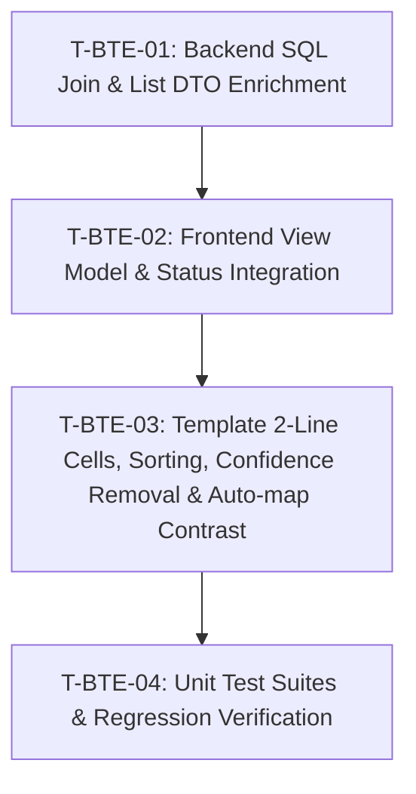

# Tasks — Bilateral Module / Bilateral Project Mapping Table Enhancements

- **Module:** bilateral-module / center-admin
- **Spec id:** 2026-08-bilateral-mapping-table-enhancements
- **Status:** not-started
- **Owner:** Platform UI Squad / Center Admin
- **Linked requirements:** ./requirements.md
- **Linked design:** ./design.md
- **Last updated:** 2026-08-20

---

## 1. Dependency Graph

---

## 2. Traceability Matrix

| Requirement | Scenarios & Clauses Covered | Tasks |
| --- | --- | --- |
| **R-BTE-001** (Confidence Removal) | Scenario 1.1 (6 columns, no confidence `<th>`/`<td>`) | T-BTE-03, T-BTE-04 |
| **R-BTE-002** (Descriptive Titles) | Scenario 2.1 (2-line layout + tooltip), Scenario 2.2 (null fallback), Scenario 2.3 (SQL join) | T-BTE-01, T-BTE-02, T-BTE-03, T-BTE-04 |
| **R-BTE-003** (Mapping Status Model) | Scenario 3.1 (Mapped filter/badge), Scenario 3.2 (Pending filter/badge/+ Map action), Scenario 3.3 (Inactive filter/badge) | T-BTE-01, T-BTE-02, T-BTE-03, T-BTE-04 |
| **R-BTE-004** (Column Sorting) | Scenario 4.1 (Agreement ID sort), Scenario 4.2 (CLARISA project sort), Scenario 4.3 (Status/Date sort) | T-BTE-03, T-BTE-04 |
| **R-BTE-005** (Auto-map Contrast) | Scenario 5.1 (Outlined primary styling), Scenario 5.2 (Hover state & dialog trigger) | T-BTE-03, T-BTE-04 |
| **NFR-BTE-001..003** | WCAG AA contrast (NFR-1), Responsive clamp (NFR-2), Single SQL join (NFR-3) | T-BTE-01, T-BTE-03, T-BTE-04 |

---

## 3. Task List

### T-BTE-01 — Backend SQL Left Join for Contract Description & List DTO Enrichment

- **Requirements covered:** R-BTE-002 (Scenario 2.3), NFR-BTE-003
- **Design reference:** `design.md` §2.1, §4, DD-1
- **Files touched (intended):**
  - `server/researchindicators/src/domain/entities/bilateral-project-mapping/bilateral-project-mapping.service.ts`
  - `server/researchindicators/src/domain/entities/bilateral-project-mapping/dto/list-bilateral-project-mappings.query.dto.ts`
  - `server/researchindicators/src/domain/entities/bilateral-project-mapping/bilateral-project-mapping.service.spec.ts`
- **Description:** Update `BilateralProjectMappingService.list()` to `leftJoin` `agresso_contracts` on `agresso_agreement_id`, selecting `ac.description` (or `ac.projectDescription`) as `agresso_description`. Ensure search filters across contract descriptions in addition to IDs.
- **Implementation notes:**
  - In TypeORM query builder, execute `leftJoin(AgressoContract, 'ac', 'ac.agreement_id = bpm.agresso_agreement_id')`.
  - Include `agresso_description` in the returned mapping items.
  - Maintain single-query execution with zero N+1 latency.
- **Acceptance / done check:**
  - [x] `GET /api/bilateral-project-mappings` response items include `agresso_description`.
  - [x] When agreement is not found in `agresso_contracts`, `agresso_description` returns null without error.
  - [x] Backend unit test in `bilateral-project-mapping.service.spec.ts` passes.
- **Disqualifiers / Failing Inputs:**
  - Disqualifier: Multiple SQL queries fired in a loop for descriptions (N+1 query defect).
  - Failing input: An agreement ID that does not exist in `agresso_contracts` causes a database join exception.
- **Dependencies:** None
- **Estimated effort:** S (≈ 40 LOC)
- **Status:** done

---

### T-BTE-02 — Frontend View Model Interface & Status Service Integration

- **Requirements covered:** R-BTE-002, R-BTE-003 (Scenarios 3.1..3.4)
- **Design reference:** `design.md` §3, §5.2, DD-2
- **Files touched (intended):**
  - `client/research-indicators/src/app/shared/interfaces/bilateral/bilateral-project-mapping.interface.ts`
  - `client/research-indicators/src/app/shared/services/bilateral-mapping.service.ts`
  - `client/research-indicators/src/app/shared/services/bilateral-mapping.service.spec.ts`
- **Description:** Extend `BilateralProjectMapping` interface with `agresso_description`, `clarisa_project_full_name`, and `mapping_status` (`'Mapped' | 'Pending' | 'Inactive'`). Update `BilateralMappingService` to support loading pending unmapped eligible projects from CLARISA cache / coverage service when status filter is `'pending'`.
- **Implementation notes:**
  - Define `MappingStatus` union type.
  - Update `BilateralMappingService.list()` to handle mapped vs pending status resolutions cleanly.
- **Acceptance / done check:**
  - [x] `BilateralProjectMapping` interface carries `agresso_description`, `clarisa_project_full_name`, and `mapping_status`.
  - [x] Service correctly maps items for `Mapped`, `Pending`, and `Inactive` query modes.
  - [x] Service unit tests in `bilateral-mapping.service.spec.ts` pass.
- **Dependencies:** T-BTE-01
- **Estimated effort:** S (≈ 30 LOC)
- **Status:** done

---

### T-BTE-03 — Frontend Template Refactoring (2-Line Cells, Sorting, Confidence Removal & Auto-map Contrast)

- **Requirements covered:** R-BTE-001 (Scenario 1.1), R-BTE-002 (Scenarios 2.1, 2.2), R-BTE-003 (Scenarios 3.1..3.4), R-BTE-004 (Scenarios 4.1..4.3), R-BTE-005 (Scenarios 5.1, 5.2), NFR-BTE-001, NFR-BTE-002
- **Design reference:** `design.md` §5.1, §5.2, §5.3, §5.4, DD-3, DD-4, DD-5
- **Files touched (intended):**
  - `client/research-indicators/src/app/pages/platform/pages/administration/center-admin/bilateral-mapping/bilateral-mapping.component.html`
  - `client/research-indicators/src/app/pages/platform/pages/administration/center-admin/bilateral-mapping/bilateral-mapping.component.ts`
  - `client/research-indicators/src/app/pages/platform/pages/administration/center-admin/bilateral-mapping/bilateral-mapping.component.scss`
- **Description:** Refactor the bilateral mapping table template: remove `Confidence` column; render AGRESSO and CLARISA cells with bold codes + truncated titles and `pTooltip`; render `Mapped` (green), `Pending` (amber), and `Inactive` (gray) status badges; add PrimeNG sort headers (`pSortableColumn` / `<p-sortIcon>`); style `⚡ Auto-map` with high-contrast outlined primary button; update Status filter dropdown with options (`All`, `Mapped`, `Pending`, `Inactive`); add quick `+ Map` action on pending rows.
- **Implementation notes:**
  - Table headers: exactly 6 columns (`Agreement ID (AGRESSO)`, `CLARISA Project (Bilateral)`, `Source`, `Status`, `Last Updated`, `Actions`).
  - AGRESSO cell: Line 1 `agresso_agreement_id`, Line 2 `agresso_description` (`line-clamp-1` + `[pTooltip]`).
  - CLARISA cell: Line 1 `clarisa_project_short_name (id)`, Line 2 `clarisa_project_full_name` (`line-clamp-1` + `[pTooltip]`).
  - Button `⚡ Auto-map`: `p-button-outlined !border-[var(--ac-primary-blue-400)] !text-[var(--ac-primary-blue-600)] hover:!bg-[var(--ac-primary-blue-50)]`.
- **Acceptance / done check:**
  - [x] No `Confidence` header or data cells present in the DOM.
  - [x] AGRESSO and CLARISA cells display 2-line layout with tooltip on hover when descriptions exist.
  - [x] When description is null or empty, cell renders only Line 1 without broken whitespace.
  - [x] Status badges display appropriate colors (`Mapped` green, `Pending` amber, `Inactive` gray).
  - [x] Column headers trigger ascending/descending sort.
  - [x] `⚡ Auto-map` button renders with clear blue border and high visual contrast.
- **Disqualifiers / Failing Inputs:**
  - Disqualifier: `Confidence` column still rendered or present in markup.
  - Failing input: Long description without `line-clamp-1` causes row height to explode vertically.
- **Dependencies:** T-BTE-02
- **Estimated effort:** M (≈ 60 LOC)
- **Status:** done

---

### T-BTE-04 — Unit Test Suites & Regression Verification

- **Requirements covered:** R-BTE-001..005, NFR-BTE-001..003
- **Design reference:** `design.md` §8 (KZ-001, KZ-015)
- **Files touched (intended):**
  - `client/research-indicators/src/app/pages/platform/pages/administration/center-admin/bilateral-mapping/bilateral-mapping.component.spec.ts`
  - `server/researchindicators/src/domain/entities/bilateral-project-mapping/bilateral-project-mapping.service.spec.ts`
- **Description:** Update component and service test suites to assert all new behaviors: removal of confidence column, 2-line title rendering and tooltip behavior, status filtering (`Mapped`, `Pending`, `Inactive`), column sorting, and `⚡ Auto-map` button interactions.
- **Implementation notes:**
  - Follow Kaizen KZ-001: Assert DOM elements, badge classes, and tooltip attributes.
  - Follow Kaizen KZ-015: Arrange filter transitions in fixtures and verify DOM updates.
- **Acceptance / done check:**
  - [x] `npm test -- --silent` passes green for `bilateral-mapping.component.spec.ts`.
  - [x] `npm test -- --silent` passes green for `bilateral-project-mapping.service.spec.ts`.
- **Dependencies:** T-BTE-01, T-BTE-02, T-BTE-03
- **Estimated effort:** S (≈ 50 LOC)
- **Status:** done
