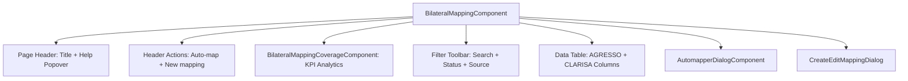

# Design — Bilateral Module / Bilateral Project Mapping UI Refinements

- **Module:** bilateral-module / center-admin
- **Spec id:** 2026-08-bilateral-mapping-ui-improvements
- **Status:** in-review
- **Owner:** Platform UI Squad / Center Admin
- **Linked requirements:** ./requirements.md
- **Linked detailed design:** [docs/trd/trd.md](../../../trd/trd.md)
- **Last updated:** 2026-08-20

---

## 1. Goals & Non-Goals

### Goals
- **G-1 (Header Ergonomics):** Elevate `⚡ Auto-map` to the primary page header flex group alongside `+ New mapping`.
- **G-2 (Contextual Onboarding):** Add accessible `(?)` help trigger and `p-popover` containing explicit copy about CLARISA ↔ AGRESSO mapping and Phase 2026 filtering.
- **G-3 (Semantic Clarity):** Update table column headers to `Agreement ID (AGRESSO)` and `CLARISA Project (Bilateral)`.
- **G-4 (Visual Craft):** Refine `Mapping Coverage` telemetry strip layout to focus purely on metrics (Mapped, Pending, Reachable) with PrimeNG Aura tokens.

### Non-Goals
- Modifying backend endpoints or database schema (`bilateral_project_mapping` table).
- Changing automapper batch execution logic or CLARISA sync workers.
- Altering the creation/editing modal form fields or validation logic.

---

## 2. Architecture Overview

This is a **client-only** UX/UI refinement within the STAR Angular 19 application located under:
`client/research-indicators/src/app/pages/platform/pages/administration/center-admin/bilateral-mapping/`



### Component Breakdown
1. **`BilateralMappingComponent` (`bilateral-mapping.component.ts/.html`):**
   - Hosts the page header with title, `(?)` help popover, `⚡ Auto-map` button, and `+ New mapping` button.
   - Hosts the filter toolbar, table, and dialog overlays.
2. **`BilateralMappingCoverageComponent` (`bilateral-mapping-coverage.component.ts/.html`):**
   - Streamlined to render solely the telemetry card: 3 KPI metric tiles (Mapped, Pending, Reachable), 5-min cache freshness tag, and `pi-refresh` button.
3. **`PopoverModule` (`primeng/popover`):**
   - Imported into `BilateralMappingComponent` to render the floating context guidance cleanly attached to the `(?)` button target.

---

## 3. Data Model

**No data model changes.** All backend entities and DTOs remain untouched.

---

## 4. UI Component Architecture & Design Decisions

### 4.1 Header Action Layout
The page header flex container is organized as:
```
[ Title: Bilateral Project Mapping  (?) ]  ───────>  [ ⚡ Auto-map ] [ + New mapping ]
```
- **Title & Help Button:**
  - Heading: `Bilateral Project Mapping` (font Inter / Barlow, bold, `atc-primary-blue-600`).
  - Help Trigger: `p-button` with `icon="pi pi-question-circle"`, `severity="secondary"`, `[text]="true"`, `data-testid="help-popover-btn"`, `aria-label="About Bilateral Project Mapping"`.
- **Action Buttons:**
  - `Auto-map`: `p-button` with `label="Auto-map"`, `icon="pi pi-bolt"`, `severity="secondary"`, `size="small"`, `(onClick)="openAutomapperDialog()"`, `data-testid="header-automap-btn"`.
  - `New mapping`: `p-button` with `label="New mapping"`, `icon="pi pi-plus"`, `severity="primary"`, `size="small"`, `(onClick)="openCreateDialog()"`, `data-testid="new-mapping-btn"`.

### 4.2 Module Help Popover Specification
- **Component:** `p-popover` (`#helpOp`, `appendTo="body"`).
- **Trigger:** `helpOp.toggle($event)` on the `(?)` button.
- **Copy Content:**
  - **Header:** `About Bilateral Project Mapping`
  - **Body Text:**
    - *"In this module, bilateral projects from CLARISA (filtered by the active phase, e.g., Phase 2026) are mapped and reconciled against AGRESSO agreements and contracts."*
    - *"This mapping ensures that Science Program alignments, Pool Funding contributions, and indicator reporting reflect active bilateral agreements accurately in STAR."*
  - **Badges/Tags:** `Active Phase: 2026` · `Source: CLARISA API & AGRESSO`.

### 4.3 Table Column Header Formatting
- Column 1: `Agreement ID (AGRESSO)`
  - Subtext/Tooltip: `AGRESSO Contract / Agreement Code`
  - Cell formatting: Monospace text for `agresso_agreement_id`.
- Column 2: `CLARISA Project (Bilateral)`
  - Subtext/Tooltip: `CLARISA Bilateral Project ID & Code`
  - Cell formatting: Bold project code/short name with `(id <clarisa_project_id>)` secondary label.

---

## 5. Design Decisions & Trade-offs

| ID | Decision | Rationale | Alternatives Considered |
| --- | --- | --- | --- |
| **DD-1** | Elevate `Auto-map` to page header | Unifies all top-level operator actions in a single discoverable action bar | Keeping button in coverage strip (rejected: hard to discover) |
| **DD-2** | Use PrimeNG `p-popover` for module guidance | Lightweight, accessible, dismissible with Escape/outside click, does not clutter vertical layout | Persistent hero banner (rejected: consumes too much screen space) |
| **DD-3** | Rename table headers to explicitly include `(AGRESSO)` and `(Bilateral)` | Eliminates operator confusion about source systems without breaking table layout | Adding sub-headers (rejected: unnecessary vertical height) |
| **DD-4** | Retain coverage strip as pure analytics readout | Clean separation of concerns: strip displays metrics; header manages actions | Removing coverage strip (rejected: KPI metrics are vital for monitoring feed health) |

---

## 6. Step 2.3 Challenge Reversions

- **Reversion Evaluated:** Removing `p-button` for `Auto-map` from `bilateral-mapping-coverage.component.html`.
- **Question:** *What does removing this button from the coverage strip break?*
- **Assessment:**
  - The `@Output() openAutomapper` on `bilateral-mapping-coverage` is no longer required for opening the dialog, because the button now triggers `openAutomapperDialog()` directly on the host component.
  - The dialog component (`AutomapperDialogComponent`) remains mounted on `BilateralMappingComponent` and opens identically.
  - Coverage telemetry loading, skeleton states, and error retry remain 100% intact.
  - No regression identified.

---

## 7. Step 2.4 Budget & Sizing

| Metric | Budget Target |
| --- | --- |
| **Expected Tasks** | 2 tasks |
| **Expected LOC** | ~120 LOC |
| **Expected Review Rounds** | 1 round |
| **Declared Depth** | `Standard` |

*Tripwire note:* If execution requires more than 2 tasks or >250 LOC, escalate to the user before proceeding.

---

## 8. Testing Strategy

- **Component Unit Tests:**
  - `bilateral-mapping.component.spec.ts`:
    - Assert header renders both `Auto-map` and `New mapping` buttons.
    - Assert clicking `Auto-map` calls `openAutomapperDialog()`.
    - Assert `(?)` button toggles the help popover with module copy.
    - Assert table header strings match `Agreement ID (AGRESSO)` and `CLARISA Project (Bilateral)`.
  - `bilateral-mapping-coverage.component.spec.ts`:
    - Assert coverage strip renders KPI cards and refresh button without the action button.
- **Verification Commands:**
  - `npm test -- --silent bilateral-mapping` (Unit tests)
  - `npm run lint -- --quiet` (Linter check)
