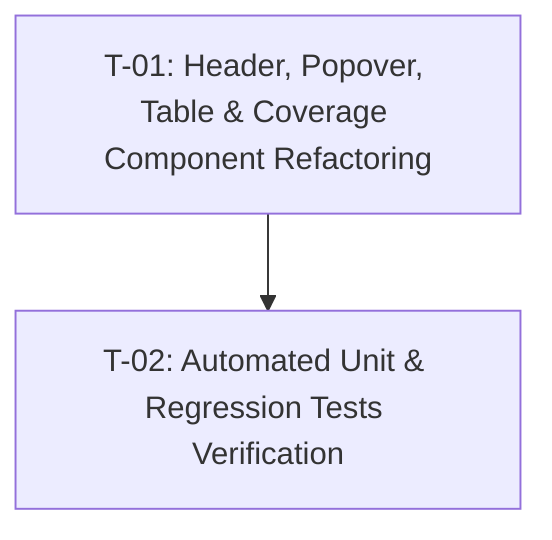

# Tasks — Bilateral Module / Bilateral Project Mapping UI Refinements

- **Module:** bilateral-module / center-admin
- **Spec id:** 2026-08-bilateral-mapping-ui-improvements
- **Status:** not-started
- **Owner:** Platform UI Squad / Center Admin
- **Linked requirements:** ./requirements.md
- **Linked design:** ./design.md
- **Last updated:** 2026-08-20

---

## 1. Task Numbering & Dependency Graph

---

## 2. Task List

### T-01 — Component Template, Header Action Group & Help Popover Implementation

- **Requirements covered:** `R-BIL-UI-001` (Scenarios 1.1, 1.2), `R-BIL-UI-002` (Scenario 2.1), `R-BIL-UI-003` (Scenario 3.1), `R-BIL-UI-004` (Scenario 4.1), `NFR-BIL-UI-001`
- **Design references:** `design.md` §4.1, §4.2, §4.3, §5 (DD-1, DD-2, DD-3)
- **Files touched (intended):**
  - `client/research-indicators/src/app/pages/platform/pages/administration/center-admin/bilateral-mapping/bilateral-mapping.component.ts`
  - `client/research-indicators/src/app/pages/platform/pages/administration/center-admin/bilateral-mapping/bilateral-mapping.component.html`
  - `client/research-indicators/src/app/pages/platform/pages/administration/center-admin/bilateral-mapping/components/bilateral-mapping-coverage/bilateral-mapping-coverage.component.html`
- **Description:**
  - Import `PopoverModule` from `primeng/popover` in `bilateral-mapping.component.ts`.
  - In `bilateral-mapping.component.html`:
    - Add `(?)` Help button with `pi pi-question-circle` next to the page heading, wired to `helpOp.toggle($event)`.
    - Add `p-popover` `#helpOp` containing the module explanation, phase filtering (Phase 2026), and downstream STAR impact.
    - Add `⚡ Auto-map` button (`p-button` with `pi pi-bolt`, `severity="secondary"`, `data-testid="header-automap-btn"`) in the top-right header action flex container next to `+ New mapping`.
    - Update table column headers to `Agreement ID (AGRESSO)` and `CLARISA Project (Bilateral)`.
  - In `bilateral-mapping-coverage.component.html`:
    - Remove the `Auto-map` button from the coverage strip, maintaining the 3 KPI metric tiles, cache freshness tag, and `pi-refresh` button.
- **Acceptance / done check:**
  - [x] Top header renders `⚡ Auto-map` and `+ New mapping` side-by-side.
  - [x] Clicking `⚡ Auto-map` opens the automapper dialog (`openAutomapperDialog()`).
  - [x] Clicking `(?)` opens the floating popover with descriptive copy.
  - [x] Table headers display `Agreement ID (AGRESSO)` and `CLARISA Project (Bilateral)`.
  - [x] Coverage strip renders purely the 3 KPI cards and refresh button without the action button.
- **Disqualifying Evidence:**
  - `Auto-map` button still rendered inside the coverage strip.
  - Hardcoded hex colors used instead of CSS design tokens / PrimeNG classes.
  - Missing `aria-label` or broken click handlers.
- **Dependencies:** None
- **Estimated effort:** S (~1 hour)
- **Status:** done
- **Relevant skills:** `ui-ux-pro-max`, `frontend-design`, `angular-developer`

---

### T-02 — Automated Unit & Regression Tests Verification

- **Requirements covered:** `NFR-BIL-UI-001`, `NFR-BIL-UI-002`
- **Design references:** `design.md` §8 (Testing Strategy)
- **Files touched (intended):**
  - `client/research-indicators/src/app/pages/platform/pages/administration/center-admin/bilateral-mapping/bilateral-mapping.component.spec.ts`
  - `client/research-indicators/src/app/pages/platform/pages/administration/center-admin/bilateral-mapping/components/bilateral-mapping-coverage/bilateral-mapping-coverage.component.spec.ts`
- **Description:**
  - Update unit tests in `bilateral-mapping.component.spec.ts`:
    - Assert `header-automap-btn` is rendered in the top header and calls `openAutomapperDialog()` on click.
    - Assert `help-popover-btn` is rendered next to the title and contains the expected `aria-label`.
    - Assert table header columns match `Agreement ID (AGRESSO)` and `CLARISA Project (Bilateral)`.
  - Update unit tests in `bilateral-mapping-coverage.component.spec.ts`:
    - Assert coverage strip renders KPI tiles and refresh button without the action button.
  - Run full test suite and linter to confirm zero regressions.
- **Acceptance / done check:**
  - [x] `npm test -- --silent bilateral-mapping` passes 100% green.
  - [x] `npm run lint -- --quiet` in `client/research-indicators` exits with 0 errors.
- **Disqualifying Evidence:**
  - Any failing unit test or broken assertion.
  - Linter warnings or errors.
- **Dependencies:** `T-01`
- **Estimated effort:** S (~30 mins)
- **Status:** done
- **Relevant skills:** `angular-developer`

---

## 3. Requirement to Task Traceability Matrix

| Requirement | Clause / Scenario | Assigned Task |
| --- | --- | --- |
| `R-BIL-UI-001` | Scenario 1.1 (Automapper Trigger from Header) | `T-01`, `T-02` |
| `R-BIL-UI-001` | Scenario 1.2 (Coverage Strip Telemetry & Refresh) | `T-01`, `T-02` |
| `R-BIL-UI-002` | Scenario 2.1 (Help Button & Popover) | `T-01`, `T-02` |
| `R-BIL-UI-003` | Scenario 3.1 (Explicit Table Column Headers) | `T-01`, `T-02` |
| `R-BIL-UI-004` | Scenario 4.1 (Harmonized Status Filter & Badges) | `T-01`, `T-02` |
| `NFR-BIL-UI-001` | Accessibility (WCAG 2.1 AA) & Design Tokens | `T-01`, `T-02` |
| `NFR-BIL-UI-002` | Component Isolation & Test Coverage Floor | `T-02` |
