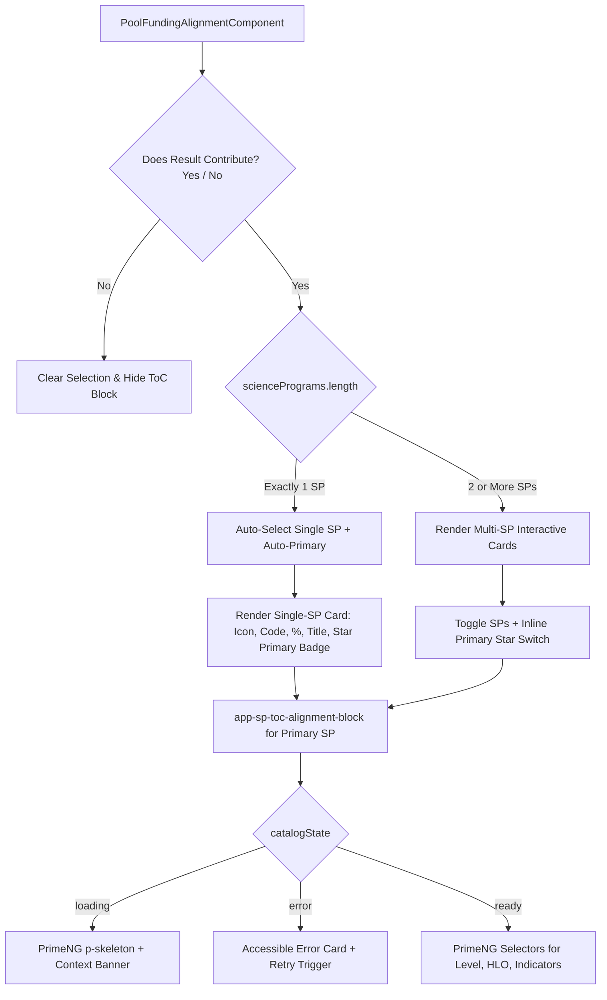

# Design — Pool Funding Alignment / UX/UI Enhancements

- **Module:** results / pool-funding-alignment
- **Spec id:** 2026-08-pool-funding-ux-improvements
- **Status:** in-review
- **Owner:** Results Squad / Frontend Core
- **Linked requirements:** [`./requirements.md`](file:///Users/jcadavid/orca/workspaces/alliance-research-indicators-main/AC-1676/docs/specs/changes/pool-funding-ux-improvements/requirements.md)
- **Linked TRD:** [`docs/trd/trd.md`](file:///Users/jcadavid/orca/workspaces/alliance-research-indicators-main/AC-1676/docs/trd/trd.md)
- **Last updated:** 2026-08-20

---

## 1. Goals & Non-Goals

### Goals
- **G-1:** Eliminate manual dropdown and duplicate radio clicks for single-SP projects by implementing intelligent auto-selection and a dedicated Single-SP visual card (maps to R-PFU-001).
- **G-2:** Unify Science Program selection and Primary SP designation into an interactive card grid for multi-SP projects, removing the separate redundant radio question section (maps to R-PFU-002).
- **G-3:** Remove the confusing and misleading `Pending` status tag from result submission views (maps to R-PFU-003).
- **G-4:** Provide informative, skeleton-backed loading feedback (`p-skeleton`) during external CLARISA ToC catalog queries (maps to R-PFU-004, NFR-PFU-002).
- **G-5:** Maintain 100% data contract compatibility and WCAG 2.1 AA accessibility (maps to NFR-PFU-001, NFR-PFU-003).

### Non-Goals
- Modifying backend endpoints or database schemas (wire payload `sp_codes`, `primary_sp_code`, `toc_alignments` remains identical).
- Modifying ToC alignment data model or CLARISA external endpoints.

---

## 2. Architecture & UI Component Composition



### 2.1 Component Structure

| Component Path | Role / Changes |
| --- | --- |
| `client/.../result/pages/pool-funding-alignment/pool-funding-alignment.component.ts` | Handles auto-selection on `has_contribution = true` when `sciencePrograms().length === 1`, manages interactive SP selection and Primary toggle, removes redundant radio group state. |
| `client/.../result/pages/pool-funding-alignment/pool-funding-alignment.component.html` | Replaces empty multi-select dropdown with Single-SP Card / Multi-SP Card grid; removes separate Primary radio section; removes `Pending` tag. |
| `client/.../result/pages/pool-funding-alignment/pool-funding-alignment.component.scss` | Styling for SP cards, active state rings, hover elevations, and primary star badges using ARI design tokens. |
| `client/.../components/sp-toc-alignment-block/sp-toc-alignment-block.component.ts` | Imports `SkeletonModule` from `primeng/skeleton` and exposes contextual loading state. |
| `client/.../components/sp-toc-alignment-block/sp-toc-alignment-block.component.html` | Replaces raw spinner with `p-skeleton` shapes and informative progress banner during `catalogState() === 'loading'`. |

---

## 3. Data Model & Signal State Architecture

The frontend form data shape is preserved without breaking changes:

```typescript
export interface AlignmentFormData {
  has_contribution: boolean | null;
  selected_sps: SelectedScienceProgram[];
  primary_sp_code: string | null;
  toc_drafts: SpAlignmentDraft[];
}
```

### 3.1 Single-SP Auto-Selection Logic (`onContributionChange`)
```typescript
onContributionChange(value: boolean | null): void {
  const sps = this.sciencePrograms();
  const isSingleSp = sps.length === 1;

  this.formData.update(form => {
    if (value === true && isSingleSp) {
      const sp = sps[0];
      const selected: SelectedScienceProgram = {
        code: sp.code,
        name: sp.name,
        official_code: sp.official_code,
        allocation: sp.allocation,
        color: sp.color,
        icon_key: sp.icon_key
      };
      return {
        ...form,
        has_contribution: true,
        selected_sps: [selected],
        primary_sp_code: sp.official_code,
        toc_drafts: [this.emptyDraft(sp.official_code)]
      };
    }

    return {
      ...form,
      has_contribution: value,
      selected_sps: value === false ? [] : form.selected_sps,
      primary_sp_code: value === false ? null : form.primary_sp_code,
      toc_drafts: value === false ? [] : form.toc_drafts
    };
  });
}
```

---

## 4. Frontend / UX Visual Design Specification

### 4.1 Single-SP Visual Card Design (DD-1)
- **Container:** Rounded (`rounded-[10px]`), white background (`bg-white`), subtle border (`border border-[var(--ac-primary-blue-200)]`), soft shadow.
- **Left Column:** 32x32px Science Program Icon with rounded container and color swatch.
- **Center Column:**
  - Line 1: `strong` official code (e.g. `SP06`), contribution badge (e.g. `100% Allocation`), full program title in `atc-grey-900`.
- **Right Column:**
  - High-visibility Primary badge: `inline-flex items-center gap-1.5 px-3 py-1 rounded-full text-xs font-semibold bg-[var(--ac-primary-blue-50)] text-[var(--ac-primary-blue-700)] border border-[var(--ac-primary-blue-300)]`.
  - Icon: `<i class="pi pi-star-fill text-[var(--ac-primary-blue-600)]"></i> Primary Program`.

### 4.2 Multi-SP Selection Grid & Inline Primary Toggle (DD-2)
- **Card States:**
  - *Unselected:* `border border-[var(--ac-grey-300)] bg-white opacity-85 hover:border-[var(--ac-primary-blue-300)] hover:opacity-100 cursor-pointer`.
  - *Selected (Contributing):* `border-2 border-[var(--ac-primary-blue-400)] bg-[var(--ac-primary-blue-50)]/30`. Contains an action button *"Set as Primary"*.
  - *Selected (Primary):* `border-2 border-[var(--ac-primary-blue-600)] bg-[var(--ac-primary-blue-50)] shadow-sm`. Displays prominent `★ Primary` badge.

### 4.3 Skeleton Loading Design for ToC Queries (DD-4)
- When `catalogState() === 'loading'`:
  - **Banner:** Light blue info box (`bg-[#F4F7F9] border-l-4 border-[#074B86] p-3 text-sm flex items-center gap-2`).
  - **Level Placeholder:** `<p-skeleton width="100%" height="42px" borderRadius="8px" />`.
  - **HLO Placeholder:** `<p-skeleton width="100%" height="42px" borderRadius="8px" />`.
  - **Indicator Placeholder:** `<p-skeleton width="100%" height="70px" borderRadius="8px" />`.

---

## 5. Design Decisions

### DD-1: Single-SP Auto-Selection & Card Tile Display
- **Context:** Most bilateral projects map to a single Science Program. Showing an empty dropdown with 1 checkbox creates pointless user friction.
- **Decision:** When `sciencePrograms().length === 1`, toggling "Yes" automatically seeds the SP as selected and Primary, rendering a polished display card instead of the dropdown.
- **Trade-off:** Minimal extra code in `onContributionChange` vs saving users 3+ unnecessary clicks per result submission.

### DD-2: Elimination of Redundant Separate Primary Radio Group
- **Context:** Having a separate question below the multi-select asks the user to re-select the primary SP, duplicating vertical space.
- **Decision:** Integrate Primary designation directly onto the SP Cards. Selecting a single SP makes it Primary automatically. Multiple SPs allow one-click Primary toggle on the cards.
- **Trade-off:** Eliminates 1 entire section from the DOM and simplifies form flow.

### DD-3: Removal of the "Pending" Tag from Result Flow
- **Context:** An orange `Pending` tag was displayed in the result form for unconfirmed bilateral allocations, confusing submitters.
- **Decision:** Remove `Pending` badge from the result submission form. The author only needs to see their scientific alignment.

### DD-4: PrimeNG Skeleton Loaders for External ToC Queries
- **Context:** CLARISA ToC catalog calls can take 1-3 seconds, causing dropdowns to spin or appear frozen.
- **Decision:** Replace spinning icons with `p-skeleton` shapes and contextual message banners (*"Fetching Theory of Change catalog from CLARISA..."*).

---

## 6. Step 2.3 — Reversion Challenge

| Design Element Removed | Reversion Challenge Question | Resolution & Evidence |
| --- | --- | --- |
| **Separate Primary Radio Section** | *Does removing the radio section break form validation or Primary SP storage?* | **No.** `primary_sp_code` continues to be stored and validated in the `formData` signal with exact same payload structure. |
| **"Pending" Status Tag** | *Does removing the `Pending` tag hide critical operational blockers from authors?* | **No.** Bilateral allocation status is managed by Center Administrators in `/admin/bilateral-mapping`. Results authors cannot edit this mapping and were only confused by the tag. |

---

## 7. Step 2.4 — Sizing and Design Budget

- **Expected Tasks:** 3 tasks
  - `T-PFU-01`: Single-SP Auto-Selection & Card Component Integration (M, ~70 LOC)
  - `T-PFU-02`: Multi-SP Interactive Cards & Inline Primary Toggle (M, ~80 LOC)
  - `T-PFU-03`: Skeleton Loaders for ToC Block & Regression Unit Tests (M, ~70 LOC)
- **Expected LOC:** ~220 LOC (template + component + tests).
- **Expected Review Rounds:** 1 round.

---

## 8. Cross-Check Against Requirements (Kaizen KZ-016)

- R-PFU-001 (Single-SP Auto-Selection) -> Covered in §3.1 & §4.1 (DD-1).
- R-PFU-002 (Multi-SP Selection & Primary Toggle) -> Covered in §4.2 (DD-2).
- R-PFU-003 (Removal of Pending Tag) -> Covered in §4.1, §4.2, §5 (DD-3).
- R-PFU-004 (Skeleton Loaders) -> Covered in §4.3 (DD-4).
- NFR-PFU-001..003 (A11y, Performance, Contract) -> Covered in §1, §3, §4, §5.
