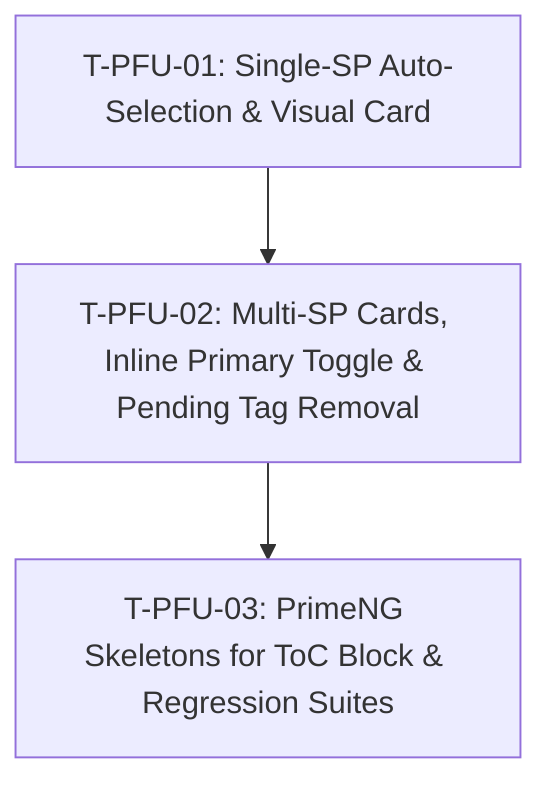

# Tasks — Pool Funding Alignment / UX/UI Enhancements

- **Module:** results / pool-funding-alignment
- **Spec id:** 2026-08-pool-funding-ux-improvements
- **Status:** not-started
- **Owner:** Results Squad / Frontend Core
- **Linked requirements:** [`./requirements.md`](file:///Users/jcadavid/orca/workspaces/alliance-research-indicators-main/AC-1676/docs/specs/changes/pool-funding-ux-improvements/requirements.md)
- **Linked design:** [`./design.md`](file:///Users/jcadavid/orca/workspaces/alliance-research-indicators-main/AC-1676/docs/specs/changes/pool-funding-ux-improvements/design.md)
- **Last updated:** 2026-08-20

---

## 1. Dependency Graph

---

## 2. Task List

### T-PFU-01 — Single Science Program Auto-Selection & Visual Card Integration

- **Requirements covered:** R-PFU-001 (Scenarios 1.1, 1.2), NFR-PFU-001, NFR-PFU-002, NFR-PFU-003
- **Design reference:** `design.md` §3.1, §4.1, DD-1
- **Files touched (intended):**
  - `client/research-indicators/src/app/pages/platform/pages/result/pages/pool-funding-alignment/pool-funding-alignment.component.ts`
  - `client/research-indicators/src/app/pages/platform/pages/result/pages/pool-funding-alignment/pool-funding-alignment.component.html`
  - `client/research-indicators/src/app/pages/platform/pages/result/pages/pool-funding-alignment/pool-funding-alignment.component.scss`
  - `client/research-indicators/src/app/pages/platform/pages/result/pages/pool-funding-alignment/pool-funding-alignment.component.spec.ts`
- **Description:** When the project has exactly 1 Science Program mapped (`sciencePrograms().length === 1`), selecting "Yes" on the contribution question automatically selects that SP, sets it as `primary_sp_code`, initializes its ToC draft, and renders a polished **Selected Science Program Card** with the program icon, code, allocation %, title, and `★ Primary` status pill. Toggling to "No" clears all selection and drafts.
- **Implementation notes:**
  - In `onContributionChange(value)`: When `value === true` and `sciencePrograms().length === 1`, automatically update `formData` signal with `selected_sps: [sp]`, `primary_sp_code: sp.official_code`, and `toc_drafts: [emptyDraft]`.
  - In template: When `sciencePrograms().length === 1`, render the Single-SP Card and hide the multi-select dropdown and the separate Primary radio question.
- **Acceptance / done check:**
  - [x] Clicking "Yes" on a single-SP result immediately populates `selected_sps` and `primary_sp_code` in `formData()`.
  - [x] The Single-SP Card renders in the DOM with program icon, code, allocation %, title, and `★ Primary` badge.
  - [x] No multi-select dropdown is rendered when `sciencePrograms().length === 1`.
  - [x] No separate "Select the Primary Science Program" radio question is rendered when `sciencePrograms().length === 1`.
  - [x] Clicking "No" clears `selected_sps`, `primary_sp_code`, and `toc_drafts`.
- **Disqualifiers / Failing Inputs:**
  - Disqualifier: Dropdown still rendered when single SP is mapped.
  - Failing input: Selecting "Yes" on a single-SP project leaves `primary_sp_code` null or requires manual selection.
- **Verification command:**
  `npx jest src/app/pages/platform/pages/result/pages/pool-funding-alignment/pool-funding-alignment.component.spec.ts --coverage=false` (from `client/research-indicators`)
- **Estimated effort:** M (≈ 70 LOC)
- **Status:** done

---

### T-PFU-02 — Multi-SP Interactive Cards, Inline Primary Toggle & Removal of Pending Tag

- **Requirements covered:** R-PFU-002 (Scenarios 2.1, 2.2, 2.3), R-PFU-003 (Scenario 3.1), NFR-PFU-001
- **Design reference:** `design.md` §4.2, DD-2, DD-3
- **Files touched (intended):**
  - `client/research-indicators/src/app/pages/platform/pages/result/pages/pool-funding-alignment/pool-funding-alignment.component.ts`
  - `client/research-indicators/src/app/pages/platform/pages/result/pages/pool-funding-alignment/pool-funding-alignment.component.html`
  - `client/research-indicators/src/app/pages/platform/pages/result/pages/pool-funding-alignment/pool-funding-alignment.component.scss`
  - `client/research-indicators/src/app/pages/platform/pages/result/pages/pool-funding-alignment/pool-funding-alignment.component.spec.ts`
- **Description:** For projects with multiple Science Programs (`sciencePrograms().length > 1`), replace the multi-select dropdown with an interactive grid of Selectable SP Cards. Selecting a single SP automatically makes it Primary. When multiple SPs are selected, users can toggle/designate the Primary SP directly on the cards using a one-click "Set as Primary" star button. Remove the separate redundant Primary radio question section completely and remove the `Pending` tag.
- **Implementation notes:**
  - Add helper methods `toggleSp(sp: ScienceProgram)` and `setPrimarySp(spCode: string)` in `pool-funding-alignment.component.ts`.
  - Ensure deselecting the current Primary auto-promotes the remaining SP if exactly 1 remains, or clears Primary if 0 remain.
  - Remove `<section class="mb-6" data-testid="pf-alignment-primary-section">` from template.
  - Remove all occurrences of `PENDING_SP_TAG` / `pf-stale-tag` from the result alignment template.
- **Acceptance / done check:**
  - [x] Multi-SP projects display interactive cards for all available Science Programs.
  - [x] Selecting exactly 1 SP auto-designates it as Primary (`★ Primary` badge shown).
  - [x] Selecting multiple SPs renders "Set as Primary" star action on contributing cards; clicking it updates `primary_sp_code` and switches the Primary badge.
  - [x] No `Pending` badge is rendered anywhere in the result alignment view.
  - [x] Separate Primary radio question section is completely removed from markup.
- **Disqualifiers / Failing Inputs:**
  - Disqualifier: `Pending` tag still appears in the DOM.
  - Failing input: Selecting multiple SPs leaves no way to designate the Primary program.
- **Dependencies:** T-PFU-01
- **Verification command:**
  `npx jest src/app/pages/platform/pages/result/pages/pool-funding-alignment/pool-funding-alignment.component.spec.ts --coverage=false` (from `client/research-indicators`)
- **Estimated effort:** M (≈ 80 LOC)
- **Status:** done

---

### T-PFU-03 — PrimeNG Skeleton Loaders for ToC Queries & Full Regression Verification

- **Requirements covered:** R-PFU-004 (Scenarios 4.1, 4.2, 4.3), NFR-PFU-001..003
- **Design reference:** `design.md` §4.3, DD-4
- **Files touched (intended):**
  - `client/research-indicators/src/app/pages/platform/pages/result/pages/pool-funding-alignment/components/sp-toc-alignment-block/sp-toc-alignment-block.component.ts`
  - `client/research-indicators/src/app/pages/platform/pages/result/pages/pool-funding-alignment/components/sp-toc-alignment-block/sp-toc-alignment-block.component.html`
  - `client/research-indicators/src/app/pages/platform/pages/result/pages/pool-funding-alignment/components/sp-toc-alignment-block/sp-toc-alignment-block.component.scss`
  - `client/research-indicators/src/app/pages/platform/pages/result/pages/pool-funding-alignment/pool-funding-alignment.component.spec.ts`
  - `client/research-indicators/src/app/pages/platform/pages/result/pages/pool-funding-alignment/components/sp-toc-alignment-block/sp-toc-alignment-block.component.spec.ts`
- **Description:** Integrate `SkeletonModule` from `primeng/skeleton` into `sp-toc-alignment-block.component.ts`. Render modern skeleton placeholders matching the dimensions of level, HLO, and indicator controls during `catalogState() === 'loading'` along with an informative progress banner (*"Fetching Theory of Change catalog from CLARISA..."*). Update and expand test suites across both components to ensure 100% green regression coverage.
- **Implementation notes:**
  - In `sp-toc-alignment-block.component.ts`: Add `SkeletonModule` to `imports`.
  - In `sp-toc-alignment-block.component.html`: Render skeleton placeholders with `aria-busy="true"` and contextual message banner when `catalogState() === 'loading'`.
  - Assert keyboard accessibility, skeleton rendering, error retry button, and form save payload in tests.
- **Acceptance / done check:**
  - [x] Skeletons render during `catalogState() === 'loading'` with contextual banner.
  - [x] When catalog resolves, skeletons transition smoothly to PrimeNG selectors.
  - [x] Error alert with `Retry` button renders when `catalogState() === 'error'`.
  - [x] All unit test suites pass 100% green without regressions.
- **Disqualifiers / Failing Inputs:**
  - Disqualifier: Skeletons do not render during catalog loading or cause layout jumps.
- **Dependencies:** T-PFU-01, T-PFU-02
- **Verification command:**
  `npx jest src/app/pages/platform/pages/result/pages/pool-funding-alignment/pool-funding-alignment.component.spec.ts src/app/pages/platform/pages/result/pages/pool-funding-alignment/components/sp-toc-alignment-block/sp-toc-alignment-block.component.spec.ts --coverage=false` (from `client/research-indicators`)
- **Estimated effort:** M (≈ 70 LOC)
- **Status:** done

---

## 3. Requirement Traceability Matrix

| Requirement / Scenario | Task Mapping | Status |
| --- | --- | --- |
| **R-PFU-001 (Scenario 1.1)** | T-PFU-01 | done |
| **R-PFU-001 (Scenario 1.2)** | T-PFU-01 | done |
| **R-PFU-002 (Scenario 2.1)** | T-PFU-02 | done |
| **R-PFU-002 (Scenario 2.2)** | T-PFU-02 | done |
| **R-PFU-002 (Scenario 2.3)** | T-PFU-02 | done |
| **R-PFU-003 (Scenario 3.1)** | T-PFU-02 | done |
| **R-PFU-004 (Scenario 4.1)** | T-PFU-03 | done |
| **R-PFU-004 (Scenario 4.2)** | T-PFU-03 | done |
| **R-PFU-004 (Scenario 4.3)** | T-PFU-03 | done |
| **NFR-PFU-001 (A11y)** | T-PFU-01, T-PFU-02, T-PFU-03 | done |
| **NFR-PFU-002 (CLS & Clicks)** | T-PFU-01, T-PFU-03 | done |
| **NFR-PFU-003 (Contract)** | T-PFU-01, T-PFU-03 | done |

---

## 4. Sizing Budget Summary

| Metric | Budget |
| --- | --- |
| Total Tasks | 3 |
| Estimated Total LOC | ~220 LOC |
| Expected Review Rounds | 1 round |
| Tripwire Limit | > 4 tasks or > 350 LOC triggers escalation |
