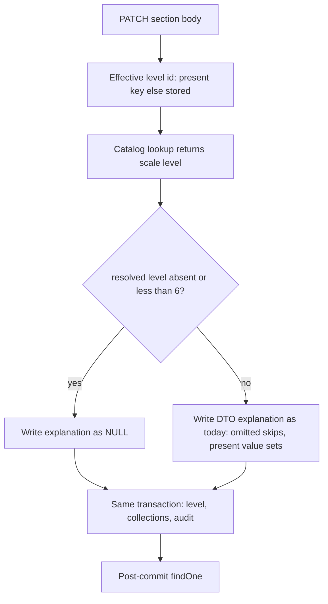

# Design — Innovation Use / Stale justification on level drop

- **Module:** results (`result-innovation-use`)
- **Spec id:** 2026-08-innovation-use-stale-justification
- **Status:** specified (Phase 3 complete; not executed)
- **Owner:** Engineering / product owner
- **Linked requirements:** [`./requirements.md`](./requirements.md)
- **Linked detailed design:** [`docs/trd/trd.md`](../../../trd/trd.md) — Results domain persist; no new ADR
- **Last updated:** 2026-08-24

---

## 1. Document Control

| Field | Value |
| --- | --- |
| **Spec path** | `bugfix/innovation-use-stale-justification` |
| **Depth** | Lite · Bug Mode |
| **Proposal** | [`./proposal.md`](./proposal.md) — option **A** |
| **Migration** | **None** |
| **Skills loaded** | `nestjs-expert`. `software-architect` **not** loaded — no new module, integration, data flow, or topology |
| **Reversion challenge** | Step 2.3 run on **Composer 2.5** (≠ this session’s model). Verdict: **design change not required.** See §6 |
| **KZ-016** | Cross-check of every `BUT` / `AND IT MUST` vs this design: §11 |

---

## 2. Goals & non-goals

**Goals**

- After persist, a row whose effective catalog `level` is `< 6` or absent has `innovation_use_level_explanation = NULL`, including when STAR still sends the old string (**R-IUJ-001**).
- At effective catalog `level >= 6`, omitted-key preserve and draft-save write-through stay as they are (**R-IUJ-002**).
- The Bug-Mode gate is a raw column read against real MySQL, observed red then green (**NFR-IUJ-002**). Server-only, no migration (**NFR-IUJ-001**).

**Non-goals** — same fence as `requirements.md` §4: `client/`, other conditional fields, backfill, green-check SQL, restoring `validateLevelExplanation`, snapshots, D1 as a done-criterion, D2/P1.

---

## 3. Architecture

Existing Innovation Use section `PATCH` only. No new files in production.



Guards, envelope, and transaction boundary are unchanged. The only new branch is **which value** the existing scalar write uses for the explanation.

**Composition — files touched**

| Path | Change |
| --- | --- |
| `server/.../result-innovation-use/result-innovation-use.service.ts` | Use the catalog `level` already resolved on this path to choose NULL vs today’s DTO passthrough for the explanation write |
| `server/.../result-innovation-use/result-innovation-use.service.spec.ts` | Unit cases for the choice. **Not** Bug-Mode evidence |
| `server/.../test/fixtures/innovation-use/innovation-use-section-round-trip.fixture-spec.ts` | Add F1–F3 (+ AC.4) next to the existing DD-14 omitted-key case (F4). Prefer this file: it already has a stored catalog-id-7 + explanation row. **Do not** fold into `innovation-use-level-boundary.fixture-spec.ts` (that file’s job is save vs green-check, a different defect class) |
| `docs/specs/innovation-use/family.md` | Follow-up/risk row, not a child row |
| `docs/specs/innovation-use/OPEN-ITEMS.md` | Point **N-2** at this spec |

**Reuse:** `effectiveLevelId` merge (`!== undefined`, never `??`), `resolveInnovationUseLevel` (catalog join, `Number` on bigint, unknown id → `400`), step-6 `update`, post-commit `findOne`. Do not add a second catalog lookup. Do not compare `innovation_use_level_id` to 6.

**No data model change. No API shape change. No admin SSR. No integrations. No STAR files.**

---

## 4. The change

On every `update`, the catalog `level` of the **effective** level id is already computed and thrown away. Capture it.

| Effective catalog `level` | Explanation value passed to the existing scalar write |
| --- | --- |
| `undefined` (no level) or `< 6` | **`NULL`** — a skip (`undefined`) leaves the stale column; only an explicit null SETs it. A present string in the DTO is ignored |
| `>= 6` | **DTO value as today** — omitted → skip (preserve); present `''` / `'   '` / text / `null` → write through |

Threshold is the catalog scale point **6**, the same number the green check and STAR’s justification visibility already use. It is compared to the **resolved `level`**, never to the FK (family D-1: catalog id 6 is level 5).

`effectiveLevelId` stays the present-key-else-stored merge. Explicit `null` on `innovation_use_level_id` is a present key and yields no catalog `level` → clear (**R-IUJ-001** AC.4). Omitting the level key while a stored catalog id 7 remains → effective `level` 6 → preserve (**R-IUJ-002**).

Collections, `innovation_use_level_id`, and audit stay on today’s writes. This branch does not call the actor / organization / quantification services differently (**R-IUJ-001** AC.5).

Deleting `_effectiveExplanation` is **permitted** (it has no readers) and **not required**. Do not restore `validateLevelExplanation`.

---

## 5. Design decisions

| ID | Decision | Rationale |
| --- | --- | --- |
| **DD-1** | Server write-time clear; STAR unchanged | Product owner: server only. Closes STAR (present string) and API (omitted key). Keeps R-IUP-006 AC.3 in-session |
| **DD-2** | Decide from `resolveInnovationUseLevel`’s return, never from the FK | Family D-1 / **R-IUJ-001** AC.3. A `>= 6` on the id keeps text at catalog id 6 (level 5) and false-greens F1 |
| **DD-3** | Pass **`NULL`**, not “omit the key”, on the clear path | TypeORM skips `undefined`. Omission is how the bug survives on F2 |
| **DD-4** | Narrow DD-14 **only** for this column when effective `level` is `< 6` or absent | At `>= 6`, omitted still preserves (R-IUD-001 sc.1). Sub-6 omission must not preserve an inapplicable value |
| **DD-5** | Fixture lives in `innovation-use-section-round-trip.fixture-spec.ts`; Bug-Mode evidence is raw `SELECT` | KZ-001 / KZ-017: mocked `update()` cannot represent SET vs skip. That file already proves F4 against MySQL. If a **new** file is unavoidable, grep sibling headers and take the next unused `result_official_code` band (proposal snapshot: `903_000` — **re-grep at execute**) |
| **DD-6** | Unit specs MAY assert the write choice; they MUST NOT be cited as R-IUJ-001 evidence | Defect class D5 |
| **DD-7** | No migration, no backfill, no new log line, no 400 | Hygiene write. Unknown catalog id still 400 from the existing resolver |

---

## 6. Reversion challenge (Step 2.3)

**Triggered on DD-4.** DD-14 shipped “omitted scalar → preserve” for this column. This spec removes that preserve when the effective catalog `level` is `< 6` or absent.

**Question:** what does removing omitted-key-preserve for this field on the sub-6 / no-level path break?

Challenger: [Composer 2.5](b1de4c3c-1d6f-4db7-85da-60f324ccd7a7) (≠ design author).

| Candidate breakage | Verdict |
| --- | --- |
| DD-14 / F4 at `level >= 6` | **No.** `>= 6` branch explicit (**R-IUJ-002**) |
| R-IUD-001 sc.1 never-typed at `level >= 6` | **No.** Same branch |
| R-IUP-006 AC.3 lower→raise without save | **No.** No PATCH; text stays in the client signal |
| Lower → save → raise; persisted text gone | **Accepted product cost**, not a DD-14 ≥ 6 regression |
| Partial PATCH of actors on an already-sub-6 row with stale text | **Intended.** Any save whose effective `level` is `< 6` forces `NULL` |
| API consumer expecting global DD-14 on sub-6 | **Intentional contract narrow**, documented |
| Green check / submit / snapshots / OpenSearch | **No.** Check already ignores the column below 6; status guard blocks approved writes; no backfill |

**Outcome: design change not required.**

---

## 7. Testing strategy

| Gate | Job |
| --- | --- |
| **Bug Mode F1 (R-IUJ-001 AC.1, D1)** | Seed catalog id **7** + non-blank explanation. `PATCH` catalog id **3** (level 2) **with** that same string. Raw `SELECT` of the column is `NULL`. Response `2xx`. **Red on current HEAD** (column still holds the text). Do not write `expect(false)` and flip it (KZ-014). Falsifier after the fix: restore DTO passthrough → F1 MUST fail |
| **F2 (AC.2, D2)** | Same seed. `PATCH` catalog id **3**, explanation key omitted. Column `NULL`. A fix that only overrides a *present* key leaves this red |
| **F3 (AC.3, D3)** | Same seed. `PATCH` `innovation_use_level_id: 6` (level **5**). Column `NULL`. Falsifier: threshold on the FK → F1 green, F3 red |
| **AC.4** | Seed explanation; `PATCH` that makes effective level id `null` (present null, or omit with no stored level). Column `NULL` |
| **F4 / R-IUJ-002 AC.1 AC.3 (D4)** | Existing DD-14 case in this file stays green: omit explanation, keep catalog id 7, change an actor count, column byte-identical |
| **R-IUJ-002 AC.2** | Existing draft-save whitespace / `''` cases at `level >= 6` stay green — do not rewrite them |
| **R-IUJ-001 AC.5** | F1 also asserts the new `innovation_use_level_id` persisted and a sentinel actor/org/quantification column is unchanged |
| **D6 / D7** | `git diff --exit-code -- client/`; no new file under `src/db/migrations/`; F1/F2 are `2xx` |
| **Unit** | Choice of NULL vs DTO on resolved level 2, 5, 6, and absent. May exist; **not** the regression cited for R-IUJ-001 |
| **Full server suite** | After the worker reports, Leader re-measures `npm test -- --silent` from `server/researchindicators/` unfiltered. `npm test` is **not** the Bug-Mode gate (KZ-017) |

**Harness:** `npm run test:fixtures` (`test/jest-fixtures.json`). Pre-flight already done in this family. No waiver.

**Cannot reach (KZ-017):** `npm test` (`rootDir: "src"`), jsdom, STAR network. STAR emptying the textarea after save is a consequence of GET `null`, not a client test in this spec.

Targeted red/green (from `server/researchindicators/`), after the scratch MySQL is up:

```bash
npm run test:fixtures -- --testPathPattern=innovation-use-section-round-trip
```

If the file name changes, the pattern follows the file. A filtered run that drops F1 is **inconclusive**.

---

## 8. Security, observability, frontend, rollout

- **Security:** existing section `PATCH` (JWT + `ResultStatusGuard`). No new roles, no machine-token change, no PII beyond the column already stored.
- **Observability:** none new. Unknown catalog id still warns and `400`s.
- **Frontend / Admin / STAR:** none. STAR benefits via existing post-save GET.
- **Rollout:** server-only. No deploy coupling. No flag. **Backout:** revert the commit. Rows already saved as `NULL` stay valid (column nullable; green check already true below 6). A revert + STAR re-save at sub-6 can restale — accepted.
- **Comms:** none required.

---

## 9. API surface

Existing `PATCH` of the Innovation Use section. No URL, DTO, Swagger, or version bump. Behavior change: when effective catalog `level` is `< 6` or absent, GET `data.innovation_use_level_explanation` is `null` after a `2xx`.

---

## 10. Budget (Step 2.4)

| | Estimate |
| --- | --- |
| **Tasks** | **1** |
| **LOC (net)** | **~220** (small production branch + unit cases + F1–F3/AC.4 in the existing fixture + family/OPEN-ITEMS rows). Production lines should track ~20–40; the rest is tests — same density pattern as `bugfix/innovation-use-draft-save` |
| **Review rounds** | **~2** |

Matches **Lite**. Not `/akili-quick`: persist rule + mandatory MySQL fixture.

**Tripwire:** actuals above **~320** net LOC or beyond **4** review rounds stop `/akili-execute` and escalate.

---

## 11. KZ-016 clause cross-check

| Clause | Where the design owns it |
| --- | --- |
| R-IUJ-001 STAR: `2xx`, GET `null`, raw column `NULL` | §4 NULL write; §7 F1 |
| R-IUJ-001 **BUT** must NOT `400` because of the justification | §4 / **DD-7**; §7 F1 is `2xx` |
| R-IUJ-001 **AND IT MUST** persist the new `innovation_use_level_id` | §4 level write unchanged; §7 AC.5 on F1 |
| R-IUJ-001 omitted-key → `NULL`; **BUT** not “fixed” if STAR shape still fails | §7 F2; F1 mandatory (D1 vs D2) |
| R-IUJ-001 **AND IT MUST** decide from catalog `level` 5, never FK 6 | **DD-2**; §7 F3 |
| R-IUJ-001 **BUT** must NOT keep the text on catalog id 6 | §7 F3 |
| R-IUJ-001 AC.4 no effective level → `NULL` | §4 `undefined` / `< 6` → NULL; §7 AC.4 |
| R-IUJ-001 AC.5 other columns follow today’s rules | §4 collections/audit untouched; §7 AC.5 |
| R-IUJ-002 **BUT** must NOT write `NULL` at `level >= 6` omitted | **DD-4**; §7 F4 |
| R-IUJ-002 **AND IT MUST** leave draft-save intact at `>= 6` | §7 R-IUJ-002 AC.2: existing whitespace/`''` cases stay |
| NFR-IUJ-001 client / migrations byte-identical | **DD-7**; §7 D6 |
| NFR-IUJ-002 observed red then green, column not mock | **DD-5** **DD-6**; §7 F1 K-004 |

Module constraints: `ResultInnovationUseService.update` already owns persist; this spec adds no repository, no REQUEST-scoped injection, no route, no migration glob.

---

## 12. Open questions

None. A-1 (no backfill) and A-2 (no level ⇒ clear) stay as `requirements.md` §10.

---

## 13. References

- [`./requirements.md`](./requirements.md) · [`./proposal.md`](./proposal.md)
- Family D-1 (`id ≠ level`): [`docs/specs/innovation-use/family.md`](../../innovation-use/family.md)
- DD-14 omitted-key preserve: archived `innovation-use/details-api`; live fixture `innovation-use-section-round-trip.fixture-spec.ts`
- Draft-save at `level >= 6`: [`docs/specs/bugfix/innovation-use-draft-save/`](../innovation-use-draft-save/)
- N-2 index: [`docs/specs/innovation-use/OPEN-ITEMS.md`](../../innovation-use/OPEN-ITEMS.md) §0
