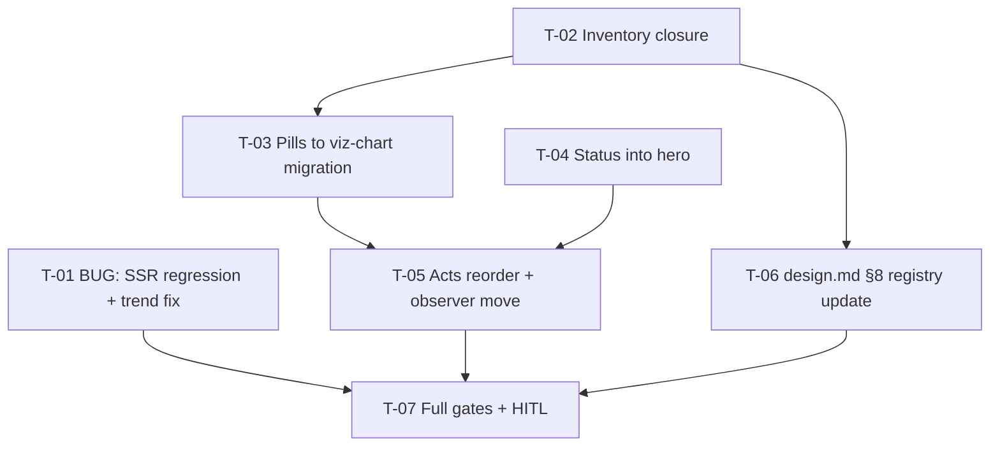

# Tasks — client / Dashboard Narrative Pass (Project Dashboard v3.1)

- **Module:** client / project-detail (STAR) — client-only
- **Spec id:** 2026-08-dashboard-narrative-pass
- **Status:** complete (7/7, owner HITL approved 2026-08-24 — see execution.md §3)
- **Owner:** JuanCode
- **Linked requirements:** ./requirements.md · **Linked design:** ./design.md (incl. D-DN-6)
- **Last updated:** 2026-08-24

> **Gate conventions:** client targeted jest with `--coverage=false` (K-020); lint via `npx eslint` bare (K-001); tsc-spec delta vs current baseline (937 at F4 close — re-measure before citing, K-002); never both packages' full suites concurrently (§4.3 — server untouched here, but the rule stands); SSR regression spec must be observed RED on pre-fix code before the fix lands (Bug Mode / K-004). Skills: `angular-developer` (all), `ui-ux-pro-max` (T-03…T-05), `systematic-debugging` (T-01), `dataviz` optional reference for T-03 builders.

---

## 2. Dependency graph

---

## 3. Task list

### T-01 — BUG (Bug Mode): SSR regression spec + trend-series fix

- **Requirements:** R-DN-001 (all clauses); design §2.1, D-DN-1, D-DN-2, D-DN-5.
- **Files:** `results-trend-card.component.ts`; NEW `results-trend-card.ssr.spec.ts` (co-located); existing card spec updated.
- **Acceptance / done check:**
  - [x] SSR spec renders the REAL builder output via full `echarts` (`ssr:true`, svg): asserts no-throw, ≥1 series stroke + symbols, solid AND dashed dasharray present, zero `var(--` in SVG. **RED FIRST observed on current code** (failing input = `visualMap.pieces[].lineStyle` options — probe-proven crash `TypeError ... 'coord'` in `getVisualGradient`); GREEN after the two-series fix. Quote both runs.
  - [x] Fix = two overlapping series (solid `[0..lastClosed]`, dashed tail), resolved token colors only — the `'var(--…)'` fallback string is REMOVED from options (D-DN-5); tooltip/click/tableModel assertions unchanged and green.
  - [x] **Disqualifier:** a green SSR run whose fixture has <2 buckets (options builder returns null — nothing rendered) is not evidence; the spec must assert on the ≥2-bucket path.
  - [x] Targeted jest `--coverage=false` + `npx eslint` green.
- **Deps:** none · **Effort:** M · **Status:** done — PASS attempt 1

### T-02 — Visual-surface inventory closure

- **Requirements:** R-DN-002 scenario (inventory closes by what renders — KZ-002); design §2.2.
- **Files:** evidence table in `execution.md` (no code).
- **Acceptance / done check:**
  - [x] Grep + template read over project-detail components AND inline template regions for `style.width`/`[style.width.%]`/`app-viz-chart`/SVG markup; every data-bearing surface listed with its render mechanism. **Failing input:** the known inline status strip at `project-dashboard.component.html:383-440` — an inventory that misses it (folder-scoped scan) is disqualified.
  - [x] Closure table: each surface → `viz-chart` | `composition strip (declared)` | `migrate at T-03` — zero unclassified.
- **Deps:** none · **Effort:** S · **Status:** done — PASS attempt 1

### T-03 — Rankings migration to viz-chart (OQ-2-A)

- **Requirements:** R-DN-002 (migration half + a11y AND-clause); design §2.2, §6, D-DN-6; reversion challenge 2.
- **Files:** `project-dashboard-card.component.{ts,html,spec.ts}`; geo top-N region (per T-02 inventory); builders reuse F1 rankings family.
- **Acceptance / done check:**
  - [x] Pills markup replaced by `app-viz-chart` horizontal bars with `tableModel` + accessible names; server order passed through; tokens only (**failing input:** any hex or `[style.width.%]` data bar surviving in the migrated surfaces → grep red).
  - [x] **Pill specs migrated in the SAME task** (`partnerBarWidthPercent`/`fillPercent`/`barColor` assertions → builder-output assertions, KZ-001 live-shaped fixtures); no orphaned or deleted-without-replacement test (**disqualifier:** test count on these surfaces decreasing without equivalent builder specs).
  - [x] Targeted jest `--coverage=false` + eslint green.
- **Deps:** T-02 · **Effort:** L · **Status:** done — PASS attempt 1

### T-04 — Status semaphore into hero (OQ-1-A)

- **Requirements:** R-DN-002 (composition strip = declared idiom, a11y preserved), R-DN-004 (drills intact); design D-DN-6, reversion challenge 1.
- **Files:** hero region + status region of `project-dashboard.component.{html,ts,spec.ts}`.
- **Acceptance / done check:**
  - [x] Strip + legend + per-status drill links (routerLink/queryParams/aria/sr-only table) render inside the hero; standalone card retired; loading/error states preserved (**failing input:** remove a drill queryParam → spec red).
  - [x] Trend grid re-pairs with results-by-indicator (challenge-1 answer) — no orphaned `lg:grid-cols-2` conditional (**failing input:** status-empty case leaving the trend full-width asymmetric → spec asserts the new pairing).
  - [x] KZ-015: specs arrange the load transition (construct loading → data arrives), not pre-set end state.
- **Deps:** none · **Effort:** M · **Status:** done — PASS attempt 1

### T-05 — Six-act structure: reorder, subtitles, F4 observer move

- **Requirements:** R-DN-003 (all clauses incl. first-paint BUT + drills AND), R-DN-004 scenario; design §2.3, §6, D-DN-3/D-DN-4.
- **Files:** `project-dashboard.component.{html,spec.ts}`; `insights-section` per-card positioning support if required (the ONE allowed structural change — flag it if used).
- **Acceptance / done check:**
  - [x] Six `<section aria-labelledby>` acts, act headers with question-subtitles, card membership per D-DN-3 table; DOM-order spec asserts the full act sequence (**failing input:** swap two acts → red).
  - [x] F4 insights observer targets the FIRST F4 card (act 4); ONE fetch feeds all repositioned F4 cards (**failing input:** load in ngOnInit or a second fetch → zero-fetch/single-fetch specs red — F3/F4 pattern, KZ-015 transitions).
  - [x] First-paint request assertions unchanged (real-HTTP harness case from F4 T-08 re-run green); F1 drill + F3 panel specs green at new positions.
  - [x] Targeted jest `--coverage=false` + eslint + `npm run s-lint` (if SCSS) green.
- **Deps:** T-03, T-04 · **Effort:** L · **Status:** done — PASS attempt 1 (see execution.md)

### T-06 — Design-system registry update (`docs/ux-ui/design.md` §8)

- **Requirements:** R-DN-002 (declared-idiom half); design §2.2.
- **Files:** `docs/ux-ui/design.md` §8 (this edit IS the change, not an archive sync — allowed on this branch as spec deliverable).
- **Acceptance / done check:**
  - [x] §8 gains: "composition strip" idiom entry (when-to-use rule, the hero semaphore as the instance) + migrated surfaces noted as viz-chart consumers; closure table from T-02 reflected. 1–3 concise entries, no restructuring (**disqualifier:** editing unrelated §8 rows).
- **Deps:** T-02 · **Effort:** S · **Status:** done — PASS attempt 2

### T-07 — Full gates + HITL close

- **Requirements:** NFR-DN-001…004; defect-class table rows 4–7; R-DN-004 scenario (network half).
- **Files:** evidence in `execution.md`.
- **Acceptance / done check:**
  - [x] Client full suite + coverage floors + `npm run build` + tsc-spec delta (baseline re-measured pre-cycle; no NEW errors) + `tokens:validate` — sequenced (§4.3).
  - [x] Bundle: initial ±5 kB vs pre-pass baseline, same branch (**disqualifier:** baselines from different branch states).
  - [x] **HITL (KZ-014, human):** light+dark of all 6 acts vs the approved mockup; hero semaphore mobile (`md:`) check (R-1); below-the-fold network check (no insights fetch before act 4 enters viewport); F1 drill + F3 panel click-through; trend chart visibly solid→dashed.
  - [x] K-004 global: every cited gate observed red once (T-01's red-first counts; others per task).
- **Deps:** T-01, T-05, T-06 · **Effort:** M · **Status:** done — PASS (automated battery + owner HITL; finding 1 remediated, see execution.md)

---

## 4. Coverage closure (scenario/clause → owning task)

| Clause | Owner |
|---|---|
| R-DN-001 scenario (failing input, solid→dashed, no visualMap-pieces BUT, no var() BUT, tooltip/drill/table AND) | T-01 |
| R-DN-002 inventory scenario + zero-unclassified BUT | T-02 (+T-06 registry) |
| R-DN-002 migration + zero-hex BUT + a11y AND | T-03 (+T-04 for the strip) |
| R-DN-003 scenario (act order, subtitles, first-paint BUT, drills AND) | T-05 |
| R-DN-004 scenario (request parity BUT states-preserved, suites green AND) | T-04/T-05 (specs) + T-07 (network HITL) |
| NFR-DN-001…004 | T-07 (NFR-DN-001 also spec-level in T-05) |

## 5. Testing expectations

Bug Mode: T-01 regression red→green mandatory. K-021 n/a (no server). KZ-001/KZ-015 per task. HITL is THE gate for the dominant visual defect class (declared in requirements).

## 6. Execution conventions

Branch `bilateral-visual-improvements`; commits `[SPEC:changes/dashboard-narrative-pass] <type>(project-dashboard): …`. **PR strategy (~1,150–1,650 LOC total): 2 PRs** — **PR-1: T-01 solo** (bug fix shippable ya; review first: SSR spec red-run evidence) · **PR-2: T-02…T-07** (narrative + migration; review first: act order + observer move; out of scope: the bug fix). Chained descriptions per `cognitive-doc-design`.

## 7. Risks & blockers log

| # | Date | Risk | Mitigation | Status |
|---|---|---|---|---|
| RB-1 | 2026-08-24 | Hero crowding on mobile (OQ-1-A) | HITL `md:` check named in T-07 | open |
| RB-2 | 2026-08-24 | insights-section may need per-card structural change for act grouping | Flagged as the ONE allowed structural change in T-05; anything more = escalate | open |

## 8. Done definition

- [x] T-01…T-07 done with evidence (execution.md PASS before checkbox — guardrail hook).
- [x] Coverage-closure table verified against final code (per-task Reviewer clause audits + T-05 roster re-derivation).
- [x] Rollout: dev-branch pipeline; rollback = revert.
