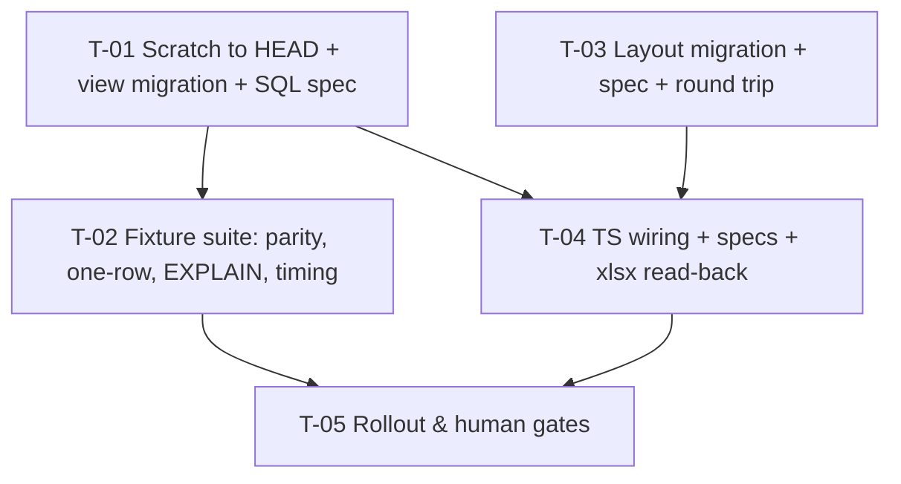

# Tasks — Innovation Use / Excel export section

- **Module:** reports (reads `result-innovation-use`)
- **Spec id:** 2026-10-innovation-use-excel-export
- **Status:** not-started
- **Owner:** ARI server squad
- **Linked requirements:** ./requirements.md
- **Linked design:** ./design.md (judgment: ./judgment.md — APPROVED, fix-only)
- **Last updated:** 2026-10-05

> **Baseline readings, observed 2026-10-05 at `f9d57147`.** The falsifiers below cite these; every one was run before this file was written.
>
> | # | Command (from `server/researchindicators`) | Reading |
> | --- | --- | --- |
> | B-1 | `mysql … ari_scratch_test -e "SELECT COUNT(*) FROM report_innovation_use"` | `ERROR 1146 (42S02) … 'ari_scratch_test.report_innovation_use' doesn't exist` |
> | B-2 | `SELECT (ROUTINE_DEFINITION LIKE '%link_results%') FROM information_schema.ROUTINES WHERE ROUTINE_NAME='innovation_use_validation'` (scratch) | `0`: scratch's function predates rule 16 (design P-13) |
> | B-3 | `grep -c report_innovation_use src/domain/entities/reports/repositories/star-results-export.repository.ts` | `0` |
> | B-4 | `grep -n "toHaveLength(74)\|bannerTitleMergeToCol: 74\|Innovation Use section are not yet" -r src/domain/entities/reports` | `…handler.spec.ts:165` (74), `sheet-presentation.ts:74` (74), `banner-subtitle.ts:17` and `…handler.spec.ts:142` (notice) |
> | B-5 | `npm run migration:test:bootstrap` | stops at `CreatePiDelegates1787600000000`, errno 3780 (design P-13) |
> | B-6 | `npm run migration:scan` | `Cannot find module …/scripts/scan-migration-placeholders.js`: **the scanner is not a usable gate**; placeholder safety is asserted in the migration specs instead |

## Dependency graph

All tasks are in the server package, so they run **sequentially** in one worktree (root `CLAUDE.md` concurrency rule): T-01 → T-02 → T-03 → T-04 → T-05. T-03 does not depend on T-01, but it must not run alongside it.

---

### T-01 — Bring scratch to HEAD, then author the `report_innovation_use` view migration

- **Status:** done (PASS attempt 2, 2026-10-05 — see `execution.md`) · **Size:** M · **Dependencies:** none
- **Requirements covered:** R-IUX-001 (whole), R-IUX-002 (whole), R-IUX-003 (whole), R-IUX-004 (whole), R-IUX-005 (whole), R-IUX-006 (whole), NFR-IUX-001 *BUT* clause (no `*_validation()`, no top-level `GROUP BY`/`DISTINCT`/aggregate/`ORDER BY`/`LIMIT`), NFR-IUX-004, the requirements' exclusions note (JD-1, JD-10)
- **Design refs:** §3.1–§3.5, §2.1 rows 1 and 3, DD-1, DD-2, DD-5, DD-6; Premise Ledger P-13 and P-20 (settled here)
- **Scope:**
  1. **First step: settle P-13.** Bring `ari_scratch_test` to HEAD with a **scratch-only** workaround for the `CreatePiDelegates` errno 3780 (B-5), for example aligning `agresso_contracts.agreement_id`'s collation on scratch before the run. Record the exact commands in `execution.md`. **No migration file may be edited.** Done when `migration:show` on scratch reports 0 pending and B-2 reads `1`.
  2. `src/db/migrations/<ts>-CreateReportInnovationUseView.ts`: `CREATE OR REPLACE VIEW report_innovation_use` per design §3. That means:
     - a live-results root;
     - `riu`/`ciul` joined with the active filter in `ON`;
     - 4 `LEFT JOIN LATERAL` blocks guarded by `root.indicator_id = 6`;
     - linked dev `ORDER BY lr.link_result_id DESC LIMIT 1` with rule 16's filters;
     - role and indicator ids interpolated from the enums;
     - the JD-1 catalog fallback;
     - mode selectors in the function's exact `= TRUE` form.
     The header comment names the parity fixture (T-02) as mandatory for any future redefinition of `innovation_use_validation`, `valid_text` or `report_field` (R3). `down()`: `DROP VIEW IF EXISTS report_innovation_use`.
  3. `src/db/migration-specs/<ts>-CreateReportInnovationUseView.spec.ts`: a fake `QueryRunner` records SQL. Assert:
     - (a) no `?` and no `:word` outside quoted strings, using the `named-placeholders` regex from `src/CLAUDE.md:206`;
     - (b) the top-level SELECT has no `GROUP BY`/`DISTINCT`/`HAVING`/`ORDER BY`/`LIMIT`/`UNION`, checked after stripping the lateral bodies;
     - (c) the SQL contains no `_validation(`;
     - (d) there are exactly 4 `LEFT JOIN LATERAL` blocks, each containing `root.indicator_id = 6`;
     - (e) all 9 column aliases are present and prefixed `innovation_use_`;
     - (f) `down()` is exactly the drop.
  4. Apply it on scratch with `npm run migration:test:execute` (settles P-20: it must create without an illegal-mix-of-collations error) and run `SELECT * FROM report_innovation_use LIMIT 1`.
- **Tests:** the migration spec above. The behavioral proof is T-02.
- **Falsifier:** remove the `root.indicator_id = 6` guard from one lateral, so (d) goes red. Add `GROUP BY root.result_id` at the top level, so (b) goes red. Put a `:fake` in a SQL comment, so (a) goes red. **Fixture rows on which they diverge:** the SQL string itself, since each mutation changes exactly the asserted token.
- **Red run:** before the migration file exists, the spec's `import` fails. **That is a setup red and does not count.** The assertion-level red is observed by applying each Falsifier mutation to the finished migration and seeing the named assertion fail with its message, quoted in `execution.md`.
- **Disqualifier:** the migration spec proves **text, not behavior**. A green here is no evidence that any cell value is right (KZ-001); only T-02 can show that. If step 1 cannot reach HEAD without editing a migration, the task **stops and escalates**. It never proceeds on a pre-rule-16 schema, because that would make T-02's rule-16 parity a confident green over a function that lacks the rule.
- **Consumers:** none yet (new symbol). Phase 2 joins it in T-04.
- **Review:** `full`: the cell expressions carry every green-check rule, which is the spec's dominant defect class (D1).
- **Done criteria:**
  - [x] Scratch at HEAD: `migration:show` 0 pending, B-2 = `1`, workaround recorded in `execution.md`
  - [x] Migration applies on scratch with no error (P-20 settled, outcome recorded); `SELECT … LIMIT 1` returns the 9 aliased columns + `result_id`
  - [x] Migration spec green; each of the 3 Falsifier mutations observed red at assertion level, messages quoted
  - [x] `npx eslint` on both files clean; `npx prettier --check` clean
  - [x] `migration:test:revert` drops the view (B-1's error returns), then re-apply
- **Skills:** `nestjs-expert`, `tdd`, `systematic-debugging` (for step 1)

---

### T-02 — Fixture suite: green-check parity, one row per result, EXPLAIN gate, timing

- **Status:** done (PASS attempt 2, 2026-10-05 — see `execution.md`) · **Size:** L · **Dependencies:** T-01
- **Requirements covered:** NFR-IUX-002 (whole), NFR-IUX-001 *Target* (merged view, positive plan match, timing recorded as a reading — as amended 2026-10-05), R-IUX-001 sc. "Many children, one row" + *AND IT MUST NOT duplicate* + *BUT must NOT include snapshot/soft-deleted*, R-IUX-001 sc. "Other indicators", R-IUX-002 all three scenarios (level ≥ 6 blank → NP; level < 6 stale text → NA and hidden; no active detail row → NP/NA; *AND IT MUST compare level not id*), R-IUX-003 sc. (Other blank → NP; NULL count → NP; aggregate `actors_count` NULL/≤0 → NP; *BUT must NOT* mark a 0 count NP when sum > 0; NULL flag = disaggregated), R-IUX-004 sc. (rules 6, 8, 8b, 9; *AND IT MUST* use the exact rule-8 predicate; NULL `is_organization_known` = not known; catalog row missing → `Unknown (id n)`), R-IUX-005 sc. (0/NULL → NP; blank unit → NP; *BUT must NOT* mark a negative NP; blank comment → `Comment: Not mandatory`), R-IUX-006 sc. (deleted dev → NP + 3×NA; *AND IT MUST* pick the highest `link_result_id`; NULL title/platform rendering), requirements defect classes D1, D2, D3
- **Design refs:** §10 rows 2–3 and 5, §3.3, §3.4; Premise Ledger P-5 (re-measured at HEAD on seeded rows), P-18, P-19 (settled here)
- **Scope:**
  1. `test/fixtures/innovation-use/report-innovation-use-view.fixture-spec.ts`, under the existing harness (`test/jest-fixtures.json`, `maxWorkers: 1`). The session first sets `group_concat_max_len = 4194304` (P-18).
  2. **Parity cases.** One result per rule: 2, 3, 4, 5, 6, 7, 8, 8b, 9, 10, 11, 14, 15, 16. Add one fully valid result, one Capacity Sharing result, one result with 2 qualifying links plus 3 actors, 2 organizations and 2 measures, one snapshot copy and one soft-deleted result. Add the NULL cases: actor flag NULL, `is_organization_known` NULL, catalog row missing (JD-1), dev title NULL, dev platform NULL, level NULL, inactive `riu`.
  3. **For every case:**
     - `expected = innovation_use_validation(id)`;
     - assert `expected = TRUE` ⇔ no cell of the view row contains `Not provided` — **for Innovation Use results only** (`indicator_id = 6`). Other-indicator cases assert R-IUX-001's 9 × `Not applicable` instead, and the function is not evaluated for them (NFR-IUX-002 as amended 2026-10-05);
     - each single-rule case asserts the **exact** cell, and the exact slot text, that the rule names, and that every other cell is free of `Not provided`;
     - expected cell strings come from the `requirements.md` scenarios, never from the view's output.
  4. **One-row:** `SELECT result_id, COUNT(*) … GROUP BY result_id HAVING COUNT(*) > 1` over the view returns 0 rows. Snapshot and soft-deleted ids are absent.
  5. **EXPLAIN gate.** Seed ≥ 200 results of mixed indicators. Build the **real** Phase 2 SQL by calling `StarResultsExportRepository` with a capturing `queryRunner` (the pattern of `star-results-export.repository.spec.ts`). Run `EXPLAIN FORMAT=TREE` on scratch. Assert **positively**:
     - 4 × `Materialize (invalidate on row from root)`, each correlated on `<child>.result_id = root.result_id` (the inner access path is cost-based and not asserted — NFR-IUX-001 as amended 2026-10-05);
     - the view root reached by a `PRIMARY` lookup;
     - **no** `Materialize`/`Hash` over a `results` scan beyond the baseline nodes of `report_general_information`, enumerated in the fixture.
     The query must run, which settles P-19.
     **Ordering note:** T-04 has not run yet, so this step uses a test-local SQL that appends the T-04 join to the captured Phase 2 text. T-04's Done criteria re-run this fixture against the real repository.
  6. **Timing:** Phase 2 on the seeded set, 3 runs before (view absent from the join) and 3 after. Report the medians and the spread.
- **Tests:** this fixture file (`npm run test:fixtures -- report-innovation-use-view`).
- **Falsifier:** each of these must turn its case red, observed against the T-01 view:
  - (a) Change rule 15's `COALESCE(ciul.level >= 6, FALSE)` to `ciul.id >= 6`. The level-5 row (id 6) diverges: the cell reads NP while the function is TRUE.
  - (b) Change rule 10's `<> 0` to `> 0`. The negative-number row diverges.
  - (c) Add the name-NULL condition back to rule 6. The catalog-missing row diverges (JD-1).
  - (d) Drop `LIMIT 1` from the link lateral. The 2-links row returns 2 view rows, so the one-row check is red.
  - (e) Drop the `root.indicator_id = 6` guard. The EXPLAIN fixture must still pass, since the guard is a cost tactic and the plan shape is unchanged. **This is a known blind spot:** the guard's value can only show up in the timing reading, and that must be stated in `execution.md`.
  - (f) Replace one lateral with a derived `GROUP BY` table (the alliance pattern). The positive `invalidate on row from root` match for that child is red.
- **Red run:** every Falsifier is observed red **on its behavioral assertion** (a value or plan-line mismatch), and the message is quoted. A red from seeding, an FK error or a timeout is not a red.
- **Disqualifier:**
  - The timing figure is **evidence only if** the three runs on each side vary by less than the effect measured. Otherwise report the spread and mark the reading "inconclusive" (the 20 % target was dropped by the 2026-10-05 NFR-IUX-001 amendment; the reading is recorded, never a gate). Never pass it on a single run.
  - The EXPLAIN gate on fewer than 200 seeded rows, or on a schema not at HEAD, is not evidence.
  - A parity case whose expected value was copied from the view's own output is inert (`tdd`'s inert fixture): expected strings come from the requirements.
  - A parity pass while B-2 still reads `0` is disqualified (rule 16 absent).
  - **What it CANNOT reach:** Dev/Prod data volume and CLARISA content, and the Prod MySQL version (P-4).
- **Consumers:** the view (T-01). `star-results-export.repository.ts` is imported read-only for SQL capture.
- **Review:** `full`: correctness-critical gate for D1–D3. Budgeted at 3 rounds (design §15).
- **Done criteria:**
  - [x] All parity, one-row, NULL and exclusion cases green on scratch at HEAD
  - [x] Falsifiers (a)–(d) and (f) observed red with quoted messages; (e)'s blind spot recorded
  - [x] EXPLAIN plan excerpt quoted in `execution.md`; P-19 settled
  - [x] Timing: 3 + 3 medians and spread recorded as a reading (no pass/fail since the 2026-10-05 NFR-IUX-001 amendment)
  - [x] A design gap found here goes through the Pivot Protocol; the approved design is never quietly edited
- **Skills:** `tdd`, `nestjs-expert`, `systematic-debugging`

---

### T-03 — Layout migration: INNOVATION USE column group and data dictionary rows

- **Status:** done (PASS attempt 1, 2026-10-05; P-11/P-16 handed to T-05 — see `execution.md`) · **Size:** S · **Dependencies:** none (runs after T-02, sequentially)
- **Requirements covered:**
  - R-IUX-007:
    - band 75–83 labelled INNOVATION USE with its own colour;
    - dictionary section, one row per column, in column order, with explanations;
    - *BUT must NOT* move, rename or recolour any existing group.
  - NFR-IUX-003: `down()` removes exactly the inserted rows.
  - NFR-IUX-004.
  - Requirements defect class D5.
- **Design refs:** §5, DD-3, §11 cosmetic window; Premise Ledger P-11 and P-16 (settled here)
- **Scope:**
  1. **First step: settle P-11 / P-16.** Run a **read-only** query against Dev: `SELECT sort_order, from_col, to_col, label FROM report_workbook_column_group WHERE workbook_key='star_results_metadata' AND sheet_key='raw_data' ORDER BY sort_order`, plus `SELECT MAX(sort_order), COUNT(*) FROM report_data_dictionary WHERE workbook_key='star_results_metadata'`. Record the outputs. If the last group does not end at 74, **stop and escalate** (Pivot).
  2. `src/db/migrations/<ts>-StarRawInnovationUseColumnGroup.ts`. It inserts the 10 rows (1 group and 9 dictionary rows). Both `sort_order` values are computed as `COALESCE(MAX(sort_order),0)+k`, scoped by `workbook_key`. Values are passed as params, never interpolated, and the colour comes from a `private static readonly` constant as in `1780690000000`. `down()` deletes exactly those rows.
  3. `src/db/migration-specs/<ts>-StarRawInnovationUseColumnGroup.spec.ts`: SQL text, the params array, no `UPDATE` (nothing shifts), and an exact `down()`.
  4. Round trip on scratch, in the T-02 fixture file or a sibling fixture: seed representative group and dictionary rows (copying the Dev readings from step 1), then run `up → down → up`. After `down()`, the seeded rows must be byte-identical and the count back to the seeded count.
- **Falsifier:**
  - (a) Remove the `COALESCE`. On the empty-table round trip the insert fails with `Column 'sort_order' cannot be null`, so that case is red.
  - (b) Make `down()` delete by `sort_order >= …`. The seeded rows are lost, so the byte-identity check is red.
  - (c) Add `UPDATE … from_col = from_col + 1`. Both the spec's no-`UPDATE` assertion and the seeded byte-identity are red.
- **Red run:** each Falsifier is observed red on its assertion, with the message quoted. The import-fails red before the file exists does not count.
- **Disqualifier:** a round trip over **empty** layout tables cannot prove (b) or (c) (judgment S-3), so the round trip only counts with the step-1 rows seeded. If the Dev query cannot be run read-only from this machine, P-11/P-16 stay `UNVERIFIED`, and the task records that and hands the check to the T-05 human gate. It never assumes the derivation.
- **Consumers:** `report-layout.repository.ts:35-62` (reads groups and dictionary for every export), `STAR_RAW_COLUMN_GROUP_FALLBACK` (kept in sync by T-04).
- **Review:** `checklist`: small, pattern-copy of `1779910000000`/`1780690000000`, with the risky parts pinned by falsifiers.
- **Done criteria:**
  - [x] Dev readings recorded (or the hand-off recorded)
  - [x] Spec green; round trip green with seeded rows; Falsifiers (a)–(c) observed red
  - [x] `npx eslint` and `npx prettier --check` clean on both files
- **Skills:** `nestjs-expert`, `tdd`

---

### T-04 — TS wiring: Phase 2 join, 9 column specs, fallback group, banner span, notice

- **Status:** done (PASS attempt 1, 2026-10-05; commit deferred until the user's visual check — see `execution.md`) · **Size:** M · **Dependencies:** T-01, T-03
- **Requirements covered:**
  - R-IUX-007: 83 columns, banner spans the last column, fallback matches the DB rows, new headers equal the dictionary labels, *BUT must NOT* move existing columns.
  - R-IUX-008 (whole): the notice drops Innovation Use and keeps Innovation Development.
  - R-IUX-001: the Excel holds one row per result.
  - Requirements defect classes D4 and D8.
- **Design refs:** §2, §2.1 rows 6–10, §3.2 (keys = aliases), DD-5; Premise Ledger P-1, P-2, P-3, P-14, P-15, P-17
- **Scope:**
  1. `star-results-export.repository.ts`:
     - add `LEFT JOIN report_innovation_use iu ON iu.result_id = gi.result_id`;
     - add 9 `iu.<alias> AS <alias>` select items;
     - add the view to the required-views comment at `:34-37`.
  2. `star-results-metadata.columns.ts`: append 9 `ExcelColumnSpec` entries, with keys exactly the §3.2 aliases and headers the §3.2 headers (pending OQ-1). Update the JSDoc range A–BV → A–CE (judgment B-14).
  3. `star-results-metadata.sheet-presentation.ts`: add a fallback group `{75, 83, 'INNOVATION USE', <T-03 colour>}` and set `bannerTitleMergeToCol: 83`.
  4. `star-results-metadata.banner-subtitle.ts`: the notice keeps the Innovation Development sentence and drops Innovation Use.
  5. Update the pinning specs:
     - `…handler.spec.ts:165` 74 → 83;
     - the `:142-143` notice text;
     - `star-results-export.repository.spec.ts:99-122`, adding the join string.
  6. New unit test (`…handler.spec.ts` or `excel-workbook.builder.spec.ts`). Build the workbook through the real handler with the repository mocked to return one Innovation Use row, write the buffer, then read it back with ExcelJS. Assert:
     - the headers in columns 75–83;
     - the merged group band over exactly 75–83 with the label;
     - the banner merge reaching column 83;
     - the cell values landing under the right headers.
  7. Re-run the T-02 fixture's EXPLAIN gate against the **real** repository SQL, which closes T-02's ordering note.
- **Falsifier:**
  - (a) Change one column key to `innovation_use_actor` (a typo). The read-back assertion "value under header Actors" goes red, because the cell is empty.
  - (b) Leave `bannerTitleMergeToCol: 74`. The read-back banner-merge assertion goes red.
  - (c) Leave the old notice. The `:142` assertion goes red.
  - (d) Assign a number to `header`. `npm run build` goes red while jest stays green, which shows why the build is in the gate. *(Observed 2026-10-05: jest went red too — ts-jest type-checks spec imports (`TS2322`). Both gates catch it; the prediction was wrong, not the gate.)*
- **Red run:** after step 5's pin updates and before steps 1–4, the updated specs are red **on their assertions** (B-4 pins: expected 83 received 74; expected new notice received old). Quote the messages. Then the Falsifier mutations are applied to the finished code and observed red.
- **Disqualifier:**
  - A spec that asserts only `toHaveLength(83)` or the presence of a class/key list proves presence, not alignment. Only the read-back value-under-header assertion proves (a) (presence ≠ behavior).
  - Mocked SQL proves nothing about the view (KZ-001), so step 7 is the SQL evidence.
  - **What it CANNOT reach:** visual rendering (colour, wrapping), which is the T-05 human check.
- **Consumers** (design P-14, P-15): `…workbook.handler.ts`, `…workbook.handler.spec.ts`, `star-results-export.repository.spec.ts`, `result.repository.ts` and `filters-report.dto.ts` (they reference `findStarResultsMetadataRows`; the signature is unchanged), `excel-workbook.builder.ts` / `.types.ts` / `.builder.spec.ts` / `.row-limit.spec.ts` (`bannerTitleMergeToCol` readers; the type is unchanged), and the client `api.service.ts:386` / `api.service.spec.ts` (endpoint unchanged). The full server suite is part of the Verification.
- **Review:** `full`: touches the shared export every user downloads.
- **Done criteria:**
  - [x] Pins updated; red-then-green observed as described
  - [x] Read-back test green; Falsifiers (a)–(d) observed red
  - [x] Step 7 EXPLAIN gate green on the real SQL
  - [x] `npm test -- --silent` (full server suite) green; `npm run build` exit 0; `npx eslint` on touched files clean
- **Skills:** `nestjs-expert`, `tdd`

---

### T-05 — Rollout and human gates (Prod premises, visual check, labels, docs)

- **Status:** in progress `[~]` — docs done 2026-10-05; human gates G1–G6 open (`OPEN-ITEMS.md` §3.3) · **Size:** S · **Dependencies:** T-02, T-04
- **Requirements covered:** NFR-IUX-003 (deploy order, cosmetic window, backout by name), OQ-1 (labels), requirements defect classes D6, D7, accepted risk R3 (documentation half), requirements §9 R1
- **Design refs:** §11, §14; Premise Ledger P-4 and P-12 (settled here); P-11/P-16 if T-03 handed them off
- **Scope:**
  1. **Human:** `SELECT VERSION();` on Prod. It must be ≥ 8.0.14 for `LATERAL` (P-4). Otherwise **stop**: DD-1 must pivot before any merge to `main`.
  2. **Human:** confirm the Prod pipeline applies migrations before the new code serves (P-12). If it does not, apply the view migration by hand ahead of the deploy, per root `CLAUDE.md` §4.3.
  3. **Human visual check (D7):** open a generated `.xlsx` from Dev, or from a local run against scratch seeded by T-02. Check:
     - the band colour and label;
     - the merged cells;
     - the bullet lines wrapping readably;
     - `Not applicable` on a non-Innovation-Use row;
     - the dictionary section and the notice text.
     Quote what the human observed, and tick only what the quote covers.
  4. **OQ-1:** the product owner confirms the headers and line formats. Any change loops back to T-01/T-04 as an amendment.
  5. Docs:
     - append to `docs/trd/trd.md` ADR-11's checklist one line: "`report_innovation_use` transcribes `innovation_use_validation`; any migration redefining it, `valid_text` or `report_field` must run `report-innovation-use-view.fixture-spec.ts`" (R3);
     - update `family.md` row 7's status;
     - note FU-1/FU-2 in the family's `OPEN-ITEMS.md`.
- **Falsifier:** n/a. Steps 1–4 are human observations, and their evidence is the quoted observation (KZ-002). Step 5 is docs: a `grep -n report_innovation_use docs/trd/trd.md` must go from `0` to `1`.
- **Red run:** n/a (human gate). The grep baseline is `0`, observed at execution start.
- **Disqualifier:** an observation that covers an adjacent property (for example "the file opens") does not discharge the visual criterion (KZ-002). A Prod version or pipeline fact stated without its command output stays `UNVERIFIED` and **blocks** the `main` merge.
- **Consumers:** none.
- **Review:** `checklist`: no code; a human holds the evidence.
- **Done criteria:**
  - [ ] P-4 settled with the quoted `VERSION()` output
  - [ ] P-12 settled with the quoted pipeline evidence, or a manual-apply plan recorded
  - [ ] Visual check quoted and covering each listed item
  - [ ] OQ-1 answered (or recorded as open and non-blocking by the product owner)
  - [x] ADR-11 line, family row 7, and OPEN-ITEMS updated
- **Skills:** none required (`cognitive-doc-design` for the doc edits)

---

### T-06 — QA feedback: export 6 of the view's 9 columns (75–80), linked dev after the justification

- **Status:** done (PASS attempt 1, 2026-10-06; preview approved by the user — see `execution.md`) · **Size:** M · **Dependencies:** T-03, T-04 · added 2026-10-06 (user-approved amendment, QA feedback)
- **Requirements covered:** R-IUX-006 as amended 2026-10-06 (only *Linked innovation development* is exported; 3 view-only cells), R-IUX-007 as amended (80 columns, band 75–80, the §3.2a order, *BUT must NOT* move, rename or recolour any other column or group), NFR-IUX-003 (the new `down()` restores exactly), NFR-IUX-004, D4, D5, D8
- **Design refs:** §3.2a, DD-7, §2.1 (new migration row), §5, §10 rows 5–7
- **Constraint (user, 2026-10-06):** migrations `1791300000000` (view) and `1791400000000` (layout) are **applied on the shared database**. They must **not** be edited. The view stays unchanged.
- **Scope:**
  1. New migration `src/db/migrations/<ts>-StarRawInnovationUseExportSubset.ts` (`<ts>` > 1791400000000), touching **only** the rows `1791400000000` inserted, identified exactly as its `down()` does (workbook + label/range for the group; workbook + `section_fill_argb = 'FF6A1B9A'` + field labels for the dictionary):
     - `UPDATE` the INNOVATION USE group `to_col` 83 → 80;
     - `DELETE` the 3 dictionary rows *Linked innovation readiness level*, *Linked innovation description*, *Linked innovation geographic scope*;
     - re-order the 6 remaining rows: `base = MIN(sort_order)` of the 9 Innovation Use rows, then Innovation use level = base, Use level justification = base+1, Linked innovation development = base+2, Actors = base+3, Organizations = base+4, Quantifications = base+5. Computed in SQL; the section `Innovation Use` stays on the first row;
     - `down()`: group `to_col` back to 83; re-insert the 3 rows exactly as `1791400000000` did (same labels, explanations, section NULL, fill); restore the original order base+0…base+8 in the R-IUX-002…006 order;
     - params bound, never interpolated; no `:word` outside quoted strings.
  2. Its migration spec (`src/db/migration-specs/<ts>-…spec.ts`): SQL text, params, the WHERE keys, no statement touching rows outside the Innovation Use identifiers, exact `down()`.
  3. Round-trip fixture on scratch: seed the 10 fallback groups + representative dictionary rows, apply `1791400000000`, then run `up → down → up` of the new migration. After `up`: group 75–80, 6 IU rows in the §3.2a order and contiguous from base, other rows byte-identical. After `down`: byte-identical to the post-`1791400000000` state.
  4. TS (`src/domain/entities/reports/…`):
     - repository Phase 2 selects only the 6 exported aliases (the join stays);
     - `star-results-metadata.columns.ts` has the 6 specs at 75–80 in the §3.2a order;
     - fallback group 75–80; `bannerTitleMergeToCol: 80`; JSDoc range A–CB;
     - update pins (80 columns), the repository spec, and the read-back test (headers and values at 75–80 in the new order; band `BW4:CB4`; banner `C1:CB1`; OICR band unchanged);
     - the T-02 fixture's `IU_SELECT_LIST` follows the repository's 6 items, so the EXPLAIN gate still strips exactly what Phase 2 adds.
  5. Apply the new migration on scratch and leave it applied; run the T-02 and T-03 fixtures.
- **Falsifier:**
  - (a) Swap two keys in the column specs (Actors ↔ Linked innovation development): the read-back value-under-header assertion is red.
  - (b) Make the dictionary `DELETE` match by label only (no fill key): the seeded round trip loses the seed's `Actors`/`Organizations` rows, so the byte-identity check is red. (The 3 deleted labels are unique today; seed a same-label row from another section to make the mutation observable.)
  - (c) Leave `bannerTitleMergeToCol: 83`: the read-back banner assertion is red.
  - (d) Re-order with a hardcoded `sort_order` instead of `base + k`: the seeded round trip with a non-zero base is red.
- **Red run:** pins updated first are red on their assertions (expected 80 received 83; expected header order received old), messages quoted; then each Falsifier observed red on the finished code, messages quoted.
- **Disqualifier:** the round trip only counts with rows seeded around the Innovation Use rows (an empty table cannot show a mis-keyed DELETE or UPDATE). Mocked SQL proves nothing about the view (KZ-001); the T-02 fixture on the real repository SQL is the SQL evidence. **Cannot reach:** Dev's real `sort_order` values (P-16) and the visual rendering (a human check at the T-05 gate).
- **Consumers:** `report-layout.repository.ts` (every export), `STAR_RAW_COLUMN_GROUP_FALLBACK`, `…workbook.handler(.spec).ts`, `star-results-export.repository(.spec).ts`, `excel-workbook.builder(.spec).ts` (`bannerTitleMergeToCol`), the T-02 and T-03 fixtures. The full server suite is part of the Verification.
- **Review:** `full` (stored fields on shared layout tables; the shared export).
- **Done criteria:**
  - [x] New migration + spec green; seeded round trip green; Falsifiers (a)–(d) observed red, quoted
  - [x] TS wiring at 75–80 in the §3.2a order; read-back green
  - [x] `npm run test:fixtures -- report-innovation-use-view` and `-- star-raw-innovation-use-column-group` green; new migration applied on scratch
  - [x] `npm test -- --silent` (full server suite) green; `npm run build` exit 0; `npx eslint` and `npx prettier --check` clean on touched files
  - [x] Generated `.xlsx` preview shown to the user before commit (standing rule: no commit of a visual change before the user sees it)
- **Skills:** `nestjs-expert`, `tdd`

---

### T-07 — Linked innovation development as a hyperlink to the linked result

- **Status:** done (PASS attempt 1, 2026-10-06; preview approved by the user — see `execution.md`) · **Size:** M · **Dependencies:** T-06 · added 2026-10-06 (user request)
- **Requirements covered:** R-IUX-006 as amended 2026-10-06 (hyperlink scenario, incl. *BUT must NOT* link a `Not provided` / `Not applicable` cell), NFR-IUX-003 (`down()` restores the previous view exactly), NFR-IUX-004, D1 (the new column's NULL rules), D4
- **Design refs:** §3.2a "Hyperlink (T-07)", DD-8
- **Constraint:** `1791300000000` and `1791500000000` (and `1791400000000`) are applied on the shared DB and must not be edited.
- **Scope:**
  1. New migration `src/db/migrations/<ts>-AddLinkedDevCodeToReportInnovationUseView.ts` (`<ts>` > 1791500000000): `CREATE OR REPLACE VIEW report_innovation_use` with the **identical** definition of `1791300000000` plus one trailing column `innovation_use_linked_dev_code` = `CONCAT(r2.platform_code, '-', r2.result_official_code)` from the linked-dev lateral (NULL with no qualifying link or a NULL platform). Every other column, filter and lateral stays byte-identical in meaning. `down()` restores the previous definition exactly, e.g. by running `new CreateReportInnovationUseView1791300000000().up(queryRunner)`. No params → no `?` / `:word` outside quoted strings. The header comment carries the same R3 note as `1791300000000`.
  2. Its migration spec: identical to `1791300000000`'s spec assertions (a)–(f), adapted: 10 aliases, the new alias present once, still exactly 4 guarded laterals, no top-level aggregate, `down()` re-creates the old view (no `DROP VIEW`).
  3. T-02 fixture (`report-innovation-use-view.fixture-spec.ts`): assert `innovation_use_linked_dev_code` on the linked-dev cases. Qualifying link with platform → `STAR-<code>`. Rule-16 failures (deleted dev, inactive link, indicator-1 target, no link) → NULL. Platform NULL → NULL. 2 qualifying links → the code of the highest `link_result_id`. Other indicator → NULL. The 9-cell parity and the EXPLAIN gate stay green; the plan assertions still hold with the extra column.
  4. TS: Phase 2 selects `CONCAT('${ARI_CLIENT_HOST}/result/', iu.innovation_use_linked_dev_code, '/general-information') AS innovation_use_linked_dev_url`, interpolated from `this.appConfig.ARI_CLIENT_HOST` exactly as the `platform_link` item. Export column 77 gets the `hyperlink` spec of design §3.2a with no `emptyDisplay`. Still 80 columns. Update the repository spec and the read-back test: column 77 is `{ text: <display>, hyperlink: <url> }` for a linked row, and a plain `Not provided` string with no hyperlink for an unlinked row. The T-02 fixture's `IU_SELECT_LIST` follows the repository.
  5. Apply the new migration on scratch and leave it applied (`migration:test:revert` → the old view returns, then `migration:test:execute`).
- **Falsifier:**
  - (a) Build the code with `CONCAT_WS` (bare code when the platform is NULL): the platform-NULL fixture case is red.
  - (b) Add `emptyDisplay: 'Not available'` to column 77: the read-back "unlinked row shows `Not provided`" assertion is red.
  - (c) Drop the `/general-information` suffix: the repository-spec / read-back URL assertion is red.
  - (d) `down()` as `DROP VIEW`: the migration spec's down assertion is red, and the scratch revert leaves no view (`ERROR 1146`).
- **Red run:** pins first, red on their assertions, quoted; then each Falsifier red on the finished code, quoted. An import-fails red does not count.
- **Disqualifier:** mocked SQL proves nothing about the view (KZ-001); the T-02 fixture on the real repository SQL is the SQL evidence. **Cannot reach:** the real `ARI_CLIENT_HOST` value per environment, and whether the STAR route resolves for non-STAR platforms (TIP/PRMS targets would link to `/result/<PLATFORM>-<code>/general-information`, which mirrors the client's route grammar but is not exercised here).
- **Consumers:** `star-results-export.repository(.spec).ts`, `star-results-metadata.columns.ts`, `…workbook.handler.spec.ts`, `excel-workbook.builder.ts` (hyperlink rendering, unchanged), the T-02 / T-03 / T-06 fixtures. Full server suite.
- **Review:** `full`.
- **Done criteria:**
  - [x] New view migration + spec green; applied on scratch; revert restores the old view
  - [x] T-02 fixture green with the code assertions; EXPLAIN gate green
  - [x] Read-back proves the hyperlink on a linked row and its absence on an unlinked row; Falsifiers (a)–(d) observed red, quoted
  - [x] Full server suite green; `npm run build` exit 0; eslint and prettier clean on touched files
  - [x] Generated `.xlsx` preview shown to the user before commit
- **Skills:** `nestjs-expert`, `tdd`

---

## Coverage closure (scenario and clause level)

| Requirement clause | Owner |
| --- | --- |
| R-IUX-001 sc. "Many children, one row" + *AND IT MUST NOT duplicate* + *BUT must NOT include snapshot/soft-deleted* | T-02 (view-level), T-04 (Excel row) |
| R-IUX-001 sc. "Other indicators" (all 9 NA) | T-02 |
| R-IUX-002 sc. "missing justification" + *AND IT MUST compare level, not id* | T-02 (Falsifier a) |
| R-IUX-002 sc. "Level below 6" (NA, stale text hidden) | T-02 |
| R-IUX-002 sc. "No detail row" (incl. inactive `riu`, JD-3) | T-02 |
| R-IUX-003 sc. rules 2, 3–4 + *AND IT MUST* (aggregate NP) + *BUT must NOT* (0 count with sum > 0) + NULL flag | T-02 |
| R-IUX-004 sc. rules 6, 8, 8b, 9 + *AND IT MUST* (rule-8 predicate) + NULL flag + catalog missing | T-02 |
| R-IUX-005 sc. rules 10, 11 + *BUT must NOT* (negative) + comment `Not mandatory` | T-02 (Falsifier b) |
| R-IUX-006 sc. "deleted dev" + *AND IT MUST* (highest `link_result_id`) + NULL title/platform | T-02 (Falsifier d) |
| R-IUX-007 band, dictionary, *BUT must NOT* move/rename/recolour | T-03 (DB rows), T-04 (TS, read-back) |
| R-IUX-007 sc. "Layout integrity" (83 columns, 75–83, headers = labels) | T-04 |
| R-IUX-008 | T-04 |
| NFR-IUX-001 Target + How verified + *BUT must NOT* | T-01 (text), T-02 (plan + timing), T-04 step 7 (real SQL) |
| NFR-IUX-002 | T-02 |
| NFR-IUX-003 reversible / deploy order / cosmetic window / backout by name | T-01 + T-03 (`down()`), T-05 (rollout) |
| NFR-IUX-004 | T-01, T-03 |
| Exclusions note (audit, ids, legacy booleans, JD-1 NP rule) | T-01 (columns), T-02 (JD-1 case) |
| Defect classes D1 / D2 / D3 / D4 / D5 / D6 / D7 / D8 | T-02 / T-02 / T-02+T-04 / T-04 / T-01+T-03 / T-05 / T-05 / T-04 |
| OQ-1 | T-05 |
| OQ-2 (dev status column) | not owned: non-blocking, stays open in requirements §10 |
| R3 accepted risk (CI does not run fixtures) | T-01 (migration header), T-05 (ADR-11 line) |

## Risks & blockers log

| # | Date | Risk / Blocker | Mitigation | Owner | Status |
| --- | --- | --- | --- | --- | --- |
| RB-1 | 2026-10-05 | Scratch cannot reach HEAD (B-5, P-13) | T-01 step 1 scratch-only workaround; escalate if a migration edit would be needed | T-01 | open |
| RB-2 | 2026-10-05 | `npm run migration:scan` is broken (B-6, script missing) | Not used as a gate; placeholder safety asserted in the migration specs. Outside this spec's scope | — | open (FU) |
| RB-3 | 2026-10-05 | Prod `LATERAL` support and migration order unknown (P-4, P-12) | T-05 human gates block the `main` merge | T-05 | open |

## Summary

| Task | Size | Est. LOC | Review |
| --- | --- | --- | --- |
| T-01 | M | ~380 (view ~260 + spec ~120) | full |
| T-02 | L | ~550 | full |
| T-03 | S | ~210 (migration ~110 + spec ~100) | checklist |
| T-04 | M | ~310 | full |
| T-05 | S | ~10 (docs) | checklist |
| T-06 | M | ~250 (migration + spec + fixture + TS) | full |
| T-07 | M | ~400 (view migration + spec + fixture + TS) | full |
| **Total** | | **~1,460** | |

No task is `skip-eligible`.
