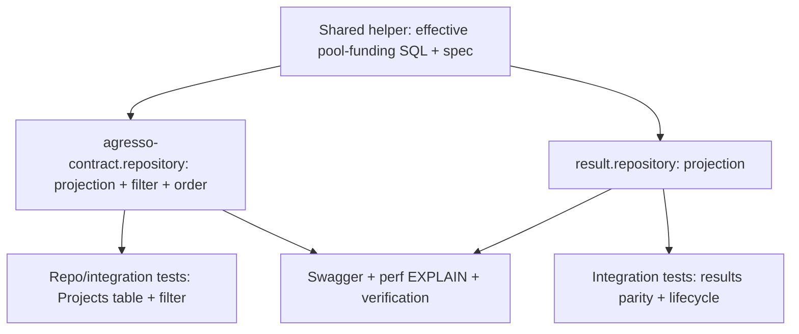

# Tasks — Bilateral / Mapping drives the Pool Funding tag

- **Module:** agresso (bilateral)
- **Spec id:** 2026-07-mapping-drives-pool-funding-tag
- **Status:** in-progress (T-01…T-05 done; T-06 pending)
- **Owner:** PO (bilateral squad)
- **Linked requirements:** ./requirements.md
- **Linked design:** ./design.md
- **Last updated:** 2026-07-01

---

## 1. Task numbering

Tasks `T-01…T-06`. This is a small, read-only change; no schema/DTO/controller work.

---

## 2. Dependency graph

---

## 3. Task list

### T-01 — Shared helper: effective pool-funding SQL fragment

- **Requirements covered:** R-BIL-100, R-BIL-105 (foundation for all)
- **Files touched (intended):**
  - `src/domain/shared/utils/pool-funding.util.ts` (new)
  - `src/domain/shared/utils/pool-funding.util.spec.ts` (new)
- **Description:** Create the single source of truth for the effective flag predicate:
  `effectivePoolFundingContributorSql(contractAlias: string): string` returning
  `(COALESCE(<ac>.is_pool_funding_contributor,0)=1 OR EXISTS(SELECT 1 FROM bilateral_project_mapping bpm WHERE bpm.agresso_agreement_id = <ac>.agreement_id AND bpm.is_active = 1))`.
- **Implementation notes:**
  - Pure string builder; alias-parameterized so both repositories reuse it (D-pf-4).
  - No user input flows into the alias — callers pass a literal (`'ac'`); do not accept
    request data here.
- **Acceptance / done check:**
  - [x] `effectivePoolFundingContributorSql('ac')` returns the exact predicate (snapshot test).
  - [x] `npm run lint` and `npm test` green (task-scope files clean; one pre-existing HEAD lint error in `bilateral.service.ts:205` noted in execution.md).
- **Dependencies:** none
- **Estimated effort:** S
- **Owner:** <name>
- **Status:** done [x]

---

### T-02 — find-contracts: derive projection, filter, and ordering

- **Requirements covered:** R-BIL-100, R-BIL-101, R-BIL-102, R-BIL-105
- **Files touched (intended):**
  - `src/domain/entities/agresso-contract/repositories/agresso-contract.repository.ts`
- **Description:** Use the T-01 helper in the `getContracts`/`findAllContracts` raw SQL:
  (a) project `${helper('ac')} AS is_pool_funding_contributor` in the main query;
  (b) replace `poolFundingContributorFilter` (`:391-394`) with
  `AND ${helper('ac')} = <0|1>`, applied to both count and main queries;
  (c) set the order fieldMap entry (`:343`) to `${helper('ac')}`.
- **Implementation notes:**
  - Keep the boolean→`0|1` mapping for the filter exactly as today.
  - Confirm the projected column keeps the alias name `is_pool_funding_contributor` so
    the response DTO/mapper is unchanged.
  - `EXISTS`, not `LEFT JOIN` (D-pf-1) — do not alter the existing `GROUP BY`.
- **Acceptance / done check:**
  - [x] A contract with active mapping + tag 0 returns `is_pool_funding_contributor: true` (R-BIL-100 AC.1) — via SQL derivation; runtime assertion lands in T-04.
  - [x] Neither tag nor active mapping → `false` (AC.3); inactive-only mapping → tag-only (AC.4) — same note.
  - [x] `pool-funding-contributor=true` includes the mapping-derived contract; `=false` excludes it (R-BIL-101) — filter predicate derived in both count + main queries.
  - [x] Manual PATCH to `false` on a mapped contract still returns `true` (R-BIL-105 AC.1) — pure OR predicate, no override path.
  - [x] `npm run lint` / `npm test` green (file-scoped lint clean; full suite 291/1780 green; pre-existing `bilateral.service.ts:205` lint error noted in execution.md).
- **Dependencies:** T-01
- **Estimated effort:** M
- **Owner:** <name>
- **Status:** done [x]

---

### T-03 — results read path: derive the projection

- **Requirements covered:** R-BIL-103
- **Files touched (intended):**
  - `src/domain/entities/results/repositories/result.repository.ts`
- **Description:** Replace `COALESCE(ac.is_pool_funding_contributor, FALSE) AS is_pool_funding_contributor`
  (`:205`) with `${helper('ac')} AS is_pool_funding_contributor`.
- **Implementation notes:**
  - **Verify the contract alias** in this query is `ac`; if it is different, pass the
    correct alias to the helper (design §5 note).
  - Confirm `bilateral_project_mapping` is reachable (no schema/scope issue) from this query context.
- **Acceptance / done check:**
  - [x] A result whose contract has an active mapping + tag 0 returns effective `true` (R-BIL-103 AC.1) — via shared-helper derivation; runtime assertion lands in T-05.
  - [x] The value equals what find-contracts returns for the same contract (AC.2) — both paths use the same helper; parity assertion lands in T-05.
  - [x] `npm run lint` / `npm test` green (file-scoped lint clean; full suite 291/1780 green; pre-existing `bilateral.service.ts:205` error tracked as RB-5).
- **Dependencies:** T-01
- **Estimated effort:** S
- **Owner:** <name>
- **Status:** done [x]

---

### T-04 — Tests: Projects table projection + filter + ordering

- **Requirements covered:** R-BIL-100, R-BIL-101, R-BIL-102
- **Files touched (intended):**
  - `src/domain/entities/agresso-contract/repositories/agresso-contract.repository.spec.ts`
- **Description:** Extend the repository spec to assert the built SQL uses the effective
  predicate for projection, filter (true and false), and ordering; add TEST-datasource
  integration cases where practical (contract + active mapping, tag 0 → true).
- **Implementation notes:**
  - Prefer query-string assertions for unit coverage; use the `TEST` datasource for the
    end-to-end value check (no MySQL in pure unit tests, per `src/CLAUDE.md §9`).
  - Cover R-BIL-100 AC.1–AC.4 and R-BIL-101 AC.1–AC.3.
- **Acceptance / done check:**
  - [x] Spec fails if the raw-column filter (`:392-393`) is restored — `toContain` + regex guards on both count and main queries; Reviewer confirmed the guards genuinely trip and don't false-match the helper output.
  - [x] All listed ACs asserted; existing manual-tag tests still pass (R-BIL-101 AC.2 covered inherently by the effective-predicate `= 1` comparison; value-level check falls to T-06).
  - [x] `npm run test:cov` keeps global ≥ 60% — 81.91% stmts / 74.12% branches / 83.5% funcs / 81.8% lines.
- **Dependencies:** T-02
- **Estimated effort:** M
- **Owner:** <name>
- **Status:** done [x]

---

### T-05 — Tests: results parity + mapping lifecycle

- **Requirements covered:** R-BIL-103, R-BIL-104, R-BIL-105
- **Files touched (intended):**
  - `src/domain/entities/results/repositories/result.repository.spec.ts` (add/extend)
- **Description:** Integration cases (TEST datasource): seed contract + active mapping
  (tag 0) → effective `true`; deactivate the only active mapping → `false` (R-BIL-104 AC.1);
  tag 1 + no mapping → `true` (R-BIL-104 AC.2 / R-BIL-105 AC.2); assert results value equals
  the find-contracts value for the same contract (R-BIL-103 AC.2).
- **Implementation notes:**
  - Reuse existing seeding helpers if present; otherwise minimal inline fixtures.
- **Acceptance / done check:**
  - [x] Lifecycle: create mapping → true; deactivate → false; manual tag persists — asserted at SQL-predicate level (branch + pure-OR guards); runtime on/off check deferred to T-06 manual verification (TEST DB unreachable from this environment).
  - [x] results value matches find-contracts value — unit-level parity: both paths embed the identical `effectivePoolFundingContributorSql('ac')` output.
  - [x] `npm run lint` / `npm test` green (file-scoped lint clean; full suite 291/1790 green; coverage 81.8% lines ≥ 60%).
- **Dependencies:** T-03
- **Estimated effort:** M
- **Owner:** <name>
- **Status:** done [x]

---

### T-06 — Swagger note, perf EXPLAIN, and manual verification

- **Requirements covered:** R-BIL-101, NFR-BIL-100
- **Files touched (intended):**
  - `src/domain/entities/agresso-contract/agresso-contract.controller.ts` (Swagger text only)
- **Description:** Update the `pool-funding-contributor` `@ApiQuery`/operation description to
  note "includes contracts with an active bilateral mapping". Run `EXPLAIN` on the
  find-contracts main + count query to confirm the `EXISTS` subquery uses
  `idx_bpm_agreement`. Perform the manual verification below against a running instance.
- **Implementation notes:**
  - No behavior change in this task beyond docs; keep it in the same PR as T-02 if the team prefers.
- **Acceptance / done check:**
  - [ ] `EXPLAIN` shows index use on `bilateral_project_mapping.agresso_agreement_id` (NFR-BIL-100).
  - [ ] Manual: `GET /api/agresso/contracts/find-contracts?contract-code=D504` returns
        `is_pool_funding_contributor: true` (mapping id 11, no manual tag).
  - [ ] Manual: deactivate D504's mapping → same query returns `false`.
  - [ ] Swagger at `/swagger` shows the updated `pool-funding-contributor` description.
- **Dependencies:** T-02, T-03
- **Estimated effort:** S
- **Owner:** <name>
- **Status:** todo

---

## 4. Standard task categories (applicability)

Applicable: 4 (Repository), 11 (Unit tests), 14 (Docs/Swagger), 15 (Rollout/comms).
**Not applicable:** 1 Schema, 2 Entity, 3 DTO, 5 Service logic, 6 Controller handler,
7 Route registration, 8 Guards/pipes, 9 non-OpenSearch integrations, 10 Cron, 12 E2E
(no new route), 13 Admin SSR.

---

## 5. Testing expectations

- Added/updated specs: `pool-funding.util.spec.ts`, `agresso-contract.repository.spec.ts`,
  `result.repository.spec.ts`.
- Coverage: keep global 60% threshold (`npm run test:cov`).
- No new endpoint → no new e2e route test; keep existing e2e green.
- Done gate: `npm run lint` + `npm test` pass; `EXPLAIN` confirms index use; no migration
  (nothing to revert).

---

## 6. Execution conventions

- One PR (small change) or split T-02/T-03 if reviewers prefer; squash on merge.
- PR title: `feat(agresso-contract): derive pool-funding tag from active bilateral mapping`.
- Branch from the current integration branch (`AC-1594-bilateral-module-v2` / `staging` —
  confirm with eng lead).
- No migration touched.

---

## 7. Risks & blockers log

| # | Date | Risk / Blocker | Mitigation | Owner | Status |
| --- | --- | --- | --- | --- | --- |
| RB-1 | 2026-07-01 | Contract alias in `result.repository.ts` may not be `ac` | Verified during T-03: alias IS `ac` (`LEFT JOIN agresso_contracts ac`); helper called with `'ac'` | Leader | closed |
| RB-2 | 2026-07-01 | OpenSearch index holds raw column (drift) | Out of scope (D-pf-5); follow-up spec if a consumer reads the flag from OpenSearch | <name> | open |
| RB-3 | 2026-07-01 | Predicate duplicated across queries | Shared helper (T-01) is the single source | <name> | closed |
| RB-4 | 2026-07-01 | Root `GET /api/agresso/contracts` (`findAllContracts`) still filters/returns the raw column | Escalated as OQ-2 (requirements §9); await PO decision — bring in scope or document raw-by-design | Leader | open |
| RB-5 | 2026-07-01 | Pre-existing lint error `bilateral.service.ts:205` (unused `activePortfolio`, committed at `ff4b7e78`) blocks repo-wide `npm run lint` | Outside spec scope; bilateral squad to fix; task verification uses file-scoped lint | Leader | open |

---

## 8. Done definition

- [ ] T-01…T-06 done.
- [ ] R-BIL-100…105 ACs and NFR-BIL-100 checked.
- [ ] `npm run test:cov` ≥ 60%.
- [ ] Swagger `pool-funding-contributor` description updated.
- [ ] Manual verification (D504 badge on/off) passes.
- [ ] Rollout note in place (code-only deploy; backout = git revert; STAR team notified).
