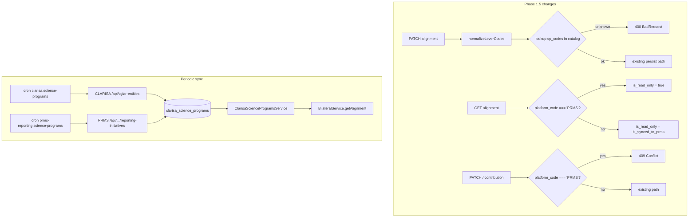

# Design — Bilateral / Pending items (Phase 1.5 + architectural deltas)

- **Module:** bilateral
- **Spec id:** 2026-05-bilateral-pending-items
- **Status:** draft
- **Owner:** ARI backend team
- **Linked requirements:** [`./requirements.md`](./requirements.md)
- **Linked detailed design:** [`../../../detailed-design/detailed-design.md`](../../../detailed-design/detailed-design.md) (§persistence, §integrations, §observability)
- **Parent design:** [`../design.md`](../design.md) — this spec EXTENDS the parent with §3.6 (two-upstream sync) + §3.7 (source-based read-only) once landed.
- **Last updated:** 2026-05-23

---

## 1. Goals & non-goals

**Goals:**
- Ship catalog input validation that prevents typos from persisting (R-BIL-070).
- Add the source-based read-only gate so PRMS-sourced results are read-only on bilateral surfaces (R-BIL-071).
- Wire a two-upstream periodic sync that keeps the catalog current without code releases (R-BIL-072).
- Clean up the misleading column name and extend the catalog with the fields the FE + future PRMS-push mapper need (R-BIL-073, R-BIL-074).
- Close the operational gap: get the seed migration to dev/staging/prod (R-BIL-075).

**Non-goals:**
- Re-architecting the bilateral surface against a read-only PRMS adapter (R-BIL-071 is a gate, not a refactor).
- Synchronising indicators-per-SP (T-31 territory, unchanged).
- Implementing PRMS push (Phase 3, blocked on external decisions T-21 / T-23).
- Adding W3 Registry sync (Phase 4, blocked on T-22).

---

## 2. Architecture

The diff is small and bounded: one new validation hop in `BilateralService.normalizeLeverCodes`, one new gate evaluator inside `BilateralService.getAlignment` + `updateAlignment`, two new cron jobs reusing the existing `tools/cron-jobs/` pattern, two new migrations, two new entity columns.



### 2.1 Composition

New files:

- `src/db/migrations/<timestamp>-renameLeverCodeToSpCodeOnAlignmentSp.ts` — R-BIL-073.
- `src/db/migrations/<timestamp>-extendScienceProgramCatalogColumns.ts` — R-BIL-074 (columns + `icon_key` seed).
- `src/domain/tools/clarisa/entities/clarisa-science-programs/clarisa-science-programs.sync.ts` — CLARISA sync leg (R-BIL-072).
- `src/domain/tools/cron-jobs/clarisa-science-programs.cron.ts` — CLARISA cron (R-BIL-072).
- `src/domain/tools/cron-jobs/prms-reporting-science-programs.cron.ts` — PRMS Reporting cron (R-BIL-072).
- `src/domain/tools/prms-reporting/prms-reporting.service.ts` (new tool if not present) — thin HTTP client for the reporting-initiatives endpoint.
- Sibling `*.spec.ts` for `BilateralService`, `BilateralController`, `ClarisaScienceProgramsService`, `ClarisaScienceProgramsController` (NFR-BIL-070).

Modified files:

- `src/domain/entities/bilateral/bilateral.service.ts` — add catalog validation in `normalizeLeverCodes`; add source-based read-only gate in `getAlignment`, `updateAlignment`, `upsertContribution`, `deleteContribution`.
- `src/domain/entities/bilateral/entities/result-pool-funding-alignment-sp.entity.ts` — column rename `lever_code` → `sp_code`, index rename, property rename.
- `src/domain/entities/bilateral/repositories/result-pool-funding-alignment-sp.repository.ts` — references update.
- `src/domain/entities/bilateral/repositories/result-pool-funding-alignment.repository.ts` — references update where `selected_levers` is hydrated.
- `src/domain/entities/bilateral/dto/update-pool-funding-alignment.dto.ts` — `SelectedScienceProgramResponse` gets `reporting_enabled?: boolean | null; icon_key?: string | null`.
- `src/domain/tools/clarisa/entities/clarisa-science-programs/entities/clarisa-science-program.entity.ts` — three new columns.
- `src/domain/tools/clarisa/entities/clarisa-science-programs/clarisa-science-programs.service.ts` — expose new columns on `findAll` / `findByCode`.
- `src/domain/entities/results/entities/result.entity.ts` — no change (already exposes `platform_code`).
- `src/domain/shared/utils/env.utils.ts` — new flag `BILATERAL_SP_SYNC_ENABLED`; new var `PRMS_REPORTING_PHASE_ID`.

### 2.2 Reuse

- `ClarisaService.cloneAllControlList` — pattern only; not used directly because our sync is two-upstream.
- `LoggerUtil` — sync logging.
- `sync_process_log` table — both crons write rows.
- `HttpModule` — for both sync legs; PRMS leg uses bearer auth via existing PRMS credentials.
- `ResultRepository.findPoolFundingAlignmentContext` — already returns `platform_code`; reused unchanged.

---

## 3. Data model

### 3.1 `result_pool_funding_alignment_sp` (R-BIL-073)

- Path: `src/domain/entities/bilateral/entities/result-pool-funding-alignment-sp.entity.ts`.
- Column rename: `lever_code VARCHAR(50) NOT NULL` → `sp_code VARCHAR(50) NOT NULL`. Data preserved (codes are already SP codes despite the legacy column name).
- Index rename: `idx_result_pool_funding_alignment_sp_lever` → `idx_result_pool_funding_alignment_sp_sp`.
- Property rename on entity: `lever_code: string` → `sp_code: string`. `@OpenSearchProperty({ type: 'keyword' })` decoration carried over.
- Migration: `<timestamp>-renameLeverCodeToSpCodeOnAlignmentSp.ts` — up: `ALTER TABLE ... CHANGE COLUMN lever_code sp_code VARCHAR(50) NOT NULL; ALTER TABLE ... RENAME INDEX ...`. Down: inverse.

### 3.2 `clarisa_science_programs` (R-BIL-074)

- Path: `src/domain/tools/clarisa/entities/clarisa-science-programs/entities/clarisa-science-program.entity.ts`.
- New columns (all nullable):
  - `reporting_enabled BOOLEAN NULL` — populated by R-BIL-072 PRMS leg.
  - `prms_id INT NULL UNIQUE` — populated by R-BIL-072 PRMS leg; used by the future T-25 mapper.
  - `icon_key VARCHAR(64) NULL` — seeded equal to `official_code`; gives FE a stable lookup key decoupled from the code.
- Seed (in same migration): `UPDATE clarisa_science_programs SET icon_key = official_code WHERE icon_key IS NULL`.
- Migration: `<timestamp>-extendScienceProgramCatalogColumns.ts`.

### 3.3 `sync_process_log` row types (R-BIL-072)

- New `process` values: `'clarisa.science-programs'`, `'prms-reporting.science-programs'`. No schema change (column already accepts free-form strings).

No OpenSearch decoration changes.

---

## 4. API surface

### PATCH /api/v1/results/:resultCode/pool-funding-alignment

- **Controller:** `src/domain/entities/bilateral/bilateral.controller.ts` (unchanged).
- **Roles / Guards:** unchanged (`@Roles(CONTRIBUTOR, CENTER_ADMIN, SYSTEM_ADMIN)` + `ResultOwnerGuard`).
- **Body DTO:** `update-pool-funding-alignment.dto.ts` (unchanged shape).
- **Response data shape:** unchanged.
- **Swagger:** existing annotations retained; description updated to mention `400` (unknown SP) and the new `409` description for source-PRMS.
- **Errors:**
  - `400` `{ unknown_sp_codes: string[] }` — R-BIL-070.
  - `409` `description = "Result is PRMS-sourced; bilateral alignment is read-only in STAR"` — R-BIL-071.
  - existing `409` for `is_synced_to_prms = true` continues (different description).
- **Notes:** the source gate fires BEFORE role/owner checks (architectural constraint).

### GET /api/v1/results/:resultCode/pool-funding-alignment

- Response `data.is_read_only` becomes the union of the two gates.
- Each `selected_science_programs[]` entry gains optional `reporting_enabled?: boolean | null` and `icon_key?: string | null`.

### GET /api/tools/clarisa/science-programs[/<:code>]

- Each entry gains `reporting_enabled`, `prms_id`, `icon_key` (all nullable). No behavior change.

### POST/PATCH/DELETE /api/v1/results/:resultCode/pool-funding-alignment/indicators/:indicatorCode/contribution

- Same 409 gate as PATCH alignment (R-BIL-071). No body shape change.

No new endpoints. No version bump (all additive).

---

## 5. Workflows & business rules

### 5.1 `normalizeLeverCodes` validation (R-BIL-070)

```
input: dto, catalogCodesSet := ClarisaScienceProgramsService.findAll().map(sp => sp.official_code)
if !dto.has_contribution: return []
sourceCodes := dto.sp_codes ?? dto.lever_codes ?? []
cleaned := unique(trim(non-blank(sourceCodes)))
if cleaned.length === 0: 400 "At least one Science Program code (sp_codes) is required"
unknown := cleaned.filter(c => !catalogCodesSet.has(c))
if unknown.length > 0: 400 description="Unknown Science Program codes" errors={unknown_sp_codes: unknown}
return cleaned
```

- Catalog fetched ONCE per request (cached at service-call scope, NOT process-cached — keeps simple).
- Future optimisation (deferred): in-memory cache invalidated by a sync-completed event.

### 5.2 Source-based read-only gate (R-BIL-071)

```
on getAlignment:
  context := resultRepository.findPoolFundingAlignmentContext(resultId)
  isPrmsSourced := context.platform_code === 'PRMS'
  isSyncedToPrms := bool(context.is_synced_to_prms)
  is_read_only := isPrmsSourced || isSyncedToPrms

on updateAlignment / upsertContribution / deleteContribution:
  context := resultRepository.findPoolFundingAlignmentContext(resultId)
  if context.platform_code === 'PRMS':
    throw 409 "Result is PRMS-sourced; bilateral alignment is read-only in STAR"
  // existing is_synced_to_prms gate continues to fire after
```

- Both gates evaluated server-side; FE renders based on `is_read_only`. The 409 is a defensive backstop.

### 5.3 CLARISA sync leg (R-BIL-072)

```
@Cron('0 0 3 * * *')  // 03:00 UTC daily
syncFromClarisa():
  if !env.BILATERAL_SP_SYNC_ENABLED: return
  log := sync_process_log.start('clarisa.science-programs')
  try:
    raw := clarisaHttp.get('/api/cgiar-entities')
    filtered := raw
      .filter(e => SP_CATEGORY_NAMES.includes(e.cgiarEntityTypeDTO.name))
      .filter(e => /^SP[0-9]{2}$/.test(e.code))
    deduped := dedupeByLatestYear(filtered)
    for each entry:
      upsert(clarisa_science_programs, {
        official_code: entry.code,
        name: entry.name.trim(),
        category: entry.cgiarEntityTypeDTO.name,
        is_active: true,
        // color / reporting_enabled / prms_id / icon_key NOT touched
      })
    log.success(count=deduped.length)
  catch e:
    log.fail(message=e.message); LoggerUtil.error(...)
```

### 5.4 PRMS Reporting sync leg (R-BIL-072)

```
@Cron('0 15 3 * * *')  // 03:15 UTC daily
syncFromPrmsReporting():
  if !env.BILATERAL_SP_SYNC_ENABLED: return
  log := sync_process_log.start('prms-reporting.science-programs')
  try:
    raw := prmsHttp.get(`/api/results/admin-panel/phases/${env.PRMS_REPORTING_PHASE_ID}/reporting-initiatives`)
    for sp in raw.response.science_programs.filter(s => /^SP[0-9]{2}$/.test(s.official_code)):
      // ONLY update existing rows; do NOT INSERT (CLARISA owns existence)
      updateIfExists(clarisa_science_programs, official_code=sp.official_code, {
        color: sp.color,
        reporting_enabled: sp.reporting_enabled,
        prms_id: sp.id,
        // official_code / name / category / icon_key NOT touched
      })
    log.success(count=raw.response.science_programs.length)
  catch e:
    log.fail(message=e.message); LoggerUtil.error(...)
```

### 5.5 Conflict policy (R-BIL-072)

- CLARISA leg writes ONLY: `official_code`, `name`, `category`, `is_active`.
- PRMS leg writes ONLY: `color`, `reporting_enabled`, `prms_id`.
- `icon_key` is seed-only; never overwritten by either sync (until a future spec gives the FE team a way to upload icons).
- Both legs are idempotent. Rerunning either leg yields the same end-state.

### 5.6 Transactional boundaries

- Each sync leg wraps its writes in `manager.transaction` so a mid-iteration crash does not leave half-updated rows.
- Each cron records start + end in `sync_process_log` regardless of success.

---

## 6. Frontend (Admin SSR panel) impact

No admin panel changes. The catalog table is operational, not human-edited via admin UI.

A future spec MAY add an admin page to manually trigger the two sync legs and view the last `sync_process_log` row per process — out of scope here.

For STAR (sibling repo): tracked under existing STAR-side tasks `T-13` (project tag) / `T-14` (alignment section). No ARI work required; this design only constrains the contract STAR consumes.

---

## 7. Integration impact

### CLARISA

- Files: new `src/domain/tools/clarisa/entities/clarisa-science-programs/clarisa-science-programs.sync.ts`.
- New env vars: none (re-uses existing `ARI_CLARISA_HOST` / `ARI_CLARISA_USER` / `ARI_CLARISA_PASS`).
- Cron: `0 0 3 * * *` (daily 03:00 UTC).
- New message / event contracts: none.

### PRMS Reporting

- Files: new `src/domain/tools/prms-reporting/prms-reporting.service.ts` if no existing service wraps the reporting endpoint (verify before scaffold).
- New env vars: `ARI_PRMS_REPORTING_HOST` (reuse existing if present), `ARI_PRMS_REPORTING_PHASE_ID` (default `6`).
- Cron: `0 15 3 * * *` (daily 03:15 UTC).
- Auth: reuse existing PRMS auth pattern (Bearer; or app-secret per `app_secrets`).
- New message / event contracts: none.

### Socket.IO / RabbitMQ / DynamoDB / OpenSearch

- No changes.

---

## 8. Security & authorization

- **R-BIL-070** — no auth change. Validation runs after existing role/owner checks.
- **R-BIL-071** — the gate runs server-side and fires for ALL callers, including `SYSTEM_ADMIN`. The constraint is architectural (PRMS owns the source of truth for PRMS-platform results), not authorization-driven.
- **R-BIL-072** — cron context only; no HTTP surface. PRMS credentials are reused; no new secret rotation needed.
- No PII or donor-restricted data introduced.

---

## 9. Observability

- New `LoggerUtil` lines:
  - `[BilateralService] PATCH alignment rejected: unknown_sp_codes=[...]` (warn).
  - `[BilateralService] PATCH alignment rejected: result is PRMS-sourced` (info).
  - `[ClarisaScienceProgramsSync] CLARISA leg start/end (count=N, duration=Xms)` (info).
  - `[ClarisaScienceProgramsSync] PRMS leg start/end (count=N, duration=Xms)` (info).
- New `sync_process_log` row types: `clarisa.science-programs`, `prms-reporting.science-programs`. Operators can query `SELECT * FROM sync_process_log WHERE process LIKE '%science-programs%' ORDER BY started_at DESC LIMIT 20` for health.
- No new CloudWatch metrics or dashboards (existing sync log monitoring covers both legs).

---

## 10. Testing strategy

- **Unit (R-BIL-070):** `BilateralService.normalizeLeverCodes` — happy path, unknown code, mixed known+unknown, `has_contribution=false` short-circuit.
- **Unit (R-BIL-071):** `BilateralService.getAlignment` + `updateAlignment` — STAR-sourced (pass), PRMS-sourced (gated), STAR-sourced + synced (existing gate), `SYSTEM_ADMIN` on PRMS-sourced (still 409).
- **Unit (R-BIL-072):** two sync services — CLARISA filter + dedupe + trim, PRMS update-only (no INSERT), feature-flag-off short-circuit, error path writes `sync_process_log` failed row.
- **Unit (R-BIL-074):** `ClarisaScienceProgramsService.findAll` + `findByCode` return new columns.
- **Unit (NFR-BIL-070):** sibling `*.spec.ts` for all four classes.
- **E2E (`test/bilateral.e2e-spec.ts`):** add cases for 400-unknown-sp, 409-PRMS-sourced (both GET shape + PATCH/POST gates), 200 after migration runs in test DB.
- **Migration tests:** `npm run migration:dev:execute` then `npm run migration:revert` for each new migration; verify data preservation.
- Coverage threshold: keep global ≥ 60%; bilateral module floor at 70% post-spec.

---

## 11. Rollout

Order (mandatory):

1. **Land code on `AC-1594-bilateral-module-v2`**, all migrations included.
2. **Apply migration `1779190000010` (the seed) to dev**, then run smoke `GET /api/tools/clarisa/science-programs` → 200, 13 rows.
3. **Apply R-BIL-073 rename + R-BIL-074 columns migrations to dev**, smoke-test again.
4. **Apply same migrations to staging** (verify), then **production** (verify).
5. **Enable `ARI_BILATERAL_SP_SYNC_ENABLED=true` on dev** for one cycle, verify `sync_process_log` rows.
6. Promote the flag to **staging**, then **production**, one env per cycle.

Feature flags (env):
- `ARI_BILATERAL_SP_SYNC_ENABLED` (new, default `false`).
- `ARI_PRMS_REPORTING_PHASE_ID` (new, default `6`).
- `ARI_BILATERAL_MODULE_ENABLED` (existing, untouched).

Backout:
- For R-BIL-070 / R-BIL-071 code changes: standard PR revert.
- For R-BIL-073 rename migration: `npm run migration:revert` reverses cleanly (data preserved).
- For R-BIL-074 columns: same.
- For R-BIL-072 syncs: flip flag off; data already in catalog is preserved.

Comms:
- STAR FE team: notified of new 400 / 409 codes + new response fields one sprint before staging promotion.
- MEL PO: notified of `reporting_enabled` semantic when AC.4 of R-BIL-074 lands.
- Ops: runbook update for the two new sync_process_log row types (NFR-BIL-072).

---

## 12. Design decisions log

| # | Date | Decision | Rationale |
| --- | --- | --- | --- |
| D-PI-1 | 2026-05-23 | Source-based read-only gate runs BEFORE role/owner checks. | The constraint is architectural — even `SYSTEM_ADMIN` must not mutate PRMS-sourced data via STAR. Putting it after RBAC would let SYSTEM_ADMIN bypass it. |
| D-PI-2 | 2026-05-23 | Two-upstream sync split: CLARISA owns existence + identity; PRMS enriches. | CLARISA is canonical for portfolio composition (per System Office). PRMS owns reporting-cycle state (`reporting_enabled`) and its own PK. Each leg writes ONLY its owned columns to avoid conflicts. |
| D-PI-3 | 2026-05-23 | `icon_key` is seed-only, never overwritten by either sync. | Neither upstream exposes icon assets. The FE bundles icons keyed by `icon_key`; the column is a stable contract, decoupled from `official_code` for any future rebrand. |
| D-PI-4 | 2026-05-23 | PRMS leg ONLY updates existing rows; never INSERTs. | Prevents PRMS dirty data (e.g. `SGP-02` mixed in with SP-prefix codes) from polluting the catalog. CLARISA leg is the only insert path. |
| D-PI-5 | 2026-05-23 | Sync feature flag is single (`ARI_BILATERAL_SP_SYNC_ENABLED`) and gates BOTH legs. | Avoids the partial-state failure mode where one leg runs but not the other (e.g. CLARISA on, PRMS off → `color` always NULL). |
| D-PI-6 | 2026-05-23 | Validation in R-BIL-070 accepts any catalog row regardless of `is_active`. | Catalog rows are never hard-deleted (D-PI-4 backstop). Validating against `is_active=true` only would break previously-valid alignment rows when an SP rotates out of the active portfolio. |

---

## 13. Open questions

| # | Question | Owner | Due |
| --- | --- | --- | --- |
| OQ-PI-1 | Should `reporting_enabled = false` SPs be hidden or greyed in the picker? | STAR FE + MEL PO | 2026-06-15 |
| OQ-PI-2 | Should R-BIL-070 hard-reject `is_active = false` catalog rows? | ARI backend (lead) | 2026-06-15 |
| OQ-PI-3 | Is daily 03:00/03:15 UTC right, or do we add a manual trigger endpoint? | ops | 2026-06-30 |
| OQ-PI-4 | Does PRMS Reporting expose a stable per-phase endpoint for previous cycles (in case we ever need historical)? | PRMS team | 2026-07-15 |

---

## 14. References

- Parent spec: [`../requirements.md`](../requirements.md), [`../design.md`](../design.md), [`../tasks.md`](../tasks.md), [`../frontend-handoff.md`](../frontend-handoff.md).
- Approved proposal: [`./proposal.md`](./proposal.md).
- Repo commits: `5d48b27b` (SP catalog wave), `c19efe1a` (FE handoff doc), `c6709e67` (this spec's proposal).
- Detailed design baseline: [`../../../detailed-design/detailed-design.md`](../../../detailed-design/detailed-design.md) §integrations.
