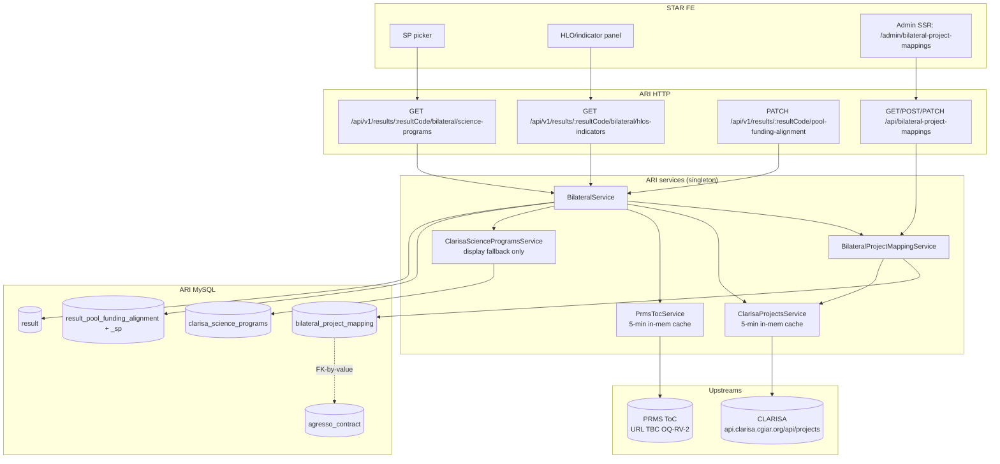

# Design — Bilateral / Pending items (v2: CLARISA-source SPs + admin-owned project mapping)

- **Module:** bilateral
- **Spec id:** 2026-05-bilateral-pending-items
- **Status:** draft v2
- **Owner:** ARI backend team
- **Linked requirements:** [`./requirements.md`](./requirements.md)
- **Linked detailed design:** [`../../../detailed-design/detailed-design.md`](../../../detailed-design/detailed-design.md) (§persistence, §integrations, §observability)
- **Parent design:** [`../design.md`](../design.md) — this spec EXTENDS the parent with new §3.6 (CLARISA-source SP linkage + admin mapping) and §3.7 (source-based read-only gate) once landed.
- **Last updated:** 2026-05-25

---

## 1. Executive summary

This wave introduces:

1. A new persistent join table `bilateral_project_mapping` (R-BIL-079) and a new admin SSR page `/admin/bilateral-project-mappings` (R-BIL-080) to maintain it manually.
2. Two new ARI tool services — `ClarisaProjectsService` (R-BIL-076) and `PrmsTocService` (R-BIL-077) — that proxy live reads from the upstream sources with 5-min in-memory caches.
3. Two new ARI public endpoints — `GET /api/v1/results/:resultCode/bilateral/science-programs` and `GET .../bilateral/hlos-indicators` — that the STAR FE consumes to populate the SP picker and HLO panel.
4. Phase 1.5 cleanups inherited from v1: catalog-aware PATCH validation (R-BIL-070), source-based read-only gate (R-BIL-071), `lever_code → sp_code` rename (R-BIL-073), `icon_key` column (R-BIL-074), operational rollout (R-BIL-075).

The static `clarisa_science_programs` catalog is reclassified as **display-only fallback** (icons / colors / names); CLARISA is the new picker source of truth.

---

## 2. Goals & non-goals

**Goals:**
- Make the SP picker source the CLARISA per-project list (R-BIL-076).
- Make the HLO panel proxy PRMS ToC (R-BIL-077).
- Provide the admin surface that owns the AGRESSO ↔ CLARISA project join (R-BIL-079, R-BIL-080).
- Land Phase 1.5 hardening (R-BIL-070, R-BIL-071, R-BIL-073, R-BIL-074, R-BIL-075).
- Keep the work shipped on `5d48b27b` useful (catalog as display fallback).

**Non-goals:**
- Replicating CLARISA's project↔SP or PRMS's ToC catalogs in our DB.
- AI-assisted mapping suggestions (deferred T-15.16).
- Bulk CSV import (deferred per OQ-RV-7).
- Phase 3 push / Phase 4 W3 sync (unchanged).

---

## 3. Architecture overview



---

## 4. Extended directory structure

```
server/researchindicators/src/
├── db/migrations/
│   ├── <ts>-renameLeverCodeToSpCodeOnAlignmentSp.ts           # T-15.3 / R-BIL-073
│   ├── <ts>-addIconKeyToScienceProgram.ts                     # T-15.4 / R-BIL-074
│   └── <ts>-createBilateralProjectMapping.ts                  # T-15.13 / R-BIL-079
│
├── domain/entities/bilateral/
│   ├── bilateral.service.ts                                   # MODIFIED (T-15.1, T-15.2, T-15.11)
│   ├── bilateral.service.spec.ts                              # NEW (T-15.6)
│   ├── bilateral.controller.ts                                # MODIFIED (adds /bilateral/science-programs + /hlos-indicators routes)
│   ├── bilateral.controller.spec.ts                           # NEW (T-15.6)
│   ├── dto/
│   │   ├── update-pool-funding-alignment.dto.ts               # MODIFIED — add icon_key, allocation, mapping_status fields
│   │   └── bilateral-science-programs.response.dto.ts         # NEW (T-15.11)
│   │   └── bilateral-hlos-indicators.response.dto.ts          # NEW (T-15.12)
│   ├── entities/
│   │   └── result-pool-funding-alignment-sp.entity.ts         # MODIFIED — column rename (T-15.3)
│   └── repositories/
│       ├── result-pool-funding-alignment.repository.ts        # MODIFIED — references update
│       └── result-pool-funding-alignment-sp.repository.ts     # MODIFIED — references update
│
├── domain/entities/bilateral-project-mapping/                 # NEW MODULE (T-15.13, T-15.14)
│   ├── bilateral-project-mapping.module.ts
│   ├── bilateral-project-mapping.controller.ts                # admin REST surface
│   ├── bilateral-project-mapping.controller.spec.ts
│   ├── bilateral-project-mapping.service.ts                   # CRUD + lookup helper
│   ├── bilateral-project-mapping.service.spec.ts
│   ├── repositories/
│   │   └── bilateral-project-mapping.repository.ts
│   ├── entities/
│   │   └── bilateral-project-mapping.entity.ts                # extends AuditableEntity
│   ├── enum/
│   │   └── mapping-source.enum.ts                             # MANUAL | AI_SUGGESTED | AI_AUTO
│   └── dto/
│       ├── create-bilateral-project-mapping.dto.ts
│       ├── update-bilateral-project-mapping.dto.ts
│       └── list-bilateral-project-mappings.query.dto.ts
│
├── domain/tools/clarisa/entities/clarisa-science-programs/
│   └── entities/clarisa-science-program.entity.ts             # MODIFIED — add icon_key (T-15.4)
│
├── domain/tools/clarisa/projects/                              # NEW TOOL (T-15.10)
│   ├── clarisa-projects.module.ts
│   ├── clarisa-projects.service.ts                            # thin HTTP client + 5-min cache
│   ├── clarisa-projects.service.spec.ts
│   ├── dto/
│   │   └── clarisa-project.types.ts                           # response shapes
│
├── domain/tools/prms-toc/                                      # NEW TOOL (T-15.12)
│   ├── prms-toc.module.ts
│   ├── prms-toc.service.ts                                    # thin HTTP client + 5-min cache
│   ├── prms-toc.service.spec.ts
│   └── dto/
│       └── prms-toc.types.ts
│
└── admin/                                                       # NEW PAGE (T-15.15)
    ├── controllers/admin.controller.ts                        # MODIFIED — add /admin/bilateral-project-mappings handler
    ├── services/admin.service.ts                              # MODIFIED — add listBilateralProjectMappings()
    └── client/
        ├── src/pages/BilateralProjectMappings/
        │   ├── BilateralProjectMappingsList.tsx
        │   ├── BilateralProjectMappingForm.tsx
        │   └── index.tsx
        └── src/App.tsx                                        # MODIFIED — add route + sidebar entry
```

---

## 5. Data model

### 5.1 `bilateral_project_mapping` (R-BIL-079, NEW)

| Column | Type | Notes |
| --- | --- | --- |
| `id` | BIGINT PK auto-increment | Primary key. |
| `agresso_agreement_id` | VARCHAR(50) NOT NULL | FK-by-value to `agresso_contract.agreement_id`. We do not enforce a hard FK because AGRESSO sync may add rows out-of-order. |
| `clarisa_project_id` | INT NOT NULL | Upstream CLARISA `project.id`. |
| `clarisa_project_short_name` | VARCHAR(500) NULL | Denormalized snapshot for display + audit (CLARISA can change `short_name` upstream; we record what the operator saw at mapping time). |
| `source` | ENUM(`MANUAL`, `AI_SUGGESTED`, `AI_AUTO`) NOT NULL DEFAULT `MANUAL` | Forward-compatible with T-15.16. |
| `confidence_score` | FLOAT NULL | Populated only when `source != MANUAL`. |
| `notes` | TEXT NULL | Operator-facing free text. |
| `is_active` | BOOLEAN NOT NULL DEFAULT TRUE | Soft-delete. |
| `created_by` | INT NULL | `AuditableEntity` standard. |
| `created_date` | TIMESTAMP NULL DEFAULT CURRENT_TIMESTAMP | |
| `updated_by` | INT NULL | |
| `updated_date` | TIMESTAMP NULL ON UPDATE CURRENT_TIMESTAMP | |
| `deleted_at` | TIMESTAMP NULL | |

**Indexes:**
- `idx_bpm_agreement` on `(agresso_agreement_id)` — primary lookup path for R-BIL-076 / R-BIL-070.
- `idx_bpm_clarisa_project` on `(clarisa_project_id)` — operator search.
- **Partial-unique** on `(agresso_agreement_id)` WHERE `is_active = TRUE` — at most one active mapping per contract.

In MySQL, partial-unique is emulated by a generated column `active_agreement_id = IF(is_active = 1, agresso_agreement_id, NULL)` with a unique index on that column. Same effect, MySQL-compatible. Captured as design decision D-PI-9.

### 5.2 `result_pool_funding_alignment_sp` (R-BIL-073, MODIFIED)

Pure rename: `lever_code` → `sp_code`. Index renamed `idx_..._lever` → `idx_..._sp`. Data preserved. The entity property changes from `lever_code: string` to `sp_code: string`; `@OpenSearchProperty({ type: 'keyword' })` decoration carried over.

### 5.3 `clarisa_science_programs` (R-BIL-074, MODIFIED)

Adds `icon_key VARCHAR(64) NULL`. Seed in same migration: `UPDATE clarisa_science_programs SET icon_key = official_code WHERE icon_key IS NULL`.

The table is **reclassified** as a display-only fallback. The single-row API (`GET /api/tools/clarisa/science-programs[/:code]`) stays live but is marked **DEPRECATED for picker use** in `frontend-handoff.md`.

### 5.4 No OpenSearch / Dynamo changes.

---

## 6. API design

### 6.1 `GET /api/v1/results/:resultCode/bilateral/science-programs` (R-BIL-076, NEW)

- **Controller:** `bilateral.controller.ts`
- **Roles:** any authenticated user (`@ApiBearerAuth()`).
- **Path tokens:** `:resultCode(\d+)`.
- **Query params:** none.
- **Response data shape (TypeScript):**

```ts
type BilateralSciencePrograms = {
  result_code: string;
  mapping_status: "mapped" | "unmapped";
  clarisa_project: { id: number; short_name: string } | null;
  science_programs: Array<{
    code: string;            // e.g. "SP09"
    name: string;            // from CLARISA global_unit_object.name
    category: string | null; // from CLARISA cgiar_entity_type_object.name OR local catalog fallback
    color: string | null;    // from local catalog (CLARISA doesn't expose)
    icon_key: string | null; // from local catalog
    allocation: number | null; // % from CLARISA mapping (0–100)
  }>;
};
```

- **Errors:** `404` if result not found; `200` with empty list if unmapped (per R-BIL-076 scenarios).
- **Swagger:** `@ApiTags('Bilateral')`, `@ApiOperation('Get Science Programs linked to the result\'s bilateral project')`, `@ApiOkResponse({type: BilateralSciencePrograms})`.

### 6.2 `GET /api/v1/results/:resultCode/bilateral/hlos-indicators?sp_codes=...` (R-BIL-077, NEW)

- **Query params:**
  - `sp_codes` — comma-separated list (e.g. `SP09,SP10`).
- **Response data shape:**

```ts
type BilateralHlosByScienceProgram = Array<{
  sp_code: string;
  sp_name: string;
  hlos: Array<{
    id: number;
    code: string;
    title: string;
    indicators: Array<{
      id: number;
      code: string;
      name: string;
    }>;
  }>;
}>;
```

- **Errors:** `503` if PRMS ToC integration is not yet configured (OQ-RV-2 open) OR upstream unreachable with cold cache; `200` with `[]` if `sp_codes` is empty/omitted.

### 6.3 `GET /api/bilateral-project-mappings` (R-BIL-080, NEW)

- **Roles:** `@Roles(CENTER_ADMIN, SYSTEM_ADMIN)` + `RolesGuard`.
- **Query params:** `page` (default 1), `limit` (default 50, max 200), `search` (matches `agresso_agreement_id` ILIKE OR `clarisa_project_short_name` ILIKE), `is_active` (`true|false`), `source` (`MANUAL|AI_SUGGESTED|AI_AUTO`).
- **Response data shape:** `{ items: BilateralProjectMappingDto[], meta: { total, page, limit, totalPages } }`.

### 6.4 `POST /api/bilateral-project-mappings` (R-BIL-080, NEW)

- **Body:** `CreateBilateralProjectMappingDto`:

```ts
{
  agresso_agreement_id: string;       // required
  clarisa_project_id: number;         // required
  clarisa_project_short_name?: string; // snapshot at mapping time, set server-side if omitted
  source?: "MANUAL" | "AI_SUGGESTED" | "AI_AUTO"; // default MANUAL
  confidence_score?: number;          // required when source != MANUAL
  notes?: string;
}
```

- **Errors:** `409 Conflict` with `description = "Active mapping already exists for this contract"` when an active row exists for the contract.

### 6.5 `PATCH /api/bilateral-project-mappings/:id` (R-BIL-080, NEW)

- Same body as create with all fields optional; cannot change `agresso_agreement_id` (immutable; deactivate and create a new row instead).

### 6.6 `PATCH /api/bilateral-project-mappings/:id/deactivate` (R-BIL-080, NEW)

- Body: optional `{ notes?: string }` to record reason.
- Sets `is_active = false`, `updated_by = caller`, `deleted_at = now()`.

### 6.7 `PATCH /api/v1/results/:resultCode/pool-funding-alignment` (R-BIL-070 + R-BIL-071, MODIFIED)

- Body shape unchanged.
- Adds 400 error with `errors = { unknown_sp_codes: string[] }`.
- Adds 409 error when `result.platform_code === 'PRMS'`.
- Swagger description updated to mention both.

### 6.8 `GET /api/v1/results/:resultCode/pool-funding-alignment` (MODIFIED)

- Each `selected_science_programs[]` entry gains `icon_key?: string | null` and (when sourced from a CLARISA-mapped path) `allocation?: number | null`.
- `is_read_only` becomes the union of the two gates.

---

## 7. Backend module design

### 7.1 `BilateralProjectMappingService` (T-15.14)

Singleton-scoped per parent design.md §3.4 Constraint A.

```ts
@Injectable()
export class BilateralProjectMappingService {
  constructor(
    private readonly repo: BilateralProjectMappingRepository,
    private readonly dataSource: DataSource,
  ) {}

  async list(query: ListMappingsDto): Promise<Paginated<BilateralProjectMapping>>;
  async create(dto: CreateBilateralProjectMappingDto, user: User): Promise<BilateralProjectMapping>;
  async update(id: number, dto: UpdateBilateralProjectMappingDto, user: User): Promise<BilateralProjectMapping>;
  async deactivate(id: number, user: User, notes?: string): Promise<BilateralProjectMapping>;

  // Lookup helper consumed by BilateralService (T-15.11)
  async findActiveByAgreementId(agreementId: string): Promise<BilateralProjectMapping | null>;
}
```

- `create` wraps insert + the partial-unique check in a `manager.transaction` so the conflict response is deterministic.
- `deactivate` sets `is_active=false`, `deleted_at=now()`, audit fields.

### 7.2 `ClarisaProjectsService` (T-15.10)

```ts
@Injectable()
export class ClarisaProjectsService {
  private cache: { data: ClarisaProject[]; fetchedAt: number } | null = null;
  private readonly TTL_MS = 5 * 60 * 1000;

  constructor(
    private readonly http: HttpService,
    private readonly env: AppConfig,
  ) {}

  async listBilateralProjects(): Promise<ClarisaProject[]>;       // cached, filtered to source_of_funding = "Bilateral"
  async findProjectById(id: number): Promise<ClarisaProject | null>; // via cached list
  private async fetchAll(): Promise<ClarisaProject[]>;             // raw fetch from /api/projects
}
```

- Cache invalidation: TTL only (no event-based; CLARISA changes are rare).
- On upstream error with warm cache: serve cache, log warning.
- On upstream error with cold cache: throw `ServiceUnavailableException` (translates to 503 envelope).

### 7.3 `PrmsTocService` (T-15.12)

Same cache pattern as `ClarisaProjectsService`. Keyed by sorted comma-joined SP codes.

Until OQ-RV-2 closes: implementation throws `ServiceUnavailableException` with `description = "PRMS ToC integration not yet configured"`. Tests verify the 503 path.

### 7.4 `BilateralService` extensions (T-15.1, T-15.2, T-15.11)

New methods:

```ts
async getScienceProgramsForResult(resultId: number, resultCode: string): Promise<BilateralSciencePrograms>;
async getHlosByScienceProgramsForResult(resultId: number, resultCode: string, spCodes: string[]): Promise<BilateralHlosByScienceProgram>;
```

- `getScienceProgramsForResult` chain:
  1. `resultRepository.findPoolFundingAlignmentContext(resultId)` → `agreement_id` (existing).
  2. `bilateralProjectMappingService.findActiveByAgreementId(agreement_id)` → mapping or null.
  3. If null: return `{ ..., mapping_status: "unmapped", science_programs: [], clarisa_project: null }`.
  4. Else: `clarisaProjectsService.findProjectById(mapping.clarisa_project_id)`, filter `project_mappings_array` (`status="Confirmed"`, `portfolio.acronym=activePortfolio`), map each entry, enrich with catalog fallback.

- `normalizeLeverCodes` extension (T-15.1) reuses `getScienceProgramsForResult` to compute the catalog set for validation.

- `getAlignment` + write methods enforce R-BIL-071 source gate BEFORE role/owner checks via a private `assertPrmsSourceWritable(context)` helper.

### 7.5 Module wiring

- `BilateralProjectMappingModule` exports the service so `BilateralModule` can inject it.
- `BilateralModule` imports `BilateralProjectMappingModule`, `ClarisaProjectsModule` (new), `PrmsTocModule` (new).
- All four new providers are **singleton** (no `CurrentUserUtil` / `ResultsUtil` injection) per parent §3.4 Constraint A.

---

## 8. Frontend / UX component architecture

### 8.1 Admin SSR page `/admin/bilateral-project-mappings` (R-BIL-080, T-15.15)

Follows `src/admin/README-REACT.md` conventions. Two React 19 components:

**`BilateralProjectMappingsList.tsx`** — paginated table:

```
+--------------------------------------------------------------------------------------+
| Bilateral project mappings                       [+ New mapping]    [Search: ___ ]   |
| Filters: [is_active: All/Active/Inactive ▾]  [source: All/MANUAL/AI_*]               |
+--------------------------------------------------------------------------------------+
| AGRESSO contract  | CLARISA project (short_name)  | Source  | Status   | Updated  |  |
|-------------------|-------------------------------|---------|----------|----------|--|
| D527              | T-PJ-003262-An innovative...  | MANUAL  | Active   | 2026-05-25 | [Edit] [Deactivate]
| C0042             | 1078-CHI0   Supporting prep.. | MANUAL  | Active   | 2026-05-22 | [Edit] [Deactivate]
| D420 (deactivated)| N-303008-GUATEMALA FOOD SEC.. | MANUAL  | Inactive | 2026-05-15 | [View]
|------------------------------------------------------------------------------------|
| ◀ 1 2 3 ▶  (showing 1-50 of 187)                                                   |
+------------------------------------------------------------------------------------+
```

**`BilateralProjectMappingForm.tsx`** — create / edit:

```
+--------------------------------------------------------------------------------------+
| New bilateral project mapping                                                        |
+--------------------------------------------------------------------------------------+
| AGRESSO contract *      [ Pick contract... ▾ ]    (filtered to funding_type=BLR)     |
|   D527 — USAID-CSISA-MEA — CIMMYT                                                    |
|                                                                                       |
| CLARISA bilateral project *  [ Pick project... ▾ ]   (filtered to source=Bilateral)  |
|   T-PJ-003262-An innovative approach... (IITA, Nigeria, 2020-2025)                   |
|   → SP allocation preview: SP09 (25%) + SP10 (75%)  ← read-only preview              |
|                                                                                       |
| Notes (optional)         [ ........................................ ]                |
|                                                                                       |
| Source                   ● Manual  ○ AI Suggested  ○ AI Auto                         |
| Confidence (AI only)     [ ___ ]                                                     |
|                                                                                       |
|                                            [Cancel]  [Create mapping]                |
+--------------------------------------------------------------------------------------+
```

- AGRESSO picker → `GET /api/v1/agresso/contracts?pool-funding-contributor=true` (existing endpoint, sufficient).
- CLARISA project picker → new `GET /api/admin/clarisa-projects?source_of_funding=Bilateral&search=...` (small wrapper around `ClarisaProjectsService.listBilateralProjects()`) — included under T-15.15.
- SP allocation preview is read-only and informational only; it lets the operator confirm they picked the right project before committing.

**Sidebar entry** added under "Bilateral" group:

```
ADMIN PANEL
├── Dashboard
├── Users
├── Settings
└── Bilateral
    └── Project mappings   ← NEW
```

### 8.2 STAR FE (out-of-repo coordination only)

The FE consumes the two new endpoints. ARI exposes them; ARI does not change `client/`. Updates to `frontend-handoff.md` describe:

- Switch picker source from `/api/tools/clarisa/science-programs` to `GET .../bilateral/science-programs`.
- Handle `mapping_status === "unmapped"` with a "Contact admin to link this contract" affordance.
- Switch HLO panel to `GET .../bilateral/hlos-indicators` with the chosen `sp_codes`.
- Bundle SP icons in STAR keyed by `icon_key` (e.g. `/assets/result-framework-reporting/SPs-Icons/${icon_key}.png`).
- Continue to send `sp_codes` on PATCH; expect 400 with `errors.unknown_sp_codes` and 409 with the new source-PRMS description.

---

## 9. Shared contracts or package extensions

No shared package extension. All DTOs live inside their owning module:

- `update-pool-funding-alignment.dto.ts` — adds `icon_key?` and `allocation?` to `SelectedScienceProgramResponse`.
- `bilateral-science-programs.response.dto.ts` — new.
- `bilateral-hlos-indicators.response.dto.ts` — new.
- `create-bilateral-project-mapping.dto.ts` + `update-bilateral-project-mapping.dto.ts` + `list-bilateral-project-mappings.query.dto.ts` — new.
- `mapping-source.enum.ts` — new (MANUAL | AI_SUGGESTED | AI_AUTO).

---

## 10. Workflows & business rules

### 10.1 SP picker open (R-BIL-076)

```
1. STAR FE GET /api/v1/results/:resultCode/bilateral/science-programs
2. BilateralService:
   a. resolve result → agreement_id
   b. lookup active bilateral_project_mapping (BilateralProjectMappingService)
   c. if null → return mapping_status: "unmapped", science_programs: []
   d. else → ClarisaProjectsService.findProjectById(clarisa_project_id)
      • cache: 5-min TTL
   e. filter project_mappings_array (status="Confirmed", portfolio.acronym=activePortfolio)
   f. enrich each from clarisa_science_programs (icon_key, color, category fallback)
3. Return mapping_status: "mapped", clarisa_project: {id, short_name}, science_programs: [...]
```

### 10.2 PATCH alignment with validation (R-BIL-070)

```
1. STAR FE PATCH /api/v1/results/:resultCode/pool-funding-alignment with sp_codes
2. BilateralService.updateAlignment:
   a. R-BIL-071 source gate (assertPrmsSourceWritable)
   b. R-BIL-015 synced gate (existing)
   c. normalizeLeverCodes:
      - if !has_contribution → return []
      - else → fetch per-result SP list (reuses getScienceProgramsForResult)
      - reject unknown codes with 400 { unknown_sp_codes }
   d. existing persist path
```

### 10.3 Admin: create mapping (R-BIL-080)

```
1. Operator POST /api/bilateral-project-mappings
2. Guard chain: JwtMiddleware → RolesGuard(@Roles(CENTER_ADMIN, SYSTEM_ADMIN))
3. BilateralProjectMappingService.create:
   a. begin transaction
   b. select-for-update on (agresso_agreement_id, is_active=true)
   c. if row exists → throw 409 "Active mapping already exists"
   d. resolve clarisa_project_short_name from cached CLARISA list if not provided
   e. insert row with audit fields
   f. commit
4. Return new row
```

### 10.4 Admin: deactivate mapping (R-BIL-080)

```
1. Operator PATCH /api/bilateral-project-mappings/:id/deactivate
2. Service:
   a. find by id; 404 if not exists
   b. if already inactive → 200 no-op
   c. set is_active=false, deleted_at=now(), updated_by=caller
   d. append notes if provided
3. Next R-BIL-076 call for any result with the same agreement_id returns mapping_status: "unmapped"
```

### 10.5 Cache invalidation

- TTL-only. No event invalidation.
- Operator-visible: after a CLARISA project picker refresh, the new project may take up to 5 minutes to appear if the cache was warm. Acceptable for first cut; if friction emerges, add a `POST /api/admin/clarisa-projects/refresh` endpoint in a follow-up.

---

## 11. Security & authorization

- New admin endpoints: `@Roles(CENTER_ADMIN, SYSTEM_ADMIN)` enforced via `RolesGuard`. `SYSTEM_ADMIN` bypasses role checks per existing convention.
- R-BIL-071 source-based gate runs BEFORE role checks; `SYSTEM_ADMIN` cannot bypass.
- No new secrets. CLARISA + PRMS ToC credentials reused from existing tool services.
- No PII or donor-restricted data introduced.
- Machine-token (client_id/client_secret) access — keep existing behavior; new admin surface NOT exposed to machine tokens (RolesGuard reads `request.user.roles` which is empty for machine tokens; explicit deny via role check).

---

## 12. Observability

New `LoggerUtil` lines:

- `[BilateralService] PATCH alignment rejected: unknown_sp_codes=[...]` (warn).
- `[BilateralService] PATCH alignment rejected: result is PRMS-sourced` (info).
- `[ClarisaProjectsService] cache hit / miss / stale-served / cold-503` (debug / info).
- `[PrmsTocService] cache hit / miss / cold-503` (debug / info).
- `[BilateralProjectMappingService] mapping created / updated / deactivated` (info, with operator id).

No new dashboards or CloudWatch metrics. Existing access-log + error-rate alarms cover the new endpoints.

---

## 13. Testing strategy

- **Unit (T-15.1):** `BilateralService.normalizeLeverCodes` — happy, unknown-single, unknown-multi, mixed, has_contribution=false, unmapped.
- **Unit (T-15.2):** `BilateralService` source gate — STAR-source happy, PRMS-source 409, STAR+synced still 409, SYSTEM_ADMIN on PRMS still 409.
- **Unit (T-15.10):** `ClarisaProjectsService` — fetch + cache hit + warm-cache-on-error + cold-503.
- **Unit (T-15.11):** `BilateralService.getScienceProgramsForResult` — mapped happy, unmapped, multi-portfolio filter, non-Confirmed filter.
- **Unit (T-15.12):** `PrmsTocService` — interim 503, post-OQ-RV-2 happy path.
- **Unit (T-15.13):** migration up/down preserves data.
- **Unit (T-15.14):** `BilateralProjectMappingService` — create + 409 conflict on duplicate active, update, deactivate, lookup helper.
- **Controller (T-15.14):** role denial, paginated list, search filter.
- **E2E (`test/bilateral.e2e-spec.ts`):** add 400-unknown-sp, 409-PRMS-source on PATCH; mapping_status="unmapped" path; mapped path returns correct SP list.
- **E2E (`test/bilateral-project-mappings.e2e-spec.ts`, new):** admin role allowed/denied; create/update/deactivate flow; partial-unique conflict.
- Migration tests: forward + revert for each new migration.
- Coverage: ≥ 60% global, ≥ 70% bilateral + bilateral-project-mapping.

---

## 14. Rollout

Order (mandatory):

1. **Land code on `AC-1594-bilateral-module-v2`**, all migrations included.
2. **Apply migrations to dev** in order: `1779190000010` (if not already applied) → `<R-BIL-073 rename>` → `<R-BIL-074 icon_key>` → `<R-BIL-079 mapping table>`. Smoke `/api/tools/clarisa/science-programs` → 200; `/api/v2/results` → 200.
3. **Seed initial mappings on dev manually** via the new admin page (10–20 high-traffic contracts to validate the flow).
4. Apply same migrations to **staging**; replicate manual seeding.
5. Apply to **production**; coordinate operator team to begin large-scale seeding.

Feature flags (env, all new):

- `ARI_BILATERAL_ACTIVE_PORTFOLIO` (default `"P25"`) — filter for R-BIL-076.
- `ARI_PRMS_TOC_HOST` + `ARI_PRMS_TOC_AUTH` (new, pending OQ-RV-2; service returns 503 until both set).
- `ARI_BILATERAL_MODULE_ENABLED` (existing, untouched).

Backout:

- Code: PR revert.
- Migrations: `npm run migration:revert` peels back one at a time; data preserved.
- Mapping rows: never hard-deleted; deactivate via admin UI.

Comms:

- STAR FE team: new endpoints + `mapping_status` semantics one sprint before staging promotion.
- MEL PO: needs to close OQ-RV-3..5 + OQ-RV-7 + OQ-RV-9 before production promotion.
- Ops: runbook entry for "no mappings yet" state + manual seeding workflow.

---

## 15. Design decisions log

| # | Date | Decision | Rationale |
| --- | --- | --- | --- |
| D-PI-1 | 2026-05-23 | Source-based read-only gate runs BEFORE role/owner checks. | Architectural — even SYSTEM_ADMIN must not mutate PRMS-sourced data via STAR. |
| D-PI-2 | 2026-05-23 | (Superseded by D-PI-7.) v1 two-upstream sync model. | — |
| D-PI-3 | 2026-05-23 | `icon_key` seed-only, never overwritten by upstream sync. | Upstreams don't expose icon assets; the column is a stable FE contract. |
| D-PI-4 | 2026-05-23 | (Superseded by D-PI-7.) v1 PRMS leg only updates, never inserts. | — |
| D-PI-5 | 2026-05-23 | (Superseded by D-PI-7.) v1 single sync feature flag. | — |
| D-PI-6 | 2026-05-23 | Catalog validation accepts any row regardless of `is_active`. | Prevents drift breakage on existing alignments. Carried forward in R-BIL-070 (now against per-result list). |
| D-PI-7 | 2026-05-25 | Drop the periodic sync; CLARISA and PRMS ToC become **live read sources** with a 5-min in-memory cache. | Avoids drift; respects canonical ownership; faster picker latency on warm cache; tolerates short upstream hiccups. |
| D-PI-8 | 2026-05-25 | The AGRESSO ↔ CLARISA project join is **owned by ARI** in a new `bilateral_project_mapping` table; first cut is manual; schema is forward-compatible with AI suggestions. | No upstream join field exists; admin-owned table avoids brittle string parsing of CLARISA `short_name`. |
| D-PI-9 | 2026-05-25 | Partial-unique on `(agresso_agreement_id) WHERE is_active=true` is emulated in MySQL via a generated column. | MySQL doesn't support partial-unique natively; generated column achieves the same constraint. |
| D-PI-10 | 2026-05-25 | The `clarisa_science_programs` table is reclassified as a **display-only fallback** (icons / colors / names) — no longer the picker source. Migration `1779190000010` stays applied; new icon_key column added. | Preserves the work shipped on `5d48b27b`; lets the FE render icons offline; ensures display continuity if CLARISA is briefly unreachable. |
| D-PI-11 | 2026-05-25 | The mapping table snapshot `clarisa_project_short_name` (denormalized at create time) intentionally drifts from the live CLARISA `short_name`. | Audit trail of what the operator saw at mapping time. Live UI reads CLARISA for the current name when needed. |
| D-PI-12 | 2026-05-25 | TTL-only cache invalidation (no event-driven). | Project↔SP changes are rare; complexity of event invalidation is not justified for the first cut. If friction emerges, add a manual refresh endpoint. |

---

## 16. Open questions

| # | Question | Owner | Due |
| --- | --- | --- | --- |
| OQ-RV-2 | PRMS ToC endpoint URL/auth/payload for HLOs given SP codes. | PRMS team | 2026-06-05 |
| OQ-RV-3 | Multi-contract STAR result: UNION or INTERSECT SP sets? | MEL PO + STAR FE | 2026-06-15 |
| OQ-RV-4 | Filter `status = "Confirmed"` only, or include `Pending` / `Draft`? | MEL PO | 2026-06-15 |
| OQ-RV-5 | Active-portfolio filter on multi-portfolio projects? | MEL PO | 2026-06-15 |
| OQ-RV-6 | CLARISA `/api/projects` performance at production scale? | CLARISA team | 2026-06-30 |
| OQ-RV-7 | Bulk CSV import in Phase 1 or 2? | MEL PO + ops | 2026-06-15 |
| OQ-RV-8 | AI provider + workflow scoping. | ARI backend lead + PO | 2026-07-15 |
| OQ-RV-9 | Deactivation semantics for persisted alignment rows? | MEL PO + ARI backend | 2026-06-15 |

---

## 17. References

- Parent spec: [`../requirements.md`](../requirements.md), [`../design.md`](../design.md), [`../tasks.md`](../tasks.md), [`../frontend-handoff.md`](../frontend-handoff.md).
- Approved proposal: [`./proposal.md`](./proposal.md) v2 (commit `a8d58256`).
- Repo commits: `5d48b27b` (SP catalog wave), `c19efe1a` (FE handoff doc), `c6709e67` (proposal v1), `a8d58256` (proposal v2 consolidated).
- Detailed design baseline: [`../../../detailed-design/detailed-design.md`](../../../detailed-design/detailed-design.md) §integrations.
- Admin SSR conventions: [`../../../../server/researchindicators/src/admin/README-REACT.md`](../../../../server/researchindicators/src/admin/README-REACT.md).
