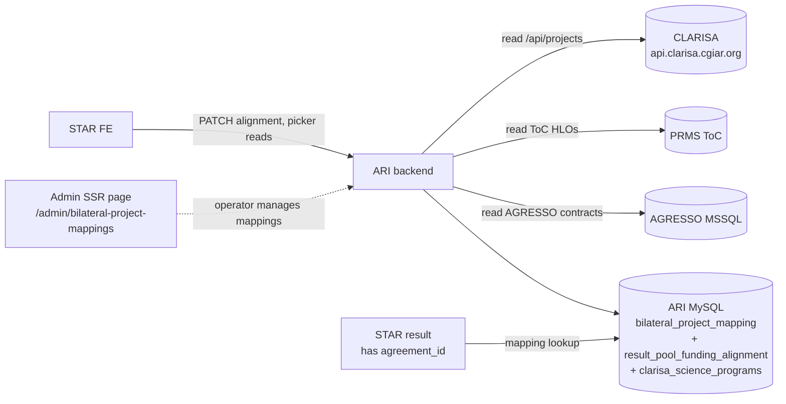

# Requirements — Bilateral / Pending items (v2: CLARISA-source SPs + admin-owned project mapping)

- **Module:** bilateral
- **Spec id:** 2026-05-bilateral-pending-items
- **Status:** draft v2
- **Owner:** ARI backend team
- **Linked PRD section:** [`../../../prd.md`](../../../prd.md) — bilateral / pool-funding scope
- **Linked tickets:** AC-1594
- **Last updated:** 2026-05-25
- **Extends:** [`../requirements.md`](../requirements.md) (R-BIL-001..069). Adds R-BIL-070, R-BIL-071, R-BIL-073..080 + NFR-BIL-070..072, MODIFIES R-BIL-015 / R-BIL-034 (read-only gate), and supersedes (removes) v1 R-BIL-072.
- **Input proposal:** [`./proposal.md`](./proposal.md) v2 (consolidated 2026-05-25, commit `a8d58256`).
- **Supersedes prior generated trio:** the 2026-05-24 generation (`a9a0b7c7`) — this version supersedes it entirely.

---

## 1. Context

The bilateral module landed Phase 0–2 (AGRESSO tag, alignment + indicator mapping). The 2026-05-23 SP catalog wave (commit `5d48b27b`) seeded a static `clarisa_science_programs` table with all 13 SPs and made the STAR picker source it directly.

Two PO clarifications (2026-05-25) changed the architecture:

1. **SP-per-project linkage is owned by CLARISA `/api/projects`**, not by us. Each project carries a `project_mappings_array[]` listing its allocated SPs.
2. **HLOs/indicators are owned by PRMS ToC.** Given a list of SP codes, a PRMS ToC endpoint returns the HLOs/indicators.
3. **The join from AGRESSO contract → CLARISA project is owned by ARI** through a new admin-maintained table (CLARISA does not expose AGRESSO `agreement_id` as a join key).

This spec captures the work to:

- Make the SP picker source the CLARISA per-project list (filtered by the result's mapped bilateral project).
- Make the HLO/indicator panel proxy PRMS ToC.
- Add a new admin SSR module to maintain the AGRESSO ↔ CLARISA project mapping.
- Land Phase 1.5 cleanups already inherited from v1 (catalog-aware validation, source-based read-only gate, column rename, operational rollout, sibling specs, doc updates, Phase 3+ re-pricing).
- Reclassify the local `clarisa_science_programs` table as **display-only fallback** (icons / colors / names).

Not changing: existing alignment / mapping / contribution endpoints, AGRESSO tag endpoint, Phase 3 push design, Phase 4 W3 sync design, original `tasks.md` Phase 0–2 entries, R-BIL-001..069.

---

## 2. Executive summary

| What | Why | How |
| --- | --- | --- |
| New `bilateral_project_mapping` table | We need a join from AGRESSO contract → CLARISA bilateral project; no upstream exposes this. | New table, soft-delete history, `source` column forward-compatible with future AI suggestions. |
| New admin SSR page `/admin/bilateral-project-mappings` | Operators need a surface to maintain mappings manually. | List / search / create / edit / deactivate; React 19 + SSR per existing admin panel patterns. |
| New endpoint `GET .../bilateral/science-programs` | STAR picker must show only the SPs CLARISA links to this result's project. | Resolves result → mapping → CLARISA project → mapping array; enriches via local catalog for display fields. |
| New endpoint `GET .../bilateral/hlos-indicators` | STAR "Map HLOs/indicators" panel needs upstream truth. | Proxies PRMS ToC; cached short-TTL. |
| Catalog-aware PATCH validation | Today, any string `sp_code` persists. | Reject unknown codes (not in PRMS's per-project SP list) with structured 400. |
| Source-based read-only gate | PRMS-sourced results must be read-only in STAR. | Server-side gate runs before role/owner checks; surfaces in `is_read_only`. |
| `lever_code` → `sp_code` rename | Misleading legacy name on `result_pool_funding_alignment_sp`. | Pure rename migration; data preserved. |
| `icon_key` column on `clarisa_science_programs` | FE needs a stable key for bundled SP icons. | Nullable VARCHAR seeded `= official_code`. |
| Operational rollout of all migrations to dev/staging/prod | Today only local has the seed migration applied. | Sequenced rollout per environment. |

---

## 3. Glossary

| Term | Definition |
| --- | --- |
| **AGRESSO contract** | Funding contract record from AGRESSO. Identified by `agreement_id` (e.g. `D527`). Carries `funding_type` (`BLR` = bilateral, `POL` = pooled). |
| **CLARISA project** | CGIAR portfolio record from CLARISA `/api/projects`. Identified by `id` (integer, e.g. `1`). Carries `project_mappings_array[]` with SP linkages and `source_of_funding` (e.g. `"Bilateral"`). |
| **bilateral project mapping** | A row in our new `bilateral_project_mapping` table that joins one AGRESSO `agreement_id` to one CLARISA `project.id`. Maintained by admins via the new SSR page. |
| **mapping_status** | Response field on the per-result SP endpoint. Values: `"mapped"` (mapping exists and is active), `"unmapped"` (no active mapping found). |
| **Science Program (SP)** | CGIAR portfolio top-level entity. Codes `SP01..SP13`. Catalog metadata in CLARISA cgiar-entities and on each CLARISA project's mapping array. |
| **HLO** | High-Level Output. PRMS ToC concept linked to one or more SPs. Source: PRMS ToC endpoint (URL TBC — OQ-RV-2). |
| **PRMS ToC** | PRMS Theory-of-Change endpoint that, given SP codes, returns the HLOs/indicators those SPs encompass. |
| **portfolio** | CGIAR portfolio cycle. Active value is `"P25"` (CGIAR portfolio 2025-2030). |
| **source-based read-only gate** | The rule that any STAR result with `platform_code === 'PRMS'` is read-only on bilateral surfaces, regardless of role or sync state. |
| **AI_SUGGESTED / AI_AUTO** | Forward-compatible `source` values on the mapping table for a future wave that adds AI-assisted mapping suggestions (T-15.16, deferred). |

---

## 4. System context & scope

In scope: bilateral module backend, admin SSR module, two CLARISA + PRMS ToC integration tool services, schema changes, doc updates.

Out of scope: indicators-per-SP sync replacement of T-31 beyond proxy semantics; Phase 3 push (T-21..T-28 blocked externally); Phase 4 W3 sync (T-22 blocked); AI suggestion implementation (forward-compatible schema only).

---

## 5. Stakeholders / personas

| Persona | Interest |
| --- | --- |
| Bilateral contributor (STAR FE user) | Edits the alignment + HLO/indicator picker on a bilateral result. Wants only the SPs that apply to their project, not all 13. |
| Bilateral operator (new persona) | `CENTER_ADMIN` user who maintains the AGRESSO ↔ CLARISA project mappings via the new admin SSR page. |
| MEL PO | Owns business rules: which `status` values count as valid SPs in the picker, multi-contract union/intersect, deactivation semantics. |
| PRMS team | Owns the ToC HLO endpoint (URL/auth/payload pending OQ-RV-2). |
| CLARISA team | Owns `/api/projects` (live read source). No upstream join field required. |
| ARI backend team | Implements; owns the join-table data model and admin surface. |
| DevOps | Sequences migrations to dev/staging/prod (R-BIL-075). |

---

## 6. Requirement numbering

Continues the parent spec's `R-BIL-<NNN>` sequence starting at 070. NFRs use `NFR-BIL-<NNN>` starting at 070. Phase 1.5 task IDs use the `.N` decimal suffix (`T-15.N`) to mark them as Phase 1.5 deltas inside the parent `tasks.md` taxonomy.

---

## 7. Functional requirements

### R-BIL-070 — Validate `sp_codes` against the per-result SP list

The system SHALL reject PATCH alignment requests whose `sp_codes` contain any code not present in the per-result SP list returned by R-BIL-076.

- **As a** STAR bilateral contributor
- **I want** the backend to reject codes the result's bilateral project does not participate in
- **So that** typos, stale FE bundles, and wrong-project picks cannot persist

**Details:**
- Inputs: `UpdatePoolFundingAlignmentDto.sp_codes: string[]` (preferred) or `.lever_codes: string[]` (deprecated back-compat) on `PATCH /api/v1/results/:resultCode/pool-funding-alignment`.
- Behavior:
  - Normalize input (trim, dedupe, drop blanks).
  - When `has_contribution === true` and the resulting list is non-empty, fetch the per-result SP list via the same path R-BIL-076 uses (mapping → CLARISA project → mapping array).
  - If any code is not in that list, throw `BadRequestException` with `errors` payload `{ unknown_sp_codes: string[] }`.
  - When `has_contribution === false`, skip validation (codes are dropped per existing R-BIL-014 behavior).
- Outputs: unchanged on success (existing `AlignmentResponse`).
- Errors: `400` (validation), `409` (R-BIL-071), `403` (existing ownership / role), `200` `mapping_status: "unmapped"` if R-BIL-076 returns unmapped (in which case any non-empty `sp_codes` rejects with 400 because the list is empty).
- Permissions: same matrix as R-BIL-013 / R-BIL-014.

#### Scenario: Code is in the per-result list

- GIVEN result `19792` is mapped (via `bilateral_project_mapping`) to CLARISA project `1` whose `project_mappings_array[]` includes `SP09` and `SP10` (both `status="Confirmed"`, portfolio `P25`)
- WHEN the contributor PATCHes `{has_contribution: true, sp_codes: ["SP09"]}`
- THEN response is `200` and the alignment row persists with `sp_code = "SP09"`
- AND `selected_science_programs[]` in the response contains the `SP09` entry enriched from `clarisa_science_programs`

#### Scenario: Code is not in the per-result list

- GIVEN the same mapping as above (`SP09`, `SP10` are valid)
- WHEN the contributor PATCHes `{has_contribution: true, sp_codes: ["SP09","SP99"]}`
- THEN response is `400`
- AND `description = "Unknown Science Program codes"`
- AND `errors = { unknown_sp_codes: ["SP99"] }`
- AND no row is persisted

#### Scenario: Has contribution false

- GIVEN any mapping state
- WHEN the contributor PATCHes `{has_contribution: false, sp_codes: ["SP99"]}`
- THEN response is `200`, validation is skipped, and existing alignment rows are deactivated per R-BIL-014

#### Scenario: Result is unmapped

- GIVEN result `42` has no active row in `bilateral_project_mapping` for its AGRESSO `agreement_id`
- WHEN the contributor PATCHes `{has_contribution: true, sp_codes: ["SP01"]}`
- THEN response is `400` with `errors = { unknown_sp_codes: ["SP01"] }` (empty per-result list rejects everything)

**Out of scope (for this requirement):**
- Validating against PRMS `reporting_enabled` flag (PRMS no longer owned in our model).
- Caching the per-result list — validation re-reads via R-BIL-076 path (which has its own 5-min cache per upstream).

---

### R-BIL-071 — Source-based read-only gate

The system SHALL treat any STAR result with `platform_code === 'PRMS'` as read-only on all bilateral surfaces, regardless of role or PRMS-sync state.

- **As a** STAR bilateral contributor viewing a PRMS-sourced result
- **I want** the bilateral alignment + mapping endpoints to return read-only and reject mutations
- **So that** PRMS remains the source of truth for results it owns

**Details:**
- Inputs: existing alignment + mapping endpoints, all verbs.
- Behavior:
  - Read endpoints set `is_read_only = (platform_code === 'PRMS') || is_synced_to_prms`.
  - Write endpoints (`PATCH .../pool-funding-alignment`, contribution POST/PATCH/DELETE) — return `409 Conflict` with `description = "Result is PRMS-sourced; bilateral alignment is read-only in STAR"` when `platform_code === 'PRMS'`.
  - Existing `is_synced_to_prms`-based gate (R-BIL-015 / R-BIL-034) continues to fire for STAR-sourced results that were already pushed.
- Outputs: existing `AlignmentResponse.is_read_only` carries the union of both gates.
- Errors: `409` with the new description on writes; reads unchanged.
- Permissions: gate runs BEFORE role/ownership checks; even `SYSTEM_ADMIN` receives `409`.

#### Scenario: PRMS-sourced result reads as read-only

- GIVEN result `28735` has `platform_code = 'PRMS'` and `is_synced_to_prms = false`
- WHEN any user `GET`s `/api/v1/results/28735/pool-funding-alignment`
- THEN response is `200` with `is_read_only: true`

#### Scenario: PRMS-sourced result rejects writes for SYSTEM_ADMIN

- GIVEN the same result and a `SYSTEM_ADMIN` user
- WHEN the user `PATCH`es the alignment
- THEN response is `409` with description = `"Result is PRMS-sourced; bilateral alignment is read-only in STAR"`

#### Scenario: STAR-sourced + synced result still hits the original gate

- GIVEN result `19792` has `platform_code = 'STAR'` and `is_synced_to_prms = true`
- WHEN the contributor `PATCH`es the alignment
- THEN response is `409` with the existing R-BIL-015 description (regression check)

#### Scenario: STAR-sourced, non-synced result writes succeed

- GIVEN result `19792` has `platform_code = 'STAR'` and `is_synced_to_prms = false`
- WHEN a permitted contributor `PATCH`es the alignment
- THEN response is `200`

**Out of scope:**
- Re-architecting the bilateral surface as a separate read-only adapter.

---

### R-BIL-073 — Rename `result_pool_funding_alignment_sp.lever_code` → `sp_code`

The system SHALL rename the misleading column without altering data.

- **As a** future maintainer
- **I want** the column name to reflect its actual content
- **So that** queries and joins are not misled by a legacy name

**Details:**
- New migration runs `ALTER TABLE result_pool_funding_alignment_sp CHANGE COLUMN lever_code sp_code VARCHAR(50) NOT NULL`.
- Index rename: `idx_result_pool_funding_alignment_sp_lever` → `idx_result_pool_funding_alignment_sp_sp`.
- Entity, repository, and service references updated.
- API contract unchanged (`selected_levers[].lever_code` still populated from the renamed column for back-compat).

#### Scenario: Migration applies forward

- GIVEN the table contains N rows with `lever_code` values
- WHEN the migration runs
- THEN the table contains N rows with the same values under `sp_code` and no rows lost

#### Scenario: Migration reverts cleanly

- GIVEN the forward migration has run
- WHEN `npm run migration:revert` runs
- THEN the column name returns to `lever_code` with all N rows intact

#### Scenario: API contract preserved

- GIVEN the migration has applied
- WHEN a client `GET`s `/api/v1/results/19792/pool-funding-alignment`
- THEN `selected_levers[]` is still populated from the renamed column, with no shape change

**Out of scope:**
- Renaming the deprecated `UpdatePoolFundingAlignmentDto.lever_codes` field (kept for FE back-compat).

---

### R-BIL-074 — Extend `clarisa_science_programs` with `icon_key`

The system SHALL add a stable per-SP key the FE uses to resolve bundled icons.

- **As a** STAR FE engineer
- **I want** a stable lookup key on the catalog
- **So that** the FE can bundle SP icons by a key decoupled from `official_code` if branding ever splits

**Details:**
- New migration adds one nullable column: `icon_key VARCHAR(64) NULL`.
- Seed in same migration: `UPDATE clarisa_science_programs SET icon_key = official_code WHERE icon_key IS NULL`.
- `ClarisaScienceProgram` entity exposes the property.
- `selected_science_programs[]` response shape gains optional `icon_key?: string | null`.
- The `clarisa_science_programs` table is RECLASSIFIED as a display-only fallback in this spec. It is no longer the picker source.

#### Scenario: Migration seeds icon_key

- GIVEN the catalog has the 13 seeded SPs
- WHEN the migration runs
- THEN all 13 rows have `icon_key = official_code` (e.g. row SP01 has `icon_key = "SP01"`)

#### Scenario: Response carries icon_key

- GIVEN result `19792` has a populated alignment with SP01
- WHEN a client `GET`s the alignment
- THEN each `selected_science_programs[]` entry includes `icon_key`

**Out of scope (vs v1 R-BIL-074):**
- `reporting_enabled` and `prms_id` columns — dropped from this spec. PRMS is no longer mirrored.

---

### R-BIL-075 — Operational rollout to dev / staging / production

The system SHALL apply all bilateral migrations to dev, then staging, then production, with smoke verification on each environment.

- **As a** platform operator
- **I want** the migrations applied in order
- **So that** the bilateral endpoints stop returning 500 in any environment

**Details:**
- Migrations land in order: `1779190000010` (catalog seed) → `<R-BIL-073 rename>` → `<R-BIL-074 icon_key>` → `<R-BIL-079 mapping table>`.
- Each environment is verified by:
  - `GET /api/tools/clarisa/science-programs` returns `200` with 13 rows.
  - `GET /api/v2/results` returns `200` (DI graph sanity).

#### Scenario: Dev smoke

- GIVEN all migrations applied on dev
- WHEN a smoke test hits `/api/tools/clarisa/science-programs`
- THEN response is `200` with 13 entries

#### Scenario: Same on staging and production

- GIVEN all migrations applied on the env
- WHEN smoke test hits the catalog endpoint
- THEN response is `200` with 13 entries

**Out of scope:**
- Enabling any periodic sync (none in v2).

---

### R-BIL-076 — `GET /api/v1/results/:resultCode/bilateral/science-programs`

The system SHALL return the SPs CLARISA associates with the result's mapped bilateral project, enriched with display fields from the local catalog.

- **As a** STAR FE engineer rendering the SP picker
- **I want** the picker source filtered to the result's actual bilateral project
- **So that** users see only the SPs that apply, not all 13

**Details:**
- Lookup chain:
  1. Resolve result → AGRESSO `agreement_id` (via existing `ResultRepository.findPoolFundingAlignmentContext`).
  2. Look up active `bilateral_project_mapping` row.
  3. If no active row → return `200` with `{ science_programs: [], mapping_status: "unmapped", clarisa_project: null }`.
  4. If active row → fetch CLARISA project (cached) → filter `project_mappings_array[]` to `status="Confirmed"` AND `portfolio_object.acronym === activePortfolio` (default `"P25"`, env-driven).
  5. Map each entry to `{ code, name, category, color, icon_key, allocation }` — codes + name + category from CLARISA, display fields from `clarisa_science_programs` (joined by `official_code`).
- Returns `200` always (unmapped is a valid state, not an error).
- `clarisa_project` field on response carries `{ id, short_name }` for FE display when mapped.
- Roles: same as alignment GET (any authenticated user).

#### Scenario: Mapped result returns its SPs

- GIVEN result `19792` has AGRESSO contract `D527` mapped to CLARISA project `1` (which has SP09 25% and SP10 75% confirmed in P25)
- WHEN a contributor `GET`s `/api/v1/results/19792/bilateral/science-programs`
- THEN response is `200`
- AND `mapping_status === "mapped"`
- AND `science_programs[]` contains 2 entries: SP09 and SP10 with `allocation` 25 and 75

#### Scenario: Unmapped result returns empty

- GIVEN result `42` has no active mapping
- WHEN any user `GET`s the endpoint
- THEN response is `200` with `science_programs: []` and `mapping_status: "unmapped"`

#### Scenario: Multi-portfolio project filters to active portfolio

- GIVEN the mapped project has mappings to both P22 and P25
- WHEN the endpoint runs with `activePortfolio = "P25"`
- THEN only the P25 mappings are returned

#### Scenario: Non-Confirmed mappings are excluded

- GIVEN the mapped project has a SP09 mapping with `status = "Pending"`
- WHEN the endpoint runs
- THEN SP09 is NOT in the response (only `status = "Confirmed"` rows are returned)

**Out of scope:**
- Caching the response in our DB (the upstream CLARISA fetch is cached in-memory by the tool service).

---

### R-BIL-077 — `GET /api/v1/results/:resultCode/bilateral/hlos-indicators?sp_codes=...`

The system SHALL return the HLOs/indicators PRMS ToC exposes for the given SP codes.

- **As a** STAR FE engineer rendering the "Map HLOs and/or indicators" panel
- **I want** the HLOs/indicators that the chosen SPs encompass
- **So that** users can map their result to the right HLO without hitting an empty list

**Details:**
- Query param `sp_codes`: comma-separated list of SP codes the user has selected.
- Lookup chain: resolve result → R-BIL-071 read-only gate (just for header consistency; this endpoint is read-only anyway) → call `PrmsTocService.listHlosBySps(sp_codes)` (cached) → return grouped by SP.
- Response shape: `{ sp_code, sp_name, hlos: [{ id, code, title, indicators: [{ id, code, name, ... }] }] }[]`.
- **Endpoint URL / auth / payload pending OQ-RV-2.** Until OQ-RV-2 closes, the implementation returns `503` with `description = "PRMS ToC integration not yet configured"`.
- Roles: same as alignment GET.

#### Scenario: SP codes return HLOs/indicators

- GIVEN PRMS ToC exposes HLO `HLO-1` (with 2 indicators) under SP09 and HLO `HLO-2` (with 1 indicator) under SP10
- WHEN the user `GET`s `/api/v1/results/19792/bilateral/hlos-indicators?sp_codes=SP09,SP10`
- THEN response is `200`
- AND the body groups: `[ { sp_code: "SP09", hlos: [HLO-1 with 2 indicators] }, { sp_code: "SP10", hlos: [HLO-2 with 1 indicator] } ]`

#### Scenario: Empty sp_codes returns empty

- GIVEN any result
- WHEN `sp_codes` is omitted or empty
- THEN response is `200` with `[]`

#### Scenario: PRMS ToC unreachable

- GIVEN PRMS ToC is down and the cache is cold
- WHEN the endpoint is called
- THEN response is `503` with `description = "PRMS ToC temporarily unreachable"`

#### Scenario: Endpoint not yet configured (interim)

- GIVEN OQ-RV-2 is still open and PRMS ToC client is not wired
- WHEN the endpoint is called
- THEN response is `503` with `description = "PRMS ToC integration not yet configured"`

**Out of scope:**
- Caching response in our DB.
- Multi-portfolio HLO filtering — defer to OQ-RV-2 conversation with PRMS.

---

### R-BIL-078 — Result→project resolution via mapping table

The system SHALL resolve a STAR result to a CLARISA project via the active row in `bilateral_project_mapping` for the result's AGRESSO `agreement_id`.

- **As a** caller of R-BIL-076 / R-BIL-070
- **I want** a deterministic, auditable resolution path
- **So that** the SP picker and validator agree on which project's SPs apply

**Details:**
- Chain: `result_id → result.agresso_agreement_id → bilateral_project_mapping (is_active=true) → clarisa_project_id`.
- When multiple active rows exist for an `agreement_id`: this is a data integrity violation (partial-unique index in R-BIL-079 prevents it). The lookup helper SHALL return the most recent row and log a warning so ops can correct.
- When zero active rows: lookup returns `null`, callers handle the "unmapped" branch.

#### Scenario: Single active mapping

- GIVEN `bilateral_project_mapping` has exactly one active row for `agreement_id = "D527"`
- WHEN the lookup helper runs
- THEN it returns that row's `clarisa_project_id`

#### Scenario: No active mapping

- GIVEN no active row for `agreement_id = "ZZZ999"`
- WHEN the helper runs
- THEN it returns `null` (callers translate this to the "unmapped" path)

#### Scenario: Inactive history is ignored

- GIVEN `agreement_id = "D527"` has two rows — one `is_active=false` and one `is_active=true`
- WHEN the helper runs
- THEN only the active row is returned; the deactivated one stays in the table for audit

**Out of scope:**
- Multi-contract results — addressed via OQ-RV-3.

---

### R-BIL-079 — `bilateral_project_mapping` table data model

The system SHALL persist the AGRESSO ↔ CLARISA project join in a new auditable table.

- **As an** ARI platform owner
- **I want** the join stored, audited, and history-preserving
- **So that** operator changes are traceable and consistent across our APIs

**Details:**
- Table: `bilateral_project_mapping`.
- Columns:
  - `id` BIGINT PK auto-increment.
  - `agresso_agreement_id` VARCHAR(50) NOT NULL — FK-by-value to `agresso_contract.agreement_id`.
  - `clarisa_project_id` INT NOT NULL — upstream CLARISA `project.id`.
  - `clarisa_project_short_name` VARCHAR(500) NULL — denormalized for display + audit.
  - `source` ENUM(`'MANUAL'`, `'AI_SUGGESTED'`, `'AI_AUTO'`) NOT NULL DEFAULT `'MANUAL'`.
  - `confidence_score` FLOAT NULL — populated only when `source != 'MANUAL'`.
  - `notes` TEXT NULL — operator-facing free text.
  - `is_active` BOOLEAN NOT NULL DEFAULT TRUE.
  - All `AuditableEntity` fields (`created_by`, `created_date`, `updated_by`, `updated_date`, `deleted_at`).
- Indexes:
  - `idx_bpm_agreement` on `(agresso_agreement_id)`.
  - `idx_bpm_clarisa_project` on `(clarisa_project_id)`.
  - **Partial-unique** on `(agresso_agreement_id) WHERE is_active = true` — at most one active mapping per contract.

#### Scenario: Two active rows for the same contract are rejected

- GIVEN `bilateral_project_mapping` has one active row for `agreement_id = "D527"`
- WHEN an insert attempts a second active row with the same `agreement_id`
- THEN the database rejects the insert (partial-unique index violation)

#### Scenario: Soft-delete preserves history

- GIVEN `bilateral_project_mapping` has one active row for `agreement_id = "D527"`
- WHEN an operator deactivates it (sets `is_active = false`)
- THEN the row is preserved with `is_active = false`, `updated_by = operator_id`, `updated_date = now()`
- AND a new active mapping for the same contract can be created without conflict

**Out of scope:**
- A hard-delete endpoint — soft-delete only.

---

### R-BIL-080 — Admin SSR page + REST surface for `bilateral_project_mapping`

The system SHALL expose an admin SSR page and REST surface for operators to maintain mappings manually.

- **As a** bilateral operator (`CENTER_ADMIN` / `SYSTEM_ADMIN`)
- **I want** a list/search/create/edit/deactivate UI
- **So that** I can wire AGRESSO bilateral contracts to their CLARISA bilateral projects without engineering involvement

**Details:**
- SSR page: `/admin/bilateral-project-mappings` per `src/admin/README-REACT.md` conventions.
- REST surface: `/api/bilateral-project-mappings` (list paginated, create, update, deactivate).
- **Pivot Record #1 (2026-05-26):** REST surface is intentionally NOT under `/api/admin/...`. The existing JWT middleware exclude `/admin(.*)` (in `src/app.module.ts`, crafted to skip JWT for the SSR admin pages at `/api/admin/...`) would otherwise bypass auth on these endpoints. Access is enforced server-side by `@Roles(CENTER_ADMIN, SYSTEM_ADMIN)`; URL design is incidental. See `./execution.md` Pivot Record #1.
- Pickers on the create/edit form:
  - **CLARISA project picker** — populated from cached CLARISA `/api/projects` (filtered by `source_of_funding = "Bilateral"`).
  - **AGRESSO contract picker** — populated from existing `AgressoContractService` filtered to `funding_type IN ('BLR', 'BILATERAL')`.
- All writes audited via `AuditableEntity`.
- Soft-deactivate via `PATCH .../bilateral-project-mappings/:id/deactivate`.
- Roles: `@Roles(CENTER_ADMIN, SYSTEM_ADMIN)`.

#### Scenario: Operator creates a mapping

- GIVEN a `CENTER_ADMIN` is on the admin page
- WHEN they pick AGRESSO `D527` + CLARISA project `1` and submit
- THEN a new row is inserted with `source = 'MANUAL'`, `is_active = true`, `created_by = operator_id`
- AND the list refreshes to show the new mapping

#### Scenario: Operator deactivates a mapping

- GIVEN an active mapping exists for `D527`
- WHEN the operator clicks "Deactivate" on the row
- THEN the row's `is_active` becomes `false`, `updated_by = operator_id`
- AND the list re-renders with the row marked Deactivated
- AND the per-result SP endpoint for any result with `agreement_id = D527` now returns `mapping_status: "unmapped"`

#### Scenario: Operator without role is denied

- GIVEN a user with role `CONTRIBUTOR` only
- WHEN they hit `/api/bilateral-project-mappings`
- THEN response is `403 Forbidden`

#### Scenario: Partial-unique conflict on create

- GIVEN an active mapping already exists for `D527`
- WHEN an operator submits a new mapping for the same `D527` without first deactivating the old one
- THEN the API returns `409 Conflict` with `description = "Active mapping already exists for this contract"`
- AND the row is not inserted

**Out of scope:**
- Bulk CSV import — OQ-RV-7, separate follow-up.
- AI suggestions — T-15.16 deferred.

---

## 8. Non-functional requirements

### NFR-BIL-070 — Spec coverage

- **Category:** dx / quality
- **Target:** sibling `*.spec.ts` files exist for every controller / service / guard / repository touched in this spec. Project coverage stays ≥ 60% per `src/CLAUDE.md` §9; bilateral module ≥ 70%.
- **How verified:** `npm run test:cov` in CI.

### NFR-BIL-071 — Doc alignment

- **Category:** dx
- **Target:** `bilateral-module/design.md` carries §3.6 (CLARISA-source SPs + admin mapping) + §3.7 (source-based read-only); `bilateral-module/frontend-handoff.md` §4.6 updated with new endpoints, `mapping_status: "unmapped"` semantics, and admin module pointer; `bilateral-module/tasks.md` lists the T-15.N task IDs from this spec.
- **How verified:** PR review checklist.

### NFR-BIL-072 — Rollout reliability

- **Category:** reliability
- **Target:** zero `500` errors on `/api/tools/clarisa/science-programs` and the new endpoints post-rollout; migration apply-time < 5 s on production.
- **How verified:** synthetic monitor + migration runtime logs.

### NFR-BIL-073 — Upstream resilience

- **Category:** reliability
- **Target:** R-BIL-076 + R-BIL-077 tolerate a single failed upstream call (CLARISA or PRMS ToC) using the 5-min in-memory cache; cold-cache failures return `503`, not `500`.
- **How verified:** e2e test simulating upstream timeout + LoggerUtil warning lines.

---

## 9. Data requirements

| Change | Entity | Migration |
| --- | --- | --- |
| Rename `lever_code` → `sp_code` on `result_pool_funding_alignment_sp` | `bilateral/entities/result-pool-funding-alignment-sp.entity.ts` | `<timestamp>-renameLeverCodeToSpCodeOnAlignmentSp.ts` |
| Add `icon_key` to `clarisa_science_programs`; seed `icon_key = official_code` | `clarisa/entities/clarisa-science-programs/entities/clarisa-science-program.entity.ts` | `<timestamp>-addIconKeyToScienceProgram.ts` |
| Create `bilateral_project_mapping` | new `bilateral/entities/bilateral-project-mapping.entity.ts` | `<timestamp>-createBilateralProjectMapping.ts` |

No OpenSearch decorations on new tables.

---

## 10. API surface delta

| Verb | Path | Auth | Notes |
| --- | --- | --- | --- |
| `GET` | `/api/v1/results/:resultCode/bilateral/science-programs` | ROAR JWT | NEW (R-BIL-076). |
| `GET` | `/api/v1/results/:resultCode/bilateral/hlos-indicators?sp_codes=...` | ROAR JWT | NEW (R-BIL-077). Returns 503 until OQ-RV-2 closes. |
| `GET` | `/api/bilateral-project-mappings?page=&limit=&search=&is_active=&source=` | `CENTER_ADMIN`, `SYSTEM_ADMIN` | NEW (R-BIL-080). |
| `POST` | `/api/bilateral-project-mappings` | `CENTER_ADMIN`, `SYSTEM_ADMIN` | NEW (R-BIL-080). 409 on partial-unique conflict. |
| `PATCH` | `/api/bilateral-project-mappings/:id` | `CENTER_ADMIN`, `SYSTEM_ADMIN` | NEW (R-BIL-080) — edit notes / clarisa_project_id / source. |
| `PATCH` | `/api/bilateral-project-mappings/:id/deactivate` | `CENTER_ADMIN`, `SYSTEM_ADMIN` | NEW (R-BIL-080) — soft-delete. |
| `PATCH` | `/api/v1/results/:resultCode/pool-funding-alignment` | per R-BIL-013 | MODIFIED — adds catalog-aware 400 (R-BIL-070) and source-based 409 (R-BIL-071). |
| `GET` | `/api/v1/results/:resultCode/pool-funding-alignment` | ROAR JWT | MODIFIED — `is_read_only` becomes union of synced + source gates; `selected_science_programs[]` gains `icon_key` + `allocation` (when from CLARISA path). |
| `GET` | `/api/tools/clarisa/science-programs[/<:code>]` | ROAR JWT | MODIFIED — adds `icon_key`. Marked **DEPRECATED** for picker use; remains live for fallback enrichment. |

No version bump (all additive).

---

## 11. Cross-system impact

- **CLARISA** — new live read source via `/api/projects` (already-authenticated client; no credential changes). 5-min in-memory cache.
- **PRMS ToC** — new live read source (URL pending OQ-RV-2). 5-min in-memory cache.
- **AGRESSO** — existing `AgressoContractService` reused (no integration change).
- **Socket.IO** — no new events. Existing `result.pool-funding-alignment.changed` continues to fire.
- **STAR (`client/`)** — coordination only: FE must switch picker source, handle `mapping_status: "unmapped"`, and wire the HLO panel to R-BIL-077. ARI does not change `client/`.
- **OpenSearch** — no changes.

---

## 12. Assumptions, dependencies, risks

| Item | Notes |
| --- | --- |
| **Assumption** | CLARISA `/api/projects` is reachable from ARI's deployed VPC (verified by 2026-05-25 probe). |
| **Assumption** | PRMS ToC endpoint exists and accepts SP codes as a query — confirmation pending OQ-RV-2. |
| **Assumption** | `agresso_contract.agreement_id` is the canonical key joining a STAR result to its AGRESSO contract (already wired). |
| **Dependency** | R-BIL-070 depends on R-BIL-076 (validation source). |
| **Dependency** | R-BIL-076 depends on R-BIL-078 / R-BIL-079 (mapping table) AND CLARISA-projects tool service. |
| **Dependency** | R-BIL-080 depends on R-BIL-079 (table) AND CLARISA-projects tool service. |
| **Dependency** | R-BIL-077 depends on OQ-RV-2 closing. |
| **Risk** | CLARISA latency on picker open. Mitigation: 5-min in-memory cache; circuit-break after 3 failures. |
| **Risk** | Operator burden of 200+ manual mappings at launch. Mitigation: launch with one-by-one UI; track weekly; if friction high, accelerate AI assist (T-15.16) or CSV import. |
| **Risk** | Deactivating a mapping orphans persisted SPs on existing alignment rows. Resolution pending OQ-RV-9. Interim: leave persisted rows alone, mark them stale on the next read if catalog diverges. |

---

## 13. Open questions

| # | Question | Owner | Due | Blocks |
| --- | --- | --- | --- | --- |
| OQ-RV-2 | Confirm PRMS ToC endpoint URL/auth/payload for HLOs given SP codes. | PRMS team | 2026-06-05 | R-BIL-077 / T-15.12 |
| OQ-RV-3 | Multi-contract STAR result: UNION or INTERSECT SP sets? | MEL PO + STAR FE | 2026-06-15 | R-BIL-076 edge case |
| OQ-RV-4 | Filter on `status = "Confirmed"` only, or include `Pending` / `Draft`? | MEL PO | 2026-06-15 | R-BIL-076 filter |
| OQ-RV-5 | Active-portfolio filter behavior on multi-portfolio projects? | MEL PO | 2026-06-15 | R-BIL-076 filter |
| OQ-RV-6 | CLARISA `/api/projects` performance characteristics at production scale? | CLARISA team | 2026-06-30 | NFR-BIL-073 |
| OQ-RV-7 | Bulk CSV import in Phase 1 or 2? | MEL PO + ops | 2026-06-15 | T-15.15 scope |
| OQ-RV-8 | AI provider + workflow scoping. | ARI backend lead + PO | 2026-07-15 | T-15.16 (deferred) |
| OQ-RV-9 | Deactivation semantics for already-persisted alignment rows? | MEL PO + ARI backend | 2026-06-15 | R-BIL-080 + interim behavior |

---

## 14. Requirement ID index

| ID | Title | Status |
| --- | --- | --- |
| R-BIL-070 | Validate sp_codes against per-result SP list | MODIFIED (source) |
| R-BIL-071 | Source-based read-only gate | NEW |
| R-BIL-072 | ~~Two-upstream periodic sync~~ | **REMOVED** (v1 → v2) |
| R-BIL-073 | Column rename lever_code → sp_code | NEW |
| R-BIL-074 | Add icon_key to catalog | NEW (narrowed vs v1) |
| R-BIL-075 | Operational rollout | NEW |
| R-BIL-076 | Per-result SP endpoint | NEW |
| R-BIL-077 | Per-SP HLOs endpoint | NEW |
| R-BIL-078 | Result→project resolution | NEW |
| R-BIL-079 | bilateral_project_mapping data model | NEW |
| R-BIL-080 | Admin SSR + REST for mappings | NEW |
| NFR-BIL-070 | Spec coverage | NEW |
| NFR-BIL-071 | Doc alignment | NEW |
| NFR-BIL-072 | Rollout reliability | NEW |
| NFR-BIL-073 | Upstream resilience | NEW |

---

## 15. Sign-off

- [ ] Engineering lead — TBA
- [ ] MEL / product owner — TBA
- [ ] Security review (not required — no new auth surfaces beyond existing admin guard)
- [ ] DevOps (required for R-BIL-075 rollout) — TBA
