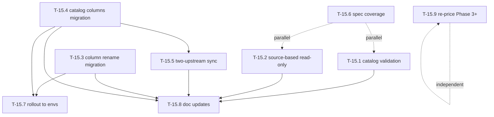

# Tasks — Bilateral / Pending items (Phase 1.5 + architectural deltas)

- **Module:** bilateral
- **Spec id:** 2026-05-bilateral-pending-items
- **Status:** not-started
- **Owner:** ARI backend team
- **Linked requirements:** [`./requirements.md`](./requirements.md)
- **Linked design:** [`./design.md`](./design.md)
- **Linked proposal:** [`./proposal.md`](./proposal.md)
- **Last updated:** 2026-05-24

---

## 1. Task numbering

Tasks are numbered `T-15.N` to mark them as Phase 1.5 — between the original Phase 0–2 (T-00..T-20 in the parent `../tasks.md`) and Phase 3+ (T-21..T-38). The `.N` suffix is intentional and preserves the parent task taxonomy.

| Task | Title | Maps to |
| --- | --- | --- |
| T-15.1 | Catalog validation on PATCH alignment | R-BIL-070 |
| T-15.2 | Source-based read-only gate (PRMS-sourced results) | R-BIL-071, modifies R-BIL-015 / R-BIL-034 |
| T-15.3 | Migration: rename `lever_code` → `sp_code` on alignment-SP table | R-BIL-073 |
| T-15.4 | Migration: extend catalog with `reporting_enabled` / `prms_id` / `icon_key` | R-BIL-074 |
| T-15.5 | Two-upstream periodic sync (CLARISA + PRMS Reporting) | R-BIL-072 |
| T-15.6 | Sibling `*.spec.ts` coverage for bilateral + SP catalog modules | NFR-BIL-070 |
| T-15.7 | Apply all migrations to dev / staging / production | R-BIL-075, NFR-BIL-072 |
| T-15.8 | Doc updates (parent `design.md`, `tasks.md`, `frontend-handoff.md`) | NFR-BIL-071 |
| T-15.9 | Re-price Phase 3+ tasks (T-21..T-38) and surface current blockers | (operational) |

---

## 2. Dependency graph

Solid arrows = hard dependency. Dotted arrows = parallelizable but should land in the same wave for review coherence.

---

## 3. Task list

### T-15.1 — Validate `sp_codes` against the SP catalog on PATCH alignment

- **Requirements covered:** R-BIL-070
- **Files touched (intended):**
  - `src/domain/entities/bilateral/bilateral.service.ts` — extend `normalizeLeverCodes` to perform catalog lookup and throw `BadRequestException` on unknown codes; replace the existing closure-based normalization with an async path so the catalog lookup can be awaited.
  - `src/domain/entities/bilateral/bilateral.service.spec.ts` — happy + denial cases.
- **Description:** Wire `ClarisaScienceProgramsService.findAll()` into `normalizeLeverCodes` once per PATCH request. Reject unknown codes with a structured 400 (`errors.unknown_sp_codes`). Skip the lookup when `has_contribution=false` (existing short-circuit preserved).
- **Implementation notes:**
  - `BilateralService` already injects `ClarisaScienceProgramsService` (commit `5d48b27b`); no module wiring change.
  - Fetch the catalog ONCE per request, build a `Set<string>` of `official_code`, do an O(N) filter for unknowns.
  - DO NOT cache the catalog at process scope — keeps invalidation trivial.
  - Validation accepts any catalog row regardless of `is_active` (per D-PI-6).
- **Acceptance / done check:**
  - [ ] `PATCH` with `sp_codes:["SP01","SP99"]` returns 400 with `errors = { unknown_sp_codes: ["SP99"] }`.
  - [ ] `PATCH` with `sp_codes:["SP01","SP06"]` returns 200 and persists exactly two rows.
  - [ ] `PATCH` with `has_contribution:false` and unknown codes returns 200 (validation skipped).
  - [ ] Spec asserts catalog is fetched exactly once per call.
- **Dependencies:** none (the SP catalog already exists post-`5d48b27b`).
- **Estimated effort:** S
- **Owner:** TBA
- **Status:** todo

---

### T-15.2 — Source-based read-only gate (PRMS-sourced results)

- **Requirements covered:** R-BIL-071 (modifies R-BIL-015 / R-BIL-034)
- **Files touched (intended):**
  - `src/domain/entities/bilateral/bilateral.service.ts` — extend `getAlignment` (compute `is_read_only` as union); add early-return 409 in `updateAlignment`, `upsertContribution`, `deleteContribution` when `context.platform_code === 'PRMS'`.
  - `src/domain/entities/bilateral/bilateral.service.spec.ts` — gate fires for `SYSTEM_ADMIN` on PRMS-sourced; STAR-sourced unaffected; STAR-sourced + synced still hits R-BIL-015 path (no regression).
  - `src/domain/entities/bilateral/dto/update-pool-funding-alignment.dto.ts` — update `AlignmentResponse.is_read_only` doc string to reflect the union semantic.
- **Description:** Gate runs server-side, before role/owner checks, on every bilateral mutation. Reads expose `is_read_only = isPrmsSourced || isSyncedToPrms`. Writes throw 409 with a distinct description so the FE / ops can disambiguate from the existing PRMS-synced gate.
- **Implementation notes:**
  - `ResultRepository.findPoolFundingAlignmentContext` already returns `platform_code`; reuse — do not add a new query.
  - The 409 description text MUST exactly match R-BIL-071 wording (FE may key off it).
  - For `SYSTEM_ADMIN`: gate still fires (architectural constraint, per D-PI-1).
- **Acceptance / done check:**
  - [ ] `GET` on PRMS-sourced → `is_read_only: true` even when `is_synced_to_prms: false`.
  - [ ] `PATCH` on PRMS-sourced as `SYSTEM_ADMIN` → 409 with the new description.
  - [ ] `PATCH` on STAR-sourced + synced → 409 with the existing R-BIL-015 description (no regression).
  - [ ] `PATCH` on STAR-sourced, non-synced → 200 (no false positive).
- **Dependencies:** none.
- **Estimated effort:** S
- **Owner:** TBA
- **Status:** todo

---

### T-15.3 — Migration: rename `lever_code` → `sp_code` on `result_pool_funding_alignment_sp`

- **Requirements covered:** R-BIL-073
- **Files touched (intended):**
  - `src/db/migrations/<timestamp>-renameLeverCodeToSpCodeOnAlignmentSp.ts` — `ALTER TABLE ... CHANGE COLUMN lever_code sp_code VARCHAR(50) NOT NULL` + `ALTER TABLE ... RENAME INDEX idx_result_pool_funding_alignment_sp_lever TO idx_result_pool_funding_alignment_sp_sp`. DOWN: inverse.
  - `src/domain/entities/bilateral/entities/result-pool-funding-alignment-sp.entity.ts` — rename `lever_code` property to `sp_code`; update `@Column({ name: 'sp_code' })` + `@Index('idx_result_pool_funding_alignment_sp_sp', ['sp_code'])`.
  - `src/domain/entities/bilateral/repositories/result-pool-funding-alignment.repository.ts` — references to the renamed column where `selected_levers` is hydrated (map `sp_code` to the `lever_code` field on the legacy `SelectedLeverResponse` for back-compat).
  - `src/domain/entities/bilateral/repositories/result-pool-funding-alignment-sp.repository.ts` — references update.
  - `src/domain/entities/bilateral/bilateral.service.ts` — update writes (`alignment_id`, `sp_code` instead of `lever_code`).
- **Description:** Pure rename — column name, index name, entity property name, all internal references. The deprecated `UpdatePoolFundingAlignmentDto.lever_codes` field stays put (FE back-compat). The `AlignmentResponse.selected_levers[].lever_code` field stays in the response shape.
- **Implementation notes:**
  - Data is preserved (codes are already SP codes).
  - Verify `grep -r "lever_code" src/domain/entities/bilateral/` returns only the deprecated DTO field after the change.
- **Acceptance / done check:**
  - [ ] Forward migration applies; row count unchanged.
  - [ ] `npm run migration:revert` runs cleanly.
  - [ ] `GET .../pool-funding-alignment` still returns populated `selected_levers[]` and `selected_science_programs[]`.
  - [ ] No production-code references to `lever_code` remain in `src/domain/entities/bilateral/` outside the deprecated DTO field.
- **Dependencies:** none (entity-level change only).
- **Estimated effort:** M
- **Owner:** TBA
- **Status:** todo

---

### T-15.4 — Migration: extend catalog with `reporting_enabled`, `prms_id`, `icon_key`

- **Requirements covered:** R-BIL-074
- **Files touched (intended):**
  - `src/db/migrations/<timestamp>-extendScienceProgramCatalogColumns.ts` — `ALTER TABLE clarisa_science_programs ADD COLUMN reporting_enabled BOOLEAN NULL, ADD COLUMN prms_id INT NULL, ADD COLUMN icon_key VARCHAR(64) NULL, ADD UNIQUE KEY uk_clarisa_sp_prms_id (prms_id)`. Seed: `UPDATE clarisa_science_programs SET icon_key = official_code WHERE icon_key IS NULL`. DOWN: inverse.
  - `src/domain/tools/clarisa/entities/clarisa-science-programs/entities/clarisa-science-program.entity.ts` — add three `@Column(..., { nullable: true })` properties.
  - `src/domain/tools/clarisa/entities/clarisa-science-programs/clarisa-science-programs.service.ts` — no change (service returns the full entity; new columns flow automatically).
  - `src/domain/entities/bilateral/dto/update-pool-funding-alignment.dto.ts` — `SelectedScienceProgramResponse` gains optional `reporting_enabled?: boolean | null` and `icon_key?: string | null` (NOT `prms_id` — internal-only).
  - `src/domain/entities/bilateral/bilateral.service.ts` — `toSelectedSciencePrograms` enriches the response with the two new FE-visible fields.
- **Description:** Pure schema-and-shape extension. All new columns nullable; first PRMS sync (T-15.5) will populate `reporting_enabled` and `prms_id`. `icon_key` is seeded equal to `official_code` and stays as a stable FE lookup key.
- **Implementation notes:**
  - Unique key on `prms_id` (nullable column tolerates multiple NULLs in MySQL — verify).
  - DO NOT expose `prms_id` on `AlignmentResponse.selected_science_programs[]` — internal only.
- **Acceptance / done check:**
  - [ ] Forward migration applies; the 13 seeded rows have `icon_key = official_code`, `reporting_enabled = NULL`, `prms_id = NULL`.
  - [ ] `GET /api/tools/clarisa/science-programs` returns the three new fields.
  - [ ] `GET .../pool-funding-alignment` response carries `reporting_enabled` + `icon_key` on each SP entry, but NOT `prms_id`.
  - [ ] Migration reverts cleanly.
- **Dependencies:** none (catalog already exists).
- **Estimated effort:** M
- **Owner:** TBA
- **Status:** todo

---

### T-15.5 — Two-upstream periodic sync (CLARISA + PRMS Reporting)

- **Requirements covered:** R-BIL-072
- **Files touched (intended):**
  - `src/domain/tools/clarisa/entities/clarisa-science-programs/clarisa-science-programs.sync.ts` — new service with `syncFromClarisa()` and `syncFromPrmsReporting()`. Reuses `clarisaHttp` (CLARISA leg) and a thin PRMS Reporting client (PRMS leg).
  - `src/domain/tools/cron-jobs/clarisa-science-programs.cron.ts` — new cron `@Cron('0 0 3 * * *')` (CLARISA leg).
  - `src/domain/tools/cron-jobs/prms-reporting-science-programs.cron.ts` — new cron `@Cron('0 15 3 * * *')` (PRMS leg).
  - `src/domain/tools/prms-reporting/prms-reporting.service.ts` — new thin HTTP wrapper (if no existing PRMS tool service exposes the reporting-initiatives endpoint; verify first and reuse).
  - `src/domain/shared/utils/env.utils.ts` — new getters `BILATERAL_SP_SYNC_ENABLED` (default false), `PRMS_REPORTING_PHASE_ID` (default `'6'`).
  - `src/domain/shared/utils/env.utils.spec.ts` — env getter tests.
  - `src/domain/tools/clarisa/entities/clarisa-science-programs/clarisa-science-programs.sync.spec.ts` — unit tests for both legs.
  - `src/db/config/mysql/orm.config.ts` — no change (entity glob already covers the catalog).
  - Bootstrap: in `clarisa-science-programs.module.ts`, register the sync service and the two crons; module stays singleton-scoped per parent design.md §3.4 Constraint A.
- **Description:** CLARISA leg owns existence + identity. PRMS leg enriches existing rows with PRMS-owned columns. Conflict policy per D-PI-2. Both legs write `sync_process_log` rows and respect the single feature flag.
- **Implementation notes:**
  - CLARISA filter: `cgiarEntityTypeDTO.name IN (...)` AND `official_code REGEXP '^SP[0-9]{2}$'`. Dedupe by code, latest `year` wins. TRIM `name`.
  - PRMS leg uses `updateIfExists` (NOT `upsert`) — D-PI-4.
  - Wrap writes per leg in `manager.transaction`.
  - Bootstrap on empty table: when `BILATERAL_SP_SYNC_ENABLED=true` AND `clarisa_science_programs` is empty at module init, fire CLARISA leg immediately, then PRMS leg.
  - LoggerUtil prefixes per design.md §9.
- **Acceptance / done check:**
  - [ ] CLARISA leg test with mocked HTTP: 13 SPs present post-run, name trimmed, dedupe applied.
  - [ ] PRMS leg test: existing rows enriched; unmatched PRMS codes (e.g. SGP-02) silently skipped.
  - [ ] Feature-flag-off test: neither leg runs, no `sync_process_log` row created.
  - [ ] Error-path test: CLARISA fetch throws → `sync_process_log.status = 'failed'`, existing rows untouched.
  - [ ] Integration: `npm run start:dev` with flag on shows both crons registered in logs.
- **Dependencies:** T-15.4 (the PRMS leg writes `reporting_enabled` / `prms_id` columns).
- **Estimated effort:** L
- **Owner:** TBA
- **Status:** todo

---

### T-15.6 — Sibling `*.spec.ts` coverage for bilateral + SP catalog modules

- **Requirements covered:** NFR-BIL-070
- **Files touched (intended):**
  - `src/domain/entities/bilateral/bilateral.service.spec.ts` — covers `getAlignment`, `updateAlignment`, `normalizeLeverCodes`, `toSelectedSciencePrograms`, `listIndicators`, `markIndicatorMappingsStale`, `upsertContribution`, `deleteContribution`, `reviewDecision`.
  - `src/domain/entities/bilateral/bilateral.controller.spec.ts` — covers all bilateral controller handlers; verifies guards + Swagger annotation presence.
  - `src/domain/tools/clarisa/entities/clarisa-science-programs/clarisa-science-programs.service.spec.ts` — covers `findAll` (active filter, ASC ordering) + `findByCode`.
  - `src/domain/tools/clarisa/entities/clarisa-science-programs/clarisa-science-programs.controller.spec.ts` — covers `findAll` (200) and `findByCode` (200 + 404 paths).
- **Description:** Backfill the sibling spec files that were deferred during the SP catalog wave. Per `src/CLAUDE.md` §9 every controller / service / guard touched must have a sibling spec. Coverage threshold is 60% project-wide; aim for 70% on this module.
- **Implementation notes:**
  - Mock `ClarisaScienceProgramsService` in `BilateralService` tests with `jest.fn()`-backed providers.
  - Mock `Repository<ClarisaScienceProgram>` with `jest.createMockFromModule` or hand-rolled stub.
  - Reuse `ResponseUtils.format` matchers patterns from existing controller specs (search the repo for one to copy).
- **Acceptance / done check:**
  - [ ] All four `*.spec.ts` files exist with non-zero passing tests.
  - [ ] `npm run test:cov` shows ≥ 70% line coverage on `src/domain/entities/bilateral/` + `src/domain/tools/clarisa/entities/clarisa-science-programs/`.
  - [ ] CI passes without per-module coverage threshold relaxation.
- **Dependencies:** ideally parallel with T-15.1 / T-15.2 to test new behavior in the same PR; otherwise can land independently.
- **Estimated effort:** M
- **Owner:** TBA
- **Status:** todo

---

### T-15.7 — Apply all migrations to dev / staging / production

- **Requirements covered:** R-BIL-075, NFR-BIL-072
- **Files touched (intended):**
  - none (operational task).
- **Description:** Apply migrations in order — `1779190000010` (seed, may already be on dev), `<T-15.3 rename>`, `<T-15.4 extend>` — to dev, then staging, then production. After each env, smoke-test `GET /api/tools/clarisa/science-programs` returns 200 with 13 rows.
- **Implementation notes:**
  - Use `npm run migration:execute` against the deployed `dist/`.
  - Run during a low-traffic window (off-peak per ops runbook).
  - Have rollback path ready: `npm run migration:revert` peels back one migration at a time.
- **Acceptance / done check:**
  - [ ] All three migrations applied on dev; smoke 200 + 13 rows.
  - [ ] Same on staging.
  - [ ] Same on production.
  - [ ] Post-rollout: a `result.pool-funding-alignment.changed` socket emission on each env succeeds (DI graph still resolves post-rename).
- **Dependencies:** T-15.3, T-15.4 (migrations must exist in `main` before they can be applied to envs).
- **Estimated effort:** S (per environment)
- **Owner:** TBA (DevOps)
- **Status:** todo

---

### T-15.8 — Doc updates (parent `design.md`, `tasks.md`, `frontend-handoff.md`)

- **Requirements covered:** NFR-BIL-071
- **Files touched (intended):**
  - `docs/specs/bilateral-module/design.md` — new §3.6 "Two-upstream sync model" and §3.7 "Source-based read-only gate", referencing this spec.
  - `docs/specs/bilateral-module/tasks.md` — add a §10 "Phase 1.5 deltas" pointing to this sub-spec and listing T-15.1..T-15.9 with status.
  - `docs/specs/bilateral-module/frontend-handoff.md` — §4.2 update for the new union semantic of `is_read_only`; §4.3 update for the new 400 validation behavior; §4.6 update with the new `reporting_enabled` / `icon_key` fields and the icon-bundle pattern (`/assets/result-framework-reporting/SPs-Icons/{official_code}.png`); §12 changelog entry.
- **Description:** Keep parent specs aligned with the code after Phase 1.5 lands. Doc/code drift is exactly what root `CLAUDE.md` §1 warns against — this task closes that loop.
- **Implementation notes:**
  - Land AFTER the code for T-15.1..T-15.5 is merged so doc references resolve to real behavior.
  - Cross-link this spec from each parent file's "Last updated" / changelog row.
- **Acceptance / done check:**
  - [ ] Parent `design.md` has §3.6 and §3.7 written and cross-linked.
  - [ ] Parent `tasks.md` has §10 cross-linking T-15.1..T-15.9 statuses.
  - [ ] `frontend-handoff.md` §4.2 / §4.3 / §4.6 + §12 reflect Phase 1.5 behavior.
  - [ ] All three parent docs link back to this spec's `requirements.md` + `design.md`.
- **Dependencies:** T-15.1, T-15.2, T-15.3, T-15.4, T-15.5 (code must land first so docs describe shipped behavior, not aspirational state).
- **Estimated effort:** S
- **Owner:** TBA
- **Status:** todo

---

### T-15.9 — Re-price Phase 3+ tasks (T-21..T-38) and surface current blockers

- **Requirements covered:** (operational, no R-ID — captures Phase 3+ status refresh)
- **Files touched (intended):**
  - `docs/specs/bilateral-module/tasks.md` — update the **Status** field on T-21..T-38 to reflect 2026-05 state; add a §11 "Re-price log" row dated today with each task's current status and current blocker (if any).
- **Description:** The parent `tasks.md` was last refreshed before the SP catalog wave. Walk the Phase 3–6 task list, confirm which tasks remain BLOCKED externally (T-21 D-push-auth, T-22 D-source-w3, T-23 OQ-US5-3/6), which can start once blockers close (T-24..T-28, T-29..T-30), and which are READY now (T-31..T-32 — note that catalog metadata is now seeded, so T-31 narrows to indicators-per-SP only).
- **Implementation notes:**
  - DO NOT change task IDs.
  - DO NOT rewrite task descriptions — just status + blocker columns + a §11 re-price log entry.
  - For T-31: add a note that catalog metadata sync is now covered by T-15.5 in this sub-spec, so T-31's scope is narrowed.
- **Acceptance / done check:**
  - [ ] Every T-21..T-38 in parent `tasks.md` has a current `Status` value.
  - [ ] §11 re-price log entry exists for 2026-05-24 with the per-task statuses.
  - [ ] T-31 description carries the "scope narrowed — catalog handled by Phase 1.5 T-15.5" note.
- **Dependencies:** none (independent doc task).
- **Estimated effort:** S
- **Owner:** TBA
- **Status:** todo

---

## 4. Standard task categories — coverage map

| Category | Covered by |
| --- | --- |
| Schema migrations | T-15.3, T-15.4 |
| Entity | T-15.3 (rename), T-15.4 (extend) |
| DTO | T-15.4 (response shape extension) |
| Repository | T-15.3 (references update) |
| Service | T-15.1, T-15.2, T-15.5 |
| Controller | T-15.6 (specs only; no controller-level changes) |
| Route registration | n/a (no new routes) |
| Guards / pipes / decorators | n/a (no new shared concerns) |
| Integration adjustments | T-15.5 (CLARISA + PRMS Reporting) |
| Cron | T-15.5 (two new crons) |
| Unit tests | T-15.1, T-15.2, T-15.5, T-15.6 |
| E2E tests | extends `test/bilateral.e2e-spec.ts` under T-15.1 + T-15.2 |
| Admin SSR | n/a |
| Docs | T-15.8 |
| Rollout | T-15.7 |

---

## 5. Testing expectations

- **T-15.1**: `bilateral.service.spec.ts` — happy, unknown-single, unknown-multi, mixed-known-unknown, `has_contribution=false` short-circuit.
- **T-15.2**: `bilateral.service.spec.ts` — STAR-source happy, PRMS-source 409, STAR-source + synced 409 (regression), SYSTEM_ADMIN on PRMS still 409.
- **T-15.3**: migration runs forward + revert; data row count preserved before/after.
- **T-15.4**: migration runs forward + revert; entity properties reflect new columns; response shape verified.
- **T-15.5**: `clarisa-science-programs.sync.spec.ts` — CLARISA leg (filter + dedupe + trim + transaction), PRMS leg (update-only, skip-unmatched, transaction), flag-off, error-path.
- **T-15.6**: all four `*.spec.ts` exist; project coverage ≥ 60%; bilateral module ≥ 70%.
- **E2E (`test/bilateral.e2e-spec.ts`)**: add 400-unknown-sp, 409-PRMS-source on PATCH and on contribution POST/DELETE.

Per parent guide: tests MUST cover both "allowed role" and "denied role" cases (T-15.2 PRMS-source acts as the architectural denial; existing role denial tests continue to apply to STAR-source).

A task is NOT done until:
- `npm run lint` passes.
- `npm test` passes locally.
- New / changed endpoints appear correctly in `/swagger`.
- Migrations apply forward AND revert cleanly.

---

## 6. Execution conventions

- One PR per task ideally (T-15.6 may bundle the four spec files into one PR for review coherence).
- PR title format: `<type>(bilateral): <subject>` matching the existing `feat(bilateral): T-15.N — <title>` pattern from Phase 0–2.
- Branch from `AC-1594-bilateral-module-v2` (the current integration branch); merge sequence is the spec landing order, not author convenience.
- Never edit a migration after merge; create a new migration to amend.
- Always include Swagger updates in the same PR as service-level behavior changes (T-15.1, T-15.2).

---

## 7. Risks & blockers log

| # | Date | Risk / Blocker | Mitigation | Owner | Status |
| --- | --- | --- | --- | --- | --- |
| RB-1 | 2026-05-24 | PRMS Reporting `:phaseId=6` is current cycle; mid-cycle rotation could silently misalign the PRMS leg. | Env-driven `PRMS_REPORTING_PHASE_ID`; runbook update under NFR-BIL-072. | ops | open |
| RB-2 | 2026-05-24 | CLARISA + PRMS may temporarily disagree (CLARISA adds SP14 before PRMS lists it). Catalog would have SP14 with `color=NULL`. | Acceptable. FE renders the color-circle fallback (per design.md D-PI-3 / icon strategy). | FE | open |
| RB-3 | 2026-05-24 | Renaming `lever_code` could surface hidden consumers (e.g. an ad-hoc reporting query). | Pre-merge grep across the repo + `git log -S lever_code` to check past migrations and external repos. | ARI backend | open |
| RB-4 | 2026-05-24 | OQ-PI-2 (hard-reject `is_active=false`) is open and could change T-15.1 behavior post-merge. | Default to D-PI-6 (accept any catalog row); if OQ-PI-2 closes the other way, a small follow-on PR adjusts validation. | ARI backend | open |
| RB-5 | 2026-05-24 | Operational rollout (T-15.7) on production requires DevOps coordination; off-peak window required. | Schedule in advance; backout path via `migration:revert` documented in NFR-BIL-072. | DevOps | open |

---

## 8. Done definition

The spec is complete when:
- [ ] All `T-15.N` tasks are `done`.
- [ ] All R-BIL-070..R-BIL-075 acceptance criteria are checked.
- [ ] NFR-BIL-070 / 071 / 072 verification passes.
- [ ] Coverage thresholds are still green (60% global, 70% bilateral floor).
- [ ] Swagger documents the new 400 / 409 codes on bilateral endpoints.
- [ ] Open questions OQ-PI-1..OQ-PI-4 are either resolved (moved to D-PI-N decisions in `design.md`) or carried forward as a new spec.
- [ ] Parent `bilateral-module/design.md`, `tasks.md`, `frontend-handoff.md` updated per T-15.8.
- [ ] Rollout completed on dev + staging + production per T-15.7; synthetic monitor green.
