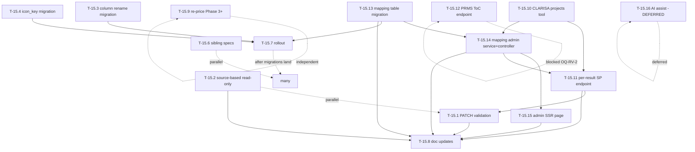

# Tasks — Bilateral / Pending items (v2: CLARISA-source SPs + admin-owned project mapping)

- **Module:** bilateral
- **Spec id:** 2026-05-bilateral-pending-items
- **Status:** not-started
- **Owner:** ARI backend team
- **Linked requirements:** [`./requirements.md`](./requirements.md)
- **Linked design:** [`./design.md`](./design.md)
- **Linked proposal:** [`./proposal.md`](./proposal.md) (v2 consolidated, commit `a8d58256`)
- **Last updated:** 2026-05-25

---

## 1. Task numbering

Tasks numbered `T-15.N` to mark them Phase 1.5 — between Phase 0–2 (T-00..T-20 in parent `../tasks.md`) and Phase 3+ (T-21..T-38). Higher numbers do not imply higher priority — see dependency graph in §2.

| Task | Title | Maps to | Status |
| --- | --- | --- | --- |
| T-15.1 | Catalog-aware validation on PATCH alignment | R-BIL-070 | [x] done (2026-05-26) |
| T-15.2 | Source-based read-only gate | R-BIL-071 (modifies R-BIL-015 / R-BIL-034) | todo |
| T-15.3 | Migration: rename `lever_code` → `sp_code` | R-BIL-073 | [x] done (2026-05-26) |
| T-15.4 | Migration: add `icon_key` to catalog | R-BIL-074 | [x] done (2026-05-26) |
| T-15.6 | Sibling `*.spec.ts` coverage | NFR-BIL-070 | todo |
| T-15.7 | Apply all migrations to dev / staging / production | R-BIL-075, NFR-BIL-072 | todo |
| T-15.8 | Doc updates (parent design, tasks, frontend-handoff) | NFR-BIL-071 | todo |
| T-15.9 | Re-price Phase 3+ tasks (T-21..T-38) | (operational) | todo |
| T-15.10 | `ClarisaProjectsService` tool + 5-min cache | R-BIL-076 (data source) | [x] done (2026-05-26) |
| T-15.11 | `GET .../pool-funding-alignment/science-programs` endpoint + service | R-BIL-076 + R-BIL-078 | [x] done (2026-05-26) |
| T-15.12 | `PrmsTocService` + `GET .../bilateral/hlos-indicators` endpoint | R-BIL-077 | blocked (OQ-RV-2) |
| T-15.13 | Migration + entity for `bilateral_project_mapping` | R-BIL-079 | [x] done (2026-05-25) |
| T-15.14 | `BilateralProjectMappingService` + controller + DTOs | R-BIL-080 (REST) + R-BIL-078 (lookup helper) | [x] done (2026-05-26) |
| T-15.15 | Admin SSR page `/admin/bilateral-project-mappings` + sidebar entry | R-BIL-080 (UI) | todo |
| T-15.16 | AI-assisted mapping suggestions | (forward-compat, deferred) | deferred |

T-15.5 (v1 periodic sync) DROPPED — see proposal §14 changelog.

---

## 2. Dependency graph

---

## 3. Task list

### T-15.1 — Catalog-aware validation on PATCH alignment

- **Requirements covered:** R-BIL-070
- **Files touched:**
  - `src/domain/entities/bilateral/bilateral.service.ts` — extend `normalizeLeverCodes` to async path, reuse `getScienceProgramsForResult` (T-15.11) to compute the catalog set, throw `BadRequestException` with `errors = { unknown_sp_codes }`.
  - `src/domain/entities/bilateral/bilateral.service.spec.ts` — add the 4 scenarios from R-BIL-070.
- **Description:** Replace the static-catalog lookup wired in `5d48b27b` with the per-result list from R-BIL-076. Skip validation when `has_contribution=false`. Validation reads the catalog once per request (no N+1).
- **Implementation notes:**
  - Reuses `BilateralService.getScienceProgramsForResult` — DO NOT re-implement the chain in the validator.
  - When the result is unmapped, the per-result list is `[]`; non-empty `sp_codes` therefore rejects with 400 (per R-BIL-070 scenario 4).
- **Acceptance / done check:**
  - [x] AC.1–AC.4 from R-BIL-070 pass.
  - [x] `npm test -- bilateral.service.spec` passes (focused spec `bilateral.service.normalizeLeverCodes.spec.ts`).
  - [x] Manual: PATCH with `sp_codes:["SP99"]` against a mapped result returns 400 with the structured `errors` payload.
- **Dependencies:** T-15.11 (the per-result SP endpoint must exist).
- **Estimated effort:** S
- **Owner:** ARI backend
- **Status:** [x] done (2026-05-26) — see [`./execution.md`](./execution.md) T-15.1 entry. 4 unit tests + live smoke against CSICAP 19792. Surfaces a pre-existing alignment-table partial-unique bug noted as separate follow-up.

---

### T-15.2 — Source-based read-only gate

- **Requirements covered:** R-BIL-071 (modifies R-BIL-015 / R-BIL-034)
- **Files touched:**
  - `src/domain/entities/bilateral/bilateral.service.ts` — `getAlignment` computes `is_read_only` as union; add private `assertPrmsSourceWritable(context)` helper called at the top of `updateAlignment`, `upsertContribution`, `deleteContribution`.
  - `src/domain/entities/bilateral/bilateral.service.spec.ts` — 4 scenarios from R-BIL-071.
  - `src/domain/entities/bilateral/dto/update-pool-funding-alignment.dto.ts` — update `AlignmentResponse.is_read_only` doc string.
- **Description:** Server-side architectural gate, runs BEFORE role/owner checks. PRMS-sourced results read as read-only; writes throw 409 with the new description even for `SYSTEM_ADMIN`. Existing R-BIL-015 synced gate continues to fire for STAR-sourced + synced.
- **Implementation notes:**
  - `ResultRepository.findPoolFundingAlignmentContext` already returns `platform_code`; reuse — do not add a new query.
  - The 409 description text MUST match R-BIL-071 wording exactly (FE may key off it).
- **Acceptance / done check:**
  - [ ] AC.1–AC.4 from R-BIL-071 pass.
  - [ ] `npm test -- bilateral.service.spec` passes.
  - [ ] Manual: GET a PRMS-sourced result → `is_read_only:true`; PATCH it as SYSTEM_ADMIN → 409.
- **Dependencies:** none.
- **Estimated effort:** S
- **Owner:** TBA
- **Status:** todo

---

### T-15.3 — Migration: rename `lever_code` → `sp_code`

- **Requirements covered:** R-BIL-073
- **Files touched:**
  - `src/db/migrations/<ts>-renameLeverCodeToSpCodeOnAlignmentSp.ts`:
    - UP: `ALTER TABLE result_pool_funding_alignment_sp CHANGE COLUMN lever_code sp_code VARCHAR(50) NOT NULL` + index rename.
    - DOWN: inverse.
  - `src/domain/entities/bilateral/entities/result-pool-funding-alignment-sp.entity.ts` — rename property, update `@Column({name: 'sp_code'})`, update `@Index('idx_..._sp', ['sp_code'])`.
  - `src/domain/entities/bilateral/repositories/result-pool-funding-alignment.repository.ts` — references update, ensure `selected_levers[].lever_code` is populated from the renamed column.
  - `src/domain/entities/bilateral/repositories/result-pool-funding-alignment-sp.repository.ts` — references update.
  - `src/domain/entities/bilateral/bilateral.service.ts` — write paths use `sp_code` instead of `lever_code`.
- **Description:** Pure rename. Data preserved. Public API unchanged (`selected_levers[].lever_code` still populated for back-compat; `UpdatePoolFundingAlignmentDto.lever_codes` deprecated field stays).
- **Implementation notes:**
  - Verify post-change: `grep -r "lever_code" src/domain/entities/bilateral/` returns only the deprecated DTO field.
- **Acceptance / done check:**
  - [x] Migration applies forward; existing data preserved (verified via live GET round-trip).
  - [x] `npm run migration:revert` runs cleanly; re-apply is idempotent.
  - [x] GET alignment still populates `selected_levers[]` and `selected_science_programs[]` (API contract preserved via SQL alias).
  - [x] `npm run lint` + `npm test` pass.
- **Dependencies:** none.
- **Estimated effort:** M
- **Owner:** ARI backend
- **Status:** [x] done (2026-05-26) — see [`./execution.md`](./execution.md) T-15.3 entry. Indicator-mapping table (`result_pool_funding_indicator_mapping.lever_code`) intentionally NOT renamed — separate column, separate follow-up.

---

### T-15.4 — Migration: add `icon_key` to catalog

- **Requirements covered:** R-BIL-074
- **Files touched:**
  - `src/db/migrations/<ts>-addIconKeyToScienceProgram.ts`:
    - UP: `ALTER TABLE clarisa_science_programs ADD COLUMN icon_key VARCHAR(64) NULL` + `UPDATE clarisa_science_programs SET icon_key = official_code WHERE icon_key IS NULL`.
    - DOWN: `ALTER TABLE clarisa_science_programs DROP COLUMN icon_key`.
  - `src/domain/tools/clarisa/entities/clarisa-science-programs/entities/clarisa-science-program.entity.ts` — add `@Column({nullable:true}) icon_key?: string | null`.
  - `src/domain/tools/clarisa/entities/clarisa-science-programs/clarisa-science-programs.service.ts` — no change (returns full entity).
  - `src/domain/entities/bilateral/bilateral.service.ts` — `toSelectedSciencePrograms` enrichment adds `icon_key` from catalog.
  - `src/domain/entities/bilateral/dto/update-pool-funding-alignment.dto.ts` — `SelectedScienceProgramResponse` gains `icon_key?: string | null` and `allocation?: number | null`.
- **Description:** Adds one column to the catalog. Seeded `icon_key = official_code` for all 13 rows. Drop the v1 `reporting_enabled` + `prms_id` (out of v2 scope).
- **Acceptance / done check:**
  - [x] Migration applies; 13 rows have `icon_key = official_code`.
  - [x] `GET /api/tools/clarisa/science-programs` returns `icon_key` on every entry.
  - [x] `GET .../pool-funding-alignment/science-programs` carries `icon_key` on each `science_programs[]` entry.
  - [x] Migration reverts cleanly.
- **Dependencies:** none.
- **Estimated effort:** S
- **Owner:** ARI backend
- **Status:** [x] done (2026-05-26) — see [`./execution.md`](./execution.md) T-15.4 entry.

---

### T-15.6 — Sibling `*.spec.ts` coverage

- **Requirements covered:** NFR-BIL-070
- **Files touched:**
  - `src/domain/entities/bilateral/bilateral.service.spec.ts` — covers `getAlignment`, `updateAlignment`, `normalizeLeverCodes`, `toSelectedSciencePrograms`, `listIndicators`, `upsertContribution`, `deleteContribution`, `getScienceProgramsForResult`, `getHlosByScienceProgramsForResult`.
  - `src/domain/entities/bilateral/bilateral.controller.spec.ts` — handler-level + guard presence.
  - `src/domain/tools/clarisa/entities/clarisa-science-programs/clarisa-science-programs.service.spec.ts` — `findAll` (active filter, sort), `findByCode`.
  - `src/domain/tools/clarisa/entities/clarisa-science-programs/clarisa-science-programs.controller.spec.ts` — 200 + 404 paths.
- **Description:** Backfill specs that were deferred in `5d48b27b`. Required by `src/CLAUDE.md` §9. Coverage target ≥ 70% on bilateral module.
- **Implementation notes:**
  - Mock `ClarisaScienceProgramsService`, `BilateralProjectMappingService`, `ClarisaProjectsService`, `PrmsTocService`, repositories with `jest.fn()` providers.
- **Acceptance / done check:**
  - [ ] All four spec files exist with passing tests.
  - [ ] `npm run test:cov` shows ≥ 70% line coverage on `bilateral/` + `clarisa-science-programs/`.
- **Dependencies:** can land in parallel with T-15.1 / T-15.2 / T-15.11 / T-15.14.
- **Estimated effort:** M
- **Owner:** TBA
- **Status:** todo

---

### T-15.7 — Apply all migrations to dev / staging / production

- **Requirements covered:** R-BIL-075, NFR-BIL-072
- **Files touched:** none (operational).
- **Description:** Apply migrations in order to dev → staging → production: `1779190000010` (may already be on dev) → `<T-15.3 rename>` → `<T-15.4 icon_key>` → `<T-15.13 mapping table>`. After each env, smoke-test `GET /api/tools/clarisa/science-programs` returns 200 with 13 rows AND `GET /api/v2/results` returns 200 (DI sanity check).
- **Implementation notes:**
  - Use `npm run migration:execute` against deployed `dist/`.
  - Off-peak window per ops runbook.
  - Have `npm run migration:revert` rollback path ready.
- **Acceptance / done check:**
  - [ ] All four migrations applied on dev; smoke 200 + 13 rows; `/api/v2/results` 200.
  - [ ] Same on staging.
  - [ ] Same on production.
- **Dependencies:** T-15.3, T-15.4, T-15.13.
- **Estimated effort:** S per env
- **Owner:** TBA (DevOps)
- **Status:** todo

---

### T-15.8 — Doc updates

- **Requirements covered:** NFR-BIL-071
- **Files touched:**
  - `docs/specs/bilateral-module/design.md` — new §3.6 "CLARISA-source SPs + admin mapping" and §3.7 "Source-based read-only gate", cross-linked here.
  - `docs/specs/bilateral-module/tasks.md` — new §10 "Phase 1.5 deltas" pointing to this sub-spec, listing T-15.1..15.16 with current status; §11 "Re-price log" entry per T-15.9.
  - `docs/specs/bilateral-module/frontend-handoff.md` — §4.2 updated for the new union semantic of `is_read_only`; §4.3 updated for the new 400 validation; §4.6 rewritten — picker source is now `GET .../pool-funding-alignment/science-programs`, deprecate `/api/tools/clarisa/science-programs` for picker use; new §4.7 for HLO endpoint; new §4.8 for admin module pointer; §12 changelog entry.
- **Description:** Keep parent specs aligned with code after Phase 1.5 lands. Doc/code drift is exactly what root `CLAUDE.md` §1 warns against.
- **Implementation notes:**
  - Land AFTER code for T-15.1, T-15.2, T-15.11, T-15.13, T-15.14, T-15.15 is merged.
- **Acceptance / done check:**
  - [ ] Parent `design.md` has §3.6 + §3.7.
  - [ ] Parent `tasks.md` has §10 + §11 entries.
  - [ ] `frontend-handoff.md` §4.2/§4.3/§4.6/§4.7/§4.8 + §12 reflect Phase 1.5 behavior.
- **Dependencies:** T-15.1, T-15.2, T-15.11, T-15.13, T-15.14, T-15.15.
- **Estimated effort:** S
- **Owner:** TBA
- **Status:** todo

---

### T-15.9 — Re-price Phase 3+ tasks

- **Requirements covered:** (operational, no R-ID)
- **Files touched:**
  - `docs/specs/bilateral-module/tasks.md` — update `Status` on T-21..T-38; add §11 "Re-price log" entry dated 2026-05-25 with each task's current status and blocker; mark T-31 narrowed (catalog covered by T-15.11; only indicators-per-SP scope remains via the PRMS ToC proxy in T-15.12).
- **Description:** Walk Phase 3–6 task list, refresh statuses, list current external blockers (T-21 D-push-auth, T-22 D-source-w3, T-23 OQ-US5-3/6), and re-scope T-31.
- **Acceptance / done check:**
  - [ ] Every T-21..T-38 has a current `Status`.
  - [ ] §11 re-price log entry exists for 2026-05-25.
  - [ ] T-31 carries the "scope narrowed — HLO surface now via T-15.12" note.
- **Dependencies:** none.
- **Estimated effort:** S
- **Owner:** TBA
- **Status:** todo

---

### T-15.10 — `ClarisaProjectsService` tool + 5-min cache

- **Requirements covered:** R-BIL-076 (data source), NFR-BIL-073 (resilience)
- **Files touched:**
  - `src/domain/tools/clarisa/projects/clarisa-projects.module.ts`
  - `src/domain/tools/clarisa/projects/clarisa-projects.service.ts` — methods `listBilateralProjects()`, `findProjectById(id: number)`. Cache: `{data, fetchedAt}`, TTL 5 min. On upstream error with warm cache → serve cache + log warn; cold cache → `ServiceUnavailableException`.
  - `src/domain/tools/clarisa/projects/clarisa-projects.service.spec.ts` — happy, cache hit, warm-cache-on-error, cold-503.
  - `src/domain/tools/clarisa/projects/dto/clarisa-project.types.ts` — TypeScript types matching CLARISA `/api/projects` (project, mapping, global_unit_object, cgiar_entity_type_object, portfolio_object).
- **Description:** Thin HTTP wrapper over CLARISA `/api/projects`. Reuses existing `ARI_CLARISA_HOST` + Basic auth. Singleton-scoped — no `CurrentUserUtil`.
- **Implementation notes:**
  - Filter to `source_of_funding === "Bilateral"` inside `listBilateralProjects()`; raw `fetchAll()` is private.
  - Mark singleton on the class doc comment per parent design.md §3.4 Constraint A.
- **Acceptance / done check:**
  - [ ] `listBilateralProjects()` returns only Bilateral projects after first call.
  - [ ] Second call within 5 min hits cache (verified via mock spy).
  - [ ] Upstream error + warm cache → serves cache + LoggerUtil.warn line.
  - [ ] Upstream error + cold cache → throws `ServiceUnavailableException` (envelope status 503).
- **Dependencies:** none.
- **Estimated effort:** M
- **Owner:** ARI backend
- **Status:** [x] done (2026-05-26) — see [`./execution.md`](./execution.md) T-15.10 entry. 7 unit tests cover filter, cache hit, warm-cache-on-error, cold-503. Reuses existing `Clarisa` connection (Bearer token via `auth/login`) instead of Basic auth — both work, Bearer matches the rest of the codebase.

---

### T-15.11 — `GET .../pool-funding-alignment/science-programs` endpoint + service

- **Requirements covered:** R-BIL-076 + R-BIL-078
- **Files touched:**
  - `src/domain/entities/bilateral/bilateral.controller.ts` — new `@Get('science-programs')` handler under existing `pool-funding-alignment` controller; `@Version('1')`; `@ApiTags('Bilateral')` + `@ApiOperation` + `@ApiOkResponse`.
  - `src/domain/entities/bilateral/bilateral.service.ts` — new method `getScienceProgramsForResult(resultId, resultCode)`. Chain: result → agreement_id → `BilateralProjectMappingService.findActiveByAgreementId` → if null return `mapping_status: "unmapped"`, else `ClarisaProjectsService.findProjectById` → filter (`Confirmed`, `activePortfolio`) → map + enrich from `clarisa_science_programs`.
  - `src/domain/entities/bilateral/bilateral.module.ts` — import `BilateralProjectMappingModule`, `ClarisaProjectsModule`.
  - `src/domain/entities/bilateral/dto/bilateral-science-programs.response.dto.ts` — new DTO shape per design §6.1.
  - `src/domain/entities/bilateral/bilateral.service.spec.ts` — scenarios from R-BIL-076 + R-BIL-078.
- **Description:** Wire the per-result SP picker source. Returns 200 always (unmapped is a valid state). The `activePortfolio` filter is env-driven via `ARI_BILATERAL_ACTIVE_PORTFOLIO` (default `"P25"`).
- **Acceptance / done check:**
  - [ ] All 4 R-BIL-076 scenarios pass.
  - [ ] R-BIL-078 scenarios (single active, no active, inactive ignored) pass.
  - [ ] Endpoint appears in `/swagger` under `Bilateral` tag with `BilateralSciencePrograms` response shape.
  - [ ] Manual: tag CSICAP (D527 → CLARISA project ID), hit the endpoint, see only the project's SPs.
- **Dependencies:** T-15.10, T-15.14 (lookup helper).
- **Estimated effort:** M
- **Owner:** ARI backend
- **Status:** [x] done (2026-05-26) — see [`./execution.md`](./execution.md) T-15.11 entry + Pivot Record #2 (URL path uses existing `pool-funding-alignment/` namespace, not idealized `/bilateral/`). 8 unit tests + live end-to-end smoke against CSICAP `19792` (D527 → CLARISA project 1 → SP09 25% + SP10 75% returned with color enrichment).

---

### T-15.12 — `PrmsTocService` + `GET .../bilateral/hlos-indicators` endpoint

- **Requirements covered:** R-BIL-077
- **Files touched:**
  - `src/domain/tools/prms-toc/prms-toc.module.ts`
  - `src/domain/tools/prms-toc/prms-toc.service.ts` — method `listHlosBySps(spCodes: string[])`. Cache key: sorted+joined codes; TTL 5 min. Interim: throws `ServiceUnavailableException("PRMS ToC integration not yet configured")` until env vars `ARI_PRMS_TOC_HOST` + auth are set.
  - `src/domain/tools/prms-toc/prms-toc.service.spec.ts` — interim 503, post-config happy path (mocked).
  - `src/domain/tools/prms-toc/dto/prms-toc.types.ts` — placeholder types (refine when OQ-RV-2 closes).
  - `src/domain/entities/bilateral/bilateral.controller.ts` — new `@Get('hlos-indicators')` handler.
  - `src/domain/entities/bilateral/bilateral.service.ts` — `getHlosByScienceProgramsForResult` delegates to `PrmsTocService.listHlosBySps`.
  - `src/domain/entities/bilateral/dto/bilateral-hlos-indicators.response.dto.ts` — new DTO shape per design §6.2.
  - `src/domain/shared/utils/env.utils.ts` — new getters `PRMS_TOC_HOST`, `PRMS_TOC_AUTH`.
- **Description:** Wire the HLO/indicator panel data source. **BLOCKED on OQ-RV-2** (PRMS team confirms endpoint URL/auth/payload). Ship the 503 interim path so the FE can wire its retry logic before the upstream is ready.
- **Implementation notes:**
  - When OQ-RV-2 closes, refine `dto/prms-toc.types.ts` to match the actual upstream payload and remove the interim 503 branch.
- **Acceptance / done check:**
  - [ ] Until OQ-RV-2: endpoint returns 503 with the documented description.
  - [ ] After OQ-RV-2: scenarios from R-BIL-077 pass (happy, empty sp_codes, upstream unreachable).
- **Dependencies:** OQ-RV-2 (blocker).
- **Estimated effort:** M (interim) + M (post-OQ-RV-2)
- **Owner:** TBA
- **Status:** blocked
- **Blocker:** OQ-RV-2 (PRMS team).

---

### T-15.13 — Migration + entity for `bilateral_project_mapping`

- **Requirements covered:** R-BIL-079
- **Files touched:**
  - `src/db/migrations/<ts>-createBilateralProjectMapping.ts` — table + indexes + generated column for partial-unique (per D-PI-9).
  - `src/domain/entities/bilateral-project-mapping/entities/bilateral-project-mapping.entity.ts` — extends `AuditableEntity`; columns per design §5.1.
  - `src/domain/entities/bilateral-project-mapping/enum/mapping-source.enum.ts` — `MANUAL | AI_SUGGESTED | AI_AUTO`.
  - `src/domain/entities/bilateral-project-mapping/repositories/bilateral-project-mapping.repository.ts` — basic `extends Repository<...>` shell.
  - `src/domain/entities/bilateral-project-mapping/bilateral-project-mapping.module.ts` — registers `TypeOrmModule.forFeature([...])` + repository; exports.
- **Description:** Creates the new join table. MySQL partial-unique emulated via a generated column `active_agreement_id` + unique index. Auditable rows; soft-delete via `is_active`.
- **Implementation notes:**
  - Verify generated-column unique behavior locally: two inserts with same `agresso_agreement_id` + `is_active=true` second attempt fails.
- **Acceptance / done check:**
  - [ ] Migration applies forward.
  - [ ] Two active rows for same `agresso_agreement_id` → DB rejects second insert.
  - [ ] `npm run migration:revert` runs cleanly.
- **Dependencies:** none (unblocks downstream).
- **Estimated effort:** M
- **Owner:** ARI backend
- **Status:** [x] done — see [`./execution.md`](./execution.md) T-15.13 entry. Partial-unique behavior verified via manual MySQL exercise (3 inserts + 1 deactivate).

---

### T-15.14 — `BilateralProjectMappingService` + controller + DTOs

- **Requirements covered:** R-BIL-080 (REST surface) + R-BIL-078 (lookup helper)
- **Files touched:**
  - `src/domain/entities/bilateral-project-mapping/bilateral-project-mapping.service.ts` — CRUD + `findActiveByAgreementId(agreementId)` lookup helper + `deactivate(id, user, notes?)`.
  - `src/domain/entities/bilateral-project-mapping/bilateral-project-mapping.controller.ts` — `@Roles(CENTER_ADMIN, SYSTEM_ADMIN)` + `RolesGuard`; routes `GET`, `POST`, `PATCH /:id`, `PATCH /:id/deactivate`. Versioned `/api/bilateral-project-mappings`.
  - `src/domain/entities/bilateral-project-mapping/dto/create-bilateral-project-mapping.dto.ts`
  - `src/domain/entities/bilateral-project-mapping/dto/update-bilateral-project-mapping.dto.ts`
  - `src/domain/entities/bilateral-project-mapping/dto/list-bilateral-project-mappings.query.dto.ts`
  - `src/domain/entities/bilateral-project-mapping/bilateral-project-mapping.service.spec.ts` — create (happy + 409 partial-unique conflict), update, deactivate, lookup helper.
  - `src/domain/entities/bilateral-project-mapping/bilateral-project-mapping.controller.spec.ts` — role allow/deny + happy paths.
  - `src/domain/routes/main.routes.ts` — register the new sub-resource path (`/api/bilateral-project-mappings`).
- **Description:** Singleton-scoped (no `CurrentUserUtil` / `ResultsUtil`). All writes audited. `create` wraps insert in a transaction + select-for-update on the active row to make the 409 conflict deterministic. `findActiveByAgreementId` is reused by T-15.11.
- **Acceptance / done check:**
  - [ ] R-BIL-080 scenarios pass: create / deactivate / role-deny / partial-unique 409.
  - [ ] R-BIL-078 scenarios pass: single active, none, inactive ignored.
  - [ ] Endpoints appear in `/swagger`.
- **Dependencies:** T-15.13.
- **Estimated effort:** L
- **Owner:** ARI backend
- **Status:** [x] done (2026-05-26) — see [`./execution.md`](./execution.md) T-15.14 entry + Pivot Record #1 (path moved from `/api/admin/bilateral-project-mappings` to `/api/bilateral-project-mappings`). 21 unit tests + full end-to-end CRUD smoke (create / 409 conflict / list / deactivate / re-create after deactivate) green.

---

### T-15.15 — Admin SSR page `/admin/bilateral-project-mappings` + sidebar entry

- **Requirements covered:** R-BIL-080 (UI)
- **Files touched:**
  - `src/admin/controllers/admin.controller.ts` — new `@Get('bilateral-project-mappings')` SSR handler.
  - `src/admin/services/admin.service.ts` — new method `listBilateralProjectMappings(query)` that calls `BilateralProjectMappingService.list`.
  - `src/admin/client/src/pages/BilateralProjectMappings/BilateralProjectMappingsList.tsx` — paginated table per design §8.1.
  - `src/admin/client/src/pages/BilateralProjectMappings/BilateralProjectMappingForm.tsx` — create/edit form with AGRESSO + CLARISA project pickers + SP allocation preview.
  - `src/admin/client/src/pages/BilateralProjectMappings/index.tsx` — route entry.
  - `src/admin/client/src/App.tsx` — register the new route + sidebar entry.
  - `src/admin/client/src/components/Sidebar.tsx` — add "Bilateral › Project mappings" entry (or whatever the existing sidebar conventions name it).
- **Description:** Admin SSR pages per `src/admin/README-REACT.md`. AGRESSO picker: `GET /api/v1/agresso/contracts?pool-funding-contributor=true` (existing). CLARISA picker: small wrapper around `ClarisaProjectsService.listBilateralProjects()` (included in this task or as a sibling admin endpoint `GET /api/admin/clarisa-projects?source_of_funding=Bilateral&search=...`).
- **Implementation notes:**
  - Use `ui-ux-pro-max` skill for the form layout + table design (loaded at implementation time).
  - Use existing admin layout components; don't introduce a new design system.
  - SP allocation preview is read-only; uses `selectedProject.project_mappings_array` filtered to active portfolio.
- **Acceptance / done check:**
  - [ ] `/admin/bilateral-project-mappings` renders the list with at least one mapping after T-15.14 is wired.
  - [ ] CENTER_ADMIN can create a mapping end-to-end in dev.
  - [ ] Deactivate flow works; row re-renders as inactive.
  - [ ] Role denial: `CONTRIBUTOR` sees the page deny / hides the menu entry.
- **Dependencies:** T-15.14.
- **Estimated effort:** L
- **Owner:** TBA
- **Skills used:** `ui-ux-pro-max` (form + table design), `shadcn-ui` (if admin layout already uses it), `vercel-react-best-practices` (React 19 patterns).
- **Status:** todo

---

### T-15.16 — AI-assisted mapping suggestions (DEFERRED)

- **Requirements covered:** (forward-compat for R-BIL-079 / R-BIL-080)
- **Description:** Backlog task. Add a "Suggest from AI" button on the admin edit form that calls an LLM/embedding service with AGRESSO contract metadata + CLARISA project candidates and returns ranked matches. Operator confirms or rejects; on confirm, row is created with `source = AI_SUGGESTED` and `confidence_score` populated.
- **Dependencies:** OQ-RV-8 (provider + workflow scoping).
- **Estimated effort:** L (deferred)
- **Owner:** TBA
- **Status:** deferred
- **Note:** Not in scope for first cut. Schema in T-15.13 is forward-compatible (`source` + `confidence_score` columns).

---

## 4. Standard task categories — coverage map

| Category | Covered by |
| --- | --- |
| Schema migrations | T-15.3, T-15.4, T-15.13 |
| Entity | T-15.3, T-15.4, T-15.13 |
| DTO | T-15.4, T-15.11, T-15.12, T-15.14 |
| Repository | T-15.3, T-15.13 |
| Service | T-15.1, T-15.2, T-15.10, T-15.11, T-15.12, T-15.14 |
| Controller | T-15.11, T-15.12, T-15.14 |
| Route registration | T-15.14 (main routes) |
| Guards / pipes / decorators | (reuses existing `RolesGuard`) |
| Integration adjustments | T-15.10 (CLARISA projects), T-15.12 (PRMS ToC) |
| Cron | n/a (no cron in v2 — D-PI-7) |
| Unit tests | T-15.1, T-15.2, T-15.6, T-15.10, T-15.11, T-15.12, T-15.14 |
| E2E tests | extends `test/bilateral.e2e-spec.ts` + new `test/bilateral-project-mappings.e2e-spec.ts` under T-15.14 |
| Admin SSR | T-15.15 |
| Docs | T-15.8 |
| Rollout | T-15.7 |

---

## 5. Testing expectations

| Task | Test files | Notes |
| --- | --- | --- |
| T-15.1 | `bilateral.service.spec.ts` | 4 scenarios from R-BIL-070. |
| T-15.2 | `bilateral.service.spec.ts` | 4 scenarios from R-BIL-071. SYSTEM_ADMIN-on-PRMS denial covered. |
| T-15.3 | migration tests | up/down preserves rows. |
| T-15.4 | migration tests + `clarisa-science-programs.service.spec.ts` | column visibility + seed value. |
| T-15.6 | 4 sibling spec files | ≥ 70% bilateral module coverage. |
| T-15.10 | `clarisa-projects.service.spec.ts` | cache hit + warm-on-error + cold-503. |
| T-15.11 | `bilateral.service.spec.ts` | R-BIL-076 + R-BIL-078 scenarios. |
| T-15.12 | `prms-toc.service.spec.ts` | interim 503 + post-OQ-RV-2 happy path. |
| T-15.13 | migration tests | partial-unique enforced. |
| T-15.14 | service + controller + e2e (new `test/bilateral-project-mappings.e2e-spec.ts`) | create / 409 / update / deactivate / role allow+deny. |
| T-15.15 | (manual + Playwright if available) | end-to-end create + deactivate flow in dev. |

A task is NOT done until:
- `npm run lint` passes.
- `npm test` passes locally.
- New endpoints appear in `/swagger`.
- Migrations apply forward AND revert cleanly.

---

## 6. Execution conventions

- One PR per task ideally; T-15.6 may bundle the four spec files.
- PR title format: `<type>(bilateral): T-15.N — <subject>` matching Phase 0–2 history.
- Branch from `AC-1594-bilateral-module-v2`.
- Merge sequence is the dependency graph order, not author convenience.
- Never edit a migration after merge.
- Always include Swagger updates in the same PR as service-level behavior changes.

---

## 7. Risks & blockers log

| # | Date | Risk / Blocker | Mitigation | Owner | Status |
| --- | --- | --- | --- | --- | --- |
| RB-1 | 2026-05-25 | PRMS ToC endpoint URL/auth/payload is unknown (OQ-RV-2). | Ship T-15.12 in interim 503 mode; refine when OQ-RV-2 closes. | PRMS team | open |
| RB-2 | 2026-05-25 | Renaming `lever_code` could surface hidden consumers. | Pre-merge grep + `git log -S lever_code`. | ARI backend | open |
| RB-3 | 2026-05-25 | OQ-PI-2 (hard-reject `is_active=false`) carried from v1; could change T-15.1 behavior post-merge. | Default to D-PI-6 (accept any row); follow-on PR if OQ resolves differently. | ARI backend | open |
| RB-4 | 2026-05-25 | T-15.7 production rollout needs DevOps coordination. | Schedule off-peak; backout via `migration:revert`. | DevOps | open |
| RB-5 | 2026-05-25 | Operator burden of 200+ manual mappings at launch. | Launch with admin UI; track weekly; accelerate T-15.16 or CSV import if needed. | MEL PO | open |
| RB-6 | 2026-05-25 | CLARISA `/api/projects` returns 1 MB today; latency may degrade at scale. | Filter on the server side + 5-min cache; revisit per OQ-RV-6. | ARI backend | open |
| RB-7 | 2026-05-25 | Deactivation orphans persisted alignment rows (OQ-RV-9). | Default: leave persisted rows alone, mark stale on next read; revisit when OQ closes. | MEL PO + ARI backend | open |

---

## 8. Done definition

The spec is complete when:
- [ ] T-15.1, T-15.2, T-15.3, T-15.4, T-15.6, T-15.7, T-15.8, T-15.9, T-15.10, T-15.11, T-15.13, T-15.14, T-15.15 are `done`.
- [ ] T-15.12 is `done` if OQ-RV-2 closed; otherwise `blocked` is acceptable in the first wave.
- [ ] All R-BIL-070..080 acceptance criteria are checked.
- [ ] NFR-BIL-070..073 verification passes.
- [ ] Coverage ≥ 60% global, ≥ 70% bilateral + bilateral-project-mapping.
- [ ] Swagger documents all new endpoints + new 400 / 409 codes.
- [ ] Open questions OQ-RV-2..9 are either resolved (moved to D-PI-N decisions) or carried forward as a new spec.
- [ ] Parent `bilateral-module/design.md`, `tasks.md`, `frontend-handoff.md` updated per T-15.8.
- [ ] Rollout completed on dev + staging + production per T-15.7.
- [ ] At least one bilateral_project_mapping created end-to-end via the admin SSR page on dev.
