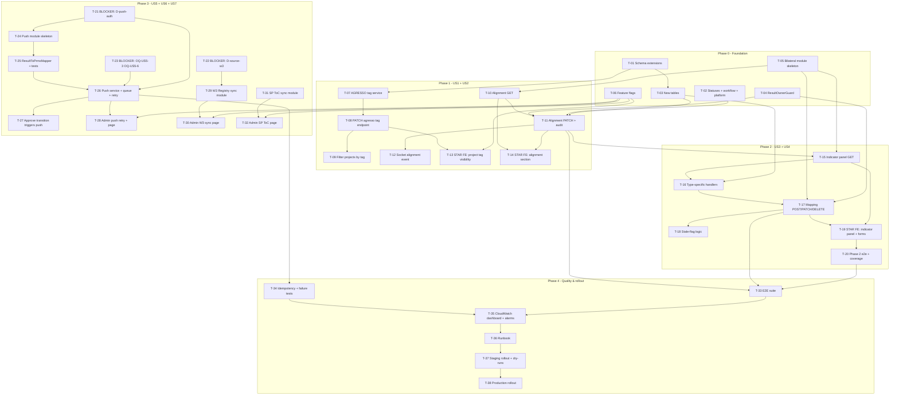

# Tasks — Bilateral module

> **SDD spec.** Follows [`docs/specs/general-setup/task.md`](../general-setup/task.md).
> Inputs: [`./requirements.md`](./requirements.md), [`./design.md`](./design.md).
> Companion documents: [`./requirements.md`](./requirements.md), [`./design.md`](./design.md).

---

## 1. Document control

| Field | Value |
| --- | --- |
| Spec id | 2026-05-bilateral-module |
| Module | bilateral-module |
| Status | Not started — pending Phase 3 approval |
| Phase | Phase 3 of the SDD methodology (tasks) |
| Owner | Tech Lead: TBC. PO: TBC. |
| Last updated | 2026-05-15 |
| Approvers | [ ] Tech Lead · [ ] PO · [ ] DevOps · [ ] STAR FE · [ ] QA |

---

## 2. Executive summary

This task plan delivers the bilateral module across **5 phases / 38 tasks**:

- **Phase 0 — Foundation** (6 tasks): all schema + shared primitives needed by every other phase.
- **Phase 1 — Project tag & alignment** (8 tasks): US1 + US2 ship.
- **Phase 2 — Indicator mapping** (6 tasks): US3 + US4 ship on top of Phase 1.
- **Phase 3 — Integrations** (11 tasks): US5 + US6 + US7. Gated by **3 BLOCKER alignment tasks** that need PRMS team + System Office sign-off.
- **Phase 4 — Quality & rollout** (6 tasks): tests, observability, runbook, staged rollout.

Tests are **embedded in every task** (no separate "testing" phase). Coverage threshold: ≥ 60% per ARI's existing Jest config (NFR-BIL-007).

Conventions:

- One task = one PR where possible.
- Migration tasks include both the migration file and the matching entity/decorator update.
- BLOCKER tasks must close before downstream tasks start; status `blocked` until then.
- Tasks ending with "STAR FE" are coordination markers — actual STAR work is tracked in the STAR repo's task list.

---

## 3. Task numbering

`T-NN` within this spec. Numbers reflect typical execution order but the **dependency graph in §4 is authoritative**.

---

## 4. Dependency graph



---

## 5. Phase 0 — Foundation

> **Mandatory verification gate after EVERY task in this phase and beyond.**
>
> Before merging any task that touches DI (new service, new module import, new injection, new controller), confirm the following on the target environment:
>
> ```
> GET /api/v2/results?page=1&limit=10&sort-order=DESC&sort-field=code&only-own-results=false
> Expected: 200 OK with `data: [...]`
>
> If 500 with `Cannot read properties of undefined (reading 'user_id')`:
>   STOP. The task you just merged tripped the empty-shell DI cycle (see design.md §3.4).
>   Revert immediately and bisect.
> ```
>
> Same check applies to `GET /api/results?limit=2`, `GET /api/results/validate-title?title=test`,
> `GET /api/results/last-updated/current-user`. If any of these return 500 with the same shape,
> all `ResultsService` methods are affected — same root cause.

### T-00 — Pre-requisite: remove dead `CurrentUserUtil` injection from `ResultRepository`

- **Status:** pending
- **Size:** XS
- **Dependencies:** —
- **Requirements covered:** NFR-BIL-* (stability)
- **Design references:** §3.4 (DI scope constraints) — Constraint D
- **Scope:** In `server/researchindicators/src/domain/entities/results/repositories/result.repository.ts`:
  - Remove the `private readonly currentUserUtil: CurrentUserUtil` parameter from the constructor.
  - Remove the `import { CurrentUserUtil }` line.
  - Update the sibling spec `result.repository.spec.ts` — the `new ResultRepository(...)` call drops one arg.
  - Verify: `grep this.currentUserUtil` in the file returns zero matches (it was already dead code).
- **Tests:**
  - All existing `result.repository.spec.ts` tests still pass with the trimmed constructor.
  - `npm run lint` clean.
  - `npx tsc --noEmit` clean.
- **Done criteria:**
  - [ ] `ResultRepository` constructor has 2 params (was 3): `appConfig`, `dataSource`.
  - [ ] `ResultRepository` is now singleton scope (no REQUEST cascade from this provider).
  - [ ] **Verification gate passes** on the target environment (`/api/v2/results` returns 200).
- **Why this is a pre-requisite:** `BilateralService` injects `ResultRepository`. If `ResultRepository` is REQUEST-scoped (which it currently is, because of the dead injection), then `BilateralService` becomes REQUEST-scoped too. That adds another consumer to the REQUEST-scope cascade that causes the empty-shell bug. Cleaning this first eliminates one source of cascade.
- **Skills:** `nestjs-expert`.

### T-01 — Schema: extend `agresso_contract`, `result`, `indicator`

- **Status:** pending
- **Size:** S
- **Dependencies:** —
- **Requirements covered:** R-BIL-001, R-BIL-045, R-BIL-062, NFR-BIL-006
- **Design references:** §4 (migrations list), §5.1.1, §5.1.2, §5.2
- **Scope:** Three migrations:
  1. `addPoolFundingContributorTagToAgressoContract` (boolean column + index + `@OpenSearchProperty`).
  2. `addIsSyncedToPrmsAndPrmsResultCodeToResults` (two columns + index).
  3. `addIsActiveToIndicator` — **only if** the existing ARI indicator table lacks `is_active`. Verify first.
- **Tests:**
  - Migration runs forward + reverts cleanly on `TEST` datasource.
  - Entity unit test asserts the new column appears in TypeORM metadata.
- **Done criteria:**
  - [ ] 3 migration files merged.
  - [ ] Entity files updated with `@Column` + `@OpenSearchProperty`.
  - [ ] `npm run migration:dev:execute` passes locally.
  - [ ] Sibling `*.spec.ts` updated.
- **Skills:** `nestjs-expert`.

### T-02 — Schema: new statuses, workflow, `ReportingPlatform` row

- **Status:** pending
- **Size:** S
- **Dependencies:** —
- **Requirements covered:** R-BIL-011, R-BIL-040, NFR-BIL-008
- **Design references:** §5.1.3, §5.1.4, §5.1.5, **D-status-1**
- **Scope:**
  1. Migration `addBilateralResultStatuses` — inserts 3 rows (PENDING_REVIEW / APPROVED / REJECTED).
  2. Migration `addBilateralResultStatusWorkflow` — inserts the 5 transition rows (including D7 re-review).
  3. Migration `addReportingPlatformBilateral` — inserts the `BILATERAL` row.
- **Tests:**
  - Migration runs forward + reverts.
  - Workflow assertion: `result_status_workflow` rejects a non-listed transition.
- **Done criteria:**
  - [ ] 3 migration files merged.
  - [ ] `ResultStatusEnum` updated (new entries for the 3 statuses).
  - [ ] `ReportingPlatform` enum (or const map) updated.
  - [ ] Workflow tests pass.
- **Skills:** `nestjs-expert`.

### T-03 — Schema: new tables (alignment, mapping, review history)

- **Status:** pending
- **Size:** M
- **Dependencies:** T-01, T-02
- **Requirements covered:** R-BIL-011, R-BIL-012, R-BIL-030, R-BIL-031, R-BIL-033, R-BIL-035, NFR-BIL-008, NFR-BIL-009
- **Design references:** §5.1.6, §5.1.7, §5.1.8, **D2**, **D-soft-delete-uniqueness**, **D-stale-mapping-push**
- **Scope:**
  1. Migration `createResultPoolFundingAlignment` + entity + repository.
  2. Migration `createResultPoolFundingAlignmentSp` + entity + repository.
  3. Migration `createResultPoolFundingIndicatorMapping` + entity + repository.
  4. Migration `createResultReviewHistory` + entity + repository.
  5. All 4 tables get `@OpenSearchProperty` where applicable.
- **Tests:**
  - Migration forward + revert.
  - Unique-key behaviour `(result_id, is_active)` — soft-deleted row can coexist with active replacement.
- **Done criteria:**
  - [ ] 4 migration files merged.
  - [ ] 4 entity files + sibling spec.
  - [ ] Repositories registered in `TypeOrmModule.forFeature`.
- **Skills:** `nestjs-expert`, `api-design-principles`.

### T-04 — Shared: `ResultOwnerGuard` + `@ResultOwner()` decorator

- **Status:** pending
- **Size:** S
- **Dependencies:** —
- **Requirements covered:** R-BIL-013, NFR-BIL-002
- **Design references:** §7.6, **D-result-owner-guard**
- **Scope:** New guard under `domain/shared/guards/result-owner.guard.ts` reusing `ResultsUtil` + `ResultUsersService`. Combine with `@Roles(...)` via `@UseGuards(RolesGuard, ResultOwnerGuard)`. Add a small `@ResultOwner()` decorator for metadata if helpful.
- **Tests:**
  - Owner with role CONTRIBUTOR + matching `result_users.role IN (CREATOR|PI|CONTACT)` → allowed.
  - Non-owner with role CONTRIBUTOR → denied (403).
  - Role CENTER_ADMIN / SYSTEM_ADMIN → allowed regardless of ownership.
- **Done criteria:**
  - [ ] Guard + spec + 90%+ coverage on the guard.
  - [ ] Unit test for each branch.
- **Skills:** `nestjs-expert`, `error-handling-patterns`.

### T-05 — Module: `domain/entities/bilateral/` skeleton

- **Status:** pending
- **Size:** S
- **Dependencies:** T-00 (mandatory), T-03, T-04
- **Requirements covered:** all R-BIL-0xx (skeleton hosts later tasks)
- **Design references:** §3.4 (DI constraints — MANDATORY), §4, §7.1, §7.3, §7.7
- **Scope:**
  - `bilateral.module.ts` with imports for the new entities, ResultsModule, ClarisaModule, ResultReviewHistoryModule, SocketModule.
  - `bilateral.controller.ts` — empty Controller shell with `@ApiTags('Bilateral')` + `@ApiBearerAuth()` + `@UseGuards(RolesGuard)`. **Will extract `User` from `@Req() req` and pass to `BilateralService` as a method parameter** (Constraint A).
  - `bilateral.service.ts` — `@Injectable()` (default singleton scope, **NOT REQUEST scope**). Method signatures from §7.2 accept `User` (or `sec_user_id`) as a parameter. **MUST NOT inject `CurrentUserUtil`** (Constraint A).
  - `handlers/bilateral-indicator-type-handler.interface.ts` — the interface from §7.3.
  - `handlers/noop.handler.ts` — for types 4 / 8. Singleton scope, no `CurrentUserUtil` injection.
  - Wire into `app.module.ts` + `domain/routes/main.routes.ts`.
- **Tests:** Controller + service spec stubs (will be fleshed out by later tasks).
- **Done criteria:**
  - [ ] Files compile.
  - [ ] Swagger UI loads with a `Bilateral` tag and empty endpoints list.
  - [ ] `npm test` green.
  - [ ] **`BilateralService.constructor` does NOT include `CurrentUserUtil`** (grep check).
  - [ ] **No `@Injectable({ scope: Scope.REQUEST })` decorator on any bilateral provider** (grep check).
  - [ ] **Verification gate passes** (`/api/v2/results` returns 200 after this task is merged).
- **Skills:** `nestjs-expert`, `api-design-principles`.

> ⚠ **The previous bilateral implementation (reverted on 2026-05-22) violated Constraint A** by having `BilateralService` inject `CurrentUserUtil`. That single line forced `BilateralService` into REQUEST scope, which tipped the `ResultsService ↔ ResultOicrService` cycle past its breaking point and produced empty-shell `ResultsService` instances. Do not repeat.

### T-06 — Config: feature flags

- **Status:** pending
- **Size:** S
- **Dependencies:** —
- **Requirements covered:** §14 (rollout) — supports staged release
- **Design references:** §14.2, **D-feature-flags**
- **Scope:** Add 4 env vars to the env util (`env.utils.ts`) + types:
  - `ARI_BILATERAL_MODULE_ENABLED`
  - `ARI_BILATERAL_PUSH_ENABLED`
  - `ARI_BILATERAL_W3_SYNC_ENABLED`
  - `ARI_BILATERAL_SP_TOC_SYNC_ENABLED`
- **Tests:** Env util unit test asserts default `false` and respects truthy values.
- **Done criteria:**
  - [ ] Env util updated + spec.
  - [ ] `.env.example` updated.
  - [ ] Documented in [`server/researchindicators/src/CLAUDE.md`](../../../server/researchindicators/src/CLAUDE.md) or a sibling note.
- **Skills:** `nestjs-expert`.

---

## 6. Phase 1 — US1 + US2 (project tag + alignment)

### T-07 — AGRESSO contract service: pool funding tag

- **Status:** pending
- **Size:** S
- **Dependencies:** T-01
- **Requirements covered:** R-BIL-001
- **Design references:** §6.1, §5.1.1
- **Scope:** Extend `domain/entities/agresso-contract/agresso-contract.service.ts` with `setPoolFundingTag(contractCode, value, user)`:
  - Validates the contract is bilateral (per **D4**).
  - Writes audit columns via `AuditableEntity`.
  - Triggers OpenSearch reindex of the contract document.
- **Tests:**
  - Happy path: set true / false.
  - Reject non-bilateral contract (400).
  - Audit columns populated.
- **Done criteria:**
  - [ ] Service method + spec.
- **Skills:** `nestjs-expert`, `error-handling-patterns`.

### T-08 — Endpoint: `PATCH /api/v1/agresso/contracts/:code/pool-funding-tag`

- **Status:** pending
- **Size:** S
- **Dependencies:** T-07
- **Requirements covered:** R-BIL-001, NFR-BIL-002
- **Design references:** §6.1
- **Scope:** Controller method with `@Roles(CENTER_ADMIN, SYSTEM_ADMIN)`, full Swagger annotations, response wrapped in `ServerResponseDto`.
- **Tests:**
  - Unit: service mocked, controller test for status codes.
  - E2E: happy path + 401 + 403 + 400 (non-bilateral).
- **Done criteria:**
  - [ ] Endpoint visible in `/swagger`.
  - [ ] E2E green.
- **Skills:** `nestjs-expert`, `api-design-principles`.

### T-09 — `GET /api/v1/agresso/contracts` extension: filter by tag

- **Status:** pending
- **Size:** S
- **Dependencies:** T-08
- **Requirements covered:** R-BIL-003
- **Design references:** §6.1
- **Scope:** Add `?pool-funding-contributor=true|false` query (parse with existing `QueryParseBool`). Update repository query + OpenSearch index where applicable.
- **Tests:**
  - Filter combinations (true / false / unset).
  - Combined with existing filters (AND semantics).
- **Done criteria:**
  - [ ] Endpoint + spec.
  - [ ] Swagger reflects the new param.
- **Skills:** `nestjs-expert`, `api-design-principles`.

### T-10 — Endpoint: `GET /api/v1/results/:result-code/pool-funding-alignment`

- **Status:** pending
- **Size:** S
- **Dependencies:** T-05
- **Requirements covered:** R-BIL-010, R-BIL-015
- **Design references:** §6.2
- **Scope:** `BilateralService.getAlignment(resultCode, user)`. Returns eligibility flag, current alignment (if any), selected lever codes + names (resolved via `ClarisaModule`), `is_synced_to_prms`, `is_read_only` boolean.
- **Tests:**
  - Tagged project: returns `eligible: true`.
  - Untagged project: returns `eligible: false`, no alignment payload.
  - Result is synced: `is_read_only: true`.
- **Done criteria:**
  - [ ] Service + controller + specs.
  - [ ] E2E for the three states.
- **Skills:** `nestjs-expert`, `api-design-principles`.

### T-11 — Endpoint: `PATCH /api/v1/results/:result-code/pool-funding-alignment`

- **Status:** pending
- **Size:** M
- **Dependencies:** T-02, T-03, T-04, T-10
- **Requirements covered:** R-BIL-011, R-BIL-012, R-BIL-013, R-BIL-014, R-BIL-015, R-BIL-016, NFR-BIL-001, NFR-BIL-008
- **Design references:** §6.2, §7.2, §10.1, **D2**, **D7**, **D10**, **D-snapshot-policy**
- **Scope:** `BilateralService.updateAlignment(...)` in a transaction:
  1. Verify project tag.
  2. Verify `is_synced_to_prms = false` (else 409).
  3. Soft-delete previous active alignment + SP rows.
  4. Insert new ones.
  5. Write `result_review_history` row (`POOL_FUNDING_ALIGNMENT_CHANGED`).
  6. Snapshot **only** when status is `BILATERAL_APPROVED` (D-snapshot-policy).
  7. Audit columns.
- **Tests:**
  - Yes + lever_codes saves; switch to No clears selection.
  - 409 when already synced.
  - Edit succeeds when result status is `BILATERAL_APPROVED` (AR.1 — no `ResultStatusGuard`).
  - Submission of result with empty alignment still succeeds (AR.3).
  - Owner allowed, non-owner 403 (gates: `RolesGuard` + `ResultOwnerGuard`).
- **Done criteria:**
  - [ ] Endpoint + spec + e2e.
  - [ ] Migration covered by the audit log.
- **Skills:** `nestjs-expert`, `api-design-principles`, `error-handling-patterns`.

### T-12 — Socket.IO event: `result.pool-funding-alignment.changed`

- **Status:** pending
- **Size:** S
- **Dependencies:** T-11
- **Requirements covered:** D16, R-BIL-012
- **Design references:** §9.2
- **Scope:** Emit from `BilateralService.updateAlignment` on success. Wire into `ServerGateway`. Payload `{ result_code, by_user_id, at }`.
- **Tests:** Unit test asserts emission.
- **Done criteria:**
  - [ ] Event emitted in success path.
  - [ ] Documented in `domain/tools/socket/` README (if absent, create a small one).
- **Skills:** `nestjs-expert`.

### T-13 — STAR FE coordination: project tag visibility (US1 client side)

- **Status:** pending — **coordination ticket** (not implemented in this repo)
- **Size:** M (in STAR repo)
- **Dependencies:** T-08, T-09, T-06
- **Requirements covered:** R-BIL-002, R-BIL-003
- **Design references:** §8.1
- **Scope:** Add the tag column + filter chip + project-detail header badge + project selector + Excel export column in STAR. Use the ARI endpoints from T-08/T-09.
- **Tests:** Owned by the STAR team's CI.
- **Done criteria:**
  - [ ] STAR PR merged.
  - [ ] STAR e2e exercises the tag pathways.
- **Skills:** `ui-ux-pro-max`, `frontend-design`, `tailwind-design-system`.

### T-14 — STAR FE coordination: Pool Funding Alignment section (US2 client side)

- **Status:** pending — **coordination ticket** (not implemented in this repo)
- **Size:** L (in STAR repo)
- **Dependencies:** T-10, T-11, T-12
- **Requirements covered:** R-BIL-010 through R-BIL-016, NFR-BIL-005
- **Design references:** §8.2
- **Scope:** New STAR section `PoolFundingAlignmentSection` per the Figma node (US2). Reactive to Socket.IO event `result.pool-funding-alignment.changed`. WCAG 2.1 AA.
- **Done criteria:** STAR PR merged + STAR e2e green.
- **Skills:** `ui-ux-pro-max`, `frontend-design`, `react-doctor`.

---

## 7. Phase 2 — US3 + US4 (indicators + mapping)

### T-15 — Endpoint: `GET /api/v1/results/:result-code/pool-funding-alignment/indicators`

- **Status:** pending
- **Size:** M
- **Dependencies:** T-05, T-11
- **Requirements covered:** R-BIL-020, R-BIL-021, R-BIL-022, NFR-BIL-001
- **Design references:** §6.3, §7.2
- **Scope:** `BilateralService.listIndicators(...)`. Group by SP. Source = ARI's cached indicators (fed by US7 — T-31). Support `search` + `indicator-type` query params.
- **Tests:**
  - Visibility when SPs selected.
  - Empty + loading + stale-catalog states.
  - Filter and search.
- **Done criteria:**
  - [ ] Endpoint + e2e.
  - [ ] p95 ≤ 300 ms at 50 RPS (basic load test).
- **Skills:** `nestjs-expert`, `api-design-principles`.

### T-16 — Type-specific indicator handlers

- **Status:** pending
- **Size:** L
- **Dependencies:** T-05, T-03
- **Requirements covered:** R-BIL-031, R-BIL-032, NFR-BIL-006
- **Design references:** §7.3, **D12**
- **Scope:** 5 handlers (capacity-sharing, knowledge-product, policy-change, innovation-development, noop). **`innovation-use` skipped** per **D5 = C**. Each handler delegates persistence to the existing ARI service for that result type. Preserve backend-compatible typos. The KP handler is allowed to be partial in Phase 2 (Phase 3 deferred KP push per **D9**).
- **Tests:** Each handler validates required fields per its type; happy + missing-field paths.
- **Done criteria:**
  - [ ] 5 handler files + sibling spec each.
  - [ ] Registered in `BilateralModule` providers.
- **Skills:** `nestjs-expert`, `api-design-principles`, `error-handling-patterns`.

### T-17 — Endpoints: contribution `POST` / `PATCH` / `DELETE`

- **Status:** pending
- **Size:** M
- **Dependencies:** T-15, T-16, T-04
- **Requirements covered:** R-BIL-030, R-BIL-031, R-BIL-032, R-BIL-033, R-BIL-034, NFR-BIL-008
- **Design references:** §6.4, §7.2, §10.2
- **Scope:** Three endpoints under `/results/:result-code/pool-funding-alignment/indicators/:indicator-code/contribution`. `RolesGuard` + `ResultOwnerGuard`. Discriminated DTO. Audit row in `result_review_history` (`INDICATOR_MAPPING_CHANGED`). Soft-delete on DELETE.
- **Tests:** Per type — happy + validation-failure + 409 (synced) + 403 (non-owner). DELETE soft-deletes (`is_active=false`).
- **Done criteria:**
  - [ ] 3 endpoints + e2e for each type.
- **Skills:** `nestjs-expert`, `api-design-principles`, `error-handling-patterns`.

### T-18 — Stale-flag logic on catalog drift

- **Status:** pending
- **Size:** S
- **Dependencies:** T-17
- **Requirements covered:** R-BIL-035, **D-stale-mapping-push**
- **Design references:** §7 (re-review), §10.4, **D-stale-mapping-push**
- **Scope:** When US7's sync inactivates an indicator (T-31), existing mappings are auto-flagged `is_stale = true`. The flag is exposed via the read endpoint (T-15). Push (T-26) skips stale mappings + logs warnings.
- **Tests:**
  - Inactivate an indicator → corresponding mappings flip to `is_stale = true`.
  - Read endpoint reflects the flag.
- **Done criteria:**
  - [ ] Service logic + spec.
  - [ ] Integration test against `TEST` datasource.
- **Skills:** `nestjs-expert`.

### T-19 — STAR FE coordination: indicator panel + per-type contribution forms

- **Status:** pending — coordination ticket
- **Size:** L (in STAR repo)
- **Dependencies:** T-15, T-17, T-14
- **Requirements covered:** R-BIL-020..R-BIL-035, NFR-BIL-005
- **Design references:** §8.3
- **Done criteria:** STAR PR merged + e2e green.
- **Skills:** `ui-ux-pro-max`, `frontend-design`, `react-doctor`.

### T-20 — Phase 2 e2e + coverage pass

- **Status:** pending
- **Size:** M
- **Dependencies:** T-15, T-16, T-17, T-18
- **Requirements covered:** NFR-BIL-007, all R-BIL-02x + R-BIL-03x
- **Design references:** §13
- **Scope:** Add full e2e suite for Phase 2 endpoints; verify coverage ≥ 60% across `domain/entities/bilateral/`.
- **Tests:** `npm run test:e2e` includes new files; `npm run test:cov` thresholds green.
- **Done criteria:**
  - [ ] CI green.
- **Skills:** `nestjs-expert`, `systematic-debugging`.

---

## 8. Phase 3 — US5 + US6 + US7 (integrations)

### T-21 — BLOCKER: close **D-push-auth** with PRMS team

- **Status:** open (blocker) — no movement since 2026-05-25 ([§15](#15-re-price-log))
- **Size:** S (coordination, not code)
- **Dependencies:** —
- **Requirements covered:** NFR-BIL-002, R-BIL-040, R-BIL-044
- **Design references:** §11, **D-push-auth**
- **Scope:** Confirm outbound auth mechanism with PRMS team (API key, machine token, mTLS, OAuth client-credentials). Capture decision in [`./design.md` §15](./design.md) decision log.
- **Done criteria:**
  - [ ] Decision logged.
  - [ ] Secrets sourced into `app_secrets` / env per **D1** pattern.
- **Skills:** `brainstorming`, `security-review`.

### T-22 — BLOCKER: close **D-source-w3** with System Office

- **Status:** open (blocker) — no movement since 2026-05-25 ([§15](#15-re-price-log))
- **Size:** S (coordination)
- **Dependencies:** —
- **Requirements covered:** R-BIL-050, OQ-B
- **Design references:** §15, **D-source-w3**
- **Scope:** Confirm W3 Registry source format (REST? CSV? file drop on S3? SharePoint?). Confirm mapping key (AGRESSO contract code).
- **Done criteria:**
  - [ ] Decision logged.
  - [ ] Credentials path defined.
- **Skills:** `brainstorming`.

### T-23 — BLOCKER: close **OQ-US5-3** + **OQ-US5-6** with PRMS team

- **Status:** open (blocker) — no movement since 2026-05-25 ([§15](#15-re-price-log))
- **Size:** S (coordination)
- **Dependencies:** T-21
- **Requirements covered:** R-BIL-042, R-BIL-044, R-BIL-045
- **Design references:** §15
- **Scope:** Confirm PRMS per-row error model and re-push semantics after re-review.
- **Done criteria:**
  - [ ] Decisions logged.
- **Skills:** `brainstorming`.

### T-24 — Push module skeleton

- **Status:** landed (commit `e838e2f8`, 2026-05-19) — skeleton in place; service body waits on T-25 / T-26 ([§15](#15-re-price-log))
- **Size:** S
- **Dependencies:** T-21
- **Requirements covered:** R-BIL-040, R-BIL-041
- **Design references:** §7.4
- **Scope:** Create `domain/tools/bilateral-push/` with module, service shell, connection shell, queue consumer shell. Register in `app-microservice.module.ts`.
- **Tests:** Compile + module loads.
- **Skills:** `nestjs-expert`.

### T-25 — `ResultToPrmsMapper` + payload-shape tests

- **Status:** not started — unblocked locally (only T-24 needed; effort unchanged L) ([§15](#15-re-price-log))
- **Size:** L
- **Dependencies:** T-24, T-03, T-16
- **Requirements covered:** R-BIL-041, NFR-BIL-006
- **Design references:** §9.1, §10.4
- **Scope:** Pure function mapper from snapshot (Result + alignment + mappings + typed rows) to a `RootResultsDto`-shaped JSON. Preserve backend-compatible typos.
- **Tests:**
  - One fixture per indicator type → snapshot test.
  - Fixture-shape match against `bilateral-result-summaries.en.md` schema (manual or generated check).
- **Done criteria:**
  - [ ] Mapper file + spec.
  - [ ] `test/fixtures/prms-payload/` populated.
- **Skills:** `nestjs-expert`, `api-design-principles`.

### T-26 — Push service + queue consumer + retry cron

- **Status:** not started — waits on T-23 (OQ-US5-3 / OQ-US5-6) + T-25; effort unchanged L ([§15](#15-re-price-log))
- **Size:** L
- **Dependencies:** T-23, T-25
- **Requirements covered:** R-BIL-040, R-BIL-042, R-BIL-043, R-BIL-044, R-BIL-045, NFR-BIL-003, NFR-BIL-004, NFR-BIL-009
- **Design references:** §7.4, §10.4, §12, **D-push-trigger**
- **Scope:** `BilateralPushService` consumes RMQ messages; computes deterministic `idempotencyKey = sha1(result_code + version_id)`; calls `BilateralPushConnection.send(...)`. Writes `sync_process_log`. Sets `is_synced_to_prms` / `prms_result_code` on success. Schedules retry via `bilateral-push.cron.ts` on transient failures.
- **Tests:**
  - Happy path → success state + lock.
  - 5xx → retry scheduled, `is_synced_to_prms` stays false.
  - 4xx → permanent failure, no retry.
  - Replay same key → no duplicate side effects.
- **Done criteria:**
  - [ ] Service + connection + consumer + cron + specs.
  - [ ] CloudWatch metric emissions verified locally.
- **Skills:** `nestjs-expert`, `error-handling-patterns`, `aws-serverless`.

### T-27 — Approve transition triggers push enqueue

- **Status:** not started — waits on T-26 ([§15](#15-re-price-log))
- **Size:** S
- **Dependencies:** T-26, T-02
- **Requirements covered:** R-BIL-040, R-BIL-045
- **Design references:** §7.7, §10.3
- **Scope:** Hook into `BilateralService.reviewDecision` so that `BILATERAL_APPROVED` enqueues `bilateral.push.requested` on `ARI_QUEUE`. Re-review transitions also re-enqueue (per D7).
- **Tests:**
  - Approve → queue message asserted (consumer mocked).
  - Re-review → new version_id → new push with same idempotency key seed but different `version_id`.
- **Skills:** `nestjs-expert`.

### T-28 — Admin push retry endpoint + SSR page

- **Status:** not started — waits on T-26; SSR shell now unblocked (T-15.15 fixed admin `basename`) so the page can land as soon as the push service backs it ([§15](#15-re-price-log))
- **Size:** M
- **Dependencies:** T-26
- **Requirements covered:** R-BIL-044
- **Design references:** §6.5, §8.5
- **Scope:**
  - Endpoints `POST /api/v1/admin/bilateral/push/:result-code/retry` and `GET /api/v1/admin/bilateral/push-failures`.
  - SSR page `BilateralPushFailures.tsx` under `src/admin/client/pages/` per `src/admin/README-REACT.md`.
- **Tests:** Endpoint roles enforced; SSR page renders with mocked initial data.
- **Skills:** `nestjs-expert`, `api-design-principles`, `vercel-react-best-practices`.

### T-29 — W3 Registry sync module + cron

- **Status:** not started — waits on T-22 (D-source-w3) ([§15](#15-re-price-log))
- **Size:** L
- **Dependencies:** T-22, T-01
- **Requirements covered:** R-BIL-050, R-BIL-051, R-BIL-052, NFR-BIL-003, NFR-BIL-004
- **Design references:** §7.5, §10.5
- **Scope:** `domain/tools/w3-registry/` — connection + service (`run({ dryRun })`) + DTOs. Cron `w3-registry.cron.ts` writes `sync_process_log` and reindexes OpenSearch on success.
- **Tests:**
  - Diff computation (added/removed/unchanged).
  - Conflict resolution policy on manual override (final policy per **D-source-w3** outcome).
  - Dry-run does not mutate.
- **Skills:** `nestjs-expert`, `error-handling-patterns`, `aws-serverless`.

### T-30 — Admin W3 sync endpoint + SSR page

- **Status:** not started — waits on T-29; SSR shell ready (see T-28 note on admin `basename`) ([§15](#15-re-price-log))
- **Size:** M
- **Dependencies:** T-29
- **Requirements covered:** R-BIL-053
- **Design references:** §6.6, §8.5
- **Scope:** `POST /api/v1/admin/sync/w3-registry?dry-run=true|false` + SSR page `SyncW3Registry.tsx` with manual trigger + run history table + dry-run button.
- **Skills:** `nestjs-expert`, `vercel-react-best-practices`, `ui-ux-pro-max`.

### T-31 — SP ToC sync module + cron

- **Status:** scope narrowed → S/M — the SP catalog half is covered by T-15.4 + T-15.11 + the live CLARISA `/api/projects` proxy; only the indicators-per-SP HLO surface remains, and that's now T-15.12 (live proxy via PRMS ToC). T-31 collapses to "delete the dead cron + sync code" once T-15.12 unblocks (OQ-RV-2). ([§15](#15-re-price-log))
- **Size:** L
- **Dependencies:** T-01
- **Requirements covered:** R-BIL-060, R-BIL-061, R-BIL-062, NFR-BIL-003, NFR-BIL-004
- **Design references:** §7.5, §10.5, **D3**
- **Scope:** `domain/tools/sp-toc-sync/` — connection + service + DTOs. Cron `sp-toc.cron.ts`. Stable indicator-code preservation. Inactivate-on-absence flow. Triggers T-18 stale flag where applicable.
- **Tests:**
  - Upsert by stable code; rename only changes display name.
  - Removed indicator → `is_active=false`; mappings flagged stale.
- **Skills:** `nestjs-expert`, `error-handling-patterns`.

### T-32 — Admin SP ToC sync endpoint + SSR page

- **Status:** likely DROPPED — replaced by the on-demand live proxy pattern from T-15.12. Confirm + close at the same time as T-31 collapses. ([§15](#15-re-price-log))
- **Size:** M
- **Dependencies:** T-31
- **Requirements covered:** R-BIL-063
- **Design references:** §6.6, §8.5
- **Scope:** `POST /api/v1/admin/sync/sp-toc?dry-run=true|false` + SSR page `SyncSpToc.tsx`.
- **Skills:** `nestjs-expert`, `vercel-react-best-practices`, `ui-ux-pro-max`.

---

## 9. Phase 4 — Quality, observability, rollout

### T-33 — Full E2E test suite

- **Status:** not started — deferred until Phase 3 unblocks; scope unchanged L ([§15](#15-re-price-log))
- **Size:** L
- **Dependencies:** T-11, T-17, T-26, T-29, T-31
- **Requirements covered:** NFR-BIL-007, every functional requirement
- **Design references:** §13
- **Scope:** Comprehensive `test/*.e2e-spec.ts` for every bilateral endpoint. Includes:
  - Auth-success, auth-failure, role-denial paths.
  - Edit-in-Approved (AR.1).
  - 409 after sync (AR.2).
  - Owner vs non-owner (R-BIL-013).
- **Done criteria:**
  - [ ] All bilateral endpoints have ≥ 3 e2e cases.
  - [ ] CI green.
- **Skills:** `nestjs-expert`, `systematic-debugging`.

### T-34 — Idempotency + failure-injection tests

- **Status:** not started — waits on T-26; scope unchanged M ([§15](#15-re-price-log))
- **Size:** M
- **Dependencies:** T-26
- **Requirements covered:** NFR-BIL-009, R-BIL-042, R-BIL-044
- **Design references:** §13
- **Scope:** Mock the PRMS connection to return 5xx / 4xx / timeout / 2xx; assert retry, permanent-failure, success behavior. Replay same idempotency key 3× → assert no duplicate state in ARI.
- **Done criteria:**
  - [ ] Failure-injection harness merged.
  - [ ] 3-replay assertion green.
- **Skills:** `systematic-debugging`, `nestjs-expert`.

### T-35 — CloudWatch dashboard + alarms

- **Status:** not started — waits on T-33 + T-34 ([§15](#15-re-price-log))
- **Size:** M
- **Dependencies:** T-33, T-34
- **Requirements covered:** NFR-BIL-004
- **Design references:** §12
- **Scope:** Create one CloudWatch dashboard ("Bilateral module") with the 6 tiles listed in §12. One alarm: push success rate < 95% over 1 hour → on-call channel TBD.
- **Done criteria:**
  - [ ] Dashboard JSON committed under `docs/specs/bilateral-module/observability/dashboard.json` (or DevOps repo).
  - [ ] Alarm tested with a manual injection.
- **Skills:** `aws-serverless`.

### T-36 — Runbook

- **Status:** not started — waits on Phase 3 services landing ([§15](#15-re-price-log))
- **Size:** S
- **Dependencies:** T-26, T-29, T-31, T-35
- **Requirements covered:** NFR-BIL-004
- **Design references:** §12, §14
- **Scope:** Short ops runbook covering: how to manually retry a push, how to dry-run a sync, what to do when an alarm fires, where logs go, how to flip a feature flag.
- **Done criteria:**
  - [ ] `docs/specs/bilateral-module/runbook.md` merged (separate file).
- **Skills:** `brainstorming`.

### T-37 — Staging rollout + dry-run cycles

- **Status:** not started — DevOps coordination required; Phase 1.5 migrations (T-15.3 + T-15.4 + T-15.13) need to roll separately first via Phase 1.5 T-15.7 ([§15](#15-re-price-log))
- **Size:** M
- **Dependencies:** T-33, T-34, T-35, T-36
- **Requirements covered:** §14
- **Design references:** §14.1
- **Scope:** Deploy to staging with all flags `false`. Enable per the §14 step order: W3 dry-run, W3 apply, SP ToC dry-run, SP ToC apply, push enable. Validate every step with the System Office / PRMS team / launch Center.
- **Done criteria:**
  - [ ] Each step signed off in a checklist appended to this task.
- **Skills:** `aws-serverless`, `systematic-debugging`.

### T-38 — Production rollout

- **Status:** not started — waits on T-37 ([§15](#15-re-price-log))
- **Size:** M
- **Dependencies:** T-37
- **Requirements covered:** §14
- **Design references:** §14
- **Scope:** Final rollout in production with the same step order. Coordinate with launch Center + PRMS + STAR teams. Comms via release notes.
- **Done criteria:**
  - [ ] Production flags flipped per plan.
  - [ ] First successful end-to-end (STAR result → ARI → PRMS) verified.
  - [ ] Release notes published.
- **Skills:** `aws-serverless`.

---

## 10. Cross-cutting concerns (every task respects)

- **Lint + format**: `npm run lint`. ESLint + Prettier enforced via Husky. Don't `--no-verify`.
- **Tests + coverage**: `npm test`, `npm run test:cov` ≥ 60%, `npm run test:e2e`.
- **Swagger**: every new endpoint gets full `@ApiTags` / `@ApiOperation` / `@ApiQuery` / `@ApiBody` / `@ApiBearerAuth` / `@ApiResponse`.
- **Audit**: every mutation populates `AuditableEntity` columns.
- **Logging**: every service method uses `LoggerUtil` (no `console.*`).
- **Migrations**: append-only; one concern per file; forward + revert verified.
- **OpenSearch**: every new searchable column gets `@OpenSearchProperty`.
- **Commits / PRs**: `<type>(<scope>): <subject>` style. One task = one PR where feasible.

---

## 11. Risks & blockers log

| # | Date | Risk / Blocker | Mitigation | Owner | Status |
| --- | --- | --- | --- | --- | --- |
| RB-1 | 2026-05-15 | D-push-auth unresolved | T-21 BLOCKER task | PRMS liaison | open |
| RB-2 | 2026-05-15 | D-source-w3 unresolved | T-22 BLOCKER task | System Office liaison | open |
| RB-3 | 2026-05-15 | OQ-US5-3 / OQ-US5-6 unresolved | T-23 BLOCKER task | PRMS liaison + PO | open |
| RB-4 | 2026-05-15 | KP push deferred (D9) — partner expectations to confirm | Phase 2 spec for CGSpace integration | PO | open |
| RB-5 | 2026-05-15 | Re-review loop (D7) could be misused | Rate-limit re-review per result | Tech Lead | open |
| RB-6 | 2026-05-15 | Snapshot proliferation | D-snapshot-policy: snapshot only on status transitions | Architect | mitigated |
| RB-7 | 2026-05-15 | STAR FE bandwidth (T-13, T-14, T-19) not in this repo | Coordination tickets + sync with STAR PM | PO | open |

---

## 12. Definition of done (module level)

The bilateral module is "done" when:

- [ ] All `T-01..T-38` tasks completed.
- [ ] Every requirement in [`./requirements.md` §13](./requirements.md) is exercised by at least one task and at least one test.
- [ ] Coverage thresholds green on CI for the bilateral source tree.
- [ ] Swagger documents every new endpoint and runs cleanly.
- [ ] Migrations apply forward AND revert cleanly on the `TEST` datasource.
- [ ] CloudWatch dashboard + alarms live.
- [ ] Runbook published.
- [ ] At least one launch Center has successfully reported a bilateral result that was approved in STAR and accepted by PRMS.
- [ ] All open questions in [`./design.md` §16](./design.md) either resolved (moved into the design decisions log) or carried forward as new follow-up specs.
- [ ] Rollout note + release notes published.

---

## 13. Sign-off

```
[ ] Tech Lead — <name>
[ ] Engineering lead — <name>
[ ] Product Owner — <name>
[ ] DevOps — <name>
[ ] STAR FE lead — <name>
[ ] Security — <name>
[ ] QA lead — <name>
```

---

## 14. Phase 1.5 deltas — pending-items sub-spec

> Sub-spec of record: [`./pending-items/`](./pending-items/) — `requirements.md` (R-BIL-070..080), `design.md` (D-PI-1..12), `tasks.md` (T-15.1..15.16), `execution.md` (live progress + 3 Pivot Records).

Phase 1.5 carries the two PO clarifications from 2026-05-25 (CLARISA-source SPs; admin-owned AGRESSO ↔ CLARISA mapping) plus all the cleanup that landed in the same wave. Task IDs use the `T-15.N` decimal suffix to slot between Phase 0–2 (T-00..T-20) and Phase 3+ (T-21..T-38).

| Task | Title | Status | Commit |
| --- | --- | --- | --- |
| T-15.1 | Catalog-aware validation on PATCH alignment | `[x]` done (2026-05-26) | `309d03fe` |
| T-15.2 | Source-based read-only gate | `[x]` done (2026-05-26) | `d18691b1` |
| T-15.3 | Migration: rename `lever_code` → `sp_code` | `[x]` done (2026-05-26) | `2c650db4` |
| T-15.4 | Migration: add `icon_key` to catalog | `[x]` done (2026-05-26) | `7696433b` |
| T-15.5 | ~~v1 periodic sync~~ | DROPPED (D-PI-7) | — |
| T-15.6 | Sibling `*.spec.ts` coverage backfill | todo | — |
| T-15.7 | Apply migrations to dev / staging / production | todo | — |
| T-15.8 | Doc updates (this section + design §3.6/§3.7 + frontend-handoff §4.6–§4.8) | in progress | — |
| T-15.9 | Re-price Phase 3+ tasks (T-21..T-38) | `[x]` done (2026-05-26) — inline statuses on §8/§9 task headers + log entry in §15 | — |
| T-15.10 | `ClarisaProjectsService` tool + 5-min cache | `[x]` done (2026-05-26) | `f9f6f851` |
| T-15.11 | `GET .../pool-funding-alignment/science-programs` endpoint + service | `[x]` done (2026-05-26) | `92e2fd52` |
| T-15.12 | `PrmsTocService` + `GET .../bilateral/hlos-indicators` endpoint | blocked (OQ-RV-2) | — |
| T-15.13 | Migration + entity for `bilateral_project_mapping` | `[x]` done (2026-05-25) | `8b59a099` |
| T-15.14 | `BilateralProjectMappingService` + controller + DTOs | `[x]` done (2026-05-26) | `b7bdc237` |
| T-15.15 | Admin SSR page `/admin/bilateral-project-mappings` + sidebar entry | `[x]` done (2026-05-26) | `9b539a7d` |
| T-15.16 | AI-assisted mapping suggestions | deferred (OQ-RV-8) | — |

**Pivot Records** (in [`./pending-items/execution.md`](./pending-items/execution.md)):
- **#1** — Admin REST surface moved from `/api/admin/bilateral-project-mappings` to `/api/bilateral-project-mappings` (JWT middleware exclude `/admin(.*)` was sweeping the role-gated endpoints).
- **#2** — Per-result SP endpoint URL lands at `.../pool-funding-alignment/science-programs` (existing controller namespace) instead of the idealized `.../bilateral/science-programs`.
- **#3** — Admin SSR routers needed `basename="/api"` — every existing admin page was SSR-rendering with an empty body before this fix.

**Carried-forward bug** (out of Phase 1.5 scope; flagged during T-15.1 + T-15.3 smoke): `result_pool_funding_alignment.uq_..._result_active` is a plain `UNIQUE (result_id, is_active)` index — not partial — so the second deactivated row collides. Recommended follow-up: a sibling migration converting it to the same STORED GENERATED column + UNIQUE pattern used by `bilateral_project_mapping` (D-PI-9).

---

## 15. Re-price log

Operational record of how Phase 3+ task estimates shift as Phase 1.5 work lands and as external blockers move.

### 2026-05-25 — Phase 1.5 wave

Triggered by the two PO clarifications on 2026-05-25 (CLARISA-source SPs; admin-owned AGRESSO ↔ CLARISA mapping). Re-evaluating Phase 3+:

| Task | Prior status | New status (2026-05-25) | Notes |
| --- | --- | --- | --- |
| T-21 (BLOCKER D-push-auth) | open | open | PRMS liaison; no movement. |
| T-22 (BLOCKER D-source-w3) | open | open | System Office liaison; no movement. |
| T-23 (BLOCKER OQ-US5-3 / OQ-US5-6) | open | open | PRMS liaison + PO; no movement. |
| T-24 (Push module skeleton) | landed (commit `e838e2f8`) | landed | No change. |
| T-25..T-28 (Push payload + queue + admin retry) | not started | unblocked locally — wait on T-21/T-23 | Effort unchanged (M/L mix). |
| T-29..T-30 (W3 Registry sync + admin) | not started | wait on T-22 | Effort unchanged (M/L). |
| **T-31 (SP ToC sync module + cron)** | **L** | **Scope narrowed → S/M** | **The SP catalog half is now covered by T-15.4 + T-15.11 + the live CLARISA `/api/projects` proxy. Only the indicators-per-SP HLO surface remains — and that's already moved into T-15.12 as a live proxy via PRMS ToC. T-31 collapses into "delete dead code" once T-15.12 unblocks (OQ-RV-2).** |
| T-32 (Admin SP ToC sync endpoint + SSR page) | not started | likely DROPPED | Replaced by the on-demand live proxy pattern from T-15.12. Confirm + close at the same time as T-31 collapses. |
| T-33..T-38 (E2E, observability, runbook, rollout) | not started | unchanged scope; deferred until Phase 3 unblocks | DevOps coordination still required for T-37/T-38. |

**Net effect**: Phase 3+ effort shrinks by ~1 L task (T-31) and possibly ~1 M task (T-32), at the cost of the Phase 1.5 wave that just landed (one M-sized integration tool + one S-sized HLO proxy stub + one L-sized admin UI). The trade is favorable — the bilateral picker contract is now locked end-to-end against CLARISA, and the operator UI is live in dev.

(Future re-price entries appended below in dated subsections as the spec evolves.)
