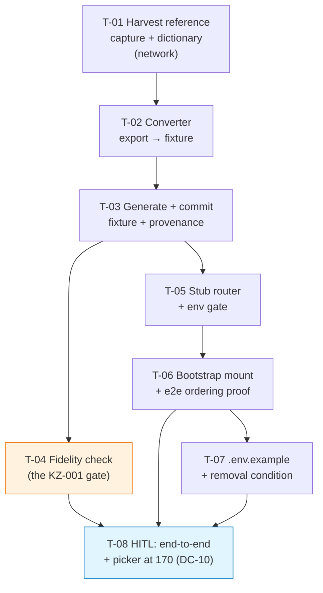

# Tasks — bilateral / clarisa-fixture-stub

- **Module:** clarisa (served from `bilateral/`)
- **Spec id:** 2026-08-clarisa-fixture-stub
- **Status:** not-started
- **Owner:** Juan Carlos Cadavid
- **Linked requirements:** [./requirements.md](./requirements.md)
- **Linked design:** [./design.md](./design.md)
- **Last updated:** 2026-08-18
- **Type:** Change — **not** Bug Mode. No regression test is owed; instead **every new gate must be demonstrated able to FAIL by the named mutation in its task** (K-004), and each task names that input *before* the test is written (K-012).

---

## 0. Execution constraints

- **Not parallel-safe.** Every task touches `server/researchindicators`. Per root `CLAUDE.md` §4.3, two tasks in the same package must not run concurrently, and no full-suite measurement may run while a worker is active. Run these strictly in dependency order.
- **T-01 requires network + credentials** (a live CLARISA login). It is the only task that does. If CLARISA is unreachable, T-01 blocks and nothing downstream can proceed — do not substitute a hand-written capture (that is exactly what DD-4 forbids).
- **The export must be present** at the path recorded in the provenance file. It is **not** in the repository (DD-7).
- **Restart the server after any host switch** — the service caches for 5 minutes and a stale cache reads as "the switch did not work" (design §5.4, K-016).

---

## 1. Dependency graph

Orange = the gate the whole fidelity argument rests on. Blue = the only coverage for DC-10, which has **no automated substitute**.

---

## 2. Task list

### T-01 — Harvest the reference capture and the global-unit dictionary

- **Requirements covered:** R-CFS-001 (baseline for AC.2), R-CFS-002 AC.1, R-CFS-005 AC.1
- **Design refs:** §2.1, §5.1, DD-2, DD-4
- **Status:** [x] · **Size:** S (~70 LOC est · **335 actual**) · **Depends on:** none · **Skills:** `error-handling-patterns`, `systematic-debugging` (Leader dropped `nestjs-expert` — see `execution.md` S-3)

**Scope.** A one-shot script that logs in to CLARISA, fetches `/api/projects`, and writes two committed artifacts: a **trimmed reference capture** (a handful of real projects, enough to carry all 32 keys and several mappings) and the **dictionary** of distinct `global_unit_object` values keyed by `smo_code`, copied verbatim. Records the capture host and date into the provenance file.

**Implementation notes**
- Assert each `smo_code` maps to exactly one `(id, cgiar_entity_type_object.code)` pair. Measured **0 ambiguous** (M-12); a future ambiguity must **fail**, not pick a winner.
- Do not reshape, sort keys, or prettify the harvested `global_unit_object` values — byte-verbatim is the requirement.
- Keep the capture small enough to read in a diff. It is a baseline, not a dataset.

**Verification**
- [ ] The dictionary holds **13** entries (SP01–SP13) and the entity-code histogram is `{22: 8, 23: 1, 24: 4}`.
- [ ] The reference capture's key set has exactly **32** keys.
- [ ] Re-running the script over the same captured payload produces a byte-identical dictionary.

**Named falsifying input (must produce a FAIL).** Feed the script a payload where `SP09` appears twice with entity codes 23 and 22 → the ambiguity assertion must fail. If it passes, the assertion is decorative.

**What disqualifies this evidence.** If the live fetch returns a non-200, a truncated body, or fewer than 13 distinct `smo_code`s, the dictionary is **incomplete, not empty** — and an incomplete dictionary makes T-02 fail loudly rather than silently, which is correct. **Report the HTTP status and the distinct-code count; never commit a dictionary produced by a failed or partial fetch.** Check for an error in the raw output *before* counting it (K-014).

---

### T-02 — Build the converter (export → CLARISA-shaped fixture)

- **Requirements covered:** R-CFS-001, R-CFS-002 (all ACs), R-CFS-007
- **Design refs:** §2.1, §5.2, DD-2, DD-3, DD-6, DD-7
- **Status:** [x] · **Size:** M (~140 LOC est · **1037 actual**: 632 converter + 405 spec) · **Depends on:** T-01 · **Skills:** `nestjs-expert`, `tdd`, `error-handling-patterns`

**Scope.** The deterministic converter. Reads the export with `exceljs`, emits **all 198 rows** (not the eligible 170 — DD-3) as objects carrying **exactly** the 32 reference keys, and writes the sibling provenance file.

**Implementation notes**
- `phase` = the **number** `2026`, not the string.
- Unsupplied fields take the value CLARISA itself returns: `null` for the seven `source_*` fields, `external_project_id`, `external_record_id`, `external_source`, `last_synced_at`, `interim_director_review`, `project_results`, `lead_institution_object`, `funder_institution_object`; `[]` for `project_countries_array`.
- Mappings: `global_unit_object` verbatim from the dictionary, `program_id` = its `id`, `project_id` = the parent's `id`, `status` = `'Confirmed'`, `allocation` numeric, `complementarity`/`efficiencies` translated `H|M|L → high|medium|low`.
- **Fail loudly on an unknown program code.** Never fabricate a `global_unit_object`, never silently drop the mapping.
- Export row order, stable key order, **no timestamp inside the array** (DD-6).
- Drop `Principal Investigator`, `… Name`, `… Email` — they have no CLARISA counterpart.

**Verification**
- [ ] Two consecutive runs produce a **zero-byte** diff.
- [ ] A synthetic export row with program `SP14` makes the converter exit non-zero naming `SP14`, and emits **no** fixture.
- [ ] A synthetic row with `SP14` does **not** produce a fixture in which that project simply has fewer mappings.
- [ ] No output field name matches `/principal.?investigator/i`.

**Named falsifying inputs (each must produce a FAIL).**
1. Stamp a generation timestamp inside the emitted array → the byte diff must go non-empty. *A parsed-object comparison would normalize this away and report green — the check must compare **bytes** (DC-8).*
2. Feed a row whose `Program 1` is `SP14` → must exit non-zero, not degrade.
3. Skip the HML translation → `complementarity` values become `H`, which T-04's vocabulary assertion must reject.

**What disqualifies this evidence.** A determinism check run against two *different* exports proves nothing about the converter. Both runs must read the identical input file. If the export path is missing, the task is **blocked**, not passed — a converter that produced no output has not been shown deterministic.

---

### T-03 — Generate and commit the fixture and its provenance

- **Requirements covered:** R-CFS-001 AC.1/AC.3/AC.4, R-CFS-007 AC.2, R-CFS-008 AC.1 (fixture site), NFR-CFS-003
- **Design refs:** §2.1, §5.2, DD-6
- **Status:** [x] · **Size:** S (~40 est · **0 actual** — folded into a Leader verification; artifacts produced by T-02) · **Depends on:** T-02 · **Skills:** `nestjs-expert`

**Scope.** Run the converter, commit the fixture and the provenance file. The provenance file records the source filename, export date, reference-capture date and host, the expected counts, and the **removal condition verbatim**.

**Verification**
- [ ] The fixture parses as an array of length **198**.
- [ ] `typeof phase === 'number'` and equals `2026` for all 198.
- [ ] `external_code` is populated, non-blank, and **unique** across all 198.
- [ ] Total mappings = **283**.
- [ ] `wc -c` on the fixture is **≤ 2 MB** (NFR-CFS-003).
- [ ] The provenance file contains the removal condition verbatim.

**Named falsifying input.** Truncate the fixture to 197 rows → the length assertion must fail. *A check that asserts "length > 0" would pass — the count must be exact.*

**What disqualifies this evidence.** A byte size above 2 MB is **not** a pass with a note; it is an escalation (NFR-CFS-003). And a *populated* `external_code` count of 198 means nothing without the **uniqueness** check — 198 copies of one code would satisfy the weaker claim.

---

### T-04 — The fidelity check (the gate the whole spec rests on)

- **Requirements covered:** R-CFS-005 (all ACs + scenario), R-CFS-001 AC.2, R-CFS-002 AC.2/AC.3/AC.4/AC.5
- **Design refs:** §10, DD-2, DD-4
- **Status:** [ ] · **Size:** L (~230 LOC) · **Depends on:** T-03 · **Skills:** `nestjs-expert`, `tdd`, `systematic-debugging`

**Scope.** `clarisa-stub.fidelity.spec.ts`, running in `npm test`. Compares the generated fixture against the committed reference capture and asserts the divergence list is a **closed set of exactly seven**. This is the KZ-001 gate: it exists to catch a fixture that looks right and evaluates wrong.

**Implementation notes**
- Key-set equality **in both directions** — a missing key and an extra key are different defects and both must fail.
- Assert the **behavioural** outcome, not field presence: `has_science_programs` is `true` for exactly **140** of the 170 eligible and `false` for **30**.
- Assert the entity-code histogram contains **22, 23 and 24** — never 22 alone.
- Assert `complementarity`/`efficiencies` ∈ `{high, medium, low}` across all 283 mappings, and that no `H`, `M` or `L` appears.
- Assert `allocation` is `typeof 'number'` and per-project allocations sum to **100**.
- Assert each `global_unit_object` is byte-equal to its dictionary entry.
- Enumerate divergences **D-1…D-7** as the complete expected set; an eighth must fail, and the failure message must distinguish *recorded* from *new*.
- Print the divergence list on success, so a reader of a passing run still sees the gaps (R-CFS-005 AC.3).
- Re-derive the eligible cohort using the **shipped** predicates imported from `project-selector.util.ts` — never a local reimplementation, or the check drifts from the code it is defending.

**Verification**
- [ ] `npm test -- --silent` passes with the check included.
- [ ] The passing output lists all seven recorded divergences.

**Named falsifying inputs (each must produce a FAIL — this is the K-004 obligation, and citing K-004 is not applying it).**
1. **The headline mutation:** hardcode `cgiar_entity_type_object.code = 22` for every program in the converter → `has_science_programs` becomes **170**, the assertion expecting **140** fails. *This is the exact defect the proposal's §10 invited; if this mutation does not redden the suite, the gate is worthless.*
2. Add a key (`principal_investigator_email`) to one fixture element → key-set equality fails.
3. Remove a key (`remaining`) from one element → key-set equality fails **in the other direction**.
4. Change one `phase` to the string `"2026"` → type assertion fails.
5. Add an eighth divergence → the closed-set assertion fails, and the message says *new*, not *recorded*.

**What disqualifies this evidence.** A green run proves nothing until at least mutations **1–3** have been observed reddening the suite (K-004). Record which mutations were actually executed; **"the check passes" is not the evidence — "the check failed when broken, then passed when fixed" is.** A presence-assertion (`the field exists`) explicitly does **not** discharge AC.2/AC.3: a green test has previously certified a clamp whose classes were all present and whose effect was a no-op. The **140-vs-170 arithmetic** is the behavioural proof.

---

### T-05 — The stub router and its env gate

- **Requirements covered:** R-CFS-003 AC.1/AC.2/AC.3, R-CFS-004 (all ACs + scenario)
- **Design refs:** §2.1, §4, §5.3, §9, DD-1, DD-5, DD-8
- **Status:** [ ] · **Size:** M (~200 LOC incl. tests) · **Depends on:** T-03 · **Skills:** `nestjs-expert`, `api-design-principles`, `error-handling-patterns`

**Scope.** `clarisa-stub.router.ts` + `clarisa-stub.config.ts` + `clarisa-stub.router.spec.ts`. Two Express handlers returning CLARISA's raw shapes, plus the flag parsing. No Nest DI — the router must be mountable before the pipeline exists.

**Implementation notes**
- `GET api/projects` → bare JSON array. `POST auth/login` → bare `{ access_token }`, credentials **ignored, not compared, not logged**.
- Fixture read **once, lazily**, cached in module scope. Not read at all when the flag is off (R-CFS-004 AC.4).
- **The handler must never throw** — `GlobalExceptions` is not in this path. Guard the read and return an explicit JSON 500 (design §5.3, reversion challenge #1).
- Flag parsing is **default-deny**: unset, blank, and unrecognised all mean disabled.
- `LoggerUtil` lines: `warn` on enable at boot, `debug` on first load with counts, `error` on failure. **No per-request logging** — the picker is a hot path (design §9, reversion challenge #2).
- No `@ApiTags`/Swagger — deliberate (DD-8). This is the one place the server guide's Swagger rule does not apply, because the route is not ARI API surface.
- Header comment carries the removal condition verbatim.

**Verification**
- [ ] Response body root for `api/projects` is an **array**; it has **no** `status`, `description`, `errors`, `timestamp` or `path` key.
- [ ] `auth/login` body root has exactly the key `access_token` with a non-empty string.
- [ ] Flag unset → **404** on **both** routes. Flag truthy → 200 on both. Flag `maybe` → **404** on both.
- [ ] With the flag off, no fixture read occurs (assert via a spy or a deliberately absent file).
- [ ] With an unreadable fixture and the flag on, the response is a JSON 500 — **not** an HTML error page and not an unhandled throw.

**Named falsifying inputs (each must produce a FAIL).**
1. Return `{ data: [...] }` instead of a bare array → the "no envelope keys at root" assertion fails.
2. Treat an unrecognised flag value as enabled → the `maybe → 404` case fails.
3. Point the fixture path at a missing file and let the handler throw → the JSON-500 assertion fails.
4. Gate only `api/projects` and leave `auth/login` always-on → the both-routes 404 case fails. *This is the clause `AND IT MUST behave this way for both routes` — a check that tests only `api/projects` cannot see it.*

**What disqualifies this evidence.** A 404 observed while the flag happens to be unset in the ambient shell is **not** evidence of gating — the three flag states must be set explicitly per case. And status codes must be asserted as exactly 404: a 401, 403 or 500 discloses that a handler exists (R-CFS-004 scenario) and must fail the check.

---

### T-06 — Mount the router in bootstrap and prove the ordering

- **Requirements covered:** R-CFS-006 (all ACs + both scenarios), R-CFS-003 AC.4, NFR-CFS-002, NFR-CFS-004
- **Design refs:** §2.1, §5.3, §8, DD-1, V-1, V-2
- **Status:** [ ] · **Size:** S (~90 LOC incl. e2e) · **Depends on:** T-05 · **Skills:** `nestjs-expert`, `api-design-principles`

**Scope.** One env-gated `app.use(prefix, router)` block in `main.ts`, placed **after** `helmet`/`json`/`enableCors` and **before** `listen()`. Plus `test/clarisa-stub.e2e-spec.ts` — the only place mount ordering is observable.

**Implementation notes**
- Position is a **design constraint, not a detail**: mounting before `helmet` would strip security headers from the stub (reversion challenge #3).
- Mount prefix must not over-match siblings. Verified in principle (M-19); re-verify here against the real app.
- `app.module.ts` and `response.interceptor.ts` must remain **byte-identical to `main`**.

**Verification**
- [ ] `GET /api/clarisa-stub/api/projects` with **no** `Authorization` header returns **200** and a raw array.
- [ ] `GET /api/clarisa-stubx/api/projects` does **not** reach the stub and is handled by the normal pipeline.
- [ ] An unrelated protected route still returns **401** without a JWT.
- [ ] An unrelated route still returns the full `ServerResponseDto` envelope (R-CFS-003 AC.4).
- [ ] `git diff --stat` is **empty** for `app.module.ts`, `response.interceptor.ts`, `clarisa-projects.service.ts`, `project-selector.util.ts`, `mapping-phase.resolver.ts`, `clarisa-projects.controller.ts`, `clarisa.connection.ts` (NFR-CFS-002).
- [ ] The stub response carries the `helmet` security headers.
- [ ] Flag unset → the app boots and both routes 404, with no fixture read (NFR-CFS-004).

**Named falsifying inputs (each must produce a FAIL).**
1. Mount at `/api` instead of `/api/clarisa-stub` → the sibling and unrelated-route checks stop returning 401.
2. Move the mount above `app.use(helmet(...))` → the security-header assertion fails.
3. Add an `exclude` entry to `app.module.ts` "just in case" → the empty-diff check fails. *This is the clause `AND IT MUST fail the task if any exclude entry was added` — an unnecessary widening is precisely the risk DD-1 removes.*

**What disqualifies this evidence.** Ordering **cannot** be verified by reading `main.ts` — the clause is explicit that only an executed unauthenticated request can see a routing over-match. A unit test cannot observe it either. If the e2e suite cannot boot the app, this task is **blocked**, not passed on the strength of M-19: M-19 was measured on a *minimal* app and is a strong prior, not proof about this one.

---

### T-07 — Document the variables and the removal condition

- **Requirements covered:** R-CFS-008 (all ACs)
- **Design refs:** §2.1, §7, §11
- **Status:** [ ] · **Size:** S (~40 LOC) · **Depends on:** T-06 · **Skills:** `cognitive-doc-design`

**Scope.** `.env.example` entries for `ARI_CLARISA_STUB_ENABLED` and the stub `ARI_CLARISA_HOST` values, following the existing commented-block style used by `ARI_CLARISA_PROJECTS_PHASE`. State the **trailing slash** requirement and the removal condition.

**Implementation notes**
- `ARI_CLARISA_HOST` is currently **absent** from `.env.example` even though the code requires it — document it here rather than leaving the new variable stranded next to an undocumented dependency.
- Name the failure mode explicitly: a missing trailing slash yields `…/api/clarisa-stubauth/login` → 404 → `BadRequestException`.
- Note the restart requirement (5-minute cache, design §5.4).
- **State that OQ-3 has no owner** (R-CFS-008 AC.3) — the condition is recorded, the owner is not.

**Verification**
- [ ] The removal condition appears **verbatim** in all three locations: provenance file, `.env.example`, stub controller header.
- [ ] `.env.example` documents both variables, the trailing slash, and the restart requirement.
- [ ] The unassigned state of OQ-3 is written down.

**Named falsifying input.** Change the wording in one of the three locations → a `grep -c` for the exact sentence returns 2, not 3, and the check fails. *Use the literal string; a paraphrase-tolerant check cannot detect drift (K-003).*

**What disqualifies this evidence.** This is a **presence-assertion** and it proves only presence. It does **not** prove the condition will be acted on — that requires an owner, which is OQ-3 and is **outside this task's power**. Do not let three green greps read as "the removal is handled."

---

### T-08 — HITL: end-to-end switch and the picker at 170 options

- **Requirements covered:** R-CFS-003 scenario B (end-to-end), NFR-CFS-001, **DC-10** (the spec's only coverage for its dominant user-visible defect class)
- **Design refs:** §5.4, §6, §10, §11
- **Status:** [ ] · **Size:** M (human time) · **Depends on:** T-04, T-06, T-07 · **Skills:** `ui-ux-pro-max`, `systematic-debugging`

**Scope.** A human check, at the HITL pause, against a running local stack. **This task has no automated substitute** — jsdom cannot measure layout, rendering or scroll behaviour, and the CLARISA picker is uncapped (M-18).

**Steps**
1. Set the flag, point `ARI_CLARISA_HOST` at the stub with its trailing slash, **restart** (cache, §5.4).
2. `GET /api/clarisa/projects/bilateral` as a center admin → envelope `data` holds **170**.
3. Phases endpoint → exactly one entry, `{ phase: 2026, count: 170 }`.
4. Open the bilateral-mapping dialog → the CLARISA picker renders, filters and scrolls at 170 options, with labels intact and not truncated into ambiguity.
5. Point `ARI_CLARISA_HOST` back at CLARISA, unset the flag, restart → behaviour returns to today's (25 eligible, phase 2025 on test).
6. Time three requests for NFR-CFS-001.

**Verification**
- [ ] 170 projects returned; phases reports `{2026, 170}`.
- [ ] The picker is usable at 170 options — recorded as an explicit human verdict, with a screenshot.
- [ ] Switching back restores today's behaviour with no code change.
- [ ] `git diff` over the NFR-CFS-002 file list is still empty after the whole spec.

**What disqualifies this evidence.**
- **Latency (NFR-CFS-001):** if the three runs vary by more than the 100 ms budget itself, the number is **not evidence** — report the spread, not a pass. The first request includes the fixture read and is excluded by definition.
- **The picker verdict:** "it looked fine" is not a verdict without stating what was exercised — render, filter, scroll, label. A silent pass here is indistinguishable from an unperformed check, and DC-10 is the one class the other ten gates cannot see.
- **The 170 count:** if it reads 198, the shipped filters are not being applied and the fixture was pre-filtered somewhere — a DD-3 violation, not a pass.
- **Step 5 is not optional.** Without it, "switching back works" is an untested claim, and it is the property that makes this whole spec reversible.

**Escalation.** Findings about the picker at volume become **their own bugfix specs** (R-7). Do not fold fixes into this spec — it would make a temporary data-transport change into a UI change it explicitly excludes.

---

## 3. Coverage map — scenario and clause granularity

Requirement-ID presence is **not** closure. Every scenario and every `BUT` / `AND IT MUST` clause is owned by a named task below. A gap may not be discharged by citing a different requirement.

| Requirement | Scenario / clause | Owner |
|---|---|---|
| R-CFS-001 | Scenario "shape-identical to a real response" | T-04 |
| R-CFS-001 | `BUT NOT` any field CLARISA does not return — incl. PI name/email absent from fixture **and git history** | T-02 (drop at source) + T-04 (assert) |
| R-CFS-001 | `AND IT MUST` fail if a single key is added **or** dropped on either side | T-04 (mutations 2 and 3) |
| R-CFS-001 | AC.1 / AC.3 / AC.4 (198, numeric 2026, unique codes) | T-03 |
| R-CFS-001 | AC.2 (key-set equality both directions) | T-04 |
| R-CFS-002 | Scenario "a naive converter is caught by the count" | T-04 (mutation 1) |
| R-CFS-002 | `AND IT MUST` fail on the hardcoded-22 input | T-04 (mutation 1, must be observed red) |
| R-CFS-002 | `BUT NOT` satisfied by presence alone — the count is the proof | T-04 (140/170 arithmetic) |
| R-CFS-002 | Scenario "an unknown program code stops the converter" | T-02 |
| R-CFS-002 | `BUT NOT` emit a fabricated `global_unit_object` | T-02 |
| R-CFS-002 | `AND IT MUST NOT` silently drop the mapping | T-02 (explicit third check) |
| R-CFS-002 | AC.1 (dictionary byte-equality) | T-01 (produce) + T-04 (assert) |
| R-CFS-002 | AC.2 / AC.4 / AC.5 (histogram, vocabulary, allocation) | T-04 |
| R-CFS-003 | Scenario "envelope leak caught at the wire" | T-05 |
| R-CFS-003 | `AND IT MUST` fail even though status is 200 | T-05 (mutation 1 — shape, not status) |
| R-CFS-003 | `BUT NOT` verified by reading the controller's return type | T-05 (asserted on the response body) |
| R-CFS-003 | Scenario "end-to-end path resolves the fixture" | T-08 |
| R-CFS-003 | `AND` phases reports `{2026, 170}` | T-08 step 3 |
| R-CFS-003 | `BUT NOT` require any consumption-path change — `git diff` untouched | T-06 (empty-diff check) + T-08 (re-check at end) |
| R-CFS-003 | AC.4 (unrelated endpoint still enveloped) | T-06 |
| R-CFS-004 | Scenario "production unaffected by merged code" | T-05 |
| R-CFS-004 | `BUT NOT` a 401, 403 or 500 | T-05 (exact-404 assertion) |
| R-CFS-004 | `AND IT MUST` hold for **both** routes | T-05 (mutation 4) |
| R-CFS-004 | AC.4 (no fixture read when off) | T-05 + T-06 (boot check) |
| R-CFS-005 | Scenario "a new divergence is not absorbed silently" | T-04 (mutation 5) |
| R-CFS-005 | `BUT NOT` pass because recorded divergences are still present | T-04 (closed-set assertion) |
| R-CFS-005 | `AND IT MUST` distinguish recorded from new in the message | T-04 |
| R-CFS-005 | AC.3 (list printed on success) | T-04 |
| R-CFS-006 | Scenario "the mount does not over-match its neighbours" | T-06 |
| R-CFS-006 | `BUT NOT` verified by reading the mount string | T-06 (e2e request only) |
| R-CFS-006 | `AND IT MUST` be re-checked if the prefix is renamed | T-06 (recorded in the spec's header comment) |
| R-CFS-006 | Scenario "the shared exclude list is provably untouched" | T-06 |
| R-CFS-006 | `AND IT MUST` fail if an exclude entry was added "just in case" | T-06 (mutation 3) |
| R-CFS-006 | AC.5 (security review recorded by name) | **HITL at T-08** — sign-off, not a command |
| R-CFS-007 | Scenario "determinism is falsifiable" | T-02 |
| R-CFS-007 | `AND IT MUST` compare raw **bytes** | T-02 (mutation 1) |
| R-CFS-007 | AC.2 (provenance contents) | T-03 |
| R-CFS-008 | AC.1 / AC.2 / AC.3 | T-07 |
| NFR-CFS-001 | latency + its disqualifier | T-08 step 6 |
| NFR-CFS-002 | zero-diff file list | T-06 + T-08 |
| NFR-CFS-003 | ≤ 2 MB | T-03 |
| NFR-CFS-004 | flag-off boot unchanged | T-06 |

**Deliberately unowned by any task, and why:**
- **DC-11 (snapshot staleness)** — accepted risk. No command can detect that PRMS moved on. Mitigated by dated provenance (T-03), not gated.
- **OQ-3 (flag owner)** — outside implementation. T-07 records the *absence*; it cannot record a name.
- **OQ-4 (CLARISA's field naming)** — CLARISA's decision, not ours.

---

## 4. Estimated LOC and PR strategy

| Task | Hand-written LOC |
|---|---|
| T-01 | ~70 |
| T-02 | ~140 |
| T-03 | ~40 (+ ~1 MB generated) |
| T-04 | ~230 |
| T-05 | ~200 (incl. tests) |
| T-06 | ~90 (incl. e2e) |
| T-07 | ~40 |
| T-08 | 0 (human) |
| **Total** | **~810** vs budget **~800** |

Generated bytes are **excluded** — counting a 1 MB fixture as LOC would make the budget meaningless (design §13).

**Recommended: two PRs.** ~810 LOC exceeds the ~400 threshold, and the graph has a clean seam — the data pipeline never imports the router, and the router only reads the fixture as a file.

| PR | Tasks | ~LOC | Reviewer focus |
|---|---|---|---|
| **PR 1 — data pipeline** | T-01 → T-04 | ~480 | Is the fixture *faithful*? The whole review is DD-2 and T-04's mutation log. Nothing here is reachable at runtime |
| **PR 2 — the stub route** | T-05 → T-08 | ~330 | Is the route *contained*? Raw shape, default-deny gating, mount narrowness, `app.module.ts` untouched. **This is the PR the security reviewer reads** |

Per `cognitive-doc-design` review-empathy: PR 1's description should lead with the 140-vs-170 number and the mutations observed red; PR 2's should lead with "no JWT `exclude` change — here is why" and link PR 1 as its prerequisite. Both should state that the stub is **temporary** and carry the removal condition in the description, not only in code.

---

## 5. Risks & blockers log

| # | Date | Risk / Blocker | Mitigation | Owner | Status |
|---|---|---|---|---|---|
| RB-1 | 2026-08-18 | T-01 needs a live CLARISA login; if unreachable, the whole spec blocks | Do **not** hand-write a capture (DD-4 forbids it). Wait, or use a previously captured payload with its date re-recorded | Implementer | open |
| RB-2 | 2026-08-18 | The export is not in the repo; a wrong path silently yields a small fixture | T-03 asserts the exact count of 198 | Implementer | open |
| RB-3 | 2026-08-18 | Test LOC has overrun by up to **4.4×** on the last two specs in this family, same root cause present here | Budgeted at 54% of total. A third overrun is a **Kaizen lesson**, not something to absorb | Leader | open |
| RB-4 | 2026-08-18 | **OQ-3 has no owner** — dev enablement blocked (K-015 pattern) | Recorded in three places; escalated. Local work proceeds | DevOps / Product | **open — blocking dev only** |
| RB-5 | 2026-08-18 | Security review of an unauthenticated route is required before merge | R-CFS-006 AC.5; PR 2 is the review surface | Security reviewer | open |

---

## 6. Done definition

- [ ] All T-01…T-08 are `done`.
- [ ] Every requirement AC is checked, and the §3 coverage map has no unowned scenario or clause.
- [ ] **T-04's mutation log records which mutations were observed FAILING** — at minimum the hardcoded-22 one. A green suite with no observed red is not evidence (K-004).
- [ ] `npm test -- --silent` green on the **full** suite, re-measured by the Leader after the last worker reports (KZ-003) and with **no delegated agent active** (§0).
- [ ] `npx eslint <changed paths>` clean — bare `eslint`, not `npm run lint` (which carries `--fix` and cannot gate).
- [ ] `git diff --stat` empty for the NFR-CFS-002 file list.
- [ ] **No** new Swagger entry — the stub is deliberately undocumented (DD-8). Its absence is the expected state, not an oversight.
- [ ] Security review recorded by name (R-CFS-006 AC.5).
- [ ] DC-10's human verdict recorded with a screenshot.
- [ ] Removal condition present verbatim in all three locations, with OQ-3's unassigned state stated.
- [ ] No migrations exist to apply — so K-015 does not apply to this spec, and that is worth stating rather than assuming.

---

## Authorship

AKILI-SPECS methodology by **Juan Carlos Cadavid** — [jcadavid.com](https://jcadavid.com). Licensed under the MIT License.
