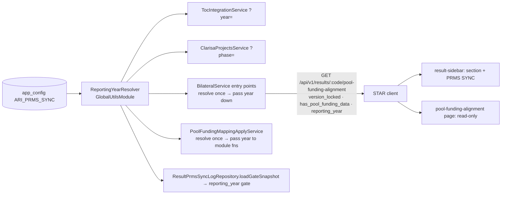

# Design — Bilateral / Pool Funding Reporting Year

- **Module:** bilateral
- **Spec id:** 2026-10-pool-funding-reporting-year
- **Status:** draft (judgment-day round 1 fixes applied — see `judgment.md`)
- **Owner:** d.casanas@cgiar.org
- **Linked requirements:** ./requirements.md
- **Linked detailed design:** ../../../trd/trd.md (§9.1 integrations; Results endpoints list)
- **Baseline commit:** `ec490da3c`
- **Last updated:** 2026-10-08

---

## 0. Executive summary

A singleton **`ReportingYearResolver`** (DataSource-only, uncached, global) reads
`app_config.ARI_PRMS_SYNC`. It accepts only a 4-digit year and otherwise falls back to `2026`.
Each request resolves the year **once at its entry point** and passes it down as a parameter;
no helper reads it on its own (D-10).

Every reader of the env var and of the constant `MAPPABLE_LIVE_VERSION` switches to that value.
The Pool Funding alignment read gains `has_pool_funding_data` and `reporting_year`. One new
server guard, `assertReportingYearWritable`, runs on every Pool Funding write and replaces the
PATCH's ToC-only year guard. The PRMS sync ladder gains a non-persisting `reporting_year` entry.

On the client:
- `BilateralService.editable` turns false for an other-year result.
- The sidebar shows the section when the result has data.
- The PRMS SYNC button is not rendered for an other-year result.
- The page shows a `reporting-year` read-only banner, which replaces the ToC version-locked banner.

**Budget (tripwire for `/akili-execute`):** **9 tasks · ~850 LOC incl. tests · ~13 review rounds** (re-derived after judgment round 1; existing spec realignment in toc/clarisa/sidebar/bilateral/sync-gate suites is most of the LOC). This stays within Standard depth.

---

## 1. Goals & non-goals

| Goals | Req |
| --- | --- |
| One admin-editable year, one resolver, zero env/constant readers | R-PRY-001, 002 |
| Other-year results with data: visible, read-only, no PRMS SYNC button | R-PRY-003, 006 |
| Lock enforced by the API | R-PRY-004, 005 |

**Non-goals:**
- No new admin UI. The existing config admin and `PATCH /api/configuration/:key` edit the row.
- The client does not read `app_config` (D-3).
- No change to:
  - the PRMS sync card or history content
  - the feature toggles
  - `MappingPhaseResolver` / `ARI_CLARISA_PROJECTS_PHASE` (the mapping picker's phase, a different setting)
- No schema change.
- No new external-source gate on the contribution endpoints. `getEditableContributionContext` today calls only `assertPrmsSourceWritable` (`bilateral.service.ts:1785`); that gap pre-exists and is out of scope (§14 OQ-3).

---

## 2. Architecture

### 2.1 Composition

**Server**

| Path | Change |
| --- | --- |
| `server/…/src/domain/shared/utils/reporting-year.resolver.ts` | **New.** `resolve(): Promise<number>`. Reads the active `ARI_PRMS_SYNC` row via `DataSource`. Trimmed value must match `^\d{4}$`; otherwise it returns `DEFAULT_REPORTING_YEAR = 2026` and logs `warn` with the key and raw value. No cache (D-2) |
| `server/…/src/domain/shared/utils/global-utils.module.ts` | Provide + export the resolver |
| `server/…/src/domain/entities/app-config/enum/app-config-key.enum.ts` | + `ARI_PRMS_SYNC` |
| `server/…/src/db/migrations/<ts>-seedPrmsSyncReportingYear.ts` | **New.** `INSERT IGNORE` the row (`'2026'`, `API`/`PRMS`, description), with a comment explaining why not `ON DUPLICATE KEY UPDATE` (D-11). `down` deletes the row |
| `server/…/src/domain/shared/utils/app-config.util.ts` | − `ARI_PRMS_SYNC` getter |
| `server/…/src/domain/shared/utils/env.utils.ts` | − `PRMS_SYNC_YEAR` getter |
| `server/…/.env.example` | − `ARI_PRMS_SYNC` line + comment |
| `server/…/src/domain/tools/toc-integration/toc-integration.service.ts` | Year passed by the caller (`getTocResultsForSps(…, year)`, `getTocResults(…, year)`); the service does not resolve it per (sp, level) call. Split `cacheKey()` (:156, used for the internal cache at :58 and the public Map key at :140): the internal key becomes `${year}:${sp}:${level}`, the public Map key stays `${sp}:${level}` (D-4). Rewrite the "process-constant" comment |
| `server/…/src/domain/tools/clarisa/projects/clarisa-projects.service.ts` | Phase from the resolver. The cache records `phase`. A phase mismatch is a cache miss, and the stale-on-error path (:264-271) serves cached data only if its phase matches; otherwise it falls through to the existing cold-cache error path (D-4). Drop the now-unused `AppConfig` injection. Rewrite the comment |
| `server/…/src/domain/entities/bilateral/utils/toc-level-rules.util.ts` | − `MAPPABLE_LIVE_VERSION` export and its doc block (:25-31). A missed reader then fails to compile (D-5) |
| `server/…/src/domain/entities/bilateral/bilateral.service.ts` | **Entry points** resolve the year once (`getHlosIndicatorsForResult`, `getAlignment`, `updateAlignment`, `upsertContribution`, `deleteContribution`, `listIndicators`). `getAlignment` is split into a private `buildAlignment(…, year)`; `updateAlignment` (:878) and `listIndicators` (:1474) call it with their own year instead of re-entering the public method. `getEditableContributionContext(resultId, year)` gains the year parameter. The ToC catalog is fetched with the caller's year: `getTocResultsForSps(…, year)` → internal fetch (D-10). **Sync helpers** take `year` as a parameter: `toWireTocResult`/`toWireTocIndicator` (:439/:464, called in `.map` :449), `resolveLiveTargetValue` (:485, callers :472, :1462), `validateTocAlignments` (:1244, :1463). Also: + `has_pool_funding_data`, `reporting_year` in `getAlignment`; + `assertReportingYearWritable(context, year)`; − `assertTocMappingVersionUnlocked` and its call (:779-781) (D-8); comments :346, :459, :1088 updated |
| `server/…/src/domain/entities/bilateral/bilateral.controller.ts` | Swagger 409 description: `toc_mapping_version_locked` → `pool_funding_year_locked` |
| `server/…/src/domain/entities/bilateral/dto/{update-pool-funding-alignment,bilateral-hlos-indicators.response}.dto.ts` (the alignment response type lives in `update-pool-funding-alignment.dto.ts:259`) | Descriptions/examples say "configured reporting year (`app_config.ARI_PRMS_SYNC`)"; + the two new response fields |
| `server/…/src/domain/entities/prms-webhook/pool-funding-mapping-apply.service.ts` | Inject the resolver (constructor sites: `pool-funding-mapping-apply.service.spec.ts`). Resolve once in `apply` (:461), then pass `year` through `applyUnsafe` (:471) → `resolveIndicator` (:585, called :520) → module-level `liveTargetValue(indicator, year)` (:252, called :640) and `targetYear` (:641). `withResolvedIndicator` (:229) reads no year and is unchanged (D-7, D-10) |
| `server/…/src/domain/tools/prms-normalizer/response/prms-sync-response.interpreter.ts:219` | Comment only |
| `server/…/src/domain/entities/result-prms-sync/eligibility/sync-gate.ts` | `SyncGateSnapshot` gains **optional** `report_year?: number \| null`, `reporting_year?: number`; `SyncGateEntryId` gains `'reporting_year'`. + entry after `not_already_synced`, `persistsRow: false`, 409. It fails when `reporting_year` is present and `Number(report_year) !== reporting_year` (a null year counts as a mismatch, consistent with `version_locked`); absent `reporting_year` → passes (D-6) |
| `server/…/src/domain/entities/result-prms-sync/repositories/result-prms-sync-log.repository.ts` | `loadGateSnapshot` (:133): SELECT adds `r.report_year_id`. Inject the resolver (constructor :107; `new ResultPrmsSyncLogRepository(` sites in its `.spec` and `test/result-prms-sync-claim-concurrency.integration-spec.ts`) and set `reporting_year` |

**Client**

| Path | Change |
| --- | --- |
| `client/…/shared/interfaces/bilateral/pool-funding-alignment.interface.ts` | + `has_pool_funding_data?`, `reporting_year?`; rewrite the `version_locked` comment (:46) |
| `client/…/shared/services/bilateral.service.ts` | `editable`: `version_locked === true` → `false` |
| `client/…/shared/components/result-sidebar/result-sidebar.component.{ts,html}` | Year rule becomes "hide only when there is no data". PRMS SYNC is wrapped in `version_locked !== true`. Rewrite the gate comment (:102-118) |
| `client/…/pages/result/pages/pool-funding-alignment/pool-funding-alignment.component.{ts,html}` | `readOnlyCause` restructure + `reporting-year` banner. The ToC version-locked banner is suppressed under that cause, and its copy becomes year-aware. `isVersionLocked409` also matches `pool_funding_year_locked` |

### 2.2 Reuse

- `DataSource`-only singleton pattern from `MappingPhaseResolver` / `EnvAppConfigUtil`. This avoids `AppConfigService`'s REQUEST scope (`mapping-phase.resolver.ts:11-15`).
- `readOnlyCause` banner set, `SYNC_GATE_ENTRIES` ladder, `GlobalExceptions` 409 packing (`bilateral.service.ts:1101-1108`).

---

## 3. Data model

No schema change. One seed row:

| key | simple_value | category | subcategory | description |
| --- | --- | --- | --- | --- |
| `ARI_PRMS_SYNC` | `2026` | `API` | `PRMS` | Reporting year: PRMS sync, Pool Funding editing, ToC year, CLARISA projects phase |

`app_config` has `PRIMARY KEY (key)` (`1752097721168-addAppConfigTable.ts:8`). The category columns are `text`, and the enums do not constrain them. The `API` category has precedent (`API`/`CLARISA`).

---

## 4. API surface

The Pool Funding handlers are `@Version('1')` (8× in `bilateral.controller.ts`; route `${RESULT_CODE}/pool-funding-alignment`, `main.routes.ts:91`). `prms-sync` is unversioned (`main.routes.ts:95`).

| Endpoint | Delta | Errors |
| --- | --- | --- |
| `GET /api/v1/results/:code/pool-funding-alignment` | + `has_pool_funding_data: boolean`, + `reporting_year: number`; `version_locked` = `report_year_id ≠ reporting_year` | — |
| `GET /api/v1/results/:code/pool-funding-alignment/hlos-indicators` | `version_locked` and the live-version field from the resolved year | — |
| `PATCH /api/v1/results/:code/pool-funding-alignment` | year guard on every body; `toc_mapping_version_locked` removed | 409 `{ errors: { description: "Pool Funding is read-only: result year <y> is not the reporting year <r>", code: "pool_funding_year_locked" } }` |
| `POST/PATCH/DELETE /api/v1/results/:code/pool-funding-alignment/indicators/:indicatorCode/contribution` | same guard | same 409 |
| `POST /api/results/:code/prms-sync` | gate `reporting_year` | 409, description naming both years, no log row |

---

## 5. Workflows & business rules

**Year threading (D-10).** Each entry point listed in §2.1 calls `resolver.resolve()` once. It passes the number to every helper it calls, the ToC catalog fetch included; helpers and nested calls never resolve on their own. One request therefore sees exactly one year, even if an admin saves the row mid-request.

**`has_pool_funding_data`** = `has_contribution !== null` OR `is_synced_to_prms` OR `prms_result_code !== null`.
- All three values are already loaded by `getAlignment` (`bilateral.service.ts:640-657`).
- The sidebar card renders only with history events **and** a PRMS code (`result-sidebar.component.ts:181-184`). So a past-year result that would show a card always satisfies the third term.
- History-only refusal rows without a code (possible: `approved` persists before `alignment_green`, `sync-gate.ts`) show no card today either, so hiding those results loses nothing (JD-3).

**Write guard order:**

| Function | Order |
| --- | --- |
| `updateAlignment` | `assertPrmsSourceWritable` → `assertNonPrmsExternalSourceWritable` → **`assertReportingYearWritable`** → contributor (400) → already synced (409) → lever normalization → … (`assertTocMappingVersionUnlocked` removed) |
| `getEditableContributionContext` (used by `upsertContribution` :1536 and `deleteContribution` :1624) | `assertPrmsSourceWritable` → **`assertReportingYearWritable`** → contributor → already synced |

Response changes for other-year results:
- A past-year non-contributor gets `409 pool_funding_year_locked` instead of `400`.
- A past-year synced result gets the year 409 instead of "already synced".

Both are deliberate: the year is the more permanent reason. Neither case is reachable from the UI, because non-contributors don't see the section and locked results show no Save. All guards run before any transaction or socket emit.

**Sidebar visibility** (`shouldHidePoolFundingTab`, the single choke point):

| Condition | Result |
| --- | --- |
| `indicator_id === 5` · no alignment · `eligible === false` (unless `display_only`, §5.x — amended 2026-10-08) · section flag off | hidden (unchanged) |
| `version_locked === true` AND `has_pool_funding_data !== true` | hidden |
| `version_locked === true` AND `has_pool_funding_data === true` | **shown** |
| otherwise | shown (unchanged) |

Both flags are compared with `=== true`. A server that omits `has_pool_funding_data` keeps today's behavior (hidden when locked), which is consistent with the existing fail-open spec (`result-sidebar.component.spec.ts:443`).

**PRMS SYNC button:** rendered only when all of these hold: `hasPoolFundingOption()`, `prmsSyncButtonEnabled()`, and `version_locked !== true`. The loading / card / legacy-code block below it stays inside `hasPoolFundingOption()` and still renders.

**Page read-only cause:** computed from the alignment, first match wins.

| # | Condition | Cause |
| --- | --- | --- |
| 1 | `is_read_only && !is_synced_to_prms && display_only !== true` | `prms-sourced` |
| 2 | `version_locked === true` | **`reporting-year`** |
| 3 | `display_only === true` *(amended 2026-10-08, R-PRY-007)* | `display-only` |
| 4 | `is_synced_to_prms` | `synced` |
| 5 | `!editable()` | `permission` |

*Amended 2026-10-08 (R-PRY-007, T-11 review).* The server ORs `display_only` into `is_read_only`, so row 1 must exclude it. Otherwise every unsynced display-only result would read as `prms-sourced`. As a known consequence, a PRMS-imported non-eligible live result shows the display-only banner, not "owned by PRMS". The client cannot tell the two apart without a server `is_prms_sourced` field (owner's call). `display-only` banner copy, pending owner sign-off at the T-09 HITL: "This result's contract does not contribute to Pool Funding. The saved Pool Funding record below is shown for reference and is read-only." 

Under `reporting-year`, the ToC block banner (`pf-alignment-version-locked-banner`, html :379-384) is suppressed, so only one banner explains the lock. The synced badge (`pf-alignment-synced-badge`, html :22-28) is re-keyed from `readOnlyCause() === 'synced'` to `isSyncedToPrms()`, so it still shows on a past-year synced result.

**409 on the client:** `isVersionLocked409` (ts :1042) also matches `pool_funding_year_locked`. This covers the case where the year changes while a page is open. The old code stays matched for an older server.

**Year propagation:**
- Gates and alignment flags use the new year on the next request (no cache).
- The ToC catalog is year-keyed.
- CLARISA refetches on its first call after the change. On upstream failure it does not serve an old-phase stale feed.

---

### 5.x Display-only for non-eligible results with a record (R-PRY-007, amended 2026-10-08)

**Server, `BilateralService.getAlignment`:**
- `findPoolFundingAlignmentContext` also selects `r.is_snapshot`.
- `displayOnly = !eligible && (isSnapshot || isSyncedToPrms || context.prms_result_code != null)`.
- `visibleAlignment = eligible || displayOnly ? alignment : null`. `toc_alignments` follows the same gate, and `has_pool_funding_data` is computed from `visibleAlignment`, as today.
- `is_read_only` becomes `isPrmsSourced || isSyncedToPrms || displayOnly`.
- The response gains `display_only: boolean`, with Swagger on the DTO.
- `eligible` stays the raw contract fact, because write paths and the picker key on it.
- Write paths are untouched (`updateAlignment` contributor 400, `getEditableContributionContext`).

**Client:**
- `AlignmentResponse.display_only?: boolean`.
- Sidebar `shouldHidePoolFundingTab`: `alignment.eligible === false` becomes `alignment.eligible === false && alignment.display_only !== true`. The year rule (`version_locked && !has_pool_funding_data`) still applies afterwards.
- Sidebar PRMS SYNC button: rendered only when `version_locked !== true && display_only !== true`.
- Pool Funding page:
  - The constructor redirect `alignment.eligible === false` becomes `alignment.eligible === false && alignment.display_only !== true`.
  - The page is read-only through `is_read_only`, so `editable` is false.
  - `hideSave` also covers `display_only === true`.
  - It reuses the grey permission banner recipe with cause `display-only`, inserted after `reporting-year` in the cause order. When `reporting-year` applies, that banner wins, keeping one banner.
- The picker and any eligible-only fetch are not called when `display_only`. The page must not request eligible-only endpoints for a non-eligible result.

**Out of scope:**
- The versioning SP moving Pool Funding rows from live to snapshot.
- The PRMS import not setting a primary contract.
- `is_synced_to_prms` not being copied to the snapshot.

These are recorded for the owner, not changed here.

## 6. Frontend

| Surface | Change |
| --- | --- |
| `BilateralService.editable` | `if (alignment.version_locked === true) return false;` placed after the `is_read_only` check. `editable` is consumed only by the Pool Funding page |
| `readOnlyCause` | Restructure per the §5 cause table. New banner `data-testid="pf-alignment-reporting-year-banner"` reusing the grey `permission` recipe. Copy: *"This result belongs to reporting year {report year}. Pool Funding alignment is only editable for {reporting_year}; the data below is read-only."* |
| `VERSION_LOCKED_BANNER` | Constant → computed from `alignment().reporting_year` (no `2026` literal). Rendered only when the cause ≠ `reporting-year` |
| Tokens | None new |

**Data-changing controls and what makes them inert** (P-9, verified by both judges):

| Control | Binding | Inert via |
| --- | --- | --- |
| Contribution radios (html :114, :125) | `[disabled]="!editable() \|\| isReadOnly()"` | `editable` |
| Science Program card select (html :222-224) | `toggleSp` early return (ts :628) | `editable`. The card stays focusable; T-08 adds `aria-disabled` and drops the hover affordance when it is not editable |
| Make Primary (html :263) | `@if (editable() && !isReadOnly() && !primaryControlDisabled())` + guard ts :679 | `editable` |
| ToC block radios / selects / suggestions / quantitative contribution input (`sp-toc-alignment-block.component.html` :62, :73, :152, :193, :262, :306, :414) | `[disabled]="disabled()"` ← `blocksDisabled()` (includes `!editable()`) | `editable` |
| Save (`app-navigation-buttons`, html :486) | `[showSave]="editable() && !isReadOnly()"`; `canSave` checks `editable` (ts :383) | `editable` |
| Save, past reporting year (amended 2026-10-08, owner decision at T-08) | The shared `NavigationButtonsComponent` renders Save whenever `isEditableStatus() \|\| showSave`, so `showSave=false` alone leaves a disabled Save on screen. It gains an opt-in `@Input() hideSave = false` that suppresses the button. The Pool Funding page passes `[hideSave]="alignment()?.version_locked === true"`. Owner: *"el save solo debería aparecer cuando el resultado está con el año configurado; de resto no debería salir"*. The default `false` leaves every other screen unchanged | `version_locked` |

Controls that stay active but change nothing: help buttons (html :11, :88) and catalog retry (html :370; block :129). The page has no justification or lever control. The client never calls the contribution endpoints, so their lock is server-only.

---

## 7. Integration impact

- lambda-toc `?year=` and CLARISA `?phase=` now always carry a value (default `2026`). Before, an unset env omitted the param. Whether any deployed environment relied on that is **P-6 (UNVERIFIED)**.
- No new env var. One env var is retired.

## 8. Security

- The row is edited only through the existing `PATCH /api/configuration/:key` (`TECHNICAL_SUPPORT`, `SYSTEM_ADMIN`). The GET is excluded from `JwtMiddleware` (`app.module.ts:90-93`); it is not used by this design.
- The new 409s only narrow write access.

## 9. Observability

- The resolver logs `warn` on fallback, naming the key and the raw value.
- The `reporting_year` refusal writes no sync-log row (D-6). The 409 is visible in the response and in the HTTP log.

## 10. Testing strategy

| Suite | Cases |
| --- | --- |
| `reporting-year.resolver.spec.ts` | `'2027'`, `' 2027 '` → 2027; missing / inactive / `''` / `'abc'` / `'20265'` / `'2026.5'` → 2026 + warn; row changed between two calls → second value |
| `toc-integration.service.spec.ts` | URL carries the passed year; year change → refetch; public Map key unchanged (`${sp}:${level}`) |
| `clarisa-projects.service.spec.ts` | `?phase=` from the resolver; phase change → refetch inside the TTL; phase change + upstream error → no stale old-phase data |
| `bilateral.service*.spec.ts` | `version_locked` for resolver 2026 / 2027; `has_pool_funding_data` matrix (null/no, false/no, null/synced, null/code); `reporting_year` echoed; helpers use the passed year (target year, target-date filter) |
| `bilateral.service.updateAlignment*.spec.ts` | 2025 + legacy body → 409 `pool_funding_year_locked`, no save or emit; 2026 → passes; PRMS-sourced 2025 → PRMS 409 (order); 2025 non-contributor → year 409; 2025 synced → year 409; former `toc_mapping_version_locked` cases realigned |
| contribution upsert/delete specs | 2025 → 409 for POST, PATCH, DELETE |
| `sync-gate.spec.ts` + `result-prms-sync-log.repository.spec.ts` + `result-prms-sync.service.spec.ts` | year mismatch → `reporting_year` refusal, Normalizer not called, no log row; fields absent → gate passes |
| `pool-funding-mapping-apply.service.spec.ts` | target year = resolved year |
| `result-sidebar.component.spec.ts` | each row of the §5 table; PRMS SYNC absent when locked + data; card still renders |
| `pool-funding-alignment.component.spec.ts` | the §5 cause table (including past-year synced → `reporting-year`); single banner; every §6 control disabled; no Save; `pool_funding_year_locked` 409 → locked state |
| client `bilateral.service.spec.ts` | `editable` false when `version_locked` |

Fixtures vary **both** year and data per case (KZ-004).

**Known `SyncGateSnapshot` / fact builders that must still compile** (the fields are optional, so these build unchanged; listed for the consumer sweep):
- `result-prms-sync.service.ts` (+ `.spec`)
- `result-prms-sync.controller.spec.ts`
- `result-prms-sync-log.repository.ts` (+ `.spec`)
- `sync-gate.ts` (+ `.spec`)
- `knowledge-product.builder.spec.ts`
- `test/result-prms-sync-claim-concurrency.integration-spec.ts`

**Integration suites touched by the resolver:** `test/bilateral-primary-contributing-sp.integration-spec.ts` uses `report_year_id` 2025 and 2026 and needs the seeded row or a resolver stub.

## 11. Rollout

1. Merge to `dev`. The Jenkins deploy runs `migration:execute`, which seeds the row (root `CLAUDE.md` §4.3, 2026-08-27 correction).
2. **Prod:** run `npm run typeorm migration:show -- -d ./src/db/config/mysql/orm.config.ts` and normalize the ANSI output before counting (K-014). Apply the migration before or with the deploy. If it is late, the resolver falls back to 2026 (NFR-PRY-002).
3. Ops may remove `ARI_PRMS_SYNC` from the server `.env` files. Leaving it is harmless.
4. **Year-change runbook:** edit the row. It takes effect on the next request (CLARISA on its next call). All results of the previous year become read-only at that moment (R-1).
- **Backout:** revert the code. The seeded row is inert without readers.

---

## 12. Design decisions

| # | Date | Decision | Rationale | Rejected |
| --- | --- | --- | --- | --- |
| D-1 | 2026-10-08 | Key `ARI_PRMS_SYNC`, `API`/`PRMS` | The user's name for it; `ARI_*` = server-read keys (`pool-funding-feature-toggles` D-1) | `POOL_FUNDING.REPORTING_YEAR` |
| D-2 | 2026-10-08 | Resolver uncached | K-016: a TTL makes saves look broken. One PK lookup per entry-point call (D-10) | 5-min TTL |
| D-3 | 2026-10-08 | The client never reads the key; the server computes the flags (closes OQ-1) | One comparison, in one place | Client compares itself |
| D-4 | 2026-10-08 | Year/phase enters the internal ToC and CLARISA cache keys; stale-on-error only for the same phase | Both caches assume a process-constant year (`toc-integration.service.ts:~70-76`, `clarisa-projects.service.ts:236-242`) | Leave the caches: up to 5 min of wrong-year data |
| D-5 | 2026-10-08 | Delete `MAPPABLE_LIVE_VERSION` | The compiler then finds every reader | Keep it as the fallback |
| D-6 | 2026-10-08 | Gate `reporting_year` after `not_already_synced`, **`persistsRow: false`**, optional snapshot fields | Under JD-3 a year mismatch is not a verdict on the result's content, and a refused attempt must not create history (JD-3 finding) | Persisted gate before `approved` (round-0 draft) |
| D-7 | 2026-10-08 | Webhook apply and target-year writes use the configured year (closes OQ-2) | Identical while the year is 2026 | Result's own year |
| D-8 | 2026-10-08 | **Remove** `assertTocMappingVersionUnlocked`; `pool_funding_year_locked` supersedes `toc_mapping_version_locked` on the PATCH | It became unreachable behind the general guard (judgment JD-9). Dead code that still reads as a rule misleads the next reader | Keep both (round-0 draft; claim "keeps the codes apart in tests" was false) |
| D-9 | 2026-10-08 | `reporting-year` cause outranks `synced`; one banner | The year is the permanent reason; two banners were redundant | Synced first |
| D-10 | 2026-10-08 | Resolve once per entry point; helpers take `year` as a parameter | Sync helpers, `.map` callbacks and module-level functions cannot await. One year per request | Make each helper async |
| D-11 | 2026-10-08 | Seed with `INSERT IGNORE`, commented | Never overwrite an admin edit. Differs from the `1786738949211` precedent on purpose | `ON DUPLICATE KEY UPDATE` |

### 12.1 Reversion challenge (Step 2.3)

| Reverted behavior | "What does removing this break?" | Answer |
| --- | --- | --- |
| Sidebar hides every other-year result (`result-sidebar.component.ts:122`) | Past-year results with no data would show an empty, locked section | Hidden when `has_pool_funding_data !== true` |
| | `general-information` / `alliance-alignment` re-fetch the alignment to refresh visibility | Same signal and choke point; still works |
| | Sidebar specs asserting "locked → hidden" (`result-sidebar.component.spec.ts` :407, :418, :455) | Stay green. Their fixtures omit `has_pool_funding_data`, so `!== true` keeps today's hide (§5); no red is predicted. Past-year visibility is covered by new cases that set the flag |
| `toc_mapping_version_locked` 409 on the PATCH (R-BIL-097 AC.2/AC.3) | The client 409 matcher keys on it; specs in `bilateral.service.updateAlignment.tocAlignments.spec.ts` and the controller Swagger text cite it | The client also matches the new code (old kept for an older server); specs realigned; Swagger updated. The `/usr/bin/grep -rln toc_mapping_version_locked` sweep finds 3 server files + the client page and its spec |
| Unset env → `?year=` / `?phase=` omitted | An environment that relied on omission would now send `2026` | P-6 UNVERIFIED; settled at the HITL pause |
| The PATCH allowed on other years without `toc_alignments` | The current-year behavior is unchanged | Superseded for other-year results only (R-PRY-004) |

---

## 13. Premise Ledger

**Count:** 13 verified · 1 `UNVERIFIED` (High 0, Low 1).
**Blast-radius triggers:**
- `live-path`: the user opens a past-year result.
- `shared-state`: `BilateralService.editable` / `currentAlignment`; `SyncGateSnapshot`.
- `consumer`: removed export `MAPPABLE_LIVE_VERSION`; removed getters; response shape; error code `toc_mapping_version_locked`; DOM hook `sidebar-prms-sync-button`.

| # | Claim | Class | Citation (as run) | Verified at | If false | Settled by |
| --- | --- | --- | --- | --- | --- | --- |
| P-1 | The section's year gate is the constant, not the env | location | `toc-level-rules.util.ts:31`; `bilateral.service.ts:379,662,1101` | `ec490da3c` | High: R-PRY-002 scope | — |
| P-2 | Env/constant readers | consumer | `/usr/bin/grep -rc "ARI_PRMS_SYNC\|PRMS_SYNC_YEAR\|MAPPABLE_LIVE_VERSION" server/researchindicators/src server/researchindicators/test client/research-indicators/src` → 56 hits / 17 files (P-2a) | `ec490da3c` | High: missed reader | — |
| P-3 | Client readers of `version_locked`: sidebar (gate), pool-funding page (`versionLocked`), interface, `toc-catalog.fixture`, `api.service.spec`, sidebar/page/general-information specs; comment-only mentions in `general-information` and `alliance-alignment` | consumer | `/usr/bin/grep -rln "version_locked" client/research-indicators/src` → 10 files | `ec490da3c` | Low | — |
| P-4 | `AppConfigService` is REQUEST-scoped; singletons read `app_config` via `DataSource`; `GlobalUtilsModule` is `@Global` and imported by app, microservice, and cron modules | other | `mapping-phase.resolver.ts:11-15`; `env-app-config.util.ts:12-16`; `global-utils.module.ts:10` | `ec490da3c` | High: DI design | — |
| P-5 | ToC and CLARISA caches exclude the year from their key; `cacheKey()` serves both the internal and the public key; CLARISA serves stale on error | existence | `toc-integration.service.ts:58,140,156`; `clarisa-projects.service.ts:236-242,264-271` | `ec490da3c` | Low | — |
| P-6 | Deployed environments set `ARI_PRMS_SYNC=2026` | data-env | `UNVERIFIED — confirm at source before relying on it` (only `.env.example:59` and the local `.env` read) | — | Low: outbound URL change in an env that omitted it | Owner at the tasks HITL pause (`user-stated` until then) |
| P-7 | `getAlignment` already loads `has_contribution`, `is_synced_to_prms`, `prms_result_code` | existence | `bilateral.service.ts:640-657` | `ec490da3c` | Low | — |
| P-8 | Live path: result page fetches the alignment for every STAR result (`result.component.ts:50-61`) → `BilateralService.currentAlignment` → sidebar `shouldHidePoolFundingTab` (:119-124), PRMS block (html :177-235), page `readOnlyCause` (ts :222) | live-path | cited lines | `ec490da3c` | High | — |
| P-9 | Every data-changing page control is inert when `editable()` is false; none of justification, levers, or contribution add/edit/delete exists on the page | shared-state | §6 table (both judges, round 1) | `ec490da3c` | High | — |
| P-10 | The sidebar card needs history events **and** a PRMS code; `approved` persists refusal rows before `alignment_green` | other | `result-sidebar.component.ts:181-184`; `sync-gate.ts` ladder (`approved` `persistsRow: true` precedes `alignment_green`) | `ec490da3c` | High: `has_pool_funding_data` hides a card | — |
| P-11 | Contribution endpoints funnel through `getEditableContributionContext`, which calls only `assertPrmsSourceWritable` | location | `bilateral.service.ts:1536,1624,1775-1796`; controller :264, :302, :340 | `ec490da3c` | High | — |
| P-12 | Sync year readers: `toWireTocResult` / `toWireTocIndicator` (:439/:464, `.map` at :449); `resolveLiveTargetValue` (:485; :472, :1462); `assertTocMappingVersionUnlocked` (:1098); in mapping-apply, module-level `liveTargetValue` (:252) via `apply` :461 → `applyUnsafe` :471 → `resolveIndicator` :585 (:520, :640-641); nested `getAlignment` calls from `updateAlignment` :878 and `listIndicators` :1474; per-pair `getTocResults` inside `getTocResultsForSps` (:130-140) | location | cited lines (round-1 A-1/B-2; round-2 RA-1/RB-1, RA-2/RB-2, RB-3) | `ec490da3c` | High: D-10 threading incomplete | — |
| P-13 | The gate snapshot loader is `ResultPrmsSyncLogRepository.loadGateSnapshot`: raw SQL without `report_year_id`, DataSource-only; snapshot builders in 9 files | consumer | `result-prms-sync-log.repository.ts:133-170`; `/usr/bin/grep -rln "SyncGateSnapshot\|loadGateSnapshot" server/researchindicators/src server/researchindicators/test` → 9 files (§10 list) | `ec490da3c` | High: gate cannot evaluate | — |
| P-14 | `toc_mapping_version_locked` readers: 3 server files + the client page matcher and its spec | consumer | `/usr/bin/grep -rln toc_mapping_version_locked server/researchindicators/src server/researchindicators/test` → `bilateral.service.ts`, `bilateral.controller.ts`, `bilateral.service.updateAlignment.tocAlignments.spec.ts`; client `pool-funding-alignment.component.ts:1044` + `pool-funding-alignment.component.spec.ts` | `ec490da3c` | High: D-8 breaks an unlisted reader | — |

**P-2a, the 17 files (hit count):**
- toc-integration.service.spec 11
- toc-integration.service 2
- clarisa-projects.service 2
- clarisa-projects.service.spec 8
- prms-sync-response.interpreter 1
- env.utils 2
- app-config.util 2
- update-pool-funding-alignment.dto 3
- bilateral-hlos-indicators.response.dto 2
- bilateral.service 11 (1 import, 3 comments, 7 code lines)
- bilateral.service.getHlosIndicatorsForResult.spec 2
- toc-level-rules.util.spec 3
- toc-level-rules.util 1
- pool-funding-mapping-apply.service 3
- client result-sidebar.component.spec 1
- client result-sidebar.component 1
- client pool-funding-alignment.interface 1

---

## 14. Open questions

- **OQ-3** — The contribution endpoints lack the external-source (TIP/AICCRA) gate that `updateAlignment` has. This pre-exists and is out of scope; carried forward. Owner: d.casanas.
- OQ-1 → D-3, OQ-2 → D-7.

## 15. References

- `docs/specs/bilateral/pool-funding-feature-toggles/`
- `docs/specs/archive/2026-08-18-bilateral--clarisa-phase-config-variable/`
- `docs/specs/bilateral/prms-sync/`
- `./judgment.md`
