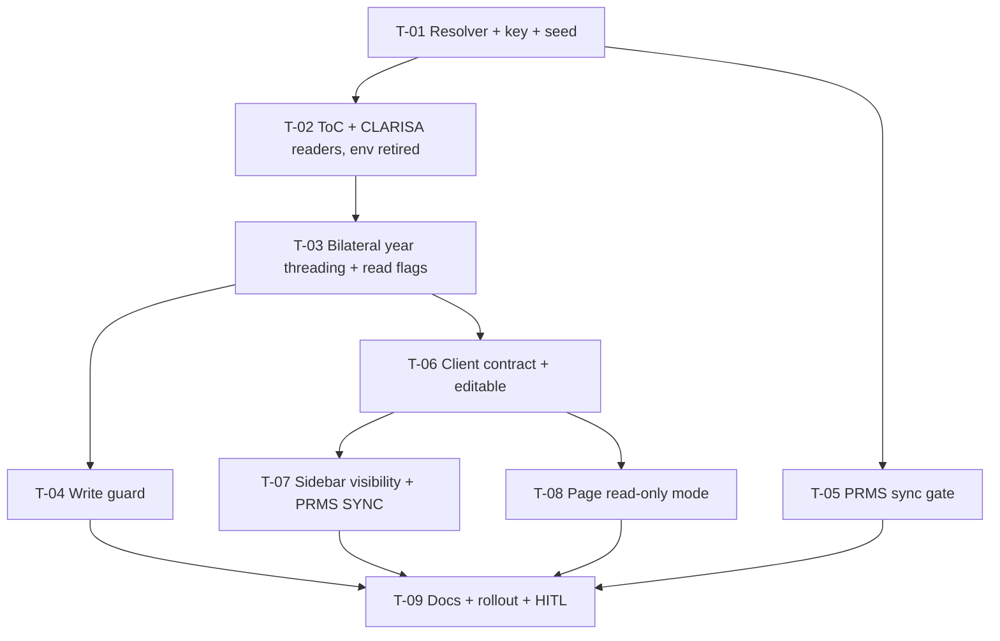

# Tasks — Bilateral / Pool Funding Reporting Year

- **Module:** bilateral
- **Spec id:** 2026-10-pool-funding-reporting-year
- **Status:** in-progress
- **Owner:** d.casanas@cgiar.org
- **Linked requirements:** ./requirements.md
- **Linked design:** ./design.md (judgment: ./judgment.md — APPROVED)
- **Baseline commit:** `ec490da3c`
- **Last updated:** 2026-10-08
- **Budget (tripwire):** 9 tasks · ~850 LOC · ~13 review rounds (design §0)

---

## 1. Conventions for every task

**Verification commands**

| Package | Commands |
| --- | --- |
| Server (`server/researchindicators`) | `npm test -- --silent <paths>` · `npx eslint <changed paths>` (never `npm run lint`, K-001) · `npx tsc --noEmit -p tsconfig.json` |
| Client (`client/research-indicators`) | `npm test -- --silent <paths>` · `npm run lint -- --quiet` · `npx tsc --noEmit -p tsconfig.spec.json` |

**Compile gate (design D-5).** The server type-check is stricter than Jest, so every server task runs the server `tsc` command. Falsifier: assign a `string` where the year `number` is expected → `tsc` red while Jest is still green.

**Red runs.** Every expected red is **observed** by the Implementer during execution and quoted verbatim in `execution.md`, never predicted (K-004 / KZ-014). A red from setup, a timeout, or an unmatched mock does not count.

**Full suite.** The Leader re-runs the full suite of the touched package after each worker reports (root `CLAUDE.md` §4.3, concurrency).

**Fixtures (KZ-004).** Every fixture that distinguishes year behavior varies **both** the result year and the configured year, and the expected value must differ between the correct and the mutated code.

## 2. Dependency graph

**Order:** server tasks run sequentially (one package). Client tasks T-06, T-07 and T-08 are sequential among themselves, but may run in parallel with T-04 or T-05 because they are in a different package. Editing in parallel is safe; running full suites in parallel is not.

---

## 3. Task list

### T-01 — `ReportingYearResolver`, `AppConfigKey.ARI_PRMS_SYNC`, seed migration

- **Status:** done · **Size:** S · **Dependencies:** none
- **Requirements:** R-PRY-001 (both scenarios), NFR-PRY-002
- **Design:** §2.1 rows 1–4, §3, D-1, D-2, D-11
- **Scope:**
  - New `src/domain/shared/utils/reporting-year.resolver.ts`:
    - `DataSource`-only singleton, no cache.
    - Trimmed value must match `^\d{4}$`; otherwise return `DEFAULT_REPORTING_YEAR = 2026` and log a `warn` naming the key and the raw value.
    - Reads only rows with `is_active = true`.
  - Register it in `global-utils.module.ts` (providers + exports).
  - Add `ARI_PRMS_SYNC` to `app-config-key.enum.ts`.
  - New migration `<ts>-seedPrmsSyncReportingYear.ts`:
    - `INSERT IGNORE` (`'2026'`, `API`, `PRMS`, description), with a comment on why it is not `ON DUPLICATE KEY UPDATE`.
    - `down` deletes the row.
- **Tests:** `reporting-year.resolver.spec.ts`
  - `'2027'` → 2027
  - `' 2027 '` → 2027
  - missing / inactive / `''` / `'abc'` / `'20265'` / `'2026.5'` → 2026, and `warn` was called
  - row changed between two calls → the second call returns the new value
- **Falsifier:**
  - (a) Add a memo field that returns the first value → the "row changed" case goes red.
  - (b) Replace `^\d{4}$` with `Number.isFinite` → the `'20265'` case goes red.
  - (c) Drop the `is_active` filter → the inactive case goes red. The inactive fixture holds `'2027'`, so the correct and mutated readings differ.
- **Red run:** observed at execute time for (a)–(c), quoted verbatim.
- **Disqualifier:** if the spec mocks the resolver's own parse helper instead of the `DataSource` query result, the test does not prove the read path. Mock only `DataSource`/repository.
- **Consumers:** none yet (new symbol). `global-utils.module.ts` is imported by `app.module.ts:39`, `app-microservice.module.ts:26`, `cron.module.ts:11`; boot is covered by the T-09 e2e boot.
- **Review:** `full` — migration plus a new global provider.
- **Done:**
  - [x] Tests green; falsifiers (a)–(c) observed red, then reverted
  - [x] `tsc` + `eslint` clean
  - [x] Migration `up` checked on a disposable schema, or reviewed against `1786738949211` (Dev DB is shared, so no ad-hoc apply there)
  - [x] Re-running `up` keeps an existing `'2030'` value: `INSERT IGNORE` is asserted by reading the SQL text, because no shared database is touched
- **Skills:** `nestjs-expert`, `tdd`

### T-02 — ToC and CLARISA consume the year; retire the env var

- **Status:** done · **Size:** M · **Dependencies:** T-01
- **Requirements:**
  - R-PRY-002 "Change without deploy": the lambda-toc `year=2027` / CLARISA `phase=2027` clause, and the BUT clause "must NOT serve 2026 cache for 2027"
  - R-PRY-002 "Env var retired": both THEN and AND IT MUST
  - NFR-PRY-001 (ToC/CLARISA half)
- **Design:** §2.1 (`toc-integration`, `clarisa-projects`, `app-config.util`, `env.utils`, `.env.example` rows), §5 year propagation, D-4, D-10
- **Scope:**
  - **First step:** settle **P-6** by asking the owner at this task's start. Record the answer in `execution.md` (owner: T-02).
  - `TocIntegrationService`:
    - `getTocResultsForSps(…, year)` and `getTocResults(…, year)` take the year from the caller.
    - Split `cacheKey()`: the internal key becomes `${year}:${sp}:${level}`; the public Map key stays `${sp}:${level}`.
    - Rewrite the "process-constant" comment.
    - Update the callers' signatures only. Callers pass the year in T-03; until then they pass `await resolver.resolve()` at the call site so the code compiles.
  - `ClarisaProjectsService`:
    - Inject the resolver and drop `AppConfig`.
    - The cache records `phase`; a mismatch is a miss.
    - Stale-on-error serves only when the phase matches.
  - Remove the `AppConfig.ARI_PRMS_SYNC` getter, `ENV.PRMS_SYNC_YEAR`, and the `.env.example` entry.
- **Tests:** `toc-integration.service.spec.ts`, `clarisa-projects.service.spec.ts`. The site list comes from the failing run (K-018), not from grep.
  - URL carries the passed year
  - year A then year B → two fetches
  - public Map key is unchanged
  - CLARISA: phase change inside the TTL → refetch; phase change + upstream error → no old-phase data (cold-cache error path)
- **Falsifier:**
  - (a) Restore the old shared `cacheKey()` → "year A then B" asserts 1 fetch instead of 2 → red.
  - (b) Allow stale-on-error across phases → the "no old-phase data" case goes red.
- **Red run:** observed for (a) and (b) at execute time.
- **Disqualifier:** a fixture where years A and B return identical upstream payloads cannot tell a refetch from a cache hit. The two payloads must differ, and the test asserts on the payload, not only on the call count.
- **Consumers:** `bilateral.service.ts` (`getTocResultsForSps` callers :407, :968, :1370), `pool-funding-mapping-apply.service.ts:612`, and the two specs above. Grep `getTocResultsForSps\|getTocResults(` over `server/researchindicators/src` and `server/researchindicators/test` before editing, and list every hit in `execution.md`.
- **Review:** `checklist` — mechanical rewiring with focused tests.
- **Done:**
  - [x] P-6 answer recorded
  - [x] Tests green, falsifiers observed red
  - [x] `/usr/bin/grep -rn "process.env.ARI_PRMS_SYNC\|PRMS_SYNC_YEAR\|appConfig.ARI_PRMS_SYNC" server/researchindicators/src server/researchindicators/test` → 0. Scope note: this grep cannot see `dist/` or `.env`, which are intentionally out of scope
  - [x] `tsc` + `eslint` clean
- **Skills:** `nestjs-expert`, `tdd`

### T-03 — Bilateral year threading, constant removal, read flags

- **Status:** todo · **Size:** L · **Dependencies:** T-02
- **Requirements:**
  - R-PRY-002: the 2027 editable / 2026 read-only clause of "Change without deploy", the "row wins over env" clause, and the "no constant reader" half of AND IT MUST
  - R-PRY-006: all three THEN/AND clauses
- **Design:** §2.1 (`toc-level-rules.util`, `bilateral.service`, dto rows, `pool-funding-mapping-apply`, interpreter comment), §5 `has_pool_funding_data` and year threading, D-5, D-7, D-10, P-12
- **Scope:**
  - Delete `MAPPABLE_LIVE_VERSION` and its doc block.
  - Entry points resolve the year once: `getHlosIndicatorsForResult`, `getAlignment`, `updateAlignment`, `upsertContribution`, `deleteContribution`, `listIndicators`.
  - Split `getAlignment` into a private `buildAlignment(…, year)`.
  - Thread `year` into `toWireTocResult`/`toWireTocIndicator`, `resolveLiveTargetValue`, `validateTocAlignments`, and `getTocResultsForSps`.
  - `getAlignment` gains `has_pool_funding_data` and `reporting_year`.
  - `pool-funding-mapping-apply`: thread the year `apply → applyUnsafe → resolveIndicator → liveTargetValue`, plus `targetYear` and the `getTocResults(sp, level, year)` call at :612.
  - Update DTO Swagger descriptions/examples and the comments at :346, :459, :1088 and interpreter :219.
  - `assertTocMappingVersionUnlocked` is **not** touched here (T-04).
- **Tests:** `bilateral.service*.spec.ts`, `bilateral.service.getHlosIndicatorsForResult.spec.ts`, `toc-level-rules.util.spec.ts`, `pool-funding-mapping-apply.service.spec.ts`
  - `version_locked` with resolver 2026 vs 2027 against a 2026 result: false, then true
  - `has_pool_funding_data` matrix: (null, unsynced, no code) → false; (false, unsynced, no code) → true; (null, synced) → true; (null, unsynced, code 9746) → true
  - `reporting_year` echoed
  - target year / target-date filter use the passed year (resolver 2027 → `target_year` 2027, target picked by `target_date '2027'`)
  - mapping-apply `targetYear` = resolved year
- **Falsifier:**
  - (a) Hard-code `2026` back into `resolveLiveTargetValue` → the resolver-2027 target case goes red. The fixture carries targets for both 2026 and 2027 with different values.
  - (b) Compute `has_pool_funding_data` as `has_contribution === true` → the `(false, …)` row goes red.
  - (c) Compile gate: re-import a deleted `MAPPABLE_LIVE_VERSION` anywhere → `tsc` red.
- **Red run:** observed for (a), (b) and (c).
- **Disqualifier:** if the resolver mock always returns 2026, no year-sensitive assertion can fail. Every year test must run with a non-2026 configured year at least once.
- **Consumers:**
  - `getAlignment` response shape → client `pool-funding-alignment.interface.ts` (T-06).
  - `version_locked` client readers (P-3: 10 files).
  - The integration suite `test/bilateral-primary-contributing-sp.integration-spec.ts` (years 2025/2026) needs the seeded row or a resolver stub; run `npm run test:integration` for it, because `npm test` does not reach `test/` (KZ-017).
- **Review:** `full` — largest diff, many call sites.
- **Done:**
  - [ ] Tests green, falsifiers observed red
  - [ ] `/usr/bin/grep -rn MAPPABLE_LIVE_VERSION server/researchindicators/src server/researchindicators/test client/research-indicators/src` → 0 code hits (comments rewritten)
  - [ ] `tsc` + `eslint` clean
  - [ ] Integration suite run, result quoted
- **Skills:** `nestjs-expert`, `tdd`

### T-04 — Server write guard `pool_funding_year_locked`

- **Status:** todo · **Size:** M · **Dependencies:** T-03
- **Requirements:** R-PRY-004:
  - "Legacy body on past year": THEN, and AND IT MUST (nothing written, no socket event)
  - "Current year still writable"
  - The contribution POST/PATCH/DELETE clause
  - The source-gates-first clause and the stated response changes
- **Design:** §4 rows 3–4, §5 write guard order table, D-8, P-11, P-14, §12.1 row 4
- **Scope:**
  - `assertReportingYearWritable(context, year)` → 409 `{ description, code: 'pool_funding_year_locked' }`.
  - Placed in `updateAlignment` after both source gates.
  - Placed in `getEditableContributionContext(resultId, year)` after the PRMS gate.
  - Both placements come before the contributor and synced checks and before any transaction or emit.
  - Remove `assertTocMappingVersionUnlocked` and its call.
  - `bilateral.controller.ts`: update the Swagger 409 description.
- **First step:** confirm by grep that `getEditableContributionContext` has exactly the two callers `upsertContribution` and `deleteContribution` (P-11), and that `toc_mapping_version_locked` has only the P-14 readers.
- **Tests:** `bilateral.service.updateAlignment*.spec.ts` and the contribution upsert/delete specs
  - 2025 result + legacy body → 409 `pool_funding_year_locked`; repository `save` and socket emit were **not** called
  - 2026 → passes
  - PRMS-sourced 2025 → PRMS 409 (order)
  - 2025 non-contributor → year 409
  - 2025 synced → year 409
  - Contribution POST, PATCH and DELETE on 2025 → 409 each
  - Former `toc_mapping_version_locked` specs realigned from the failing run (K-018)
- **Falsifier:**
  - (a) Move the guard after the transaction opens → the "save not called" assertion goes red.
  - (b) Wrap the guard in `if (dto.toc_alignments)` → the legacy-body case goes red.
  - (c) Remove the guard from `getEditableContributionContext` → the contribution cases go red.
- **Red run:** observed for (a)–(c).
- **Disqualifier:** a test that asserts only the status code, not "nothing written", cannot catch (a). Both assertions are required.
- **Consumers:**
  - client `pool-funding-alignment.component.ts:1042-1044` matcher (T-08)
  - `pool-funding-alignment.component.spec.ts`
  - `bilateral.controller.ts` Swagger
  - `bilateral.service.updateAlignment.tocAlignments.spec.ts`
- **Review:** `full` — authorization/write gate.
- **Done:**
  - [ ] Tests green, falsifiers observed red
  - [ ] `/usr/bin/grep -rn toc_mapping_version_locked server/researchindicators/src server/researchindicators/test` → 0
  - [ ] `tsc` + `eslint` clean
- **Skills:** `nestjs-expert`, `error-handling-patterns`, `tdd`

### T-05 — PRMS sync gate `reporting_year`

- **Status:** todo · **Size:** M · **Dependencies:** T-01
- **Requirements:** R-PRY-005 "Push on past year": THEN, AND IT MUST NOT call the Normalizer, AND IT MUST NOT write a log row; ordering after `not_already_synced`
- **Design:** §2.1 (`sync-gate.ts`, `result-prms-sync-log.repository.ts`), §4 row 5, D-6, P-10, P-13
- **Scope:**
  - `SyncGateSnapshot` gains optional `report_year`, `reporting_year`.
  - `SyncGateEntryId` gains `'reporting_year'`.
  - New entry after `not_already_synced`: `persistsRow: false`, 409, description naming both years. It fails when `reporting_year` is present and `Number(report_year) !== reporting_year`, where a null year is a mismatch.
  - `loadGateSnapshot` SELECT adds `r.report_year_id`.
  - Inject the resolver into `ResultPrmsSyncLogRepository`. Update the constructor sites in its `.spec` and in `test/result-prms-sync-claim-concurrency.integration-spec.ts`.
- **Tests:** `sync-gate.spec.ts`, `result-prms-sync-log.repository.spec.ts`, `result-prms-sync.service.spec.ts`
  - 2025 vs 2026 → `reporting_year` refusal; Normalizer mock not called; log insert not called
  - already-synced 2025 → `not_already_synced` wins
  - fields absent → passes
  - null year → refused
- **Falsifier:**
  - (a) Set `persistsRow: true` → the "log insert not called" case goes red.
  - (b) Place the entry before `not_already_synced` → the already-synced case goes red.
  - (c) Make the comparison `===` without `Number()` → the case where `report_year` is the string `'2025'` and `reporting_year` is 2025 goes red. A raw-SQL fixture returns a string.
- **Red run:** observed for (a)–(c).
- **Disqualifier:** a gate test that builds the snapshot by hand cannot see that the loader never selects `report_year_id`. The repository spec must assert the SQL selects `r.report_year_id` (KZ-001, assert in the generated SQL).
- **Consumers:** the 9 `SyncGateSnapshot`/`loadGateSnapshot` files (design P-13 / §10). Run `npm run test:integration` for the claim-concurrency spec.
- **Review:** `full` — gate ladder semantics.
- **Done:**
  - [ ] Tests green, falsifiers observed red
  - [ ] Integration suite result quoted
  - [ ] `tsc` + `eslint` clean
- **Skills:** `nestjs-expert`, `tdd`

### T-06 — Client contract + `BilateralService.editable`

- **Status:** todo · **Size:** S · **Dependencies:** T-03 (contract)
- **Requirements:** R-PRY-003 "Past-year answered, never synced": the AND clause "every data-changing control cannot change any data"
- **Design:** §2.1 client rows 1–2, §6 row 1, D-3
- **Scope:**
  - `AlignmentResponse` gains `has_pool_funding_data?`, `reporting_year?`.
  - Rewrite the `version_locked` comment (:46).
  - `editable`: `if (alignment.version_locked === true) return false;` placed after the `is_read_only` check.
  - Update `toc-catalog.fixture.ts` if its type requires it.
- **Tests:** client `bilateral.service.spec.ts`
  - owner + `version_locked: true` → `editable` false
  - owner + `version_locked: false` → true
  - owner + field absent → true (fail-open)
- **Falsifier:** drop the new line → the first case goes red.
- **Red run:** observed at execute time.
- **Disqualifier:** a fixture whose user is not the owner or a center admin makes `editable` false for another reason. The fixture must be an owner.
- **Consumers:** `editable` is read only by the Pool Funding page (P-9). `/usr/bin/grep -rn "bilateralService.editable\|\.editable()" client/research-indicators/src` must be quoted.
- **Review:** `checklist`
- **Done:**
  - [ ] Tests green, falsifier red
  - [ ] Client `tsc -p tsconfig.spec.json` clean
  - [ ] Lint clean
- **Skills:** `angular-developer`, `tdd`

### T-07 — Sidebar: section visibility + PRMS SYNC hidden

- **Status:** todo · **Size:** M · **Dependencies:** T-06
- **Requirements:** R-PRY-003:
  - the state table, all 4 rows
  - "Past-year synced result": THEN, AND card content, BUT button must NOT be rendered
  - "Past-year, never touched": hidden
  - "Current year unaffected"
- **Design:** §5 sidebar table, PRMS SYNC rule, §12.1 rows 1–3, P-8, P-10
- **Scope:**
  - `shouldHidePoolFundingTab`: hide when `version_locked === true && has_pool_funding_data !== true`.
  - Wrap the PRMS SYNC `<button>` in `version_locked !== true`; the card/legacy block stays.
  - Rewrite the gate comment (:102-118).
- **Tests:** `result-sidebar.component.spec.ts`
  - each row of the §5 table, each in its own case with distinct year/data
  - locked + data → `[data-testid="sidebar-prms-sync-button"]` is **null** (absent, not disabled), the item is present, and the card renders when the history fixture has events + PRMS code
  - locked + no data → the item is absent
  - current-year → today's button state
  - existing "locked → hidden" specs (:407, :418, :455) realigned from the failing run
- **Falsifier:**
  - (a) Revert to `version_locked === true` → hide → the "locked + data shown" case goes red.
  - (b) Use `[disabled]` instead of omitting the button → the "is null" assertion goes red.
- **Red run:** observed for (a) and (b).
- **Disqualifier:** a test that sets alignment signals before the first `detectChanges()` tests an end state, not the transition the product performs (KZ-015). At least one case must flip the alignment from current-year to locked after the first render.
- **Consumers:**
  - DOM hook `sidebar-prms-sync-button`: `/usr/bin/grep -rn sidebar-prms-sync-button client/research-indicators` (unit + any e2e) — list every hit.
  - `hasPoolFundingOption` readers in the sidebar.
- **Review:** `full` — visible behavior change on a shared shell.
- **Done:**
  - [ ] Tests green, falsifiers red
  - [ ] Every hit of the grep is listed and green
  - [ ] Client `tsc` + lint clean
- **Skills:** `angular-developer`, `tdd`

### T-08 — Page read-only mode (`reporting-year` cause)

- **Status:** todo · **Size:** M · **Dependencies:** T-06
- **Requirements:**
  - R-PRY-003 "Past-year answered, never synced": THEN saved answer displayed; AND controls cannot change data; AND no Save; AND IT MUST show the banner
  - R-PRY-004 client side: a `pool_funding_year_locked` 409 is shown as the locked state
- **Design:** §5 cause table, single banner, synced badge re-key, 409 matcher, §6 tables, D-9
- **Scope:**
  - `readOnlyCause` restructure, in order: prms-sourced → reporting-year → synced → permission.
  - New banner `pf-alignment-reporting-year-banner`, grey recipe, copy as in design §6.
  - `VERSION_LOCKED_BANNER` → computed, year-aware; hidden under `reporting-year`.
  - Synced badge keyed on `isSyncedToPrms()`.
  - `isVersionLocked409` also matches `pool_funding_year_locked`.
  - SP card: `aria-disabled="true"` and no hover affordance when `!editable()`.
- **Tests:** `pool-funding-alignment.component.spec.ts`
  - cause table, one case per row, including past-year synced → `reporting-year` with the synced badge still present
  - exactly one lock banner rendered
  - every §6 control disabled or absent (radios, SP card `aria-disabled`, no Make-Primary, ToC block inputs disabled, no Save)
  - the saved answer is visible
  - a `pool_funding_year_locked` 409 response → locked state
- **Falsifier:**
  - (a) Put `synced` before `reporting-year` → the past-year synced case goes red.
  - (b) Leave the old banner unconditional → the "exactly one banner" case goes red.
  - (c) Drop the new code from the matcher → the 409 case goes red.
- **Red run:** observed for (a)–(c).
- **Disqualifier:** jsdom cannot judge whether the page *looks* read-only (contrast, affordance). That is covered by the T-09 HITL visual check, not by this suite.
- **Consumers:**
  - `pool-funding-alignment.component.spec.ts`
  - `sp-toc-alignment-block` (via `blocksDisabled`)
  - testids `pf-alignment-version-locked-banner`, `pf-alignment-synced-badge`: grep them across `client/research-indicators` and list every hit.
- **Review:** `full`
- **Done:**
  - [ ] Tests green, falsifiers red
  - [ ] Client `tsc` + lint clean
  - [ ] Component style budget respected
- **Skills:** `angular-developer`, `ui-ux-pro-max`, `tdd`

### T-09 — Baseline docs, rollout note, end-to-end + HITL check

- **Status:** todo · **Size:** S · **Dependencies:** T-04, T-05, T-07, T-08
- **Requirements:**
  - R-PRY-001 "Seeded value" (live `GET /api/configuration/ARI_PRMS_SYNC` → `"2026"`)
  - R-PRY-002 "Change without deploy", end-to-end
  - NFR-PRY-001 (rollout note)
  - all R-PRY-003 scenarios, visually
- **Design:** §11 rollout, §12 decisions, §7
- **Scope:**
  - `docs/trd/trd.md`: endpoint list (`pool-funding-alignment` 409 code, new fields, prms-sync gate), integrations (§9.1 year source = `app_config`).
  - `docs/ux-ui/design.md` decisions log entry.
  - Rollout note in `execution.md`:
    - Prod `migration:show` check, normalized output
    - year-change runbook
    - optional `.env` cleanup
  - Server e2e boot (`npm run test:e2e`) to prove the global provider wires up.
  - **HITL pause:** the owner opens the result from the screenshot (past-year, synced, PRMS code 9746) and a past-year unsynced answered result on the running app, and confirms:
    - (1) section visible
    - (2) card with badge, code, links
    - (3) no PRMS SYNC button
    - (4) nothing editable, one banner
    - (5) a current-year result unchanged
- **Tests:** e2e boot; the manual check above (the substitute gate for visual defect classes, requirements §9)
- **Falsifier:** for the e2e boot, remove the resolver from `GlobalUtilsModule` exports → the boot fails with a Nest DI error.
- **Red run:** e2e boot red observed with the mutation, then reverted.
- **Disqualifier:** a human "looks fine" covers only what was opened. Quote which results were checked and which of (1)–(5) each covered (KZ-002). An unchecked item stays open.
- **Consumers:** none.
- **Review:** `checklist`
- **Done:**
  - [ ] Docs updated
  - [ ] e2e boot green with its red observed
  - [ ] HITL quote recorded per item
  - [ ] Prod migration check written into the rollout note
- **Skills:** `cognitive-doc-design`

---

## 4. Coverage closure (scenario / clause → task)

| Requirement · scenario · clause | Task |
| --- | --- |
| R-PRY-001 Seeded value · THEN `"2026"` | T-01 (SQL), T-09 (live) |
| R-PRY-001 Seeded value · AND IT MUST NOT overwrite | T-01 |
| R-PRY-001 Unusable row · THEN 2026 · AND warn | T-01 |
| R-PRY-002 Change without deploy · THEN 2027 editable / 2026 read-only | T-03 (flags), T-04 (writes), T-09 (end-to-end) |
| R-PRY-002 Change without deploy · AND `year=` / `phase=` 2027 | T-02 |
| R-PRY-002 Change without deploy · BUT no stale 2026 cache | T-02 |
| R-PRY-002 Env var retired · THEN row wins | T-02 (env reads removed), T-03 |
| R-PRY-002 Env var retired · AND IT MUST grep = 0 | T-02 (env / getters), T-03 (constant) |
| R-PRY-003 state table rows 1–4 | T-07 |
| R-PRY-003 Past-year synced · THEN visible · AND card · BUT no button | T-07 |
| R-PRY-003 Past-year answered · THEN answer shown · AND controls inert · AND no Save · AND IT MUST banner | T-06 (editable), T-08 |
| R-PRY-003 Past-year never touched · hidden | T-07 |
| R-PRY-003 Current year unaffected | T-07, T-08 |
| R-PRY-004 Legacy body · THEN 409 · AND IT MUST write nothing | T-04 |
| R-PRY-004 Current year writable | T-04 |
| R-PRY-004 contribution endpoints · source-gates-first · response changes | T-04 |
| R-PRY-004 client handling of 409 | T-08 |
| R-PRY-005 · THEN refused · AND no Normalizer · AND no log row · ordering | T-05 |
| R-PRY-006 · flag values · AND `reporting_year` | T-03 |
| NFR-PRY-001 | T-01 (no cache), T-02 (keyed caches), T-09 (note) |
| NFR-PRY-002 | T-01 |

## 5. Risks & blockers log

| # | Date | Risk / Blocker | Mitigation | Owner | Status |
| --- | --- | --- | --- | --- | --- |
| RB-1 | 2026-10-08 | P-6 unknown: an env that omitted `ARI_PRMS_SYNC` changes outbound URLs | Settled at T-02 start: owner confirmed both envs set 2026 (execution.md T-02) | d.casanas | closed |
| RB-2 | 2026-10-08 | Prod seed migration not auto-applied (K-015) | Resolver falls back to 2026; T-09 rollout check | d.casanas | open |
| RB-3 | 2026-10-08 | OQ-3: contribution endpoints lack the external-source gate (pre-existing) | Out of scope; carried forward | d.casanas | open |

## 6. Done definition

- [ ] T-01 … T-09 done, each with a Reviewer PASS in `execution.md`
- [ ] Full server and client suites green, re-measured by the Leader
- [ ] HITL check (T-09) quoted **before** `/akili-validate` (KZ-007)
- [ ] Rollout note in place
