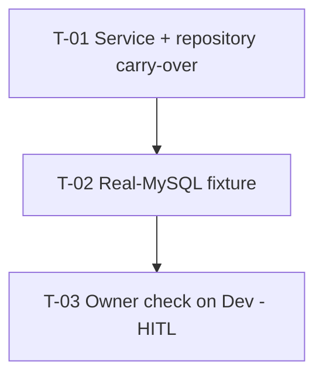

# Tasks — Bilateral / Pool Funding carry-over on "Update result"

- **Module:** bilateral (server only)
- **Spec id:** 2026-10-pool-funding-update-carryover
- **Status:** in progress
- **Owner:** d.casanas@cgiar.org
- **Linked requirements:** ./requirements.md
- **Linked design:** ./design.md
- **Baseline commit:** `d59c5d6db`
- **Gate log:** Phase 3 — auto-approved (pre-approved mode), 2026-10-08
- **Budget (tripwire):** 3 tasks · ~500 LOC · ~4 review rounds (design §0)

---

## 1. Conventions for every task

| Package | Commands (from `server/researchindicators`) |
| --- | --- |
| Server | `npm test -- --silent <paths>` · `npx eslint <changed paths>` (never `npm run lint`, K-001) · `npx tsc --noEmit -p tsconfig.json` |
| Fixtures | `npm run compose:test:up` → `npm run migration:test:bootstrap` (once per fresh container, FP-49) → `npm run test:fixtures -- pool-funding-update-carryover` |

Red runs are **observed** and quoted verbatim in `execution.md`, never predicted (K-004 / KZ-014). The Leader re-runs the full server suite after each task.

## 2. Dependency graph

## 3. Task list

### T-01 — `carryOverPoolFunding` + `newReportingCycle` transaction

- **Status:** done · **Size:** S · **Dependencies:** none
- **Requirements:** R-PUC-001 (S-1…S-4 wiring), R-PUC-002 (SQL text), R-PUC-003 (S-6), NFR-PUC-001, NFR-PUC-002, NFR-PUC-003
- **Design:** §2, §6, D-1…D-8
- **Scope:**
  - `green-checks.repository.ts`: add `carryOverPoolFunding(manager, liveResultId, snapshotResultId, userId)` — statements 1–6 of design §6, all parameterized, using the passed `manager` only. No `?`/`:word` inside SQL comments.
  - `green-checks.service.ts` `newReportingCycle`: keep the Approved guard; compute the history object from the pre-update status; run `update(year, DRAFT)` + snapshot lookup + conditional carry-over in one `dataSource.transaction`; call `saveHistory` after the transaction resolves. Add `@sdd-spec docs/specs/bilateral/pool-funding-update-carryover` tag.
- **Tests:** `green-checks.service.spec.ts`
  - (a) snapshot found → `carryOverPoolFunding` called with `(manager, liveId, snapshotId, userId)` inside the transaction
  - (b) no snapshot → not called; year/status update still happens
  - (c) `carryOverPoolFunding` rejects → method rejects and `saveHistory` is **not** called
  - (d) not Approved → 400, no transaction opened (existing guard)
  - (e) the snapshot lookup is called with `{ result_official_code, report_year_id: Y, is_snapshot: true, is_active: true }` ordered `result_id DESC`, and the in-transaction update sets `report_year_id = Y`, `result_status_id = DRAFT` on the live row only; history built with `from = APPROVED`
  - `green-checks.repository.spec.ts`: statement order (deactivate alignment/SP/ToC + delete all live mappings → insert), `_sp` insert skipped when the re-select finds no live alignment, link remap expression present
- **Falsifier:**
  - (f1) Call `saveHistory` before the transaction → case (c) goes red (history called).
  - (f2) Drop the `if (snapshot)` guard → case (b) goes red.
  - (f3) Move the `_sp` insert before the alignment insert check → repository "skipped when 0 rows" case goes red.
- **Red run:** (f1)–(f3) observed at execute time and quoted.
- **Disqualifier:** these are mocked-manager tests — they prove call wiring and order, **not** SQL correctness (column order, remap, unique index). They may not be cited as evidence for S-1 copy content, S-2, S-5, S-8; that is T-02's job (KZ-017). **Accepted gap:** the snapshot `findOne` and the status/year update are proven only by argument assertions (e), not against MySQL — they are plain TypeORM `findOne`/`update` with literal where-objects.
- **Consumers:** `green-checks.service.spec.ts`, `green-checks.controller.spec.ts`, `impersonation-audit.interceptor.spec.ts` (design P-9) — all re-run.
- **Review:** `full` — transactional write path on result data.
- **Done:**
  - [x] Tests green; (f1)–(f3) observed red, then reverted
  - [x] `tsc` + `npx eslint` clean on changed files
  - [x] Full server suite green
- **Skills:** `nestjs-expert`, `tdd`

### T-02 — Real-MySQL fixture for the carry-over SQL

- **Status:** done · **Size:** S · **Dependencies:** T-01
- **Requirements:** R-PUC-001 S-1, S-2, S-4, S-8 · R-PUC-002 S-5 · NFR-PUC-001
- **Design:** §4, §6, D-2, D-3, D-4, D-9 (P-10, P-12)
- **Scope:** new `server/researchindicators/test/fixtures/pool-funding-update-carryover.fixture-spec.ts`, modeled on `sp-versioning-pool-funding.fixture-spec.ts`. Band `906_000` / report year `2118` (re-grep sibling headers first, FP-45). Seeds a live row and a snapshot row directly, then calls the real `GreenCheckRepository.carryOverPoolFunding` inside a `dataSource.transaction` against the scratch schema. Read columns with `SHOW CREATE TABLE` before writing INSERTs. Distinct sentinel values per copied column (FP-48 copy-path discipline).
- **Cases:**
  - S-1: snapshot with 1 alignment (`has_contribution = 1`), 2 active + 1 inactive `_sp`, 1 active + 1 inactive ToC, 1 active mapping → live has exactly 1 active alignment, 2 `_sp` on the **new** alignment id, 1 ToC, 1 mapping; every copied column equals the snapshot's; snapshot rows unchanged (ids + `is_active`)
  - S-2: live pre-seeded with an active alignment + `_sp` + ToC → those rows end `is_active = 0` with `deleted_at` set; no 1062; still exactly 1 active alignment
  - S-2b: live holds an **active** mapping K (no alignment, so `SP_versioning` left it active) **and** an inactive K, snapshot holds active K → carry-over succeeds; live mappings are exactly the snapshot's (one active K, zero inactive); then `CALL SP_versioning` on the live (re-approval) → **no 1062**. Snapshot rows (active and inactive) untouched
  - S-8: two full cycles with the real `SP_versioning` — seed live data, `CALL SP_versioning`, carry-over from that snapshot, set the live year/status back so `SP_delete_result_version` + `SP_versioning` re-approve it, carry-over again → no 1062 at any step; live ends with the snapshot's rows active
  - S-4: snapshot with no rows → live active rows deactivated, none inserted
  - S-5: mapping with `result_knowledge_product_id = <snapshot id>` (seed a KP row for the snapshot so the FK holds; deliberately not the realistic live id, so f5 can go red) and 3 nulls → live copy has `<live id>` and 3 nulls. S-8 covers the realistic link produced by the real `SP_versioning`
  - NFR-PUC-001: inserted rows `created_by = userId`
  - (S-3 is the service branch "no snapshot" — covered by T-01 (b); the fixture asserts nothing is touched when the method is not called is vacuous, so it is not repeated here.)
- **Falsifier:**
  - (f4) Remove step 2 (deactivate live) → S-2 goes red with 1062 or two active alignments.
  - (f5) Copy the link verbatim instead of remapping → S-5 goes red (`<snapshot id>` ≠ `<live id>`).
  - (f6) Drop `is_active = TRUE` from the ToC source filter → S-1 goes red (2 ToC rows).
  - (f7) Swap two adjacent ToC columns in the INSERT list → S-1 column equality goes red (distinct sentinels).
  - (f8) Replace the mapping hard-delete with the soft-deactivate used for the other tables → S-2b goes red with `ER_DUP_ENTRY` on `uq_rpfim_result_indicator_active` (at carry-over or at the re-approval `SP_versioning`).
  - (f9) Delete mappings with `result_id IN (live, snapshot)` → S-2b "snapshot rows untouched" goes red.
- **Red run:** (f4)–(f9) observed against the real schema and quoted.
- **Disqualifier:** if `test:fixtures` collects 0 tests (file not named `*.fixture-spec.ts`), or the run shares the container with a concurrent `test:integration` (FP-51), the result is not evidence.
- **Consumers:** none (new file); `test/jest-fixtures.json` collects it.
- **Review:** `full`.
- **Done:**
  - [x] Fixture green; (f4)–(f9) observed red, then reverted (+ f10–f13 added in rework, execution.md)
  - [x] `npx eslint` clean on the fixture
- **Skills:** `nestjs-expert`, `tdd`

### T-03 — Owner check on Dev (HITL)

- **Status:** pending · **Size:** XS · **Dependencies:** T-02, owner push + Dev deploy
- **Requirements:** R-PUC-001 S-1 (end to end), R-PUC-004 S-7
- **Scope:** owner opens an Approved result with a Pool Funding version (e.g. a 2025 version), clicks Update result, picks 2025 → the live Pool Funding page shows the 2025 alignment, SPs and ToC (when the result is eligible). A non-eligible result without PRMS code stays hidden.
- **Falsifier:** before deploy, the same steps show an empty live section — that is the baseline the owner compares against.
- **Red run:** n/a (manual).
- **Disqualifier:** a result whose live row already held Pool Funding rows proves nothing about the carry-over; use one updated **after** deploy.
- **Consumers:** n/a.
- **Review:** `skip-eligible` — claim to prove: the owner's observation is the evidence; no code in this task.
- **Done:**
  - [ ] Owner confirmation quoted in `execution.md` (what was observed, which result)
- **Skills:** none

## 4. Coverage closure (scenario / clause → task)

| Clause | Task |
| --- | --- |
| S-1 THEN Draft + year | T-01 (e) (argument-level; accepted gap stated in T-01) |
| S-1 AND live holds exact copy | T-02 S-1 |
| S-1 AND IT MUST snapshot unchanged | T-02 S-1 |
| S-1 BUT not inactive rows | T-02 S-1 (f6) |
| S-2 THEN deactivate + copy | T-02 S-2 |
| S-2 AND IT MUST ≤1 active alignment | T-02 S-2 (f4) |
| S-2 AND IT MUST same-key mapping, re-approvable | T-02 S-2b (f8) |
| S-2 BUT no `results` delete, no snapshot touch, hard-delete only in the mapping table | T-02 S-2 (alignment/SP/ToC rows still present with `is_active = 0`), S-2b (snapshot rows untouched, f9); T-01 (e) (update targets the live row only, no `results` insert/delete) |
| S-8 | T-02 S-8 (f8) |
| S-3 THEN as today, BUT no Pool Funding touch | T-01 (b) |
| S-4 | T-02 S-4 |
| S-5 THEN remap, BUT no foreign link | T-02 S-5 (f5) |
| S-6 THEN rollback, AND IT MUST no history | T-01 (c) (f1) |
| S-7 | T-03 (HITL only — no code change, accepted) |
| NFR-PUC-001 | T-02 |
| NFR-PUC-002/003 | T-01 (no migration, controller unchanged) |

## 5. Risks & blockers log

| Date | Item |
| --- | --- |
| 2026-10-08 | O-1, O-2, O-3 (design §10) open for the owner; none blocks T-01/T-02 |

## 6. Done definition

T-01 and T-02 PASS with observed reds; T-03 owner confirmation recorded; full server suite green.
