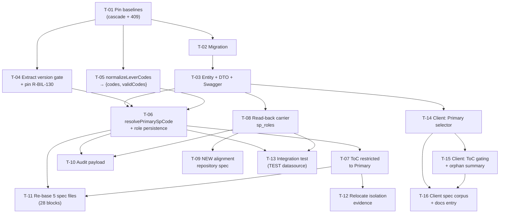

# Tasks — Bilateral / Primary vs Contributing Science Programs

- **Module:** bilateral
- **Spec id:** 2026-08-primary-contributing-sp
- **Status:** in-progress (T-01 done, 2026-08-13)
- **Owner:** Juan Carlos Cadavid
- **Linked requirements:** [`./requirements.md`](./requirements.md)
- **Linked design:** [`./design.md`](./design.md)
- **Judgment:** [`./judgment.md`](./judgment.md) — **APPROVED**, 24 findings closed, 2 accepted risks carried forward (D-5, D-6)
- **Depth:** Full
- **Approval Mode:** `gated` (from `proposal.md` §1)
- **Phase-3 approval gate:** **approved by the user, 2026-08-13** — decomposition accepted as written; **RB-3** (production-code share ~1,025 vs the design's ~885 flag) deliberately left open as a tripwire note for `/akili-execute` rather than resolved at specify time.
- **Last updated:** 2026-08-13

---

## 0. Read this before starting any task

Four rules bind every task below. They come from measured failures on C1 (`kaizen-log.md`) and from this spec's own judgment day — none is decorative.

| Rule | Why |
| --- | --- |
| **`npx eslint <path>` is the lint gate. `npm run lint` is FORBIDDEN as evidence.** | **K-001.** `npm run lint` is `eslint --fix` — it makes the thing it checks true as a side effect. Every "lint clean" report across ~10 C1 tasks was an artifact while the committed branch failed Prettier. |
| **Client: `npm test` proves nothing about compilation.** Both `npm run build` **and** `npx tsc -p tsconfig.spec.json --noEmit` are required. | **K-002.** Jest runs `isolatedModules: true` (no type-check) and ESLint ignores `*.spec.ts`. 6,239 passing tests once coexisted with a `TS2345` build failure. |
| **Every correction sweeps the LITERAL superseded string, then re-greps to confirm.** Forward (all sites) and backward (everything citing the corrected section). | **K-003.** Failed 3× on C1 and **4× on this spec's own judgment rounds** — every time, a literal sweep found sites the finding had not named. A finding's site list is a starting point, never the scope. |
| **A budget breach STOPS and escalates. It is not absorbed.** | C1 delivered **3.2×** its estimate and its `design.md` required an escalation that was never raised. Tripwires: **> 19 tasks · > 3,120 insertions · > 20 review rounds** (`design.md` §12). |

**One more, specific to this spec:** the version-gate extraction (T-04) must land **before** Primary validation (T-06). Reversed, a new `400` fires in front of C1's shipped `409` and silently displaces a tested contract (D-8 / R-BIL-130). The dependency in §2 is not a preference.

---

## 1. Task numbering

Tasks are `T-01` … `T-16`, numbered in dependency order. Higher numbers do not imply higher priority — see §2.

Requirement IDs are `R-BIL-120` … `R-BIL-130`, `NFR-BIL-120`, `NFR-BIL-122`. **`NFR-BIL-121` is withdrawn and retired — no task may cite it** (`requirements.md` §11).

---

## 2. Dependency graph

**No cycles.** Critical path: `T-01 → T-02 → T-03 → T-06 → T-07 → T-11`. The client chain (`T-03 → T-14 → T-15 → T-16`) is parallel-safe against the server test estate (`T-09`, `T-11`, `T-12`, `T-13`) once `T-03` lands.

**Why T-01 is first and alone:** R-BIL-125 AC.4 requires the pre-existing cascade to be pinned **before** the role change is implemented. Pinned after, a cascade regression is indistinguishable from intended behavior (D-7). The same task snapshots the `409` ordering that T-04 must preserve.

---

## 3. Task list

### T-01 — Pin the pre-existing cascade and `409` ordering, before anything changes

- **Requirements covered:** R-BIL-125 AC.4 · R-BIL-130 AC.2 (baseline half) · defect classes **D-7**, **D-8**
- **Files touched (intended):**
  - `server/researchindicators/src/domain/entities/bilateral/bilateral.service.spec.ts`
  - `server/researchindicators/src/domain/entities/bilateral/bilateral.service.updateAlignment.tocAlignments.spec.ts`
- **Description:** Add characterisation tests that record today's behavior for the two things this spec is most likely to break silently: the SP-deselection ToC cascade, and the position of `409 toc_mapping_version_locked` in the validation order. No production code changes. This task exists so that a later regression is *attributable* rather than merely visible.
- **Implementation notes:**
  - Cascade pin: a ToC row is deactivated **only** when its `sp_code` leaves `sp_codes`. Assert both directions — leaves ⇒ deactivated; stays ⇒ untouched.
  - `409` pin: record that `bilateral.service.updateAlignment.tocAlignments.spec.ts:216` (C1 R-BIL-097 AC.2) passes on `HEAD`. Capture the file's SHA-256 in the task evidence so T-04 can prove the test was not edited.
  - Do **not** add `primary_sp_code` to any fixture here. These tests describe pre-change behavior.
- **Scope boundary:** characterisation tests only. No production file may appear in this task's diff.
- **Tests:** the two files above.
- **Verification:**
  - `cd server/researchindicators && npx jest src/domain/entities/bilateral --coverage=false`
  - `npx eslint src/domain/entities/bilateral/bilateral.service.spec.ts src/domain/entities/bilateral/bilateral.service.updateAlignment.tocAlignments.spec.ts`
  - `git diff --stat` must show **only** `*.spec.ts` files.
- **What would make this check FAIL:** deleting the `sp_codes` entry for an SP while leaving its ToC row active makes the cascade pin fail; moving the version-gate statement below `normalizeLeverCodes` makes the `409` pin fail. Both are inputs that exist in the code today, so the checks are falsifiable rather than tautological.
- **What DISQUALIFIES the evidence:** a pin that passes both before **and** after a deliberate one-line sabotage of the behavior it claims to pin is not a pin — it is a test of something else. Before reporting done, temporarily invert the cascade condition, confirm the pin goes red, and revert. If it stays green, the pin is worthless and must be rewritten. Report the red/green pair, not just the green.
- **Presence-assertion caveat:** none — these are behavioral assertions over `updateAlignment`'s observable output and the persisted `is_active` flags.
- **Done criteria:**
  - [ ] A test asserts a ToC row **is** deactivated when its SP leaves `sp_codes`.
  - [ ] A test asserts a ToC row is **not** deactivated when its SP stays.
  - [ ] The sabotage-and-revert red/green pair is recorded in the task evidence for both pins.
  - [ ] SHA-256 of `bilateral.service.updateAlignment.tocAlignments.spec.ts` recorded.
  - [ ] `npx eslint` clean on both files (never `npm run lint`).
- **Dependencies:** none
- **Estimated LOC:** ~90 (tests only)
- **Effort:** S
- **Skills:** `nestjs-expert`, `tdd`
- **Status:** **done** (2026-08-13 — PASS on attempt 1; see [`./execution.md`](./execution.md) → T-01)

---

### T-02 — Migration: `sp_role` + generated column + unique index

- **Requirements covered:** R-BIL-121 AC.3/AC.4 (DB half) · R-BIL-126 AC.1/AC.3/AC.5 · **NFR-BIL-120**
- **Files touched (intended):**
  - `server/researchindicators/src/db/migrations/<timestamp>-addSpRoleToAlignmentSp.ts` — **new, append-only**
- **Description:** Add the nullable `sp_role` column, the `active_primary_alignment` STORED GENERATED column, and the UNIQUE index that makes "≤ 1 active Primary per alignment" a database guarantee. No backfill. `down()` restores the prior table shape exactly.
- **Implementation notes:**
  - **Scaffold with `npm run migration:empty --name=addSpRoleToAlignmentSp`, NOT `migration:generate`.** `migration:generate` diffs entity metadata and cannot emit a `STORED GENERATED` column or its expression — it would produce a plain column and silently drop the invariant. The DDL is hand-authored raw SQL.
  - **The DDL is normative — copy it from `design.md` §3.1 verbatim.** Do not re-derive it.
  - **Both `ADD COLUMN`s go in ONE `ALTER`.** `STORED` forces `ALGORITHM=COPY`; splitting them causes two full table rebuilds (RA-10).
  - **`active_primary_alignment` is `bigint`, not `varchar`.** The `varchar(71)` precedent (`1779190000015`) is a *composite* key; this is a single key, so `1779190000014`'s plain `bigint` is the right precedent.
  - **⚠ The expression's VALUE must be `alignment_id` alone and must NOT include `sp_role`.** `CONCAT(alignment_id, ':', sp_role)` is non-NULL for `CONTRIBUTING` rows too, so the index would reject a second active Contributing SP — directly violating R-BIL-121's *"AND IT MUST still permit any number of active `CONTRIBUTING` rows"*. The role belongs in the `IF` **condition**, never in the value.
  - Key on `alignment_id`, never `id` — MySQL forbids `AUTO_INCREMENT` columns in generated expressions, so this is the only legal option as well as the correct one.
  - **No backfill.** Every pre-existing row keeps `sp_role = NULL`.
  - Do not map the generated column on the entity (T-03) — TypeORM would try to write it.
- **Scope boundary:** the migration file only. Entity, DTO and service changes belong to T-03 onward. Never edit a merged migration.
- **Tests:** **none automated — see the gate below.** Migrations are excluded from Jest coverage and this repo has no migration harness (D-2).
- **Verification — manual, and it is the only gate that exists:**
  - `cd server/researchindicators && npm run migration:dev:execute`
  - `npm run migration:revert`
  - `npm run migration:dev:execute` again (prove idempotent forward after revert)
  - Around each step, capture against a **seeded DEV database**: `SELECT COUNT(*)` on `result_pool_funding_alignment_sp`, and a checksum over `(id, alignment_id, sp_code, is_active)`.
  - Direct-SQL invariant probes (these are the R-BIL-121 AC.3/AC.4 evidence): insert a second active `PRIMARY` row for one `alignment_id` ⇒ **must fail** on `idx_rpfas_active_primary`; insert three active `CONTRIBUTING` rows for the same `alignment_id` ⇒ **must succeed**; set an existing `PRIMARY` row to `is_active = 0` then insert a new active `PRIMARY` ⇒ **must succeed**.
- **What would make this check FAIL:** putting `sp_role` in the expression's value makes the three-Contributing-rows probe fail. Typing the column `varchar(21)` with a `CONCAT` expression makes it fail *and* truncate. Omitting `IS NULL` handling makes the deactivate-then-reinsert probe fail. Each probe has a concrete input that produces a red result, and the wrong-precedent implementation trips at least two of them.
- **What DISQUALIFIES the evidence:** a checksum taken against an **empty** table proves nothing about legacy data — `requirements.md` §1.1 states production has no mapped SP rows, so the DEV seed is the only real data this migration will ever meet before production accumulates its own. If the seeded table has zero rows, the run is **inconclusive, not passing**: say so, seed rows, and re-run. Equally, `npm run migration:dev:execute` exiting `0` is not evidence the invariant holds — only the three direct-SQL probes are. Report the probe outputs verbatim, including the error text of the one that must fail.
- **Presence-assertion caveat:** confirming the column and index **exist** (`SHOW CREATE TABLE`) proves presence, not effect. It cannot show that the index rejects a second Primary while permitting many Contributing rows. That is what the probes are for, and the probes are mandatory.
- **Done criteria:**
  - [ ] Forward + revert + forward all clean; row count and checksum **identical** before and after.
  - [ ] Seeded row count recorded and **> 0**.
  - [ ] All three direct-SQL probes recorded with verbatim output, including the expected failure.
  - [ ] An `is_read_only` legacy alignment is confirmed unmutated (R-BIL-126 AC.3).
  - [ ] `down()` drops the index, the generated column and `sp_role`, restoring the prior shape.
  - [ ] `npx eslint` clean on the migration file.
- **Dependencies:** T-01
- **Estimated LOC:** ~70
- **Effort:** M
- **Skills:** `nestjs-expert`, `systematic-debugging` (if the DDL misbehaves)
- **Status:** **`[~]` in-progress** (2026-08-13) — **migration authored, reviewed PASS, committed `77f7e4f8`; probe package audited after 3 review rounds. The DB invariant is UNVERIFIED — no probe has been run.** See [`./execution.md`](./execution.md) → T-02. **⚠ The manual probes must run BEFORE T-06 reaches DEV** (T-06 writes `sp_role`, invalidating four `must_be_zero` assertions), or be re-scoped. Durable alternative: **T-13** automates all three probes against the `TEST` datasource. **Unowned gap:** forward+revert+forward (done-criterion 1) has no vehicle — CI/CD owns migrations.

---

### T-03 — Entity column, DTO fields, Swagger

- **Requirements covered:** R-BIL-120 (wire shape) · R-BIL-123 AC.3/AC.4 · **D-C2-1**, **D-C2-6**, **D-C2-12**
- **Files touched (intended):**
  - `.../bilateral/entities/result-pool-funding-alignment-sp.entity.ts`
  - `.../bilateral/dto/update-pool-funding-alignment.dto.ts`
  - `.../bilateral/dto/bilateral-science-programs.response.dto.ts`
  - `.../bilateral/bilateral.controller.ts` — Swagger annotations only
- **Description:** Declare the surface: `sp_role` on the entity, `primary_sp_code?: string` on the request DTO, `role` on `SelectedScienceProgramResponse`, and the Swagger text for both plus the three new `400` codes. Behavior arrives in T-04–T-08; this task only makes the shape exist and be documented.
- **Implementation notes:**
  - `sp_role`: `varchar(20)`, nullable. **No `@OpenSearchProperty`** — this entity is not in the OpenSearch tree, so a decorator here is inert metadata that misleads the next reader (F-1).
  - **Do not map `active_primary_alignment`** on the entity.
  - `primary_sp_code`: `@IsOptional() @IsString() @MaxLength(50)`. Optional at class-validator **by design** — the conditional requirement ("required when `has_contribution === true`") lives in structural validation, keeping one error vocabulary (D-C2-12, mirroring C1's D-C1-3).
  - `role: 'PRIMARY' | 'CONTRIBUTING' | null`. Swagger must document the `null` case **and what it means** ("role not yet chosen — legacy rows only").
  - Extend the existing `@ApiResponse` 400 description with `primary_sp_required`, `primary_sp_not_selected`, `toc_alignment_not_primary_sp`.
- **Scope boundary:** declarations and annotations. No service logic, no repository query change.
- **Tests:** `bilateral.controller.spec.ts` — DTO validation of `primary_sp_code` (accepts absent, accepts a string, rejects a non-string and an over-length value).
- **Verification:**
  - `cd server/researchindicators && npx jest src/domain/entities/bilateral --coverage=false`
  - `npx eslint src/domain/entities/bilateral`
  - `npm run build` (server compiles)
  - Start the app and confirm `/swagger` shows `primary_sp_code`, `role` including `null`, and the three codes in the 400 description.
- **What would make this check FAIL:** sending `primary_sp_code: 123` must be rejected by `ValidationPipe`; sending a 51-character code must be rejected. Sending an **unknown** field (e.g. `primary_sp`) must also be rejected, because `forbidNonWhitelisted: true` is what gives R-5′ its loud failure — if that request succeeds, the whitelist posture has been broken by this task.
- **What DISQUALIFIES the evidence:** a green `npx jest` says nothing about Swagger — the `/swagger` check is a **separate, manual, required** step, and "the annotations are in the source" is not a substitute for seeing them rendered. If the app cannot be started, the Swagger criterion is **unmet**, not waived.
- **Presence-assertion caveat:** asserting the `@ApiProperty` decorator exists in the source is a presence-assertion — it proves the decorator is written, not that Swagger renders it correctly (a wrong `enum` or a missing `nullable: true` renders wrong while the decorator is plainly present). The rendered `/swagger` view is the behavioral check.
- **Done criteria:**
  - [ ] `sp_role` on the entity, nullable, **no** OpenSearch decoration, generated column **not** mapped.
  - [ ] `primary_sp_code` accepted and validated; unknown fields still rejected.
  - [ ] `role` on the response DTO with the `null` semantics documented.
  - [ ] `/swagger` visually confirmed for all of the above (state the URL checked).
  - [ ] `npx eslint` clean; server `npm run build` clean.
- **Dependencies:** T-02
- **Estimated LOC:** ~45
- **Effort:** S
- **Skills:** `nestjs-expert`, `api-design-principles`
- **Status:** **done** (2026-08-13 — PASS on attempt 1; see [`./execution.md`](./execution.md) → T-03). **⚠ File-list correction:** `bilateral-science-programs.response.dto.ts` above is **wrong** and was correctly left untouched — `SelectedScienceProgramResponse` lives in `update-pool-funding-alignment.dto.ts:31`; the unnamed file holds `BilateralScienceProgramItem` (the CLARISA catalog), where a role is meaningless. Provenance: `proposal.md:111`, superseded by `design.md` §4. **T-08 must drop the `?` from `role`.**

---

### T-04 — Extract the ToC version gate so the shipped `409` keeps firing first

- **Requirements covered:** **R-BIL-130** (all ACs) · **D-C2-13** · defect class **D-8**
- **Files touched (intended):**
  - `.../bilateral/bilateral.service.ts`
  - `.../bilateral/bilateral.service.updateAlignment.tocAlignments.spec.ts` — **additions only**
- **Description:** Lift the ToC-mapping-version gate out of `validateTocAlignments` (where it is the first statement, `bilateral.service.ts:867-876`) into an explicit step that runs **before** Primary validation. This preserves C1's shipped `409 toc_mapping_version_locked` ordering while making the resolved Primary available to the ToC restriction in T-07 — no trade-off between the two.
- **Implementation notes:**
  - The gate's **trigger condition is unchanged**: evaluated only when `dto.toc_alignments` is present. Verified at the real call site — `validateTocAlignments` is invoked only behind `const tocUpserts = dto.toc_alignments ? … : null` (**`bilateral.service.ts:686-693`**), so legacy bodies still bypass it entirely (R-BIL-097 AC.3).
  - Position it as step 2 of the ordering in `design.md` §4: after `normalizeLeverCodes`, before `resolvePrimarySpCode`.
  - This lands **before** T-06. Reversed, `400 primary_sp_required` fires in front of the `409` and displaces a tested contract.
- **Scope boundary:** move the gate and add the pinning test. Do **not** introduce `resolvePrimarySpCode` here.
- **Tests:** additions to `bilateral.service.updateAlignment.tocAlignments.spec.ts` covering R-BIL-130 AC.1, AC.3, AC.4.
- **Verification:**
  - `cd server/researchindicators && npx jest src/domain/entities/bilateral --coverage=false`
  - **`git diff bilateral.service.updateAlignment.tocAlignments.spec.ts` must show additions only** — zero deletions, zero modifications to the block at `:216`. Compare against the SHA-256 recorded in T-01.
  - `npx eslint src/domain/entities/bilateral/bilateral.service.ts`
- **What would make this check FAIL:** leaving the gate inside `validateTocAlignments` while T-06 exists makes AC.1 return `400` instead of `409`. Extracting it *unconditionally* (dropping the `dto.toc_alignments` guard) makes AC.3 fail, because a legacy body would newly trip the gate. Both are the two plausible wrong implementations, and each has a test that goes red.
- **What DISQUALIFIES the evidence:** **any edit to the test at `:216` invalidates this task.** R-BIL-130 AC.2 states the condition precisely: if that test must be modified to pass, the ordering has been changed and the requirement is violated — the edit is the defect, not the fix. A diff showing deletions in that file is a FAIL regardless of how green the suite is. Note also that a suite passing because the new AC tests happen to exercise a 2026 result proves nothing about a non-2026 one; state the live version used in each new test.
- **Presence-assertion caveat:** none — the assertions are on the HTTP status and error code actually produced.
- **Done criteria:**
  - [ ] Version gate runs before Primary validation, with its trigger condition unchanged.
  - [ ] AC.1: non-2026 version + `toc_alignments` + no `primary_sp_code` ⇒ `409 toc_mapping_version_locked`.
  - [ ] AC.3: legacy body (no `toc_alignments`) on a non-2026 version bypasses the gate.
  - [ ] AC.4: on a **2026** result, `primary_sp_required` still fires (the gate does not mask Primary validation where it does not apply) — assert after T-06 lands, or as a `todo` promoted in T-06.
  - [ ] AC.2: `git diff` proves the `:216` test is **unmodified**; SHA-256 matches T-01's record.
  - [ ] `npx eslint` clean.
- **Dependencies:** T-01
- **Estimated LOC:** ~50
- **Effort:** S
- **Skills:** `nestjs-expert`, `error-handling-patterns`, `tdd`
- **Status:** **done** (2026-08-13 — PASS on attempt 1; see [`./execution.md`](./execution.md) → T-04). **⚠ AC.4 carried to T-06 as an `it.todo`, and R-BIL-130's ordering claim is asserted-but-unfalsified until T-06 re-runs the "gate left in place" sabotage — see the FORWARD OBLIGATION block in `execution.md`.**

---

### T-05 — `normalizeLeverCodes` returns its catalog instead of discarding it

- **Requirements covered:** enabling change for R-BIL-122 AC.2 · **RA-02**
- **Files touched (intended):**
  - `.../bilateral/bilateral.service.ts`
  - `.../bilateral/bilateral.service.normalizeLeverCodes.spec.ts`
- **Description:** Widen `normalizeLeverCodes` from `Promise<string[]>` to `Promise<{ codes: string[]; validCodes: Set<string> }>`. It already builds that `Set` internally (`bilateral.service.ts:1321`) and throws it away (`:1336`); this only stops the discard. Without it, T-06's full-catalog check would have to call `getScienceProgramsForResult` a second time, fanning out to `findPoolFundingAlignmentContext` + `findActiveByAgreementId` + CLARISA (`:148-177`) on **every** PATCH.
- **Implementation notes:**
  - Pure signature change — the validation logic inside is untouched.
  - Update every call site. `dto.sp_codes` / `dto.lever_codes` semantics are unchanged.
  - This file is the one the re-base census **missed twice** (RA-01). Its `:155` test PATCHes `has_contribution: true, sp_codes: ['SP09']` with no `primary_sp_code` and asserts `resolves.toBeDefined()` — that block is re-based in **T-11**, not here. Here, only the return-shape edits.
- **Scope boundary:** signature and call sites. No new validation, no `primary_sp_code` handling.
- **Tests:** `bilateral.service.normalizeLeverCodes.spec.ts` — assert `codes` is unchanged from today for each existing case, and that `validCodes` contains the full per-result catalog (not merely the selected subset).
- **Verification:**
  - `cd server/researchindicators && npx jest src/domain/entities/bilateral --coverage=false`
  - `npm run build`
  - `npx eslint src/domain/entities/bilateral/bilateral.service.ts`
- **What would make this check FAIL:** returning the *selected* codes as `validCodes` instead of the full catalog makes the catalog assertion fail — and this is the plausible wrong implementation, because the two collections coincide in the common case where every valid SP is selected. The test must therefore use a result whose catalog is **strictly larger** than `sp_codes`.
- **What DISQUALIFIES the evidence:** a test where `sp_codes` equals the full catalog cannot distinguish the right implementation from the wrong one; such a test is not evidence for the `validCodes` claim even when green. State, per test, the catalog and the selected set, and confirm they differ in at least one case.
- **Presence-assertion caveat:** asserting the returned object *has* a `validCodes` key is a presence-assertion. The behavioral check is that it contains a code that is valid for the result but absent from `sp_codes`.
- **Done criteria:**
  - [ ] Return type is `{ codes, validCodes }`; every call site updated; `npm run build` clean.
  - [ ] `codes` behavior is byte-identical to today for all pre-existing cases.
  - [ ] At least one test where the catalog strictly exceeds `sp_codes`, asserting `validCodes` holds the surplus code.
  - [ ] No second `getScienceProgramsForResult` call introduced — assert the mock's call count is unchanged.
  - [ ] `npx eslint` clean.
- **Dependencies:** T-01
- **Estimated LOC:** ~60
- **Effort:** S
- **Skills:** `nestjs-expert`, `tdd`
- **Status:** **done** (2026-08-13 — PASS on attempt 1; see [`./execution.md`](./execution.md) → T-05). **Note:** `normalizeLeverCodes.spec.ts:155` remains **un-re-based and owned by T-11**; T-05 added an assertion after that block without touching it.

---

### T-06 — `resolvePrimarySpCode` + role derivation + `sp_role` persistence

- **Requirements covered:** **R-BIL-120** (AC.1–AC.4) · **R-BIL-121** AC.1/AC.2 · **R-BIL-122** (AC.1–AC.4) · R-BIL-126 AC.4 · **D-C2-4**, **D-C2-15** · defect class **D-1**
- **Files touched (intended):**
  - `.../bilateral/bilateral.service.ts`
  - `.../bilateral/repositories/result-pool-funding-alignment-sp.repository.ts`
  - `.../bilateral/bilateral.service.spec.ts`
- **Description:** The core of the spec. Add `resolvePrimarySpCode`, derive each SP row's role from the resolved Primary, and persist `sp_role` on insert. This is where the "≥ 1 Primary" service half of the invariant lives, and where the two distinguishable rejection paths of R-BIL-122 are produced.
- **Implementation notes — `design.md` §5.1 is normative; follow it step for step:**
  1. `has_contribution === false` ⇒ return `null`. No SP rows written, `primary_sp_code` ignored. Preserves R-BIL-014.
  2. Trim `primary_sp_code`. Empty, whitespace-only, or absent ⇒ `400 errors.primary_sp.code = "primary_sp_required"`.
  3. **Not in the full per-result catalog** (T-05's `validCodes`) ⇒ the **existing** `400 errors.unknown_sp_codes` contract, carrying the offending code. **This step is why R-BIL-122 AC.2 is dischargeable at all** — `normalizeLeverCodes` never inspects `primary_sp_code`, so without it `SP99` would come back as `primary_sp_not_selected` and AC.1/AC.2 would be indistinguishable.
  4. In the catalog but not in the effective `sp_codes` ⇒ `400 primary_sp_not_selected`.
  5. Return the code. Each row derives `sp_role = (sp_code === primary) ? 'PRIMARY' : 'CONTRIBUTING'`.
  - **All of this runs before the transaction opens** — R-BIL-121's scenario requires rejection with *no partial write observable*, preserving C1's atomicity guarantee (D-V2-8).
  - Role is **derived** at write time from `primary_sp_code` and **stored** explicitly (D-C2-4). The wire carries no per-row role field, which is what makes "one SP in both roles" unrepresentable (D-C2-1) — so **add no mutual-exclusion check**; R-BIL-122 AC.3 is satisfied structurally.
  - Position after T-04's extracted version gate. Ordering is observable.
- **Scope boundary:** Primary resolution, derivation, persistence. The ToC restriction is T-07; the read-back is T-08; the audit payload is T-10.
- **Tests:** `bilateral.service.spec.ts` — every AC above, plus the promoted R-BIL-130 AC.4 (`primary_sp_required` still fires on a 2026 result).
- **Verification:**
  - `cd server/researchindicators && npx jest src/domain/entities/bilateral --coverage=false`
  - `npm run test:cov` — server ≥ 60% on all four metrics
  - `npx eslint src/domain/entities/bilateral`
- **What would make this check FAIL:** dropping step 3 makes the `SP99` test return `primary_sp_not_selected` instead of `unknown_sp_codes` — red. Resolving the Primary *inside* the transaction makes the "nothing persisted" assertion red. Treating `"   "` as a present value makes AC.2 red. Deriving the role as `CONTRIBUTING` for the Primary itself makes AC.1's persisted-rows assertion red. Four distinct wrong implementations, four distinct red tests.
- **What DISQUALIFIES the evidence:** **R-BIL-122 AC.4 is explicit — AC.1 and AC.2 require two distinct tests with different error payloads.** A single test covering only the unselected case does not discharge AC.2, however green. Assert the actual payload (`errors.primary_sp.code` vs `errors.unknown_sp_codes`), not merely that a `400` occurred: a test asserting `status === 400` passes under both the right and the wrong implementation and is therefore not evidence for either. Likewise, "nothing persisted" must be asserted against the repository mock's call count, not inferred from the thrown exception.
- **Presence-assertion caveat:** asserting that a `sp_role` **field** is passed to the repository proves the field is present, not that its **value** is correct per row. Assert the full `(sp_code, sp_role)` pairs — one `PRIMARY`, the rest `CONTRIBUTING`.
- **Done criteria:**
  - [ ] AC.1: `sp_codes: ["SP06","SP09"], primary_sp_code: "SP06"` persists `SP06`⇒`PRIMARY`, `SP09`⇒`CONTRIBUTING` — asserted as pairs.
  - [ ] AC.2: `has_contribution: false` persists **zero** SP rows and does not require `primary_sp_code`.
  - [ ] AC.3: `sp_codes` keeps its meaning — the Primary is not sent twice.
  - [ ] AC.4: `lever_codes` + `primary_sp_code` behaves identically to `sp_codes` + `primary_sp_code`.
  - [ ] R-BIL-121 AC.1 and AC.2 (absent / empty / whitespace ⇒ `primary_sp_required`, nothing persisted, rejected pre-transaction).
  - [ ] R-BIL-122 AC.1 **and** AC.2 as **two tests with different payloads**.
  - [ ] R-BIL-122 AC.3 satisfied structurally, with a note stating **no runtime check was added** and why.
  - [ ] R-BIL-126 AC.4: a legacy (`sp_role = NULL`) editable alignment is repaired by one normal PATCH.
  - [ ] R-BIL-130 AC.4 promoted from `todo` and passing.
  - [ ] Coverage ≥ 60% all metrics; `npx eslint` clean.
- **Dependencies:** T-03, T-04, T-05
- **Estimated LOC:** ~220
- **Effort:** L
- **Skills:** `nestjs-expert`, `error-handling-patterns`, `tdd`
- **Status:** **done** (2026-08-13 — PASS on attempt 1; see [`./execution.md`](./execution.md) → T-06). **R-BIL-130 is now FALSIFIED, not merely asserted** — T-04's deferred sabotage was re-run and goes red, reproduced independently by the Reviewer. **The suite is now 41 red by design** — all proven by mutation to be missing-`primary_sp_code` blocks owned by **T-11**, none a regression. **⚠ T-06's coverage (83.08/73.28/84.29/83.02) is a RED-suite figure and is NOT a valid T-11 baseline.**

---

### T-07 — ToC alignments accepted for the Primary SP only

> **✅ AMENDED 2026-08-13 — user-approved. See [`./execution.md`](./execution.md) → *Pivot Record: T-07*.** Two spec defects were found pre-emptively during T-06's review and are now corrected in place below: (1) the done-criterion *"T-01's pins green"* was **unsatisfiable** — T-11 re-bases those pins and runs *after* this task — and is replaced by a **structural** no-cascade-trigger proof; (2) **37 of the ~41 currently-red blocks are in this task's own file** and are **T-11's to re-base, not yours** — an explicit scope boundary now says so. No requirement or design change; no task added or removed.

- **Requirements covered:** **R-BIL-124** (AC.1–AC.5) · **R-BIL-125** AC.1/AC.2 fully, **AC.3 structurally only** (finally discharged at **T-11** — amended 2026-08-13, Pivot Record: T-07) · defect classes **D-1**, **D-7**
- **Files touched (intended):**
  - `.../bilateral/bilateral.service.ts`
  - `.../bilateral/bilateral.service.updateAlignment.tocAlignments.spec.ts`
- **Description:** Add one rejection rule to `validateTocAlignments`: a **selected** SP that is not the Primary yields `toc_alignment_not_primary_sp`. Restricts who STAR lets *write*; deletes, deactivates and hides nothing.
- **Implementation notes:**
  - Position: **after** the existing `sp_not_selected` check (so an unselected SP still gets the older, more specific code — R-BIL-124 AC.2) and **before** the `aligns_with_toc` short-circuit.
  - Placement before the short-circuit is deliberate: an explicit `aligns_with_toc: false` for a Contributing SP is also a write, and must be rejected rather than silently nulling a retained row.
  - **Collected, not thrown eagerly** — the `400` must still carry every per-alignment error at once (AC.4).
  - **Add no new cascade.** Demotion and promotion deactivate nothing (R-BIL-125). The only cascade trigger stays "the SP left `sp_codes`".
  - C1's chain for the Primary's own entry is untouched: Level + HLO floor, `level_not_allowed`, `contribution_without_indicator`, conditional catalog checks.
- **Scope boundary:** one rule plus its tests. Do not touch the cascade, the read-back's ToC filter, or `is_read_only`.
  - **⛔ 37 of the ~41 currently-red blocks are in `tocAlignments.spec.ts` — THIS TASK'S OWN FILE — and they are T-11's to re-base, NOT yours** *(added 2026-08-13, Pivot Record: T-07 §2)*. Each is one `primary_sp_code` line from green and they will sit in front of you while you work. **Do not add `primary_sp_code` to any block you did not author.** Re-basing them here bypasses **T-11's mandatory per-file assertion ledger** — the **D-9** defect T-11 exists to prevent, and the reason a green suite is *not* evidence of success in that task. It would arrive looking like helpfulness and would destroy the audit trail. If your change makes a **new** block red beyond the known ~41, that one **is** yours — report it.
- **Tests:** `bilateral.service.updateAlignment.tocAlignments.spec.ts` — AC.1–AC.5, plus R-BIL-125 AC.1/AC.2/AC.3 including the demotion case.
- **Verification:**
  - `cd server/researchindicators && npx jest src/domain/entities/bilateral --coverage=false`
  - **T-01's cascade pins: prove NO CASCADE TRIGGER WAS ADDED, structurally** *(amended 2026-08-13 — see `execution.md` → Pivot Record: T-07; the original "must still pass unmodified" was unsatisfiable)*. Two checks: `git diff` shows **no deletions** inside T-01's two pinned blocks (`bilateral.service.spec.ts:610`, `:637`), **and** the cascade production logic — the `deactivateForSps` call site and the `effectiveSpCodes` filter — is **byte-identical**. The pins' green re-base is **T-11's**.
  - **Filtered runs are the convention here.** The suite is **~41 red before you start** (T-06, proven by mutation to contain no regression), **37 of them in this task's own file**. Demonstrate your own tests with `npx jest …tocAlignments.spec.ts -t "R-BIL-124"`. **Report the full-suite count before and after** so any *new* red is visible.
  - `npx eslint src/domain/entities/bilateral/bilateral.service.ts`
- **What would make this check FAIL:** placing the new rule *before* `sp_not_selected` makes AC.2 red (an unselected SP would get the new code). Throwing eagerly instead of collecting makes AC.4 red. Adding a role-change cascade makes T-01's pin and R-BIL-125 AC.1 red. Placing the rule *after* the `aligns_with_toc` short-circuit makes an `aligns_with_toc: false` entry for a Contributing SP silently accepted — so include exactly that input as a test.
- **What DISQUALIFIES the evidence:** an AC.4 atomicity test that submits **one** bad entry cannot show that errors are *collected* — it passes identically under eager throwing. AC.4 requires a request with **two or more** simultaneous per-alignment errors, asserting all of them come back in one response. And "nothing persisted" must be asserted against repository call counts; a green test that only checks the status code is not evidence of atomicity.
- **Presence-assertion caveat:** asserting the string `toc_alignment_not_primary_sp` appears in the response proves the code is emitted, not that it is emitted *for the right SP* and *only* for non-Primary selected SPs. Assert the `{ sp_code, error }` pair and assert the Primary's entry is **absent** from the error array.
- **Done criteria:**
  - [ ] AC.1: a Contributing SP's entry ⇒ `400` with `{ sp_code: "SP09", error: "toc_alignment_not_primary_sp" }`.
  - [ ] AC.2: an **unselected** SP still ⇒ `sp_not_selected`.
  - [ ] AC.3: the Primary's own entry validates exactly as under C1.
  - [ ] AC.4: ≥ 2 simultaneous per-alignment errors returned together; nothing persisted (call counts asserted).
  - [ ] AC.5: a request whose only entry is the Primary's succeeds unchanged.
  - [ ] `aligns_with_toc: false` for a Contributing SP is **rejected**, not silently accepted.
  - [ ] R-BIL-125 AC.1: changing `primary_sp_code` with both SPs still selected leaves both ToC rows active.
  - [ ] R-BIL-125 AC.2: the demoted SP's row still appears in `toc_alignments[]` on read-back.
  - [ ] **R-BIL-125 AC.3 — T-07 adds no cascade trigger** *(amended 2026-08-13, Pivot Record: T-07)*. Proven **structurally**: no deletions inside T-01's two pinned blocks, and the `deactivateForSps` call site byte-identical. **R-BIL-125 AC.3 is finally discharged at T-11** (pins green), **not here** — T-11 re-bases them and runs after this task, so a green-pins criterion cannot be met at T-07, for the identical reason T-06 was excused from it.
  - [ ] `npx eslint` clean.
- **Dependencies:** T-06
- **Estimated LOC:** ~110
- **Effort:** M
- **Skills:** `nestjs-expert`, `error-handling-patterns`, `tdd`
- **Status:** **done** (2026-08-13 — PASS on attempt 1; see [`./execution.md`](./execution.md) → T-07). Pure append to `tocAlignments.spec.ts` (**268/0**) — **none of T-11's 37 red blocks touched**; `bilateral.service.spec.ts` diff **empty**. "No new red" **proven structurally**: every failing block throws at `resolvePrimarySpCode` *before* `validateTocAlignments` runs, so the new rule cannot be on their failure path. **⚠ SECOND PIVOT OPEN — R-BIL-125 AC.2 is mis-assigned here and belongs to T-08** (`getAlignment` is mocked in this file and the read-back filter is out of T-07's scope). Awaiting approval; see `execution.md` → *Pivot Record: T-08*.

---

### T-08 — Read-back carrier: `sp_roles`, widened enrichment, `getAlignment`

- **Requirements covered:** **R-BIL-123** (AC.1–AC.3) · R-BIL-126 AC.2 · **NFR-BIL-122** (implementation half) · **D-C2-14**
- **Files touched (intended):**
  - `.../bilateral/repositories/result-pool-funding-alignment.repository.ts`
  - `.../bilateral/bilateral.service.ts`
  - `.../bilateral/bilateral.service.spec.ts`
- **Description:** Surface each SP's role on the read-back without touching the deprecated back-compat array. `PoolFundingAlignmentDetail` gains `sp_roles`; `toSelectedSciencePrograms` widens to accept it; `getAlignment` reads it off the eligibility-gated variable.
- **Implementation notes — three exact requirements, each from a closed finding:**
  - **The field is `sp_roles`. NOT `selected_sps`.** `selected_sps` is already a live TypeORM `@OneToMany` on `ResultPoolFundingAlignment` (`result-pool-funding-alignment.entity.ts:49`, inverse at `result-pool-funding-alignment-sp.entity.ts:41-44`). Reusing the name invites `.find({ relations: ['selected_sps'] })` returning full audited entity rows instead of this projection (RB-01).
  - **Read `visibleAlignment?.sp_roles ?? []` — never `alignment.sp_roles`.** `getAlignment` computes `visibleAlignment = eligible ? alignment : null` (`bilateral.service.ts:561`) and derives `selectedLevers` from it (`:563`), which is why a non-eligible result returns `selected_science_programs: []` today. Reading the raw `alignment` populates roles for non-eligible results — a **new data-visibility leak** against a gate `has_contribution`, `selected_levers` and `toc_alignments` all still honour (`:571-585`) (RA-04).
  - **Filter on a non-null `sp_code`.** The rows come from a `LEFT JOIN` (`result-pool-funding-alignment.repository.ts:43-45`), so an alignment with no active SP rows yields one row with a NULL `sp_code` — which is exactly why `selected_levers` filters `Boolean(row.lever_code)` (`:66-71`). Without the same filter, `selected_science_programs` grows a phantom `{sp_code: null}` member where it is `[]` today (RA-08).
  - `selected_levers` stays **byte-identical**. Adding `sp_role` to it would leak a field onto the deprecated array and falsify R-BIL-123 AC.3.
  - `toSelectedSciencePrograms` widens `(codes: string[])` → `(sps: { sp_code, sp_role }[])`; CLARISA enrichment unchanged.
  - `sp_role` rides the **existing** join. No second query, no new upstream call.
- **Scope boundary:** the carrier and its consumers in `getAlignment`. `toHistoryPayload` is T-10; the new repository spec is T-09.
- **Tests:** `bilateral.service.spec.ts` — role on the read-back, `GET`/`PATCH` parity, ordering, `role: null` for legacy, and `[]` for a non-eligible result.
- **Verification:**
  - `cd server/researchindicators && npx jest src/domain/entities/bilateral --coverage=false`
  - `npm run build`
  - `npx eslint src/domain/entities/bilateral`
- **What would make this check FAIL:** reading `alignment.sp_roles` makes the non-eligible test return a populated array instead of `[]` — red. Omitting the null-`sp_code` filter makes the no-active-SP-rows test return one phantom member instead of `[]` — red. Naming the field `selected_sps` breaks the TypeORM relation and fails `npm run build`. Adding `sp_role` to `selected_levers` makes the AC.3 field-shape assertion red. **All four wrong implementations are individually detected**, which is the point: this task's history is three separate findings, each a plausible reading.
- **What DISQUALIFIES the evidence:** the eligibility test and the phantom-member test are **not interchangeable** — both return `[]` in the passing case, so one green `[]` assertion does not cover the other. They must be two tests over two different fixtures (non-eligible result; eligible result with zero active SP rows), and if only one exists the other AC is **uncovered**, not covered by proxy. A test that merely reads back what a mock was told to return is tautological — assert against the repository's *raw row* shape, including the NULL-`sp_code` row the `LEFT JOIN` really produces.
- **Presence-assertion caveat:** asserting `role` is *present* on each entry proves the field ships, not that the value is right or the ordering preserved. Assert the value per `sp_code` and assert the `sp_code`-ascending order explicitly (R-BIL-123's `AND IT MUST`).
- **Done criteria:**
  - [ ] `sp_roles` on `PoolFundingAlignmentDetail`, built from the existing join, filtered on non-null `sp_code`.
  - [ ] `getAlignment` reads `visibleAlignment?.sp_roles ?? []`; a **non-eligible** result still returns `selected_science_programs: []`.
  - [ ] An eligible alignment with **zero** active SP rows returns `[]`, not a phantom member.
  - [ ] `selected_levers` byte-identical — asserted field-by-field (R-BIL-123 AC.3).
  - [ ] AC.1: exactly one entry with `role: "PRIMARY"` after a successful save.
  - [ ] AC.2: `GET` and `PATCH` return the same array for the same state.
  - [ ] `sp_code`-ascending ordering asserted.
  - [ ] R-BIL-126 AC.2: legacy alignment ⇒ `200` with `role: null` on every entry.
  - [ ] `npm run build` clean; `npx eslint` clean.
- **Dependencies:** T-03
- **Estimated LOC:** ~130
- **Effort:** M
- **Skills:** `nestjs-expert`, `api-design-principles`, `tdd`
- **Status:** todo

---

### T-09 — NEW `result-pool-funding-alignment.repository.spec.ts`

- **Requirements covered:** **NFR-BIL-122** (its only home) · R-BIL-123 AC.3
- **Files touched (intended):**
  - `.../bilateral/repositories/result-pool-funding-alignment.repository.spec.ts` — **new file**
- **Description:** This repository (78 lines) has **no spec today** (F-4) — `repositories/` holds only `result-pool-funding-toc-alignment.repository.spec.ts`. NFR-BIL-122's gate ("`GET` adds no query round-trip") has nowhere else to live, so the file is created here and owns that verification.
- **Implementation notes:**
  - Assert **query count**, not just result shape: `findActiveAlignmentByResultId` issues the same number of queries with `sp_role` selected as without it.
  - Assert `sp_roles` is produced from the same rows as `selected_levers`, with the non-null `sp_code` filter applied.
  - Assert `selected_levers` is unchanged in fields and order.
  - Include the `LEFT JOIN` NULL-`sp_code` row in at least one fixture — that row is a real output of the query, not a hypothetical.
- **Scope boundary:** one new spec file. No production change; if a bug surfaces, fix it in T-08 and note the loop.
- **Tests:** the file is the test.
- **Verification:**
  - `cd server/researchindicators && npx jest src/domain/entities/bilateral/repositories --coverage=false`
  - `npm run test:cov` — server ≥ 60% all metrics
  - `npx eslint src/domain/entities/bilateral/repositories/result-pool-funding-alignment.repository.spec.ts`
- **What would make this check FAIL:** implementing `sp_roles` as a second `find()` call makes the query-count assertion red. That is the specific regression NFR-BIL-122 exists to prevent, and it is easy to write by accident, so the assertion must count calls on the query-builder/manager mock rather than time the call.
- **What DISQUALIFIES the evidence:** a query count asserted as "≤ 2" or against a hard-coded number nobody derived is not evidence — **capture the count on `HEAD` before T-08's change and assert equality against that recorded baseline.** A count that cannot go up because the mock only permits one call is measuring the mock, not the repository. If the harness cannot observe query counts at all, this NFR is **unverified** — say so explicitly rather than substituting a shape assertion, which cannot see the defect.
- **Presence-assertion caveat:** asserting `sp_roles` exists on the returned object is a presence-assertion and is explicitly *not* what NFR-BIL-122 claims. The claim is about round-trips; only a call count tests it.
- **Done criteria:**
  - [ ] New spec file exists and runs.
  - [ ] Query count on `HEAD` recorded, and equality asserted after the change.
  - [ ] `sp_roles` correctness asserted, including the NULL-`sp_code` fixture.
  - [ ] `selected_levers` unchanged, asserted field-by-field.
  - [ ] Coverage ≥ 60% all metrics; `npx eslint` clean.
  - [ ] If query counts prove unobservable: NFR-BIL-122 recorded as **unverified**, with the reason, rather than substituted.
- **Dependencies:** T-08
- **Estimated LOC:** ~120
- **Effort:** M
- **Skills:** `nestjs-expert`, `tdd`
- **Status:** todo

---

### T-10 — Audit payload records the Primary before and after

- **Requirements covered:** `design.md` §5.4 · supports R-BIL-120, R-BIL-123
- **Files touched (intended):**
  - `.../bilateral/bilateral.service.ts`
  - `.../bilateral/bilateral.service.spec.ts`
- **Description:** `ResultReviewHistory.payload_after` gains `primary_sp_code`, and `toHistoryPayload` (`bilateral.service.ts:1339-1351`) is widened to read the new `sp_roles` carrier so `payload_before` can report the *previous* Primary. Today it reads only `selected_levers[].lever_code` and cannot see a role at all.
- **Implementation notes — the three cases are specified; implement all three (`design.md` §5.4):**

  | Previous alignment | `payload_before.primary_sp_code` |
  | --- | --- |
  | Had a Primary | that `sp_code` |
  | Legacy, no role (`sp_role = NULL` on every row) | `null` — honestly records "there wasn't one" |
  | No previous alignment | `payload_before` stays `null` entirely, as today |

  - Without the widening, **every** history entry reports `primary_sp_code: null` as its *before* value, making a Primary **change** indistinguishable from a Primary being **set for the first time** — precisely the distinction the audit trail exists to capture.
- **Scope boundary:** the history payload. No new event, no socket change (`result.pool-funding-alignment.changed` carries `result_code`, `by_user_id`, `at` — none role-dependent).
- **Tests:** `bilateral.service.spec.ts` — one test per row of the table above.
- **Verification:**
  - `cd server/researchindicators && npx jest src/domain/entities/bilateral --coverage=false`
  - `npx eslint src/domain/entities/bilateral/bilateral.service.ts`
- **What would make this check FAIL:** leaving `toHistoryPayload` reading only `lever_code` makes case 1 report `null` instead of the previous `sp_code` — red. Emitting `payload_before: { primary_sp_code: null }` where there was no previous alignment at all makes case 3 red, because today that field is absent entirely.
- **What DISQUALIFIES the evidence:** **cases 2 and 3 both yield a null-ish reading and are trivially conflated.** A test that asserts only `primary_sp_code == null` passes under both and distinguishes neither — assert the *shape*: case 2 has `payload_before` as an object whose `primary_sp_code` is `null`; case 3 has `payload_before` itself `null`. If the three tests do not produce three distinguishable payloads, the requirement is not covered.
- **Presence-assertion caveat:** asserting `primary_sp_code` appears in `payload_after` proves the key ships. The behavioral claim is that a change is distinguishable from a first-set — which only the before/after pair over two successive saves can show. Include one such two-save test.
- **Done criteria:**
  - [ ] `payload_after.primary_sp_code` populated.
  - [ ] Case 1: previous Primary reported in `payload_before`.
  - [ ] Case 2: legacy previous ⇒ object with `primary_sp_code: null`.
  - [ ] Case 3: no previous alignment ⇒ `payload_before` is `null` entirely.
  - [ ] A two-save test shows a Primary **change** is distinguishable from a first-set.
  - [ ] Socket payload confirmed unchanged.
  - [ ] `npx eslint` clean.
- **Dependencies:** T-06, T-08
- **Estimated LOC:** ~70
- **Effort:** S
- **Skills:** `nestjs-expert`, `tdd`
- **Status:** todo

---

### T-11 — Re-base the five server spec files (28 blocks) with an assertion ledger

- **Requirements covered:** non-regression for R-BIL-120–R-BIL-126 · defect class **D-9** · `design.md` §11 item 1
- **Files touched (intended):**
  - `.../bilateral/bilateral.service.spec.ts` — **13** blocks
  - `.../bilateral/bilateral.service.updateAlignment.tocAlignments.spec.ts` — **8** blocks
  - `.../bilateral/bilateral.service.sourceReadOnlyGate.spec.ts` — **3** blocks
  - `.../bilateral/bilateral.service.normalizeLeverCodes.spec.ts` — **3** blocks
  - `.../bilateral/bilateral.controller.spec.ts` — **1** block
- **Description:** Every `has_contribution: true` request without `primary_sp_code` now returns `400 primary_sp_required`, so **28 blocks across five files** lose their current outcome. Re-base each one — and **prove that each re-based test still proves what it proved before.**
- **Implementation notes:**
  - **The trigger is *the absence of a Primary on any `has_contribution: true` path*** — not "multiple SPs". The census was wrong twice (once scoped to multi-SP payloads, once at four files); it is now five files / 28 blocks. **Derive your own census from that predicate across the whole suite before starting, and reconcile it against the table above.** If your count differs, the discrepancy is a finding — report it rather than adopting either number silently.
  - Reproducible metric for the largest file: `bilateral.service.updateAlignment.tocAlignments.spec.ts` = 1,418 lines, 124 quoted `'SPnn'` literals, 136 lines matching `SP\d\d`, 8 `has_contribution: true` blocks.
  - **The `normalizeLeverCodes.spec.ts` block at `:155`** — *"R-BIL-070 scenario 1 — code is in the per-result list → updateAlignment proceeds"* — PATCHes `has_contribution: true, sp_codes: ['SP09']` with no `primary_sp_code` and asserts `resolves.toBeDefined()`. It now receives `400 primary_sp_required`. Its scenarios 2 and 4 survive (`normalizeLeverCodes` runs first); scenario 3 is `has_contribution: false`.
  - **⚠ `bilateral.service.updateAlignment.tocAlignments.spec.ts:216` (R-BIL-097 AC.2) is OFF LIMITS.** It must pass unmodified — R-BIL-130 AC.2. Adding `primary_sp_code` to *that* fixture is the D-8 defect, not a re-base.
  - **Mandatory deliverable: a per-file assertion ledger** in the task evidence, one row per re-based block: *file · line · original claim · what happened to it (fixture-only change / claim relocated to <named home> / claim retired with reason)*.
- **Scope boundary:** test files only. No production file in this diff. The isolation relocation is T-12.
- **Tests:** the files are the tests.
- **Verification:**
  - `cd server/researchindicators && npx jest src/domain/entities/bilateral --coverage=false`
  - `npm run test:cov` — server ≥ 60% all metrics, **and no metric lower than before this task**
  - `git diff --stat` — production files: **zero**
  - `npx eslint src/domain/entities/bilateral`
  - **Diff review of `:216`** proving it is untouched (SHA-256 vs T-01).
- **What would make this check FAIL:** re-basing by deleting an inconvenient assertion leaves the suite green — so the falsifying input here is not a test input but a **diff input**: for each block, the reviewer asks "which assertion in this block changed, and where did its claim go?" A block whose assertion count dropped with no ledger row naming the new home is a FAIL. Coverage dropping on any metric is also a FAIL, and that one *is* automated.
- **What DISQUALIFIES the evidence:** **a green suite is the expected outcome of the defect this task can produce, so green is not evidence of success here.** D-9 is precisely "a test re-based to pass rather than re-pointed at what it proved", and a deleted assertion leaves no trace. The ledger is the evidence; the suite is a precondition. A ledger row reading "updated fixture" for a block whose assertion *changed its claim* is a false entry. And **a gap may never be discharged by citing a different requirement** — if a claim has no new home, retire it explicitly with a stated reason and flag it for the user, do not point at a neighbouring test that covers something adjacent.
- **Presence-assertion caveat:** the count "28 blocks re-based" is a presence-assertion about the diff. It cannot show that the 28 blocks still assert their original claims. Only the ledger, read row by row, can.
- **Done criteria:**
  - [ ] Independent census derived from the "no Primary on a `has_contribution: true` path" predicate, reconciled against 13/8/3/3/1 = **28**; any discrepancy reported.
  - [ ] All 28 blocks re-based; suite green.
  - [ ] **Per-file assertion ledger complete** — one row per block, each naming fixture-change / relocation target / explicit retirement.
  - [ ] `:216` unmodified; SHA-256 matches T-01.
  - [ ] No production file in the diff.
  - [ ] Coverage ≥ 60% and not lower than pre-task on any metric.
  - [ ] `npx eslint` clean.
- **Dependencies:** T-06, T-07
- **Estimated LOC:** ~290
- **Effort:** L
- **Skills:** `nestjs-expert`, `tdd`, `systematic-debugging`
- **Status:** todo

---

### T-12 — Relocate the per-SP isolation evidence into the ToC repository spec

- **Requirements covered:** C1's **R-BIL-118 AC.1/AC.3** (isolation, preserved) · **D-C2-11** · `design.md` §11 item 2
- **Files touched (intended):**
  - `.../bilateral/repositories/result-pool-funding-toc-alignment.repository.spec.ts`
- **Description:** R-BIL-118 AC.1/AC.3 — one SP's ToC alignment must not overwrite another's — can no longer be demonstrated through the service PATCH path, because that path now refuses to write two SPs' ToC entries. The guarantee moves to the repository spec, where `upsertForSp` isolation is already the subject and multi-SP state can be seeded directly. **Mandated, not optional.**
- **Implementation notes:**
  - Seed two SPs' ToC rows directly, then `upsertForSp` one and assert the other is byte-unchanged — both directions.
  - **Under no circumstance may a re-based test be presented as evidence for an isolation property it no longer exercises** (`design.md` §11 item 2). If T-11 re-based a test that used to prove isolation, its ledger row must point *here*.
  - C1's structural discharge of R-BIL-118 AC.2 is **checked and holds**: its lapse condition is keyed to `result_pool_funding_toc_alignment` — a *different* table from this spec's migration target (`result_pool_funding_alignment_sp`). **Do not** re-open or re-prove AC.2, and do not describe T-02's migration as tripping it. Recorded because the two table names differ by one segment and the DDL idiom is identical.
- **Scope boundary:** one spec file. No production change, no migration to the ToC table.
- **Tests:** the file is the test.
- **Verification:**
  - `cd server/researchindicators && npx jest src/domain/entities/bilateral/repositories --coverage=false`
  - `npx eslint src/domain/entities/bilateral/repositories/result-pool-funding-toc-alignment.repository.spec.ts`
  - Cross-check: every T-11 ledger row citing "relocated to the ToC repository spec" resolves to a test that exists here.
- **What would make this check FAIL:** an `upsertForSp` implementation that writes by `result_id` alone (ignoring `sp_code`) makes the isolation assertion red. That is the real defect class — and it is invisible from the service path now, which is the whole reason for the relocation.
- **What DISQUALIFIES the evidence:** a test that seeds **one** SP's row cannot demonstrate isolation between two — it passes under an implementation with no isolation at all. Two seeded SPs and a both-directions assertion are required. Asserting "the other row still exists" is also insufficient: assert it is **unchanged field-by-field**, since an overwrite that preserves the row while changing its `toc_result_id` is exactly the failure.
- **Presence-assertion caveat:** a test named for isolation is not isolation evidence. The behavioral check is the untouched-row's field-by-field comparison before and after the sibling upsert.
- **Done criteria:**
  - [ ] Two-SP seeded fixture; `upsertForSp` on one leaves the other unchanged field-by-field — asserted in both directions.
  - [ ] Every T-11 ledger row pointing here resolves to an existing test.
  - [ ] A note records that C1's R-BIL-118 AC.2 structural discharge is **not tripped** (different table), with the table names spelled out.
  - [ ] `npx eslint` clean.
- **Dependencies:** T-07
- **Estimated LOC:** ~150
- **Effort:** M
- **Skills:** `nestjs-expert`, `tdd`
- **Status:** todo

---

### T-13 — `TEST`-datasource integration test: PATCH → read-back round-trip

- **Requirements covered:** **R-BIL-121 AC.3/AC.4** (automated DB half) · R-BIL-123 AC.2 · R-BIL-126 AC.2/AC.3 · defect class **D-6** (partial)
- **Files touched (intended):**
  - `server/researchindicators/test/<name>.integration-spec.ts` — **new file**
  - `server/researchindicators/test/jest-e2e.json` or a sibling config, if a separate project is needed
- **Description:** Exercise service + repository against a **real schema** so the role survives a genuine PATCH → read-back round-trip, and so the UNIQUE index is proven by a real insert rather than only by T-02's manual probes.
- **Implementation notes:**
  - **This is an integration test, not an e2e.** `test/` holds only `jest-e2e.json` and a 746-byte `app.e2e-spec.ts` asserting `GET /`; there is no auth/JWT stubbing, no result fixture, no datasource seeding, and booting `AppModule` pulls in MySQL, DynamoDB and RabbitMQ. Building that harness is **harness construction, not test authoring** (F-7) — do not attempt it. Wire only the datasource and the repositories under test.
  - Seed a result + alignment directly; call the service; read back.
  - Include the DB-invariant probes as **automated** assertions: second active `PRIMARY` rejected; N active `CONTRIBUTING` accepted; deactivate-then-reinsert accepted.
  - Include a legacy fixture (`sp_role = NULL`) and assert `role: null` plus `is_read_only` passthrough.
- **Scope boundary:** one integration spec plus the minimum config to run it. **Do not** build an HTTP-level e2e harness; if it appears necessary, that is a budget escalation, not a silent expansion.
- **Tests:** the file is the test.
- **Verification:**
  - `cd server/researchindicators && npx jest --config test/jest-e2e.json` (or the sibling config added here)
  - `npx eslint test/`
- **What would make this check FAIL:** a generated-column expression including `sp_role` in its value makes the N-Contributing-rows assertion red — the same defect T-02's probe catches, now caught automatically and permanently. A `sp_roles` carrier that reads the wrong variable makes the round-trip return roles for a non-eligible fixture.
- **What DISQUALIFIES the evidence:** **if the test runs against mocks or an in-memory substitute rather than a real MySQL schema, it is not evidence for anything in this task** — the entire value is the real generated column and the real UNIQUE index. A suite that "passes" because the datasource silently fell back, or because the schema was created by `synchronize: true` rather than by the migration, is inconclusive; assert the migration ran and report which schema was used. And a flaky run is not a pass: if the same assertion varies across three consecutive runs, report the spread and treat it as inconclusive rather than committing the green one.
- **Presence-assertion caveat:** none for the invariant probes — they are behavioral. But note the **stated limitation**: an integration test exercises service + repository and **does not execute the client**. D-6 (cross-tier role drift) therefore stays only *partially* gated: both sides of the contract are asserted independently, never in one run. This limitation is recorded in the manner of C1's R-BIL-118 lapse condition and **must not be described downstream as full cross-tier coverage.**
- **Done criteria:**
  - [ ] Round-trip test: PATCH with `primary_sp_code` ⇒ read-back reports the two roles correctly, against a real schema.
  - [ ] Schema provably created by the T-02 migration; which schema was used is stated.
  - [ ] R-BIL-121 AC.3 automated: second active `PRIMARY` rejected by `idx_rpfas_active_primary`.
  - [ ] R-BIL-121 AC.4 automated: `is_active = 0` Primaries do not collide; many active `CONTRIBUTING` rows permitted.
  - [ ] Legacy fixture ⇒ `role: null`, `is_read_only: true` preserved.
  - [ ] Three consecutive runs agree; otherwise reported as inconclusive.
  - [ ] The D-6 limitation restated verbatim in the task evidence.
  - [ ] `npx eslint` clean.
- **Dependencies:** T-06, T-08
- **Estimated LOC:** ~180
- **Effort:** L
- **Skills:** `nestjs-expert`, `systematic-debugging`
- **Status:** todo

---

### T-14 — Client: Primary selector, single-choice over the selected set

- **Requirements covered:** **R-BIL-127** (AC.1–AC.6) · R-BIL-126 (client read-only path) · **D-C2-7** · defect classes **D-3**, **D-5**
- **Files touched (intended):**
  - `client/research-indicators/src/app/shared/interfaces/bilateral/pool-funding-alignment.interface.ts`
  - `client/research-indicators/src/app/shared/services/bilateral.service.ts`
  - `.../pages/platform/pages/result/pages/pool-funding-alignment/pool-funding-alignment.component.{ts,html,scss}`
- **Description:** Add `primary_sp_code` to the form state and the PATCH body, and build the Primary designation control: a **separate single-choice control over the already-selected set** — not a second multiselect, not a mode toggle on the existing picker.
- **Implementation notes:**
  - **Why a separate control (D-C2-7):** overloading the multiselect with a two-state chip would make "select" and "promote" the same gesture, and deselecting the Primary would silently mean two different things. A separate control keeps one gesture per concept and leaves the existing picker's tested behavior — chips, rejected-code highlighting, destructive-deselect confirm — unchanged.
  - `AlignmentFormData` gains `primary_sp_code: string | null`. **One field, not a per-SP flag** — two SPs cannot both be Primary if there is only one slot.
  - Derived signals: `primarySpCode`, `isPrimary(code)`, `contributingSps`.
  - `canSave()` gains one clause: with `has_contribution === true`, a Primary must be chosen, with an **inline message naming what is missing**. The client must not rely on the server `400` for this.
  - Deselecting the SP holding Primary clears the Primary and re-blocks save (AC.4).
  - Read-only and version-locked states disable the Primary control alongside the existing picker (AC.5).
  - Both roles keep the shipped `SP06 — 10% - Climate Action` format (C1's R-BIL-115, already passing — do not change it).
  - **Accessibility is a hard requirement, not a polish item.** The distinction must carry a **text label or icon in addition to** any colour (AC.6). Colour-only role encoding fails WCAG 2.1 AA 1.4.1 and PRD C-4, and is the most likely way this ships wrong. **Tokens only — no hex literals** (client guide §Conventions).
  - Note: `src/environments/environment.ts` is gitignored with no committed template; a clean checkout needs it created before anything builds or tests.
- **Scope boundary:** selector, form state, wire body. ToC block gating and the orphan summary are T-15. Client spec corpus updates are T-16.
- **Tests:** deferred to **T-16** by design (R-6: the 2,983-line client spec corpus is its own task, not folded into implementation).
- **Verification:**
  - `cd client/research-indicators && npm run build` — **the only client type gate** (K-002)
  - `npx tsc -p tsconfig.spec.json --noEmit` — separate gate; `ng build` uses `tsconfig.app.json` and does not type-check specs
  - `npx eslint src/app/pages/platform/pages/result/pages/pool-funding-alignment` (never `npm run lint` — K-001)
  - `npm run s-lint` (SCSS)
  - Grep the changed SCSS/HTML for hex literals — must be zero.
  - **Manual visual check at the execute-time HITL pause** — see the disqualifier below.
- **What would make this check FAIL:** `npm run build` fails if `primary_sp_code` is typed inconsistently between the interface, the service and the component (a real `TS2345`-class risk — K-002's origin). A hex literal in the SCSS fails the grep. Marking two SPs Primary simultaneously fails AC.1's assertion in T-16.
- **What DISQUALIFIES the evidence:** **`npm test` is not evidence of compilation here, and `npm run lint` is not evidence of anything** (K-001, K-002). More importantly, **D-5 has no automated gate at all**: jsdom cannot measure layout or contrast, and `axe` cannot evaluate a rendered raster. A test asserting a CSS class is a **presence-assertion** — it proves the class is in the markup, not that the two roles *read* as different. The substitute is a human visual check at the HITL pause. **⚠ Accepted risk, carried from `requirements.md` §8: the canonical mockups were never ingested** (nothing under `docs/specs/bilateral/**/mockup/`, verified 2026-08-13), and the 2026-05-24 decision in `docs/ux-ui/design.md` §12.2 makes them canonical for this tab — a prior remediation pass on this exact component exists *because* it drifted from the design. So D-5 has **neither an automated gate nor its intended human reference**. Report the selector as *visually unverified against the canonical reference*, attach a screenshot, and do not describe the visual treatment as approved.
- **Presence-assertion caveat:** stated above — the AC.6 non-colour-only cue cannot be discharged by asserting a class or a `aria-*` attribute exists. The check is a human looking at a rendered screenshot, and it is explicitly weaker than the requirement deserves.
- **Done criteria:**
  - [ ] `primary_sp_code` on the interface, the service DTO and `AlignmentFormData`; `npm run build` clean.
  - [ ] `npx tsc -p tsconfig.spec.json --noEmit` clean.
  - [ ] AC.1: choosing a Primary marks it and leaves other selected SPs Contributing.
  - [ ] AC.2: choosing a different Primary demotes the previous one in the same interaction.
  - [ ] AC.3: `has_contribution: true` with no Primary ⇒ `canSave()` false + inline message naming what is missing.
  - [ ] AC.4: deselecting the Primary clears it and re-blocks save.
  - [ ] AC.5: read-only / version-locked disables the Primary control.
  - [ ] AC.6: a **text label or icon** carries the distinction, not colour alone; tokens only, zero hex literals.
  - [ ] Screenshot attached; visual state reported as **unverified against the canonical reference** (mockups absent).
  - [ ] `npx eslint` + `npm run s-lint` clean.
- **Dependencies:** T-03
- **Estimated LOC:** ~350
- **Effort:** L
- **Skills:** `angular-developer`, `ui-ux-pro-max`
- **Status:** todo

---

### T-15 — Client: ToC block for the Primary only, plus the read-only orphan summary

- **Requirements covered:** **R-BIL-128** (AC.1–AC.6) · **R-BIL-129** (AC.1–AC.5) · **D-C2-9**, **D-C2-10**
- **Files touched (intended):**
  - `.../pool-funding-alignment/pool-funding-alignment.component.{ts,html,scss}`
- **Description:** Bind the per-SP ToC block to the Primary alone, and render a **read-only summary** for saved ToC rows whose SP is no longer Primary — because R-BIL-125 retains those rows, and without this a demotion would make live persisted data silently invisible.
- **Implementation notes:**
  - **`sp-toc-alignment-block` is NOT modified** (D-C2-9). It is already pure and role-agnostic; gating is an `@if` in the **parent** template. This preserves its 1,255-line spec intact and confines churn to the page component.
  - `orphanedTocAlignments` = saved **active** ToC rows whose `sp_code` ≠ Primary.
  - Reuse the existing `staleSnapshots` read-only summary markup verbatim (D-C2-10) — the pattern already exists, so the cost is small.
  - **A row that is both orphaned and stale renders ONCE.** Union the two collections **by `sp_code`** — do not concatenate (R-BIL-129 AC.5).
  - The orphan summary is display-only: no editable control, never in the PATCH body, and it participates in **neither** `canSave()` **nor** `isDirty()`.
  - The existing ToC-completeness loop in `canSave()` narrows from "every selected SP" to "the Primary's draft only" (R-BIL-128 AC.2).
  - The PATCH body carries **at most one** `toc_alignments` entry, for the Primary (AC.3).
  - With no Primary chosen, **no** ToC block renders (AC.5) — save is already blocked by R-BIL-127 AC.3.
  - C1's reworded question and its Level + HLO floor apply **unchanged** inside the rendered block (AC.6).
- **Scope boundary:** the page component. Do not touch `sp-toc-alignment-block`. Specs are T-16.
- **Tests:** deferred to **T-16** (R-6).
- **Verification:**
  - `cd client/research-indicators && npm run build`
  - `npx tsc -p tsconfig.spec.json --noEmit`
  - `npx eslint src/app/pages/platform/pages/result/pages/pool-funding-alignment`
  - `npm run s-lint`; zero hex literals
  - `git diff --stat` — `sp-toc-alignment-block/` must show **zero** changes.
- **What would make this check FAIL:** concatenating rather than unioning the orphan and stale collections makes AC.5 render a duplicate — assert the rendered count for an SP that qualifies as both. Including an orphan in the PATCH body makes AC.3's payload assertion red. Leaving the `canSave()` loop over *every* selected SP makes AC.2 red, because a Contributing SP without an answer would still block save. Modifying `sp-toc-alignment-block` makes the diff check red.
- **What DISQUALIFIES the evidence:** **AC.5's "renders exactly once" needs a fixture where the row is genuinely both orphaned and stale** — a fixture that is only one of the two passes under the concatenating implementation too, and is therefore not evidence. Similarly, AC.2 needs a Contributing SP with **no** ToC answer present; if every fixture SP has an answer, the narrowed loop and the old loop are indistinguishable. State, per test, which fixture property makes the assertion discriminating.
- **Presence-assertion caveat:** asserting "one `app-sp-toc-alignment-block` is in the DOM" is a legitimate behavioral check for AC.1 (the count *is* the behavior). But asserting the orphan summary's *container class* exists does **not** prove it is non-editable or excluded from the payload — assert the absence of editable controls and the payload contents directly.
- **Done criteria:**
  - [ ] AC.1: with `SP06` Primary and `SP09` Contributing, exactly **one** block renders, for `SP06`.
  - [ ] AC.2: `canSave()` ignores a missing ToC answer for `SP09` (fixture has none).
  - [ ] AC.3: submitted `toc_alignments` has **at most one** entry, the Primary's.
  - [ ] AC.4: changing the Primary moves the rendered block.
  - [ ] AC.5: with no Primary, **no** block renders.
  - [ ] AC.6: C1's Level + HLO floor and reworded question unchanged in the rendered block.
  - [ ] R-BIL-129 AC.1/AC.2: non-Primary saved alignment renders read-only, identifying its SP, with **no** editable control.
  - [ ] R-BIL-129 AC.3/AC.4: never in the PATCH payload; does not dirty the form; does not affect `canSave()`.
  - [ ] R-BIL-129 AC.5: a both-orphaned-and-stale row renders **once** — proven on a fixture that is genuinely both.
  - [ ] `sp-toc-alignment-block/` untouched in the diff.
  - [ ] `npm run build` + `tsc -p tsconfig.spec.json` + `npx eslint` + `npm run s-lint` clean.
- **Dependencies:** T-14
- **Estimated LOC:** ~240
- **Effort:** L
- **Skills:** `angular-developer`, `ui-ux-pro-max`
- **Status:** todo

---

### T-16 — Client spec corpus updates + the UX/UI decision entry

- **Requirements covered:** test coverage for **R-BIL-127**, **R-BIL-128**, **R-BIL-129** · defect class **D-3** · `requirements.md` §7 (docs)
- **Files touched (intended):**
  - `.../pool-funding-alignment/pool-funding-alignment.component.spec.ts` (1,728 lines)
  - `.../components/sp-toc-alignment-block/sp-toc-alignment-block.component.spec.ts` (1,255 lines) — **only if** a shared fixture forces it
  - `docs/ux-ui/design.md` §12.2 — decision entry for the two-role selector
- **Description:** Cover the client behavior added in T-14 and T-15, and record the design decision. Separated from the implementation tasks deliberately (R-6): the client spec corpus is **2,983 lines** across the two components under a 20% branch floor, and folding those edits into feature tasks is how the estimate silently stretches.
- **Implementation notes:**
  - **Targeted additions and the edits forced by the selector and block-gating changes only — NOT a rewrite of the corpus.** `design.md` §12 sets an explicit ceiling: *"If the client spec work turns out to need more than ~400 lines, the tripwire should fire rather than the estimate stretch."*
  - Prefer leaving `sp-toc-alignment-block.component.spec.ts` untouched — D-C2-9 keeps the block unmodified, so its spec should not need changing. **If it does change, say why**; an unexplained edit there suggests the block was modified after all.
  - Use shared mocks from `app/testing/` — do not re-mock services per file (client guide).
  - Cover the negative clauses explicitly: two SPs never both Primary *mid-interaction* (R-BIL-127); no block/question/cascade for a Contributing SP (R-BIL-128); orphan never in the payload and never dirtying the form (R-BIL-129).
  - Add the `docs/ux-ui/design.md` §12.2 decision entry: the separate single-choice Primary control (D-C2-7), the non-colour-only cue (AC.6), and the read-only orphan summary (D-C2-10). **Record that the canonical mockups were not available**, so the entry is a decision record, not a claim of design conformance.
- **Scope boundary:** client specs plus one docs section. No production change; a bug found here is fixed in T-14/T-15 with the loop noted.
- **Tests:** the specs are the deliverable.
- **Verification:**
  - `cd client/research-indicators && npm test`
  - `npm run test:coverage` — floors **statements 40 / branches 20 / lines 45 / functions 30**, and **no metric lower than before this task**
  - `npm run build` **and** `npx tsc -p tsconfig.spec.json --noEmit` (K-002 — specs are neither linted nor type-checked by default)
  - `npx eslint src/app/pages/platform/pages/result/pages/pool-funding-alignment`
  - `git diff --stat` on the two spec files — **report the added-line count against the ~400 ceiling**.
- **What would make this check FAIL:** a spec asserting the Primary chip's CSS class but not the derived `primary_sp_code` in the payload passes while the wire contract is wrong — so the payload assertion is the one that can go red on a real defect. A branch-coverage drop below 20% fails automatically. A `TS2345` in a spec file is invisible to `npm test` and only `tsc -p tsconfig.spec.json` catches it.
- **What DISQUALIFIES the evidence:** **`npm test` green is explicitly not evidence that the client compiles** — 6,239 passing tests once coexisted with a failing `npm run build` (K-002), and that is the recorded origin of this rule. All three commands must be reported, and `npm run lint` may not be cited (K-001). Coverage *floors* are also not the gate on their own: the floors are project-wide and can be met while the changed files are barely covered — report coverage **on the changed files**, and if it fell relative to pre-task, that is a FAIL even above the floor. **If added spec lines exceed ~400, stop and escalate the budget** rather than continuing.
- **Presence-assertion caveat:** most client-side visual claims here are presence-assertions and are marked as such — AC.6's non-colour-only cue in particular **cannot** be discharged by any assertion in this file (see T-14's D-5 disqualifier). Do not let a green spec here read as visual verification.
- **Done criteria:**
  - [ ] R-BIL-127 AC.1–AC.5 covered, including "never two Primaries mid-interaction".
  - [ ] R-BIL-128 AC.1–AC.6 covered, including "no block, question, or cascade for a Contributing SP".
  - [ ] R-BIL-129 AC.1–AC.5 covered, including the render-once fixture and payload/dirty exclusions.
  - [ ] `npm test`, `npm run build`, `npx tsc -p tsconfig.spec.json --noEmit` all green — **all three reported**.
  - [ ] Coverage floors met **and** not lower than pre-task; changed-file coverage reported.
  - [ ] Added spec lines reported against the ~400 ceiling; escalated if exceeded.
  - [ ] `docs/ux-ui/design.md` §12.2 entry added, recording the absent mockups.
  - [ ] AC.6 explicitly recorded as **not** discharged by any test in this file.
  - [ ] `npx eslint` clean.
- **Dependencies:** T-14, T-15
- **Estimated LOC:** ~400
- **Effort:** L
- **Skills:** `angular-developer`, `ui-ux-pro-max`, `tdd`
- **Status:** todo

---

## 4. Coverage matrix — scenario and clause granularity

Requirement-ID presence is **not** closure. Every scenario and every `BUT it must NOT` / `AND IT MUST` clause is owned by a named task below. A gap may never be discharged by citing a different requirement.

| Requirement | Scenario | `BUT it must NOT` | `AND IT MUST` | Owning task(s) |
| --- | --- | --- | --- | --- |
| **R-BIL-120** | Primary and Contributing persisted with distinct roles | write a role when `has_contribution === false` → **T-06** (AC.2) | derive role solely from `primary_sp_code`; wire carries no per-row role → **T-03** (shape), **T-06** (derivation) | T-03, T-06 |
| **R-BIL-121** | ① Saving with no Primary rejected atomically | create an alignment row, deactivate the previous, or write any SP row → **T-06** | reject **before** opening the transaction → **T-06** | T-06 |
| **R-BIL-121** | ② DB refuses a second active Primary | — | still permit **any number** of active `CONTRIBUTING` rows → **T-02** (probe), **T-13** (automated) | T-02, T-13 |
| **R-BIL-122** | A Primary outside the selection is rejected | report it as `unknown_sp_codes` → **T-06** (two distinct payloads, AC.4) | leave the stored alignment untouched → **T-06** | T-05, T-06 |
| **R-BIL-123** | Role survives a round-trip | add, remove, or retype any pre-existing field → **T-08** (field-by-field), **T-09** | preserve `sp_code`-ascending ordering → **T-08** | T-08, T-09, T-13 |
| **R-BIL-124** | A Contributing SP cannot be ToC-mapped | deactivate or delete an existing ToC row for that SP → **T-07** | report atomically alongside other per-alignment errors → **T-07** (≥ 2 errors) | T-07 |
| **R-BIL-125** | Demotion preserves the demoted SP's ToC row | deactivate, delete, or blank it as a side effect → **T-01** (pin), **T-07** (structural: no cascade trigger added) | remain excluded from STAR's writable surface → **T-07** | T-01, T-07, **T-11** (AC.3 finally discharged — pins green; amended 2026-08-13, Pivot Record: T-07) |
| **R-BIL-126** | PRMS-locked legacy alignment left alone | be blocked, error, or prompt for an unsaveable Primary → **T-14** (read-only control) | no row rewritten by the migration → **T-02** (checksum) | T-02, T-06, T-08, T-13, T-14 |
| **R-BIL-127** | Choosing a new Primary demotes the old one | leave two SPs Primary at any point, **including mid-interaction** → **T-16** | convey the distinction without colour alone → **T-14** (build), **T-16** (recorded as not dischargeable by test) | T-14, T-16 |
| **R-BIL-128** | Only the Primary gets a ToC block | render a block, question, or cascade for a Contributing SP → **T-15**, **T-16** | still enforce C1's Level + HLO floor on the Primary → **T-15**, **T-16** | T-15, T-16 |
| **R-BIL-129** | A demoted SP's saved alignment stays on screen | be included in the next PATCH payload; mark the form dirty → **T-15**, **T-16** | render exactly once even if also stale → **T-15**, **T-16** (both-qualifying fixture) | T-15, T-16 |
| **R-BIL-130** | The version gate still wins on a locked result | return `400 primary_sp_required` → **T-04** | leave the R-BIL-097 AC.2 test passing **without edits** → **T-01** (SHA), **T-04** (diff), **T-11** (off-limits) | T-01, T-04, T-11 |
| **NFR-BIL-120** | — | — | non-destructive + reversible → **T-02** | T-02 |
| **NFR-BIL-122** | — | — | no added query round-trip → **T-09** (call count vs `HEAD` baseline) | T-08, T-09 |

**Defect-class ownership** (`requirements.md` §8): **D-1** → T-06, T-07 · **D-2** → T-02 (manual, no automated gate) · **D-3** → T-14, T-15, T-16 · **D-4** → every task (`npx eslint`) · **D-5** → T-14 (**no gate; accepted risk**) · **D-6** → T-13 (**partial**) · **D-7** → T-01, T-07 · **D-8** → T-01, T-04, T-11 · **D-9** → T-11 (ledger).

**Uncovered by construction, and stated as such:**

| Item | Status |
| --- | --- |
| **D-5** — Primary/Contributing visual distinction | **Accepted risk.** No automated gate is possible (jsdom cannot measure contrast; `axe` cannot read a raster), and the canonical mockups were never ingested, so the human substitute has no reference either. T-14 reports the selector as visually unverified. |
| **D-6** — cross-tier role drift | **Partially gated.** T-13 exercises service + repository against a real schema but **does not execute the client**. Never describe this as full cross-tier coverage. |
| **A7** — PI-approval enablement gate | **Deferred, not specified.** OQ-1 is unanswerable from the repository. No task implements it; the `eligible` gate is untouched. |

---

## 5. Testing expectations

| Tier | Command | Floor |
| --- | --- | --- |
| Server unit | `npx jest src/domain/entities/bilateral --coverage=false`; `npm run test:cov` | ≥ 60% all four metrics |
| Server integration | `npx jest --config test/jest-e2e.json` (T-13) | real schema; three agreeing runs |
| Client unit | `npm test`; `npm run test:coverage` | statements 40 / branches 20 / lines 45 / functions 30 |
| Client compile | `npm run build` **and** `npx tsc -p tsconfig.spec.json --noEmit` | must both pass |
| Lint | `npx eslint <path>` — **never** `npm run lint`; `npm run s-lint` for SCSS | clean |
| Migration | **manual** `migration:dev:execute` → `migration:revert` + checksums + 3 SQL probes | no automated gate exists |

A task is **not** done until: `npx eslint` is clean on its files; its tier's suite passes; new endpoints/fields appear in `/swagger`; and — for T-02 — the migration applies forward and reverts cleanly.

---

## 6. Execution conventions

- One PR per group in §9, not per task — the graph is too interlocked for 16 PRs. Squash on merge.
- PR title: `<type>(<module>): <subject>` — e.g. `feat(bilateral.service): resolve and persist the Primary SP role`.
- **Never edit a merged migration.** Amend with a new one.
- Swagger annotations ship in the same PR as the handler change.
- **Do not `--no-verify`** without explicit human approval.
- PR descriptions follow `cognitive-doc-design` review-empathy rules: what to review first, what is out of scope, and links to the previous/next PR in the chain.

---

## 7. Risks & blockers log

Append-only.

| # | Date | Risk / Blocker | Mitigation | Owner | Status |
| --- | --- | --- | --- | --- | --- |
| RB-1 | 2026-08-13 | **Mockups never ingested** — D-5 has neither an automated gate nor its human reference | Ship a reasonable treatment; T-14 reports it as visually unverified; follow-up correction when mockups land | BA | **open (accepted)** |
| RB-2 | 2026-08-13 | **Budget overrun.** C1 ran 3.2× its estimate with no escalation raised | Tripwires: > 19 tasks / > 3,120 LOC / > 20 rounds ⇒ **stop and escalate** | Leader | open |
| RB-3 | 2026-08-13 | **Production-code share estimates ~1,025 LOC vs the design's ~885 pressure point** (§8) | Flagged at decomposition rather than discovered at execution; total stays within ~2,575 and well under the 3,120 tripwire | Leader | **open — user decision at the Phase-3 gate** |
| RB-4 | 2026-08-13 | **Deployment order:** once the server requires `primary_sp_code`, a client that does not send it fails every save of this section | PR 2b and PR 3 **ship in the same release**; if the pipeline cannot guarantee co-release, gate enforcement behind a config flag before PR 2b merges | DevOps | open |
| RB-5 | 2026-08-13 | **OQ-3 and OQ-5 are working assumptions, not BA decisions** (A-2, A-3) | Non-blocking for implementation; if OQ-3 inverts, R-BIL-125 and R-BIL-129 invert with it | BA | open |
| RB-6 | 2026-08-13 | **The re-base census was wrong twice** (multi-SP-only, then four files) | T-11 must derive its own census from the predicate and reconcile against 28; a discrepancy is a finding, not a number to adopt silently | Implementer | open |
| RB-7 | 2026-08-13 | **Round-two judgment corrections (9 of 24) were never independently re-judged** — fix budget exhausted | Orchestrator-verified against source, but not judge-corroborated. `judgment.md`'s terminal caveat: *"a third round would likely find more"* | Leader | open (accepted) |

---

## 8. Budget reconciliation

`design.md` §12 sets: **16 tasks · ~2,575 insertions · 16 review rounds.** Tripwires: **> 19 · > 3,120 · > 20**.

| | Design budget | This decomposition |
| --- | --- | --- |
| Tasks | 16 | **16** ✅ |
| Insertions | ~2,575 | **2,575** ✅ (sum of per-task estimates) |
| Test/spec share | ~1,290 server + ~400 client ceiling | ~1,150 server + 400 client = **1,550** |
| Production code | ~885 (stated pressure point) | **~1,025** ⚠ |

**One honest discrepancy, surfaced rather than smoothed.** `design.md` §12 flags: *"If production code alone exceeds ~885, that is the signal to escalate — not to quietly reallocate from the test share."* This decomposition estimates **~1,025** production LOC, ~140 over that flag, while the **total** stays exactly at 2,575 and well under the 3,120 tripwire.

The overage sits in the client tier (T-14 ~350 + T-15 ~240 = 590 production LOC) for a genuine selector redesign across a **724**-line component and a 275-line template. *(724 measured 2026-08-13; both proposals carry 717 — a small drift, corrected here rather than propagated.)* Reallocating from the test share to hit 885 is exactly what the design forbids, and shrinking the client work is a scope decision, not an estimating one. **Recorded as RB-3 for the user's call at the Phase-3 gate rather than absorbed silently** — this is the C1 failure mode the tripwire exists to prevent.

---

## 9. PR strategy

~2,575 insertions across two deployables cannot be one reviewable PR. Four, chained:

| PR | Tasks | ~LOC | Notes |
| --- | --- | --- | --- |
| **PR 1** | T-01 | ~90 | Baseline pins only. **Zero production files** — the diff proves it. Lands first, merges independently, changes no behavior. |
| **PR 2a** | T-02, T-03 | ~115 | Schema + declarative surface. Migration is additive and nullable, so **safe to deploy ahead of code**. |
| **PR 2b** | T-04, T-05, T-06, T-07, T-08, T-10 | ~640 | **The enforcement PR.** Review order: T-04 (ordering) → T-05 → T-06 (the core) → T-07 → T-08 → T-10. |
| **PR 2c** | T-09, T-11, T-12, T-13 | ~740 | The test estate. **Review the T-11 assertion ledger first** — it is the only evidence for D-9, and a green suite is the expected outcome of the defect it guards against. |
| **PR 3** | T-14, T-15, T-16 | ~990 | Client tier. Review T-14's selector before T-15's gating. |

**Release constraint (RB-4, `design.md` §10):** **PR 2b and PR 3 must ship in the same release.** Once the server requires `primary_sp_code`, a deployed client that does not send it fails every save of this section. Severity today is a **DEV-environment breakage**, not a production outage — `requirements.md` §1.1 records that production holds no mapped SP data, so there is nothing to select and nothing to save. That reframes the urgency, not the instruction: the cost of co-releasing is near zero; the cost of discovering the coupling after production mapping data lands is not. If the pipeline cannot guarantee co-release, gate enforcement behind a config flag before PR 2b merges. Flagged rather than pre-built, because the flag is warranted only if the constraint cannot be met.

This is **distinct from R-5′** and conflating them is a mistake: R-5′ is a *stale browser bundle* held by one user, which must fail loudly with a named code — and does, permanently. Deployment order is about the *release*, and is a transient window.

---

## 10. Done definition

The spec is complete when:

- [ ] All 16 tasks are `done`.
- [ ] Every AC in `requirements.md` §3–§4 is checked, and every `BUT` / `AND IT MUST` clause in §4's matrix has a green owning task.
- [ ] Server coverage ≥ 60% all metrics; client floors met and not regressed.
- [ ] `npm run build` + `npx tsc -p tsconfig.spec.json --noEmit` green on the client.
- [ ] `/swagger` documents `primary_sp_code`, `role` (including `null`), and the three new `400` codes.
- [ ] The migration applies forward and reverts cleanly, with recorded checksums over **non-empty** seeded data.
- [ ] **T-11's assertion ledger is complete and reviewed** — no re-based block without a named destination for its original claim.
- [ ] **`bilateral.service.updateAlignment.tocAlignments.spec.ts:216` is unmodified**, SHA-256 matching T-01's record.
- [ ] `docs/ux-ui/design.md` §12.2 carries the decision entry.
- [ ] Accepted gaps are recorded, not quietly closed: **D-5** (no gate, no mockup reference), **D-6** (partial), **A7** (deferred), **RB-7** (nine judgment corrections un-re-judged).
- [ ] Open questions resolved into decisions or carried forward: **OQ-1** (A7), **OQ-3**, **OQ-5**, **OQ-7**.
- [ ] Budget actuals compared against §8 and any breach **escalated, not absorbed**.
- [ ] Rollout note in place: release date, owner, backout (revert code; the nullable column may stay, unread by prior code).

---

## Authorship

AKILI-SPECS methodology by **Juan Carlos Cadavid** — [jcadavid.com](https://jcadavid.com). Licensed under the MIT License.
