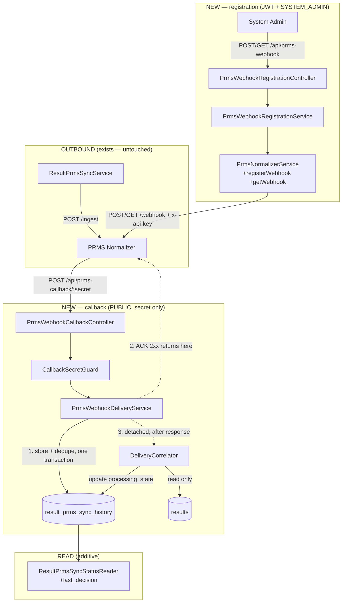

# Design — Bilateral / PRMS Sync — Decision Webhook

- **Module:** `bilateral/prms-sync` (server) — family child **5**
- **Spec id:** `2026-09-decision-webhook`
- **Status:** `draft`
- **Owner:** Juan Cadavid / ARI
- **Linked requirements:** [`./requirements.md`](./requirements.md)
- **Linked TRD:** [`docs/trd/trd.md`](../../../../trd/trd.md) §9.1 (integrations), §7.1 (result lifecycle)
- **Contract sources:** [`prms-result-decision-webhooks.md`](../../../../technical-docs/prms-normalizer/prms-result-decision-webhooks.md) **[WH]** · [`prms-normalizer-technical-field-documentation.md`](../../../../technical-docs/prms-normalizer/prms-normalizer-technical-field-documentation.md) **[FD]**
- **Verified at:** **commit `170da206`** for every row re-run on 2026-09-22 (the ground-truth-drift pass — P-2, P-3, P-4, P-5, P-8, P-17 and their `requirements.md` counterparts C-4…C-6, C-11); **commit `e0c8c443`** for every other citation, which the 2026-09-21→22 merge did not touch. **Each row's own *Verified at* column is authoritative** — this header states the two commits in play, not a single one. *(Corrected 2026-09-22: this line previously claimed every citation ran at `e0c8c443`, which six rows in the table already contradicted.)*
- **Last updated:** 2026-09-22

> **Numbering note.** The Premise Ledger is placed at **§2**, before the decisions that rest on it, and the `general-setup/design.md` sections follow shifted by one. The template is a format source; premises before decisions is the reading order that makes the decisions checkable.

---

## 1. Goals & Non-Goals

### Goals

| # | Goal | Requirements |
|---|---|---|
| G-1 | STAR can register and read its PRMS callback destination from inside the product, per environment. | R-PWH-001, R-PWH-002, R-PWH-009 |
| G-2 | A public callback endpoint stores every delivery and acknowledges inside the 15 s window. | R-PWH-003, R-PWH-005, NFR-PWH-001 |
| G-3 | The history is complete and append-only — uncorrelated, unreferenced and malformed deliveries included. | R-PWH-005, R-PWH-006 |
| G-4 | A verdict is readable on the result **without disturbing the outbound sync state**. | R-PWH-007, R-PWH-008 |
| G-5 | The new public surface cannot widen the auth boundary of anything else. | R-PWH-004 |

### Non-Goals

Fenced in `requirements.md` §6 (NG-1 … NG-7). Restated only where a reader would otherwise assume the opposite: **no UI, no write to `results`, no HMAC, no re-push, no reconciliation job, no change to the outbound push.**

---

## 2. Premise Ledger

**Count:** 18 rows — **17 verified**, **1 partly settled** (P-14b: TEST verified 2026-09-22, PROD still `UNVERIFIED`, Impact **High**; none Low). *Derived by counting the table below, never restated from an earlier draft (KZ-005).*
**Blast-radius triggers:** all three fire, and `consumer` and `shared-state` each fire **twice**. `live-path` → P-7. `shared-state` → P-8 (`ResultPrmsSyncStatusReader`) **and P-16** (`LoggingInterceptor` / `ResponseInterceptor` / `GlobalExceptions` — **three** globally-registered wrappers, shared by every controller in the app). `consumer` → P-6 (the sync-status response shape) **and P-15** (a hand-maintained mirror of `PrmsSyncOutcome` in the *client* package).

> **Ground-truth drift, 2026-09-22 (not a Judgment Day finding — the repository moved under the design, the design did not move under review).** Between round-1 correction and round-2 fix, `sync-engine` — the sibling, in-flight, `pending`-status family child this spec depends on — merged `refactor(prms-sync): key the sync log on external_reference, not a FK to results` (`482aec11`) onto this branch, moving HEAD from `e0c8c443` to `170da206`. It dropped `result_prms_sync_log.result_id` and its FK entirely, re-keying the table on `(external_reference, result_year)`, and relocated `common-fields.builder.ts`'s content by ~100 lines in the same merge. **Five rows cited files that moved: P-2 (substantively — its FK evidence no longer exists), P-3, P-4, P-5 (substantively — the query shape changed), P-8.** Each was re-run against `170da206` and is marked individually below; **no conclusion this design depends on changed** — DD-1's decision to keep verdicts out of `result_prms_sync_log` survives on stronger, better-corroborated grounds (P-2, P-5) than the ones it shipped with. This is the family's own concurrency risk (root `CLAUDE.md` §4.3) landing mid-review rather than mid-execution — caught here because the Premise Ledger's citations are re-runnable, not because anyone watched for it.

> **Revised at Judgment Day round 1 (2026-09-21).** The reviewed draft claimed 14 rows / 2 `UNVERIFIED`. Two blind judges re-ran every citation: **12 of 14 reproduced exactly**, and **both rows the draft flagged as open were wrong** — P-7 was settleable at source and true, P-14 was two premises wearing one row. Meanwhile the round's two severe defects lived in territory **no row covered**: what the inherited response envelope emits (now **P-16**) and whether the repo's e2e harness can observe middleware at all. Rows P-15 and P-16 exist because of that round. A ledger is only as good as the premises it thought to doubt.

| # | Claim | Class | Citation (as run) | Verified at | If false | Settled by |
|---|---|---|---|---|---|---|
| **P-1** | No webhook or delivery surface of any kind exists in the server today. | `existence` | `git grep -in "webhook" -- server/researchindicators/src` → **0 hits**; `git grep -inE "delivery.?id" -- server/researchindicators/src` → **0 hits** | `e0c8c443` | The child becomes a modification of an existing surface, not a creation — every task's file list changes. **Impact: High** | — |
| **P-2** | `result_prms_sync_log` still cannot hold a decision-webhook delivery — but the FK this row originally cited is **gone**. | `existence` | **Re-verified 2026-09-22 at HEAD `170da206` (ground-truth drift, not a Judgment Day finding — see the callout below).** `sync-engine` shipped `1790023167000-replaceResultIdWithOfficialCodeInPrmsSyncLog.ts` on 2026-09-21: `result_id` and `FK_result_prms_sync_log_result_id` are **dropped**; the table is re-keyed on `(external_reference, result_year)` (`entity.ts:14-19`, new index `idx_result_prms_sync_log_code_year`). What survives as the reason for a new table: `attempt_number` stays `nullable: false` (`entity.ts:45-49`) — a decision has no natural attempt number — and the entity's own comment (`:27-36`) explains the new key **deliberately groups a live result with its snapshots**, *"identifies the subject the way PRMS does"*, exactly because two rows sharing one `external_reference` must never be pushed as two separate attempts. That is correct for an **outbound** dedup and is the **wrong** grouping for an **inbound** verdict, which DD-6 requires to land on the live row alone — never a snapshot. Independent corroboration, not contradiction, of DD-6's caution. | `170da206` | Proposal option B remains not viable, now for a data-shape reason instead of a structural one — **DD-4's new table is still necessary; only its justification changed.** **Impact: Low** *(downgraded from High — the conclusion did not move, only its evidence)* | — |
| **P-3** | STAR's outbound `external_reference` is `String(result_official_code)`, and is mandatory at payload-build time. | `data-env` | `common-fields.builder.ts:421-426` *(re-verified 2026-09-22 at HEAD `170da206` — the builder grew substantially in the `sync-engine` merge; content byte-identical, citation moved from `:317-323`)* — `external_reference: String(requirePresent(aggregate.result_official_code == null ? null : String(...), 'external_reference'))` | `170da206` | The correlation key is wrong: **DD-6 and R-PWH-007 are rebuilt**, and T-06 is discarded. **Impact: High** | — |
| **P-4** | `result_official_code` is **not** unique on its own. The live row is selected by **four** predicates, not two: `platform_code`, `result_official_code`, `is_active`, `is_snapshot = false`. | `data-env` | `result.entity.ts:75-82` (bigint, `nullable: false`, no unique); index `idx_results_official_code_snapshot_report_year` on `['result_official_code','is_snapshot','report_year_id']` at `:59-63` *(re-verified 2026-09-22 at HEAD `170da206` — an unrelated relation removed earlier in the file shifted these citations by −2; content unchanged)*. Convention re-read in full at `results.util.ts:30-43` — `where.platform_code = reportingPlatforms;` at **`:38`** (defaulting to `ReportingPlatformEnum.STAR`), then `result_official_code` `:41`, `is_active` `:42`, `is_snapshot = false` `:43` | `170da206` | DD-6's guard and R-PWH-007's fixture change shape; a verdict could land on a same-code result from another reporting platform. **Impact: Low** *(widened at round 1, JD-8 — the draft cited `:41-43` and dropped `platform_code`, the predicate that does most of the narrowing)* |
| **P-5** | The existing sync-status read surface selects "the last attempt" by `ORDER BY attempt_number DESC LIMIT 1`, and the query resolving *which* log rows count for a result changed shape (still resolves to the same rows). | `location` | `result-prms-sync-status.reader.ts:11-31` (`LAST_ATTEMPT_SQL`), `:67-81` (`deriveSyncState`) *(re-verified 2026-09-22 at HEAD `170da206`).* The query now matches via `WHERE external_reference = (SELECT result_official_code FROM results WHERE result_id = ?) AND result_year = (SELECT report_year_id FROM results WHERE result_id = ?)` instead of a direct FK join — following C-4/P-2's drift — but still ends `ORDER BY attempt_number DESC LIMIT 1`. The ordering column DD-1 depends on is unchanged | `170da206` | **DD-1's principal argument is unchanged and, if anything, reinforced:** the log's identity is now explicitly `(external_reference, result_year)`, a pair with no defined value for an inbound decision — writing a verdict there still means fabricating an `attempt_number` and hijacking `last_attempt`. **Impact: High, argument holds** | — |
| **P-6** | Every reader of the PRMS sync-**status** response shape, repository-wide. Server: `result-prms-sync.controller.ts`, `result-prms-sync-status.reader.ts`, `dto/prms-sync.dto.ts` (+ 2 sibling specs). **Client: none** — the client calls only `POST results/:code/prms-sync`, never the `GET`. | `consumer` | `git grep -rn "PrmsSyncStatusDto\|sync_state\|last_attempt" -- server client \| grep -v node_modules` → **15 hits, 5 files, all under `server/.../result-prms-sync/`**. Client sweep: `git grep -rn "prms-sync\|prmsSync" -- client \| grep -v node_modules` → **39 hits, 7 files**; the only API call is `POST_PrmsSync` at `api.service.ts:1072-1075` (`POST results/${resultCode}/prms-sync`). **No `GET_PrmsSync` exists.** Scope: both packages, all extensions, `.spec.ts` included | `e0c8c443` | An additive field would have client consumers to migrate — T-07 gains client work and the child stops being server-only. **Impact: Low**. **Narrowed at round 1 (JD-6):** this row covers the **GET status shape only**. A second consumer surface exists and is recorded separately at **P-15** — the sweep pattern here cannot hit a file that duplicates the contract *by value* rather than by symbol | — |
| **P-7** | A `JwtMiddleware` exclusion entry written **without** a leading slash and **relative to the global `api` prefix** (the form `reports/${RESULT_CODE}/pdf` uses) does exclude the route at runtime, identically to the leading-slash form. | `live-path` | **VERIFIED at round 1 — this row shipped `UNVERIFIED` and should not have.** Dispatch chain: PRMS `POST` → `main.ts:54` `setGlobalPrefix('api')` → `app.module.ts:73-106` `JwtMiddleware.forRoutes({path:'*'})` minus the exclusion list → `main.routes.ts` `prms-callback` → `PrmsWebhookCallbackController`. Branch point = the exclusion match, and it is settled in the installed dependency (`node -e "require('@nestjs/core/package.json').version"` → **10.4.15**): `middleware/builder.js:40` routes each `exclude()` entry through `routeInfoPathExtractor.extractPathFrom`; `middleware/route-info-path-extractor.js` sends any entry **not** in `isAWildcard`'s list `['*','/*','/*/','(.*)','/(.*)']` to `extractNonWildcardPathsFrom`, which returns `prefixPath + addLeadingSlash(path)`; `router/utils/exclude-route.util.js:12-18` applies `addLeadingSlash` on the **matching** side too. The leading slash is normalized on both sides and the global prefix is prepended in both branches, so `/admin(.*)`, `reports/:code/pdf` and `prms-callback(.*)` are handled identically → `/api/prms-callback(.*)` | `e0c8c443` | The callback would 401 and every delivery would be abandoned silently. **It is not false** — both judges reached this independently. **Impact: High, now closed** | — *(verified; **not** by the e2e that formerly owned it — that settler was inert, see P-17)* |
| **P-8** | `ResultPrmsSyncStatusReader` is consumed by exactly one caller and exported from its module. | `shared-state` | `git grep -rn "ResultPrmsSyncStatusReader" -- server/researchindicators/src` (non-spec): declared `result-prms-sync-status.reader.ts:84` *(re-verified 2026-09-22 at HEAD `170da206` — shifted from `:79`; the file's internal query logic changed, the class declaration moved with it)*; injected `result-prms-sync.controller.ts:111` and called at `:209`; registered `result-prms-sync.module.ts:24` and **exported** at `:36` — these three files did not change in the merge. No other module imports it — `ResultPrmsSyncModule` is imported only by `entities.module.ts:199` and `main.routes.ts:89` | `170da206` | An additive DTO field reaches consumers this design did not enumerate; T-07's blast radius widens. **Impact: Low** | — |
| **P-9** | `npm run lint` carries `--fix` and therefore **mutates files** — it cannot serve as a verification gate. | `other` | `package.json` → `"lint": "eslint \"{src,apps,libs,test}/**/*.ts\" --fix"` | `e0c8c443` | Tasks may cite `npm run lint` as a gate. **Impact: Low** (K-001; root `CLAUDE.md` §4.3 already binds this — every task below uses `npx eslint`) | — |
| **P-10** | The server has **four** jest configurations, and the default `npm test` runs **none** of the e2e, integration or fixture suites. | `other` | `package.json`: `test` = `jest` (root config, `rootDir` `src`) · `test:e2e` = `jest --config ./test/jest-e2e.json` (`testRegex` `.e2e-spec.ts$`) · `test:integration` = `jest --config ./test/jest-integration.json` (`.integration-spec.ts$`) · `test:fixtures` = `jest --config ./test/jest-fixtures.json` (`.fixture-spec.ts$`, `maxWorkers: 1`) | `e0c8c443` | A task citing `npm test` as the gate for the auth boundary would cite a command **structurally unable** to run its own e2e spec — the KZ-017 failure exactly. **Impact: High** | — |
| **P-11** | The Dev API host is not publicly routable, and no PROD hostname resolves. | `data-env` | `dig +short main-allianceindicatorstest.ciat.cgiar.org` → `cerberus.cgiarad.org.` / `192.168.199.32` (RFC1918). `dig +short main-allianceindicators.ciat.cgiar.org` → **empty**; `dig +short allianceindicators.ciat.cgiar.org` → **empty**. Run 2026-09-21. *Scope (KZ-017): DNS from inside the CIAT network. It does not prove what AWS sees — but a private A record is not routable from AWS, and [WH] §1 refuses private ranges at registration* | `e0c8c443` | **R-1 closes and DC-9 stops being an accepted risk** — the spec becomes end-to-end verifiable and the §12 rollout gains a live-proof step. **Impact: High** | — |
| **P-12** | `ARI_PRMS_NORMALIZER_HOST` is present but **commented out** in `.env.example`, and the sync engine has never run live. | `data-env` | `.env.example:36` → `# ARI_PRMS_NORMALIZER_HOST=https://v2f4lv8av4.execute-api.us-east-1.amazonaws.com`; [`../HANDOFF.md`](../HANDOFF.md) | `e0c8c443` | An end-to-end proof becomes possible sooner; no task changes. **Impact: Low** | — |
| **P-13** | This repository has already paid for an over-broad `JwtMiddleware` exclusion glob once, and recorded the remedy. | `other` | `main.routes.ts:413-417` — *"intentionally NOT under /admin — the existing JWT middleware exclude pattern `/admin(.*)` … would otherwise bypass auth on these admin-REST endpoints … See execution.md Pivot Record #1"* | `e0c8c443` | DD-3 loses its precedent but keeps its logic; no task changes. **Impact: Low** | — |
| **P-14** | The `app_config` row `ARI_CLARISA_API_KEY` **exists and is active** in both environments. | `data-env` | **VERIFIED — and it was never only the owner's word.** `src/db/migrations/1781879906673-AddNewEnvCl.ts` **inserts the row** (`INSERT INTO app_config (\`key\`, description, category, subcategory) VALUES (?,?,?,?)` with `AppConfigKey.ARI_CLARISA_API_KEY`) — row presence is created by migration, not by testimony. **"Active" is settled too, not assumed:** the migration's `INSERT` does not name `is_active`, and the table's own definition sets `is_active tinyint NOT NULL DEFAULT 1` (`1752097721168-addAppConfigTable.ts:8`), so the row is active by the column's default the instant it is inserted; `git grep -n "ARI_CLARISA_API_KEY" src/db/migrations/*.ts` returns only that one migration — no later migration touches this row's `is_active`. *(Evidence for "active" added at round 2 — Judgment Day round 2, judge B FC-6: the round-1 row asserted "active" on the strength of row-presence alone, which proves existence, not the activity flag.)* [`../family.md`](../family.md) OQ-F8 names that same migration in the very sentence the draft quoted the owner from. `test/prms-sync.e2e-spec.ts:495-505` additionally seeds it | `e0c8c443` | Registration cannot authenticate at all. **Impact: High, now closed** | — |
| **P-14b** | The row's **`simple_value` is populated** in TEST and in PROD. | `data-env` | **PARTLY SETTLED 2026-09-22 — TEST verified, PROD still `UNVERIFIED`.** Leader probe at T-03's pre-check, read directly against the Dev/CORE database `alliancereportingdb` (`192.168.20.210`) that local and Dev share, and that is the environment whose `ARI_PRMS_NORMALIZER_HOST` points at PRMS **TEST**: `SELECT is_active, CASE WHEN simple_value IS NULL THEN 'NULL' WHEN simple_value='' THEN 'EMPTY' ELSE CONCAT('POPULATED len=',LENGTH(simple_value)) END FROM app_config WHERE \`key\`='ARI_CLARISA_API_KEY'` → **row present, `is_active = 1`, `POPULATED len=47`.** The value itself was never printed. So on the TEST side the registration path yields **neither** the `404` (missing/inactive row) **nor** the `503` (present but empty) this row was open about. **What the probe structurally cannot reach (KZ-017):** the PROD database, which this checkout has no access to — the PROD half of this row stands `UNVERIFIED` and is carried by **T-10**, together with OQ-6 / R-1. The probe also reads the table directly, so it bypasses the service's ~5-minute TTL cache (K-016) rather than being subject to it. *(Superseded text, kept for the record: "**UNVERIFIED — confirm at source before relying on it.** This is the claim the code actually depends on, and it is **not** what P-14 asserted. Migration `1781879906673` seeds **no `simple_value`**, so the code does not supply it; the only source is the product owner's statement of 2026-09-14 ([`../family.md`](../family.md) OQ-F8). Citation rule (d): `user-stated` | — | Registration fails and **no destination is ever registered** — G-1 fails silently until someone reads the log. Note the two failures are **distinguishable**: a missing/inactive row throws `NotFoundException` → **`404`** (`app-config.service.ts:78-84`, whose `findConfigByKey` at `:29-33` filters `is_active: true`), while a present row with an empty `simple_value` throws `ServiceUnavailableException` → **`503`** (`prms-normalizer.service.ts:41-44`). **Impact: High** ") | **TEST half settled by the Leader's direct read at T-03's pre-check (2026-09-22).** PROD half still owed — owner: **T-10**. **K-016**: `app_config` is TTL-cached ~5 min and re-saving restarts the window — an empty read right after a save is the cache, not a failure; a direct table read, as used here, is not affected |
| **P-15** | The **client package holds a hand-maintained mirror** of all 8 `PrmsSyncOutcome` members and of the sync *response* shape. | `consumer` | `cat client/research-indicators/src/app/shared/interfaces/prms-sync.interface.ts` → `export type PrmsSyncOutcome = 'IN_FLIGHT' \| 'ACCEPTED' \| 'REJECTED_BY_PRMS' \| 'AUTH_FAILED' \| 'RETRYABLE' \| 'TRANSPORT_FAILED' \| 'UNKNOWN' \| 'REFUSED_BY_STAR'` plus `interface PrmsSyncResponse { outcome; attempt_number; http_status; request_id; prms_result_code; failure_reason }`. Scope: both packages. **P-6's pattern structurally cannot reach this file** — it duplicates the contract *by value*, not by importing a symbol | `e0c8c443` | **DD-1's conclusion is strengthened, not weakened** — extending `PrmsSyncOutcome` would have required a hand-edit in a second package with no compiler linking them. What changes is the *count* DD-1 claims and the trigger coverage. **Impact: Low** *(added at round 1, JD-6)* | — |
| **P-16** | **THREE** globally-registered wrappers — `LoggingInterceptor`, `ResponseInterceptor`, `GlobalExceptions` — read `request.url` at **five** sites in total, writing it into the response **body** and into the **log**, on success and on error alike. | `shared-state` | Enumerated by `grep -rn "request\.url" src/domain/shared/Interceptors/ src/domain/shared/error-management/`, run 2026-09-22: `logging.interceptor.ts:29` (`url = request.url`, logged at `:45` under `ENV.SEE_ALL_LOGS`) · `response.interceptor.ts:50` (`path: request.url` → envelope) **and `:73`** (passed to `logBasedOnStatus`, logged at `:96-107`) · `global.exception.ts:31` (`path: request.url` → envelope) **and `:36`** (`url: request.url` inside `_logger._error`). Registered at `app.module.ts:58-61` (`APP_INTERCEPTOR` → `LoggingInterceptor`, **first**), `:62-65` (`APP_INTERCEPTOR` → `ResponseInterceptor`) and `:66-69` (`APP_FILTER` → `GlobalExceptions`) — every controller in the application. **Sweep completeness:** `grep -rn "APP_INTERCEPTOR\|APP_FILTER\|APP_GUARD\|APP_PIPE" src` returns only these three plus `app-microservice.module.ts:33,37,41` (the same three classes on the RPC app, which takes the `contextType === 'rpc'` branch and never touches `request.url`); the only other `NestMiddleware` is `JwtMiddleware`, whose `req.url` log (`jwr.middleware.ts:40`) sits inside the `LOCAL_AUTH_BYPASS` dev branch and is unreachable for an excluded route | `170da206` | **The callback secret is in the path, so `request.url` IS the secret.** Unmodified, these wrappers return the credential to PRMS inside every `2xx` body and log an attacker's guess on every wrong-secret `404` — violating R-PWH-004 AC.4 and NFR-PWH-002 on the happy path. **Impact: High** *(added at round 1, JD-1 — forces **DD-10**. **Widened 2026-09-22 after the final re-judgment, FC2-1/FC2-2:** this row shipped naming only two wrappers and three read sites while §3.1, §9, DD-10 v2 and `R-PWH-004 AC.4` had already moved to three — the premise row that owns the claim was the last site still stating the old count.)* | — |
| **P-17** | The repo's e2e harness **cannot observe `JwtMiddleware` at all** — both existing suites stub its prototype. | `other` | `test/prms-sync.e2e-spec.ts:230-235` *(re-verified 2026-09-22, corrected from `:228-234` — round 2, both judges)* — `jest.spyOn(JwtMiddleware.prototype, 'use').mockImplementation(async (req,_res,next) => { req.user = currentActor; return next(); })`, unconditional. `test/results-ai-formalize-bulk.e2e-spec.ts:98-109` documents *why*: `.overrideProvider(JwtMiddleware)` compiles but does not take effect. `@nestjs/core` `middleware/utils.js:47` evaluates the exclusion **before** `instance.use(...)`, so with `use` stubbed an excluded route and a guarded one are indistinguishable | `170da206` | **R-PWH-004 AC.2 passes vacuously and AC.3 cannot go red at all** (the stub injects a user, so the tokenless case yields `403`, not `401`), and DC-3's falsifier cannot redden. T-04 must build a non-stubbing harness — unscoped work the draft budget did not carry — or substitute the gate. **Impact: High** *(added at round 1, JD-2)* | — |

---

## 3. Architecture

**The load-bearing shape:** steps 1 and 2 are the request; step 3 is not. Nothing between PRMS and the `2xx` touches `results`.

### 3.1 Composition

| Path | Responsibility |
|---|---|
| `src/domain/entities/prms-webhook/prms-webhook.module.ts` | Module; registers both controllers. |
| `…/prms-webhook-registration.controller.ts` | `SYSTEM_ADMIN` edge for register + read (R-PWH-001/002). |
| `…/prms-webhook-registration.service.ts` | Resolves the configured callback URL, delegates to `PrmsNormalizerService`, interprets the empty-`response` case. |
| `…/prms-webhook-callback.controller.ts` | Public edge. Store-then-acknowledge only (R-PWH-003). |
| `…/guards/callback-secret.guard.ts` | Timing-safe path-secret check (R-PWH-004). |
| `…/prms-webhook-delivery.service.ts` | Classifies the body, calls the repository's transaction, detaches the correlator. **Does not own the transaction** — see the repository row. |
| `…/delivery-correlator.service.ts` | Post-acknowledgement correlation + verdict application (R-PWH-007). |
| `…/entities/prms-webhook-delivery.entity.ts` | The append-only table. |
| `…/repositories/prms-webhook-delivery.repository.ts` | **Sole owner of the transaction** — the dedupe `FOR UPDATE` read, the insert, and the single retry on `ER_LOCK_DEADLOCK` (1213) / `ER_LOCK_WAIT_TIMEOUT` (1205) (§6.3 step 3b, DD-5, `R-PWH-006 AC.7`, DC-12). Also the history queries. *(Ownership pinned here 2026-09-22: DD-5 said repository, AC.7 said "delivery service", and this table split the transaction across both.)* |
| `…/dto/prms-webhook.dto.ts` | Request/response DTOs + the callback body contract. |
| `…/enum/delivery-correlation-outcome.enum.ts` | `CORRELATED` · `UNKNOWN_REFERENCE` · `NO_REFERENCE` · `MALFORMED` · `DUPLICATE`. |
| `src/db/migrations/<ts>-createPrmsWebhookDeliveryTable.ts` | Schema. |
| `src/db/migration-specs/<ts>-createPrmsWebhookDeliveryTable.spec.ts` | Migration spec. **These are NOT siblings of the migration** — they live in their own directory (11 files; analogue `1789479131116-createResultPrmsSyncLogTable.spec.ts`). *(JD-9)* |
| `test/prms-webhook.e2e-spec.ts` | The auth-boundary suite. **Must NOT stub `JwtMiddleware.prototype.use`** — see P-17 and DD-11. *(JD-2: the reviewed draft had no line item for the gate settling its highest-impact premise.)* |
| **Modified:** `src/domain/tools/prms-normalizer/prms-normalizer.service.ts` | `+registerWebhook(url)`, `+getWebhook()`. Ingest untouched. |
| **Modified:** `src/app.module.ts` | One exclusion entry — `prms-callback(.*)`. |
| **Modified:** `src/domain/routes/main.routes.ts` | Two top-level entries: `prms-webhook`, `prms-callback`. |
| **Modified:** `src/domain/entities/result-prms-sync/result-prms-sync-status.reader.ts` + its DTO | Additive `last_decision`, own query (DD-9). |
| **Modified:** `.env.example` | Two new commented `ARI_*` entries — the URL with its TEST value, the secret with **no** value. |
| `src/domain/shared/utils/path-redaction.util.ts` | **New** — the single redaction function every site below calls. One place to reason about, one place to test (DC-11). |
| **Modified:** `src/domain/shared/Interceptors/logging.interceptor.ts` | **One** read site: `:29` (`url = request.url`) — the only wrapper that assigns to a variable. Wrapping it covers the `_log` at `:45`. |
| **Modified:** `src/domain/shared/Interceptors/response.interceptor.ts` | **TWO** read sites, both inline, neither assigned to a variable: `:50` (`path: request.url` → the envelope) **and `:73`** (`request.url` passed to `logBasedOnStatus`, which logs it at `:96-107`). **Both must be wrapped.** |
| **Modified:** `src/domain/shared/error-management/global.exception.ts` | **TWO** read sites, both inline: `:31` (`path: request.url` → the envelope) **and `:36`** (`url: request.url` inside `_logger._error`). **Both must be wrapped** — and `:36` is the one that matters most, because the secret guard's `404` is raised before the controller runs, so this filter handles that branch end to end. |

> **Five read sites, not three** (`grep -rn "request\.url" src/domain/shared/Interceptors/ src/domain/shared/error-management/`, run 2026-09-22 at `170da206`). The round-2 draft of this table named only `:29`, `:50`, `:31` and described the change as *"the single read site inside each wrapper"* — false for two of the three files, and the two it omitted were **both logger paths**. Corrected after the final re-judgment (FC2-1, both judges + an orchestrator re-run). **The rule for the implementer: wrap every one of the five, not one per file.**

Sibling `*.spec.ts` for every unit above (root guide §4.1).

### 3.2 Reuse

`PrmsNormalizerService` (host + key, P-14 / P-14b) · `AppConfigService.getEnv` (per-call key read) · `BaseApi.getRequest` (`base-api.ts:123`) / `postRequest` (`:148`) · `RolesGuard` + `SecRolesEnum.SYSTEM_ADMIN` · `AuditableEntity` · `LoggerUtil` · the `ARI_IS_PRODUCTION` discriminator (`result-prms-sync.service.ts:130`) · the live-row convention in full (`results.util.ts:38,41-43`).

**Reused but MODIFIED — the draft wrongly listed these as untouched:** `LoggingInterceptor`, `ResponseInterceptor` and `GlobalExceptions` — **all three**. P-16 originally named two; round-2 re-verification (judge B FC-1) found a third: `LoggingInterceptor` is a **second**, separately-registered `APP_INTERCEPTOR` (`app.module.ts:58-61`, ahead of `ResponseInterceptor` at `:62-65`) that independently reads `request.url` (`logging.interceptor.ts:29`) and logs it under `ARI_SEE_ALL_LOGS` (`:45`). All three emit the secret, and DD-10 v2 changes all three through one shared helper. This is shared cross-cutting code touched by a child spec that claimed to touch none — declared, not slipped in.

**Not reused, deliberately:** `result_prms_sync_log` (P-2) and `PrmsSyncOutcome` (DD-1).

---

## 4. Data Model

### `result_prms_sync_history` — new, append-only

> ⚠️ **AMENDED 2026-09-23 by an owner-approved Pivot.** This table was specified as `prms_webhook_delivery`, an **inbound delivery log**. It is now the **synchronization history**: it also records STAR's own successful pushes, which PRMS never sends. Full reasoning, the eight design decisions and the measured blast radius are in [`./execution.md`](./execution.md) → *Pivot Record: T-01*. Implemented by **T-01b**; the outbound write is **T-11**.
>
> **Renames:** `prms_webhook_delivery` → `result_prms_sync_history` · `received_at` → `occurred_at`. **Nothing was removed** — 22 of T-01's 23 columns are untouched, and the table resolves to **30** columns (23 + 7). Figure derived in [`./execution.md`](./execution.md) → *Pivot Record: T-01*; do not restate it elsewhere.
>
> **Seven columns added:**
>
> | Column | Type | Null | Notes |
> |---|---|---|---|
> | `event_source` | `varchar(10)` | **no** | `STAR` \| `PRMS` — which side generated the row. **The discriminator that keeps the two populations legible**; every query meaning *"deliveries"* must filter on it |
> | `status` | `varchar(30)` | yes | `PENDING_REVIEW` \| `APPROVED` \| `REJECTED` — the timeline badge. Derivable, but **stored**: append-only, fixed at write time, and a future PRMS verdict the code cannot map still renders what was recorded |
> | `actor_user_id` | `bigint` | yes | **Outbound only.** Our user → `sec_users`. An **id**, because this person exists in our system and a stored name would freeze on rename |
> | `reviewer_name` | `varchar(255)` | yes | **Inbound only.** **Name only, no id** — a PRMS reviewer does not exist in our system. [WH]'s own vocabulary is *"Reviewer's reason"* |
> | `reviewer_role` | `varchar(191)` | yes | *"SP02 Science Program reviewer"* — the label as sent, for display |
> | `science_program_code` | `varchar(20)` | yes | *"SP02"*. **Deliberately separate from the role string**: the role is display, the code is data — filterable, joinable to CLARISA later without parsing prose |
> | `changes` | `json` | yes | The *"See what changed"* payload. **JSON rather than a table** because PRMS has committed to no shape; inventing columns for data never seen is guessing a schema. Display-only today; extracting to a table later is a backfill from our own data, which is the cheap direction |
>
> **The three `NOT NULL` columns do NOT relax.** An outbound row is `correlation_outcome = CORRELATED` (a push knows its result), `processing_state = PROCESSED`, and carries its `environment`.
>
> **Ordering:** the timeline sorts by `COALESCE(decided_at, occurred_at)` — `decided_at` is when PRMS decided and drives the display; `occurred_at` is when we received it and is our audit. Outbound and `MALFORMED` rows have no `decided_at`.
>
> **Reads filter `duplicate_of_id IS NULL`** — every delivery is still recorded, but a repeat is not a timeline entry.

**Original specification, below, remains accurate for every column it lists** — only the table name and `received_at` changed.

| Column | Type | Null | Notes |
|---|---|---|---|
| `id` | `bigint` PK auto | no | |
| `delivery_id` | `varchar(191)` | **yes** | `x-prms-delivery-id`. Nullable: [WH] does not guarantee the header, and R-PWH-006 AC.4 requires storing a delivery without one. **Not unique** — see DD-5. |
| `received_at` | `timestamp` | no | Ordering key for the history (**not** `attempt_number` — DD-1). |
| `environment` | `varchar(20)` | no | `TEST` / `PROD` (R-PWH-009 AC.4). |
| `correlation_outcome` | `varchar(40)` | no | The enum above. VARCHAR, not MySQL `ENUM`, so a new value needs no schema change — the property `PrmsSyncOutcome` was built for (`prms-sync-outcome.enum.ts:1-9`), preserved without reusing that enum. |
| `result_id` | `bigint` | **yes** | The resolved live STAR result. **Nullable is the whole reason this table exists** (P-2). |
| `external_reference` | `varchar(191)` | yes | Exactly as received. |
| `prms_result_id` | `bigint` | yes | `result_id` from the callback body — PRMS's own id. |
| `prms_result_code` | `bigint` | yes | `data.result_code`. **Retained, never written to `results`** (NG-6, DD-7). |
| `decision` | `varchar(20)` | yes | `APPROVE` / `REJECT`, **verbatim** (R-PWH-005 AC.6). Null on `MALFORMED`. |
| `justification` | `text` | yes | Verbatim; `NULL` when omitted, **never `''`** (R-PWH-005 AC.5). |
| `decided_at` | `timestamp` | yes | From the body. |
| `raw_body` | `json` | yes | The delivery whole (DD-8). Null only if the body was unparseable JSON. |
| `raw_headers` | `json` | yes | Delivery-relevant headers. **Never the secret** (NFR-PWH-002). |
| `processing_state` | `varchar(20)` | no | `RECEIVED` → `PROCESSED` \| `PROCESSING_FAILED`. The durable marker for DD-4. |
| `processing_error` | `text` | yes | |
| `duplicate_of_id` | `bigint` | yes | The row this one repeats (R-PWH-006 AC.2). |
| + `AuditableEntity` | | | Root-guide rule. `created_by` is **NULL** — a callback has no user. `is_active` defaults `TRUE` and **is never flipped by this spec** (append-only, R-PWH-005 AC.7). |

**Indexes:** `idx_result_prms_sync_history_delivery_id` (`delivery_id`) · `idx_result_prms_sync_history_result` (`result_id`) · `idx_result_prms_sync_history_occurred_at` (`occurred_at`). *(Renamed by the 2026-09-23 Pivot to follow the repo's `idx_<table>_<purpose>` convention — T-01b. Originally `idx_prms_webhook_delivery_*`, the third on `received_at`.)*

**No FK on `result_id`** — an `UNKNOWN_REFERENCE` row must survive, and a result deleted later must not erase its own history. Integrity is the correlator's, not the schema's; stated rather than assumed.

**No change to `results`, and no change to `result_prms_sync_log`.** **No `@OpenSearchProperty`.** **No backfill** — [WH] §3: there is no backlog to recover.

Migration: `<timestamp>-createPrmsWebhookDeliveryTable.ts`, append-only, forward + revert.

---

## 5. API Surface

`main.ts:54-57` enables URI versioning with **no `defaultVersion`**. No handler here declares `@Version(...)`, so **none of these paths carries `/v1`**.

### `POST /api/prms-webhook` — register (R-PWH-001)
Controller `prms-webhook-registration.controller.ts` · `@Roles(SecRolesEnum.SYSTEM_ADMIN)` + `RolesGuard` · **no body** · `data`: the PRMS destination object + `message` · Swagger required.

Errors: `401` · `403` · **`404` when the `ARI_CLARISA_API_KEY` row is missing or inactive** (`AppConfigService.getEnv` throws `NotFoundException` — `app-config.service.ts:78-84`, whose `findConfigByKey` filters `is_active: true` at `:29-33`) · **`503` when the host is unset, or the row exists with an empty `simple_value`** (`prms-normalizer.service.ts:41-44`, `:71-77`) · PRMS `400`/`401`/`502`/`503` surfaced with `message` intact.

> **The `404` and the `503` are different diagnoses and must not be collapsed** (JD-5): one says *the configuration row is not there*, the other says *it is there and blank*. The reviewed draft asserted `503` for both and would have sent an operator looking in the wrong place.

### `GET /api/prms-webhook` — read back (R-PWH-002)
Same guards · `data: { registered: boolean, destination: object | null, message: string }` · `registered` derived from **emptiness of `response`**, never the HTTP status (AC.3).

### `POST /api/prms-callback/:secret` — the callback (R-PWH-003, R-PWH-004)
Controller `prms-webhook-callback.controller.ts` · **no JWT, no roles** · `CallbackSecretGuard` · body per [WH] §4, validated **leniently** — a shape violation is data (`MALFORMED`), not a `400` · responses: `2xx` always once the secret is valid; `404` on a bad/missing/unconfigured secret · Swagger **without** `@ApiBearerAuth`, secret shown as a placeholder.

> **Why `404` and not `401`.** A `401` confirms the path exists. A `404` does not. PRMS will retry five times and abandon either way, which is the correct loud failure for a misconfigured secret (R-4).

### `GET /api/results/:resultCode/prms-sync` — additive (R-PWH-008)
Existing handler, existing guards. `data` gains `last_decision: { decision, decided_at, justification, prms_result_code, delivery_received_at } | null`. `sync_state`, `is_synced_to_prms`, `prms_result_code`, `last_attempt` are **unchanged** — DD-9, gated by R-PWH-008 AC.4.

**The two prefixes `prms-webhook` and `prms-callback` are disjoint** — neither is a prefix of the other, so no glob over one can reach the other (DD-3).

---

## 6. Workflows & Business Rules

### 6.1 Registration (R-PWH-001)
1. `RolesGuard` admits `SYSTEM_ADMIN` only.
2. Read `ARI_PRMS_WEBHOOK_CALLBACK_URL`; unset → `503` naming it (R-PWH-009 AC.3).
3. `PrmsNormalizerService.registerWebhook(url)` → `assertHost()`; read `ARI_CLARISA_API_KEY` from `app_config` **per call**; `POST {host}/webhook` with `x-api-key` and body `{ url }` **and nothing else** (AC.3).
4. Log outcome via `LoggerUtil` — never the key, never the secret.
5. Surface PRMS's `message` verbatim.

### 6.2 Read-back (R-PWH-002)
`getWebhook()` → `GET {host}/webhook`. `registered = Object.keys(response ?? {}).length > 0`. Empty → `registered: false`, `destination: null`, success envelope.

### 6.3 The callback — the load-bearing sequence (R-PWH-003 … R-PWH-006)

| Step | In the request? | Action |
|---|---|---|
| 1 | ✅ | `CallbackSecretGuard`: timing-safe compare. Mismatch, missing, or secret unconfigured → `404`, **no row written** (R-PWH-004 AC.1, AC.6). |
| 2 | ✅ | Parse the body leniently; classify shape violations as `MALFORMED`. Never throw. |
| 3 | ✅ | **One transaction:** `SELECT id FROM result_prms_sync_history WHERE delivery_id = ? AND duplicate_of_id IS NULL FOR UPDATE` → if a row exists, insert with `DUPLICATE` + `duplicate_of_id`; else insert with the classified outcome and `processing_state = RECEIVED`. Commit. |
| 3b | ✅ | **On `ER_LOCK_DEADLOCK` (1213) or `ER_LOCK_WAIT_TIMEOUT` (1205), retry the transaction once**, then fail. Owned by `prms-webhook-delivery.repository.ts` (§3.1); gated by `R-PWH-006 AC.7` and **DC-12**. *(1205 and the owner added 2026-09-22 — FC2-3: this step named only 1213 while DD-5, AC.7 and DC-12 all required both.)* See DD-5: InnoDB gap locks are mutually compatible, so genuine simultaneity yields a deadlock — a delivery *never recorded* — not a double-apply. Without this branch the endpoint would violate R-PWH-005 (*every delivery is recorded*) and NFR-PWH-005. *(JD-7)* |
| 4 | ✅ | **Return `2xx`.** The path redaction (DD-10 v2) happens transparently, upstream, inside the three global wrappers — the handler does nothing special. |
| 5 | ❌ | Detached: correlate + apply + set `processing_state`. Never awaited. Every throw caught and logged (R-PWH-003 AC.4). |

**A `DUPLICATE` row skips step 5 entirely** — that is what "recorded as a repeat rather than applied twice" means (R-PWH-006 AC.1).

### 6.4 Correlation and verdict (R-PWH-007, R-PWH-008)
1. No `external_reference` (absent or `null`) → `NO_REFERENCE`, stop.
2. Not a valid integer → `UNKNOWN_REFERENCE`, stop. **Never coerce to `0`** (AC.2).
3. `SELECT result_id FROM results WHERE platform_code = 'STAR' AND result_official_code = ? AND is_active = TRUE AND is_snapshot = FALSE` — **all four** predicates of the convention (`results.util.ts:38,41-43`). *(JD-8: the draft dropped `platform_code`, the predicate that makes the official code selective.)*
4. No row → `UNKNOWN_REFERENCE`. More than one → take the first, **log a warning naming the ambiguity** (AC.4).
5. One row → `CORRELATED`, write `result_id`, `processing_state = PROCESSED`.
6. **No write to `results` occurs in any branch** (AC.3, DD-7).

### 6.5 The read surface (R-PWH-008)
A second, independent query — latest non-duplicate `CORRELATED` row for the result, ordered by `decided_at DESC`. `LAST_ATTEMPT_SQL` and `deriveSyncState` are **not edited** (DD-9).

---

## 7. Admin SSR Panel Impact

**None.** No page, route, service or sidebar entry. The operator surface is REST-only (NG-1).

---

## 8. Integration Impact

**PRMS Normalizer** — `src/domain/tools/prms-normalizer/prms-normalizer.service.ts`, two additive methods. Same host, same `x-api-key`, same per-call key read as `ingest` ([WH] §"Service URLs", §"Authentication"). **Ingest is not touched.**

**New environment variables** (both **per environment**, never derived from each other, no defaults — K-005 / R-PWH-009):

| Variable | Purpose | `.env.example` |
|---|---|---|
| `ARI_PRMS_WEBHOOK_CALLBACK_URL` | The HTTPS URL registered with PRMS. Must be public, FQDN, no credentials, ≤ 500 chars ([WH] §1). | commented, TEST value shown — matching `.env.example:36` |
| `ARI_PRMS_WEBHOOK_SECRET` | The path secret. A credential. | commented, **no value** |

`ARI_PRMS_NORMALIZER_HOST` is **reused, not duplicated** — one host var already selects the environment (P-12).

No cron, no RabbitMQ, no Socket.IO event, no OpenSearch change.

---

## 9. Security & Authorization

| Question | Answer |
|---|---|
| Who may register/read? | `SYSTEM_ADMIN` only, JWT required. |
| Who may call the callback? | Anyone holding the secret. **This is the application's first public write endpoint** — `app.module.ts:73-106` currently excludes only read paths and the SSR admin subtree. |
| Machine token (`client_id/client_secret`)? | **No.** The callback is not on the machine-token path; PRMS holds a secret, not a STAR credential. |
| New secrets? | `ARI_PRMS_WEBHOOK_SECRET`. Never logged, never returned, never stored on a delivery row, never in Swagger. Rotated by changing it and re-registering ([WH] §1 upsert). **This is not achieved by intent — it requires DD-10**, because the inherited envelope would otherwise emit it (P-16). |
| PII? | **Yes, and it is retained whole** — `data` is *"the full enriched result document"* and may carry contributor names and emails. DD-8, NFR-PWH-004, **DC-8 (accepted risk)**, OQ-3. Parent: PRD OQ-7. |
| Signature verification? | **Impossible today.** `x-prms-signature` is *"Reserved … Not sent today"* ([WH] §4). NG-3. |

**Two lines carry the security weight of this spec.**

1. **The secret in the path meets three global wrappers that echo `request.url`** (P-16). Unmodified, the credential is returned to PRMS in every `2xx` body and an attacker's guess is logged on every wrong-secret `404`. **DD-10 v2** fixes this with one shared redaction helper called from all three read sites — no bypass of `ResponseInterceptor`, so `ServerResponseDto` (PRD `AC-API-Surface`) is preserved on every response, callback included. This was the round's most severe finding, and its first fix (round 1: an `@Res()` bypass) was itself defective — round 2 replaced the bypass with a same-shape change to the wrapper, not an exception to it.
2. **The exclusion glob.** `prms-callback(.*)` must not reach `prms-webhook`. Disjoint top-level prefixes (DD-3) make that structural rather than careful; R-PWH-004 AC.3 is the test, and P-13 is the precedent for why it matters in this repo specifically. Note **P-17**: the repo's current e2e harness cannot observe the middleware at all, so that test needs a harness before it is evidence.

---

## 10. Observability

| Event | Level | Fields |
|---|---|---|
| Registration attempt/outcome | `log` / `warn` | environment, host, **URL registered**, PRMS `message`, `requestId`. **Never the key or the secret.** |
| Delivery received | `log` | `delivery_id`, environment, `correlation_outcome`, `external_reference`, and the STAR official code when correlated. |
| Bad secret | `warn` | source IP, path prefix — **never the supplied secret** (logging it logs a guess at a credential). |
| Ambiguous correlation | `warn` | `external_reference` and the count of live matches (6.4 step 4). |
| Post-acknowledgement failure | `error` | `delivery_id` + the error. The acknowledgement is already sent. |

No new `sync_process_log` row type — that table models scheduled sync jobs, and a callback is not one.

---

## 11. Testing Strategy

**Four jest configs exist and `npm test` runs none of the other three** (P-10). Each gate below names the command that actually runs it.

| Tier | Command | What it gates here |
|---|---|---|
| Unit | `npm test -- --silent` | Correlation, dedupe, store-then-ack, secret compare, empty-`response` interpretation, entity metadata, reader additivity |
| E2E | `npm run test:e2e` | **The auth boundary** — callback reachable unauthenticated, registration `401`, wrong secret `404`. ⚠️ **Only on a harness that does not stub `JwtMiddleware.prototype.use`** (P-17 — the stub is at `test/prms-sync.e2e-spec.ts:230-235`, corrected at round 2 from `:228-234`). On the repo's current pattern this tier gates **nothing** here: AC.2 passes vacuously and AC.3 cannot redden. **P-7 is settled at source instead** (see its row), not by this tier. |
| Build | `npm run build` | **DC-5.** `tsconfig.build.json` excludes `**/*spec.ts`, so the unit tier is structurally blind to this class |
| Lint | `npx eslint <paths>` | **Not** `npm run lint` — it carries `--fix` and mutates (P-9, K-001) |
| Migration | `npm run migration:test:execute` then `npm run migration:test:revert` | Against the disposable TEST scratch schema — **never** the shared Dev database. Note `npm run migration:run` **does not exist** (JD-10). The spec file goes in `src/db/migration-specs/`, not beside the migration (JD-9) |
| Secret redaction | `npm test -- --silent` | **DC-11, widened at round 2 and again 2026-09-22 (T-08 amendment — six assertions, not two; see requirements DC-11)** — the callback's `2xx` body and the wrong-secret `404` log carry no segment beyond the route prefix, **AND** a non-callback route's `data.path` is unchanged (DD-10 v2). The second assertion is what makes the redaction's *scope*, not just its presence, falsifiable — see requirements DC-11 |

Mock strategy: `PrmsNormalizerService` stubbed at the HTTP boundary for registration tests; the correlator stubbed with a **deferred, never-settling promise** for R-PWH-003 AC.2 — a synchronous stub cannot exercise that assertion and is explicitly disqualified.

**What no tier reaches:** a real delivery from PRMS (**DC-9**, P-11). Recorded as an accepted risk, not substituted.

---

## 12. Rollout

1. **Migration first, code second.** The table must exist before any callback can land. Per root `CLAUDE.md` §4.3 (**K-015**), the pipeline deploys **code only** — applying the migration is a separate, human-decided step. Check pending state with `npm run typeorm migration:show -- -d ./src/db/config/mysql/orm.config.ts` (it is **not** an npm script) and normalize ANSI before counting (**K-014**).
2. **Set both variables** per environment. Nothing registers without them.
3. **Register TEST** via `POST /api/prms-webhook`, then **read it back** via `GET`. This is the first real exercise of **P-14b** (`simple_value` populated) — **P-14 itself (row presence + active) is already closed**, so a failure here is not "the row is missing". Read the status code: **`404`** means `ARI_CLARISA_API_KEY` is missing or inactive (it should not be — P-14); **`503`** means the row exists but `simple_value` is empty (this is what P-14b is actually open about). *(Corrected at round 2 — Judgment Day round 2, judges A/B FC-3/FC-4: round 1 (JD-5) added the 404/503 split to R-PWH-001 and §5 but never touched this rollout step, which still collapsed the two diagnoses onto the row P-14 had already closed by the time this line would be read.)* **K-016: `app_config` is TTL-cached ~5 min; re-saving restarts the window.**
4. **PROD is blocked on OQ-6 / R-1** — no PROD hostname resolves today (P-11).
5. **Backout:** revert the code; the migration's `down` drops the table. Nothing else is touched — no `results` column, no `result_prms_sync_log` column, no enum member — which is what makes this child cheap to reverse.
6. **Comms:** PRMS technical team (destination registered, per environment) · the family owner (children 3 and 4 gain `last_decision`) · Security (first public write endpoint).

> **Register before results go under review.** [WH] §3 — a decision taken while nothing is registered is **never replayed**. Every day without a registered destination is a day of verdicts that cannot be recovered (R-4).

---

## 13. Design Decisions Log

| # | Date | Decision | Rationale |
|---|---|---|---|
| **DD-1** | 2026-09-21 | **Do not extend `PrmsSyncOutcome`, and do not write verdicts into `result_prms_sync_log`.** The verdict's home is `result_prms_sync_history` *(renamed to `result_prms_sync_history` by the 2026-09-23 Pivot — T-01b)*. | **This reverses `proposal.md` §9 MODIFIED**, on evidence found during exploration. **Re-verified 2026-09-22 against HEAD `170da206` after `sync-engine`'s FK-removal refactor (see the ground-truth-drift callout in §2): the decision is unaffected — see P-2, P-5.** `LAST_ATTEMPT_SQL` orders by `attempt_number DESC` (P-5); an inbound decision has no attempt number, so writing one there forces STAR to author a value it does not hold — family **P-1**, *what we do not have, we do not send* — and hijacks `last_attempt` for every consumer. The enum's own comment invites extension, but that comment is about the **column type** (VARCHAR, not MySQL `ENUM`), and that property is preserved: `correlation_outcome` and `decision` are VARCHAR too. **Walked all 8 enum members across the repository** before deciding. *(Count corrected at round 1, JD-6: the draft said "8 non-spec consumers" from `git grep -ln "PrmsSyncOutcome" -- src`, but one of those 8 is the declaration itself, the pattern missed four server files that use the member literals, and — decisively — it could not see **P-15**, a hand-maintained mirror of all 8 members in the **client** package. The conclusion is unchanged and now better supported: extending the enum would have required a hand-edit in a second package with no compiler linking the two.)* |
| **DD-2** | 2026-09-21 | **Registration is an operated `SYSTEM_ADMIN` action.** Rejected: auto-register at boot. Rejected: a human `curl`. | Boot registration fails **silently**: local and Dev share the TEST key ([WH] §1 *one platform, one destination*), so any developer booting locally re-points Dev's callbacks at their machine and Dev's verdicts are lost with no error anywhere (**K-005**, R-2). `curl` works but leaves no record in the product, so nobody can answer *"where are our callbacks going right now?"* |
| **DD-3** | 2026-09-21 | **The public callback and the admin registration live on disjoint top-level paths** (`prms-callback` vs `prms-webhook`), not on a shared prefix. | `main.routes.ts:413-417` records this exact failure: a route was moved out from under `/admin` because `/admin(.*)` *"would otherwise bypass auth on these admin-REST endpoints"* — **Pivot Record #1** (P-13). Disjoint **top-level** prefixes make the boundary structural instead of careful. Gate: R-PWH-004 AC.3 — subject to **P-17** (the current e2e harness cannot observe the middleware). **Declared deviation (JD-4):** `requirements.md` §9 originally specified `prms-webhook/registration` + `prms-webhook/callback/:secret` and called them *"disjoint below `prms-webhook/`"* — which is self-contradictory, since they shared that prefix. `requirements.md` §9 was amended in round 1 to match this design. |
| **DD-4** | 2026-09-21 | **Store-then-acknowledge with a detached post-response step.** Rejected: RabbitMQ; rejected: inline correlation. | [WH] §5 is explicit — *"Return 2xx as soon as you have stored the payload."* A queue adds a cross-process contract for a step already idempotent by dedupe. **What this does not give:** crash-safety of the *application* step. The **history is never at risk** — it commits before the acknowledgement — and `processing_state` leaves an unprocessed row visible and re-processable. A sweeper is NG-4, stated, not assumed away. |
| **DD-5** | 2026-09-21 | **Dedupe by transaction (`SELECT … FOR UPDATE`), not by a unique index.** | A unique index on `delivery_id` would forbid the repeat row R-PWH-005 requires — *"every delivery is recorded"* and *"one applied decision"* are both obligations. **Mechanism restated at round 1 (JD-7) — the draft's reasoning was wrong.** No isolation level is configured anywhere — `grep -rn "isolation" src` from `server/researchindicators` actually returns **17 matches, all test-isolation comments unrelated to a MySQL isolation level**; the claim itself is confirmed by the narrower, correct search: `grep -rniE "isolationLevel|setIsolation|READ COMMITTED|REPEATABLE READ|SERIALIZABLE" src` → **0 hits**, and every `.transaction(` call in the repo takes no isolation argument *(citation corrected at round 2 — Judgment Day round 2, judge A FC-5: the round-1 fix imported the wrong grep verbatim from a re-judge's report instead of running it, K-004/KZ-014 applied to my own correction)*. So InnoDB runs REPEATABLE READ. An empty `FOR UPDATE` range read there *does* take gap locks — but **gap locks are mutually compatible**: two transactions both acquire them, then each `INSERT` needs an insert-intention lock that waits on the other's gap. Genuine simultaneity therefore yields a **deadlock and a rollback** — a delivery *never recorded* — not a double-applied verdict. That would violate R-PWH-005 and NFR-PWH-005, so §6.3 gains step **3b**, owned by `prms-webhook-delivery.repository.ts` (the file holding the transaction, per §3.1) and covering **both** MySQL contention errors — `ER_LOCK_DEADLOCK` (1213) and `ER_LOCK_WAIT_TIMEOUT` (1205) — retried once, then failed. *(Ownership and the second error code added at round 2, judge B FC-7: round 1 added the step with no file, no AC and no defect class.)* Gate: **DC-12** (new — round 2). **The hedge itself stands** — [WH] §5 spaces retries at 1/2/4/8 min, so simultaneity is unreachable under the published contract; only the stated consequence was wrong. Precedent the draft failed to cite: this repo already anchors such transactions on an existing PK row (`result-prms-sync-log.repository.ts:185-194`, `:306-315`), an option unavailable here because `UNKNOWN_REFERENCE` and `NO_REFERENCE` rows have no result to anchor on. Rejected: a generated-column + unique-index idiom — real, but it buys protection against an unreachable state using a migration pattern no other table here uses. |
| **DD-6** | 2026-09-21 | **Correlate to the live row only, via all four predicates of the repo convention** — `platform_code = STAR AND result_official_code = X AND is_active = TRUE AND is_snapshot = FALSE`. | `result_official_code` is not unique (P-4); the naive lookup can land a verdict on a snapshot **or on a same-code result from a different reporting platform**. Convention: `results.util.ts:38,41-43`. Ambiguity is logged, never silently resolved. *(Corrected at round 2 — Judgment Day round 2, judges A/B FC-4/FC-6: round 1's JD-8 fix updated §6.4, C-7, P-4 and R-PWH-007 but missed this row, which still read the pre-correction two-predicate query and the stale `:41-43` citation. The row an executor reads for the design's own **why** was the one row still describing the defective query.)* |
| **DD-7** | 2026-09-21 | **No write to `results`, in any branch.** | `is_synced_to_prms` is load-bearing — flipping it 409-locks Pool Funding Alignment for everyone including `SYSTEM_ADMIN` (family R-F3). It also defers OQ-4 **without losing the fact**: `data.result_code` is retained on the delivery row, so a later decision costs a backfill from our own table, not a lost value. |
| **DD-8** | 2026-09-21 | **Retain the raw body whole.** | The history is the deliverable and PRMS already holds the document. The PII consequence is **declared** (DC-8, OQ-3) rather than filtered on an unstated rule. |
| **DD-9** | 2026-09-21 | **`last_decision` is additive, fed by its own query.** `LAST_ATTEMPT_SQL` and `deriveSyncState` are not edited. | A verdict and an outbound attempt are different events (family R-F1 anticipated exactly this). Gate: R-PWH-008 AC.4 — byte-identical `sync_state` / `last_attempt`. Cost of being wrong is low today: **the client never calls the `GET`** (P-6) — though it does mirror the *response* contract by hand (P-15), so the additive field must stay additive. |
| **DD-10 v2** | 2026-09-21, **revised 2026-09-22 (round 2)** | **One shared redaction helper (`path-redaction.util.ts`), called from the single `request.url` read site inside each of the THREE global wrappers.** Rejected: moving the secret to a header or query string. Rejected: accepting the trace. **Superseded, this round: an `@Res()` bypass of `ResponseInterceptor`.** | **Forced by P-16 / JD-1 — the round's most severe finding, and its round-1 fix was itself defective (caught by both round-2 re-judges).** The secret is in the path, and `LoggingInterceptor` (`:29`, `:45`), `ResponseInterceptor` (`:50`, `:66-75`) and `GlobalExceptions` (`:31`, `:34-38`) — **three** wrappers, not two — all read `request.url` into the body or the log. Unmodified, the credential goes back to PRMS in every `2xx` and an attacker's guess is logged on every wrong-secret `404`. **A header is impossible:** [WH] §1 lets STAR register a URL and nothing else, so PRMS cannot be made to send a custom header — and a query string is no better, because `request.url` covers it. **Why round 1's `@Res()` half is dropped, not kept as defense-in-depth:** (a) it does not do what it claimed — `@Res()` (non-passthrough) only skips Nest's own response *serialization*; `ResponseInterceptor.intercept` still executes, still builds `path: request.url`, still logs it (judge A FC-3, judge B FC-3, independently); (b) even if it worked, the secret guard's `404` is raised **before** the controller runs, so `@Res()` never reaches that path at all — the redaction in `GlobalExceptions` was doing all the real work on that branch; (c) it silently dropped `ServerResponseDto` from one endpoint, an undeclared deviation from PRD `AC-API-Surface` (judge B FC-2); (d) it made **DC-11 vacuous** — with no envelope, `data.path` does not exist, so "carries no segment" passed whether or not the redaction worked (judge A FC-1) — the exact gate-cannot-fail defect class JD-2 found elsewhere in this same round, reproduced by round 1's own fix. **The corrected mechanism (restated 2026-09-22 after the final re-judgment — FC2-1):** every one of the **five** `request.url` read sites across the three wrappers is passed through one shared redaction function. **It is five, not three:** `logging.interceptor.ts:29` is the only site that assigns to a variable; `response.interceptor.ts` reads inline **twice** (`:50` envelope, `:73` logger) and `global.exception.ts` reads inline **twice** (`:31` envelope, `:36` logger). The round-2 draft of this row said *"the single read site inside each"* and *"the same variable each wrapper already assigns"* — false for two of three files, and the two omitted sites were **both logger paths**, including the one handling the wrong-secret `404` end to end. No interceptor is bypassed, `ServerResponseDto` is emitted on every response including the callback's, and DC-11's second assertion (a non-callback route's `path` is unchanged) is checkable because the envelope survives.

**Why this row has been wrong three times, recorded so the pattern is visible:** round 0 had no premise covering the wrappers at all; round 1 asserted `@Res()` skips the interceptor (it does not); round 2 asserted one read site per wrapper (there are five). The *decision* — redact inside the shared wrappers — has been right since round 1. Each failure was in the **description of the mechanism**, and each was found by running the citation the sentence rested on. DC-11 would have caught all three at execution time, which is the gate working, not the design working. Cost, stated plainly: this child touches shared cross-cutting code it said it would not — now in three files instead of two. Gate: **DC-11** (widened at round 2). |
| **DD-11** | 2026-09-21 | **The auth-boundary e2e suite must not stub `JwtMiddleware.prototype.use`**; if that harness cannot be built, the gate is substituted by a unit assertion over the exclusion array plus the NestJS normalization cited at P-7, and the substitution is **stated in the task**. | **Forced by P-17 / JD-2.** Both existing e2e suites stub the middleware prototype (`test/prms-sync.e2e-spec.ts:230-235`, corrected at round 2 from `:228-234`), and `results-ai-formalize-bulk.e2e-spec.ts:98-109` documents that `.overrideProvider` does not take — so the repo has twice declined to build this harness. Under the stub, R-PWH-004 AC.2 passes vacuously and AC.3 **cannot go red**. A gate that cannot fail is not a gate (K-004). |

### Reversion challenge (Step 2.3)

**Re-run at Judgment Day round 1, and again at round 2 after round 1's own fix proved defective.** The draft's original verdict — "no challenge triggered" — was wrong from round 1 onward.

**DD-10 v2 triggers it.** It *removes* delivered behavior: `LoggingInterceptor`, `ResponseInterceptor` and `GlobalExceptions` today emit the real `request.url` on **every** response in the application, and DD-10 v2 takes that away for one path prefix, in all three.

**Challenge — "what does removing this break?"** Three concrete answers, each addressed:

| What could break | Verdict |
|---|---|
| Any consumer reading `ServerResponseDto.path` to route or diagnose | Only the callback prefix is redacted, and its only caller is PRMS, which reads `ok`/status and ignores the envelope ([WH] §5). No STAR consumer calls this route. The envelope itself is **preserved unchanged in shape** — DD-10 v2 does not bypass `ResponseInterceptor`, it changes what one variable holds before the interceptor runs, so `AC-API-Surface` is not touched. |
| Log-based incident triage on the callback, across all three wrappers | A real loss, and **accepted**: §10 replaces the full URL with delivery id + correlation outcome in the callback's own logging, which identifies the delivery better than a URL containing a constant secret ever did. |
| The redaction branch misfiring on **other** routes and hiding `path` app-wide | The genuine risk, and now the harder one to miss: a **single shared helper** (`path-redaction.util.ts`) is called from three sites instead of two separate ad-hoc redactions, so there is exactly one place to get the scope wrong and exactly one place to test it. Gate: DC-11 asserts redaction on the callback **and** an unchanged `path` on a non-callback route — the second assertion is what makes this falsifiable, and it is checkable now that the envelope survives (round 1's `@Res()` mechanism made it unwritable — see the note on round 1's own defect, below). |

**Round 1's fix was itself a reversion that went unchallenged, and that is the lesson.** DD-10 (round 1) proposed `@Res()` bypassing `ResponseInterceptor` on the callback handler — which *removes* the envelope from one endpoint, a second, un-flagged reversion nested inside the fix for the first one. Neither re-judge caught this by the reversion-challenge process; they caught it by testing the mechanism directly (judge A's FC-2/FC-3: `@Res()` does not actually skip the interceptor, and even if it did, it would silently drop `ServerResponseDto` and make DC-11 vacuous). **The generalizable point:** a fix for a reversion is itself a design decision, and Step 2.3's challenge should re-run on it, not only on the original draft.

No other DD removes, disables or inverts shipped behavior. DD-1 declines to *add* something the proposal anticipated — a reversal of an intention, not of delivered behavior (evidence: P-5).

---

## 14. Budget (Step 2.4 — the tripwire `/akili-execute` measures against)

| Signal | Draft estimate | Revised at round 1 | **Revised at Phase 3 (2026-09-22, HITL-approved)** | Why |
|---|---|---|---|---|
| **Tasks** | 9 | 11 | **10** | Round 1: +1 for DD-10 v2 (a shared redaction helper + **five** read sites across **three** wrappers + DC-11), +1 for DD-11 (the non-stubbing e2e harness). Phase 3: **both additions survive** — DD-10 v2 is standalone **T-08**; DD-11 is folded **into T-04**, because **P-17 names T-04 as the harness owner by ID** and splitting it would falsify that row. T-04 is sized `L` to carry the weight visibly rather than hiding it |
| **LOC** | ≈ 1,800 | ≈ 2,600 | **≈ 2,970** — ≈ 1,120 production, ≈ 1,790 test, ≈ 60 docs | Test volume, not scope creep: the falsifiability rules force discriminating fixtures (T-06's four-row live/snapshot/inactive/other-platform fixture, T-05's four dedupe cases), **two-direction** assertions (DC-11 needs both a redaction and a non-redaction assertion), and a pre-edit baseline capture (T-07 AC.4). Per-task figures in [`./tasks.md`](./tasks.md) §5 |
| **Review rounds** | 3 | 3 | **3** | Unchanged |

Estimate matches the declared **Full** depth: a public write endpoint, a new table, a new credential, an external contract, and now a new shared utility plus changes to **three** globally-registered cross-cutting units.

> **The tripwire was crossed at specification time, which is the cheapest moment to learn it.** Phase 3's decomposition came in **+ ≈ 370 LOC (+14 %)** over the round-1 figure. The user was shown the delta at the Step 3.3 gate on 2026-09-22 and **chose to raise the budget to ≈ 2,970** rather than hold 2,600 and have `/akili-execute` escalate partway through the third PR. Recording the decision, not just the number.
>
> **Two independent measurements say even 2,970 is optimistic — neither is silently adopted.**
> 1. **JD-12 (judge B, round 1):** the nearest analogue — `result-prms-sync/` plus its migration and specs — measures **4,525 lines** for a *smaller* surface.
> 2. **The sibling's own actuals ([`../HANDOFF.md`](../HANDOFF.md) §211, added here at Phase 3):** `sync-engine` finished at **9,724 LOC against a ≈ 2,000 budget** — **1.9× on production code alone** — and **14 review rounds against a budget of 2**. Same family, same package, same methodology. It was escalated, not self-closed, which is the behaviour this budget exists to trigger.
>
> The budget is a **tripwire**, not a cap: if execution crosses it the Leader **stops and escalates** instead of absorbing it. Exceeding a budget is information, not failure — and on this family's evidence, crossing it is the expected outcome, not the surprising one.

Exceeding any of these is **information, not failure** — the Leader stops and escalates rather than absorbing it.

---

## 15. Open Questions

Carried from `requirements.md` §12 — **OQ-1** (verdict as lifecycle status?) · **OQ-2** (does REJECT reopen editing?) · **OQ-3** (what may be retained from `data`?) · **OQ-4** (may the callback populate `result.prms_result_code`?) · **OQ-5** (who reads the history?) · **OQ-6** (the PROD callback host — **this is R-1**).

> **OQ-5 — sequencing settled 2026-09-22, substance still open.** The owner was asked at the Phase 3 gate whether to widen this child with a history read endpoint, given that the visual requirements now exist. The answer was to **finish this child as specified, then open the visual proposal**. Consequence for an implementer: **NG-1 and the server-only boundary stand exactly as written** — the history is persisted and queryable at the repository level (R-PWH-005 AC.8, T-05), and the only HTTP surface is the additive `last_decision` field (R-PWH-008). No `GET` over the delivery history is built here, and building one is out of scope, not an oversight. The open half of OQ-5 — *who* reads it and at *what grain* — transfers to the future UI family row, which cannot specify a read surface without answering it first.

Design-level additions:

- **OQ-D1** — Should a `DUPLICATE` row retain the full `raw_body` a second time, or reference the original? v1 retains it (simplest, and the two bodies are not guaranteed identical). Owner: product owner; revisit if storage growth matters.
- **OQ-D2** — `processing_state = PROCESSING_FAILED` has no automatic retry (DD-4). Is a manual re-process endpoint wanted in v1, or does the visible state suffice? Owner: engineering lead.

---

## 16. References

- [WH] [`docs/technical-docs/prms-normalizer/prms-result-decision-webhooks.md`](../../../../technical-docs/prms-normalizer/prms-result-decision-webhooks.md)
- [FD] [`docs/technical-docs/prms-normalizer/prms-normalizer-technical-field-documentation.md`](../../../../technical-docs/prms-normalizer/prms-normalizer-technical-field-documentation.md)
- [`../family.md`](../family.md) — child 5; family risks R-F1…R-F7, P-1, OQ-F7, OQ-F8
- [`../sync-engine/`](../sync-engine/) — the outbound half
- [`../HANDOFF.md`](../HANDOFF.md)
- Kaizen lessons applied: **K-005** (DD-2, R-PWH-009) · **KZ-017** (DD-5, P-7, P-10, P-11, §11) · **K-016** (P-14, §12) · **K-004 / KZ-014** (R-PWH-006 AC.6) · **K-001** (P-9, §11) · **K-014 / K-015** (§12) · *new-enumerated-values-walk-their-consumers* (DD-1)
- No ADR is superseded.
