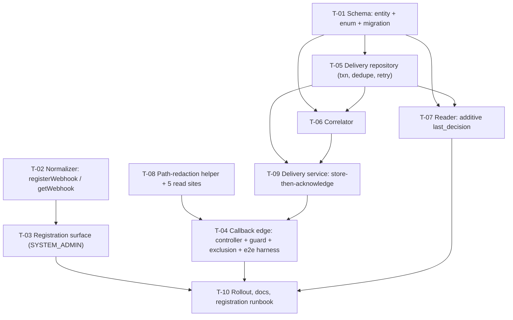

# Tasks — Bilateral / PRMS Sync — Decision Webhook

- **Module:** `bilateral/prms-sync` (server) — family child **5**
- **Spec id:** `2026-09-decision-webhook`
- **Depth:** **Full**
- **Status:** `in-progress` — **9 / 12 tasks closed** (T-01 – T-09, all `PASS` 2026-09-22). **Scope changed 2026-09-23 by an owner-approved Pivot** — see [`./execution.md`](./execution.md) → *Pivot Record: T-01*. Two tasks added: **T-01b** (rename + extend the history table) and **T-11** (the outbound `PENDING_REVIEW` event). Remaining order: **T-01b → T-11 → T-10**. T-08 HALTed on three Reviewer `FAIL` verdicts, was AMENDED and reopened with owner approval (constraint **C-T08**, six falsifiers), and closed on the amended task's first attempt: **`PASS (degraded-pair)`** — 8 review rounds across its life. See [`./execution.md`](./execution.md).
- **Owner:** Juan Cadavid / ARI
- **Linked requirements:** [`./requirements.md`](./requirements.md) · **Linked design:** [`./design.md`](./design.md) · **Review:** [`./judgment.md`](./judgment.md)
- **Budget (design §14 — a tripwire, not a cap):** **10 tasks · ≈ 2,970 LOC · 3 review rounds** — revised at Phase 3 on 2026-09-22 and **HITL-approved** at the Step 3.3 gate, up from the round-1 figure of 11 tasks / ≈ 2,600 LOC. See §5 *Budget reconciliation*. Exceeding it is information, and `/akili-execute` **stops and escalates** rather than absorbing it.
- **Family status warning:** the manifest row this child `Depends on` — [`../family.md`](../family.md) child 1, `sync-engine` — is **`pending`**, not `done`. Per the family-membership rule this **warns, it does not block**: the code this child extends is present on this branch (design P-3, P-5, P-8, all re-verified at `170da206`). The open risk is the one that already materialized once — see RB-1.
- **Verified at:** `170da206` (the commands in §4 were run at this commit on 2026-09-22)
- **Last updated:** 2026-09-22

---

## 1. Dependency graph

**Numbering is not dependency order** (`general-setup/task.md` §2). Four task numbers are **anchored by `design.md`** and may not be renumbered without a backward sweep of the Premise Ledger: **T-03** (P-14b's settling owner), **T-04** (P-17's harness owner), **T-06** (P-3's *If false*), **T-07** (P-6 and P-8's *If false*).

**Parallel-safe lanes** (all in the **server** package — root guide §4.3 permits concurrent *editing* in one package only for disjoint files, and forbids two concurrent **full-suite** runs outright; workers verify their own scope, the Leader re-measures after each reports):

| Lane | Tasks | Disjoint because |
|---|---|---|
| A | T-01 → T-05 | new `prms-webhook/` tree + `db/` only |
| B | T-02 → T-03 | `tools/prms-normalizer/` + the registration half of `prms-webhook/` |
| C | T-08 | `shared/Interceptors/`, `shared/error-management/`, `shared/utils/` — **touched by no other task** |

**T-08 must merge before T-04 reaches any deployed environment.** The callback endpoint without the redaction returns the credential to PRMS in every `2xx` body (design P-16). That is an ordering constraint on *deployment*, not only on the task graph.

---

## 2. Clause-level coverage map

> **ID-level presence is not closure.** Every scenario and every `BUT it must NOT` / `AND IT MUST` clause below is owned by a **named** task. A gap may never be discharged by citing a different requirement.

| Requirement | Scenario / clause | Task |
|---|---|---|
| R-PWH-001 | AC.1 (`data.url` echoed) · AC.2 (403 / 401) · AC.6 (log carries no key, no secret) · AC.7 (404 vs 503 not collapsed) | T-03 |
| R-PWH-001 | AC.3 (body has **exactly one** property) · AC.4 (PRMS `400` message verbatim) · AC.5 (key read **per call**) | T-02 |
| R-PWH-001 | Sc. *Registration succeeds* — THEN `POST <host>/webhook` with `x-api-key` and exactly `{ url }` | T-02 |
| R-PWH-001 | ↳ AND *response `data` carries the destination on file* | T-03 |
| R-PWH-001 | ↳ **BUT it must NOT** *accept a URL supplied in the request body* | T-03 |
| R-PWH-001 | ↳ **AND IT MUST** *log the attempt without emitting the API key or the callback secret* | T-03 |
| R-PWH-001 | Sc. *Registration refused by PRMS* — THEN the `message` is surfaced verbatim | T-02 |
| R-PWH-001 | ↳ **AND IT MUST NOT** *report the registration as successful* | T-02 |
| R-PWH-002 | AC.1 (`destination.url`) · AC.2 (nothing registered ⇒ success, not `404`) · AC.4 (403 / 401) | T-03 |
| R-PWH-002 | AC.3 (`registered` derived from **emptiness of `response`**, never the status) | T-02 |
| R-PWH-002 | Sc. *Nothing registered yet* — THEN success envelope, `registered: false`, `destination: null` · AND the PRMS `message` is carried · **BUT it must NOT** *be reported as a failure, an error, or a `404`* | T-03 |
| R-PWH-002 | ↳ **AND IT MUST NOT** *infer "registered" from the `200` status* | T-02 |
| R-PWH-003 | AC.1 (row exists when the response is produced) · AC.2 (does **not** await — deferred stub) · AC.3 (unparseable body still `2xx`) · AC.4 (post-ack throw never becomes a `5xx`) | T-09 |
| R-PWH-003 | AC.5 (at most two round-trips, one transaction, no external HTTP) | T-05 |
| R-PWH-003 | Sc. *Store then acknowledge* — THEN a row is written and `2xx` returned | T-09 |
| R-PWH-003 | ↳ AND *the verdict application runs afterwards* | T-06 |
| R-PWH-003 | ↳ **BUT it must NOT** *delay the `2xx` on correlation, on the result lookup, or on any write to `results`* | T-09 |
| R-PWH-003 | ↳ **AND IT MUST** *return `2xx` even when the post-acknowledgement work throws* | T-09 |
| R-PWH-004 | AC.1 (wrong secret ⇒ `404`, **no row**) · AC.2 (no `Authorization` ⇒ accepted) · AC.3 (registration ⇒ `401`) · AC.5 (timing-safe, no throw on length mismatch) · AC.6 (secret unset ⇒ route refuses everything) · AC.8 (evidence only on a non-stubbing harness) | T-04 |
| R-PWH-004 | AC.4 (secret absent from **all five** `request.url` sites, Swagger, errors) · AC.7 (`2xx` body carries no secret segment; the `404` logs no guess; **AND** a non-callback route's `path` is unchanged) | T-08 |
| R-PWH-004 | Sc. *Wrong secret* — THEN `404` · **BUT it must NOT** *create a delivery row* · **AND IT MUST NOT** *reveal, in body or headers, that a callback endpoint exists at that prefix* | T-04 |
| R-PWH-004 | Sc. *The exclusion is narrow* — THEN `401` · **AND IT MUST** *be rejected for the absence of a token, not for a role* | T-04 |
| R-PWH-005 | AC.1 (`CORRELATED` + resolved `result_id`) · AC.2 (`UNKNOWN_REFERENCE` + null) | T-06 |
| R-PWH-005 | AC.3 (`MALFORMED` + raw body, `2xx`) · AC.4 (`NO_REFERENCE`, `2xx`) · AC.6 (`decision` verbatim, not past tense) | T-09 |
| R-PWH-005 | AC.5 (`justification` byte-identical; `NULL`, **never `''`**) | T-01 (column) + T-09 (write path) |
| R-PWH-005 | AC.7 (no code path updates a stored row's content after insert) · AC.8 (queryable in received order, per-result **and** across all results) | T-05 |
| R-PWH-005 | Sc. *A delivery that correlates to nothing* — THEN `UNKNOWN_REFERENCE`, no STAR result | T-06 |
| R-PWH-005 | ↳ AND *the response is `2xx`* · **BUT it must NOT** *be dropped, and must NOT raise an error to PRMS* · **AND IT MUST** *retain the raw body exactly as received* | T-09 |
| R-PWH-005 | Sc. *A malformed body* — THEN `MALFORMED` + raw body · AND `2xx` · **BUT it must NOT** *apply any verdict* · **AND IT MUST NOT** *crash the endpoint or leave the request unanswered* | T-09 |
| R-PWH-006 | AC.1 (two rows, one applied) · AC.2 (`DUPLICATE` + `duplicate_of_id`) · AC.4 (no header ⇒ recorded, never a duplicate) · AC.5 (different ids, identical bodies ⇒ **both** applied) · AC.6 (dedupe branch **observed** red) · AC.7 (1213 / 1205 retried once, in the repository) | T-05 |
| R-PWH-006 | AC.3 (the repeat is answered `2xx`) | T-09 |
| R-PWH-006 | Sc. *The same delivery arrives twice* — THEN a second `DUPLICATE` row · **BUT it must NOT** *apply the verdict a second time* · **AND IT MUST** *remain visible in the history as a repeat* | T-05 |
| R-PWH-006 | ↳ AND *the response is `2xx`* | T-09 |
| R-PWH-007 | AC.1 (live row, not the snapshot) · AC.2 (non-numeric ⇒ `UNKNOWN_REFERENCE`, never a coerced `0`) · AC.3 (**no write** to `results`) · AC.4 (>1 match ⇒ resolved **and** warned) · AC.5 (a different `platform_code` is **not** matched) | T-06 |
| R-PWH-007 | Sc. *Snapshot must not win* — THEN correlates to the live row · **BUT it must NOT** *correlate to the snapshot* · **AND IT MUST NOT** *write anything to the `results` table* | T-06 |
| R-PWH-008 | AC.1 (APPROVE) · AC.2 (REJECT justification verbatim) · AC.3 (no delivery ⇒ `null`) · AC.4 (**byte-identical** `sync_state` / `last_attempt`) · AC.6 (latest by `decided_at`) | T-07 |
| R-PWH-008 | AC.5 (`is_synced_to_prms`, `prms_result_code`, `prms_phase_id` **not written**) | T-06 (correlation branch) + T-07 (read branch) |
| R-PWH-008 | Sc. *A rejection is readable without disturbing the sync state* — THEN `last_decision` reports REJECT verbatim · AND `sync_state` / `last_attempt` unchanged · **BUT it must NOT** *write to `results`, and must NOT change `is_synced_to_prms`* · **AND IT MUST** *leave the earlier decision in the history* | T-07 |
| R-PWH-009 | AC.1 (host from `ARI_PRMS_NORMALIZER_HOST`, no other source, no literal) | T-02 |
| R-PWH-009 | AC.2 (callback URL is its own variable, **no `Host`-header fallback**) · AC.3 (either unset ⇒ `503` **naming** it) | T-03 |
| R-PWH-009 | AC.4 (every row carries `TEST` / `PROD` via `ARI_IS_PRODUCTION`) | T-09 |
| R-PWH-009 | AC.5 (`.env.example`: URL commented **with** the TEST value / secret commented with **no** value) | T-03 (URL) + T-04 (secret) |
| R-PWH-009 | Sc. *A missing variable fails loudly* — THEN `503` naming it · **BUT it must NOT** *fall back to a hard-coded host, a PROD host, or the request's own `Host` header* · **AND IT MUST NOT** *report success* | T-03 |
| NFR-PWH-001 | Acknowledge inside the 15 s timeout | T-09 (deferred stub) + T-05 (two round-trips) |
| NFR-PWH-002 | The callback secret is a credential | T-08 + T-04 |
| NFR-PWH-003 | Every delivery is observable | T-09 (delivery line) + T-03 (registration line) + T-06 (ambiguity `warn`) |
| NFR-PWH-004 | Retained payload and PII — **no automated gate (DC-8)** | T-01 (`raw_body` whole) + T-10 (OQ-3 escalation, accepted risk) |
| NFR-PWH-005 | The endpoint does not fail the caller for its own reasons | T-09 |

**Defect-class ownership** (requirements §10): DC-1 → T-06 · DC-2 → T-05 · DC-3 → T-04 · DC-4 → T-01 · DC-5 → **every** task (`npm run build`) · DC-6 → T-09 · DC-7 → T-08 + T-03 · **DC-8 → T-10 (accepted risk, human)** · **DC-9 → T-10 (accepted risk, human)** · DC-10 → T-07 · DC-11 → T-08 · DC-12 → T-05.

---

## 3. Tasks

> **Field contract.** Every task carries **Falsifier**, **Red run**, **Disqualifier** and **Consumers**; `n/a` or `none` is written where one does not apply, never left blank. `Review` carries one of `skip-eligible` / `checklist` / `full` / `lenses` plus its reason.
>
> **Two rules bind every task below.** (1) The gate is `npx eslint <paths>` — **never** `npm run lint`, which carries `--fix` and mutates (design P-9, K-001). (2) `npm test` runs the **root** jest config only; it runs none of the e2e, integration or fixture suites (design P-10) — a task whose gate is an e2e spec names `npm run test:e2e` explicitly.

---

### T-01 — Schema: `prms_webhook_delivery` entity, enum, migration, migration spec  `[x]`

> ⚠️ **Superseded in part by T-01b (2026-09-23).** This task shipped and passed against the spec as it stood: 24 columns, table `prms_webhook_delivery`. An owner-approved Pivot then widened the table's purpose from *inbound delivery log* to **synchronization history**, which renames the table and one column and adds seven more. **T-01's `PASS` stands** — it delivered what was asked. The new work is **T-01b**, not a rework of this one.

- **Requirements covered:** R-PWH-005 (row shape, AC.5 column nullability) · R-PWH-006 AC.2 (`duplicate_of_id`) · R-PWH-009 AC.4 (`environment` column) · NFR-PWH-004 (`raw_body` whole)
- **Design references:** §4 *Data Model* · §3.1 (composition rows for the entity, migration and migration spec) · DD-8 · P-2
- **Files touched:**
  - `src/domain/entities/prms-webhook/entities/prms-webhook-delivery.entity.ts` (+ sibling `.spec.ts`)
  - `src/domain/entities/prms-webhook/enum/delivery-correlation-outcome.enum.ts` (+ sibling `.spec.ts`)
  - `src/db/migrations/<timestamp>-createPrmsWebhookDeliveryTable.ts`
  - `src/db/migration-specs/<timestamp>-createPrmsWebhookDeliveryTable.spec.ts` — **not** beside the migration (design §3.1, JD-9; the directory holds 11 files today, analogue `1789479131116-createResultPrmsSyncLogTable.spec.ts`)
- **Description:** Create the append-only delivery table exactly as design §4 specifies, plus the five-member correlation-outcome enum. The table is the deliverable of the owner's requirement — *"dejar registrado cada que el hook mande algo"* — so its nullability decisions are load-bearing, not incidental.
- **Implementation notes:**
  - `result_id` is **nullable and carries no FK**. This is the entire reason a new table exists rather than reusing `result_prms_sync_log` (P-2) — an `UNKNOWN_REFERENCE` row must survive, and a deleted result must not erase its own history.
  - `delivery_id` is **nullable and NOT unique** — a unique index would forbid the repeat row R-PWH-005 requires (DD-5).
  - `correlation_outcome` and `decision` are `varchar`, **never** MySQL `ENUM`, so a new value costs no migration.
  - `justification` is `text NULL` — the write path must store `NULL`, never `''` (R-PWH-005 AC.5). The column permits both; the guard against `''` lives in T-09.
  - Extends `AuditableEntity` (root guide §4.1). `created_by` is **NULL** — a callback has no user. `is_active` defaults `TRUE` and is never flipped by this spec.
  - Indexes: `idx_prms_webhook_delivery_delivery_id`, `idx_prms_webhook_delivery_result`, `idx_prms_webhook_delivery_received_at`.
  - No `@OpenSearchProperty`. No backfill ([WH] §3 — there is no backlog to recover).
  - ⚠️ **No bare `?` or `:word` in the migration SQL *or in its comments*** when no parameters are passed (child guide §7).
  - Generate with `npm run migration:generate --name=createPrmsWebhookDeliveryTable`, then hand-review — generated DDL is a starting point, not the deliverable.
- **Scope boundary — do NOT touch:** `results`, `result_prms_sync_log`, `PrmsSyncOutcome`, any existing migration.
- **Verification:**
  - `npm test -- --silent` (entity-metadata spec + enum spec)
  - `npm run build` — **DC-5**; `tsconfig.build.json` excludes `**/*spec.ts`, so the unit tier is structurally blind to this class
  - `npm run migration:test:execute` then `npm run migration:test:revert` — against the **disposable TEST scratch schema** (`orm.test.config.ts`), **never** the shared Dev database. Note `npm run migration:run` **does not exist** (verified 2026-09-22: `node -e "…scripts['migration:run']"` → `undefined`).
  - `npx eslint src/domain/entities/prms-webhook src/db/migrations/<file> src/db/migration-specs/<file>`
- **Falsifier:** flip `justification` to `nullable: false` on the entity → the metadata spec asserting `findColumnWithPropertyName('justification').isNullable === true` goes red. Second falsifier, for the migration: delete the `down()` body → `migration:test:revert` fails to drop the table.
- **Red run:** apply the `nullable: false` mutation, run `npm test -- --silent`, **observe the assertion fail** (K-004 / KZ-014 — the red must be *seen*, not asserted), revert, re-run green. Record both outputs in `execution.md`.
- **Disqualifier:** a metadata spec that asserts on the **decorator options object** rather than on TypeORM's resolved `metadata` proves the decorator was typed, not that the column was built — inert (KZ-001: assert the property in the generated output, never on the call that produced it). And **the migration gate is worthless if the scratch schema already holds the table from a previous run** — run `migration:test:revert` first and confirm the table is absent before `execute`, or report the run inconclusive rather than green.
- **Consumers:** none — new symbols, no existing reader. Sweep to run and record anyway: `git grep -rn "prms_webhook_delivery\|PrmsWebhookDelivery\|DeliveryCorrelationOutcome" -- src test` → expected **0** hits before this task.
- **Review:** `full` — a schema defect is expensive to reverse once the migration is merged (append-only rule), and the nullability choices are the spec's premise.
- **Done criteria:**
  - [ ] Entity matches design §4 column-for-column, including every nullability and the three indexes
  - [ ] Migration applies **and** reverts cleanly against the TEST scratch schema, with both command outputs recorded
  - [ ] The migration spec lives in `src/db/migration-specs/`, not beside the migration
  - [ ] The falsifier above was **observed red**, then green
  - [ ] `npm run build` green; `npx eslint` clean on the touched paths
- **Effort:** M · **Depends on:** — · **Est. LOC:** ≈ 380 (≈ 230 prod, ≈ 150 test) · **Skills:** `nestjs-expert`

---

### T-02 — `PrmsNormalizerService`: `registerWebhook(url)` + `getWebhook()`  `[x]`

- **Requirements covered:** R-PWH-001 AC.3, AC.4, AC.5 · R-PWH-002 AC.3 · R-PWH-009 AC.1 · NFR-PWH-002 (credential handling)
- **Design references:** §3.1 (*Modified:* `prms-normalizer.service.ts`) · §8 *Integration Impact* · §6.1 steps 3–5 · §6.2 · P-14, P-14b
- **Files touched:**
  - `src/domain/tools/prms-normalizer/prms-normalizer.service.ts` (**additive only**)
  - `src/domain/tools/prms-normalizer/prms-normalizer.service.spec.ts`
  - `src/domain/tools/prms-normalizer/dto/` — the webhook request/response DTOs
- **Description:** Two additive methods on the existing tool, on the **same host and the same `x-api-key`** as ingest ([WH] *Service URLs* / *Authentication*). `registerWebhook` POSTs `{ url }` and nothing else; `getWebhook` GETs and reports whether anything is on file. Ingest is not touched.
- **Implementation notes:**
  - Reuse `assertHost()` and the existing **per-call** `app_config` key read (`prms-normalizer.service.ts:36-44`). **Never** cache the key in the constructor — a rotated key must take effect without a restart (family OQ-F8).
  - Reuse `BaseApi.getRequest` (`base-api.ts:123`) / `postRequest` (`:148`).
  - The request body is **exactly** `{ url }`. [WH] §1: *"No other properties are accepted."*
  - `registered` is derived from `Object.keys(response ?? {}).length > 0` — **never** from the HTTP status, which is `200` in both the registered and the nothing-registered case.
  - Surface PRMS's `message` **verbatim** on `400` / `401` / `502` / `503`; never replace it with a generic failure string.
  - Let `AppConfigService.getEnv`'s `NotFoundException` **propagate** (fail loud) — T-03 maps it to `404`. Do not catch it here and re-throw as `503`; that is the exact collapse JD-5 found.
- **Scope boundary — do NOT touch:** the ingest method, the builders, `PrmsSyncOutcome`, any caller of the service.
- **Verification:**
  - `npm test -- --silent` — the existing sibling spec, extended
  - `npm run build` (DC-5)
  - `npx eslint src/domain/tools/prms-normalizer`
- **Falsifier:** add a second property to the registration body (e.g. `{ url, platform }`) → the assertion `expect(Object.keys(sentBody)).toEqual(['url'])` goes red. Second falsifier, for R-PWH-002 AC.3: make `registered` read `response.status === 200` → the nothing-registered case (`200` + `response: {}`) asserts `true` and reddens.
- **Red run:** apply the extra-property mutation, run `npm test -- --silent`, **observe the `toEqual(['url'])` assertion fail**, revert, re-run green.
- **Disqualifier:** an assertion of the shape `expect(body).toMatchObject({ url })` **cannot** detect an extra property and is disqualified for AC.3 — the assertion must be exact-keys. And a test that stubs `postRequest` and asserts only that it was *called* proves dispatch, not payload; the body must be read off the stub's arguments.
- **Consumers:** `PrmsNormalizerService` is an existing exported symbol. Sweep to run and record: `git grep -rn "PrmsNormalizerService" -- src test` — every hit must still compile and pass; the change is additive, so the expected outcome is **zero** modified call sites. If any existing caller changes, the change was not additive and the task has exceeded its scope.
- **Review:** `full` — it touches a shared integration service and handles a credential.
- **Done criteria:**
  - [ ] `registerWebhook` sends exactly one property, proven by an exact-keys assertion
  - [ ] `getWebhook` derives `registered` from the emptiness of `response`, with a test covering the `200` + `{}` case
  - [ ] The key is read per call — proven by a test that changes the stubbed `app_config` value between two calls and asserts the second request carries the new key
  - [ ] A PRMS `400` body's `message` reaches the caller byte-identical
  - [ ] The falsifier was **observed red**, then green; `npm run build` green; `npx eslint` clean
- **Effort:** M · **Depends on:** — · **Est. LOC:** ≈ 230 (≈ 90 prod, ≈ 140 test) · **Skills:** `nestjs-expert`, `api-design-principles`, `error-handling-patterns`

---

### T-03 — Registration surface: module, controller, service, route, env var, Swagger  `[x]`

> **Anchored by `design.md` P-14b** — this task is the named owner of the spec's only `UNVERIFIED` premise. **Settle it first, before building on it** (Premise Ledger hand-off rule).

- **Requirements covered:** R-PWH-001 AC.1, AC.2, AC.6, AC.7 · R-PWH-002 AC.1, AC.2, AC.4 · R-PWH-009 AC.2, AC.3, AC.5 (URL variable) · NFR-PWH-003 (registration log line)
- **Design references:** §3.1 (module, registration controller + service) · §5 `POST`/`GET /api/prms-webhook` · §6.1, §6.2 · §10 · DD-2 · P-14b
- **Files touched:**
  - `src/domain/entities/prms-webhook/prms-webhook.module.ts` (+ spec)
  - `…/prms-webhook-registration.controller.ts` (+ spec)
  - `…/prms-webhook-registration.service.ts` (+ spec)
  - `…/dto/prms-webhook.dto.ts`
  - `src/domain/routes/main.routes.ts` — one top-level entry, `prms-webhook`
  - `src/domain/entities/entities.module.ts` — register the module
  - `.env.example` — `ARI_PRMS_WEBHOOK_CALLBACK_URL`, commented, **with** the TEST value (matching the `ARI_PRMS_NORMALIZER_HOST` treatment at `.env.example:36`)
- **Description:** The `SYSTEM_ADMIN` operator surface. Registration is an **operated action**, never automatic at boot — DD-2: local and Dev share the TEST key, so boot registration would let any developer silently re-point Dev's callbacks at their own machine, with no error anywhere (**K-005**).
- **Implementation notes:**
  - **P-14b first.** Before writing the controller, run the read path once against TEST and record which of the two failures appears, if either: **`404`** ⇒ the `ARI_CLARISA_API_KEY` row is missing or inactive (it should not be — P-14 is closed by migration `1781879906673` plus the `is_active` column default); **`503`** ⇒ the row is there and `simple_value` is empty — *that* is what P-14b is open about. Record the outcome in `execution.md` and in P-14b's row. **K-016: `app_config` is TTL-cached ~5 minutes and re-saving restarts the window** — an empty read immediately after a save is the cache, not a failure.
  - The URL comes **only** from `ARI_PRMS_WEBHOOK_CALLBACK_URL`. There is **no** request-body input and **no** fallback that constructs it from the request's `Host` header — a `Host`-derived URL is registrable by whoever calls the endpoint, which is exactly the failure K-005 names (R-PWH-009 AC.2).
  - Unset variable ⇒ `503` whose message **names the missing variable**.
  - Map `NotFoundException` from `getEnv` → `404`; empty `simple_value` → `503`. **The two must not be collapsed** (JD-5) — one says *the configuration row is not there*, the other says *it is there and blank*, and they send an operator to different places.
  - `@Roles(SecRolesEnum.SYSTEM_ADMIN)` + `RolesGuard`, JWT required, on **both** handlers.
  - Swagger on both: `@ApiTags`, `@ApiBearerAuth`, `@ApiOperation`, and the response shapes. No `@ApiBody` on the `POST` — there is no body.
  - `LoggerUtil` line per attempt carrying environment, host, the **URL registered**, PRMS's `message` and `requestId` — and **never** the API key or the callback secret.
  - `main.routes.ts` entry is **top-level `prms-webhook`**, disjoint from `prms-callback` (DD-3, P-13).
- **Scope boundary — do NOT touch:** `app.module.ts` (T-04 owns the exclusion), the interceptors (T-08), any callback file.
- **Verification:**
  - `npm test -- --silent` — controller, service and module specs
  - `npm run build` (DC-5)
  - `npx eslint src/domain/entities/prms-webhook src/domain/routes/main.routes.ts src/domain/entities/entities.module.ts`
  - **Manual, once:** boot locally and confirm both handlers appear in `/swagger` with `@ApiBearerAuth` and no body on the `POST`
- **Falsifier:** unset `ARI_PRMS_WEBHOOK_CALLBACK_URL` and call the endpoint → the test asserting `503` **and** that the message contains the literal variable name goes red if the code falls back to any default. Second falsifier, for AC.7: stub `getEnv` to throw `NotFoundException` → the test asserting `404` reddens the moment the handler collapses it to `503`.
- **Red run:** stub `getEnv` to throw `NotFoundException`, run `npm test -- --silent` against a handler that maps every config failure to `503`, **observe the `404` assertion fail**; then implement the split and observe green. This is the assertion-level red — a red from a missing provider or an unresolved DI token is **not** a red for this class.
- **Disqualifier:** the P-14b probe is **inconclusive**, not green, if it runs within ~5 minutes of an `app_config` save (K-016) — record the wait, or report inconclusive. A `403` from `RolesGuard` reached before the config is ever read proves authorization, not configuration, and must not be ticked as AC.7 evidence (KZ-002 — quote what the observation actually covered).
- **Consumers:** the module is new. `main.routes.ts` and `entities.module.ts` are shared registries — sweep and record: `git grep -rn "main.routes" -- src test` (`src/domain/routes/main.routes.spec.ts` pins the route table and **will** need the new entry) and `git grep -rn "entities.module" -- src test`. `main.routes.spec.ts` is a **known** consumer that must be updated in this task, not discovered later.
- **Review:** `full` — first `SYSTEM_ADMIN`-only surface in this child, and it settles the spec's only open premise.
- **Done criteria:**
  - [ ] **P-14b settled and its Premise Ledger row updated** with the observed status code and the commit it was run at
  - [ ] `POST` and `GET` both return `ServerResponseDto`; the `GET`'s nothing-registered case is a **success** envelope, not a `404`
  - [ ] `404` (row missing/inactive) and `503` (host unset, or `simple_value` empty) are produced by distinct paths, each with its own test
  - [ ] A non-`SYSTEM_ADMIN` caller gets `403`; an unauthenticated caller gets `401`
  - [ ] No code path reads the callback URL from the request body or from a `Host` header — asserted by test, not by inspection
  - [ ] The registration log line contains neither the API key nor the callback secret
  - [ ] `.env.example` carries `ARI_PRMS_WEBHOOK_CALLBACK_URL`, commented, with the TEST value
  - [ ] `main.routes.spec.ts` updated and green; both falsifiers **observed red**, then green
- **Effort:** M · **Depends on:** T-02 · **Est. LOC:** ≈ 350 (≈ 150 prod, ≈ 200 test) · **Skills:** `nestjs-expert`, `api-design-principles`, `error-handling-patterns`

---

### T-04 — Callback edge: controller, `CallbackSecretGuard`, `JwtMiddleware` exclusion, and the non-stubbing e2e harness  `[x]`

> **Two gates carried in from T-09's review (2026-09-22). Both are reachable and both are T-04's to close.**
>
> **1 — An unparseable JSON body never reaches the lenient classifier, and that violates NFR-PWH-005.** T-09 receives `input.body` already parsed, so Express's JSON body-parser emits a **`400` before the handler runs** — *the endpoint failing the caller for its own reasons*, which NFR-PWH-005 forbids. T-09's `MALFORMED` path cannot help because it is never reached. **Constructible:** `Content-Type: application/json` with body `{`. **T-04 owns the body-parser configuration** for this route; settle it there, with a falsifier.
>
> **2 — `raw_headers` must be an ALLOWLIST, never `req.headers`.** T-09 stores `raw_headers` exactly as it is handed them, and the *"never the secret"* rule is a **comment, not a type**. The callback secret travels in the path, but headers are the other place a credential can arrive, and **NFR-PWH-002 is unconditional**. T-04 constructs what the service receives — pass a named allowlist, and prove it with a falsifier that puts a credential-shaped header in and asserts it is absent from the stored row.

> **Anchored by `design.md` P-17 and DD-11.** This task carries the spec's highest-impact structural risk: **the repo's existing e2e harness cannot observe `JwtMiddleware` at all**, so the obvious gate for the auth boundary is one that *cannot go red*. Read P-17 before starting.

- **Requirements covered:** R-PWH-004 AC.1, AC.2, AC.3, AC.5, AC.6, AC.8 · R-PWH-009 AC.5 (secret variable) · R-PWH-003 (the HTTP edge) · NFR-PWH-002
- **Design references:** §3.1 (callback controller, guard, e2e suite, *Modified:* `app.module.ts`, `main.routes.ts`) · §5 `POST /api/prms-callback/:secret` · §6.3 steps 1 and 4 · §9 · DD-3, DD-11 · P-7, P-13, P-17
- **Files touched:**
  - `src/domain/entities/prms-webhook/prms-webhook-callback.controller.ts` (+ spec)
  - `…/guards/callback-secret.guard.ts` (+ spec)
  - `src/app.module.ts` — **one** exclusion entry, `prms-callback(.*)`
  - `src/domain/routes/main.routes.ts` — one top-level entry, `prms-callback`
  - `.env.example` — `ARI_PRMS_WEBHOOK_SECRET`, commented, **with no value** (it is a credential and `.env.example` is committed — JD-11)
  - `test/prms-webhook.e2e-spec.ts` — **must NOT stub `JwtMiddleware.prototype.use`**
- **Description:** The public edge and its only authentication. The controller does nothing but delegate to `PrmsWebhookDeliveryService` (T-09) and return; the guard is the whole security boundary.
- **Implementation notes:**
  - **Why `404`, not `401`:** a `401` confirms the path exists; a `404` does not. PRMS retries five times and abandons either way, which is the correct loud failure for a misconfigured secret (R-4).
  - Comparison is **timing-safe and length-checked** — `crypto.timingSafeEqual` throws on a length mismatch, so compare lengths first and return `false`, never let it throw (AC.5).
  - **Secret unset ⇒ the route refuses every request** (AC.6). It must not match an empty segment and must not fall open. Assert this explicitly — an unset-secret fall-open is an unauthenticated public write endpoint.
  - The wrong-secret `404` must write **no** delivery row and log **no** part of the supplied guess — logging a guess at a credential is logging a credential (§10).
  - The exclusion entry is written **relative to the global `api` prefix and without a leading slash**, the form `reports/${RESULT_CODE}/pdf` already uses. P-7 settles at source that NestJS `10.4.15` normalizes both sides identically — this is **verified**, not assumed.
  - `prms-callback` and `prms-webhook` are **disjoint top-level prefixes**, neither a prefix of the other, so no glob over one can reach the other (DD-3). P-13 is this repo's own precedent for why that matters — `main.routes.ts:413-417` records a route being moved out from under `/admin` because `/admin(.*)` *"would otherwise bypass auth"*.
  - Swagger **without** `@ApiBearerAuth`; the secret shown as a **placeholder**, never a real value.
  - **The harness (DD-11).** Build `test/prms-webhook.e2e-spec.ts` so the real `JwtMiddleware` runs. If that harness cannot be built, the gate is **substituted** by a unit assertion over `app.module.ts`'s exclusion array plus the NestJS normalization cited at P-7 — **and the substitution is stated in `execution.md`, naming what it no longer covers.** Silently falling back to the stubbing pattern is the one outcome this task may not produce.
- **Scope boundary — do NOT touch:** the interceptors or `global.exception.ts` (T-08 owns all five `request.url` sites), the delivery service internals (T-09), the correlator (T-06).
- **Verification:**
  - `npm test -- --silent` — guard spec, controller spec, and the exclusion-array assertion
  - `npm run test:e2e` — **`test/prms-webhook.e2e-spec.ts`**. `npm test` does **not** run it (P-10); citing `npm test` here would be the KZ-017 failure exactly.
  - `npm run build` (DC-5)
  - `npx eslint src/domain/entities/prms-webhook src/app.module.ts src/domain/routes/main.routes.ts test/prms-webhook.e2e-spec.ts`
- **Falsifier:** swap the exclusion entry from `prms-callback(.*)` to `prms-webhook(.*)` → **two** assertions redden at once: the unauthenticated callback now gets `401` (AC.2) and the registration route is now excluded, so its tokenless `401` becomes a `200`/`403` (AC.3). *(Per DC-3 as corrected at round 2: under disjoint top-level paths this is a **swap**, not a widening — and it is a swap that breaks both directions, which is what makes it a usable falsifier.)* Second falsifier, for AC.6: unset `ARI_PRMS_WEBHOOK_SECRET` and post any path → the assertion that the route refuses reddens the moment the guard falls open.
- **Red run:** apply the exclusion swap, run `npm run test:e2e`, **observe both the AC.2 and the AC.3 assertions fail**, revert, re-run green. **This red is only evidence on a harness that does not stub `JwtMiddleware.prototype.use`** — verify that first, by the Disqualifier below.
- **Disqualifier:** **the e2e result is not evidence if the suite, or anything it imports, stubs `JwtMiddleware.prototype.use`.** Prove it before trusting the run: `git grep -rn "JwtMiddleware.prototype" -- test` must return **only** the two pre-existing suites (`test/prms-sync.e2e-spec.ts:231`, `test/results-ai-formalize-bulk.e2e-spec.ts:109`, both confirmed 2026-09-22) and **never** `test/prms-webhook.e2e-spec.ts`. Under the stub, AC.2 passes vacuously and AC.3 **cannot redden at all** — the stub injects a user, so the tokenless case yields `403`, not `401`. A green run under the stub must be reported as **inconclusive**, not as a pass. Also inconclusive: a `404` produced by a route that was never registered — assert the correct-secret `2xx` in the same suite, or the `404` proves only that nothing is mounted there.
- **Consumers:** `app.module.ts` and `main.routes.ts` are shared registries. Sweep and record: `git grep -rn "JwtMiddleware\|forRoutes\|exclude(" -- src test` and `git grep -rln "main.routes" -- src test`. **Known consumers that will need updating:** `src/domain/routes/main.routes.spec.ts` (pins the route table). Run the sweep over **all** test files including e2e and integration suites — a suite CI skips still pins the boundary (KZ-STC-1).
- **Review:** `lenses` — security. This is the application's **first public, unauthenticated write endpoint**; review it for auth-boundary scope, credential handling and failure-open behavior specifically, not only for spec conformance.
- **Done criteria:**
  - [ ] Wrong secret ⇒ `404`, **no delivery row written**, and no part of the guess in any log line
  - [ ] Correct secret with **no** `Authorization` header ⇒ accepted (the exclusion is in force)
  - [ ] Registration endpoints still ⇒ `401` without a token (the exclusion is **not** over-broad)
  - [ ] Secret unset ⇒ the route refuses every request; asserted, not assumed
  - [ ] Timing-safe comparison that does not throw on a length mismatch
  - [ ] **The harness runs the real `JwtMiddleware`** — proven by the Disqualifier grep — **or** the substitution is recorded in `execution.md` with what it no longer covers
  - [ ] The exclusion-swap falsifier was **observed red on both assertions**, then green
  - [ ] `.env.example` carries `ARI_PRMS_WEBHOOK_SECRET`, commented, **with no value**
  - [ ] `/swagger` shows the callback **without** `@ApiBearerAuth` and with a placeholder secret
- **Effort:** L · **Depends on:** T-08, T-09 · **Est. LOC:** ≈ 450 (≈ 130 prod, ≈ 320 test incl. the harness) · **Skills:** `nestjs-expert`, `error-handling-patterns`, `systematic-debugging`

---

### T-05 — Delivery repository: the dedupe transaction, the retry, and the history queries  `[x]`

- **Requirements covered:** R-PWH-006 AC.1, AC.2, AC.4, AC.5, AC.6, AC.7 · R-PWH-005 AC.7, AC.8 · R-PWH-003 AC.5 · NFR-PWH-001
- **Design references:** §3.1 (`prms-webhook-delivery.repository.ts` — **sole owner of the transaction**) · §6.3 steps 3 and 3b · DD-5 · DC-2, DC-12
- **Files touched:**
  - `src/domain/entities/prms-webhook/repositories/prms-webhook-delivery.repository.ts` (+ spec)
- **Description:** The one place that owns the transaction. A single `SELECT … FOR UPDATE` on `delivery_id`, then an insert — either as the classified outcome or as a `DUPLICATE` pointing at the row it repeats. Plus the two history reads R-PWH-005 AC.8 requires.
- **Implementation notes:**
  - ⚠️ *The table is renamed to `result_prms_sync_history` by the 2026-09-23 Pivot (T-01b); the SQL below is T-05's text as shipped.*
  - The transaction: `SELECT id FROM prms_webhook_delivery WHERE delivery_id = ? AND duplicate_of_id IS NULL FOR UPDATE` → row found ⇒ insert `DUPLICATE` + `duplicate_of_id`; no row ⇒ insert the classified outcome with `processing_state = RECEIVED`. Commit.
  - **Dedupe is by transaction, not by a unique index** (DD-5): a unique index on `delivery_id` would forbid the repeat row R-PWH-005 requires. *"Every delivery is recorded"* and *"one applied decision"* are **both** obligations.
  - **Step 3b — the retry.** On `ER_LOCK_DEADLOCK` (**1213**) **or** `ER_LOCK_WAIT_TIMEOUT` (**1205**), retry the transaction **once**, then fail loud. Both codes, not one. Rationale (DD-5): no isolation level is configured anywhere in this repo, so InnoDB runs REPEATABLE READ; an empty `FOR UPDATE` range read takes gap locks, gap locks are **mutually compatible**, and each insert then needs an insert-intention lock that waits on the other's gap. Genuine simultaneity therefore yields a **deadlock and a lost delivery**, not a double-apply — which would violate R-PWH-005 and NFR-PWH-005.
  - **A delivery with no `x-prms-delivery-id` is recorded and is never a duplicate of anything** (AC.4) — a `NULL` delivery id must not match another `NULL`.
  - Dedupe is keyed on the **delivery id**, never on a body hash: two deliveries with different ids and identical bodies are **both** applied (AC.5).
  - No method updates a stored row's `decision`, `justification`, `decided_at` or `raw_body` after insert (R-PWH-005 AC.7). `processing_state`, `result_id` **and `correlation_outcome`** are the mutable columns, and they are the correlator's (T-06). *(**Amended 2026-09-22, execute-time edit at T-05's close.** This line previously read *"`processing_state` and `result_id` are the **only** mutable columns"*, which is **narrower than the design it implements** and would have blocked T-06 from doing what §6.4 step 5 requires. Source, all three verified by the Leader before the edit: `requirements.md:259` AC.7 enumerates **content** columns and states in its own parenthesis *"The row's processing state may change; its content may not"*; `design.md:233` §6.4 step 5 reads *"One row → `CORRELATED`, write `result_id`, `processing_state = PROCESSED`"* — the correlator writes the outcome; `design.md:162` fixes the vocabulary `RECEIVED → PROCESSED | PROCESSING_FAILED`. Flagged by the T-05 Implementer, which declined to decide it; ruled by the T-05 Reviewer citing source. **No requirement's meaning changed** — a contradiction between a task and its design was removed.)*
  - History reads: by STAR `result_id` ordered by `received_at`, and across all results including uncorrelated rows.
  - Precedent worth reading, and why it does not apply: this repo already anchors such transactions on an existing PK row (`result-prms-sync-log.repository.ts:185-194`, `:306-315`) — unavailable here, because `UNKNOWN_REFERENCE` and `NO_REFERENCE` rows have no result to anchor on.
- **Scope boundary — do NOT touch:** the correlator, the controller, `result_prms_sync_log`'s repository.
- **Verification:**
  - `npm test -- --silent`
  - `npm run build` (DC-5)
  - `npx eslint src/domain/entities/prms-webhook/repositories`
- **Falsifier:** delete the `SELECT … FOR UPDATE` dedupe branch → the same `x-prms-delivery-id` delivered twice produces **two applied** rows and AC.1 goes red. Second falsifier, for AC.7 / DC-12: force the manager's query to reject once with `{ errno: 1213 }` → with the retry removed, the error propagates unretried and the delivery is lost, reddening the assertion that exactly two attempts were made. Third, for AC.5: key the dedupe on a body hash → two deliveries with different ids and identical bodies collapse to one applied decision and AC.5 reddens.
- **Red run:** delete the dedupe branch, run `npm test -- --silent`, **observe AC.1 fail** (this is R-PWH-006 AC.6 in the requirements — *the red must be observed*, K-004 / KZ-014); restore, re-run green. Repeat independently for the 1213 injection with the retry removed. Both reds go in `execution.md`.
- **Disqualifier:** **a fixture whose two deliveries carry different `delivery_id`s cannot discriminate dedupe from no dedupe** — the naive and the correct implementation coincide, an inert fixture (KZ-004). Vary one discriminating field per unit and cover all four cases: same id twice, different ids with identical bodies, a `NULL` id, and a second `NULL` id. **Scope this task structurally cannot reach (KZ-017):** a mocked `EntityManager` proves the *SQL text and the retry count*, never the InnoDB lock semantics themselves. Assert the emitted SQL contains `FOR UPDATE` and `duplicate_of_id IS NULL` — assert it on the generated query, never on the call sequence that produced it (KZ-001) — and state plainly that real lock behaviour is unproven by this tier.
- **Consumers:** new symbol. Sweep and record: `git grep -rn "PrmsWebhookDeliveryRepository" -- src test` → expected **0** before this task; after it, only T-06 and T-09.
- **Review:** `full` — concurrency and a correctness-critical dedupe branch.
- **Done criteria:**
  - [ ] Same delivery id twice ⇒ **two rows, one applied**, the second `DUPLICATE` with `duplicate_of_id` set
  - [ ] Different ids, identical bodies ⇒ **both** applied
  - [ ] A `NULL` delivery id is recorded and matches no other `NULL`
  - [ ] 1213 **and** 1205 each retried exactly once, then failed loud — one test per code
  - [ ] The emitted SQL carries `FOR UPDATE` and `duplicate_of_id IS NULL`, asserted on the query text
  - [ ] Both history queries return in `received_at` order, uncorrelated rows included
  - [ ] The dedupe falsifier and the 1213 falsifier were each **observed red**, then green
- **Effort:** M · **Depends on:** T-01 · **Est. LOC:** ≈ 360 (≈ 140 prod, ≈ 220 test) · **Skills:** `nestjs-expert`, `systematic-debugging`, `tdd`

---

### T-06 — `DeliveryCorrelator`: resolve the live result and apply the verdict  `[x]`

> **Anchored by `design.md` P-3** — if the `external_reference` convention is false, this task is discarded outright.

- **Requirements covered:** R-PWH-007 (all ACs) · R-PWH-005 AC.1, AC.2 · R-PWH-008 AC.5 (no write, correlation branch) · R-PWH-003 (the detached step) · NFR-PWH-003 (ambiguity `warn`)
- **Design references:** §3.1 (`delivery-correlator.service.ts`) · §6.3 step 5 · §6.4 · §10 · DD-6, DD-7 · P-3, P-4
- **Files touched:**
  - `src/domain/entities/prms-webhook/delivery-correlator.service.ts` (+ spec)
- **Description:** The post-acknowledgement step. It resolves `external_reference` to the **live** STAR result and writes the outcome back onto the delivery row. It runs **after** the response has been produced and is never awaited by the request.
- **Implementation notes:**
  - The resolution uses **all four** predicates of the repo convention (`results.util.ts:38,41-43`):
    `platform_code = 'STAR' AND result_official_code = ? AND is_active = TRUE AND is_snapshot = FALSE`.
    **`platform_code` is the predicate that does most of the narrowing** and the draft dropped it once (JD-8). `result_official_code` is a **non-unique** `bigint` (P-4) — two predicates are not enough.
  - Order of branches: absent or `null` reference ⇒ `NO_REFERENCE`, stop. Not a valid integer ⇒ `UNKNOWN_REFERENCE`, stop — **never coerce to `0`** (AC.2). No row ⇒ `UNKNOWN_REFERENCE`. More than one row ⇒ take the first **and log a `warn` naming the ambiguity and the match count** (AC.4) — never silently resolve. One row ⇒ `CORRELATED`, write `result_id` and `processing_state = PROCESSED`.
  - **No write to `results` occurs in any branch** (DD-7, AC.3). `is_synced_to_prms` is load-bearing — flipping it 409-locks Pool Funding Alignment for everyone including `SYSTEM_ADMIN` (family R-F3). `prms_result_code` and `prms_phase_id` are likewise not written (NG-6): the callback's `data.result_code` is **retained on the delivery row** so a later decision costs a backfill from our own table, not a lost value.
  - Every throw is caught and logged at `error` with the delivery id — the acknowledgement is already sent (R-PWH-003 AC.4).
- **Scope boundary — do NOT touch:** the `results` entity or repository, `result_prms_sync_log`, the reader (T-07), the controller.
- **Verification:**
  - `npm test -- --silent`
  - `npm run build` (DC-5)
  - `npx eslint src/domain/entities/prms-webhook`
- **Falsifier:** drop `is_snapshot = FALSE` from the query → the fixture holding **both** a live and a snapshot row for official code `1441061` resolves to the snapshot and AC.1 goes red. Second falsifier, for AC.5: drop `platform_code` → the fixture's non-STAR row with the same official code is matched and AC.5 reddens. Third, for AC.3: add any write to `results` → the assertion that the results repository's save/update was never called reddens.
- **Red run:** remove `is_snapshot = FALSE`, run `npm test -- --silent`, **observe AC.1 fail on the assertion** (not on a fixture-setup error), restore, re-run green. Repeat for the `platform_code` removal against AC.5.
- **Disqualifier:** **a fixture holding one row per official code cannot discriminate any of this** — it is the inert fixture KZ-004 names, and both mutations above would leave it green. The fixture MUST contain, for the same `result_official_code`: a live STAR row, a **snapshot** STAR row, an **inactive** STAR row, and a live row on a **different** `platform_code`. A test asserting only that the repository was *called* proves dispatch, not predicates — assert the **generated query's WHERE clause**, never the call sequence (KZ-001). And note what this tier cannot reach (KZ-017): a unit test over a mocked query builder cannot represent SQL operator precedence — if the predicates are ever composed with `OR`, assert the emitted SQL text, not the builder calls.
- **Consumers:** new symbol; its only caller is T-09. Sweep and record: `git grep -rn "DeliveryCorrelator" -- src test`. **Also sweep the read side it must not disturb:** `git grep -rn "is_synced_to_prms\|prms_result_code\|prms_phase_id" -- src` — every hit is a site this task must leave untouched, and the list belongs in `execution.md`.
- **Review:** `full` — DC-1 is the spec's most silent defect class: a verdict landing on a snapshot is valid data in the wrong row, and nothing downstream would notice.
- **Done criteria:**
  - [ ] All four predicates present in the emitted query, asserted on the SQL text
  - [ ] Live row wins over a snapshot carrying the same official code
  - [ ] A row on a different `platform_code` is **not** matched
  - [ ] A non-numeric reference ⇒ `UNKNOWN_REFERENCE`, never a database error and never a coerced `0`
  - [ ] More than one match ⇒ resolved **and** a `warn` naming the ambiguity and the count
  - [ ] **Zero** writes to `results` in every branch, asserted
  - [ ] The four-row discriminating fixture exists; both falsifiers were **observed red**, then green
- **Effort:** M · **Depends on:** T-01, T-05 · **Est. LOC:** ≈ 310 (≈ 110 prod, ≈ 200 test) · **Skills:** `nestjs-expert`, `tdd`, `systematic-debugging`

---

### T-07 — Reader: the additive `last_decision` field  `[x]`

> **Anchored by `design.md` P-6 and P-8** — both name this task as the one whose blast radius widens if the consumer sweep was wrong.

- **Requirements covered:** R-PWH-008 (all ACs) · NFR-PWH-005
- **Design references:** §3.1 (*Modified:* `result-prms-sync-status.reader.ts` + its DTO) · §5 `GET /api/results/:resultCode/prms-sync` · §6.5 · DD-9 · P-5, P-6, P-8, P-15
- **Files touched:**
  - `src/domain/entities/result-prms-sync/result-prms-sync-status.reader.ts` (+ its existing spec)
  - `src/domain/entities/result-prms-sync/dto/prms-sync.dto.ts`
- **Description:** One additive field on an existing, shipped read surface: `last_decision: { decision, decided_at, justification, prms_result_code, delivery_received_at } | null`, fed by its **own** query. A verdict and an outbound attempt are different events (family R-F1).
- **Implementation notes:**
  - **`LAST_ATTEMPT_SQL` and `deriveSyncState` are not edited** (DD-9). This is the whole point of the task: the outbound read surface must come out byte-identical.
  - The new query is independent: the latest **non-duplicate `CORRELATED`** row for the result, ordered by `decided_at DESC`.
  - Earlier decisions stay in the history — `last_decision` is a projection, not a replacement (AC.6).
  - The field is **additive**. The client package holds a **hand-maintained mirror** of this response contract (P-15, `client/research-indicators/src/app/shared/interfaces/prms-sync.interface.ts`) with **no compiler linking the two** — an additive field costs nothing there, a changed or removed one costs a silent break in another package. Stay additive.
- **Scope boundary — do NOT touch:** `LAST_ATTEMPT_SQL`, `deriveSyncState`, `PrmsSyncOutcome`, the controller's guards, anything in the client package (this child is **server-only** by the family's Closed-Set Rule).
- **Verification:**
  - `npm test -- --silent` — the existing `result-prms-sync-status.reader.spec.ts` plus new cases
  - `npm run build` (DC-5)
  - `npx eslint src/domain/entities/result-prms-sync`
- **Falsifier:** route `last_attempt` through the delivery table instead of `result_prms_sync_log` → the AC.4 byte-identical assertion goes red. Second falsifier, for AC.3: return an empty object instead of `null` when no correlated delivery exists → the `toBeNull()` assertion reddens.
- **Red run:** capture the **existing** reader spec's `sync_state` / `last_attempt` output on `HEAD` **before** any edit — that captured output is the AC.4 baseline. Then apply the `last_attempt` rerouting mutation, run `npm test -- --silent`, **observe the byte-identical assertion fail**, revert, re-run green. *(Per K-019: a change declared additive needs an explicit old-vs-new comparison over a fixed input set, because the existing suite was written for the old behaviour's known inputs and is structurally blind to a change in what the code accepts.)*
- **Disqualifier:** an AC.4 assertion written **after** the edit, from the new code's own output, proves self-consistency and nothing else — the baseline must be captured **before** the first edit or the comparison is worthless. And a snapshot assertion that serializes the whole response **including** `last_decision` cannot isolate a regression in `sync_state`; assert the two pre-existing fields on their own.
- **Consumers:** swept 2026-09-22 at `170da206` — `git grep -rln "ResultPrmsSyncStatusReader\|PrmsSyncStatusDto\|last_attempt\|sync_state" -- src test` → **7 server files**, all under `src/domain/entities/result-prms-sync/`: `dto/prms-sync.dto.ts`, `result-prms-sync-status.reader.ts`, `result-prms-sync-status.reader.spec.ts`, `result-prms-sync.controller.ts`, `result-prms-sync.controller.spec.ts`, `result-prms-sync.module.ts`, `result-prms-sync.module.spec.ts`. **Plus one cross-package consumer the symbol sweep structurally cannot reach** (P-15, mirrors by value, not by import): `client/research-indicators/src/app/shared/interfaces/prms-sync.interface.ts` — **read it, do not edit it**; if the change would require editing it, the change is not additive and the task must stop and escalate. **Re-run the sweep before starting** — `sync-engine` is an in-flight sibling and this file moved once already (RB-1).
- **Review:** `full` — DC-10; this modifies a shipped read surface consumed by three other family children.
- **Done criteria:**
  - [ ] `last_decision` carries APPROVE with `decided_at` and `null` justification; REJECT with the justification **verbatim**
  - [ ] No correlated delivery ⇒ `last_decision` is `null` (not `{}`, not omitted)
  - [ ] Two decisions ⇒ the one with the greater `decided_at`, earlier ones still in the history
  - [ ] **`sync_state` and `last_attempt` byte-identical to the pre-change baseline**, compared against output captured before the first edit
  - [ ] `LAST_ATTEMPT_SQL` and `deriveSyncState` are unmodified — proven by `git diff` over those line ranges
  - [ ] `is_synced_to_prms`, `prms_result_code`, `prms_phase_id` unwritten
  - [ ] The client mirror was **read** and confirmed to need no edit; both falsifiers **observed red**, then green
- **Effort:** S · **Depends on:** T-01, T-05 · **Est. LOC:** ≈ 250 (≈ 90 prod, ≈ 160 test) · **Skills:** `nestjs-expert`, `api-design-principles`

---

### T-08 — `path-redaction.util.ts` and the five `request.url` read sites  `[x]`

> **This task changes three globally-registered, application-wide wrappers.** Its blast radius is every controller in the server. Design DD-10 has been **wrong three times** about the mechanism (never about the decision) — read DD-10 v2 and P-16 in full before editing, and trust the grep over the prose.

> **AMENDED 2026-09-22, owner-approved, after this task HALTed on three Reviewer `FAIL` verdicts.** The rework ceiling was reached discovering requirements, not fixing defects: the two falsifiers below the amendment specified only `data.path` in the envelope, while DD-10 v2 requires redacting the credential **wherever it appears** — a gate structurally narrower than the obligation it backed (KZ-017, in the task itself). The attempt counter resets because the task changed. Prior work is preserved on branch `akili/t08-halted` and is the **starting point, not a discard** — see [`./execution.md`](./execution.md) → *HALT: T-08*.
>
> **C-T08 — the callback secret's grammar is `[A-Za-z0-9_-]+`.** Added by this amendment because it is what makes the redaction decidable. The secret is **ours**: we mint it, embed it in `ARI_PRMS_WEBHOOK_CALLBACK_URL`, and register that URL with PRMS ([WH] §1 — *"put the secret in a path or query string instead"*). PRMS never generates it and has no opinion on its format. With the alphabet fixed, the redactor ends the path token at the **first character outside that set**, and the ambiguity between *"byte of the secret"* and *"punctuation of the surrounding message"* does not exist — it is not mitigated, it is **dissolved**. That ambiguity is precisely what attempt 3 failed on. *(Verified 2026-09-22 against the operator-generated value in `server/researchindicators/.env`: character class `[A-Za-z0-9_-]` only, no delimiter, no `/ ? #` or whitespace. The value itself was never printed, and `.env` is gitignored at `server/researchindicators/.gitignore:43`.)* **T-04 owns stating this grammar in `.env.example` and enforcing it if it enforces anything; this task only consumes it.**

- **Requirements covered:** R-PWH-004 AC.4, AC.7 · NFR-PWH-002
- **Design references:** §3.1 (the new util + the three *Modified:* wrapper rows + the five-read-sites callout) · §9 *Security* · DD-10 v2 · §13 *Reversion challenge* · P-16 · DC-11
- **Files touched:**
  - `src/domain/shared/utils/path-redaction.util.ts` — **new** (+ sibling spec)
  - `src/domain/shared/Interceptors/logging.interceptor.ts` — **one** site: `:29` (`url = request.url`, the only site assigned to a variable; wrapping it covers the `_log` at `:45`)
  - `src/domain/shared/Interceptors/response.interceptor.ts` — **TWO** sites, both inline: `:50` (`path: request.url` → the envelope) **and `:73`** (passed to `logBasedOnStatus`, logged at `:96-107`)
  - `src/domain/shared/error-management/global.exception.ts` — **TWO** sites, both inline: `:31` (`path: request.url` → the envelope) **and `:36`** (`url: request.url` inside `_logger._error`)
  - The three sibling specs: `logging.interceptor.spec.ts`, `response.interceptor.spec.ts`, `global.exception.spec.ts`
- **Description:** The callback secret lives **in the path**, so `request.url` **is** the secret. Unmodified, these wrappers return the credential to PRMS inside every `2xx` body and log an attacker's guess on every wrong-secret `404`. One shared redaction function, called from all five sites.
- **Implementation notes:**
  - **It is five sites, not one per file.** Verify before editing, do not trust this list: `grep -rn "request\.url" src/domain/shared/Interceptors/ src/domain/shared/error-management/`. Two of the three files read inline **twice**, and **both omitted sites are logger paths** — including `global.exception.ts:36`, which handles the wrong-secret `404` end to end, because the guard raises it **before** the controller runs.
  - **Redact on the route prefix, never on the secret's value.** The helper truncates anything after the callback prefix; it must work when the secret variable is unset, rotated, or empty. Matching on the value would fail open exactly when the configuration is broken.
  - **No interceptor is bypassed.** `ServerResponseDto` is emitted on every response, the callback's included — PRD `AC-API-Surface` is preserved. *(Round 1 proposed an `@Res()` bypass; it was dropped for four reasons, all in DD-10 v2. Two matter here: `@Res()` does not actually skip `ResponseInterceptor.intercept`, and dropping the envelope made DC-11 **vacuous** — `data.path` would not exist, so "carries no segment" passed whether or not the redaction worked.)*
  - **Scope is one route prefix.** A non-callback route's `data.path` must remain the real, unredacted URL (AC.7 second clause). This is not a blanket change to what the envelope reports.
  - `app-microservice.module.ts:33,37,41` registers the same three classes on the RPC app; that app takes the `contextType === 'rpc'` branch and never touches `request.url` — **no change needed there, and none may be made** (P-16 sweep).
- **Scope boundary — do NOT touch:** `setup.interceptor.ts`, `jwr.middleware.ts`, `app-microservice.module.ts`, or the registration order at `app.module.ts:58-69`.
- **Verification:**
  - `npm test -- --silent` — the helper spec plus the three wrapper specs
  - `npm run build` (DC-5)
  - `npx eslint src/domain/shared/utils/path-redaction.util.ts src/domain/shared/Interceptors src/domain/shared/error-management`
  - **Secret-hygiene grep over the diff:** `git diff --unified=0 | grep -niE "ARI_PRMS_WEBHOOK_SECRET|secret" ` — every hit must be a variable name or a comment, never a value
- **Falsifier:** **six, and every one is required.** (a)–(b) are the original pair; (c)–(f) were each discovered by a Reviewer round against a gate that could not reach them, and are now gates rather than discoveries.
  - **(a)** Remove the redaction call at `response.interceptor.ts` (`path:`) → the callback's `data.path` carries the secret and the "no segment beyond the prefix" assertion reddens.
  - **(b)** Widen the redaction predicate to match **every** route → the assertion that a **non-callback** route's `data.path` is unchanged reddens. A change that passes (a) but not (b) has hidden `path` app-wide — DC-11 is only falsifiable in both directions.
  - **(c) Case.** Make the prefix comparison case-sensitive → `/API/PRMS-CALLBACK/<segment>` leaks in the **emitted output**. Express builds its router with `caseSensitive: this.enabled('case sensitive routing')`, that setting is **false by default and `main.ts` never enables it**, so the mixed-case form **reaches the callback**. Assert on emitted output, not only on the helper.
  - **(d) URL-bearing exception text.** Remove the diagnostics sanitization → a **real** `NotFoundException` whose message is `Cannot POST /api/prms-callback/guess/extra` leaks through the `errors` payload **and** through the complete first `_error` logger argument. A synthetic `Not Found` / `stack-trace` substitute is **disqualified** — that substitution is exactly why the original gate could not see this.
  - **(e) Delimiter preservation.** Restore a token that runs to the next whitespace → `{"path":"/api/prms-callback/example","reason":"invalid"}` loses its trailing `","reason":"invalid"}`. Cover a JSON-quoted path, a path followed by a comma, a path inside parentheses, and a stack-trace line whose **non-callback** file path must survive byte-for-byte.
  - **(f) Absolute-URL forms.** Feed `//host/api/prms-callback/<secret>?x=1` and `https://host/api/prms-callback/<secret>` → with a path-only predicate both are returned **unchanged, carrying the whole secret**. *(No code path in this spec is known to produce one — `request.url` under Express is always origin-form — so this is closed on the cheap-now/expensive-later argument, not on demonstrated reachability. Record that reasoning rather than claiming a reachable leak.)*
- **Red run:** apply each of the six mutations **independently**, run the scoped suite, **observe that mutation's own assertion fail**, restore, and finish green. All six reds go in `execution.md` **verbatim**. This row's history is the argument (K-004 / KZ-014: if the red has not been *seen*, it may not be asserted) — across three attempts `npm test` never went red once, and all three defect classes were found by an independent auditor reasoning about the mechanism, not by the suite.
- **Disqualifier:** **an assertion written only over the `2xx` body is vacuous for the `404` branch** — the wrong-secret `404` never reaches `ResponseInterceptor` at all; it is `GlobalExceptions` that handles it, at `:31` and `:36`. Cover **both** branches or the gate misses the two sites that matter most. A spec that asserts the helper is *called* proves wiring, not output — assert the emitted envelope and the logger's **arguments** (KZ-001). And a helper that reads the secret from `process.env` **at import time** will pass a test that sets the variable after import and fail in production — bind nothing at module load.
- **Consumers:** the three wrappers are registered globally at `app.module.ts:58-61`, `:62-65`, `:66-69` — **every controller in the application**. Consumer sweep run 2026-09-22 at `170da206`: `git grep -rln "\.path\b" -- "src/**/*.spec.ts" "test/*.ts"` → **5 files pin the envelope path**: `src/domain/entities/result-status-workflow/config/config-workflow.spec.ts`, `src/domain/routes/main.routes.spec.ts`, `src/domain/shared/Interceptors/response.interceptor.spec.ts`, `src/domain/shared/utils/router.util.spec.ts`, `test/results-ai-formalize-bulk.e2e-spec.ts`. **All five are part of this task's verification** — `test/results-ai-formalize-bulk.e2e-spec.ts` runs under `npm run test:e2e`, which `npm test` does **not** invoke (P-10), so run both tiers. Re-run the sweep before starting; a suite CI skips still pins the contract (KZ-STC-1).
- **Review:** `lenses` — security **and** blast radius. The decision is settled; what needs review is the **mechanism**, which has been misdescribed three times, and the **scope**, which is the one way this task can break the whole application.
- **Done criteria:**
  - [ ] `grep -rn "request\.url"` over both directories returns **five** sites and **every one** is wrapped
  - [ ] The callback's `2xx` body and the wrong-secret `404` log carry no segment beyond the route prefix
  - [ ] A **non-callback** route's `data.path` is unchanged — asserted, in the same spec
  - [ ] `ServerResponseDto` is emitted on every response including the callback's (no interceptor bypassed)
  - [ ] The helper matches on the **route prefix**, not the secret value, and works with the secret unset
  - [ ] The prefix comparison follows Express's **case-insensitive** routing — mixed-case callback paths do not leak, asserted on emitted output
  - [ ] A **real** URL-bearing `NotFoundException` leaks nothing through `errors` **or** the complete first `_error` logger argument
  - [ ] The path token ends at the first character outside `[A-Za-z0-9_-]` (**C-T08**); delimiters and all surrounding text survive **byte-for-byte**, including a non-callback file path in a stack trace
  - [ ] Absolute-URL forms (`//host/…`, `https://host/…`) carrying the callback prefix are redacted
  - [ ] **All six** falsifiers **observed red**, then green
  - [ ] All five pre-existing envelope-path consumers green, under **both** `npm test` and `npm run test:e2e`
- **Effort:** **L** (raised from M at the 2026-09-22 amendment — three review rounds measured the real weight) · **Depends on:** — · **Est. LOC:** **≈ 750** (revised from ≈ 240; the preserved branch already stands at ≈ 714) · **Skills:** `nestjs-expert`, `error-handling-patterns`, `systematic-debugging`

---

### T-09 — `PrmsWebhookDeliveryService`: classify, store, acknowledge, detach  `[x]`

> **Gate carried in from T-06's review (2026-09-22).** `DeliveryCorrelator.finish()` overwrites `correlation_outcome` **unconditionally**, so invoking the correlator on a `MALFORMED` row would replace that classification with `NO_REFERENCE`. `design.md:226` exempts `DUPLICATE` from the detached step but says nothing about `MALFORMED`. **T-09 owns which rows reach the detached step**, so this is T-09's to settle: either it must not dispatch `MALFORMED` rows to the correlator, or the exemption must be widened in the design. Reachable only through this task — the correlator has no other caller. Add a falsifier for it.

- **Requirements covered:** R-PWH-003 AC.1–AC.4 · R-PWH-005 AC.3, AC.4, AC.5 (write path), AC.6 · R-PWH-006 AC.3 · R-PWH-009 AC.4 · NFR-PWH-001, NFR-PWH-003, NFR-PWH-005
- **Design references:** §3.1 (`prms-webhook-delivery.service.ts` — *"does not own the transaction"*) · §6.3 steps 2, 4, 5 · §10 · DD-4 · DC-6
- **Files touched:**
  - `src/domain/entities/prms-webhook/prms-webhook-delivery.service.ts` (+ spec)
- **Description:** The orchestration between the HTTP edge and the repository. It classifies the body leniently, stamps the environment, calls the repository's transaction, and **detaches** the correlator. Store-then-acknowledge is the load-bearing shape: steps 1–2 are the request, step 3 is not.
- **Implementation notes:**
  - **Lenient parsing, always.** A shape violation is **data**, classified `MALFORMED`, never a `400` and never a throw. Missing `decision`, unparseable `decided_at`, or a `decision` outside `APPROVE` / `REJECT` are all `MALFORMED` — stored with the raw body, answered `2xx`. PRMS retrying a payload STAR cannot read would change nothing.
  - `external_reference` absent or `null` ⇒ `NO_REFERENCE`. *(Whether PRMS ever sends this for a STAR result is `UNVERIFIED` — requirements C-18 — and deliberately **no design decision depends on the answer**: the endpoint records it either way.)*
  - `decision` stored **verbatim** as `"APPROVE"` / `"REJECT"` — present tense, **never** normalized to past tense (AC.6).
  - `justification` stored **byte-identical**, and as `NULL` — **never `''`** — when PRMS omits it. [WH] §4: *"Omitted entirely when there is none — never an empty string."*
  - `environment` resolved by `ARI_IS_PRODUCTION ? 'PROD' : 'TEST'`, **exactly** as `result-prms-sync.service.ts:130` does (R-PWH-009 AC.4) — the existing discriminator, not a new one (K-005).
  - **The correlator is never awaited** (DD-4). Every throw inside it is caught and logged at `error` with the delivery id; the acknowledgement is already sent, and an exception there must **not** turn it into a `5xx`.
  - **A `DUPLICATE` row skips the detached step entirely** — that is what *"recorded as a repeat rather than applied twice"* means (R-PWH-006 AC.1).
  - One `LoggerUtil` line per delivery: `delivery_id`, environment, `correlation_outcome`, `external_reference`, and the STAR official code when correlated (NFR-PWH-003).
  - The raw body is retained **whole** (DD-8). It may carry contributor PII — declared, not filtered on an unstated rule (DC-8, OQ-3, owned by T-10).
- **Scope boundary — do NOT touch:** the transaction (T-05 owns it), the correlator's internals (T-06), the guard or controller (T-04), the interceptors (T-08).
- **Verification:**
  - `npm test -- --silent`
  - `npm run build` (DC-5)
  - `npx eslint src/domain/entities/prms-webhook`
- **Falsifier:** `await` the correlator call → with the correlator stubbed as a **deferred, never-settling promise**, the handler never resolves and the R-PWH-003 AC.2 test times out red. Second falsifier, for AC.4: make the stubbed correlator reject synchronously → the assertion that the acknowledgement is still `2xx` reddens if the rejection is allowed to propagate. Third, for AC.5: store `''` instead of `NULL` for an omitted justification → the `toBeNull()` assertion reddens.
- **Red run:** add the `await`, run `npm test -- --silent` with the deferred stub in place, **observe the AC.2 test fail by timeout on the un-resolved handler**; remove, re-run green.
- **Disqualifier:** **a synchronous stub is explicitly disqualified for AC.2** — it settles during the same tick, so the awaited and the detached implementations are indistinguishable and the test passes either way (Falsifiability rule 2; requirements R-PWH-003 AC.2 says this in the AC itself). The stub **must** be a promise that never settles. Likewise, a red that comes from a missing provider, an unmatched mock or a DI failure is **not** a red for this class — the failure must be on the behavioural assertion.
- **Consumers:** new symbol; its only caller is T-04's controller. Sweep and record: `git grep -rn "PrmsWebhookDeliveryService" -- src test`.
- **Review:** `full` — DC-6 is invisible to any gate that uses the wrong stub, and the store-then-acknowledge ordering is the requirement PRMS actually depends on.
- **Done criteria:**
  - [ ] A well-formed delivery: row exists **at the moment the response is produced**, answered `2xx`
  - [ ] The acknowledgement does **not** await the correlator — proven with a **deferred, never-settling** stub
  - [ ] Malformed body ⇒ `MALFORMED` + raw body retained + `2xx`; no verdict applied; no crash
  - [ ] `external_reference: null` ⇒ `NO_REFERENCE` + `2xx`
  - [ ] `decision` verbatim (`APPROVE` / `REJECT`, never past tense); `justification` byte-identical, `NULL` never `''`
  - [ ] Every row carries `TEST` or `PROD` from `ARI_IS_PRODUCTION`
  - [ ] A throw in the detached work is logged at `error` and does **not** become a `5xx`
  - [ ] A `DUPLICATE` skips the detached step; the repeat is answered `2xx`
  - [ ] One `LoggerUtil` line per delivery with all five fields; the deferred-stub falsifier **observed red**, then green
- **Effort:** M · **Depends on:** T-05, T-06 · **Est. LOC:** ≈ 340 (≈ 120 prod, ≈ 220 test) · **Skills:** `nestjs-expert`, `error-handling-patterns`, `tdd`

---

### T-10 — Rollout, registration runbook, and the two accepted risks  `[ ]`

- **Requirements covered:** NFR-PWH-004 (DC-8 escalation) · DC-9 (the human end-to-end gate) · requirements §12 OQ-1…OQ-6 · design §12 *Rollout*
- **Design references:** §12 *Rollout* (all 6 steps) · §15 *Open Questions* · requirements §10 (DC-8, DC-9), §14 *Sign-off*
- **Files touched:**
  - `docs/trd/trd.md` §9.1 — one integration row for the inbound callback (the first inbound write integration in the platform)
  - `docs/specs/bilateral/prms-sync/decision-webhook/execution.md` — the rollout note, the P-14b outcome, and the substitution record if T-04 used one
  - `docs/specs/bilateral/prms-sync/family.md` — flip child 5's `Status`
- **Description:** The spec is not done when the code is green. Two defect classes have **no automated gate** and both are stated rather than substituted away; this task is where they are put in front of the humans who own them, and where the rollout order is recorded.
- **Implementation notes:**
  - **Migration first, code second.** Per root `CLAUDE.md` §4.3 (**K-015**), the pipeline deploys **code only** — applying the migration is a separate, human-decided step against a shared database. Check pending state with `npm run typeorm migration:show -- -d ./src/db/config/mysql/orm.config.ts` — it is **not** an npm script — and **normalize ANSI escapes before counting** (**K-014**: the passthrough emits them, so `grep '^\[ \]'` matches nothing and reads as a confident zero). **Check for an error in the raw output before counting it.**
  - **Register TEST, then read it back.** `POST /api/prms-webhook` then `GET`. **K-016:** `app_config` is TTL-cached ~5 minutes and re-saving restarts the window.
  - **PROD is blocked on OQ-6 / R-1** — no PROD hostname resolves today (P-11), and PRMS refuses private ranges at registration. Do not attempt it; record it as blocked, with the owner.
  - **Backout:** revert the code; the migration's `down` drops the table. Nothing else is touched — no `results` column, no `result_prms_sync_log` column, no enum member.
  - **Comms:** PRMS technical team (destination registered, per environment) · the family owner (children 2, 3, 4 gain `last_decision`) · **Security** (first public write endpoint — requirements §14 makes this sign-off **required**).
  - **Escalate, do not decide:** OQ-1 (verdict as lifecycle status?), OQ-2 (does REJECT reopen editing?), **OQ-3 (what may STAR retain from `data`? — this is DC-8)**, OQ-4 (may the callback populate `prms_result_code`?), OQ-5 (who reads the history?), OQ-6 (the PROD host — this is R-1). Plus design OQ-D1 and OQ-D2.
- **Scope boundary — do NOT touch:** any `src/` file. This task writes documents and runs operational steps; it implements nothing.
- **Verification:**
  - `npm run typeorm migration:show -- -d ./src/db/config/mysql/orm.config.ts`, ANSI-normalized, with the **raw** output checked for an error before any count
  - The registration round-trip: `POST` then `GET /api/prms-webhook`, both responses recorded verbatim
  - **Human:** the product owner's answer to OQ-3, quoted
- **Falsifier:** n/a for the documentation steps. For the migration-state check: run it against a database where the migration is knowingly **unapplied** → the output must show it pending. If the command errors and the count still reads zero, the check has failed and reported green — that is precisely K-014, and the reading is **inconclusive**, not clean.
- **Red run:** n/a — this task adds no test. *(Per `general-setup/task.md`: a new unit still owes a gate proven able to fail, but this task creates no code unit; its evidence is the recorded command output and the quoted human answers.)*
- **Disqualifier:** **a quoted human observation is evidence only of what it actually covers** (KZ-002). If the product owner's answer to OQ-3 addresses storage duration but not PII content, tick nothing and record which clause it covered and which it did not. A `/swagger` page rendering is evidence the page rendered — not that an endpoint returned `200` in a `ServerResponseDto`. And **DC-9 cannot be closed from inside the CIAT network** (C-15, C-16): a green local suite is not a substitute for a live delivery, and this task may not record one as the other.
- **Consumers:** `docs/trd/trd.md` and `family.md` are read by every future child of this family. Sweep before editing: `git grep -rn "decision-webhook" -- docs` — every document pointing at this spec folder must still resolve after the status flip (**KZ-013**: archiving or moving a spec silently breaks every document that cites its path).
- **Review:** `checklist` — no production code; the risk is an unescalated open question, which a checklist catches.
- **Done criteria:**
  - [ ] Migration pending-state checked, with the **raw** command output recorded and ANSI normalized before counting
  - [ ] TEST registered and read back, both responses recorded verbatim; the P-14b outcome written into the Premise Ledger row
  - [ ] PROD explicitly recorded as **blocked on OQ-6 / R-1**, with a named owner
  - [ ] Backout procedure written into `execution.md`
  - [ ] All three comms sent; **Security sign-off requested** (requirements §14)
  - [ ] OQ-1…OQ-6 and OQ-D1/OQ-D2 put to their named owners; each answer quoted, or recorded as still open
  - [ ] **DC-8 and DC-9 restated as accepted risks with human owners** — neither closed by an automated run
  - [ ] `docs/trd/trd.md` §9.1 carries the inbound-callback integration row
  - [ ] `family.md` child 5 `Status` updated
- **Effort:** S · **Depends on:** T-03, T-04, T-07 · **Est. LOC:** ≈ 60 (documentation only) · **Skills:** *(none — no code)*

---

---

### T-01b — Rename the table to `result_prms_sync_history`, rename `received_at`, add the seven history columns  `[ ]`

> **Created by the owner-approved Pivot of 2026-09-23.** Read [`./execution.md`](./execution.md) → *Pivot Record: T-01* **in full** before starting — it carries the eight design decisions, the measured blast radius and the reasoning behind every column. This task does not restate them.

- **Requirements covered:** R-PWH-005 (the table's population widens — see the Pivot's *Requirement impact*) · the UI history contract the owner supplied as a mock
- **Files touched:**
  - `src/db/migrations/1790086170692-createPrmsWebhookDeliveryTable.ts` — **EDIT IN PLACE, do NOT create a second migration.** It is applied nowhere but the disposable scratch schema, which is exactly why the rename is free today. The append-only rule protects **merged and applied** migrations; this one is neither
  - `src/db/migration-specs/1790086170692-createPrmsWebhookDeliveryTable.spec.ts`
  - `src/domain/entities/prms-webhook/entities/prms-webhook-delivery.entity.ts` (+ spec)
  - **and the rename propagated across every file that names the table or the column** — measured at `HEAD 8ebc3117`: `git grep -rln "prms_webhook_delivery" -- src test` → **12 files**; `git grep -rln "received_at" -- src test` → **11 files**. Both sweeps must be re-run at the task's own start commit and recorded
- **Description:** the table becomes the synchronization history. **Rename** `prms_webhook_delivery` → `result_prms_sync_history` and `received_at` → `occurred_at`; **add seven columns**; **remove nothing.**
- **Implementation notes:**
  - The seven columns, their types and the reasoning are in the Pivot Record's table. `event_source` is the only `NOT NULL` addition.
  - **The three existing `NOT NULL` columns do NOT relax.** An outbound row is `correlation_outcome = CORRELATED` (a push knows its result), `processing_state = PROCESSED`, and has its `environment`. Anyone proposing to make them nullable has misread the Pivot.
  - **Whether to rename the files and classes too** — `prms-webhook-delivery.entity.ts`, `PrmsWebhookDelivery`, `PrmsWebhookDeliveryRepository` — is **yours to judge and to state**. The table name is fixed; the symbol names are a readability call. Whatever you choose, be consistent and say why.
  - Five closed tasks reference the renamed identifiers (**T-05, T-06, T-07, T-09, T-04**). None needs a behavioural change. Their specs assert on **literal SQL text**, so the specs move with the code — if a spec's assertion still passes after the rename, it was not asserting what it claimed.
- **Scope boundary — do NOT touch:** `result_prms_sync_log`, the sync service (**that is T-11**), anything under `client/`, or any behaviour beyond the rename and the additions.
- **Verification:**
  - `npm test -- --silent` — the **whole** unit tier, not a scoped slice: this rename reaches five closed tasks
  - `npm run build` (DC-5)
  - `npm run migration:test:revert` then `migration:test:execute` then `migration:test:revert` — the scratch schema **already holds the old table**, so revert FIRST and confirm it is gone before executing, or the run is **inconclusive**
  - `npx eslint <touched paths>` — never `npm run lint` (K-001)
  - `npm run test:e2e -- test/prms-webhook.e2e-spec.ts` — T-04's suite names the table
- **Falsifier:** rename the table in the migration but **not** in the entity → the metadata spec that resolves TypeORM's table name goes red. Second: add `event_source` as nullable → the assertion that it is `NOT NULL` reddens. Third: leave one of the twelve files on the old identifier → the build or a spec reddens; **if nothing reddens, that file's assertion was inert and you must say so.**
- **Red run:** apply each mutation independently, observe its own assertion fail, restore, finish green. Paste every red verbatim.
- **Disqualifier:** a metadata spec asserting on the **decorator options object** rather than TypeORM's resolved metadata proves the decorator was typed, not that the column was built (KZ-001). **And the migration gate is worthless if the scratch schema still holds the old table** — revert first and confirm absence.
- **Consumers:** the two sweeps above, re-run and recorded. Note `git grep` **cannot see untracked files**.
- **Review:** `full` — a schema rename touching five closed tasks, on a table whose migration is the spec's foundation.
- **Done criteria:**
  - [ ] Table is `result_prms_sync_history`; column is `occurred_at`; **nothing removed**
  - [ ] All seven columns present with the Pivot's exact types; `event_source` `NOT NULL`, the rest nullable
  - [ ] The three pre-existing `NOT NULL` columns are unchanged
  - [ ] Migration applies **and** reverts cleanly, both outputs recorded, with the pre-execute absence confirmed
  - [ ] **The three indexes are renamed too** — `idx_result_prms_sync_history_{delivery_id,result,occurred_at}`, following the repo's `idx_<table>_<purpose>` convention
  - [ ] **Zero** references to `prms_webhook_delivery` or `received_at` remain in `src` or `test` — proven by a re-run sweep
  - [ ] Full unit tier green; T-04's e2e suite green; build and eslint clean
  - [ ] All three falsifiers **observed red**, then green
- **Effort:** M · **Depends on:** — · **Est. LOC:** ≈ 400 · **Skills:** `nestjs-expert`

---

### T-11 — The outbound `PENDING_REVIEW` event  `[ ]`

> **Created by the owner-approved Pivot of 2026-09-23.** Read the *Pivot Record* first, especially decisions **2, 3, 5 and 6**.

- **Requirements covered:** the UI history contract — the mock's *"First synchronization"* and *"Mapping re-synced after rejection"* rows
- **Files touched:**
  - `src/domain/entities/prms-webhook/repositories/prms-webhook-delivery.repository.ts` (+ spec) — **a new method, not a change to `recordDelivery`**
  - `src/domain/entities/result-prms-sync/result-prms-sync.service.ts` (+ spec) — **ONE guarded call**
- **Description:** when a push settles `ACCEPTED`, write one `PENDING_REVIEW` row into the history table from STAR's own data. PRMS returns none of it.
- **Implementation notes:**
  - **The write point is located**: immediately after `settleAttempt(...)` (~`:251`) and before the return, guarded on `interpreted.outcome === PrmsSyncOutcome.ACCEPTED`. Everything needed is already in scope: `resultId`, `userId`, `claim.attemptNumber`, `claim.resultOfficialCode`, `externalReference`, `interpreted.prmsResultCode`, `interpreted.prmsPhaseId`, `interpreted.requestId`, `environment`.
  - Row shape: `event_source = 'STAR'`, `status = 'PENDING_REVIEW'`, `actor_user_id = userId`, `occurred_at = now`, `correlation_outcome = CORRELATED`, `processing_state = PROCESSED`, `result_id`, `external_reference`, `prms_result_code`. **`decision`, `justification`, `decided_at`, `delivery_id`, `raw_body`, `raw_headers`, and every `reviewer_*` field stay `NULL`** — an outbound event has none of them.
  - **ONLY on a favourable push.** `AUTH_FAILED`, `TRANSPORT_FAILED`, `RETRYABLE`, `REFUSED_BY_STAR`, `UNKNOWN`, `IN_FLIGHT` write **nothing** here — the owner was explicit: *"para eso está la otra tabla de logs."*
  - **One row per successful attempt**, never one per result. A re-sync after rejection is its own entry.
  - **The write must NEVER fail the push.** Catch, log at `error` with the result code, continue. Failing a successful sync over a history row is strictly worse — the same discipline T-09 applies to the detached correlator.
  - **Do NOT route this through `recordDelivery`.** That method owns the `SELECT … FOR UPDATE` dedupe for PRMS's `delivery_id`, which an outbound row does not have; running it would take gap locks on the push's critical path and protect nothing. A plain `INSERT`.
  - ⚠️ **`result-prms-sync.service.ts` belongs to the sibling `sync-engine` (family child 1, status `pending`, in flight).** One guarded call is the whole change. If it needs more, **stop and report it.**
- **Scope boundary — do NOT touch:** `result_prms_sync_log`'s schema or its write path, the dedupe transaction, the correlator, the callback edge, anything under `client/`.
- **Verification:** `npm test -- --silent` · `npm run build` · `npx eslint <touched paths>` — never `npm run lint`
- **Falsifier:** make the history insert throw → the assertion that `sync()` still returns its normal success payload reddens if the throw is allowed to propagate. Second: remove the `ACCEPTED` guard → the assertion that a `TRANSPORT_FAILED` push writes **no** history row reddens. Third: call it twice for one result → the assertion that **two** rows exist reddens if the write is deduped.
- **Red run:** each mutation independently, its own assertion observed failing, restored, green. Verbatim.
- **Disqualifier:** **a test that asserts only that the repository method was *called* proves dispatch, not the row.** Assert the **arguments** — specifically that `decision`, `decided_at` and every `reviewer_*` field are `NULL`, and that `event_source` is `'STAR'` (KZ-001). And a red from a missing provider or DI failure is **not** a red for the non-propagation class — the failure must be on the behavioural assertion.
- **Consumers:** `git grep -rn "settleAttempt\|result-prms-sync.service" -- src test`, re-run and recorded. The sync service's own spec is a **known** consumer that will need the new collaborator mocked.
- **Review:** `full` — it edits a sibling child's service, and a defect here can fail a successful push.
- **Done criteria:**
  - [ ] A favourable push writes exactly **one** `PENDING_REVIEW` row with `event_source = 'STAR'`
  - [ ] Every unfavourable outcome writes **none** — one test per outcome value
  - [ ] Two successful pushes for one result produce **two** rows
  - [ ] `decision`, `justification`, `decided_at`, `delivery_id`, `raw_body`, `raw_headers` and the `reviewer_*` fields are **`NULL`** — asserted on the arguments
  - [ ] A throw in the history write is logged at `error` and the push still succeeds
  - [ ] The dedupe transaction is **not** invoked on this path
  - [ ] All three falsifiers **observed red**, then green
- **Effort:** M · **Depends on:** **T-01b** · **Est. LOC:** ≈ 300 · **Skills:** `nestjs-expert`, `error-handling-patterns`, `tdd`

## 4. Verification commands, pre-flighted

Run at `170da206` on 2026-09-22, from `server/researchindicators/`, so no task cites a gate that cannot be invoked (**K-004**: a gate that cannot be invoked is not a gate — this is the check JD-10 added after `npm run migration:run` turned out not to exist).

| Command | Exists? | Notes |
|---|---|---|
| `npm test -- --silent` | ✅ `jest` (root config, `rootDir: src`) | Runs **none** of the e2e / integration / fixture suites (P-10) |
| `npm run test:e2e` | ✅ `jest --config ./test/jest-e2e.json` | The **only** tier that runs `test/prms-webhook.e2e-spec.ts` |
| `npm run build` | ✅ `nest build && npm run build:admin` | **DC-5** — `tsconfig.build.json` excludes `**/*spec.ts` |
| `npx eslint <paths>` | ✅ | **Not** `npm run lint` — it carries `--fix` and mutates (P-9, K-001) |
| `npm run migration:generate --name=<name>` | ✅ | Writes into `./src/db/migrations/` |
| `npm run migration:test:execute` | ✅ → `orm.test.config.ts` | The **disposable TEST scratch schema**, never shared Dev |
| `npm run migration:test:revert` | ✅ → `orm.test.config.ts` | Same |
| `npm run migration:run` | ❌ **does not exist** | `node -e "…scripts['migration:run']"` → `undefined`. Use `npm run typeorm migration:show -- -d ./src/db/config/mysql/orm.config.ts` for pending state |
| `src/db/migration-specs/` | ✅ 11 files | Migration specs go **here**, never beside the migration (JD-9) |

---

## 5. Budget reconciliation (design §14)

| Signal | Round-1 figure | **Approved budget (2026-09-22)** | Delta |
|---|---|---|---|
| Tasks | 11 | **10** | −1 |
| LOC | ≈ 2,600 (1,300 prod / 1,300 test) | **≈ 2,970** (≈ 1,120 prod / ≈ 1,790 test + 60 docs) | **+ ≈ 370 (+14 %)** |
| Review rounds | 3 | 3 | — |

`design.md` §14 was updated to match at the Step 3.3 gate, so the two documents state one live figure. The round-1 numbers survive only as the "revised at round 1" column of that table and inside `judgment.md`'s correction notes — historical record, not live instruction.

**Where the −1 task went:** the design's two additions — *"+1 for DD-10 v2"* and *"+1 for DD-11 (the non-stubbing e2e harness)"* — are both present. DD-10 v2 is **T-08**, standalone. DD-11 is **inside T-04**, because `design.md` P-17 names **T-04** as the harness owner by ID; splitting it into an eleventh task would have required editing P-17's row and sweeping the Premise Ledger backward. T-04 is marked **L** to carry it honestly rather than hiding the weight.

**Where the +370 LOC came from:** test volume, not scope creep. The falsifiability rules force discriminating fixtures (T-06's four-row fixture, T-05's four dedupe cases), two-direction assertions (T-08's DC-11 needs both a redaction **and** a non-redaction assertion), and a pre-edit baseline capture (T-07's AC.4).

**Two independent measurements say ≈ 2,970 is still optimistic. Both are recorded rather than silently adopted:**

| Source | Measurement | Why it bears on this spec |
|---|---|---|
| **JD-12** (judge B, round 1) | `result-prms-sync/` + its migration + specs = **4,525 lines** | The nearest analogue, for a **smaller** surface |
| **[`../HANDOFF.md`](../HANDOFF.md) §211** (found by the Phase 3 backward sweep) | `sync-engine` actuals: **9,724 LOC against a ≈ 2,000 budget — 1.9× on production code alone** — and **14 review rounds against a budget of 2** | **Same family, same package, same methodology.** It was escalated, not self-closed |

> ⚠️ **Budget re-stated 2026-09-22 at the T-08 amendment.** **Review rounds have crossed: 7 used against 3 budgeted**, with 7 tasks outstanding — that signal crossed first, ahead of LOC, exactly as the sibling's actuals predicted. T-08's own estimate is revised **≈ 240 → ≈ 750** (the preserved branch already stands at ≈ 714), which moves the spec total to **≈ 3,480**. Measured LOC to date: T-01 **582** (est. 380), T-02 **585** (est. 230), T-08 **≈ 714** and open. **Escalated to the owner, not absorbed** — the amendment and the reopening were owner-approved decisions taken with these figures on the table.

**This is a tripwire, not a cap — and it was already crossed at specification time**, which is the cheapest moment to learn it. Decision at the Step 3.3 gate, 2026-09-22: **raise the budget to ≈ 2,970** rather than hold 2,600 and have `/akili-execute` escalate partway through PR 3. On the sibling's evidence, crossing even the revised figure is the **expected** outcome — the Leader stops and escalates; it does not absorb.

---

## 6. Risks & blockers log

Append-only.

| # | Date | Risk / Blocker | Mitigation | Owner | Status |
|---|---|---|---|---|---|
| RB-1 | 2026-09-22 | **The sibling `sync-engine` is in flight on this branch and has already moved ground truth under this spec once** — the 2026-09-21 merge (`482aec11`) dropped `result_prms_sync_log.result_id` and relocated `common-fields.builder.ts` by ~100 lines, invalidating five Premise Ledger citations mid-review. | **Re-run the Premise Ledger citation for any premise a task depends on, at the task's own start commit** — the citations are re-runnable by construction. T-07 states this explicitly. Root `CLAUDE.md` §4.3 concurrency rule applies: one AKILI session per checkout. | Leader | open |
| RB-2 | 2026-09-22 | **R-1 — the callback needs a public HTTPS host and none exists.** Dev resolves to `192.168.199.32` (RFC1918); no PROD hostname resolves. PRMS refuses private ranges at registration, and an abandoned delivery is **never replayed**. | Gates **verification**, not implementation — every requirement is unit/e2e-verifiable. **DC-9 is an accepted risk with a human owner**, recorded in T-10 rather than substituted away. | Whoever owns the AWS deployment (OQ-6) | open |
| RB-3 | 2026-09-22 | ~~**P-14b is `UNVERIFIED` with Impact High**~~ **TEST half CLOSED 2026-09-22** by a Leader probe at T-03's pre-check: the `ARI_CLARISA_API_KEY` row is present, `is_active = 1`, and `simple_value` is `POPULATED len=47` (value never printed). Neither the `404` nor the `503` failure mode is reachable on TEST. **The PROD half remains open** and moves to T-10 with OQ-6 / R-1. Original text: **P-14b is `UNVERIFIED` with Impact High** — whether `ARI_CLARISA_API_KEY.simple_value` is populated in TEST and PROD rests on a 2026-09-14 owner statement, which citation rule (d) classes as `user-stated`. | Settled for TEST **before** T-03 was dispatched, exactly as this row required — recorded in the P-14b Premise Ledger row and in [`./execution.md`](./execution.md). PROD carried forward. | T-03 (TEST, **done**) · T-10 (PROD) | **partly closed** |
| RB-4 | 2026-09-22 | **The repo's e2e harness cannot observe `JwtMiddleware`** (P-17). The obvious gate for the auth boundary is one that cannot go red, and the repo has twice declined to build the alternative. | T-04 builds a non-stubbing harness **or** states the substitution and what it stops covering. A green run under the stub is reported **inconclusive**, never as a pass. | T-04 | open |
| RB-5 | 2026-09-22 | **DC-8 — PII retained without a decision.** `data` is *"the full enriched result document"* and may carry contributor names and emails; v1 retains it whole. **No automated gate exists for this class.** | Declared, not filtered on an unstated rule. Substitute: the product owner's answer to OQ-3 at the HITL gate, quoted. Parent: PRD OQ-7. | Product owner + compliance | open |
| RB-6 | 2026-09-22 | **The `test:e2e` and `test:integration` tiers are RED on this branch, and the cause is the sibling `sync-engine`, not this child.** Migration `1790023167000` drops `result_prms_sync_log.result_id`, and `result-prms-sync-log.repository.ts` still queries `WHERE result_id = ?` — one root cause covering `prms-sync.e2e-spec.ts` and every failure in `result-prms-sync-claim-concurrency.integration-spec.ts`. A second e2e failure is a sync-gate reason-string mismatch. **Measured, not inferred:** both wave-2 diffs were stashed and the e2e re-run at `3978304f` reproduced the failures identically. `npm test` is fully green (393/3,423), which is why this was invisible until the Leader ran the other tiers — KZ-017. | **Does not block this child.** T-02 / T-08 touch none of it, and T-08's own e2e consumer (`results-ai-formalize-bulk`) is green. **T-07 verified unaffected**: `LAST_ATTEMPT_SQL` already filters by `external_reference` + `result_year`. Escalate to the `sync-engine` owner; do not repair from inside this spec. Full analysis in [`./execution.md`](./execution.md) §4. | `sync-engine` owner (family child 1, status `pending`) | open |
| RB-7 | 2026-09-22 | **The redaction helper anchors the callback prefix immediately after the authority, so a URL carrying a PATH PREFIX ahead of `/api/prms-callback` is logged whole — secret included.** Found by the T-03 Reviewer as a constructible advisory and **verified by the Leader against the compiled helper**: `https://star.ciat.cgiar.org/api/prms-callback/SECRETVAL` → redacted ✅, but `https://gw.example.org/star/api/prms-callback/SECRETVAL` → **returned unchanged**, and `redactCallbackDiagnostics('Cannot POST /star/api/prms-callback/SECRETVAL')` likewise. **Not reachable in the current deployment** — the app mounts at the global `/api` prefix and `request.url` under Express is origin-form — but it **is** reachable through T-03's new log line the moment an operator sets `ARI_PRMS_WEBHOOK_CALLBACK_URL` with a gateway prefix, which nothing forbids. | **Recorded, not fixed.** It belongs to T-08's helper, and T-08 is closed with seven falsifiers green; widening a closed task to absorb an advisory is what the methodology forbids. **T-04 must carry it into its deployment note**, and T-10's rollout must state the constraint that the registered URL's path begins at `/api/prms-callback`. Reopening T-08 is a decision for the owner, not the Leader. | T-04 (deployment note) · T-10 (rollout constraint) · owner (whether T-08 reopens) | open |
| RB-8 | 2026-09-22 | **The `@UseGuards(CallbackSecretGuard)` binding has no unit-tier gate.** Found by T-04's security review. The guard is correctly applied at `prms-webhook-callback.controller.ts:53`, but **deleting that one line leaves `npm test` fully green with the application's only public unauthenticated write endpoint wide open.** The auditor's phrasing: *"the exclusion array already has exactly this protection; the guard binding does not."* **Leader correction to the auditor:** the binding *is* gated — T-04's own e2e suite asserts the wrong-secret `404` and ran **7/7 green** — but that gate lives **only** in a tier `npm test` never invokes (P-10), so a CI that runs unit only would not see it. | **Recorded, not fixed.** Applying it would widen a closed task to absorb an advisory, which the methodology forbids outright. The remedy is one line — `expect(Reflect.getMetadata('__guards__', PrmsWebhookCallbackController)).toContain(CallbackSecretGuard)` in the controller spec — and it is the owner's call whether that earns a follow-up. | owner (whether it earns a follow-up) · T-10 (name it in the rollout note) | open |

---

## 7. Done definition

The spec is complete when:

- [ ] All 10 `T-NN` tasks are `done`
- [ ] **Someone has exercised the feature in the running product, BEFORE `/akili-validate` issues a verdict — not after** (KZ-007). Here that means at minimum: a registration round-trip against TEST, and a callback posted at the real endpoint with a valid secret. **A live delivery from PRMS itself remains out of reach until R-1 closes** — record what was and was not exercised; do not let the reachable half stand in for the whole.
- [ ] Every requirement-level AC is checked, and **every scenario clause in §2 is owned by a task that closed it**
- [ ] Global Jest coverage threshold (60 %) still green
- [ ] `/swagger` documents all three new handlers — the callback **without** `@ApiBearerAuth` and with a placeholder secret
- [ ] The migration applies forward **and** reverts cleanly against the TEST scratch schema
- [ ] **Every `UNVERIFIED` Premise Ledger row is settled or restated with its owner** — today that is P-14b, owned by T-03
- [ ] **DC-8 and DC-9 are recorded as accepted risks with named human owners**, not closed by an automated run
- [ ] Open questions OQ-1…OQ-6, OQ-D1, OQ-D2 are answered (moved into decisions) or carried forward as a new spec row
- [ ] A rollout note is in place — release date, owner, backout plan (T-10)
- [ ] Security sign-off obtained (requirements §14 — **required**: first public unauthenticated write endpoint and a new credential)
