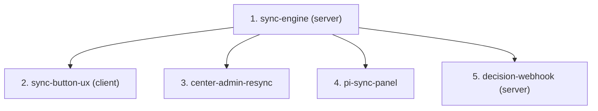

# Spec Family — Bilateral / PRMS Sync

> Push STAR results into the **PRMS Reporting Tool** through the PRMS Normalizer ingest API, with a governed sync state machine, Center-Admin re-sync, and a project-level (PI) sync control panel.

---

## 0. Document Control

- **Family path:** `docs/specs/bilateral/prms-sync/`
- **Parent spec / Feature:** `Bilateral / PRMS Sync`
- **Date created:** `2026-08-21`
- **Last updated:** `2026-09-21`
- **Spec-family status:** `open` — **HOLD LIFTED 2026-09-14.** The 2026-09 PRMS Normalizer contract landed and resolves the hold reason: ingest is still `POST /ingest` with an `x-api-key`; the "hook" turned out to be *outbound decision webhooks*, not a replacement transport. `sync-engine` carries a revised proposal + a full [field homologation](sync-engine/homologation.md). Both 2026-09-14 gates are now discharged: the API key was found to be already present in both environments (OQ-F8), and the child-#5 question resolved in two steps — the *Innovation Use investment* child was **withdrawn** (OQ-F9), and a **different** child 5, `decision-webhook`, was **HITL-approved 2026-09-21** to consume the outbound decision-webhook contract this revision first identified.
- **Owner / Squad:** Juan Cadavid / ARI
- **Linked PRD section:** [`docs/prd.md`](../../../prd.md) §4.1 (G1, G4), §5.1 (federation), §3.5 (PRMS as downstream consumer)
- **Linked TRD section:** [`docs/trd/trd.md`](../../../trd/trd.md) §9.1 (integrations), §7.1 (result lifecycle)
- **Requirement source:** Jira **AC-1676** + user mockups (Image #60, chat; 2026-09-14 My Projects "Contributing to Pool Funding" + sidebar PRMS SYNC) + **PRMS Normalizer – Technical Field Documentation, 2026-09 revision** + 7 payload examples + **PRMS Result Decision Webhooks** (supplied 2026-09-17, child 5) *(source files still in `~/Downloads`; copy into `docs/technical-docs/prms-normalizer/` during `/akili-specify` — see family risk R-F5)*
- **Slug:** `prms-sync` — derived from free-text argument ("PRMS SYNC … sincronización con el PRMS"); never a path literal.
- **Approval Mode:** gated

---

## 1. Context & Splitting Rationale

When a result is **Approved** (`status_id = 6`) and its **Pool Funding Alignment** section is complete, STAR must be able to push it to PRMS via the PRMS Normalizer `POST /ingest` API (TEST env for local/dev, PROD env for production). The client button already exists (`result-sidebar`, `data-testid="sidebar-prms-sync-button"`) with the correct enablement rule; **its click handler was wired on 2026-09-16 outside any child spec**, at the owner's request, because a button that does nothing is not a delivered feature — it now calls the endpoint, guards against double-submit and against an already-synced result, and surfaces the server's own refusal reason. What child 2 still owes is the confirm modal, the synced badge and the alignment-lock refresh; the server already carries `result.is_synced_to_prms` / `prms_result_code` (read as a 409 read-only gate, never written). What is missing is the whole middle: the outbound integration, the payload mapping per indicator type, the sync state machine, the re-sync path, and the PI-facing visibility.

Split rationale: (1) the server integration is the contract everything else consumes — it goes first; (2) the button wiring is a thin client consumer; (3) Center-Admin re-sync and (4) the PI panel are separate surfaces (bilateral admin module vs `project-detail`) with independent value. MoSCoW: 1–2 **Must**, 3 **Should**, 4 **Should** (high PI value, larger surface). Capturing SP-leader accept/reject inside PRMS is a **future family member** — the state model must be extensible to it, but no child builds it (PRMS side not developed yet).

---

## 2. Child Specs Manifest

| # | Spec Path | Title / Scope | Depends on | Parallel-safe | Status | Owner |
|---|---|---|---|---|---|---|
| 1 | `prms-sync/sync-engine` | Server: PRMS Normalizer integration tool, payload builders (5 types — KP re-added 2026-09-16, D-4 reversed; mapping built but still gated), sync endpoint, state persistence, env routing TEST/PROD | `none` | `yes` | `pending` | TBD |
| 2 | `prms-sync/sync-button-ux` | Client: ~~wire the existing PRMS SYNC button~~ (done 2026-09-16, out of spec — see §1), loading + success/failure UX (done); **still owed:** confirm modal, synced badge, alignment lock refresh | `sync-engine` | `no` | `pending` | TBD |
| 3 | `prms-sync/center-admin-resync` | Center Admin: sync status visibility + manual re-sync from the bilateral module for failed/pending results | `sync-engine` | `no` | `pending` | TBD |
| 4 | `prms-sync/pi-sync-panel` | PI project-level control panel: per-result sync pipeline (pending alignment / ready / synced / failed / future PRMS verdict) | `sync-engine` | `no` | `pending` | TBD |
| 5 | `prms-sync/decision-webhook` | Server: register STAR's callback destination with PRMS, receive the Science Program APPROVE/REJECT callback, deduplicate it on `x-prms-delivery-id`, and record **every** delivery in an append-only history built to be displayed | `sync-engine` | `yes` | `pending` | TBD |

> `Parallel-safe: no` on 2–4 because all three touch the client package; root guide §4.3 forbids two concurrent tasks in one package. 2, 3, 4 are functionally independent of each other (any order after 1).

---

## 3. Dependency Graph

---

## 4. Closed-Set Rule (Non-Negotiable)

> [!IMPORTANT]
> The child table in Section 2 is the **exhaustive child set** of this family. No AKILI command or agent may create or execute a child spec folder without a prior registered row here. Adding, removing, or re-ordering children requires a HITL-approved manifest edit. The family is `complete` only when every child is `done` and verified. The anticipated "capture SP-leader accept/reject from PRMS" phase **entered as child 5 on 2026-09-21** (HITL-approved manifest edit), because the PRMS side now exists: the *PRMS Result Decision Webhooks* contract was published. It is **not** the child #5 that OQ-F9 withdrew — that one was the Innovation Use investment fields, and no folder was ever created for it, so the number was free. Child 5 is deliberately **server-only**; the UI that displays the decision history enters later as its own row.

---

## 5. Family-Level Risks & Open Questions (inherited by every child)

| ID | Item |
|---|---|
| R-F1 | **Ingest acceptance is asynchronous** (EventBridge): a `202`-style "accepted" means *validated and queued*, not *persisted in PRMS*. The state model must distinguish `SYNCED (accepted by Normalizer)` from any future PRMS-side verdict. |
| R-F2 | **Environment discriminator (K-005):** TEST vs PROD Normalizer hosts are branch selectors — one `ARI_*` env var per environment, never collapsed. Local + Dev → TEST; Prod → PROD. |
| R-F3 | **`is_synced_to_prms` is load-bearing:** flipping it makes Pool Funding Alignment PATCH return 409 for everyone (even SYSTEM_ADMIN). It must be set only after a confirmed successful ingest acceptance. No un-sync semantics are defined (`op` supports delete/update — out of scope v1). |
| OQ-F1 | **Auth to the Normalizer API — CLOSED 2026-09-14.** Transport is unchanged: **`POST /ingest`**, authenticated with a **CLARISA API key in the `x-api-key` header**. No Bearer alternative, no anonymous access. The anticipated "hook model" did **not** replace ingest — it is a separate, *outbound* **decision-webhook** facility (`POST /webhook`, self-service, same key). **The family's hold reason is resolved.** Environments: TEST `v2f4lv8av4.execute-api.us-east-1.amazonaws.com` · PROD `v6a9z2e4y5.execute-api.us-east-1.amazonaws.com`. |
| OQ-F2 | **Type coverage — REVISED 2026-09-14 (D-4 + P-1).** v1 syncs **`capacity_sharing`** and **`innovation_development`** fully, and **`policy_change`** for 2 of its 3 subtypes. Excluded, each refused up front with a stated reason: **OICR** (no PRMS type — and **confirmed 2026-09-16 as permanent product policy**: OICRs will never be pushed, so this exclusion does not lapse if PRMS adds the type), ~~**Knowledge Product**~~ (**D-4 REVERSED 2026-09-16** — KPs will be sent; handle comes from the TIP importer's `'Handled'` evidence row, only TIP-imported KPs qualify. Mapping built, flow deliberately not: see `sync-engine/homologation.md` D-4b/D-4c and `changes/prms-sync-knowledge-products/spike/`), **Innovation Use** (D-1 + P-1, and see OQ-F11), and PRMS **policy type `1`** (D-2). See `sync-engine/homologation.md` §1.2. |
| OQ-F3 | **`lead_center` — CONFIRMED AND COMPLETED 2026-09-14 (D-7).** The 2026-08-21 answer stands — CIAT and Bioversity are sent **separately** — and the driving field is now named: **`agresso_contract.ubwClientDescription`** on the **primary** contract. `ExCIAT` → **`46`** (*Alliance of Bioversity and CIAT – Regional Hub*, `ABC RH - CIAT (Alliance)`); `ExBIO` → **`49`** (*… – Headquarter (Bioversity International)*, `ABC - Bioversity (Alliance)`). Same rule serves `contributing_center`. Corroborated by the inbound `AcronymExContractEnum` (`'ABC RH' → EXCIAT`, `'ABC' → EXBIO`, `prms.opensearch.service.ts:665-676`) — reuse it. ⚠️ A wrong branch is **silent** (both ids are valid institutions), so assert **both** values. |
| OQ-F4 | **PI identity — CLOSED 2026-08-21:** the PI is the project/contract-level **Principal Investigator** from AGRESSO (My Projects "Principal Investigator" column; mockup Image #64). Already modeled: `principal_investigator` / `project_lead_description` on the contract, matched to STAR users via `queryPrincipalInvestigator` → `is_principal` (`domain/shared/const/gloabl-queries.const.ts`) + `PRINCIPAL_INVESTIGATOR_EMAIL_ARRAY` app-config. The `pi-sync-panel` guard builds on `is_principal`. |
| OQ-F5 | **kp.json contradiction — SUPERSEDED 2026-09-14.** The 2026-09 contract settles `knowledge_product` at a single required `handle`. The *surviving* documentation contradiction is now `innovation_readiness_level`: the field table declares `id`/`name`, while `inno_dev.json` sends `{"level": 0}` — carried forward as **OQ-H6** in [`sync-engine/homologation.md`](sync-engine/homologation.md) §6. The TEST-env spike task stands and now closes OQ-H5, OQ-H6, OQ-H9 and OQ-F7. |
| OQ-F6 | **"Transparent to the user":** on failure, does the contributor see nothing (silent queue + Center-Admin retry) or a soft "sync pending" note? Recommended: soft note; decide at specify. |
| OQ-F7 | **PRMS result code round-trip (user requirement 2026-08-21):** STAR must store the code under which the result was created in PRMS (`result.prms_result_code` already exists for this) and reference it in the UI. The ingest response example shows only `results: [{...Metadata}]` + `requestId` — confirm with the PRMS team whether the PRMS-assigned code arrives synchronously in that metadata or only after async processing (callback/poll). The answer decides whether `sync-engine` captures it inline or a follow-up mechanism is needed. **STILL OPEN 2026-09-14** — the 2026-09 contract's success example still shows only `results: [{...Metadata}]` + `requestId`, and documents no field carrying a PRMS-assigned code. What it *does* now provide is **`external_reference`**: our own identifier, stored verbatim and returned on **every** row (success, failed, and pre-processing rejected) and on the decision webhook. That solves correlation but is **not** the PRMS code. Closed only by the TEST-env spike. **Narrowed 2026-09-21 by the decision-webhook contract:** the callback body carries both `result_id` (PRMS's internal id) and, inside `data`, `result_code` — so a PRMS-side code does reach STAR eventually, but only *after a Science Program decides*, which may be long after the sync. Whether `prms_result_code` may be populated from the callback, or must come from the ingest response, is now a **child-5 boundary question**, not only a spike question. |
| **R-F4** | **A 207 is not a success (new 2026-09-14).** Per-row failures — bad evidence link, unresolvable `grant_title`, unknown actor type — arrive **inside** an HTTP 207 in `results[]`, while `rejected[]` (422) stays empty. Combined with R-F3, a "2xx ⇒ synced" shortcut permanently 409-locks the alignment of a result PRMS refused. Every child that displays or acts on sync state inherits this. |
| **R-F5** | **Contract documentation lives outside the repo.** The `.md` + 7 JSON examples are still in `~/Downloads`. Copy them to `docs/technical-docs/prms-normalizer/` during `/akili-specify` so specs cite a versioned source, not a local path. |
| **OQ-F8** | **STAR API key — CLOSED 2026-09-14, no longer the critical path.** The key is the **`app_config` row `ARI_CLARISA_API_KEY`** (migration `1781879906673`), read via **`AppConfigService.getEnv(AppConfigKey.ARI_CLARISA_API_KEY).simple_value`** — the same manager `PdfViewerService` uses. **The value is already present in both TEST and PROD** (verified by the product owner, 2026-09-14), so nothing has to be requested from PRMS Tech Support to run the spike. Two design notes for `sync-engine`: `getEnv` **throws** when the row is missing or inactive (fail loud — let it propagate), and it must be read **per request**, not in the constructor as `PdfViewerService` does, or a rotated key keeps working until the next restart. The environment split is handled by the database itself; **only the Normalizer HOST still needs one `ARI_*` var per environment** (K-005 / R-F2). |
| **OQ-F9** | **Proposed child #5 — WITHDRAWN 2026-09-14 (D-1).** `usd_budget` / `is_determined` are **not being built this cycle**, so there is nothing for that child to deliver. The manifest stays at **4 children**; no folder was created. What replaces it is a single open decision, **OQ-H1'**: v1 either gates Innovation Use out with a stated reason (recommended), lets it fail at PRMS, or revisits D-1 for **`is_determined` alone** — a per-project boolean needing **no monetary figure**, which PRMS accepts on its own and which would make the type fully syncable. See [`sync-engine/proposal.md`](sync-engine/proposal.md) §12. |
| **OQ-F10** | **Decision log 2026-09-14.** Seven gaps were put to the product owner and all seven decided (**D-1…D-7**, recorded in [`sync-engine/homologation.md`](sync-engine/homologation.md) §1.1). Two carry consequences every child inherits: **D-5** (no evidence-link validation — the 207 per-row interpretation of R-F4 becomes the *only* safeguard against a wrongly-synced result) and **D-6** (no title/description length guard, on a **verbal** PRMS-developer confirmation that contradicts the written contract — re-check per K-013 if rows start failing on length). |
| **P-1** | **GOVERNING PRINCIPLE — *what we do not have, we do not send* (2026-09-14).** STAR never authors reporting data on the user's behalf. A value not entered, confirmed, or accepted by a reporting user is **not sent** — not as a default, not as an inference, not as a "technically true" placeholder that makes a payload validate. *STAR does not hold the value* and *the user declared the value undetermined* are different statements: the first is about our schema, the second is a reporting claim with an author. Where a mandatory field has no user-supplied source, the correct outcome is that the result is **not synced** — visibly, with a stated reason — never that it is synced with a value we chose. **This binds every child and every future field decision**, and it overrides both convenience and passing validation. Established when a proposal to emit `is_determined: true` on every bilateral project was rejected; full text and the three further fields it removed in `sync-engine/homologation.md` §1.0 and §1.4. |
| **OQ-F11** | **PRMS PO meeting — the only path to wider type coverage.** Six items, listed in [`sync-engine/homologation.md`](sync-engine/homologation.md) §11.1: (1) Innovation Use investment (`usd_budget`/`is_determined`), (2) `innov_use_to_be_determined` — **a second, independent blocker on the same type**, so solving (1) alone buys nothing, (3) policy type `1` amount fields, (4) `keep_editing` workflow choice, (5) contract-vs-example contradictions, (6) the verbal title/description length exception. The question at that meeting is not *how do we fill these fields* but *who is supposed to*. |
| **R-F6** | **Build ≠ send (2026-09-14).** A type excluded by PRMS's contract is still **built**: payload builders exist, are unit-tested and run in CI against fixtures for every indicator STAR can represent. What the gate withholds is the **send**, and it must be one enumerated, data-driven list — never a missing branch inside a builder. Lifting an exclusion after the PRMS PO meeting is then removing a list entry, not authoring a builder months after the contract was last read. Binds children 2–4 too: the UI states *why* a type is not syncable, never implies it is unimplemented. |
| **R-F7** | **The inbound homologations do not all invert (2026-09-14).** Of the ten artefacts in `domain/tools/open-search/prms/`, **six are reusable in reverse and four are not** — full review in [`sync-engine/homologation.md`](sync-engine/homologation.md) §12. Two traps: `indicator.homologation.ts` maps PRMS's **numeric** `ResultTypeEnum`, while the Normalizer takes **strings** — a different vocabulary, so the outbound map is a new artefact, not an inversion; and **`sex_and_age_disaggregation` is negated by the inbound code** (`prms.opensearch.service.ts:564`) for a *different* PRMS surface, while both the Normalizer doc and STAR's entity make the outbound direction a pass-through. Copying that line would invert every actor row, and because both values are valid booleans **PRMS would accept the payload and record the wrong mode silently**. Prove the orientation in the spike; never cite `:564` as precedent. |
