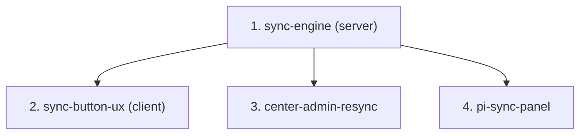

# Spec Family — Bilateral / PRMS Sync

> Push STAR results into the **PRMS Reporting Tool** through the PRMS Normalizer ingest API, with a governed sync state machine, Center-Admin re-sync, and a project-level (PI) sync control panel.

---

## 0. Document Control

- **Family path:** `docs/specs/bilateral/prms-sync/`
- **Parent spec / Feature:** `Bilateral / PRMS Sync`
- **Date created:** `2026-08-21`
- **Last updated:** `2026-08-21`
- **Spec-family status:** `open` — **ON HOLD until 2026-08-25 (Tuesday):** the PRMS team is reworking the ingest contract to a **hook-based model** and will share auth + response details then. No `/akili-specify` before that; see §5 answers of 2026-08-21.
- **Owner / Squad:** Juan Cadavid / ARI
- **Linked PRD section:** [`docs/prd.md`](../../../prd.md) §4.1 (G1, G4), §5.1 (federation), §3.5 (PRMS as downstream consumer)
- **Linked TRD section:** [`docs/trd/trd.md`](../../../trd/trd.md) §9.1 (integrations), §7.1 (result lifecycle)
- **Requirement source:** Jira **AC-1676** + user mockup (Image #60, chat) + [PRMS Normalizer – Technical Field Documentation](../../../technical-docs/) *(source file currently in `~/Downloads`; copy into the repo during `/akili-specify` — see family risk R-F5)*
- **Slug:** `prms-sync` — derived from free-text argument ("PRMS SYNC … sincronización con el PRMS"); never a path literal.
- **Approval Mode:** gated

---

## 1. Context & Splitting Rationale

When a result is **Approved** (`status_id = 6`) and its **Pool Funding Alignment** section is complete, STAR must be able to push it to PRMS via the PRMS Normalizer `POST /ingest` API (TEST env for local/dev, PROD env for production). The client button already exists (`result-sidebar`, `data-testid="sidebar-prms-sync-button"`) with the correct enablement rule but an empty click handler; the server already carries `result.is_synced_to_prms` / `prms_result_code` (read as a 409 read-only gate, never written). What is missing is the whole middle: the outbound integration, the payload mapping per indicator type, the sync state machine, the re-sync path, and the PI-facing visibility.

Split rationale: (1) the server integration is the contract everything else consumes — it goes first; (2) the button wiring is a thin client consumer; (3) Center-Admin re-sync and (4) the PI panel are separate surfaces (bilateral admin module vs `project-detail`) with independent value. MoSCoW: 1–2 **Must**, 3 **Should**, 4 **Should** (high PI value, larger surface). Capturing SP-leader accept/reject inside PRMS is a **future family member** — the state model must be extensible to it, but no child builds it (PRMS side not developed yet).

---

## 2. Child Specs Manifest

| # | Spec Path | Title / Scope | Depends on | Parallel-safe | Status | Owner |
|---|---|---|---|---|---|---|
| 1 | `prms-sync/sync-engine` | Server: PRMS Normalizer integration tool, payload builders (5 types), sync endpoint, state persistence, env routing TEST/PROD | `none` | `yes` | `pending` | TBD |
| 2 | `prms-sync/sync-button-ux` | Client: wire the existing PRMS SYNC button — confirm modal, loading, success/failure UX, synced badge, alignment lock refresh | `sync-engine` | `no` | `pending` | TBD |
| 3 | `prms-sync/center-admin-resync` | Center Admin: sync status visibility + manual re-sync from the bilateral module for failed/pending results | `sync-engine` | `no` | `pending` | TBD |
| 4 | `prms-sync/pi-sync-panel` | PI project-level control panel: per-result sync pipeline (pending alignment / ready / synced / failed / future PRMS verdict) | `sync-engine` | `no` | `pending` | TBD |

> `Parallel-safe: no` on 2–4 because all three touch the client package; root guide §4.3 forbids two concurrent tasks in one package. 2, 3, 4 are functionally independent of each other (any order after 1).

---

## 3. Dependency Graph

---

## 4. Closed-Set Rule (Non-Negotiable)

> [!IMPORTANT]
> The child table in Section 2 is the **exhaustive child set** of this family. No AKILI command or agent may create or execute a child spec folder without a prior registered row here. Adding, removing, or re-ordering children requires a HITL-approved manifest edit. The family is `complete` only when every child is `done` and verified. The anticipated "capture SP-leader accept/reject from PRMS" phase is **deliberately not a row yet** — it enters via a manifest edit once the PRMS side exists.

---

## 5. Family-Level Risks & Open Questions (inherited by every child)

| ID | Item |
|---|---|
| R-F1 | **Ingest acceptance is asynchronous** (EventBridge): a `202`-style "accepted" means *validated and queued*, not *persisted in PRMS*. The state model must distinguish `SYNCED (accepted by Normalizer)` from any future PRMS-side verdict. |
| R-F2 | **Environment discriminator (K-005):** TEST vs PROD Normalizer hosts are branch selectors — one `ARI_*` env var per environment, never collapsed. Local + Dev → TEST; Prod → PROD. |
| R-F3 | **`is_synced_to_prms` is load-bearing:** flipping it makes Pool Funding Alignment PATCH return 409 for everyone (even SYSTEM_ADMIN). It must be set only after a confirmed successful ingest acceptance. No un-sync semantics are defined (`op` supports delete/update — out of scope v1). |
| OQ-F1 | **Auth to the Normalizer API** — **ANSWERED 2026-08-21 (partially):** the PRMS team is modifying the service to work as a **HOOK**; full auth + contract info arrives **Tuesday 2026-08-25**. The shared Normalizer doc may be partially superseded — re-validate transport, URLs, and payload contract against Tuesday's info before `sync-engine` design. **This is the family's hold reason.** |
| OQ-F2 | **Type coverage — CLOSED 2026-08-21:** **OICR is excluded from sync.** Supported set = the 5 exampled types (`capacity_sharing`, `knowledge_product`, `policy_change`, `innovation_development`, `innovation_use`). Exact STAR `indicator_id` → PRMS `type` mapping table is a `sync-engine` design task. |
| OQ-F3 | **`lead_center` — CLOSED 2026-08-21:** CIAT and Bioversity are sent **separately** (46 = CIAT, 49 = Bioversity), driven by the contract's **Lead Center** (visible as the My Projects "Lead Center" column, AGRESSO-sourced). `sync-engine` maps contract lead center → the corresponding institution id. |
| OQ-F4 | **PI identity — CLOSED 2026-08-21:** the PI is the project/contract-level **Principal Investigator** from AGRESSO (My Projects "Principal Investigator" column; mockup Image #64). Already modeled: `principal_investigator` / `project_lead_description` on the contract, matched to STAR users via `queryPrincipalInvestigator` → `is_principal` (`domain/shared/const/gloabl-queries.const.ts`) + `PRINCIPAL_INVESTIGATOR_EMAIL_ARRAY` app-config. The `pi-sync-panel` guard builds on `is_principal`. |
| OQ-F5 | **kp.json contradiction — DEFERRED to 2026-08-25:** likely resolved by the new hook contract info; keep the TEST-env spike task in `sync-engine` and run it against whatever contract is current on Tuesday. |
| OQ-F6 | **"Transparent to the user":** on failure, does the contributor see nothing (silent queue + Center-Admin retry) or a soft "sync pending" note? Recommended: soft note; decide at specify. |
| OQ-F7 | **PRMS result code round-trip (user requirement 2026-08-21):** STAR must store the code under which the result was created in PRMS (`result.prms_result_code` already exists for this) and reference it in the UI. The ingest response example shows only `results: [{...Metadata}]` + `requestId` — confirm with the PRMS team whether the PRMS-assigned code arrives synchronously in that metadata or only after async processing (callback/poll). The answer decides whether `sync-engine` captures it inline or a follow-up mechanism is needed. **DEFERRED to 2026-08-25** — to be defined with the hook contract info. |
