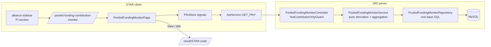

# Design — Bilateral / Pooled Funding Contribution Monitor

- **Module:** bilateral — new server module `pooled-funding-monitor` + new STAR page
- **Spec id:** 2026-10-pooled-funding-monitor
- **Status:** approved
- **Owner:** Daniela Pino / ARI
- **Linked requirements:** [./requirements.md](./requirements.md)
- **Linked detailed design:** [`docs/trd/trd.md`](../../../../trd/trd.md) §7.1 (result lifecycle), §9.1 (integrations)
- **Visual source:** [./mockup/](./mockup/) — logic reference: `mockup/mockup-logic.extracted.js`
- **Last updated:** 2026-10-08

---

## 0. Summary

**One server module** builds the monitored result set with **one parameterized SQL query** per request. The service turns those rows into derived states with **pure functions** and aggregates them for three GET endpoints.

**One lazy-loaded standalone Angular page:**
- renders the two tabs exactly as the mockup;
- uses Tailwind utilities with `--ac-*` tokens;
- its only outbound action is a router link to the result.

No schema change. No write path.

## 1. Goals & non-goals

| Goal | Requirements |
|---|---|
| G1. A server-side derivation that every count and row is built from | R-PFM-003, R-PFM-004, NFR-PFM-006 |
| G2. Scope and access enforced by the server | R-PFM-001, R-PFM-002, NFR-PFM-001 |
| G3. Coverage tab (KPIs, pipeline, SP coverage, monthly) | R-PFM-005…008 |
| G4. Results queue (filters, chips, lazy groups, rows, View) | R-PFM-009…013, R-PFM-015 |
| G5. Mockup fidelity with Tailwind + tokens; loading, empty and error states | R-PFM-014, R-PFM-016, NFR-PFM-003…005 |

**Non-goals:**
- Any sync or write action.
- The drawer.
- A version diff.
- The TOC and Log tabs.
- Changing the sync engine, the webhook, or child 4.
- Applying the pending local migrations (a human decision; see §11).

> **KZ-016 cross-check done.** Read back against every `AND IT MUST` / `BUT it must NOT` clause and against the modules touched. Two constraints shaped this design:
> - `pool_funding_alignment_validation` is a **visual-only** check. Using it here to display state is within its stated purpose.
> - `effectivePoolFundingContributorSql` takes a **trusted alias literal only**, never request input.

---

## 2. Architecture

### 2.1 Composition — server (`server/researchindicators/src/domain/entities/pooled-funding-monitor/`)

| File | Responsibility |
|---|---|
| `pooled-funding-monitor.module.ts` | Nest module. Registered in **`entities.module.ts` and `main.routes.ts`** (path `pooled-funding-monitor`) — KZ-017: registering only the route 404'd `pi-delegates` in production |
| `pooled-funding-monitor.controller.ts` | 3 GET handlers, Swagger, `ResponseUtils.format` envelope |
| `pooled-funding-monitor.service.ts` | Calls the repository, applies derivation, filters, chips and aggregates |
| `derivation/pfm-derivation.ts` | **Pure** functions: STAR label, PI line, mapping state + note, PRMS status + hint, `isOutOfScope`, `isReady`, `needsAttention`, row rank, chip match, status-filter match |
| `derivation/pfm-aggregation.ts` | **Pure**: KPIs, pipeline stages, SP coverage, monthly series, project groups + counts + ordering |
| `repositories/pooled-funding-monitor.repository.ts` | Base SQL (§3.2), monthly-sync SQL, contributing-project count, filter options |
| `guards/not-contributor-only.guard.ts` | Denies users whose roles are empty or all `CONTRIBUTOR (3)` |
| `dto/pfm-query.dto.ts` | `scope`, `project`, `sp`, `status`, `type`, `chip` (class-validator, enums) |
| `dto/pfm-*.response.dto.ts` | Swagger response shapes (§4) |
| `enum/pfm-*.enum.ts` | Scope, STAR label, mapping state, PRMS status, status filter, chip |
| sibling `*.spec.ts` | One for controller, service, derivation, aggregation, guard, repository |

### 2.2 Composition — client (`client/research-indicators/src/app/pages/platform/pages/pooled-funding-monitor/`)

| File | Responsibility |
|---|---|
| `pooled-funding-monitor.component.{ts,html}` | Page shell: title, subtitle, scope toggle, KPI cards, tab strip, tab outlet |
| `services/pfm-store.service.ts` | Signals: `scope`, `tab`, `filters`, `chip`, `summary`, `queue`, `groupRows` (map), `openGroups` (set), per-section load/error state. Calls `ApiService`. `scope` and `tab` mirror `?scope=&tab=` |
| `components/pfm-kpi-cards/` | 4 cards (R-PFM-005) |
| `components/pfm-coverage-tab/` | Hosts the three coverage cards |
| `components/pfm-pipeline-card/` | Stacked bar + 3 summary figures + 7 stage tiles (R-PFM-006) |
| `components/pfm-sp-coverage-card/` | SP rows with dual bar (R-PFM-007) |
| `components/pfm-sync-activity-card/` | 6 monthly bars + footer (R-PFM-008) |
| `components/pfm-queue-tab/` | Filters row, chips row, group list, footer + legend (R-PFM-009/010/015) |
| `components/pfm-project-group/` | Collapsible header + lazy rows (R-PFM-011) |
| `components/pfm-result-row/` | One row + View link (R-PFM-012/013) |
| `components/pfm-status-badge/` | Presentational badge/pill: `kind` (star / mapping / prms) + value → token classes + icon/label (non-color cue) |
| `pfm.interfaces.ts` | Wire types matching §4 |
| `guards/pooled-funding-monitor.guard.ts` (in `shared/guards/`) | Client mirror of the access rule + feature flag; redirects to `/home` |
| `shared/services/api.service.ts` | `GET_PfmSummary`, `GET_PfmQueue`, `GET_PfmProjectResults` |
| `app.routes.ts` | Lazy `loadComponent` route `pooled-funding-contribution-monitor`, `canMatch: [rolesGuard, pooledFundingMonitorGuard]` |
| `alliance-sidebar.component.{ts,html}` | PI section shows when `piOptions().length > 0`; the monitor item sits under *My PI Delegates* (owner, 2026-10-08) |
| `roles.service.ts` | New computed `canAccessPooledFundingMonitor` |

### 2.3 Reuse

| Reused | For |
|---|---|
| `effectivePoolFundingContributorSql` (`shared/utils/pool-funding.util.ts:16`) | Contributing-project predicate |
| SQL function `pool_funding_alignment_validation(result_id)` (migration `1786679227000`) | Mapping *Complete* vs *Incomplete*: the **same** rule the sidebar green check shows, so the monitor and the result page cannot disagree |
| PI predicate from My Projects (`agresso-contract.repository.ts:430-450`, minus the `created_by` branch) | PI scope |
| `result-prms-sync-status.reader.ts` filters (`CORRELATED`, `duplicate_of_id IS NULL`) | Latest PRMS decision, applied in bulk |
| `ResponseUtils.format`, `RolesGuard`, `LoggerUtil` | Envelope, auth, logging |
| Results Center `getResultRouteArray` / `getResultHref` (`results-center-table.component.ts:302-321`) | View link rule. **Extract to a shared util** rather than duplicate (**T-08** in `tasks.md`) |
| `poolFundingFlags` service (client) | OQ-6 flag gating |

---

## 3. Data model

**No data model changes.** No entity, column, index or migration.

### 3.1 Sources (verified against local DB 2026-10-08 unless noted)

| Source | Columns used |
|---|---|
| `results` | `result_id`, `result_official_code`, `report_year_id`, `title`, `indicator_id`, `result_status_id`, `platform_code`, `is_snapshot`, `is_active`, `updated_at`, `is_synced_to_prms` |
| `result_contracts` | `contract_id`, `is_primary=1`, `is_active=1` |
| `agresso_contracts` | `agreement_id`, `short_title` (or `description`), `donor`, `projectLeadId`, `project_lead_description` (199 contributing contracts locally; all have donor and lead filled) |
| `pi_delegates` | Active delegate rows (PI scope) |
| `result_pool_funding_alignment` (+ `_sp`) | `has_contribution`; `sp_code`, `sp_role` PRIMARY / CONTRIBUTING / **NULL** (34 legacy NULL-role rows locally) |
| `clarisa_science_programs` | `official_code`, `name`, **`category`** (Science programs / Scaling programs / Accelerators), `color` — resolves OQ-8 |
| `submission_history` | `to_status_id=6`, `custom_date` → approval date (D-4) |
| `result_prms_sync_history` | Latest `status` + `justification`. **Absent on the local DB** (migration `1790086170692` pending) |
| `result_prms_sync_log` | `outcome='ACCEPTED'` + `created_at` → monthly series (empty locally) |

### 3.2 Base query (conceptual — written in T-02)

One row per monitored result, for one scope:

1. **Filter:**
   - `results` current rows (`is_snapshot=0`, `is_active=1`, `platform_code='STAR'`);
   - `indicator_id IN (1,2,3,4,6)` (OICR = 5 excluded);
   - joined to their primary active contract;
   - kept when that contract is a contributing project.
2. **PI scope** adds the PI predicate (lead carnet of the authenticated user, or an active delegate row). Portfolio scope omits it.
3. **Projected per row:**
   - ids, title, type, status, `updated_at`;
   - project code, name, donor, lead;
   - `has_alignment`, `has_contribution`, `mapping_complete` (the SQL function);
   - primary SP (`PRIMARY` row; else the **only** active SP when exactly one exists; else none — DD-PFM-7);
   - contributing SP names;
   - latest approval date;
   - `is_synced_to_prms`;
   - latest PRMS status + justification.
4. **Version-safe keys:** history tables are joined on `(result_official_code, report_year_id)`, never on `result_id`, which differs per version.

Filters and chips are applied **in the service**, on the derived rows, so one derivation feeds every number (NFR-PFM-006).

---

## 4. API surface

Common to all three endpoints:
- unversioned (no `@Version` — root guide §4.1);
- class-level `@UseGuards(NotContributorOnlyGuard)`;
- Swagger: `@ApiTags('Pooled Funding Monitor')`, `@ApiBearerAuth()`, `@ApiOperation`, `@ApiQuery` per param.

Errors:
- 401 (middleware);
- 403 for contributor-only users or machine tokens;
- 400 for invalid enum values (class-validator).

### GET `/api/pooled-funding-monitor/summary`

- **Query:** `scope=mine|all` (default `mine`).
- **Data:** `{ scope, is_pi_of_any, kpis:{projects, projects_total, monitored, need_attention, synced, in_prms_scope}, pipeline:{total, in_scope, not_synced, in_prms, out_of_scope, stages:[{key, group, value}]}, sp_coverage:[{code, name, synced, total}], monthly:[{month:'YYYY-MM', synced}], synced_this_year }`

### GET `/api/pooled-funding-monitor/queue`

- **Query:** `scope`, `project?`, `sp?`, `status?` (enum of the 7 options), `type?` (indicator id), `chip?` (enum of the 7 chips).
- **Data:** `{ filter_options:{projects:[{code, name}], science_programs:[{category, items:[{code, name}]}], types:[{id, name}]}, chip_counts:{all, attention, mapping, ready, pending, prms_rejected, synced}, groups:[{code, name, lead_pi, donor, result_count, attention, counts:{approved, pending, rejected, out_of_scope, not_sent}}], totals:{results, projects, monitored_total} }`
- `filter_options` are computed from the **scope**, not the filtered set.
- `chip_counts` are computed from the filtered set **before** the chip is applied.
- `groups` are computed **after** the chip is applied, already sorted (R-PFM-011).

### GET `/api/pooled-funding-monitor/queue/projects/:projectCode/results`

- **Query:** same as `/queue`.
- **Data:** `[{ result_code, platform_code, official_code, report_year, snapshot_years:[...], title, type, star_label, star_status_id, pi_line, mapping_state, mapping_note, sp_line, primary_sp:{code, name, color}|null, contributing:[...], prms_status, prms_hint, updated_at }]`, rows already ranked.
- **404** when the project is not in the viewer's scope. It must not reveal whether the project exists.

`snapshot_years` + `star_status_id` let the client build the same link as the Results Center (DD-PFM-9).

---

## 5. Workflows & business rules

1. The request passes `JwtMiddleware` and then `NotContributorOnlyGuard`. The guard:
   - rejects machine tokens by **`request.credential === 'machine'`** (set by `JwtMiddleware` on every branch). A machine token is *not* identifiable by a missing `sec_user_id`: `AppSecretsService.validation` gives it the responsible human's integer `sec_user_id` and roles (corrected 2026-10-08, T-04 review);
   - rejects users whose role list is empty or contains only role 3.
2. The service resolves scope. For `mine`, the PI predicate uses the **authenticated** user's carnet and user id, never request input (NFR-PFM-001).
3. The repository runs the base query. The service maps each row through `pfm-derivation`, applying the D-3/D-4 tables from R-PFM-004.
4. Derivation rules, in order:
   - **out of scope:** `has_contribution = false`;
   - **mapping state:** Not started when there is no alignment; Complete when `mapping_complete = 1`; otherwise Incomplete;
   - **PRMS status:** Not sent unless `is_synced_to_prms`. When synced, use the latest history `status`, and **Pending Review when no history row exists** (R-F1: accepted ≠ decided).
5. The service applies filters, then computes chip counts, applies the chip, then groups, sorts and aggregates.
6. Nothing is written. No audit, socket, queue, OpenSearch or `sync_process_log` side effects. No transactions.

---

## 6. Frontend / UX component architecture

### 6.1 Layout (mockup → components)

| Mockup region | Component | Notes |
|---|---|---|
| Title, subtitle, scope segmented control | page | Segmented control = two `button`s with `aria-pressed`. "PRMS sync: today…" and *Sync now* **omitted** (R-PFM-014) |
| 4 KPI cards (left accent border) | `pfm-kpi-cards` | Accent per card via token class; numbers use `tabular-nums` |
| Tabs *Portfolio coverage* / *Results queue* | page | `role="tablist"`, arrow-key navigation; only 2 tabs |
| Result pipeline | `pfm-pipeline-card` | Flex segments sized by `flex-grow` = value; group labels In STAR / In PRMS / Out of scope |
| Coverage by Science Program | `pfm-sp-coverage-card` | Outer bar = total / max total; inner = synced / total |
| Sync activity | `pfm-sync-activity-card` | 6 bars, height ∝ value / max; month labels always visible |
| Filters + Reset | `pfm-queue-tab` | PrimeNG `p-select`; SP select uses grouped options by `category`; Reset is a text button |
| Quick views chips | `pfm-queue-tab` | `button`s with `aria-pressed` + count badge |
| Project group | `pfm-project-group` | Header is a `button` with `aria-expanded`/`aria-controls`; caret ▸/▾; stacked bar with `title` per segment; attention flag |
| Row grid | `pfm-result-row` | CSS grid; columns per R-PFM-012; inside a card with `overflow-x-auto` (NFR-PFM-005) |
| View | `pfm-result-row` | `<a [routerLink] [queryParams]>` styled as a secondary button — a real link (open-in-new-tab works) |
| Legend + count line | `pfm-queue-tab` | Copy per R-PFM-015 |

### 6.2 Design tokens

The mockup's hex palette maps to **semantic tokens**. Existing `--ac-*` tokens are reused where an equivalent exists. Missing ones are added to the **existing** global token stylesheet: no new `.scss` file is created; the existing file gets new custom properties, with light and dark values.

| Token family | Use | Mockup source |
|---|---|---|
| `--ac-pfm-success-bg/fg` | STAR Approved, mapping Complete, flag *All clear* | `#e6f2ea / #1d6b3e` |
| `--ac-pfm-info-bg/fg` | STAR Submitted, primary accent, selected chip | `#e7eefa / #0f4c9a` |
| `--ac-pfm-review-bg/fg` | STAR Under review | `#efe9f7 / #5b3d96` |
| `--ac-pfm-neutral-bg/fg` | STAR Draft, mapping Not started, unselected chip count | `#eef1f5 / #6b7a89` |
| `--ac-pfm-danger-bg/fg` | STAR Returned, PRMS Rejected | `#fdeceb / #b4443a` |
| `--ac-pfm-warning-bg/fg/border` | mapping Incomplete, PRMS Pending Review, attention flag, *Need attention* card | `#fdf0d5 / #8a5a08 / #e9cf9e` |
| `--ac-pfm-outscope-fg` | No SP contribution segments | `#2f7cc4` |
| `--ac-pfm-seg-*` | Pipeline / group bar segments (7) | mockup `PL_A/PL_B/PL_C` colors |

- **SP badges** use the **DB `clarisa_science_programs.color`**. It is bound at runtime as a CSS variable, with the background derived by `color-mix` (DD-PFM-8). No hard-coded SP palette.
- **Typography:** STAR's existing type scale (`fs-*`). The mockup's IBM Plex is **not** imported (DD-PFM-10); figures use `tabular-nums`.

### 6.3 States

| State | Rendering |
|---|---|
| Loading | Tailwind `animate-pulse` blocks in card, chart and group shapes. Toggle and tabs stay enabled |
| Error per section | Inline card: message + **Retry**. Other sections stay rendered (R-PFM-016) |
| Empty PI scope | Message + "View whole portfolio" button that sets scope (R-PFM-002) |
| Empty filtered | "No results match these filters" + Reset |
| Group rows loading | 3 skeleton rows inside the expanded group |

### 6.4 Client state rules

- Changing scope **keeps** the filters, chip and tab. It refetches summary and queue, and clears the cached group rows and `openGroups` (the groups belong to the old scope).
- Changing a filter resets the chip to `null` (mockup `setF`), refetches the queue, and clears the cached group rows.
- Expanding a group fetches its rows once per (scope, filters, chip) key.

---

## 7. Integration impact

None. No CLARISA, AGRESSO, PRMS, socket, queue or cron involvement. Reads only tables already populated by other features.

## 8. Security & authorization

| Item | Decision |
|---|---|
| Who can call | Any user with at least one role ≠ `CONTRIBUTOR (3)`. `SYSTEM_ADMIN` included (DD-PFM-2) |
| Machine token | Refused (403): data is user-scoped. Detected by `request.credential === 'machine'`, never by user fields — the machine path carries its responsible user's identity (T-04 correction) |
| Scope isolation | PI scope derived only from `request.user`. The project-results endpoint 404s for projects outside scope |
| SQL safety | All request values are bound parameters. `effectivePoolFundingContributorSql` is called with a literal alias only |
| PII | Names of PIs and titles are already visible to these roles elsewhere (My Projects, Results Center). Nothing new is exposed |

## 9. Observability

- `LoggerUtil` debug line per request: scope, filter keys, row count, duration in ms. No user identifiers beyond the id.
- No new `sync_process_log` types.

## 10. Testing strategy

| Layer | Tests | Disqualifier |
|---|---|---|
| Derivation (pure) | Table-driven: every STAR id → label, every alignment combination → mapping, PRMS combinations incl. *synced without history → Pending Review*, chip and status matches | Fixtures where every row shares the same values cannot prove per-row logic — **vary at least one discriminating field per row** (KZ-004) |
| Aggregation (pure) | KPIs / pipeline / SP / groups ordering on a 12-row varied fixture; asserts that the partition sums | — |
| Repository | **e2e against a real DB with seeded rows** (KZ-017: a mocked query builder cannot represent SQL precedence). Compares to an independent hand-written count query | Running on a DB without `result_prms_sync_history` makes the PRMS branch untested → report **inconclusive**, not pass |
| Guard | contributor-only → 403; contributor + center admin → pass; empty roles → 403; machine token → 403 | — |
| Controller e2e | Boot the app and hit the real URL (KZ-017); 401 / 403 / 200; PI isolation with two seeded PIs | — |
| Client | Store logic; components assert **rendered DOM text** of KPI values and chip counts (KZ-001); group toggle `aria-expanded`; View `href`; no element with sync wording (R-PFM-014); sidebar shows the item for allowed roles and hides it for contributor-only. Fixtures arrange the **transition** (load → data) per KZ-015 | A test that sets the final state before the first `detectChanges()` is not evidence |
| Visual | **No automated gate**: side-by-side review against the mockup at the HITL pause; dark mode checked by a human | — |

## 11. Rollout

| Item | Plan |
|---|---|
| Schema | None. **Precondition:** the target DB has migration `1790086170692` (`result_prms_sync_history`). Dev applies migrations on deploy; the **local DB is missing it**. Applying locally is a human decision (RB-1) |
| Feature flag | Page and nav hidden when `POOL_FUNDING_SECTION_ENABLED` is off (OQ-6 default accepted) |
| Backout | Revert the PR. No data to roll back |
| Comms | PIs / Center Admins via the usual release note |

## 12. Design decisions log

| # | Date | Decision | Rationale |
|---|---|---|---|
| DD-PFM-1 | 2026-10-08 | **One base SQL + pure TS derivation/aggregation**, rather than many aggregate SQL queries | One derivation feeds every number (NFR-PFM-006); pure functions are unit-testable without DB mocks (KZ-001). Volume (156 STAR rows locally; low thousands portfolio-wide) fits in memory. Rejected: SQL `GROUP BY` per card (7 queries that could disagree) |
| DD-PFM-2 | 2026-10-08 | New `NotContributorOnlyGuard` (deny-list), not `@Roles` (allow-list) | D-2 is phrased as a deny rule; a future role would otherwise be silently locked out. `RolesGuard` has no deny semantics |
| DD-PFM-3 | 2026-10-08 | Mapping completeness = existing SQL function `pool_funding_alignment_validation` | Same rule as the sidebar green check; no second definition to drift. Cost: one function call per row — acceptable at this volume, measured in **T-05** (NFR-PFM-002) |
| DD-PFM-4 | 2026-10-08 | **Lazy group rows** through a 3rd endpoint | The portfolio view would otherwise ship every row up front; the mockup only shows rows on expand |
| DD-PFM-5 | 2026-10-08 | Platform restricted to `STAR` | Measured: 750 of the 906 candidate rows were TIP/AICCRA and can never reach PRMS |
| DD-PFM-6 | 2026-10-08 | Results whose mapping is *Complete* but that are not yet Approved in STAR and not in PRMS (mapping finished before PI approval) are counted under **Mapping not started**, whose note reads "Waiting on PI approval or on the team to begin". In rows they still show mapping *Complete* | Keeps the 7 stages an exact partition (R-PFM-006) and matches the mockup note. They cannot be *Ready to sync* (not Approved) and are not *Incomplete*. Flag at HITL if the owner prefers a different home |
| DD-PFM-7 | 2026-10-08 | Primary SP = `PRIMARY` row; if none, the single active SP; else none | 34 legacy NULL-role rows exist locally; the SQL function treats "no PRIMARY" as "all SPs", so a single SP is unambiguous |
| DD-PFM-8 | 2026-10-08 | SP badge color from DB `color`, background via `color-mix` | Avoids hard-coding 13 SP colors (no hex in components); stays correct if CLARISA adds a program |
| DD-PFM-9 | 2026-10-08 | Extract the Results Center result-link builder to a shared util and reuse it | R-PFM-013 requires the same link rule; duplicating it would drift |
| DD-PFM-10 | 2026-10-08 | STAR typography instead of IBM Plex | Platform consistency; budgets (`angular.json` initial ≤ 3 MB) |
| DD-PFM-11 | 2026-10-08 | Sidebar PI section renders when `piOptions().length > 0`; each item keeps its own visibility rule | A Center Admin who is PI of nothing must still reach the monitor; *My PI Delegates* keeps its backend check |
| DD-PFM-12 | 2026-10-08 | OQ-6 → page gated by `POOL_FUNDING_SECTION_ENABLED`; OQ-7 → all reporting years, no year filter | Defaults accepted with the requirements |
| DD-PFM-13 | 2026-10-09 | HITL visual rework: the coverage tab follows the owner's target screenshot. Cards get their own surface (`--ac-pfm-surface`/`-surface-border`); the month ramp uses `--ac-pfm-month-1..6`; stage notes are not visible text (tooltip + sr-only) | Owner (Daniela Pino): "debe ser como la primera foto". Amends R-PFM-006 note clause |
| DD-PFM-14 | 2026-10-09 | HITL: the page header (title + description) reuses My PI Delegates' exact markup and house classes `atc-primary-blue-600` / `atc-grey-600` | Owner: "mismo margenes, padding, tamano y color de texto de pi delagtes". **Accepted deviation from NFR-PFM-004:** these house tokens have no dark-mode values (h1 ≈ 1.05:1 in dark) and `atc-grey-600` is ≈ 3.1:1 in light; same defect as My PI Delegates, to be fixed house-wide, not per page |
| DD-PFM-15 | 2026-10-09 | HITL r16: the queue's result links (title + View) carry `?from=pfm-monitor` on top of the unchanged `buildResultLink` rule (DD-PFM-9). The result breadcrumb becomes *Pooled Funding Contribution Monitor › Result <id>*, and the first item opens the monitor on `?tab=queue`. The shared result-entry-source whitelist (sidebar, version selector, innovation-use evidence) is centralised in `isKnownResultEntrySource` and widened to `pfm-monitor` | Owner: "si redireccion al resultado desde queue el breadcrumb debe salir desde monitor queue". **Scope (HITL r17):** the store remembers the last effective scope in `sessionStorage` (`ari.pfm.lastScope`, last scope viewed in this tab, read through try/catch and validated). The breadcrumb reopens that scope (`?tab=queue&scope=…`). A fresh sidebar entry still defaults to *mine* (R-PFM-002). Filters are not carried. If storage is blocked, or the result opens in a new tab, the scope is omitted and the default applies. OICR results are never linked from the monitor (R-PFM-003), so the OICR resolver redirect is unreachable from it |

**Reversion challenge (Step 2.3).** No decision removes delivered behavior. DD-PFM-11 *widens* when the PI section header renders. Challenge — "what does showing the header without *My PI Delegates* break?":
- The `piDelegatesGuard` route check is unchanged.
- The collapsed-sidebar branch iterates the same `piOptions()`.
- **One concrete risk:** the existing sidebar spec may assert the section is hidden when `has_access=false`. That test must be updated to "hidden when no PI option is visible", not deleted (owned by **T-10** in `tasks.md`).

## 13. Budget (tripwire for `/akili-execute`)

| Measure | Expected |
|---|---|
| Tasks | **13** (raised from 12 at Phase 3: the queue tab split into T-12 / T-13 for size) |
| LOC (incl. tests) | **≈ 2,400**: server ≈ 950 (≈ 450 tests), client ≈ 1,450 (≈ 550 tests) |
| Review rounds | **≤ 2 per task**, ≈ 18 total |

Depth check: the size matches **Standard** at the upper end. The work splits naturally into 2 PRs (server / client) — see `tasks.md`.

## 14. Open questions

None blocking. RB-1 (local migration) is an environment precondition, not a design question.

## 15. References

- Proposal D-1…D-5; family [`../family.md`](../family.md) R-F1, R-F3, R-F4.
- `result-prms-sync-status.reader.ts`, `green-checks.repository.ts:70`, migration `1786679227000`.
- Kaizen: KZ-001, KZ-002, KZ-004, KZ-015, KZ-016, KZ-017.
