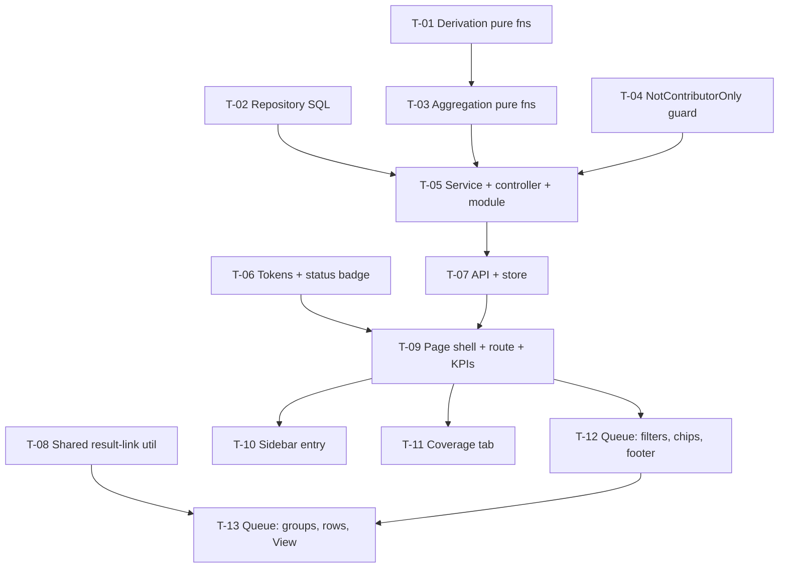

# Tasks — Bilateral / Pooled Funding Contribution Monitor

- **Module:** bilateral — server `pooled-funding-monitor` + STAR page
- **Spec id:** 2026-10-pooled-funding-monitor
- **Status:** not-started
- **Owner:** Daniela Pino / ARI
- **Linked requirements:** [./requirements.md](./requirements.md)
- **Linked design:** [./design.md](./design.md)
- **Approval Mode:** pre-approved (Daniela Pino, 2026-10-08 — "continue y sigue con la opción recomendada y para a preguntarme a menos que sea totalmente necesario o surja un error"). Routine gates auto-pass and are logged as `auto-approved (pre-approved mode)`; HALT, Pivot, budget tripwire, FATAL_FAIL, PRODUCT_BUG, destructive actions and RB-1 (local migrations) still stop for the owner
- **Spec gates:** requirements, design and tasks approved by the owner in session; final verification checklist `auto-approved (pre-approved mode)` 2026-10-08
- **Last updated:** 2026-10-08

---

## 0. Plan at a glance

| PR | Tasks | Content | ≈ LOC |
|---|---|---|---|
| **PR 1 — server** | T-01 … T-05 | Derivation, SQL, aggregation, guard, endpoints | ≈ 950 |
| **PR 2 — client** | T-06 … T-13 | Tokens, store, link util, page, sidebar, coverage tab, queue tab | ≈ 1,450 |

**13 tasks.** Budget in `design.md` §13 was raised from 12 to 13 when T-12 was split for size.

PR 2 depends on PR 1's endpoint contract (design §4). Client work can start against that contract, but its e2e checks need PR 1 deployed or running locally.

**Execution rules (root guide §4.3):**
- One task at a time per package.
- The Leader re-runs the full suite after each worker reports.
- Lint gate: `npx eslint <path>` (server) and `npm run lint -- --quiet` (client) — never `npm run lint` as a gate (K-001).

## 1. Dependency graph

---

## 2. Tasks

### T-01 — Pure derivation functions and enums (server)

- **Status:** todo · **Size:** M · **Dependencies:** none
- **Requirements covered:** R-PFM-004 (all 3 scenarios), R-PFM-009 (status-filter matching), R-PFM-010 (chip matching), R-PFM-012 (row rank), Glossary §2 (*Ready*, *Needs attention*, *Out of scope*)
- **Design refs:** §2.1 `derivation/pfm-derivation.ts`, `enum/`; §5 steps 3–4; DD-PFM-6, DD-PFM-7
- **Files:** `server/researchindicators/src/domain/entities/pooled-funding-monitor/derivation/pfm-derivation.ts` (+ `.spec.ts`), `enum/pfm-*.enum.ts`
- **Scope:**
  - STAR label from status id: 1/4 → Draft, 2 → Submitted, 3 → Under review, 6 → Approved, 5/7 → Returned, any other id → its own name.
  - PI line copy per R-PFM-004.
  - Mapping state + note.
  - SP line, including the empty and "Not reported to PRMS" variants.
  - PRMS status. **Synced without a history row → Pending Review.**
  - PRMS hint.
  - `isOutOfScope`, `isReady`, `needsAttention`.
  - `matchesStatusFilter` (7 options), `matchesChip` (7 chips), `rowRank`.
  - Date formats "dd Mon yyyy" and "dd Mon, HH:mm".
- **Tests:** table-driven, one row per rule. Fixtures **vary at least one discriminating field per row** (KZ-004).
- **Red-making inputs (K-012):** each must be named in the spec file.
  - status 7 must yield *Returned* (fails if mapped to Draft);
  - `is_synced_to_prms=1` with no history → *Pending Review* (fails if *Not sent*);
  - `has_contribution=0` with `mapping_complete=1` → *No SP contribution* and **not** `needsAttention`;
  - mapping *Complete* + status 2 → not `isReady`.
- **Done:**
  - [ ] `npm test -- --silent pfm-derivation` green.
  - [ ] Each named red input observed failing once against a deliberately wrong mapping, then restored (K-004).
  - [ ] `npx eslint` clean on new files.
- **Disqualifies:** a test that asserts the function was *called* rather than its returned value; fixtures where all rows share the same status.
- **Skills:** `nestjs-expert`, `tdd`

### T-02 — Repository: base monitored-results SQL, monthly series, filter options (server)

- **Status:** todo · **Size:** L · **Dependencies:** none
- **Requirements covered:**
  - R-PFM-003 — all scenarios: OICR excluded, non-primary, snapshots + "AND IT MUST not double-count", other platforms.
  - R-PFM-002 — "Default PI scope" data predicate.
  - R-PFM-004 — data sources.
  - R-PFM-008 — accepted syncs per month.
  - R-PFM-009 — filter options from data, SP grouping by `category`.
- **Design refs:** §3.1, §3.2, §2.3 reuse rows, DD-PFM-3, DD-PFM-5, DD-PFM-7, §8 SQL safety
- **Files:** `repositories/pooled-funding-monitor.repository.ts` (+ `.spec.ts`)
- **Scope:**
  - **Base query** per design §3.2: `platform_code='STAR'`, indicator ∈ {1,2,3,4,6}, current rows, primary active contract, `effectivePoolFundingContributorSql('ac')` (literal alias only), PI predicate for `mine`.
  - **Projected columns:**
    - `pool_funding_alignment_validation(r.result_id)`;
    - primary SP (DD-PFM-7) + category + color;
    - contributing SPs;
    - latest approval date from `submission_history` (to_status 6, `custom_date`, keyed by official code + year);
    - latest correlated, non-duplicate PRMS history status + justification;
    - snapshot years.
  - Monthly ACCEPTED counts for the last 6 months.
  - Count of all contributing projects.
  - All request values are bound parameters.
- **Tests:** run against a **real DB with seeded rows**, not a mocked query builder (KZ-017: SQL precedence is invisible to mocks). The seed must include each of these:
  - an OICR;
  - a TIP row;
  - a non-primary link;
  - a snapshot + current pair;
  - two PIs on different projects;
  - a delegate;
  - a NULL-role single SP;
  - a synced result with and without history.
- **Precondition:** the test DB has `result_prms_sync_history` (migration `1790086170692`). **Applying it to the local DB is a human decision (RB-1)** — the worker must stop and ask, not run `migration:execute`.
- **Done:**
  - [ ] Seeded counts equal an independent hand-written SQL count (quoted in `execution.md`).
  - [ ] A query for PI A never returns PI B's rows.
  - [ ] The TIP, OICR and non-primary rows are absent.
  - [ ] The snapshot pair yields 1 row.
- **Disqualifies:** if the PRMS-history branch ran against a DB without the table, report **inconclusive**, not pass. Asserting on generated SQL text instead of returned rows is also disqualified.
- **Skills:** `nestjs-expert`, `systematic-debugging`

### T-03 — Pure aggregation functions (server)

- **Status:** todo · **Size:** M · **Dependencies:** T-01
- **Requirements covered:**
  - R-PFM-005 — "Cards agree with the queue".
  - R-PFM-006 — exact partition + precedence + "AND IT MUST … sum exactly to the total".
  - R-PFM-007 — "Bars are proportional" (data), ordering by SP code, exclusions.
  - R-PFM-008 — six months incl. current, "Month without syncs" → explicit zero entries.
  - R-PFM-010 — "Chip counts follow filters": counts computed **before** the chip, groups **after**.
  - R-PFM-011 — group counts + sort (attention desc, code asc) + flag text.
  - R-PFM-015 — totals for the count line.
  - R-PFM-002 — `is_pi_of_any`.
  - NFR-PFM-006.
- **Design refs:** §2.1 `pfm-aggregation.ts`, §4 response shapes, §5 step 5, DD-PFM-1, DD-PFM-6
- **Files:** `derivation/pfm-aggregation.ts` (+ `.spec.ts`)
- **Tests:** a 12-row varied fixture; assert every stage value, the sum invariant, SP order, group order with a tie on attention, and zero-month entries.
- **Red-making inputs:**
  - a Complete + Submitted row must land in *Mapping not started* (DD-PFM-6);
  - a fixture whose stage sum ≠ total must fail the invariant test;
  - a chip applied before counting must change the counts and fail the test.
- **Done:**
  - [ ] Green.
  - [ ] The invariant test observed red with one stage rule deliberately broken.
- **Disqualifies:** recomputing expected values with the same function under test (tautology).
- **Skills:** `nestjs-expert`, `tdd`

### T-04 — `NotContributorOnlyGuard` (server)

- **Status:** todo · **Size:** S · **Dependencies:** none
- **Requirements covered:** R-PFM-001 "Contributor-only user" → "every monitor API endpoint answers 403"; NFR-PFM-001 (role part); DD-PFM-2
- **Design refs:** §2.1 `guards/`, §5 step 1, §8
- **Files:** `guards/not-contributor-only.guard.ts` (+ `.spec.ts`)
- **Behavior:**
  - Deny when `request.user` is missing, has no `sec_user_id` (machine token), has an empty role list, or **every** role is 3.
  - Allow otherwise, including role-1-only users and role 3 + 9.
- **Tests:** [3] → deny; [3, 9] → allow; [1] → allow; [] → deny; machine token → deny; [10] → allow.
- **Done:**
  - [ ] Green.
  - [ ] [3] → deny observed red when the check is flipped to `some`.
- **Disqualifies:** testing only allowed cases.
- **Skills:** `nestjs-expert`

### T-05 — Service, controller, module registration, Swagger, e2e (server)

- **Status:** todo · **Size:** L · **Dependencies:** T-02, T-03, T-04
- **Requirements covered:**
  - R-PFM-001 — 403 for contributor-only; "BUT it must NOT rely on the client alone"; "Unauthenticated" → 401.
  - R-PFM-002 — "Switching scope" server side; "AND IT MUST be one consistent dataset" (one derivation per request).
  - R-PFM-009 — "Filters combine with AND".
  - R-PFM-014 — server exposes GET only.
  - NFR-PFM-001, NFR-PFM-002, NFR-PFM-006.
  - §8 API surface delta.
- **Design refs:** §2.1, §4 (3 endpoints + 404 rule), §5, §8, §9, KZ-017
- **Files:** `pooled-funding-monitor.{module,controller,service}.ts` (+ specs), `dto/*`, **`entities/entities.module.ts`**, **`routes/main.routes.ts`**, `test/pooled-funding-monitor.e2e-spec.ts`
- **Scope:**
  - Wire the 3 handlers with Swagger (`@ApiTags`, `@ApiBearerAuth`, `@ApiOperation`, `@ApiQuery`).
  - Validate the enum query DTO.
  - The project-results endpoint returns 404 for a project outside scope.
  - `LoggerUtil` debug line.
- **e2e (boots the app, hits real URLs):**
  - `/api/pooled-funding-monitor/summary` → 200 for an allowed user, 403 for contributor-only, 401 without token.
  - PI isolation: PI A's summary excludes PI B's results.
  - Out-of-scope project → 404.
  - `/api/v1/...` → 404 (route is unversioned).
- **Timing (NFR-PFM-002):**
  - 5 runs per endpoint on the local DB, portfolio scope; record median and spread in `execution.md`.
  - **If the spread exceeds 50 % of the median, the number is not evidence** — report the spread instead of passing.
  - Local volume (≈156 rows) cannot show Prod behavior. Record that as a scope gap (KZ-017), not as a pass for Prod.
- **Done:**
  - [ ] Unit + e2e green.
  - [ ] Swagger lists the 3 endpoints.
  - [ ] The module appears in both registrations.
  - [ ] Timing table recorded.
- **Disqualifies:** an e2e that mocks the guard or the repository; a "route registered" claim checked by reading `main.routes.ts` instead of an HTTP call (KZ-017 precedent).
- **Skills:** `nestjs-expert`, `api-design-principles`, `error-handling-patterns`

### T-06 — Design tokens + `pfm-status-badge` (client)

- **Status:** todo · **Size:** S · **Dependencies:** none
- **Requirements covered:** NFR-PFM-003 (no hex, no new `.scss`), NFR-PFM-004 (contrast; non-color cue), R-PFM-004 rendering of STAR / mapping / PRMS values, R-PFM-012 PRMS "—" when Not sent
- **Design refs:** §6.2 token table, DD-PFM-8, DD-PFM-10, §2.2 `pfm-status-badge`
- **Files:** the **existing** global `--ac-*` token stylesheet under `client/research-indicators/src/styles/` (add `--ac-pfm-*` light + dark values); `components/pfm-status-badge/*` (+ spec)
- **Scope:**
  - Badge input: `kind` + `value` → Tailwind classes using `bg-[var(--ac-pfm-…)]`.
  - Each value renders a text label (status never conveyed by color alone).
  - SP badge takes a runtime color and derives its background with `color-mix`.
- **Done:**
  - [ ] Spec asserts the rendered label for every value.
  - [ ] `git diff --name-only --diff-filter=A | grep '\.scss$'` returns nothing.
  - [ ] No `#[0-9a-fA-F]{3,6}` in new component files (the token stylesheet is the only allowed place).
- **Disqualifies:** a contrast claim made from jsdom. jsdom cannot compute contrast, so contrast is verified at the HITL pause (see §3).
- **Skills:** `angular-developer`, `ui-ux-pro-max`

### T-07 — `ApiService` methods, interfaces, `PfmStore` (client)

- **Status:** todo · **Size:** M · **Dependencies:** T-05 (contract)
- **Requirements covered:**
  - R-PFM-002 — "Switching scope": keeps filters/tab, clears group cache.
  - R-PFM-009 — "Changing a filter clears the chip".
  - R-PFM-011 — "Lazy rows": fetch once per key.
  - R-PFM-014 — "No mutation reachable": the store issues GET only.
  - R-PFM-016 — per-section loading/error state, "One section fails".
- **Design refs:** §2.2 store, §6.4 rules, §4 shapes
- **Files:** `shared/services/api.service.ts` (`GET_PfmSummary`, `GET_PfmQueue`, `GET_PfmProjectResults`), `pages/.../pooled-funding-monitor/pfm.interfaces.ts`, `services/pfm-store.service.ts` (+ spec)
- **Tests:**
  - A summary error leaves queue data intact.
  - A scope change refetches both sections and empties `groupRows`.
  - A filter change sets chip `null`.
  - A second expand of the same group makes no new call.
  - `scope`/`tab` sync with query params.
- **Done:**
  - [ ] Green.
  - [ ] A grep shows no POST/PATCH/DELETE in the new files.
- **Disqualifies:** asserting only that `ApiService` was called, without checking the resulting signal values.
- **Skills:** `angular-developer`, `tdd`

### T-08 — Extract the Results Center result-link builder to a shared util (client)

- **Status:** done · **Size:** S · **Dependencies:** none
- **Requirements covered:** R-PFM-013 — "THEN the browser navigates to `result/{platform}-{official code}` … same link rule as the Results Center"
- **Design refs:** DD-PFM-9, §2.3
- **Files:** new `shared/utils/result-link.util.ts` (+ spec); `results-center-table.component.ts` (`getResultHref` / `getResultRouteArray` delegate to it)
- **Behavior-preserving refactor (K-019):**
  - Fixed input set: status 6 with snapshot years, status 6 without, status 4, a non-STAR platform.
  - Run the old and new implementations on it and require **zero divergences**.
  - The existing results-center specs must stay green unchanged.
- **Done:**
  - [x] Old-vs-new comparison table recorded.
  - [x] Results-center specs green.
- **Disqualifies:** results-center specs edited to pass.
- **Skills:** `angular-developer`

### T-09 — Page shell: route, client guard, header, scope toggle, KPI cards, tabs, PI-empty state (client)

- **Status:** todo · **Size:** M · **Dependencies:** T-06, T-07
- **Requirements covered:**
  - R-PFM-001 — "Contributor-only" → "navigating directly … redirects away"; "clicking it renders the page in the running app (no `NG04002`)".
  - R-PFM-002 — default *Only my results as PI*; "Viewer with no PI projects" + "BUT it must NOT show the portfolio data silently".
  - R-PFM-005 — the 4 cards, copy per scope.
  - R-PFM-014 — no *Sync now*, no "PRMS sync: today" label, only 2 tabs.
  - R-PFM-016 — loading skeletons; toggle and tabs stay usable.
  - NFR-PFM-004 — `aria-pressed` toggle, `tablist` keyboard nav.
  - DD-PFM-12 — flag gating.
- **Design refs:** §2.2 page, guard, route; §6.1 header and tabs rows; §6.3
- **Files:** `app.routes.ts`, `shared/guards/pooled-funding-monitor.guard.ts` (+ spec), `shared/services/cache/roles.service.ts` (`canAccessPooledFundingMonitor`), `pooled-funding-monitor.component.*`, `components/pfm-kpi-cards/*` (+ specs)
- **Tests:**
  - DOM text of the 4 KPI values from a fixture (KZ-001).
  - Empty-PI state shown when `is_pi_of_any=false` and no KPI values rendered under the PI label.
  - Guard redirects for roles `[3]` and allows `[3, 9]`.
  - Fixture arranges load → data, not the end state (KZ-015).
  - DOM contains no "Sync" button.
- **Manual (HITL):** open `/pooled-funding-contribution-monitor` in the running app. Quote what was observed (KZ-002).
- **Done:**
  - [ ] Specs green.
  - [ ] Running-app check quoted in `execution.md`.
- **Disqualifies:** a router-mocked spec offered as proof the route resolves (KZ-017).
- **Skills:** `angular-developer`, `ui-ux-pro-max`

### T-10 — Sidebar: monitor item under *My PI Delegates* (client)

- **Status:** todo · **Size:** S · **Dependencies:** T-09
- **Requirements covered:** R-PFM-001 — "Allowed viewer" (item next to *My PI Delegates*), "AND IT MUST appear even when the viewer cannot see *My PI Delegates*", "Contributor-only" → "nav item is NOT shown"; DD-PFM-11, DD-PFM-12
- **Design refs:** §2.2 sidebar row; §12 reversion challenge
- **Files:** `alliance-sidebar.component.{ts,html}` (+ spec)
- **Scope:**
  - `piOptions()` returns *My PI Delegates* when `canSeePiDelegates()`, then the monitor when `canAccessPooledFundingMonitor()` and the flag is on.
  - The section renders when `piOptions().length > 0`, in both the expanded and collapsed branches.
  - **Update** the existing spec that expects the section hidden when `has_access=false` to "hidden when no PI option is visible". Do not delete it.
- **Tests:**
  - (a) PI-delegate access + admin role → both items, monitor second.
  - (b) no PI-delegate access + admin role → section with the monitor only.
  - (c) contributor-only, no access → no section.
  - (d) flag off → monitor absent.
- **Done:**
  - [ ] Green.
  - [ ] Case (b) observed red before the change.
- **Disqualifies:** deleting or weakening the existing visibility test.
- **Skills:** `angular-developer`

### T-11 — Coverage tab: pipeline, SP coverage, sync activity (client)

- **Status:** todo · **Size:** M · **Dependencies:** T-09
- **Requirements covered:**
  - R-PFM-006 — 7 stage tiles + header figures; "BUT a stage with value 0 must NOT render a zero-width segment that steals keyboard focus".
  - R-PFM-007 — rows "{code} — {name}", "{synced} / {total}", scope-specific subtitle and legend, "Bars are proportional" (rendered widths).
  - R-PFM-008 — 6 bars, "Month without syncs" → zero-height bar with visible label, footer line.
  - R-PFM-016 — per-card skeleton and error + Retry.
- **Design refs:** §6.1 coverage rows, §6.3
- **Files:** `components/pfm-coverage-tab/*`, `pfm-pipeline-card/*`, `pfm-sp-coverage-card/*`, `pfm-sync-activity-card/*` (+ specs)
- **Tests:**
  - Stage values and labels in the DOM.
  - A zero stage renders no focusable segment.
  - A zero month still renders its label.
  - Copy switches with scope.
- **Known gap:** jsdom cannot measure rendered bar widths. The spec asserts the computed style value; actual proportion is checked visually at the HITL pause.
- **Done:**
  - [ ] Green.
  - [ ] The NFR-PFM-003 grep is clean.
- **Disqualifies:** asserting the bound style string as proof of visual proportion.
- **Skills:** `angular-developer`, `ui-ux-pro-max`

### T-12 — Queue tab: filters, Reset, quick-view chips, footer + legend, empty states (client)

- **Status:** todo · **Size:** M · **Dependencies:** T-09
- **Requirements covered:**
  - R-PFM-009 — 4 filters with data-driven options, SP options grouped by category, "Reset".
  - R-PFM-010 — 7 chips with counts; "Single selection": one active chip, color **and** non-color cue; groups without matches disappear.
  - R-PFM-015 — count line per scope + legend.
  - R-PFM-016 — "Empty (filters)" message + Reset.
  - R-PFM-014 — no year filter.
- **Design refs:** §6.1 filters and chips rows, §6.3, §6.4
- **Files:** `components/pfm-queue-tab/*` (+ spec)
- **Tests:**
  - Reset restores all 4 filters and the chip.
  - The selected chip has `aria-pressed="true"` and a non-color marker.
  - Chip counts rendered from the server `chip_counts`.
  - Count-line copy for both scopes.
  - Empty state when `groups=[]`.
  - No element labelled "year".
- **Done:**
  - [ ] Green.
  - [ ] The NFR-PFM-003 grep is clean.
- **Disqualifies:** a client recomputing chip counts (violates NFR-PFM-006). The test must fail if the component derives counts itself.
- **Skills:** `angular-developer`, `ui-ux-pro-max`

### T-13 — Queue tab: project groups, result rows, View (client)

- **Status:** todo · **Size:** M · **Dependencies:** T-08, T-12
- **Requirements covered:**
  - R-PFM-011 — collapsed by default; header contents (code, name, "Lead PI: … · donor", count, stacked bar with per-segment `title`, attention / "All clear" flag); "Expand and collapse" via click, Enter or Space with `aria-expanded`, other groups keep state; "Lazy rows" with loading skeleton.
  - R-PFM-012 — columns and order as received from the server; PRMS "—" + tooltip.
  - R-PFM-013 — "View": navigates via the T-08 util; "BUT it must NOT open a drawer, modal or side panel"; "AND View is shown on every row"; the title is a link to the same place.
  - R-PFM-004 — "Rejected in PRMS" tooltip rendered.
  - R-PFM-014 — no row action other than View.
  - NFR-PFM-005 — horizontal scroll inside the card.
- **Design refs:** §6.1 group and row rows, §6.4, DD-PFM-9
- **Files:** `components/pfm-project-group/*`, `components/pfm-result-row/*` (+ specs)
- **Tests:**
  - The group starts collapsed.
  - Enter toggles `aria-expanded`.
  - Expanding shows skeleton → rows.
  - The View `href` equals `result/STAR-<code>` (+ `?version=` for approved-with-snapshot).
  - Every row has View, including out-of-scope and mapping-incomplete fixtures.
  - No element with text "Sync", "Request approval" or "Complete mapping".
  - No dialog or drawer element opens on click.
- **Manual (HITL), quoted (KZ-002):**
  - Click View in the running app and confirm the result page opens (KZ-017).
  - Compare the whole page side by side with `mockup/pooled-funding-contribution-monitor.html` at ≥ 1280 px and 1024 px, in light and dark mode.
- **Done:**
  - [ ] Green.
  - [ ] HITL observations quoted in `execution.md`.
- **Disqualifies:** a router-mocked `href` check offered as proof that navigation works.
- **Skills:** `angular-developer`, `ui-ux-pro-max`

---

## 3. Coverage closure (scenario / clause → task)

| Requirement · scenario / clause | Owner |
|---|---|
| R-001 Allowed viewer — item next to My PI Delegates | T-10 |
| R-001 — AND IT MUST appear without PI-delegate access | T-10 |
| R-001 — route renders in running app (KZ-017) | T-09 (HITL) |
| R-001 Contributor-only — nav hidden | T-10 |
| R-001 Contributor-only — direct URL redirects | T-09 |
| R-001 Contributor-only — API 403 | T-04, T-05 |
| R-001 — BUT must NOT rely on client alone | T-05 (e2e) |
| R-001 Unauthenticated — 401 | T-05 |
| R-002 Default PI scope (data) | T-02, T-05 |
| R-002 Default PI scope (default selection) | T-09 |
| R-002 Switching — recompute, keep filters/tab | T-07 |
| R-002 — AND IT MUST one consistent dataset | T-05 (server), T-07 (cache clear) |
| R-002 No PI projects — empty state + switch control | T-03 (`is_pi_of_any`), T-09 |
| R-002 — BUT must NOT show portfolio data silently | T-09 |
| R-003 OICR / non-primary / snapshots / other platforms / no double count | T-02 |
| R-004 Approved+complete+never sent · Out of scope · Rejected | T-01 |
| R-004 Rejected tooltip rendered | T-13 |
| R-005 Cards + Cards agree with queue | T-03, T-09 |
| R-006 Partition + precedence + AND IT MUST sum | T-03 |
| R-006 BUT zero-width segment must NOT take focus | T-11 |
| R-007 Proportional bars (data, render) | T-03, T-11 |
| R-008 Six months, zero month | T-03, T-11 |
| R-009 Filters combine with AND | T-01, T-05 |
| R-009 Reset | T-12 |
| R-009 Changing a filter clears the chip | T-07 |
| R-010 Chip counts follow filters | T-03 |
| R-010 Single selection + non-color cue | T-12 |
| R-011 Group header, ordering | T-03, T-13 |
| R-011 Expand/collapse + aria | T-13 |
| R-011 Lazy rows | T-07, T-13 |
| R-012 Columns and row order | T-01 (rank), T-13 |
| R-013 View navigates (link rule) | T-08, T-13 |
| R-013 BUT must NOT open a drawer | T-13 |
| R-013 AND View on every row | T-13 |
| R-014 Removed elements absent | T-09, T-12, T-13 |
| R-014 GET only | T-05, T-07 |
| R-015 Footer | T-03, T-12 |
| R-016 Loading / empty / error / one section fails | T-07, T-09, T-11, T-12 |
| NFR-001 Security | T-04, T-05 |
| NFR-002 Performance | T-05 |
| NFR-003 Tailwind / tokens / no `.scss` | T-06 + grep in T-11, T-12 |
| NFR-004 a11y | T-06, T-09, T-12, T-13 + HITL contrast |
| NFR-005 Responsive | T-13 (HITL) |
| NFR-006 Consistency | T-03, T-05, T-12 |

**Accepted gaps (no automated gate):** visual fidelity to the mockup, rendered bar proportions, dark-mode contrast and Prod-volume performance. These are covered by the T-13 HITL review (optionally a T6 multimodal screenshot review) and recorded as a scope gap in T-05.

## 4. Risks & blockers log

| # | Date | Risk / Blocker | Mitigation | Owner | Status |
|---|---|---|---|---|---|
| RB-1 | 2026-10-08 | Local DB lacks migrations `1790086170692`, `1791213000000`, `1791214000000` → `result_prms_sync_history` absent; T-02/T-05 PRMS branch cannot run locally | Owner decides whether to run `npm run migration:execute` locally. Until then, report the PRMS branch as **inconclusive** | Daniela Pino | open |
| RB-2 | 2026-10-08 | Local data has zero PRMS activity, so the page will show every result as *Not sent* | Expected. Seeded fixtures cover PRMS states | — | open |

## 5. Done definition

- [ ] T-01 … T-13 done, with evidence in `execution.md`.
- [ ] **A human has used the page in the running app before `/akili-validate`** (KZ-007): both scopes, both tabs, every chip, one View click, light and dark.
- [ ] Swagger lists the 3 endpoints.
- [ ] Server `npm test -- --silent` and `npm run test:e2e` green; client `npm test -- --silent` green; coverage floors held.
- [ ] No new `.scss` file; no hex in new components.
