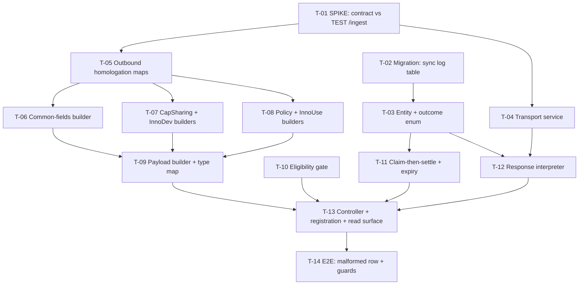

# Tasks — Bilateral / PRMS Sync Engine

- **Module:** `bilateral` → `prms-sync`
- **Spec id:** `2026-09-prms-sync-engine`
- **Status:** `in-progress` — T-01…T-11 done (2026-09-15); T-12 next
- **Owner:** ARI / David Casañas
- **Linked requirements:** [`./requirements.md`](./requirements.md)
- **Linked design:** [`./design.md`](./design.md) · **Field mapping:** [`./homologation.md`](./homologation.md) · **Review:** [`./judgment.md`](./judgment.md)
- **Budget (design §13):** 14 tasks · ≈ 2 000 LOC · 2 review rounds — a **tripwire**, not a cap. Exceeding it stops execution and escalates.
- **Last updated:** `2026-09-14`

---

## 1. Dependency graph

**Parallel-safe after T-01 and T-02:** the `{T-04}`, `{T-05 → T-06/07/08}` and `{T-03 → T-11/T-12}`
lanes touch disjoint files. All are in the **same package**, so root guide §4.3 still forbids two
concurrent *full-suite* runs — workers verify their own scope, the Leader re-measures after each.

---

## 2. Clause-level coverage map

> **ID-level presence is not closure.** Every scenario and every `AND IT MUST` / `BUT it must NOT`
> clause is owned by a named task. A gap may **never** be discharged by citing a different
> requirement.

| Requirement | Scenario / clause | Task |
|---|---|---|
| R-PRMS-001 | Sc. *Approved, aligned, pool-funding contract* | T-10 |
| R-PRMS-001 | ↳ AND IT MUST *record exactly one sync-log row* | T-11 |
| R-PRMS-001 | ↳ BUT it must NOT *flip `is_synced_to_prms` unless PRMS accepted* | T-12 |
| R-PRMS-001 | Sc. *Contract is not a pool-funding contributor* | T-10 |
| R-PRMS-001 | ↳ AND IT MUST *make no outbound HTTP call* | T-10 |
| R-PRMS-001 | ↳ BUT it must NOT *write `is_synced_to_prms` / `prms_result_code`* | T-10 |
| R-PRMS-001 | AC.1–AC.4 | T-10, T-13 |
| R-PRMS-002 | Sc. *A gated type is refused but its payload still builds* | T-10 (refusal) + T-09 (build) |
| R-PRMS-002 | ↳ AND IT MUST *still be possible to build that payload* | T-09 |
| R-PRMS-002 | ↳ BUT it must NOT *issue any outbound HTTP call* | T-10 |
| R-PRMS-002 | AC.1–AC.3 | T-09, T-10 |
| R-PRMS-003 | Sc. *Geographic scope conditionals* + both clauses | T-06 |
| R-PRMS-003 | AC.1, AC.2 (`ExCIAT`→46 **and** `ExBIO`→49), AC.3, AC.4 | T-06 |
| R-PRMS-004 | AC.1–AC.3 | T-07 |
| R-PRMS-005 | AC.1–AC.3 | T-07 |
| R-PRMS-006 | Sc. *Policy type 1 is gated, the other two send* | T-08 (build) + T-10 (gate) |
| R-PRMS-006 | ↳ AND IT MUST *refuse PRMS type 1 with a reason naming the missing fields* | T-10 |
| R-PRMS-006 | ↳ BUT it must NOT *send `status_amount`/`amount` on the two that succeed* | T-08 |
| R-PRMS-007 | AC.1–AC.5 | T-08 |
| R-PRMS-008 | Sc. *A missing mandatory field refuses rather than defaults* + both clauses | T-06 |
| R-PRMS-008 | AC.1 (named fields absent), AC.2 (arithmetic permitted) | T-06, T-07, T-08 |
| R-PRMS-009 | AC.1–AC.4 | T-04 |
| R-PRMS-010 | AC.1–AC.3 | T-04 |
| R-PRMS-011 | Sc. *HTTP 207 with a failed row* | T-12 |
| R-PRMS-011 | ↳ AND IT MUST *leave `is_synced_to_prms = false`* | T-12 |
| R-PRMS-011 | ↳ AND IT MUST *leave the alignment PATCH writable (no 409)* | T-14 |
| R-PRMS-011 | ↳ BUT it must NOT *report success because the status was 2xx* | T-12 |
| R-PRMS-011 | AC.1–AC.5 | T-12 |
| R-PRMS-012 | AC.1–AC.4 | T-03, T-11 |
| R-PRMS-013 | AC.1, AC.2 (concurrency), AC.3 (expiry actor), AC.4 (late settle), AC.5 (attention `409`) | T-11 |
| R-PRMS-014 | AC.1, AC.2 | T-13 |
| NFR-001 | Env routing | T-04 |
| NFR-002 | Credential hygiene | T-04, T-11 |
| NFR-003 | Observability incl. late-settle + expiry `_warn` | T-11, T-12 |
| NFR-004 | Distinguishable outcomes | T-12, T-13 |
| NFR-005 | Coverage | every task |
| **R-4** | Residual-risk runbook note | T-11 |

---

## 3. Tasks

### T-01 — SPIKE: validate the contract against the TEST Normalizer  ✅ `[x]` DONE

- **Requirements covered:** OQ-5 and OQ-6 **closed**; OQ-1's failure premise **falsified** (composition still unproven) and OQ-2 answered at the **schema layer only** (persistence still open) — both carried forward explicitly. Gates every field claim downstream
- **Files touched:** none in `src/`. Evidence committed under `docs/specs/bilateral/prms-sync/sync-engine/spike/`
- **Description:** POST one **hand-written** payload per supported type to the TEST `/ingest` with the `app_config` key. Hand-written on purpose: the spike must test **the contract**, not our builders — building first would prove only that we are self-consistent.
- **Implementation notes:**
  - Key: `AppConfigService.getEnv(AppConfigKey.ARI_CLARISA_API_KEY).simple_value` (present in TEST).
  - Record the **verbatim** response body for every call, `requestId` included.
  - Probe specifically: `grant_title` composition (OQ-1), `innovation_readiness_level` as `id`/`name` vs `level` (OQ-2), `geo_focus.scope_code = 50` (OQ-5), where a PRMS result code appears (OQ-6).
- **Done check:**
  - [x] One verbatim response per type, committed, each showing its `requestId`
  - [x] Each of OQ-1, OQ-2, OQ-5, OQ-6 answered **with the response text that answers it quoted**, or explicitly recorded as still open
  - [x] `homologation.md` updated where the spike contradicts it
- **Failing input:** a payload with a deliberately wrong `grant_title` — if PRMS accepts it, OQ-1's premise (that PRMS resolves the title) is false and the finding is that, not a green.
- **Disqualifies the evidence:** a paraphrased response. A summary cannot show whether the code arrived. **If the TEST host is unreachable, the task is BLOCKED — not passed with mocks.**
- **Effort:** M · **Depends on:** — · **Skills:** `api-design-principles`

---

### T-02 — Migration: `result_prms_sync_log`  ✅ `[x]` DONE

- **Requirements covered:** R-PRMS-012 (schema)
- **Files touched:** `src/db/migrations/<timestamp>-createResultPrmsSyncLogTable.ts`
- **Description:** Append-only table per design §3, following `1787068132517-createResultInnovationUse.ts` — `utf8mb4` / `utf8mb4_unicode_520_ci`, audit columns written inline, FKs as separate `ALTER TABLE`.
- **Implementation notes:**
  - ⚠️ **No bare `?` or `:word` in the SQL *or in its comments*** when no params are passed (child guide §7, K-006).
  - Indexes `idx_result_prms_sync_log_result` and `idx_result_prms_sync_log_request_id`.
  - Spec goes in `db/migration-specs/`, **never** beside the migration (child guide §9).
- **Done check:**
  - [x] `npm run migration:dev:execute` against a scratch schema runs **forward clean**
  - [x] `npm run migration:revert` reverts clean
  - [x] Column set and nullability match design §3 exactly, `UNKNOWN`'s three-NULL case included
- **Failing input:** add a `?` inside a SQL comment and re-run — it must fail with `Named query contains placeholders…`. That proves the gate can go red (K-004).
- **Disqualifies the evidence:** compiling, linting or type-checking. **DC-9 is closed only by a run** — migration `1784500000000` shipped unrunnable past every static gate this repo has.
- **Effort:** S · **Depends on:** — · **Skills:** `nestjs-expert`

---

### T-03 — Entity + outcome enum  ✅ `[x]` DONE

- **Requirements covered:** R-PRMS-012 AC.2, AC.3
- **Files touched:** `entities/result-prms-sync/entities/result-prms-sync-log.entity.ts`, `tools/prms-normalizer/enum/prms-sync-outcome.enum.ts` (+ specs)
- **Description:** TypeORM entity extending `AuditableEntity`; the outcome vocabulary as a **varchar-backed** enum so a future PRMS verdict needs no schema change.
- **Done check:**
  - [x] Entity columns match the migration one-for-one
  - [x] Vocabulary holds exactly: `IN_FLIGHT`, `ACCEPTED`, `REJECTED_BY_PRMS`, `AUTH_FAILED`, `RETRYABLE`, `TRANSPORT_FAILED`, `UNKNOWN`, `REFUSED_BY_STAR`
  - [x] A test adds a hypothetical `APPROVED_BY_SP` value and compiles **without a migration** (proves R-PRMS-012 AC.3's extensibility claim behaviourally, not by assertion)
- **Disqualifies the evidence:** asserting the enum's member list. That is a presence-assertion — it proves the names exist, not that adding one needs no schema change.
- **Effort:** S · **Depends on:** T-02 · **Skills:** `nestjs-expert`

---

### T-04 — Transport service + environment routing  ✅ `[x]` DONE

- **Requirements covered:** R-PRMS-009 AC.1–4, R-PRMS-010 AC.1–3, NFR-001, NFR-002
- **Files touched:** `tools/prms-normalizer/prms-normalizer.{module,service}.ts`, `tools/prms-normalizer/dto/`, `shared/utils/app-config.util.ts` (host var), `.env.example` (+ specs)
- **Description:** One Nest service extending `BaseApi`. Sends the envelope, returns a parsed response or `null`. **No DB access, no business rules.**
- **Implementation notes:**
  - ⚠️ **The config must spread `_defaultConfig` and re-spread its `headers`** before layering `validateStatus: () => true`. A bare override replaces the whole default and drops `auth`, `Authorization`, `customHeaders` and the legacy-SSL `httpsAgent` (design §2.3 / §2.5). This is the single sharpest line in the task list.
  - Key read **per request**, never in the constructor (DD-6).
  - Host from one `ARI_*` var per environment; **no hardcoded default** — unset fails loudly.
- **Done check:**
  - [x] A `401`, a `422` **with its `rejected[]` body**, and a `503` each arrive intact — not `null`
  - [x] `null` occurs only for a network error or the 30 s timeout
  - [x] The outgoing request carries the `Authorization`/`auth`/`httpsAgent` that `_defaultConfig` provides — asserted **on the config actually passed to `httpService.post`**, not on our own builder
  - [x] The key appears in no log line (NFR-002)
  - [x] With the TEST host configured, no PROD URL is constructible
- **Failing input:** pass a bare `{ validateStatus: () => true }` — the `Authorization`-header assertion must go red. If it stays green, that assertion is not testing what it claims.
- **Disqualifies the evidence:** ⚠️ the env-routing check **verifies config resolution, not deployment correctness** (DC-7, accepted risk). Say so in the spec file; a test that implies otherwise overclaims.
- **Effort:** M · **Depends on:** T-01 · **Skills:** `nestjs-expert`, `error-handling-patterns`

---

### T-05 — Outbound homologation maps  ✅ `[x]` DONE

- **Requirements covered:** R-PRMS-002 AC.1, R-PRMS-004 AC.1–2, R-PRMS-006
- **Files touched:** `tools/prms-normalizer/homologation/{indicator-type,length-training,center}.homologation.ts` (+ specs)
- **Description:** The three outbound maps. Per homologation §12, **six of ten inbound artefacts are reusable and four are not.**
- **Implementation notes:**
  - `indicator-type` is a **new artefact, not an inversion** — the inbound map's PRMS side is the numeric `ResultTypeEnum`; the Normalizer takes strings (§12.3). Must be **total** over STAR's six indicators.
  - `length-training` combines `degree_id` and `session_length_id`; `DegreeHomologation` is **not injective** (`Master` and `MSc` both → `MSC`) so the inverse is resolved by the target vocabulary (§12.2).
  - `center` map: `ExCIAT` → `46`, `ExBIO` → `49`, reusing `AcronymExContractEnum` with its `.toUpperCase().trim()` (§1.3).
- **Done check:**
  - [x] Indicator map total over all six `IndicatorsEnum` members, no `undefined` branch
  - [x] `PHD → "PhD"`, `MSC → "Master"`, `BSC`/`OTHER` → the session term, both session terms covered
  - [x] **Both** `ExCIAT` and `ExBIO` asserted (R-PRMS-003 AC.2 — one value fails the AC)
- **Failing input:** add a seventh member to `IndicatorsEnum` in a test fixture — the totality check must go red.
- **Disqualifies the evidence:** a test that inverts `indicator.homologation.ts` at runtime. It would pass and encode the wrong vocabulary.
- **Effort:** S · **Depends on:** T-01 · **Skills:** `nestjs-expert`

---

### T-06 — Common-fields builder  ✅ `[x]` DONE

- **Requirements covered:** R-PRMS-003 (all ACs + scenario), R-PRMS-008 (scenario + AC.1–2)
- **Files touched:** `tools/prms-normalizer/builders/common-fields.builder.ts`, repositories for the aggregate read (+ specs)
- **Description:** The `data` block shared by every type — homologation §4, field for field.
- **Implementation notes:**
  - **P-1:** a missing mandatory field **throws**, naming the field. Never substitutes the creator, the PI, or anything else.
  - Geo conditionals pre-checked (scope 3 needs ≥ 2 countries).
  - A legacy alignment with no `PRIMARY` SP row is refused, not sent with a missing `toc_mapping`.
- **Done check:**
  - [x] Serialized JSON matches homologation §4 for one fixture per type, expected values **transcribed from the document**
  - [x] `number_people_trained.unknown`, `innovation_developers`, `result_indicator_type_name` absent (P-1)
  - [x] `women` = `women_youth_count + women_not_youth_count` — arithmetic over entered values is permitted and covered
  - [x] `is_partner_not_applicable = true` omits the array rather than sending `[]`
- **Failing input:** a fixture whose main contact is absent — the build must throw naming `lead_contact_person`, not emit a partial object.
- **Disqualifies the evidence:** an expected value copied from the builder's own output. That proves self-consistency, not correctness.
- **Effort:** L · **Depends on:** T-05 · **Skills:** `nestjs-expert`, `tdd`

---

### T-07 — Capacity Sharing + Innovation Development builders  ✅ `[x]` DONE

- **Requirements covered:** R-PRMS-004 AC.1–3, R-PRMS-005 AC.1–3
- **Files touched:** `builders/{capacity-sharing,innovation-development}.builder.ts` (+ specs)
- **Done check:**
  - [x] `length_training` correct for PhD, MSc, BSc, Other × both session terms
  - [x] `delivery_method` correct for all three modalities
  - [x] Readiness level uses the shape **T-01 proved** (OQ-2), and the spec file records which
  - [x] `unknown` and `innovation_developers` absent from every built payload
- **Failing input:** a BSc + Long-term fixture — it must fall through to `"Long-term"`, and the spec must record that this makes it indistinguishable from a non-degree long course in PRMS.
- **Disqualifies the evidence:** asserting the readiness shape before T-01 ran. It would encode a guess.
- **Effort:** M · **Depends on:** T-05, T-06 · **Skills:** `nestjs-expert`, `tdd`

---

### T-08 — Policy Change + Innovation Use builders  ✅ `[x]` DONE

- **Requirements covered:** R-PRMS-006 (scenario + both clauses), R-PRMS-007 AC.1–5
- **Files touched:** `builders/{policy-change,innovation-use}.builder.ts` (+ specs)
- **Description:** The two hardest builders. Innovation Use is **fully built although gated** (family R-F6).
- **Implementation notes:**
  - Policy `type`/`stage` sent by **`name`** (DD-7 — PRMS-internal ids ≠ CLARISA ids).
  - `innovation_use_level` sends **`level`**, never `id` — `id = 2` is `level = 1` (DD-10).
  - Role filters, by **enum, never a literal**: actors `ActorRolesEnum.INNOVATION_USE (2)`, institution types `InstitutionTypeRoleEnum.INNOVATION_USE (2)`, quantifications `QuantificationRolesEnum.INNOVATION_USE (3)` — three different numbers for one concept (§12.5).
  - `sex_and_age_disaggregation` is a **pass-through** of `sex_age_disaggregation_not_apply`. ⚠️ **Never cite `prms.opensearch.service.ts:564`** — it negates the same-named field on a different PRMS surface (R-F7).
- **Done check:**
  - [x] `level` asserted against the **seeded** `clarisa_innovation_use_levels`, not a fixture constant
  - [x] **Both** disaggregation modes asserted on serialized JSON, expected values taken from the contract
  - [x] A fixture carrying **both** Innovation Dev and Innovation Use rows yields a payload with **none** of the Dev rows (DC-4)
  - [x] Non-type-`1` policy payloads contain **no** `status_amount`/`amount` key at all
  - [x] `usd_budget`, `is_determined`, `innov_use_to_be_determined` absent (P-1)
- **Failing input:** feed a level whose `id` and `level` differ (e.g. `id = 3`, `level = 2`) — an implementation sending the id must go red. A fixture where they coincide cannot fail.
- **Disqualifies the evidence:** covering one disaggregation mode. Both values are valid booleans, so a single-mode test passes under an inverted implementation.
- **Effort:** L · **Depends on:** T-05, T-06 · **Skills:** `nestjs-expert`, `tdd`
- **Risk:** highest-defect-density task in the spec — the id/level off-by-one and the disaggregation orientation are both silent when wrong.

---

### T-09 — Payload builder, envelope, and the type map  ✅ `[x]` DONE

- **Requirements covered:** R-PRMS-002 AC.1–3 (+ scenario's *AND IT MUST build*)
- **Files touched:** `builders/payload.builder.ts` (+ spec)
- **Done check:**
  - [x] Envelope constants exactly `"prms.result-management.api"` / `"dataset.ingest.requested"`
  - [x] All four builders reachable **including the gated two** — a test builds an Innovation Use and a policy-type-`1` payload directly
  - [x] `indicator_id` of `3` or `5` raises an unmappable error, not `undefined`
- **Failing input:** an `indicator_id` outside 1–6 — must raise, not silently emit an envelope with `type: undefined`.
- **Disqualifies the evidence:** testing only the two ungated types. That would let the gated builders rot until the PO meeting, defeating R-F6.
- **Effort:** S · **Depends on:** T-06, T-07, T-08 · **Skills:** `nestjs-expert`

---

### T-10 — Eligibility gate  ✅ `[x]` DONE

- **Requirements covered:** R-PRMS-001 (both scenarios + all clauses, AC.1–4), R-PRMS-002 AC.2–3, R-PRMS-006 *AND IT MUST refuse type 1*
- **Files touched:** `entities/result-prms-sync/eligibility/sync-gate.ts` (+ spec)
- **Description:** The ordered, enumerated list of design §5.1 — **data, not scattered conditionals**.
- **Done check:**
  - [x] All eight entries evaluated in order, first failure returned
  - [x] Each refusal carries a **distinct** `description` — a shared generic message fails R-PRMS-001 AC.2
  - [x] Every refusal asserts the transport spy was **not** called
  - [x] Removing one list entry in a test makes that type send **with no builder change** (proves QA-5 / R-F6 behaviourally)
- **Failing input:** a result that is Approved and aligned but whose primary contract has `is_pool_funding_contributor = false` — it must be refused naming the contract.
- **Disqualifies the evidence:** asserting that the list *contains* eight entries. That is a presence-assertion; it proves neither order nor effect.
- **Effort:** M · **Depends on:** — · **Skills:** `nestjs-expert`, `api-design-principles`

---

### T-11 — Claim-then-settle, expiry, and persistence  ✅ `[x]` DONE

- **Requirements covered:** R-PRMS-012 AC.1–4, R-PRMS-013 AC.1–5, NFR-002, NFR-003, risk **R-4**
- **Files touched:** `result-prms-sync.service.ts` (claim/settle), repositories (+ specs)
- **Description:** Design §5.1b. Two short transactions with the log row as the claim token; the send happens **outside** any transaction.
- **Implementation notes:**
  - Claim branches on four cases (design §5.1b step 1) inside **one** `SELECT … FOR UPDATE`.
  - An **aged** `IN_FLIGHT` is expired to `UNKNOWN` and then **refused `409`** — it does **not** go on to claim (DD-16).
  - The `409` on expiry carries an **attention-required** reason (AC.5) — it is the only control on risk **R-4**.
  - Settle is **conditional on the row still being `IN_FLIGHT`**; a late settle writes nothing and logs `_warn` (AC.4, NFR-003).
  - Redact the API key **before** the row is written, never at read time.
- **Done check:**
  - [x] Two syncs issued **before either settles** produce exactly one outbound POST, one `ACCEPTED` row, one `409` (R-PRMS-013 AC.2 / DC-11)
  - [x] An aged `IN_FLIGHT` is expired to `UNKNOWN` **by the next attempt**, which then refuses — and does not claim
  - [x] A settle arriving after expiry writes nothing and logs `_warn`
  - [x] The expiry `409`'s text names the unconfirmed attempt; a generic message fails AC.5
  - [x] `request_payload` contains no key material
- **Failing input:** issue the second sync **after** the first settles — it must produce the *already-synced* `409`, not the collision one. If both paths return the same thing, the collision branch is untested.
- **Disqualifies the evidence:** ⚠️ **a sequential two-call test does not exercise DC-11.** If the harness cannot issue genuinely concurrent calls, say so and record DC-11 as uncovered — do **not** let a sequential test stand in for it.
- **Effort:** L · **Depends on:** T-03 · **Skills:** `nestjs-expert`, `error-handling-patterns`, `tdd`

---

### T-12 — Response interpreter (the 207 rule)

- **Requirements covered:** R-PRMS-011 (scenario + all clauses, AC.1–5), NFR-003, NFR-004
- **Files touched:** `tools/prms-normalizer/` response parser + `result-prms-sync.service.ts` settle path (+ specs)
- **Description:** Map the transport's tri-state onto the outcome vocabulary. **The spec's load-bearing logic.**
- **Implementation notes:**
  - Our row is located by **`external_reference`**, never by array index (DD-8).
  - `null` → `TRANSPORT_FAILED`; `401` → `AUTH_FAILED` (non-retryable); `503` → `RETRYABLE`; `422` → `REJECTED_BY_PRMS` with `rejected[]`; `2xx` → per-row.
  - `is_synced_to_prms` and `prms_result_code` flip **only** on `ACCEPTED`, same transaction.
- **Done check:**
  - [ ] A **207 whose row failed** leaves `is_synced_to_prms = false` and records `FAILED` with the verbatim body
  - [ ] `requestId` persisted on every branch, success or failure
  - [ ] A response whose `results[]` order differs from the request still resolves our row correctly
  - [ ] When no PRMS result code is present, the row records that fact — not a silent NULL
- **Failing input:** a 207 whose `results[]` contains **two** rows with ours **second** and failed. An index-based implementation reads the first row, sees success, and flips the flag — the assertion must go red.
- **Disqualifies the evidence:** ⚠️ **a mocked 207 does not close DC-3.** It tests our parser against our own assumption of the shape. DC-3 closes only in T-14, against the live TEST endpoint.
- **Effort:** M · **Depends on:** T-03, T-04 · **Skills:** `error-handling-patterns`, `tdd`

---

### T-13 — Controller, module registration, read surface

- **Requirements covered:** R-PRMS-001 AC.1–2, R-PRMS-014 AC.1–2, NFR-004
- **Files touched:** `result-prms-sync.controller.ts`, `result-prms-sync.module.ts`, `domain/routes/main.routes.ts`, `domain/entities/entities.module.ts` (+ specs)
- **Description:** The HTTP edge and the `GET` read surface for children 2–4.
- **Implementation notes:**
  - `@Roles(CONTRIBUTOR, CENTER_ADMIN, SYSTEM_ADMIN)` + `@ResultOwner()` + `@UseGuards(RolesGuard, ResultOwnerGuard)` — the Bilateral precedent (DD-11). **Never `ResultStatusGuard`** (DD-11b).
  - Route node `` { path: `${RESULT_CODE}/prms-sync`, module: ResultPrmsSyncModule } `` in `ResultsChildren`.
  - ⚠️ **Registration is two steps.** A route node alone returns `404` on every handler, with no boot error (child guide §4).
  - Swagger: `@ApiTags`, `@ApiBearerAuth`, `@ApiOperation` required.
- **Done check:**
  - [ ] `expect(Reflect.getMetadata('imports', EntitiesModule)).toContain(ResultPrmsSyncModule)` — the falsifiable module-graph assertion, not a route-array shape check
  - [ ] Both endpoints appear at `/swagger` with the bearer lock
  - [ ] `GET` never returns `request_payload`
  - [ ] Each error status carries a distinct `description` (NFR-004)
- **Failing input:** remove the `entities.module.ts` import but keep the route node — the metadata assertion must go red. A mocked-provider controller spec stays green through this, which is exactly why it is not the gate.
- **Disqualifies the evidence:** a controller unit spec with mocked providers. It cannot see a missing registration — this shipped twice in one spec over four `404` endpoints.
- **Effort:** M · **Depends on:** T-09, T-10, T-11, T-12 · **Skills:** `nestjs-expert`, `api-design-principles`

---

### T-14 — E2E: the malformed-row proof and the guard matrix

- **Requirements covered:** **DC-3**, R-PRMS-011 *AND IT MUST leave the alignment writable*, R-PRMS-001 AC.3, NFR-005
- **Files touched:** `test/prms-sync.e2e-spec.ts`
- **Description:** Two things no unit test can do.
- **Implementation notes:**
  - **The malformed-row case runs against the live TEST Normalizer**, with a deliberately bad evidence link — the 2026-08 rules reject it, and PRMS returns it as a failed row inside a **207**.
  - The guard matrix: allowed (`CONTRIBUTOR` on the result) and denied (**a plain `CONTRIBUTOR` not on the result** — ⚠️ *not* a `CENTER_ADMIN`, who short-circuits past the ownership check at `result-owner.guard.ts:26-31`).
- **Done check:**
  - [ ] The malformed row leaves `is_synced_to_prms = false`, records `REJECTED_BY_PRMS`, and the alignment PATCH still returns non-409
  - [ ] Allowed and denied guard cases both pass, denied using a non-owner `CONTRIBUTOR`
  - [ ] `indicator_id` 3, 5, 6 and PRMS policy type `1` each refused with their own reason
  - [ ] Full suite green: `npm test -- --silent`
- **Failing input:** point the malformed-row test at a **valid** link — it must go green-path and the DC-3 assertion must fail. A test that passes either way proves nothing.
- **Disqualifies the evidence:** ⚠️ **substituting a mocked 207.** That converts the only DC-3 gate into a restatement of our own assumption. If TEST is unreachable, the task is **BLOCKED** — and DC-3 is recorded as uncovered rather than quietly closed.
- **Effort:** M · **Depends on:** T-13 · **Skills:** `nestjs-expert`, `systematic-debugging`

---

## 4. Testing expectations

- Sibling `*.spec.ts` for every service, builder, gate, guard-adjacent unit and controller touched; migration spec in `db/migration-specs/`.
- Global coverage threshold **60 %** holds.
- Mock strategy: `HttpService` substituted at the module boundary. **No mocked 207 is ever DC-3 evidence.**
- **Fixture discipline (KZ-004/FP-48):** vary at least one discriminating field per unit. A fixture whose N units share identical defaults cannot distinguish per-unit scoping from a batch-wide bug — and for the Innovation Use validation path, use **literal domain values**, since several predicates compare with `= TRUE`.
- **If a fixture touching `results` is added,** read every `*.fixture-spec.ts` header for its reserved `result_official_code` band and take the next unused one (FP-45). **No DDL against the shared scratch schema** (FP-51).

---

## 5. Risks & blockers log

| # | Date | Risk / Blocker | Mitigation | Owner | Status |
|---|---|---|---|---|---|
| RB-1 | 2026-09-14 | T-01 and T-14 need the **live TEST Normalizer**. Unreachable ⇒ both BLOCKED, and DC-3 uncovered | Key is present in `app_config`; host is public. Escalate rather than substitute mocks | ARI | open |
| RB-2 | 2026-09-14 | T-08 carries two **silent** defect modes: the `id`/`level` off-by-one and the disaggregation orientation | Assert against seeded catalogues and the contract, never fixtures or `:564` | ARI | open |
| RB-3 | 2026-09-14 | T-04's config spread — a bare override silently drops auth and the TLS agent, and the resulting `401` reads as a deliberate observation | The named failing input in T-04 | ARI | open |
| RB-4 | 2026-09-14 | DC-11 (concurrency) needs a genuinely concurrent harness | If unavailable, record uncovered — never let a sequential test stand in | ARI | open |
| RB-5 | 2026-09-14 | **R-4** — re-driving an `UNKNOWN` can duplicate in PRMS with no un-sync path | Runbook step + the attention-required `409` (T-11). Mechanical only once the webhook child exists | ARI | open |

---

## 6. Done definition

- [ ] All fourteen tasks `done`
- [ ] **Someone has exercised the sync in the running product before `/akili-validate` issues a verdict** — not after
- [ ] Every requirement-level AC checked, at **clause** granularity per §2
- [ ] Coverage thresholds green; `/swagger` documents both endpoints
- [ ] Migration applied forward and reverted clean
- [x] OQ-1, OQ-2, OQ-5, OQ-6 closed by T-01, or carried forward explicitly — OQ-5/OQ-6 closed; OQ-1/OQ-2 carried forward with evidence (see `requirements.md` §13, `design.md` §14)
- [ ] **OQ-4 (`keep_editing`) and risk R-4 remain open by design** — they belong to the PRMS PO meeting, not to this spec
- [ ] Budget checked against actuals; an overrun **escalates rather than continues**
