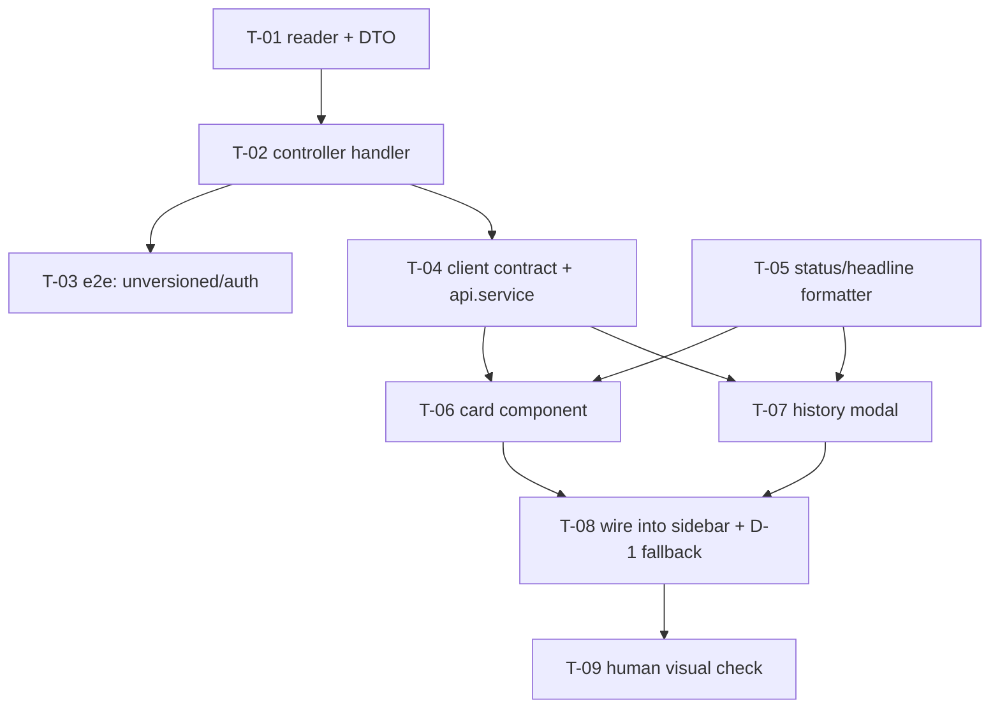

# Tasks — Bilateral / PRMS Sync Status Panel

- **Module:** bilateral (server `result-prms-sync` + client `result-sidebar`)
- **Spec id:** 2026-09-sync-status-panel
- **Status:** not-started
- **Owner:** Juan Cadavid / ARI
- **Linked requirements:** [`./requirements.md`](./requirements.md)
- **Linked design:** [`./design.md`](./design.md)
- **Last updated:** 2026-09-25

---

## 1. Conventions for this spec

- **No `/v1`.** Every path is `/api/results/:resultCode/prms-sync/history`. Adding `@Version` mounts the handler where the client does not call (design P-1).
- **Assert generated SQL, not call sequences** (KZ-001). The reader's gates read the emitted query text and its parameter array.
- **`npx eslint <path>` is the lint gate**, never `npm run lint` (it carries `--fix` and mutates — K-001). `npx prettier --write` is a *fixer* and is allowed to the implementer.
- **Server tests:** `npm test -- --silent` from `server/researchindicators/`. **Client tests:** same command from `client/research-indicators/`. Never both at once — two full-suite runs in parallel produce phantom failures (root `CLAUDE.md` §4.3).

---

## 2. Dependency graph

**PR 1 (server):** T-01, T-02, T-03 · **PR 2 (client):** T-04 … T-09.
T-05 has no dependency and may start in parallel with the server lane — it is pure client-side logic. **Do not run two client tasks concurrently** (root `CLAUDE.md` §4.3).

---

## 3. Task list

### T-01 — History reader: queries, filters, ordering, count

- **Requirements covered:** R-SSP-001 AC.1, AC.2, AC.3, AC.4, AC.7, AC.9 · R-SSP-004 AC.1, AC.2, AC.3 · R-SSP-006 AC.1, AC.2 (server half)
- **Design refs:** §3.1, §5 (Q1/Q2/Q3), §6.3
- **Files touched:** `src/domain/entities/result-prms-sync/prms-sync-history.reader.ts` (new) · `dto/prms-sync-history.dto.ts` (new) · `prms-sync-history.reader.spec.ts` (new)
- **Scope:** the three statements of design §5, the row→DTO mapping, and `actor_name` resolved **only** for `STAR` rows.
- **Tests:** `prms-sync-history.reader.spec.ts` against a fake query executor that records emitted SQL + params.
- **Falsifier:** fixture holds 6 rows for one (code, year) — a `STAR`/`PENDING_REVIEW`, a second `STAR`/`PENDING_REVIEW`, a `PRMS`/`APPROVE` **whose `decided_at` is later than its `occurred_at` and later than every other row**, a row with `duplicate_of_id` set, a row with `is_active = FALSE`, and a row for a **different `result_year`**. Each row carries a **distinct** `id`, actor and timestamp (KZ-004 — identical defaults cannot discriminate). Mutations that must redden: (a) `ORDER BY occurred_at` instead of `COALESCE(decided_at, occurred_at)` → head of `events` changes; (b) drop `duplicate_of_id IS NULL` → `events.length` 4→5 and `sync_count` 2→3; (c) drop `is_active` → counts move again; (d) drop `AND status = 'PENDING_REVIEW'` from Q3 → `sync_count` 2→3; (e) drop the `result_year` predicate → the foreign-year row appears.
- **Red run:** this is **new** code, so no red-before-green exists. The gate is proven able to fail **by mutation**: apply each of (a)–(e) in turn, observe the suite red, revert. Record the five observed failures in the task report.
- **Disqualifier:** a fixture whose rows share a timestamp or a `duplicate_of_id` default cannot distinguish the ordering from the filter — if any two rows tie on `COALESCE(decided_at, occurred_at)`, the ordering assertion proves nothing and must be rebuilt before the result is reported. A run that asserts on the mock's **call sequence** instead of the emitted SQL string is inconclusive regardless of colour.
- **Consumers:** none — new file, no exported symbol yet read elsewhere. `grep -rn "PrmsSyncHistoryReader" server/` must return only this file and its spec before T-02.
- **Review:** `full` — this task owns every counting and filtering rule in the spec; a silent predicate drop is invisible downstream.
- **Done:**
  - [ ] `npm test -- --silent` green from `server/researchindicators/`
  - [ ] all five mutations observed red, then reverted
  - [ ] `npx tsc -p tsconfig.json --noEmit` clean
  - [ ] `npx eslint src/domain/entities/result-prms-sync/` clean
- **Effort:** M · **Skills:** `nestjs-expert`, `tdd`

---

### T-02 — Controller handler, guards, Swagger, provider registration

- **Requirements covered:** R-SSP-001 AC.5, AC.8 · NFR-SSP-001
- **Design refs:** §3.1, §5, §8, D-5
- **Files touched:** `result-prms-sync.controller.ts` · `result-prms-sync.module.ts` · `result-prms-sync.controller.spec.ts` (extend)
- **Scope:** one `@Get('history')` handler; register `PrmsSyncHistoryReader` as a provider; `@ApiTags` + `@ApiBearerAuth` + `@ApiOperation`.
- **Implementation notes:**
  - The guard stack is **copied** from the existing `getStatus` handler (`:190-196`), not re-derived.
  - **Do NOT add `@Version`.**
- **Falsifier:** a spec that reads the guard metadata off **both** handlers via `Reflect.getMetadata` and asserts them equal. Mutation: drop `ResultOwnerGuard` from the new handler → the equality assertion reddens. Second input: a caller whose roles contain none of the three → expect `403`.
- **Red run:** new handler, so proven by the two mutations above, each observed red then reverted.
- **Disqualifier:** asserting the decorator **list length** rather than its contents passes when a guard is swapped for another. If the assertion cannot tell `ResultOwnerGuard` from `RolesGuard`, it is not evidence.
- **Consumers:** `result-prms-sync.module.spec.ts` (if it pins the provider list) — `grep -n "providers" result-prms-sync.module.spec.ts` before editing. The existing `getStatus` spec must stay green untouched (DC-8).
- **Review:** `full` — authorization surface.
- **Done:**
  - [ ] guard-parity spec green; both mutations observed red
  - [ ] existing `result-prms-sync-status.reader.spec.ts` green **without edits**
  - [ ] the endpoint appears in `/swagger` under the PRMS sync tag
  - [ ] `npm test -- --silent` green
- **Effort:** S · **Skills:** `nestjs-expert`, `api-design-principles`

---

### T-03 — e2e: unversioned route and auth boundary

- **Requirements covered:** R-SSP-001 AC.6
- **Design refs:** §5, P-1
- **Files touched:** `test/prms-sync.e2e-spec.ts` (extend)
- **Scope:** two cases — `GET /api/results/:code/prms-sync/history` → not `404`; `GET /api/v1/results/:code/prms-sync/history` → `404`.
- **Falsifier:** add `@Version('1')` to the handler → the first case reddens and the second goes green. Both must move; if only one does, the pair is not testing what it claims.
- **Red run:** apply the `@Version('1')` mutation, observe **both** cases flip, revert.
- **Disqualifier:** ⚠️ **the existing e2e harness stubs `JwtMiddleware.prototype.use`** (`test/prms-sync.e2e-spec.ts:230-235`, sibling **DD-11 / P-17**). Under that stub an auth assertion passes **vacuously**. This task therefore claims **only** the routing property, not the auth boundary — auth is owned by T-02's unit-level guard-parity check. Writing an auth AC here and ticking it under the stub is the exact defect DD-11 exists to prevent.
- **Consumers:** none.
- **Review:** `checklist` — two assertions with an explicitly narrowed claim.
- **Done:**
  - [ ] `npm run test:e2e` green
  - [ ] the `@Version('1')` mutation observed flipping both cases
  - [ ] the scope limitation above restated in the task report
- **Effort:** S · **Skills:** `nestjs-expert`

---

### T-04 — Client contract mirror + API method

- **Requirements covered:** plumbing for R-SSP-002 … R-SSP-010
- **Design refs:** §3.1, §5
- **Files touched:** `shared/interfaces/prms-sync-history.interface.ts` (new) · `shared/services/api.service.ts` · `api.service.spec.ts` (extend)
- **Scope:** the hand-mirrored response interface and `GET_PrmsSyncHistory(resultCode)` returning `MainResponse<PrmsSyncHistoryResponse>`.
- **Implementation notes:** mirror the existing `POST_PrmsSync` shape (`api.service.ts:1072-1075`). The URL is `results/${resultCode}/prms-sync/history` — **no `v1`**.
- **Falsifier:** a spec asserting the exact URL string passed to the transport. Mutation: change the builder to `v1/results/...` → the assertion reddens. Precedent for this exact gate: `api.service.spec.ts:662-670` already does it for `POST_PrmsSync`.
- **Red run:** apply the `v1/` mutation, observe red, revert.
- **Disqualifier:** asserting that the transport was *called* without asserting the URL string cannot see a `v1` regression. Call-count-only evidence is inconclusive.
- **Consumers:** `api.service.spec.ts` — an existing suite that may pin the method list; `grep -n "PrmsSync" client/research-indicators/src/app/shared/services/api.service.spec.ts` before editing.
- **Review:** `skip-eligible` — thin, mechanical, mirrors an adjacent method. **Claim it must prove at execute time:** the emitted URL carries no version segment, asserted as a string literal.
- **Done:**
  - [ ] URL-string spec green; `v1/` mutation observed red
  - [ ] `npx tsc -p tsconfig.spec.json --noEmit` clean *(run it and read the whole output — a syntax error aborts the parse and hides the real count, K-004)*
- **Effort:** S · **Skills:** `angular-developer`

---

### T-05 — Status formatter and headline derivation

- **Requirements covered:** R-SSP-005 AC.1, AC.2, AC.4 · R-SSP-009 AC.4
- **Design refs:** §6.3, §6.4, D-7
- **Files touched:** `shared/utils/prms-sync-status.util.ts` (new) · `prms-sync-status.util.spec.ts` (new)
- **Scope:** two pure functions — `formatSyncStatus(event) → { label, tone }` per design §6.3, and `deriveHeadline(event, chronologicalEvents) → string` per design §6.4. No component, no template.
- **Implementation notes:** the pill value is `event_source === 'STAR' ? status : decision` — **not** `status ?? decision`, which would render `PENDING_REVIEW` for an inbound row that happens to carry one.
- **Falsifier:** input set covering all five headline branches **plus** an inbound row with `status = 'APPROVED'` **and** `decision = 'APPROVE'` (the post-`13ad5e8d` shape) **and** one with `status = null, decision = 'APPROVE'` (the pre-commit shape, which exists in production — design P-5). Both must yield `Approved`. Mutations: (a) swap the ternary to `status ?? decision` → the pre-commit row still passes but a `STAR` row with a stray decision breaks; (b) collapse branch 3 (`Mapping re-synced`) into branch 2 → the no-prior-rejection input yields the wrong headline.
- **Red run:** new code — proven by mutations (a) and (b), each observed red then reverted.
- **Disqualifier:** an input set in which every inbound row has **both** `status` and `decision` populated cannot distinguish the ternary from the null-coalesce — the pre-`13ad5e8d` row is the discriminating input and its absence makes the run inconclusive.
- **Consumers:** none yet; T-06 and T-07 become the consumers.
- **Review:** `checklist` — pure functions, fully covered by their own inputs.
- **Done:**
  - [ ] all five headline branches and all three labels asserted
  - [ ] both mutations observed red
  - [ ] `npm test -- --silent` green from `client/research-indicators/`
- **Effort:** S · **Skills:** `angular-developer`, `tdd`

---

### T-06 — `prms-sync-card` component

- **Requirements covered:** R-SSP-002 AC.1, AC.4 · R-SSP-003 AC.1–AC.5 · R-SSP-004 AC.4 · R-SSP-005 AC.3 · R-SSP-006 AC.1–AC.4 · R-SSP-007 AC.1–AC.5 · R-SSP-008 AC.1–AC.3
- **Design refs:** §7, §6.2, §6.5, D-2, D-3
- **Files touched:** `shared/components/prms-sync-card/prms-sync-card.component.{ts,html,scss,spec.ts}` (all new)
- **Scope:** the standalone card. Inputs: the history response. Output: an event when the history link is clicked (the modal is T-07).
- **Implementation notes:**
  - **Tokens only** — `.abc-*` / `.atc-*` / `var(--ac-*)`. **No hex literals**, despite the host component's 18 (design D-3).
  - Button suppressed when `prms_result_code` **or** `prms_phase_id` is null; the `PRMS ID:` line is **not** suppressed with it (R-SSP-007 AC.5).
  - Host URL from `environment.prmsUrl` — never a literal.
- **Falsifier:** fixtures for all three card states plus: a `PRMS` row with `decision: 'WEIRD'` (R-SSP-003 AC.5 fallback), a `STAR` row with `actor_name: null` (R-SSP-006 AC.3 — the whole line omitted, not `by null`), `prms_phase_id: null` with a non-null code (button gone, ID line present), `sync_count: 0` (badge hidden). Mutations: (a) remove `?phase=` from the href builder → the asserted href string differs; (b) change the suppression to `code == null` only → the null-phase fixture renders a button; (c) render `{{ status }}` raw → the "no raw enum in the DOM" assertion reddens.
- **Red run:** new component — proven by mutations (a), (b), (c), each observed red then reverted.
- **Disqualifier:** a spec that asserts the href **contains** `/reports/result-details/` cannot see a missing `?phase=`. The assertion must be the **full string**. A fixture where `prms_result_code` and `prms_phase_id` hold the **same number** cannot tell a transposed template from a correct one — use different values (e.g. `452` and `6`, per the requirements' worked example).
- **Consumers:** none yet — T-08 mounts it. `grep -rn "app-prms-sync-card" client/` must return only this folder before T-08.
- **Review:** `full` — owns the largest AC block in the spec, including the deep link.
- **Done:**
  - [ ] all three title states, both actor branches, both button branches asserted
  - [ ] DOM contains none of `PENDING_REVIEW`, `APPROVE`, `REJECT`, `APPROVED`, `REJECTED`
  - [ ] `grep -oE "#[0-9A-Fa-f]{3,6}" prms-sync-card.component.{html,scss}` → **no output**
  - [ ] three mutations observed red
  - [ ] `npm test -- --silent` green; `npm run lint -- --quiet` clean
- **Effort:** L · **Skills:** `angular-developer`, `ui-ux-pro-max`

---

### T-07 — `prms-sync-history-modal` component

- **Requirements covered:** R-SSP-009 AC.1, AC.2, AC.3, AC.5, AC.6, AC.7 · NFR-SSP-003
- **Design refs:** §7, §6.4, D-8
- **Files touched:** `shared/components/prms-sync-history-modal/prms-sync-history-modal.component.{ts,html,scss,spec.ts}` (all new)
- **Scope:** the `p-dialog` timeline. Header, sub-header, one entry per event, the `REVIEWER COMMENT` block, `Close`.
- **Implementation notes:**
  - `justification` rendered by interpolation only — **never** `[innerHTML]` (design §8).
  - Headline and pill come from T-05's functions, not from a second implementation.
  - **No `See what changed` button** (R-SSP-009 AC.6) — deferred.
- **Falsifier:** fixture of 4 events mirroring the mockup (STAR first, PRMS reject, STAR re-sync, PRMS approve) with **distinct** timestamps, plus one event with `justification: null` and one with `justification: ''`. Mutations: (a) render the comment block unconditionally → the two empty-justification fixtures produce an empty bordered box and the "absent" assertion reddens; (b) reverse the sort → the first rendered entry changes; (c) add the `See what changed` button → AC.6's absence assertion reddens.
- **Red run:** new component — proven by mutations (a), (b), (c), each observed red then reverted.
- **Disqualifier:** a fixture where every event carries a non-empty `justification` cannot test AC.3 at all — if the empty and null cases are absent, the run does not cover the clause it claims. Focus-return and `Escape` assertions that never render the dialog **open** are inconclusive.
- **Consumers:** T-05's two exported functions; `grep -rn "formatSyncStatus\|deriveHeadline" client/` to list every reader before changing either signature.
- **Review:** `full` — owns the timeline semantics and the a11y clauses.
- **Done:**
  - [ ] 4-event fixture renders newest-first, one entry each
  - [ ] comment block present for non-empty, absent for `null` **and** `''`
  - [ ] `Escape` closes and focus returns to the trigger
  - [ ] no `See what changed` in the DOM
  - [ ] three mutations observed red
- **Effort:** L · **Skills:** `angular-developer`, `ui-ux-pro-max`

---

### T-08 — Mount in the sidebar, D-1 fallback, amend legacy specs

- **Requirements covered:** R-SSP-002 AC.2, AC.3 *(as amended — see OQ-D1)* · R-SSP-010 AC.1–AC.4 · NFR-SSP-002
- **Design refs:** §6.1, D-1, P-11, P-12
- **Files touched:** `result-sidebar.component.{ts,html,spec.ts}`
- **Scope:** fetch the history, render card / legacy line / nothing per design §6.1, wire the modal open, and update the five legacy assertions.
- **Implementation notes:**
  - **`prmsResultCode()` is KEPT** (`:155`) — D-1. It is the fallback's source and a sibling computed reads the same alignment signal (P-12).
  - The legacy line at `:196-201` renders **only** when `events.length === 0 && prms_result_code != null`.
  - Loading, failed and empty must be three distinguishable branches (K-016).
- **Falsifier:** four fixtures — (i) events present → card, no legacy line; (ii) events empty + code present → legacy line, no card; (iii) events empty + code null → neither; (iv) request rejects → neither, and the `PRMS SYNC` button still renders. Mutations: (a) delete the legacy branch → fixture (ii) renders nothing and reddens — **this is the regression D-1 exists to prevent, and 16 of 19 production results are in state (ii)**; (b) collapse loading into empty → the loading assertion reddens.
- **Red run:** the legacy branch is **new behavior on an existing component**, so fixture (ii) can be observed red before it is written: assert it against the current `result-sidebar` with the card wired and the legacy line deleted, watch it fail, then add the branch.
- **Disqualifier:** a fixture that stubs the API call **synchronously** resolves during the first change detection and cannot distinguish the loading branch from the loaded one — use a deferred observable (KZ-015: arrange the *transition*, not the end state). A green run under synchronous mocks does not cover R-SSP-010 AC.1.
- **Consumers:** **7 readers in one folder, two clusters** — `result-sidebar.component.html:196,199,200`; `.ts:155`; `.spec.ts:344,356,364` **and `:2429,:2437`. The second cluster is easy to miss.** Derive the final edit list from the **failing run**, not from this grep (K-018): apply the change, run the suite, let the failures name the sites. The client has no Cypress/Playwright suite (`find client/research-indicators/tests -type f` → 2 mock files), so there is no hidden e2e consumer.
- **Review:** `full` — owns the regression the reversion challenge found.
- **Done:**
  - [ ] all four fixtures pass; mutation (a) observed red
  - [ ] both legacy spec clusters updated and green
  - [ ] opening the modal issues **no** second HTTP call (NFR-SSP-002), asserted by call count on the API mock
  - [ ] `npm test -- --silent` green from `client/research-indicators/`
- **Effort:** M · **Skills:** `angular-developer`, `systematic-debugging`

---

### T-09 — Human visual check (the only gate for DC-9)

- **Requirements covered:** NFR-SSP-004 · **DC-9** (requirements §4.1) · settles Premise Ledger **P-14**
- **Design refs:** §7.1, D-3, OQ-D3
- **Files touched:** none (verification task)
- **Scope:** run the app, open a result in each of the three card states, compare against the mockups in **both** light and dark mode.
- **Implementation notes:** this is **the first check, not the last** — it runs **before** `/akili-validate` issues a verdict (task template §8).
- **Falsifier:** n/a — this task exists precisely because the defect class has no automated falsifier. That is stated, not hidden.
- **Red run:** n/a.
- **Disqualifier:** **a human "looks fine" does not discharge this task.** Record *which* of the three card states and *which* theme were actually observed; if only the `PENDING_REVIEW` state was seen, tick only that clause and mark the others blocked (KZ-002 — quote what the observation covered). A check performed only in light mode does not cover dark mode.
- **Consumers:** n/a.
- **Review:** `checklist` — the artifact is the recorded observation.
- **Done:**
  - [ ] `Synchronized with PRMS` state compared against `01-card-full.png`, light **and** dark
  - [ ] `Approved by PRMS` state observed *(blocked until `decision-webhook` is deployed — requirements §8 D-1; record as blocked rather than ticked)*
  - [ ] `Returned by PRMS` state observed *(same dependency)*
  - [ ] modal compared against `05-history-modal.png`
  - [ ] the legacy-fallback state (16 of 19 production results) observed and confirmed unchanged from today
  - [ ] OQ-D3 answered by the owner
- **Effort:** S · **Skills:** `ui-ux-pro-max`

---

## 4. Requirement → task coverage

Closure is at **scenario and clause** granularity, not requirement ID.

| Requirement | Clause | Owning task |
|---|---|---|
| R-SSP-001 | AC.1, 2, 3, 4, 7, 9 | T-01 |
| R-SSP-001 | AC.5, AC.8 | T-02 |
| R-SSP-001 | AC.6 | T-03 |
| R-SSP-002 | AC.1, AC.4 | T-06 |
| R-SSP-002 | AC.2, AC.3 | T-08 |
| R-SSP-003 | AC.1–AC.5 | T-06 |
| R-SSP-004 | AC.1, 2, 3 | T-01 |
| R-SSP-004 | AC.4 | T-06 |
| R-SSP-005 | AC.1, 2, 4 | T-05 |
| R-SSP-005 | AC.3 | T-06 *(re-asserted in T-07)* |
| R-SSP-006 | AC.1, AC.2 | T-01 (resolve) + T-06 (render) |
| R-SSP-006 | AC.3, AC.4 | T-06 |
| R-SSP-007 | AC.1–AC.5 | T-06 |
| R-SSP-008 | AC.1–AC.3 | T-06 |
| R-SSP-009 | AC.4 | T-05 (derive) + T-07 (render) |
| R-SSP-009 | AC.1, 2, 3, 5, 6, 7 | T-07 |
| R-SSP-010 | AC.1–AC.4 | T-08 |
| NFR-SSP-001 | — | T-02 |
| NFR-SSP-002 | — | T-08 |
| NFR-SSP-003 | — | T-07 |
| NFR-SSP-004 | — | T-09 |

**Every AC in `requirements.md` appears exactly once as an owned clause.** No gap is discharged by citing a different requirement.

---

## 5. Risks & blockers log

| # | Date | Risk / Blocker | Mitigation | Owner | Status |
|---|---|---|---|---|---|
| RB-1 | 2026-09-25 | The `PRMS` card states cannot be exercised with real data until `decision-webhook` is deployed (its TEST registration and R-1/OQ-6 are open). | T-09 records them **blocked**, not ticked. The `STAR` states ship and work. | Product owner | open |
| RB-2 | 2026-09-25 | D-2 hides the PRMS button for 17 of 19 already-synced results, with no backfill source. | OQ-D2 — owner decides: accept, backfill task, or ask PRMS whether `?phase=` is optional. | Product owner | open |
| RB-3 | 2026-09-25 | R-SSP-002 AC.3 as written contradicts D-1's fallback. | OQ-D1 — narrow the AC before T-08 starts. | Product owner | open |

---

## 6. Done definition

- [ ] All T-01 … T-09 are `done` (T-09's PRMS-state clauses may close as `blocked` per RB-1).
- [ ] Someone has exercised the card **in the running product** before `/akili-validate` runs (T-09).
- [ ] Every AC in §4 is checked.
- [ ] Coverage thresholds green: server 60 %; client 40/20/45/30.
- [ ] `/swagger` documents the history endpoint.
- [ ] OQ-1 … OQ-5 and OQ-D1 … OQ-D3 are resolved or carried forward.
- [ ] Actuals compared against the §14 budget (9 tasks / ~1 250 LOC / 2 rounds); an overrun **escalates to the owner** rather than continuing.
