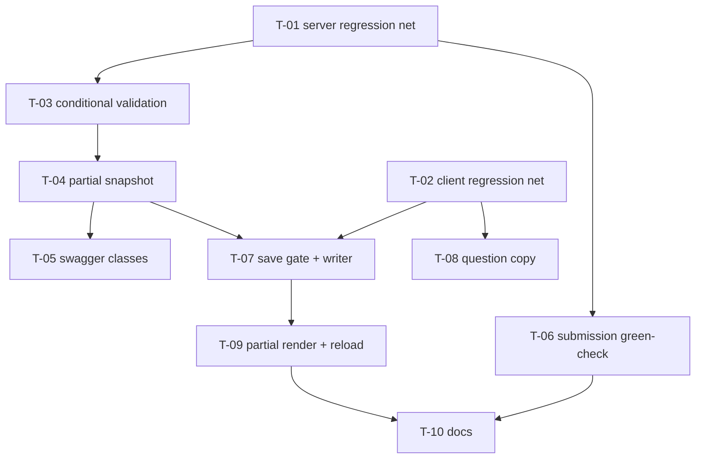

# Tasks — Bilateral / Optional & partial Theory-of-Change mapping

- **Module:** bilateral
- **Spec id:** 2026-08-toc-optional-mapping
- **Status:** not-started
- **Owner:** Juan Carlos Cadavid (bilateral squad)
- **Linked requirements:** [`./requirements.md`](./requirements.md)
- **Linked design:** [`./design.md`](./design.md)
- **Judgment ledger:** [`./judgment.md`](./judgment.md) (round 1: 4 severe / 5 warning, all corrected)
- **Last updated:** 2026-08-12

---

## 1. Plan at a glance

**10 tasks, ~530 LOC, 2 PRs.** The regression net lands **first** — before any behavior changes — so it is a real net rather than a post-hoc confirmation.

| # | Task | Tier | Size | PR |
| --- | --- | --- | --- | --- |
| T-01 | Server regression net (read-only gate, per-SP isolation) | server | S | 1 |
| T-02 | Client regression net (selector format, unit/target gating) | client | S | 2 |
| T-03 | Conditional validation + `contribution_without_indicator` | server | M | 1 |
| T-04 | Partial snapshot construction | server | S | 1 |
| T-05 | Swagger response classes + `@ApiResponse` | server | M | 1 |
| T-06 | Submission green-check proof + SQL comment fix | server | S | 1 |
| T-07 | Client save gate + payload writer | client | M | 2 |
| T-08 | Question copy | client | S | 2 |
| T-09 | Client partial render + reload | client | S | 2 |
| T-10 | Docs: decisions, baseline drift, dangling refs | docs | S | 2 |

> **Budget reconciled.** Judgment round 1 raised the budget from 7 to 9 tasks; decomposition then split the regression net by tier (T-01 server / T-02 client) to match the PR boundary, giving **10**. `design.md` §9 was updated to **10 tasks / ~530 LOC / 10 review rounds** so the two documents agree — `/akili-execute` trips on a real overrun, not on a stale figure. The final change was a split, not new scope: LOC is unchanged.

---

## 2. Dependency graph

**Parallel-safe pairs** (disjoint files, no shared state): `T-05 ∥ T-06`, `T-08 ∥ T-07`, `T-01 ∥ T-02`.
**Strictly sequential:** `T-03 → T-04` (same method, adjacent line ranges).
**No cycles.**

---

## 3. Requirement coverage map

Closure is at **scenario and clause** granularity, not requirement ID. Every scenario and every `BUT` / `AND IT MUST` clause below is owned by exactly one named task.

| Requirement | Scenario / clause | Owner |
| --- | --- | --- |
| **R-BIL-110** AC.1–3 | Scenario "Question renders with the new wording" | T-08 |
| | ↳ BUT NOT change column/wire name or stored meaning | T-08 |
| | ↳ AND IT MUST render through `.label` | T-08 *(automated: class presence; behavioral: T-10 visual check)* |
| **R-BIL-111** AC.3–4, AC.6 | Scenario "Bare 'Yes' is rejected" | T-03 |
| | ↳ AND IT MUST persist nothing from the batch | T-03 |
| **R-BIL-111** AC.1–2, AC.5 | Scenario "Level + HLO only" | T-04 |
| | ↳ BUT NOT 400 for the absent `indicator_id` | T-03 |
| | ↳ AND IT MUST reject when `toc_result_id` is absent | T-03 |
| **R-BIL-112** AC.1–3, AC.5 | Scenario "Partial draft reaches the server" | T-07 |
| | ↳ BUT NOT silently omit the entry | T-07 |
| | ↳ AND IT MUST NOT report success while discarding | T-07 |
| **R-BIL-112** AC.4 | Scenario "Unanswered still blocks" | T-07 |
| | ↳ AND IT MUST remain blocked until answered | T-07 |
| **R-BIL-113** AC.1–5 | Scenario "Relaxation does not admit garbage" | T-03 |
| | ↳ BUT NOT persist any part of the batch | T-03 |
| | ↳ AND IT MUST still accept when `indicator_id` is omitted | T-03 |
| **R-BIL-113** AC.6 | Scenario "Contribution without an indicator is rejected" | T-03 |
| | ↳ BUT NOT report `missing_required_fields` | T-03 |
| | ↳ AND IT MUST accept when `quantitative_contribution` is also omitted | T-03 |
| **R-BIL-114** AC.1–3 | server read-back nulls, PATCH ≡ GET, ordering | T-04 |
| **R-BIL-114** AC.4 | null contract in Swagger | T-05 |
| **R-BIL-114** | Scenario "Partial row renders without error" | T-09 |
| | ↳ BUT NOT display `null`/`undefined`/`NaN` as text | T-09 |
| | ↳ AND IT MUST NOT present an empty indicator as a valid selection | T-09 |
| **R-BIL-115** AC.1–3 | selector `code — allocation% - name` | T-02 |
| **R-BIL-116** AC.1–3 | unit/target precede contribution; absent when no indicator | T-02 |
| **R-BIL-117** AC.1–3 | read-only 409 incl. `SYSTEM_ADMIN`; no bypass introduced | T-01 |
| **R-BIL-118** AC.1 | per-SP isolation | T-01 |
| **R-BIL-118** AC.2 *(application half)* | `upsertForSp` never inserts a second active row | T-01 |
| **R-BIL-118** AC.2 *(DB-enforced half)* | the partial-unique index itself rejects a duplicate | **Discharged structurally — unchanged DDL.** Not owned by a task. See `requirements.md` R-BIL-118 AC.2 note + `execution.md` → Pivot Record: T-01 (user sign-off 2026-08-12) |
| **R-BIL-118** AC.3 | partial row does not null another SP's complete row | T-04 |
| **R-BIL-119** AC.1–3 | Scenario "Partial mapping still submits" | T-06 |
| | ↳ BUT NOT pass for an SP with no active ToC row | T-06 |
| | ↳ AND IT MUST NOT require `indicator_id`/`quantitative_contribution` | T-06 |
| **R-BIL-119** AC.4 | SQL comment corrected | T-06 |
| **NFR-BIL-110** | dedup + floor-rejection call counts | T-03 |
| **NFR-BIL-111** | coverage floors | T-10 (final gate) |
| **NFR-BIL-112** | no silent-failure path in save flow | T-07 |

**Unowned clauses: one, deliberately.** R-BIL-118 AC.2's **DB-enforced half** is discharged
structurally (this spec changes no DDL) rather than owned by a task — see the row above,
`requirements.md` R-BIL-118 AC.2, and `execution.md` → Pivot Record: T-01. Every other clause is
owned by exactly one named task. This exception is recorded with user sign-off (2026-08-12); it is
not an oversight, and it must not be quietly re-absorbed into a task's scope.

---

## 4. Task list

### T-01 — Server regression net: read-only gate + per-SP isolation

- **Requirements covered:** R-BIL-117 (AC.1–3), R-BIL-118 (AC.1–2)
- **Files touched:** `server/.../bilateral/bilateral.service.spec.ts`, `.../repositories/result-pool-funding-toc-alignment.repository.spec.ts`
- **Description:** Pin the two server behaviors AC-1676 lists that already work, **before** any change. These tests must pass on unmodified code, and still pass after T-03/T-04.
- **Implementation notes:**
  - Assert `is_read_only` is the union of PRMS-sourced and `is_synced_to_prms`; assert `409` on write under each condition **including for `SYSTEM_ADMIN`**.
  - Assert writing `SP01`'s alignment leaves `SP02`'s row byte-identical.
  - **AC.2 (amended 2026-08-12 — Pivot Record: T-01):** assert the **application half** — that re-submitting the same `(result, sp)` updates the single active row in place and never inserts a second, so the partial-unique index is never reached. Do **not** name the test as if it proved the DB constraint; that half is discharged structurally (unchanged DDL) and is not this task's to prove.
- **Done check:**
  - [ ] Tests pass on **unmodified** `main`/branch code (proving they describe current behavior, not aspiration)
  - [ ] Each fails when its guard is deliberately disabled locally (net is live, not tautological)
- **Evidence disqualifiers:** a test that passes both with and without the guard proves nothing — it must fail on removal. If the suite was run scoped, untouched suites are unverified: report as inconclusive.
- **Skills:** `nestjs-expert`
- **Dependencies:** none · **Effort:** S · **Status:** ✅ **`[x]` done** — Reviewer PASS on re-audit after a Pivot; **0 of 3 rework attempts consumed**. 5 guards mutation-proven. AC.2 split: application half proven here, DB half discharged structurally (user sign-off). BL-1 and BL-2 both closed. See [`./execution.md`](./execution.md)

---

### T-02 — Client regression net: selector format + unit/target gating

- **Requirements covered:** R-BIL-115 (AC.1–3), R-BIL-116 (AC.1–3)
- **Files touched:** `client/.../pool-funding-alignment.component.spec.ts`, `.../sp-toc-alignment-block.component.spec.ts`
- **Description:** Pin the two client behaviors that already work, before touching the save path.
- **Implementation notes:**
  - Assert rendered SP text matches `<code> — <allocation>% - <name>`; assert a null allocation renders the `—` placeholder, never `null`.
  - Assert unit and target render when an indicator is selected, and that **neither renders when no indicator is selected** (R-BIL-116 AC.3 — this is the partial-row case, satisfied today by the `@if (selectedIndicator())` gate).
  - Assert the allocation segment's removal fails the test.
- **Done check:**
  - [ ] Tests pass on unmodified code
  - [ ] Removing the allocation segment from the template fails T-02
- **Evidence disqualifiers:** these assert DOM text and structure — they do **not** prove visual layout, spacing, or contrast (jsdom cannot measure). That gap is T-10's visual check, not this task's.
- **Skills:** `angular-developer`, `ui-ux-pro-max`
- **Dependencies:** none · **Effort:** S · **Status:** ✅ **`[x]` done** — Reviewer PASS on attempt 1, dual-vendor (Claude Opus + Gemini 3.1 Pro). Tautology concern adjudicated: the applied mutation was a *null result*, but AC.1/AC.2 are live by static analysis. Advisory A-1 (two cheap probes) carried to T-10. See [`./execution.md`](./execution.md)

---

### T-03 — Conditional validation + `contribution_without_indicator`

- **Requirements covered:** R-BIL-111 (AC.3, AC.4, AC.6), R-BIL-113 (AC.1–6), NFR-BIL-110
- **Files touched:** `server/.../bilateral/bilateral.service.ts` (`validateTocAlignments`, ~855–990), `dto/update-pool-funding-alignment.dto.ts` (input descriptions), `bilateral.service.updateAlignment.tocAlignments.spec.ts`
- **Description:** Reduce the required floor for `aligns_with_toc: true` to `level` + `toc_result_id`; make each catalog check conditional on its field being present; add the dedicated `contribution_without_indicator` code. Design §5.2, §6.1.
- **Implementation notes:**
  - `missingFields` narrows to `['level', 'toc_result_id']`.
  - Indicator resolution runs **only** when `indicator_id` is present; `validatedCatalogRefs` carries `indicator: TocIndicator | null`.
  - `quantitative_contribution` present + `indicator_id` absent → `contribution_without_indicator` on `quantitative_contribution` (**never** `missing_required_fields` — design D-C1-8, judgment F-1).
  - Preserve atomicity (D-V2-8), `duplicate_sp_code`, `sp_not_selected`, and the `409` version gate untouched.
- **Done check:**
  - [ ] Full acceptance matrix: Level+HLO **accepts at the validation layer** · Level-only rejects · bare Yes rejects (both fields named) · each catalog code fires when its field is present and **not** when absent · contribution-without-indicator returns the new code · no partial persistence on any error
    > **Clarified 2026-08-12 (Leader), surfaced by the T-03 Implementer.** "Accepts" here means **validation** accepts — no `BadRequestException`, no `missing_required_fields`, catalog consulted correctly for the `(sp_code, level)` combo. It does **not** mean a non-throwing end-to-end `updateAlignment` call. The return map at `bilateral.service.ts:1004–1016` destructures `indicator` unconditionally and dereferences it (`indicator.indicator_description`, `resolveLiveTargetValue(indicator)`), so once T-03 admits a Level+HLO-only entry, a full round trip throws `TypeError` **until T-04 lands**. That is correct task decomposition, not a defect: §3 assigns R-BIL-111 AC.1/AC.2 — the *successful persistence* clauses — to **T-04**, and §2 already marks T-03→T-04 strictly sequential over adjacent line ranges. Nothing ships broken: both tasks are inside PR 1, and no client sends partial payloads until PR 2.
    >
    > **T-03 must NOT** add a null-guard to the return map. Doing so would pre-empt T-04's judgment **F-9** decision (`target_year` must be null for a partial row; line 1017 currently hardcodes `MAPPABLE_LIVE_VERSION`) and shrink T-04's diff so its reviewer sees a half-corrected snapshot. **T-03 must also not** assert the `TypeError` as expected behavior — that would go green in T-04 too and silently invert meaning once T-04 fixes it.
  - [ ] **NFR-BIL-110 asserted correctly:** one `getTocResults` call per distinct `(sp_code, level)`; **zero** calls when every entry fails the floor
  - [ ] T-01 still green
- **Evidence disqualifiers:** **Do not assert that partial entries add zero catalog calls** — a Level+HLO entry legitimately goes 0→1 (design §6.1, judgment F-2). A test asserting zero is testing the pre-change code and will read as a false-green NFR gate. If `lambda-toc` is unreachable (RB-1) and catalog cases **skip**, the run is inconclusive — report the skip count, never count skips as green.
- **Skills:** `nestjs-expert`, `error-handling-patterns`
- **Dependencies:** T-01 · **Effort:** M · **Status:** ✅ **`[x]` done** — Reviewer PASS on attempt 1, dual-vendor (Claude Opus + Gemini 3.1 Pro). 0 rework. Atomicity `continue` ruled correct: the pattern **predates this diff** (`:927`, `:936` already `continue` on `HEAD`), so D-V2-8 was always cross-entry accumulation. **Advisory carried to T-05:** `contribution_without_indicator` is missing from the controller's Swagger 400 vocabulary (`bilateral.controller.ts:194`) and no task currently owns it. See [`./execution.md`](./execution.md)

---

### T-04 — Partial snapshot construction

- **Requirements covered:** R-BIL-111 (AC.1, AC.2, AC.5), R-BIL-114 (AC.1–3), R-BIL-118 (AC.3)
- **Files touched:** `server/.../bilateral/bilateral.service.ts` (return map, ~993–1019), `bilateral.service.updateAlignment.tocAlignments.spec.ts`
- **Description:** Build the persisted row when no indicator resolved: ToC-result fields populated, indicator-derived fields null. Design §6.2.
- **Implementation notes:**
  - `toc_result_title` always populated from the resolved ToC result.
  - `indicator_id`, `indicator_description`, `unit_messurament`, `target_value`, **and `target_year`** null when no indicator (judgment F-9 — `target_year` must not claim a year for an absent target).
  - `aligns_with_toc: false` path unchanged.
- **Done check:**
  - [ ] **Carried forward from T-03 (added 2026-08-12):** the `TypeError` crash path T-03 knowingly leaves open is **closed**. After T-03, the return map at `bilateral.service.ts:1004–1016` destructures `indicator` unconditionally, so a full `updateAlignment` with a Level+HLO-only entry throws. T-04 must prove a **non-throwing end-to-end round trip** for exactly that input — this is the task that discharges R-BIL-111 AC.1/AC.2, which T-03 could not. Note line 1017 hardcodes `target_year: MAPPABLE_LIVE_VERSION`; per judgment **F-9** it must be **null** for a partial row.
  - [ ] Partial row persists with exactly the null set above and non-null `level`, `toc_result_id`, `toc_result_title`
  - [ ] Complete row byte-identical to pre-change output
  - [ ] `PATCH` response ≡ subsequent `GET` for the same state
  - [ ] Writing a partial row for `SP01` leaves `SP02`'s complete row untouched (R-BIL-118 AC.3)
- **Evidence disqualifiers:** asserting only that the call succeeded proves nothing — assert the **persisted column values** field by field, including the nulls. An assertion on the response alone does not prove what reached the database.
- **Skills:** `nestjs-expert`
- **Dependencies:** T-03 · **Effort:** S · **Status:** ✅ **`[x]` done** — Reviewer PASS attempt 1, 0 rework. Crash path closed; F-9 `target_year` null for partial rows. 320 suites / 2049 tests (+5). ⚠ **Single-vendor review only** (Opus quota-blocked) — a confirming Opus audit is recommended before PR 1 ships. See [`./execution.md`](./execution.md)

---

### T-05 — Swagger response classes + `@ApiResponse`

- **Requirements covered:** R-BIL-114 (AC.4)
- **Files touched:** `server/.../bilateral/dto/update-pool-funding-alignment.dto.ts`, `bilateral.controller.ts`, `bilateral.controller.spec.ts`
- **Description:** Convert `TocAlignmentReadbackResponse` and `AlignmentResponse` from plain interfaces to `@ApiProperty`-decorated classes and add typed `@ApiResponse` to `getAlignment` + `updateAlignment`, so the null contract is actually rendered. Design §6.3, D-C1-10.
- **Implementation notes:**
  - Follow the module's own precedent in `dto/bilateral-hlos-indicators.response.dto.ts` (classes, not interfaces, precisely so Swagger can introspect) and toc-mapping-v2 T-04's typed `@ApiResponse` pattern.
  - Mark indicator-derived properties `nullable: true` and describe **when** they are null (partial row).
  - Keep the emitted JSON shape byte-identical — this is a documentation change, not a contract change.
- **Done check:**
  - [ ] Programmatic Swagger-metadata assertions confirm both response schemas are registered with the nullable properties present
  - [ ] Response payload shape unchanged (existing read-back tests still green)
- **Evidence disqualifiers:** a TSDoc comment on an interface renders **nothing** in Swagger — "the comment exists" is not evidence AC.4 is met. Only a metadata assertion (or an inspected `/swagger` schema) counts. This is the exact failure judgment F-3 caught in the design.
- **Skills:** `nestjs-expert`, `api-design-principles`
- **Dependencies:** T-04 · **Effort:** M · **Status:** ✅ **`[x]` done** — Reviewer PASS attempt 1, 0 rework. F-3 disqualifier cleared by **rendered** OpenAPI schema, not inference. Also landed `contribution_without_indicator` in the controller's 400 vocabulary (the orphan surfaced by T-03's audit). See [`./execution.md`](./execution.md)

---

### T-06 — Submission green-check proof + SQL comment fix

- **Requirements covered:** R-BIL-119 (AC.1–4)
- **Files touched:** green-check / result-status spec files; the `pool_funding_alignment_validation` function comment (new append-only migration **or** in-place comment correction — confirm which, see RB-3)
- **Description:** Pin AC-1676's headline promise — *"Missing TOC information must not prevent submission"* — which holds **structurally** (row-presence semantics — *corrected 2026-08-12; the original "only by accident and untested" framing was false on both counts, see Pivot Record: T-06*). Correct the SQL comment that documents the removed invariant. Design §8 Finding 3, D-C1-11.
- **Implementation notes:**
  - The function tests `toc.aligns_with_toc is not null` — row presence, not completeness — so partial rows already pass. The test makes that guarantee explicit and load-bearing.
  - Also assert the **negative**: an SP with no active ToC row still fails the check.
  - The comment currently claims persisted "Yes" rows "already carry level/toc_result_id/indicator_id (enforced at save by `validateTocAlignments`)". After T-03 that is false.
- **Done check:**
  - [ ] A result whose only ToC row is partial passes the pool-funding green check and can transition status
  - [ ] An SP with no active ToC row still fails the check
  - [ ] The SQL comment no longer asserts the removed invariant
- **Evidence disqualifiers:** testing the SQL function in isolation does **not** prove submission is unblocked — the assertion must run through the green-check → status-workflow path, or explicitly record that it stopped at the function boundary. **Migrations are append-only** (`src/CLAUDE.md` §7): if the comment lives inside a merged migration, do not edit it — add a new migration that recreates the function with a corrected comment. Confirm before implementing (RB-3).
- **Skills:** `nestjs-expert`, `systematic-debugging`
- **Dependencies:** T-01 · **Effort:** S · **Status:** ✅ **`[x]` done** — Reviewer PASS on rework attempt 1 of 3, after two FAILs and a Pivot. Deliverable is a single comment correction; AC.1/AC.3 discharged structurally (user sign-off), AC.2 already covered at `HEAD:496`. **The second FAIL was against the Leader's own Pivot rationale, not the Implementer.** See [`./execution.md`](./execution.md)

---

### T-07 — Client save gate + payload writer

- **Requirements covered:** R-BIL-112 (AC.1–5), NFR-BIL-112
- **Files touched:** `client/.../pool-funding-alignment.component.ts` (`isDraftSaveable`, ~679–689), `client/.../shared/services/bilateral.service.ts` (`writeDtoFromDrafts`, ~362–389), both `*.spec.ts`
- **Description:** The core user-facing fix. Accept a "Yes" carrying Level + HLO, and **emit** it instead of silently dropping it. Design §7.1, §7.2.
- **Implementation notes:**
  - `isDraftSaveable`: unanswered → false (**keep** — this half of the completeness gate closes `OQ-UX-3`); `false` → true; `true` → requires `level` + `toc_result_id`; `quantitative_contribution` optional but `>= 0` when present.
  - `writeDtoFromDrafts`: remove the incomplete-Yes `continue`; emit with optionals omitted. **Keep** the unanswered skip.
  - **This is the silent-data-loss fix.** Its own comment called the branch "defensive only" — relaxing the gate without this converts dead code into live data loss.
- **Done check:**
  - [ ] A Level+HLO draft is **present** in `writeDtoFromDrafts` output
  - [ ] The same draft does not disable save
  - [ ] Unanswered still blocks save
  - [ ] A sub-floor "Yes" is never silently omitted — it either blocks with a visible message or is sent and rejected
  - [ ] Code review confirms **no branch discards a user-entered draft without persistence or a visible error** (NFR-BIL-112)
- **Evidence disqualifiers:** asserting the save button's enabled state does not prove the payload — assert the **emitted DTO array contents**. The defect being fixed is precisely a case where the UI reported success while the payload was empty.
- **Skills:** `angular-developer`
- **Dependencies:** T-02, T-04 · **Effort:** M · **Status:** ✅ **`[x]` done** — Reviewer PASS attempt 1, 0 rework. Silent-data-loss path closed; every rewritten test verified as the minimum consequence with its guard preserved or relocated. **Two advisories carried to T-10:** the mock stub is neither linted nor type-checked (A-1), and server 400s on `level`/`toc_result_id` render nowhere in the UI (A-2, pre-existing). See [`./execution.md`](./execution.md)

---

### T-08 — Question copy

- **Requirements covered:** R-BIL-110 (AC.1–3)
- **Files touched:** `client/.../sp-toc-alignment-block.component.ts:160`, `.../sp-toc-alignment-block.component.spec.ts`
- **Description:** Reword `ALIGN_QUESTION` to *"Would you like to complete the detailed Theory of Change mapping for this result?"*.
- **Implementation notes:**
  - Copy change only. **Do not** rename `aligns_with_toc` in the column, the wire, or the draft type — the semantic shift is documented, not renamed (D-C1-2).
  - Confirm it still renders through the canonical `.label` class (`docs/ux-ui/design.md` §7.1), not a Tailwind substitute.
- **Done check:**
  - [ ] Rendered question matches the required string exactly
  - [ ] No occurrence of `aligns_with_toc` was renamed anywhere
  - [ ] The label element carries `.label`
- **Evidence disqualifiers:** **this task's automated checks are presence assertions.** `expect(ALIGN_QUESTION).toBe(...)` proves the constant holds the text; a class assertion proves `.label` is applied. Neither proves the question renders in the right **position**, at the right **size**, or legibly — jsdom cannot measure layout or contrast. **What these checks cannot prove is delegated to T-10's visual check.** A green T-08 must not be reported as "the copy change is correct".
- **Skills:** `angular-developer`, `ui-ux-pro-max`
- **Dependencies:** T-02 · **Effort:** S · **Status:** ✅ **`[x]` done** — Reviewer PASS attempt 1, 0 rework. String verified codepoint-for-codepoint; D-C1-2 verified by **per-file site-text diff** vs `HEAD` (the grep-count method proved unreliable in a shared worktree — see T-10 note). D7 remains unevaluated by design. See [`./execution.md`](./execution.md)

---

### T-09 — Client partial render + reload

- **Requirements covered:** R-BIL-114 (client scenario "Partial row renders without error")
- **Files touched:** `client/.../pool-funding-alignment.component.spec.ts`, `.../sp-toc-alignment-block.component.spec.ts`
- **Description:** Prove a **saved** partial row reloads and renders correctly. This is the one genuinely new visual state — mid-entry partial states already existed.
- **Implementation notes:**
  - `draftsFromSaved` already null-coalesces every field (`bilateral.service.ts:347-356`) — expect no production change. **If a change proves necessary, that contradicts design §7.3 and must be escalated, not absorbed.**
  - Fixtures: a saved row with `level` + `toc_result_id` and null indicator fields.
- **Done check:**
  - [ ] Saved partial row reloads into the correct draft state
  - [ ] Level and HLO render; indicator/unit/target/contribution render as empty
  - [ ] No literal `null`, `undefined`, or `NaN` appears in rendered text
  - [ ] The empty indicator is not selectable as a valid value
- **Evidence disqualifiers:** a component test proves the indicator field is empty; it does **not** prove the block keeps its layout, avoids collapse, or leaves no dangling label. Layout belongs to T-10's visual check.
- **Skills:** `angular-developer`
- **Dependencies:** T-07 · **Effort:** S · **Status:** ✅ **`[x]` done** — Reviewer PASS attempt 1, 0 rework. **No production change needed — design §7.3's prediction held exactly.** 3 of 4 tests are new coverage with positive, mutation-sensitive assertions; the 4th duplicates T-02's AC.3 (advisory A-1, deletion folded into T-10). See [`./execution.md`](./execution.md)

---

### T-10 — Docs, baseline drift, dangling refs, and the visual gate

- **Requirements covered:** NFR-BIL-111; closes OQ-C1-5, OQ-C1-6; carries **defect class D7**
- **Files touched:** `docs/ux-ui/design.md` (§12.1 platform log + §12.2 client record), `client/.../pool-funding-alignment.component.ts` (comment lines 226, 336, 443)
- **Description:** Land the doc decisions, correct the baseline drift the judgment surfaced, fix the dangling spec references, and perform the **human visual check** that no automated gate in this spec can substitute for.
- **Implementation notes:**
  - Append the D-C1-2 (semantic shift) and D-C1-3 (Level + HLO floor) decisions to `docs/ux-ui/design.md` §12.2.
  - **§12.2 (OQ-C1-6) — REWRITTEN 2026-08-12 after Pivot Record: T-06. Sharpen the entry; do NOT reverse it.** The original instruction (struck below) rested on a false premise and would have written a *new* inaccuracy into the constitutional UX/UI document. The 2026-05-23 entry saying `pool_funding_alignment` is *"intentionally absent from `GreenChecks`"* is **substantially correct**: the check is emitted into the payload (so "absent" is imprecise wording), but it is a member of `VISUAL_ONLY_GREEN_CHECKS` and is excluded from **every** completeness computation — `green-checks.service.ts:65` and `function-handler.service.ts:325`, the only two consumption sites in the tree. **The correct edit** is to replace "intentionally absent from `GreenChecks`" with wording to the effect of: *"emitted in the `GreenChecks` payload as a **visual-only** indicator (`VISUAL_ONLY_GREEN_CHECKS`), and intentionally excluded from every completeness computation, so it never gates submission."* Cite the two skip sites. **Do not claim the migration contradicts the entry — it does not.**
  - ~~**Correct the §12.2 drift (OQ-C1-6):** the 2026-05-23 entry states `pool_funding_alignment` is "intentionally absent from `GreenChecks`"; migration `1782950000000` contradicts it. Code is the truth of today (root `CLAUDE.md` §1).~~ *(superseded — the premise was false; see above)*
  - Fix all three dangling `@sdd-spec` references; note the module-wide stale `docs/specs/bilateral-module/` prefix (real folder: `docs/specs/bilateral/`).
- **Done check:**
  - [ ] `npm run lint` + `npm test` + coverage green in **both** packages; server ≥ 60% all metrics, client ≥ 40/20/45/30
  - [ ] **Method note (added 2026-08-12 from T-08's audit):** verify D-C1-2 by **per-file site-text diff** of every `aligns_with_toc` line against the merge base — **not** by tree-wide grep count. The count proved unreliable in a shared worktree (it read 133 during T-08 and 144 minutes later as T-07 landed), and a count cannot distinguish "unchanged" from "renamed plus a compensating new mention".
  - [ ] **Carried from T-09's audit (A-1) — delete one duplicate test.** `sp-toc-alignment-block.component.spec.ts:1080` (`'unit, target, and the contribution panel do not render …'`) is byte-identical in input and assertions to T-02's committed AC.3 test at `:1023`, merely permuted. `tasks.md` §3 assigns R-BIL-116 AC.3 to **T-02 alone**. Not gated (3 of 4 T-09 tests were genuinely new, materially unlike T-06 where 2 of 2 were fake-new) — fold the deletion into this sweep rather than spending a rework attempt.
  - [ ] **Carried from T-09's audit (A-2) — the reload linkage is composed by comment, not by machine.** The page test proves `draftsFromSaved` yields the draft; the block tests prove that draft renders. Nothing binds them: `reloadedPartialDraft()` re-declares the shape as a literal, and with `isolatedModules: true` nothing type-checks it against `SavedTocAlignment`. Building it via `BilateralService.prototype.draftsFromSaved([partialSaved])[0]` would make the composition machine-checked. **Same class as T-07's A-1** — fix both together or neither.
  - [ ] **Carried from T-09's audit (A-3) — the null/undefined/NaN sweep runs on the pre-microtask DOM**, so the settled DOM a user actually sees is never swept. One line closes it: `await fixture.whenStable(); fixture.detectChanges();`.
  - [ ] **Carried from T-07's audit (A-1) — test code is neither linted nor type-checked.** The flat ESLint config ignores `*.spec.ts`, **and** Jest runs `isolatedModules: true` under jest-preset-angular, so ts-jest performs no type-checking. The `writeDtoFromDrafts` mock stub in `pool-funding-alignment.component.spec.ts` is therefore verified only by human reading. Suggested fix: have the mock delegate to `BilateralService.prototype.writeDtoFromDrafts` instead of re-implementing it.
  - [ ] **Carried from T-07's audit (A-2) — server validation errors that render nowhere (pre-existing product gap).** The block renders errors for only `aligns_with_toc` and `quantitative_contribution`; `onSave` returns without a toast when `tocAlignmentErrors` exist without `fieldErrors`. So 400s on `level`, `toc_result_id`, `level_not_allowed`, `unknown_toc_result_id` and `unknown_indicator_id` are **silently swallowed on reachable saves**. Not introduced by this spec and outside T-07's scope, but it is a silent-failure surface adjacent to the very defect this spec fixes. **Recommend raising as a separate ticket rather than absorbing here.**
  - [ ] **Lint-coverage caveat (added 2026-08-12):** the flat ESLint config **ignores `*.spec.ts`** ("File ignored because no matching configuration was supplied"). Every "lint clean" claim in this spec therefore covers **production files only**. Do not present a green lint run as covering the test suites.
  - [x] ✅ **FINAL COVERAGE GATE RUN AND GREEN (Leader-measured 2026-08-12, on the fully committed tree).**
    - **Server** `npm run test:cov` → **320 suites / 2058 tests / 1 snapshot, 0 skipped, 0 failed.** Coverage **83.48% statements · 74.90% branches · 84.49% functions** — all well clear of the 60% floor. Jest's own global threshold also passed (the run exits non-zero otherwise), so this is confirmed twice.
    - **Client** `npx jest --coverage` → **307 suites / 6239 tests**, coverage **99.60% lines · 98.27% branches** — far above the 40/20/45/30 floors.
    - **Test-count reconciliation (server):** 2049 after T-04 − 2 (T-06r deleted its duplicate tests) + 11 (T-05) = **2058.** Exact; no unexplained tests.
    - ⚠ **Two client suites failed during the concurrent coverage run** (`sdg-management.component.spec.ts`, 489 s vs 77 s uncontended). **Re-run in isolation: 14/14 passing in 1.11 s.** Contention timeouts, exactly as advisory **A-5** predicted — not a regression. Recorded rather than smoothed over.
    - ⚠ **RB-7 still applies:** the client figure depends on gitignored, untracked `environment.ts` files. **Not reproducible from a clean checkout.**
  - [x] ~~Full server suite green against the **measured** baseline of **320 suites / 2044 tests / 1 snapshot**~~ — superseded by the final gate above. Leader-measured 2026-08-12 on the tree carrying T-01, T-02, T-03 and T-06 (883 s, 0 skipped). Not the stale 291/1790; see RB-6. **Re-measure at this final gate** — T-04, T-05 and T-07–T-09 will each add tests, so the figure must go up, and a count that has *not* risen is itself a finding.
  - [ ] **Human visual check performed** against Jira mockup `image-20260723-145821.png`: the reworded question's placement, styling, and legibility, **and** a saved partial row's layout in both light and dark mode
  - [ ] Decision entries and drift correction landed; three dangling refs fixed
- **Evidence disqualifiers:** **if the visual check is not performed, D7 is unevaluated and the spec is inconclusive — not done.** No amount of green `npm test` substitutes. If mockup `image-20260723-145821.png` cannot be obtained, record D7 as an **accepted risk** with sign-off (requirements §8.1) rather than silently marking this task complete. A scoped-only test run leaves untouched suites unverified — run both suites fully.
- **Skills:** `ui-ux-pro-max`, `cognitive-doc-design`
- **Dependencies:** T-06, T-09 · **Effort:** S · **Status:** todo

---

## 5. PR strategy

**~530 LOC exceeds the ~400 single-PR threshold.** Split by tier, exploiting design D-C1-9:

| PR | Tasks | LOC | Reviewer focus |
| --- | --- | --- | --- |
| **PR 1 — server: accept partial ToC** | T-01, T-03, T-04, T-05, T-06 | ~330 | The validation matrix in T-03 and the null set in T-04. **Deploys inert** — it widens what the API accepts while no client sends partial (design §11, conditional on A-3/A-4). Out of scope: all client behavior |
| **PR 2 — client: send partial ToC + docs** | T-02, T-07, T-08, T-09, T-10 | ~200 | T-07's payload writer — the silent-data-loss fix. Requires PR 1 merged. Out of scope: server validation |

PR bodies follow `cognitive-doc-design` review-empathy rules: what to review first, what is out of scope, and a link to the previous/next PR. Title format `<type>(<module>): <subject>` per repo convention — e.g. `feat(bilateral.service): allow partial ToC alignment`.

**Deploy order is PR 1 → PR 2, never reversed.** PR 2 alone would send payloads the deployed server still rejects.

---

## 6. Risks & blockers log

| # | Date | Risk / Blocker | Mitigation | Owner | Status |
| --- | --- | --- | --- | --- | --- |
| RB-1 | 2026-08-12 | `lambda-toc.clarisa.cgiar.org` DNS may not resolve — catalog tests **skip** rather than fail, reading as green | **DNS CONFIRMED RESOLVING 2026-08-12 (Leader):** `lambda-toc.clarisa.cgiar.org` → `3.90.182.187`. A DNS-caused skip is therefore not expected on this machine. **The reporting obligation stands regardless** — T-03 must report skip counts explicitly and must never count a skip as green; an unexpected skip is now itself a finding. Not closed: resolution was verified locally, not in CI. | Eng lead | mitigated |
| RB-2 | 2026-08-12 | Jira mockup `image-20260723-145821.png` not yet ingested — D7 has no gate without it | Download to `docs/specs/bilateral/mapping-adjustments/mockup/` before T-10, or accept the risk with sign-off | PO | open |
| RB-3 | 2026-08-12 | The SQL comment in T-06 may live inside a **merged** migration, which is append-only | **RESOLVED 2026-08-12 (Leader):** the comment lives in `1782950000000-createPoolFundingAlignmentValidationFunction.ts`, introduced by commit `a77fffbb` which is contained in `dev` and `star-monorepo` — i.e. **merged**. T-06 MUST add a new append-only migration recreating the function with the corrected comment. In-place edit is forbidden (`src/CLAUDE.md` §7). | Eng lead | closed |
| RB-4 | 2026-08-12 | Pre-existing lint error at `bilateral.service.ts:205` (unused `activePortfolio`) fails repo-wide `npm run lint` | **STALE — CLOSED 2026-08-12.** Independently confirmed by both T-01 reviewers (Claude Opus + Gemini 3.1 Pro): `activePortfolio` exists only at lines 446/454/510/520 and is **used at every site**; nothing at line 205; `npx eslint` on the file exits 0. Does not exist on this branch — must NOT be carried into T-10's lint gate. | Eng lead | closed |
| RB-6 | 2026-08-12 | **The 291-suite / 1790-test baseline in `requirements.md` NFR-BIL-111 and the T-10 done-check was never true for this tree.** `HEAD` = 320 suites, `origin/main` = 320, and this spec's diff adds zero spec files — 291 corresponds to no ref that has ever existed. | **MEASURED AND CLOSED 2026-08-12 (Leader, own run — not a relayed claim).** `npm test` on the tree containing T-01+T-02+T-03+T-06: **320 suites / 2044 tests / 1 snapshot, all passing, 0 skipped** (883 s). Use **320 / 2044** as the baseline. T-10 must still re-measure at final gate, since T-04/T-05/T-07–T-09 will add tests. | Eng lead | closed |
| RB-5 | 2026-08-12 | **C2 will narrow what C1 widens** (ToC restricted to the Primary SP). C2's spec must not treat C1's per-SP behavior as settled | Noted in the parent proposal; re-read this spec when specifying C2 | Eng lead | open |
| RB-7 | 2026-08-12 | **Every green client-suite result in this spec depends on an UNTRACKED local file.** `client/research-indicators/src/environments/environment.ts` and `environment.dev.ts` are gitignored; only `.gitkeep` is tracked, and the repo ships **no committed template or `.example`**. T-02's Implementer authored both stubs with invented values on 2026-08-12 to make `npm test` runnable at all; every later client task (T-08, and T-07/T-09 in flight) inherited them silently — T-08 reported "no stub needed", which was true of *its own* actions but not of the run's dependencies. **A fresh CI checkout has neither file**, so 307/6226 and 307/6229 are not reproducible from a clean clone by anyone who does not already know the values. | **T-10 must not certify the client coverage gate without resolving this.** Either commit a `environment.example.ts` template with documented placeholder values, or record explicitly that the client coverage figure is machine-local and unverified in CI. Do not report a green client suite as a clean-checkout result. | Eng lead | open |

---

## 7. Done definition

- [ ] All T-01…T-10 `done`
- [ ] Every AC in R-BIL-110…119 and NFR-BIL-110…112 checked
- [ ] Coverage thresholds green in both packages; no regression on changed files
- [ ] Swagger renders the null contract on both alignment response schemas
- [ ] No migration edited in place; any new migration applies and reverts cleanly
- [ ] **The human visual check is performed, or D7 is signed off as an accepted risk**
- [ ] OQ-C1-3 and OQ-C1-4 resolved or carried forward to C2
- [ ] Rollout note: PR 1 → PR 2 order, backout = `git revert` per stage, STAR team notified on PR 2
