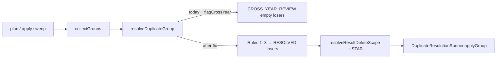

# Design — Results / Cross-year same-handle duplicate deletion

- **Module:** results
- **Spec id:** 2026-08-cross-year-duplicate-deletion
- **Depth:** Lite · **Bug Mode**
- **Status:** approved
- **Owner:** ARI server squad
- **Linked requirements:** `./requirements.md` (R-CYD-001, R-CYD-002, NFR-CYD-001)
- **Parent:** `../results/cross-platform-duplicate-resolution/` (amends R-RES-006 / OQ-3 / D-dup-8)
- **Branch / worktree:** `AC-1641-Integration-improvements` @ `alliance-research-indicators-ac1641-duplicates`
- **Last updated:** 2026-08-20

---

## 1. Goals & non-goals

**Goals**
- Same-identity cross-platform groups resolve under Rules 1–3 regardless of `report_year_id` (R-CYD-001).
- Regression locks the exemplar shape TIP+PRMS / two years / one handle (R-CYD-002).
- Parent wording that promised “cross-year never auto-deleted” is corrected (R-CYD-001 AC.4).

**Non-goals**
- Changing family year-scoping inside `resolveResultDeleteScope` / `findResultFamilyIds` (live siblings of the *same* official_code+platform).
- Soft delete, identity sources, STAR guard, multi-identity refusal, sync mapper contracts.
- New API endpoints or UI.

---

## 2. Architecture

Only the **sweep** path passes `flagCrossYear: true` today (`duplicate-resolution.service.ts` → `collectGroups`). Sync already calls `resolveDuplicateGroup` without that flag and already resolves cross-year pairs. This bug is sweep/plan/apply under-deletion relative to the sync resolver and to the business rules.

### 2.1 Composition (touched files)

| Path | Change |
| --- | --- |
| `domain/shared/utils/duplicate-result-priority.util.ts` | Retire or no-op the `flagCrossYear` early-return that emits `CROSS_YEAR_REVIEW` |
| `domain/entities/results/duplicate-resolution.service.ts` | Stop requesting the veto (`flagCrossYear: true`) from `collectGroups` |
| `domain/shared/utils/duplicate-result-priority.util.spec.ts` | Invert/replace R-RES-006 cross-year cases; add exemplar regression |
| Parent `requirements.md` / `design.md` / `runbook.md` | Amend R-RES-006 / D-dup-8 / operator language |

No new modules, DTOs, or migrations.

### 2.2 Reuse

- Existing `resolveDuplicateGroup`, `refuseMultiIdentityLosers`, `StarRelationshipService`, `QueryService.resolveResultDeleteScope`, `DuplicateResolutionRunner`.
- Plan digest / apply gates unchanged.

---

## 3. Data model

**No data model changes.** Classification values already stored in audit rows may still show historical `CROSS_YEAR_REVIEW`; new runs must not emit it for same-identity cross-year groups.

---

## 4. API surface

**No contract change.** `GET …/duplicate-resolution/plan` and `POST …/apply` keep the same shapes; only `classification` / `toDelete` contents change for affected groups (more `RESOLVED`, larger `rowsToDelete`).

---

## 5. Backend behavior

1. **Resolver:** When participants share a cross-platform identity group spanning years, evaluate pairwise Rules 1–3 (and Gates A/B) exactly as for same-year groups. Do not short-circuit to `CROSS_YEAR_REVIEW`.
2. **Sweep wiring:** `collectGroups` must not re-enable the veto (pass `false` / omit option / delete the option if unused).
3. **Enum:** `CROSS_YEAR_REVIEW` may remain for reading old audit rows and for any leftover test fixtures that assert history; it must not be assigned by the live sweep path after this fix (OQ-CYD-2 default).
4. **Deletion scope (unchanged):** Expanding a PRMS loser still year-scopes **that** platform+official_code family. The TIP winner is a different identity — it is not deleted by expanding the PRMS seed. That is why removing the group-level year veto does not collapse multi-year TIP families into the PRMS delete.

---

## 6. Frontend / UX

None.

---

## 7. Design decisions

### DD-1 — Remove the sweep year veto (not a second apply path)

- **Choice:** Option A from the proposal — stop classifying same-identity cross-year groups as `CROSS_YEAR_REVIEW`; resolve under existing rules.
- **Rejected:** Option B (HITL-only apply for `CROSS_YEAR_REVIEW`) — leaves under-deletion as default; does not match approved intent.
- **Rejected:** Changing year filters on family delete — wrong layer; would risk deleting live siblings of the same platform identity across years, which R-RES-006’s *family* conservatism still wants.
- **KZ-002:** Publication identity is the handle, not “same report year.”

### DD-2 — Prefer flipping the call site + util branch together

- **Choice:** Change both `collectGroups` and the util early-return so a future caller cannot reintroduce the veto by passing `true` alone without failing tests (util tests assert resolve-with-years under the former flag, or the flag is removed).
- **Rejected:** Only changing `collectGroups` and leaving a live `flagCrossYear: true` branch — a one-line regression away from DC-A.

### DD-3 — Parent doc amendment is in scope

- **Choice:** Update parent R-RES-006 / design / runbook in the same execution so operators and Reviewers do not follow superseded “never delete cross-year” guidance (R-CYD-001 AC.4, DC-C).

---

## 8. Reversion challenge (Step 2.3)

**Reverted behavior:** Sweep auto-deletion confined to same `report_year_id`; cross-year → `CROSS_YEAR_REVIEW`, delete nothing (parent R-RES-006 / D-dup-8; util spec block `resolveDuplicateGroup — report-year scope`).

**Challenge: what does removing this break?**

| Concern | Outcome |
| --- | --- |
| Deletes the TIP winner when years differ? | **No** — winner is another platform/official_code; family expansion is per seed identity and year-scoped for live siblings of *that* seed only. |
| Deletes other-year live rows of the *same* PRMS official code? | **Still protected** by `findResultFamilyIds` year scope — unchanged. |
| Sync path divergence? | **Aligns** sweep with sync (sync already omits `flagCrossYear`). |
| Operator review queue / dry-run size? | **Yes — intentional.** More groups enter `toDelete` (parent ~56 cross-year; PRMS↔TIP KP heavily cross-year). Mitigated by existing plan digest + HITL dry-run before apply (DC-D). |
| Existing util tests expecting `CROSS_YEAR_REVIEW`? | **Must be rewritten** as part of R-CYD-002 — failing to update them would leave green tests for the old veto. |
| AICCRA non-re-sync risk? | **Unchanged class** — any AICCRA loser was already irreversible; cross-year AICCRA losers now become eligible. Runbook §0 still applies; dry-run review remains mandatory. |

**Challenge result:** No unaddressed breakage. Design keeps family year-scoping; only the *group classification* veto is removed. Proceed.

---

## 9. Budget (Step 2.4)

| Signal | Estimate |
| --- | --- |
| **Tasks** | 2–3 |
| **LOC** | ~80–150 (util + call site + tests + parent doc edits) |
| **Review rounds** | 1–2 |

Depth **Lite** matches: single root cause, no API/schema, small LOC. Tripwire for `/akili-execute`: escalate if >3 tasks or >250 LOC without user ack.

---

## 10. Risks & rollout

| Risk | Mitigation |
| --- | --- |
| Larger irreversible delete set on first apply | Plan dry-run HITL; `hard_delete_enabled` still gates destruction |
| Parent OQ-3 product flip | Recorded approved via proposal Option A (2026-08-20) |
| Stale CROSS_YEAR language in parent docs | DD-3 / R-CYD-001 AC.4 |
| KZ-004 | Verification = `npm test` util pattern; live apply remains human-gated |

---

## 11. Requirement traceability

| Requirement | Design |
| --- | --- |
| R-CYD-001 | DD-1, DD-2, §5, parent doc DD-3 |
| R-CYD-002 | Util spec rewrite + exemplar case |
| NFR-CYD-001 | No change to runner soft-delete ban |
