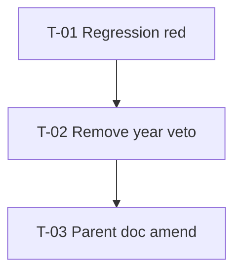

# Tasks — Results / Cross-year same-handle duplicate deletion

- **Module:** results
- **Spec id:** 2026-08-cross-year-duplicate-deletion
- **Depth:** Lite · **Bug Mode**
- **Status:** in-progress (T-02 done; next T-03)
- **Owner:** ARI server squad
- **Linked requirements:** `./requirements.md`
- **Linked design:** `./design.md` (DD-1, DD-2, DD-3; budget 2–3 tasks / ~80–150 LOC)
- **Branch / worktree:** `AC-1641-Integration-improvements` @ `alliance-research-indicators-ac1641-duplicates`
- **Last updated:** 2026-08-20
- **Estimated LOC (spec):** ~100–140
- **PR strategy:** **Single PR** on AC-1641 (well under ~400 LOC; one fix + docs)

---

## 1. Dependency graph

- T-01 before T-02 (Bug Mode: red before green).
- T-03 after T-02 so docs describe shipped behavior.

---

## 2. Coverage map (scenario / clause → task)

| Requirement clause | Owner |
| --- | --- |
| R-CYD-001 AC.1 + Scenario Exemplar 7154/27277 | T-01 (fixture), T-02 (behavior) |
| R-CYD-001 AC.2 (plan no longer CROSS_YEAR for that group) | T-02 (collectGroups wiring); live confirm optional HITL |
| R-CYD-001 AC.3 (same-platform still SAME_SYSTEM_IGNORED) | T-01 / T-02 (keep or add negative case) |
| R-CYD-001 AC.4 + Scenario “must NOT CROSS_YEAR solely for years” | T-02 + T-03 |
| R-CYD-001 AND IT MUST refuse same-platform | T-01 / T-02 |
| R-CYD-002 AC.1–AC.3 (regression fidelity) | T-01 |
| NFR-CYD-001 (no soft-delete) | T-02 (no new soft path; verify by absence) |

---

## 3. Task list

### T-01 — Add failing regression for cross-year same-handle resolve

- **Status:** [x] done
- **Size:** S
- **Dependencies:** none
- **Requirements covered:** R-CYD-002 (all ACs); R-CYD-001 Scenario Exemplar + AC.3 negative shape
- **Design refs:** DD-2; design §9 budget
- **Skills:** `nestjs-expert`, `systematic-debugging`
- **Files touched (intended):**
  - `server/researchindicators/src/domain/shared/utils/duplicate-result-priority.util.spec.ts`
- **Scope:**
  - Replace/invert the block `resolveDuplicateGroup — report-year scope (R-RES-006)` that expects `CROSS_YEAR_REVIEW` when `flagCrossYear: true`.
  - Add (or rewrite to) a case: TIP KP year 2022 + PRMS KP year 2023, same conceptual group → expect `RESOLVED`, winner TIP, loser PRMS — **under the same options the sweep uses today** (`flagCrossYear: true` if still present), so the test fails on current code (KZ-001 / R-CYD-002 AC.3).
  - Keep a same-platform multi-year case asserting `SAME_SYSTEM_IGNORED` (R-CYD-001 AC.3).
- **Tests:** this task *is* the test authoring; do not implement the product fix here.
- **Verification:**
  - Pass: `cd server/researchindicators && npm test -- --silent --testPathPattern=duplicate-result-priority` shows the **new/rewritten cross-year case FAILING** and records that failure (red-before evidence).
  - **Disqualifier:** if the suite is green on unfixed code, the regression does not encode the bug — rewrite until it fails for the right reason.
  - **Fail input:** current util with `flagCrossYear: true` + two platforms + two years → must fail an assertion that expects `RESOLVED`.
- **Done criteria:**
  - [x] Cross-year TIP+PRMS fixture exists and fails on HEAD of AC-1641 before T-02.
  - [x] Same-platform multi-year still expects `SAME_SYSTEM_IGNORED`.
  - [x] Failure output saved/cited in execution notes (or commit message body) as red-before proof.

---

### T-02 — Remove sweep year veto; make T-01 green

- **Status:** [x] done
- **Size:** S
- **Dependencies:** T-01
- **Requirements covered:** R-CYD-001 AC.1–AC.3; NFR-CYD-001
- **Design refs:** DD-1, DD-2, §5
- **Skills:** `nestjs-expert`
- **Files touched (intended):**
  - `server/researchindicators/src/domain/shared/utils/duplicate-result-priority.util.ts`
  - `server/researchindicators/src/domain/entities/results/duplicate-resolution.service.ts`
  - `…/duplicate-result-priority.util.spec.ts` (only if assertions need to match final API after flag removal)
  - Optionally comments in `duplicate-candidate.repository.ts` that still describe CROSS_YEAR classification from `reportYears > 1`
- **Scope:**
  - Retire the `flagCrossYear` early-return that emits `CROSS_YEAR_REVIEW` (remove option or make it a no-op).
  - Change `collectGroups` so it no longer passes `flagCrossYear: true`.
  - Do **not** alter `resolveResultDeleteScope` / soft-delete paths.
  - Leave enum value `CROSS_YEAR_REVIEW` for historical audit readability unless a compile error forces cleanup.
- **Tests:** T-01 suite must pass after this change; existing util matrix must still pass.
- **Verification:**
  - Pass: `npm test -- --silent --testPathPattern=duplicate-result-priority` → green, including exemplar.
  - Pass: `npm test -- --silent --testPathPattern=duplicate-resolution` (service/controller/runner specs that mention classification) → green or update only comments/fixtures that asserted live CROSS_YEAR emission.
  - **Disqualifier:** greening by deleting the regression or by not exercising the sweep options path.
  - **Fail input:** re-introduce `flagCrossYear: true` early-return → T-01 must fail again.
  - NFR-CYD-001: grep confirms no new call to soft `delete_result` / `deleteLogicalResultById` in the touched delete path.
- **Done criteria:**
  - [x] T-01 green on the fixed util + call site.
  - [x] No soft-delete fallback introduced.
  - [x] Family year-scoping code paths untouched (diff does not modify `query.service.ts` delete scope).

---

### T-03 — Amend parent R-RES-006 / design / runbook language

- **Status:** todo
- **Size:** S
- **Dependencies:** T-02
- **Requirements covered:** R-CYD-001 AC.4
- **Design refs:** DD-3
- **Skills:** `cognitive-doc-design` (doc edits only)
- **Files touched (intended):**
  - `docs/specs/results/cross-platform-duplicate-resolution/requirements.md` (R-RES-006 + OQ-3 resolution note)
  - `docs/specs/results/cross-platform-duplicate-resolution/design.md` (cross-year “never auto-deleted” bullets / D-dup-8)
  - `docs/specs/results/cross-platform-duplicate-resolution/runbook.md` (operator expectations)
- **Scope:**
  - State that same-identity cross-year groups **resolve and may delete** under Rules 1–3; year remains a **filter** on plan/apply, not a veto.
  - Point to this bugfix as the amendment source.
  - Correction closure: grep the parent spec folder for `CROSS_YEAR_REVIEW` / “never auto-deleted” / “confined to the same report year” and update or mark historical.
- **Verification:**
  - Pass: `rg -n 'never auto-deleted|confined to (the )?same report year|flagCrossYear: true' docs/specs/results/cross-platform-duplicate-resolution/` shows no live guidance contradicting R-CYD-001 (historical changelog lines may remain if labeled as superseded).
  - **Disqualifier:** only editing one file while sibling docs still instruct operators to treat all cross-year as review-only.
  - **Fail input:** a sentence that still tells operators cross-year same-handle groups are never deleted.
- **Done criteria:**
  - [ ] R-RES-006 text amended.
  - [ ] Design + runbook aligned.
  - [ ] Forward grep of superseded veto language is clean or explicitly historical.

---

## 4. Out of task scope (do not pull in)

- Enabling/disabling `hard_delete_enabled` policy.
- Live `apply` against shared dev DB (HITL / ops; note exemplar in execution.md if run).
- Sync-path refactors beyond what already works without `flagCrossYear`.
