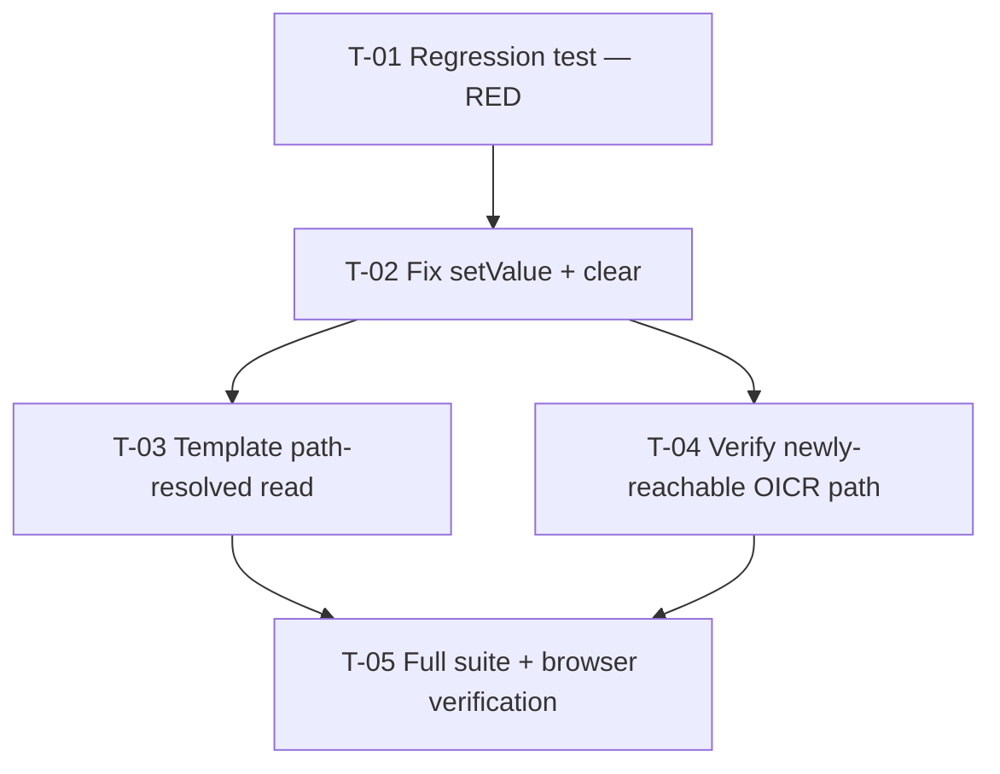

# Tasks — bugfix / multiselect-nested-signal-path

- **Module:** client — `shared/components/custom-fields/multiselect`
- **Spec id:** 2026-08-multiselect-nested-signal-path
- **Status:** in-progress — T-01 `[x]`; T-02…T-05 `[ ]`
- **Owner:** d.casanas@cgiar.org
- **Depth:** **Lite** + **Bug Mode**
- **Linked requirements:** [`./requirements.md`](./requirements.md)
- **Linked design:** [`./design.md`](./design.md)
- **Judgment ledger:** [`./judgment.md`](./judgment.md)
- **Last updated:** 2026-08-03

---

## 1. Dependency graph



**T-01 must be observed red before T-02 starts.** That ordering is the entire falsifiability argument of this spec (**KZ-001**, NFR-MNP-001) — a test authored after the fix cannot prove it was ever broken.

---

## 2. Budget check

`design.md` §10 allocates **5 tasks / ~110 LOC / 1 review round**. If execution exceeds these, **stop and escalate** rather than continue — over-budget here means the diagnosis missed something.

---

## 3. Task list

### [x] T-01 — Regression test for nested paths (must be RED)

> **Executed 2026-08-03 — PASS on attempt 2.** Block `Nested signal path write-through (bugfix regression)` is RED (5 failed / 2 passed) against the real `UtilsService`. Audit trail: [`./execution.md`](./execution.md).
> **Carried forward to T-02:** the manual mutation-kill (revert the single `setValue` write line, confirm red, restore) can only run once the fix turns this block green.

- **Requirements covered:** R-MNP-001, R-MNP-002, R-MNP-003, R-MNP-004, R-MNP-005, NFR-MNP-001
- **Design references:** §9 DD-3, §7.1 invariants
- **Files touched:** `client/research-indicators/src/app/shared/components/custom-fields/multiselect/multiselect.component.spec.ts`
- **Size:** M · **Dependencies:** none · **Skills:** `angular-developer`, `tdd`

**Scope.** Append **one new `describe` block**. Do not modify the existing cases — their `UtilsService` mock stays as-is (out of scope, per DD-3).

**Setup mechanics — non-negotiable (Judgment Day C-4):**

| Step | Detail |
| --- | --- |
| 1 | `TestBed.resetTestingModule()` in the block's `beforeEach` **and** `afterEach` |
| 2 | Provide the **real** `UtilsService` — not a mock |
| 3 | Re-supply the five doubles lost by the reset: `ElementRef`, `ActionsService`, `ServiceLocatorService`, `CacheService`, `AllModalsService` |
| 4 | Copy the shape of the existing SSR block at `multiselect.component.spec.ts:1512-1531` |

Skipping step 1 throws *"Cannot configure the test module when the test module has already been instantiated"*.

**Cases:**

| # | Requirement | Assertion |
| --- | --- | --- |
| 1 | R-MNP-001 AC.1 | `Object.keys(signal())` contains **no** key with a `.` — *lead with this; it is mock-independent and cannot false-green* |
| 2 | R-MNP-001 AC.2 | `selectedOptions().length === 2`, `isInvalid() === false` |
| 3 | R-MNP-001 AC.3 | `group.is_attending_organization` still `true` |
| 4 | R-MNP-002 AC.1 | `body().value === [1,2]` **after `TestBed.flushEffects()`** |
| 5 | R-MNP-003 | `clear()` leaves `[]` at the nested path, no dotted key |
| 6 | R-MNP-004 AC.1/2/4 | Flat control passes; new root reference; single-segment shape preserved |
| 7 | R-MNP-005 AC.1/2 | `signal() === {}` and `group: null` → no throw |

**Done criteria:**
- [ ] The block runs against the **real** `UtilsService` (grep the providers to confirm no `UtilsService` mock in this block)
- [ ] `npx jest --coverage=false -t "<block name>"` is **RED** on unmodified `main`
- [ ] Case 4 asserts **after** a flush — without it the assertion passes on broken code
- [ ] Failure output shows a real assertion diff, **not** a TestBed setup error

**Evidence that does NOT count:**
- A green first run. That means the mock leaked in — the test proves nothing.
- A red run whose output is `"Cannot configure the test module…"`. That is a setup error masquerading as a red, and it burns the budgeted review round (Judgment Day C-4).
- **Falsifiability check (verified available in this repo's toolchain — Jest, `npm test`):** after T-02 turns it green, manually revert the single `setValue` write line, re-run, confirm **red**, restore. No mutation-testing tool is configured in this repo; this manual mutation-kill is the substitute and must be performed, not assumed.

---

### T-02 — Write through the path in `setValue` and `clear`

- **Requirements covered:** R-MNP-001, R-MNP-002, R-MNP-003, R-MNP-004, R-MNP-005
- **Design references:** §7.1 (+ invariants I-1…I-4), §9 DD-1, DD-2, DD-4
- **Files touched:** `client/research-indicators/src/app/shared/components/custom-fields/multiselect/multiselect.component.ts`
- **Size:** S · **Dependencies:** T-01 (must be red first) · **Skills:** `angular-developer`

**Scope.** Add a **private** clone-then-assign path writer; use it in `setValue` (`:401`) and `clear` (`:374-377`).

**Invariants (design §7.1) — each is breakable while still passing every AC:**

| # | Invariant |
| --- | --- |
| I-1 | Single-segment path reduces to exactly `{ ...current, [key]: value }` |
| I-2 | `setValue` **reassigns** `nextState` from the helper — otherwise `queueMicrotask` emits `undefined` to every `(selectEvent)` subscriber (`:405`) |
| I-3 | Missing/`null` intermediate segment is created as a plain object |
| I-4 | Existing intermediate segments keep their other keys |

**Explicitly do NOT (design DD-2):**
- Modify `syncBodyWithSignal`, `selectedOptions`, `onChange`, `removeOption`, or `setBodyFromSignal`.
- Modify `UtilsService.setNestedPropertyWithReduce` — it has 9+ callers outside this component (**KZ-003**).
- Fold in unrelated cleanup. This is a bugfix.

**Done criteria:**
- [ ] T-01's block is **green**
- [ ] `prevItems` is still read from the pre-write state (ordering preserved)
- [ ] No method outside `setValue` / `clear` / the new private helper is touched — verify with `git diff`

**Evidence that does NOT count:**
- T-01 green **without** having observed it red first. Ordering is the proof.
- A targeted run only. Blast radius is T-05's job (**KZ-003**).

---

### T-03 — Path-resolve the template's literal-key read

- **Requirements covered:** R-MNP-006
- **Design references:** §7.1.1, §2 hop ⑤
- **Files touched:** `client/research-indicators/src/app/shared/components/custom-fields/multiselect/multiselect.component.html`
- **Size:** S · **Dependencies:** T-02 · **Skills:** `angular-developer`

**Scope.** Line 1 — `@let list = this.signal()[this.signalOptionValue];` — currently indexes by the raw path. Derive it from the path-resolved selection instead; `selectedOptions()` already computes exactly this. `list` is consumed only at `:96` for skeleton-row count.

**Done criteria:**
- [ ] Line 1 no longer indexes the signal by raw `signalOptionValue`
- [ ] Skeleton row count during loading equals selected-item count for a nested path
- [ ] The `#defaultTemplate let-list` at `:15` is untouched — it is an unrelated shadowed variable

**Evidence that does NOT count:**
- "It compiles." The branch only renders while `currentResultIsLoading() || !optionsSig().length`; a passing build says nothing about it. Exercise the loading branch or assert the count directly.

---

### T-04 — Verify the newly-reachable OICR path *before* shipping

- **Requirements covered:** D-6 (requirements §6), R-3 · **Design references:** §2.1, DD-5, R-4/R-5
- **Files touched:** none expected — **investigation task**. If a guard proves necessary, it lands here.
- **Size:** M · **Dependencies:** T-02 · **Skills:** `angular-developer`, `systematic-debugging`

**Why this task exists.** The fix restores a **dead data path**. Today `setValue` never populates `step_three.countries`, so everything downstream has never executed. Judgment Day C-2 flagged that no gate in this spec covers it.

**Verify, in order:**

1. **Sub-national cascade.** `setValue` produces plain clones (`multiselect.component.ts:394-398`) carrying no `result_countries_sub_nationals_signal`; `create-oicr-form.component.html:360, 361, 380` calls it as a function **unguarded**; the signal attaches only later via the effect at `create-oicr-form.component.ts:470-477`. Determine whether a render can occur between population and attachment. **If yes → add the guard in this task.**
2. **`isCompleteStepThree`** (`create-oicr-form.component.ts:423-424`) turns true for `geo_scope_id > 1` once countries/regions populate.
3. **`removeOption` re-entrancy (R-3, uncorroborated).** It emits `selectEvent` inside `signal.update()` before the outer `return { ...current }` (`:424-428`) — the clobbering shape documented at `pool-funding-alignment.component.ts:336-341`. `create-oicr-form.component.html:340` binds `(selectEvent)`. Remove a chip at an OICR country multiselect and confirm no lost write.

**Done criteria:**
- [ ] Each of the three checks has a recorded **observed** outcome — not a reasoned prediction
- [ ] Any guard added is minimal and justified against a reproduced failure
- [ ] If all three pass clean, record that explicitly so `/akili-validate` can see the path was examined

**Evidence that does NOT count:**
- Code reading alone. This task exists precisely because static reasoning already disagreed between two reviewers — one called `removeOption` correct, the other flagged it. Only an observed render settles it.
- A green unit suite. This path has no unit coverage; that is the entire premise of D-6.

---

### T-05 — Full suite + both browser verifications

- **Requirements covered:** R-MNP-004 AC.3, D-2, D-5 · **Design references:** §11 R-1, R-4
- **Files touched:** none
- **Size:** S · **Dependencies:** T-03, T-04 · **Skills:** `angular-developer`

**Automated:**
```
cd client/research-indicators && npm test -- --silent
```
Full suite, **not** targeted — 30 callers render this component (**KZ-003**). Then `npm run lint -- --quiet` (⚠️ the script carries `--fix` and **mutates files**; re-check `git status` after).

**Manual — both mandatory (requirements §6 D-5):**

| # | Surface | Script |
| --- | --- | --- |
| 1 | CapSharing | `/result/<code>/capacity-sharing` → "Yes" → select two organizations → stay ticked, chips render, required error clears, **Save** persists after reload |
| 2 | **OICR create step 3** | Open the OICR create modal → geographic scope with `geo_scope_id > 1` → select regions and countries → selections persist, `isCompleteStepThree` turns true, sub-national rows render **with no console error** |

**Reproduce the failure first as a control** (**KZ-006**) — confirm the broken behavior on unmodified code before verifying the fix, or the check cannot distinguish "fixed" from "never reproduced here".

**Done criteria:**
- [ ] Full client suite green; no coverage floor regressed
- [ ] `git status` clean of unintended lint mutations
- [ ] Both browser scripts executed with the control step, outcomes recorded
- [ ] **Browser console open and clean during script 2** — this is the only gate for D-6

**Evidence that does NOT count:**
- Script 1 alone. It was the original scope error (Judgment Day C-1); CapSharing cannot vouch for OICR.
- Script 2 without the console visible. D-6's predicted failure mode is a render-time `TypeError` — invisible if nobody is looking at the console.
- A suite run started while another agent is active — it competes for `node_modules` and build output, producing a **wrong** result, not a slow one.

---

## 4. Traceability

| Requirement | T-01 | T-02 | T-03 | T-04 | T-05 |
| --- | :-: | :-: | :-: | :-: | :-: |
| R-MNP-001 | ● | ● | | | |
| R-MNP-002 | ● | ● | | | |
| R-MNP-003 | ● | ● | | | |
| R-MNP-004 | ● | ● | | | ● |
| R-MNP-005 | ● | ● | | | |
| R-MNP-006 | | | ● | | |
| NFR-MNP-001 | ● | | | | |
| D-6 / R-3 | | | | ● | ● |

Every requirement appears in ≥1 task; every task references ≥1 requirement. No circular dependencies.
