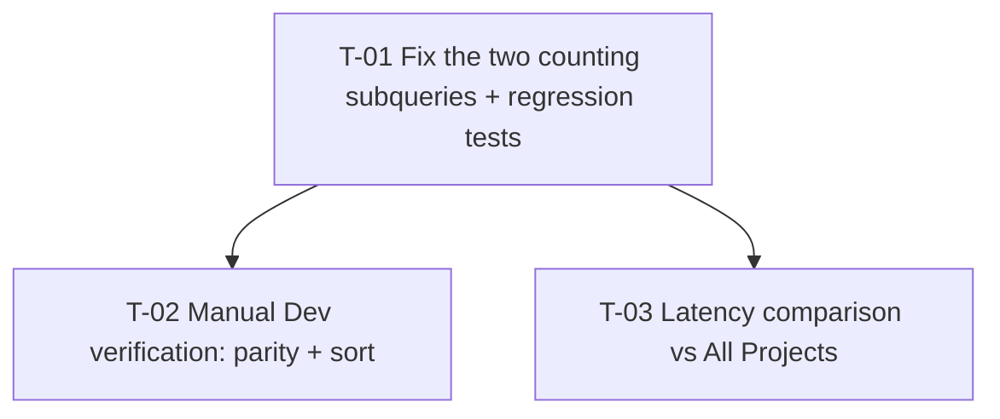

# Tasks — bugfix / my-projects-result-count-scope

- **Module:** agresso (server)
- **Spec id:** 2026-09-my-projects-result-count-scope
- **Status:** in-progress
- **Owner:** David Felipe Casañas Hernández
- **Linked requirements:** ./requirements.md
- **Linked design:** ./design.md
- **Linked judgment:** ./judgment.md (Judgment Day, ESCALATED on count; 0 severe outstanding)
- **Depth:** Lite · **Type:** Bug (Bug Mode)
- **Last updated:** 2026-09-02

---

## 1. Task numbering

`T-01` … `T-03`. Numbers are not priority — see §2.

---

## 2. Dependency graph

T-02 and T-03 are independent of each other and both require T-01 deployed to Dev.

---

## 3. Task list

### T-01 — Un-scope both counting subqueries and prove it with red-before-green tests

- **Requirements covered:** R-MPC-001 (AC.1, AC.2, AC.3), R-MPC-002 (AC.1, AC.2), R-MPC-003 (AC.1), R-MPC-004 (AC.1)
- **Design references:** §2.1 Composition · §10.1 arrangement · §10.2 test list · §10.2.1 named patterns · §12 DD-1, DD-2, DD-3, DD-4
- **Defect classes gated:** DC-1, DC-1b, DC-2, DC-3, DC-4, DC-6 (field map), DC-7, DC-8 (partial)
- **Files touched (intended):**
  - `server/researchindicators/src/domain/entities/agresso-contract/repositories/agresso-contract.repository.ts`
  - `server/researchindicators/src/domain/entities/agresso-contract/repositories/agresso-contract.repository.spec.ts`

- **Description:** Remove the `user` parameter from `buildContractTotalResultsCountSql` and the `created_by`
  predicate from the `result_counts` subquery, leaving every row-visibility mechanism untouched. Write the
  tests **first**, observe them red on unmodified `HEAD`, then make the production edit.

- **Implementation notes (one clause per row, KZ-011):**
  - Delete the `userFilter` ternary at `:315-317` and drop the `user` parameter from the signature at `:314`.
  - Reduce `:326` from `${userFilter})` to `)`.
  - Drop the argument at the call site `:402`; **leave the `, (` … `)` wrapper parens in place** — `RE_SUBQUERY_CLOSED` depends on them (design §10.2.1).
  - Delete the conditional `AND r.created_by` predicate at `:553`.
  - Do **not** touch `userContracts()` (`:429-438`), the visibility clause (`:449`, `:529`), the carnet lookup (`:417-425`), or the `orderBy` field map (`:343`).
  - Do **not** reorder the four WHERE predicates in the counting subquery — `RE_SUBQUERY_CLOSED` pins `rc_ord.is_primary = TRUE` as the last one.
  - Write `RE_USER_TOKENS` and `RE_SUBQUERY_CLOSED` from the JS block in design §10.2.1, **not** from a table cell.
  - Every test uses the §10.1 arrangement: `pagination: { page: 1, limit: 10 }` **and** `mockQueryBySql({ carnet: [{ carnet: 'CARNET-1' }], count: [{ total: 1 }], main: [] })`.
  - Any test that calls `getContracts` twice must capture the SQL after each call or `mockClear()` between them — `sqlContaining` is first-match-wins (`spec:522-527`).

- **Tests:** `agresso-contract.repository.spec.ts` — TS-1 (rewrites `:629-638`), TS-5 (extends `:640-648`), and TS-2, TS-3, TS-4, TS-6 added. Global coverage threshold 60% unchanged.

- **Acceptance / done check:**
  - [x] **TS-1, TS-2 and TS-3 observed RED on unmodified `HEAD`**, output pasted verbatim into `execution.md`, *before* any production edit.
  - [x] TS-1's red is the two count assertions — **not** an empty `countSql()` and **not** a `'null'` carnet. If it reddens for either of those reasons the arrangement is wrong, not the product.
  - [x] TS-4, TS-5, TS-6 are HEAD-**green** guards; their falsifiability is shown by mutation and recorded as a mutation result, never as a HEAD red.
  - [x] After the fix: all six green, and the full spec file green.
  - [x] `npm test -- --silent` green for the whole server package, re-measured **in isolation** (§4.3 concurrency).
  - [x] `npx eslint <changed files>` clean — **not** `npm run lint` (K-001: it carries `--fix` and mutates).

- **What disqualifies this evidence:**
  - A red observed for TS-1 that disappears when only the arrangement is corrected — that red was about the test, not the defect.
  - Any of TS-1/TS-2/TS-3 still passing on `HEAD`: the gate does not discriminate and must be rewritten before the fix lands (KZ-001, 13 recurrences; already materialised once in this spec's own round-1 design).
  - A green suite obtained while another agent or a second full-suite run was active — that is a wrong measurement, not a slow one (§4.3, and the `excel-workbook.builder.spec.ts` phantom-failure precedent).
  - Using `npm run lint` as the gate — it rewrites the files it inspects and cannot verify.

- **Name the input that makes each check fail (K-012):** restore `AND r_ord.created_by = ${user.sec_user_id}` at `:316` → TS-1 and TS-2 red · restore `AND r.created_by` at `:553` → TS-1 and TS-3 red · delete the visibility clause at `:449`/`:529` → TS-1 red · make `userContracts()` return `''`, or drop only the `LEFT JOIN results r` → TS-4 red · delete the closing-paren line at `:326` **from the fixed code** → TS-5 red via `RE_SUBQUERY_CLOSED` · change the `COUNT_RESULTS` field map → TS-6 red.

- **Skills:** `nestjs-expert`, `systematic-debugging`, `tdd`
- **Dependencies:** none
- **Estimated effort:** S (~7 production LOC, ~110 test LOC)
- **Status:** done

---

### T-02 — Manual Dev verification: cross-tab parity and sort order

- **Requirements covered:** R-MPC-001 (AC.1), R-MPC-002 (AC.3), R-MPC-004 (AC.2)
- **Design references:** §10.4 (what the unit suite cannot reach) · §11 Rollout
- **Defect classes gated:** **DC-5 and DC-6 — the two classes with no automated gate at all.**
- **Files touched:** none (verification only)

- **Description:** The repository spec mocks `query()`. It proves the SQL was *written* correctly and can
  prove nothing about what MySQL returns. This task is the substitute gate named in `requirements.md` §8, and
  it is **required evidence**, not a nicety.

- **Steps:**
  1. Pick one contract code visible on both tabs (e.g. `A1048`).
  2. `GET …/find-contracts?current-user=true&page=1&limit=10&with-indicators=false` — record its `count_results`.
  3. `GET …/find-contracts?current-user=false&contract-code=<code>` — record its `count_results`.
  4. Record `metadata.total` for the `current-user=true` request and compare against a pre-deploy capture.
  5. Load **My Projects**, sort by **Results** DESC, and read the column top to bottom.

- **Acceptance / done check:**
  - [x] The two `count_results` values in steps 2 and 3 are **equal** — both `112` for `A1048` on Dev, 2026-09-02 (see `execution.md`). Deploy confirmed via `git log origin/dev`.
  - [ ] `metadata.total` and the ordered `agreement_id` list for a fixed request are **unchanged** vs. the pre-deploy capture (R-MPC-002 — the fix must not widen the row set). **DECLARED UNVERIFIED** — no pre-deploy baseline was captured and the merge to `dev` has landed, so the comparison is unavailable for this deployment. A structural argument (visibility mechanism byte-identical) is recorded in `execution.md` and is explicitly **not** a substitute.
  - [x] The Results column under DESC is non-increasing **and** its values match what All Projects shows for the same contracts — `A1048`=112, `A1065`=39 on both tabs, DESC active (Dev, 2026-09-02). Closes DC-6.
  - [x] Screenshots or raw JSON for steps 2, 3 and 5 attached to `execution.md` — committed under `evidence/` and read back from the committed files, not from the paste.

- **What disqualifies this evidence:**
  - A pre-deploy capture taken from a different environment or a different page size — it is not a baseline.
  - Comparing a contract that appears on only one tab: it cannot demonstrate parity.
  - Prose describing the screens instead of the screens themselves (KZ-014: prose offered as screenshots is not evidence).
  - **If this task is skipped, DC-5 must be reported as an accepted, unmitigated risk — never as covered.** A green T-01 does not discharge it.

- **Skills:** none required
- **Dependencies:** T-01 deployed to Dev
- **Estimated effort:** S
- **Status:** done

---

### T-03 — Latency comparison against the All Projects path

- **Requirements covered:** NFR-MPC-001
- **Design references:** §10.4 · requirements §4
- **Defect classes gated:** none (NFR, not a defect class)
- **Files touched:** none (measurement only)

- **Description:** The counting subquery loses a selective predicate on a query users hit constantly — the
  round-1 judgment established that `result_counts` is emitted on **every** `getContracts` call, not only when
  `with-indicators=true`. One deliberate comparison, not measure-only-if-reported.

- **Steps:** measure `current-user=true&limit=10` against `current-user=false&limit=10` on the same
  environment, same page size, three runs each, nothing else running.

- **Acceptance / done check:**
  - [ ] p95 for the `current-user=true` path is within the p95 already observed for `current-user=false` at the same page size.
  - [ ] The three runs per path and their spread are recorded, not just the summary figure.

- **What disqualifies this evidence:**
  - **A measurement taken while a delegated worker is active** (§4.3) — that is a wrong number, not a slow one.
  - **If the three runs vary by more than the difference being measured, there is no result.** Report the spread and say the comparison was inconclusive; do not commit a number. An inconclusive measurement is a legitimate outcome here and must be reportable as one.

- **Skills:** none required
- **Dependencies:** T-01 deployed to Dev
- **Estimated effort:** S
- **Status:** waived (accepted, unmeasured risk — user decision 2026-09-02)

---

## 4. Requirement → task coverage (scenario and clause granularity)

Closure is at clause level, not requirement ID. Every `BUT it must NOT` and `AND IT MUST` is listed.

| Requirement / clause | Owned by |
| --- | --- |
| R-MPC-001 scenario "Same contract, both tabs" | T-01 (TS-2), T-02 (step 2 vs 3) |
| R-MPC-001 · BUT NOT return `21` or any value derived from `sec_user_id` / `created_by` / carnet | T-01 (TS-1 `RE_USER_TOKENS`, TS-2 predicate count) |
| R-MPC-001 · AND IT MUST emit the same counting-predicate set with and without a user | T-01 (TS-2 with user + TS-5 without) |
| R-MPC-001 AC.1 / AC.2 / AC.3 | T-01 (TS-1, TS-2, TS-5); AC.1 also T-02 |
| R-MPC-002 scenario "Row set is untouched" | T-01 (TS-1, TS-4), T-02 (step 4) |
| R-MPC-002 · BUT NOT drop the carnet lookup or the visibility clause from **either** query | T-01 (TS-1 asserts the clause in `mainSql()` **and** `countSql()`; TS-4 asserts `ac.projectLeadId = 'CARNET-1'`) |
| R-MPC-002 · AND IT MUST keep the `result_contracts` **and** `results` LEFT JOINs | T-01 (TS-4 — both joins, both queries) |
| R-MPC-002 AC.1 / AC.2 / AC.3 | T-01 (TS-1, TS-4); AC.3 T-02 |
| R-MPC-003 scenario "Indicator breakdown matches the contract total" | T-01 (TS-3) |
| R-MPC-003 · BUT NOT be restricted to results created by the requesting user | T-01 (TS-3 predicate count = 3) |
| R-MPC-003 · AND IT MUST remain `0` for indicators with no results | T-01 (TS-3 gates `HAVING COUNT(...) > 0` and the outer `COALESCE(..., 0)`). **The mapper's `AgressoContractIndicatorObjectDto(indicator, 0)` default is NOT gated by this suite — recorded as DC-8, declared, not claimed** |
| R-MPC-004 scenario "Descending sort on My Projects" | T-01 (TS-6), T-02 (step 5) |
| R-MPC-004 · BUT NOT be ordered by the user's own result counts | T-02 (step 5 — rendered order; no automated gate, DC-6) |
| R-MPC-004 · AND IT MUST keep the `COUNT_RESULTS → 'contract_total_results'` mapping | T-01 (TS-6) |
| R-MPC-004 AC.1 | T-01 (TS-6) |
| R-MPC-004 AC.2 | T-02 (step 5) |
| NFR-MPC-001 | T-03 |

**Declared gaps** (neither satisfied nor silently dropped): DC-5 (real SQL semantics and returned numbers) →
substituted by T-02, and an accepted risk if T-02 is skipped. DC-6 (rendered ordering) → substituted by T-02
step 5. DC-8's mapper half → declared uncovered.

---

## 5. Estimated LOC and PR strategy

| | |
| --- | --- |
| Production | ~7 lines |
| Tests | ~110 lines |
| **Total** | **~117 lines** |

**Single PR.** Well under the ~400-line threshold, one package, one file of production code. Splitting would
separate the fix from the test that proves it, which Bug Mode forbids.

PR title: `fix(agresso-contract.repository): scope find-contracts counts to the contract, not the current user`

Body should state, per `cognitive-doc-design` review-empathy: review `buildContractTotalResultsCountSql` and
the `result_counts` subquery first; the visibility clause and `userContracts()` are deliberately untouched;
the `count-results` sort on My Projects changes from user-scoped to contract-wide **by design**; and the
`:402` wrapper parens are load-bearing for a test assertion.

---

## 6. Execution conventions

- Branch: current integration branch (`FIX-My-contracts-2026`); confirm target before opening the PR.
- Commit style: `<type>(<module>): <subject>`.
- No migration, so nothing to revert on the schema side; K-015's pending-migration trap does not apply.
- Never `--no-verify`.

---

## 7. Risks & blockers log

| # | Date | Risk / Blocker | Mitigation | Owner | Status |
| --- | --- | --- | --- | --- | --- |
| RB-1 | 2026-09-02 | A rewritten test that passes on both old and new code (KZ-001) — **already materialised once** in this spec's round-1 design, caught by Judgment Day | Predicate-count gates instead of substring absence; TS-1/TS-2/TS-3 red on `HEAD` recorded verbatim | Implementer | **closed** — all three observed red on `HEAD` for the right reason, verbatim in `execution.md` |
| RB-2 | 2026-09-02 | `RE_SUBQUERY_CLOSED` goes red on correct code if the `:402` wrapper parens are removed as a cleanup, or the four predicates are reordered | Called out in T-01 implementation notes and design §10.2.1; failure is loud, not silent | Implementer | **closed** — wrapper parens preserved, predicate order intact (Reviewer-verified) |
| RB-3 | 2026-09-02 | T-02 skipped because T-01 is green — leaving DC-5 uncovered while it reads as closed | T-02's done-check states explicitly that a green T-01 does not discharge DC-5 | Leader | **open — live.** T-01 is `done` and green; DC-5/DC-6 remain UNCOVERED until T-02 runs on Dev |

---

## 8. Done definition

- [x] T-01 `done`, T-02 `done`, **T-03 `waived`** — NFR-MPC-001 accepted as an unmeasured risk by user decision (2026-09-02). Not satisfied, not measured; see `execution.md`.
- [ ] Every AC in `requirements.md` checked, and every clause in §4 above owned by a task that ran.
- [x] Coverage thresholds still green (60% server) — verified 2026-09-02: `All files 84.18% stmts / 76.3% branch / 84.55% funcs / 84.22% lines`, `npm run test:cov` exit `0`. Unit config only (`rootDir: src`); not e2e/integration.
- [x] No Swagger change needed — verified 2026-09-02: `agresso-contract.controller.ts:372` reads `'Field to order by (count-results = total active results per contract)'`, which the fix makes true. `mapper-agresso-contract.dto.ts:15` ("same basis as count-results sort") is likewise now accurate.
- [ ] OQ-1 and OQ-2 either resolved or carried forward as a new spec.
- [x] NF-3 and NF-4 from `judgment.md` §9.1 acknowledged **and honored** — both caveats (keep the `:402` wrapper parens; do not reorder the four predicates) were passed verbatim in the Implementer brief, the corrected DC-7 mutation ("delete the closing-paren line at `:326` from the *fixed* code") was the one actually run, and the Reviewer independently confirmed the parens are preserved and `rc_ord.is_primary = TRUE` is still last.
