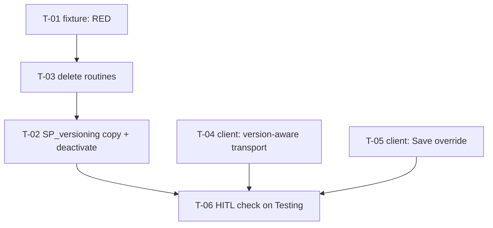

# Tasks — Pool Funding Alignment versioning

| Depth | Mode | Tasks | Est. LOC | PR strategy |
| --- | --- | --- | --- | --- |
| Standard | Bug | **6** | ~3,400 (~160 genuinely new) | **Two PRs** — see §PR strategy |

- **Linked requirements:** [`./requirements.md`](./requirements.md)
- **Linked design:** [`./design.md`](./design.md)
- **Status:** in-progress (T-01 done)
- **Last updated:** 2026-09-16

---

## Dependency graph



`T-03` lands **before** `T-02` on purpose: the tree must never hold a state where the copy exists and the delete routines cannot clear it (FK 1451). `T-04` / `T-05` are cross-package and safe to run in parallel with the server lane — **but never two full-suite runs at once** (root `CLAUDE.md` §4.3).

---

## T-01 — Regression fixture: pool funding survives versioning

| Field | Value |
| --- | --- |
| Status | `[x]` |
| Size | M |
| Depends on | — |
| Requirements | R-PFV-001 (all clauses), R-PFV-002 (all clauses), R-PFV-003 (all three scenarios), NFR-PFV-003 |
| Design | DD-1, DD-2, DD-3, DD-4, §6 |
| Skills | `nestjs-expert`, `systematic-debugging`, `tdd` |

### Scope

Add `server/researchindicators/test/fixtures/sp-versioning-pool-funding.fixture-spec.ts`, modelled on `test/fixtures/sp-versioning-link-results.fixture-spec.ts` — same seeding/teardown contract, same "call the real routine" stance.

Seed one active non-snapshot STAR result with: one active `result_pool_funding_alignment` (`has_contribution = 1`), two active `result_pool_funding_alignment_sp` rows (`SP06`/`PRIMARY`, `SP09`/`CONTRIBUTING`), one active `result_pool_funding_toc_alignment` (`sp_code = 'SP06'`, `aligns_with_toc = 1`, a `level`, `toc_result_id`, `indicator_id` and `quantitative_contribution`), and one active `result_pool_funding_indicator_mapping`. **Vary at least one discriminating field per seeded unit** (KZ-004) — two `_sp` rows with identical defaults cannot distinguish per-row copying from a batch-wide bug.

Also seed **a second, untouched result** with its own active alignment. Nothing in this spec may reach it.

Cases:

1. **Copy** — `CALL SP_versioning`; assert on the new snapshot's `result_id`: the alignment row exists with the same `has_contribution`; both `_sp` rows exist with `sp_code`/`sp_role` preserved and `alignment_id` equal to the **new** alignment's id; the ToC row and the indicator-mapping row exist with every payload column preserved; **every** copied row has a fresh PK.
2. **Negative clauses of R-PFV-001** — an `is_active = FALSE` alignment, `_sp`, ToC and mapping row are each **not** copied; no copied `_sp` row carries the **source** `alignment_id`.
3. **Source deactivation (R-PFV-002)** — after the call, the source result has zero active rows in all four tables; the source rows still **exist** (soft, not hard, delete) with their original ids, `result_id` and `created_at`, and `is_active = 0`; the second seeded result's rows are **still active**.
4. **Empty section (R-PFV-002 `AND IT MUST NOT`)** — version a result that has **no** pool funding rows; assert the call succeeds and no `UPDATE` touched anything.
5. **Duplicate-snapshot guard (NFR-PFV-003)** — call `SP_versioning` twice; the second raises `SQLSTATE 45001`, **and** the source rows are in exactly the state case 3 left them (a rejected call must not deactivate anything a second time or resurrect anything).
6. **Version delete (R-PFV-003 first scenario)** — `SP_versioning`, then `SP_delete_result_version`. Assert **before** the delete that the snapshot carries the rows (otherwise the case passes identically whether the copy landed or silently did not); assert after it that the four tables hold **no** rows for the snapshot's `result_id`, that the snapshot `results` row is gone, and that **no MySQL 1451** was raised. Assert the **live** result's rows were not touched by the delete — seed the live result with an extra inactive row before versioning so there is something to observe.
7. **Re-approval round-trip — pins AR-1 (R-PFV-003 second scenario)** — `SP_versioning` → `SP_delete_result_version` → `SP_versioning`, **without re-filling the section in between**. Assert the sequence completes with no error and the second snapshot carries **zero** pool funding rows. Name it in the test description as the *ruled* behaviour of Decision 4, not as a bug: this assertion exists so that reversing the ruling is a visible test change.
8. **Hard delete (R-PFV-003 third scenario)** — `full_delete_result_version` on a result carrying pool funding rows returns `TRUE`, the four tables hold no rows for it, and the `results` row is gone.

### Verification

```
cd server/researchindicators
npm run migration:test:bootstrap
npm run test:fixtures
```

- **Done when:** the fixture is **RED on current code** — cases 1, 3, 6 and 8 fail.
- **Input that makes it fail:** current `HEAD`. Case 1 fails because no row is copied; case 6 fails with MySQL **1451** on the delete; case 8 fails the same way. **Case 7 is expected to be GREEN on `HEAD`** — with nothing copied, "the second snapshot carries zero rows" is trivially true — so it is *not* part of the required red and must not be counted as evidence of the fix; it is a pin on AR-1, and its real gate is that it stays green **after** T-02 lands. A fixture green everywhere before T-02/T-03 is testing nothing and must be rewritten.
- **Disqualifier — do not report a pass on any of these:** the scratch schema was not bootstrapped; the run errored before assertions (a count over a failed command is a confident zero, K-014); the suite was invoked as `npm test` (`rootDir: "src"`, never reaches `test/fixtures/`, KZ-017); or seeded rows were left behind, which makes the next run's result meaningless.
- **Cannot prove:** anything about Dev, Testing or Prod — only the scratch schema is exercised. Nothing about the rendered screen.

---

## T-02 — Migration: `SP_versioning` copies the four tables and empties the source

| Field | Value |
| --- | --- |
| Status | `[ ]` |
| Size | S (logic) / L (bytes) |
| Depends on | T-01, T-03 |
| Requirements | R-PFV-001, R-PFV-002, R-PFV-006, NFR-PFV-001, NFR-PFV-002, NFR-PFV-003 |
| Design | DD-1, DD-2, DD-3 |
| Skills | `nestjs-expert` |

### Scope

One append-only migration re-declaring `SP_versioning`.

- **Source of truth for the body:** the currently-deployed procedure — `1789149538737-addLinkResultsToVersioningSp.ts` `up()` — copied **verbatim**. Do not reconstruct it by hand.
- Add `DECLARE new_alignment_id BIGINT DEFAULT NULL;` alongside the existing declarations.
- Insert the new blocks immediately **after** the `link_results` block, in this order:

```sql
-- 1) parent, single row, id captured (DD-2)
INSERT INTO result_pool_funding_alignment (
    created_at, created_by, updated_at, updated_by, is_active, deleted_at,
    result_id, has_contribution
)
SELECT pfa.created_at, pfa.created_by, pfa.updated_at, pfa.updated_by,
       pfa.is_active, pfa.deleted_at,
       new_result_id AS result_id,
       pfa.has_contribution
FROM result_pool_funding_alignment pfa
WHERE pfa.is_active = TRUE
  AND pfa.result_id = temp_result_id
LIMIT 1;

SET new_alignment_id = IF(ROW_COUNT() > 0, LAST_INSERT_ID(), NULL);

-- 2) children of the alignment (Pattern B: FK re-mapped, NOT copied)
IF (new_alignment_id IS NOT NULL) THEN
    INSERT INTO result_pool_funding_alignment_sp (
        created_at, created_by, updated_at, updated_by, is_active, deleted_at,
        alignment_id, sp_code, sp_role
    )
    SELECT sp.created_at, sp.created_by, sp.updated_at, sp.updated_by,
           sp.is_active, sp.deleted_at,
           new_alignment_id AS alignment_id,
           sp.sp_code, sp.sp_role
    FROM result_pool_funding_alignment_sp sp
        INNER JOIN result_pool_funding_alignment src
            ON src.id = sp.alignment_id
    WHERE sp.is_active = TRUE
      AND src.is_active = TRUE
      AND src.result_id = temp_result_id;
END IF;

-- 3) result-keyed siblings (Pattern A) — result_pool_funding_toc_alignment
--    and result_pool_funding_indicator_mapping, full column lists,
--    new_result_id AS result_id, WHERE is_active = TRUE AND result_id = temp_result_id.

-- 4) empty the source (R-PFV-002), guarded on the copy having happened (DD-3)
IF (new_alignment_id IS NOT NULL) THEN
    UPDATE result_pool_funding_alignment_sp sp
        INNER JOIN result_pool_funding_alignment src ON src.id = sp.alignment_id
        SET sp.is_active = FALSE, sp.deleted_at = NOW()
        WHERE sp.is_active = TRUE AND src.result_id = temp_result_id;

    UPDATE result_pool_funding_alignment
        SET is_active = FALSE, deleted_at = NOW()
        WHERE is_active = TRUE AND result_id = temp_result_id;

    UPDATE result_pool_funding_toc_alignment
        SET is_active = FALSE, deleted_at = NOW()
        WHERE is_active = TRUE AND result_id = temp_result_id;

    UPDATE result_pool_funding_indicator_mapping
        SET is_active = FALSE, deleted_at = NOW()
        WHERE is_active = TRUE AND result_id = temp_result_id;
END IF;
```

- Every block sits **after** the `SIGNAL 45001` duplicate guard (NFR-PFV-003 — it already does, by placement).
- Deactivate `_sp` **before** its parent alignment, or the join in the `_sp` `UPDATE` no longer finds an active parent.
- `down()` re-declares the pre-change body verbatim (NFR-PFV-001).
- **Out of scope:** any `ALTER TABLE`; `delete_result`; the other 30 blocks.

### Verification

```
cd server/researchindicators
npm run migration:test:bootstrap && npm run test:fixtures
npm run build
npx eslint src/db/migrations/<new-file>.ts
diff <(old body) <(new body)          # R-PFV-006
```

- **Done when:** T-01 cases 1–5 are green, and the body diff shows **only** the intended hunks (the `DECLARE`, the four inserts, the deactivation block).
- **Input that makes it fail:** dropping `AND pfa.result_id = temp_result_id` (copies other results' rows → case 2 red); omitting `is_active = TRUE` (→ case 2 red); using `sp.alignment_id` instead of `new_alignment_id` in block 2 (→ case 1's FK assertion red); dropping the `ROW_COUNT()` guard (→ case 4 red); moving the deactivation before the `SIGNAL` guard (→ case 5 red); any stray edit in the re-pasted body (→ an extra diff hunk).
- **Disqualifier:** a diff with hunks outside the intended set is a **FAIL even if every test is green** — the fixture covers four tables, not the other 30. A green `npm test` is **not** evidence (KZ-017). `npm run lint` is not a gate (it carries `--fix`, K-001).
- **Cannot prove:** that Dev, Testing or Prod received the change (K-015 — a separate human decision, explicitly **not** part of this task's done criteria).

---

## T-03 — Migration: the delete routines clear the four tables

| Field | Value |
| --- | --- |
| Status | `[x]` |
| Size | S (logic) / L (bytes) |
| Depends on | T-01 |
| Requirements | R-PFV-003 (all three scenarios), R-PFV-006, NFR-PFV-001, NFR-PFV-002 |
| Design | DD-4 |
| Skills | `nestjs-expert` |

### Scope

One append-only migration re-declaring **both** `SP_delete_result_version` and `full_delete_result_version`, each built verbatim from its currently-deployed text (`1787083305648-AmendLifecycleRoutinesForInnovationUse.ts`).

Both routines already resolve `temp_result_id` — the snapshot in one, the target result in the other. Add the **same four `DELETE` blocks** to each, placed before the existing `DELETE FROM results`:

```sql
DELETE FROM result_pool_funding_alignment_sp
    WHERE alignment_id IN (
        SELECT rpfa.id
        FROM result_pool_funding_alignment rpfa
        WHERE rpfa.result_id = temp_result_id
    );

DELETE FROM result_pool_funding_alignment
    WHERE result_id = temp_result_id;

DELETE FROM result_pool_funding_toc_alignment
    WHERE result_id = temp_result_id;

DELETE FROM result_pool_funding_indicator_mapping
    WHERE result_id = temp_result_id;
```

- `_sp` **must** precede `alignment` (`fk_rpfas_alignment`). The sub-select is the shape `baseline.sql:5819-5830` already uses for this exact table — reused, not invented.
- **Key on `temp_result_id`, never on `resultCode`.** `SP_delete_result_version` resolves a snapshot that shares its `result_official_code` with a live result; keying the `DELETE` on the code would take the live result's section with it (DD-4).
- Nothing is moved back to the live result (DD-4, owner-ruled — see AR-1).
- `down()` re-declares both pre-change bodies verbatim (NFR-PFV-001).
- **Out of scope:** `delete_result` (logical delete — pre-existing gap, requirements §7); `SP_full_delete_results_by_platform` (covered transitively — it owns no `DELETE` and loops over `full_delete_result_version`).

### Verification

```
cd server/researchindicators
npm run migration:test:bootstrap && npm run test:fixtures
npm run build
npx eslint src/db/migrations/<new-file>.ts
diff <(old body) <(new body)          # both routines, R-PFV-006
```

- **Done when:** T-01 **case 8 turns green** (it is red on HEAD with MySQL 1451), **case 7 stays green**, and both body diffs show only the intended hunks.
  *Corrected 2026-09-16 while dispatching this task.* The original line — "cases 6, 7 and 8 are green" — is **unachievable at T-03 time and must not be chased**: `T-03` lands **before** `T-02` by design, so nothing is ever copied onto a snapshot yet, and case 6's own mandated pre-delete premise ("assert **before** the delete that the snapshot carries the rows") still fails. Case 6 stays red **at the premise, never at 1451** until T-02 lands; forcing it green at this point would require either seeding snapshot rows by hand (which hides the missing copy) or pulling T-02's copy blocks into this migration (which breaks the FK-safety ordering this task exists to guarantee). Same family as the already-adjudicated case-6/1451 nuance: the case text governs, the summary line was subordinate.
- **Scope limit, stated (KZ-017):** this task's `SP_delete_result_version` blocks are **not provable by any test until T-02 lands** — before the copy exists, that routine never meets a pool-funding FK on a snapshot. Only the `full_delete_result_version` half (case 8) is gated here. That is the accepted cost of the deliberate T-03-before-T-02 ordering, not an omission.
- **Input that makes it fail:** deleting `result_pool_funding_alignment` before `_sp` in either routine (→ FK 1451, cases 6 and 8 red); omitting the blocks from `SP_delete_result_version` (→ case 6 red with 1451); omitting them from `full_delete_result_version` (→ case 8 red); keying the `DELETE` on `resultCode` instead of `temp_result_id` in `SP_delete_result_version` (→ case 6's "the live result's rows were not touched" assertion red); placing the blocks **after** `DELETE FROM results` (→ 1451 on `results` itself).
- **Disqualifier:** running this task's evidence **before** T-01 is red is not evidence — see K-004. A pass claimed from a suite that errored during bootstrap is a confident zero. Unintended diff hunks are a FAIL regardless of test colour.
- **Cannot prove:** behaviour on any shared database.

---

## T-04 — Client: the pool funding section follows the viewed version

| Field | Value |
| --- | --- |
| Status | `[ ]` |
| Size | S |
| Depends on | — |
| Requirements | R-PFV-004 (both scenarios, all clauses) |
| Design | DD-6 |
| Skills | `angular-developer`, `ui-ux-pro-max` |

### Scope

`client/research-indicators`:

1. `src/app/shared/services/api.service.ts:822-847` — pass `{ useResultInterceptor: true }` on **all four** pool funding calls (`GET_PoolFundingAlignment`, `GET_PoolFundingSciencePrograms`, `GET_PoolFundingHlosIndicators`, `PATCH_PoolFundingAlignment`). Do **not** touch `bilateralPath()`.
2. `src/app/pages/platform/pages/result/pages/pool-funding-alignment/pool-funding-alignment.component.ts` — inject `VersionWatcherService` and refetch the section on `onVersionChange`, the pattern the eleven sibling pages already use (e.g. `general-information.component.ts:72`).
3. `src/app/pages/platform/pages/result/result.component.ts:54-58` — include the `?version` value in the pre-fetch memo key (`lastAlignmentResultCode`), so switching version re-issues `getAlignment`.

Add/extend specs:

- `api.service.spec.ts` — under a router URL carrying `?version=2026`, each of the four requests arrives with `reportYear=2026`; with no `?version`, each request URL is **byte-identical to today's**. Assert the **outgoing request URL** via `HttpTestingController`, never the call sequence (KZ-001).
- `pool-funding-alignment.component.spec.ts` — a version change triggers a refetch; switching **back** to the live view triggers another; the previous payload is not served in between. Arrange the **transition**, not the end state (KZ-015): do not set the version before the first `detectChanges()`.

### Verification

```
cd client/research-indicators
npm test -- --silent
npm run lint -- --quiet
npx tsc -p tsconfig.spec.json --noEmit
```

- **Done when:** all four requests carry `reportYear` under a version, none carries it without one, and both refetch specs pass.
- **Input that makes it fail:** reverting `useResultInterceptor` on any one of the four (→ that request's spec red); keying the memo on the code alone (→ the switch spec red); appending `reportYear` unconditionally (→ the live-view byte-identity spec red).
- **Disqualifier:** a spec that asserts `apiService.GET_PoolFundingAlignment` *was called* proves nothing about the URL — that is the exact KZ-001 shape, and it stays green with the flag removed. Report an inconclusive run rather than a pass if `tsc -p tsconfig.spec.json` aborts on a syntax error (root `CLAUDE.md` §4.3 — one abort once hid 945 type errors behind a report of 3).
- **Cannot prove:** that the section *renders* the version's values. jsdom asserts the request, not the paint. Covered by T-06.

---

## T-05 — Client: Save stays available for this section on a version

| Field | Value |
| --- | --- |
| Status | `[ ]` |
| Size | S |
| Depends on | — |
| Requirements | R-PFV-005 (all clauses) |
| Design | DD-7 |
| Skills | `angular-developer`, `ui-ux-pro-max` |

### Scope

1. `src/app/shared/components/navigation-buttons/navigation-buttons.component.html:20` — the Save button renders when `submission.isEditableStatus()` **or** an explicit override input is `true`. The override defaults to `false`; `navigation-buttons.component.ts:41`'s existing `showSave` input is the natural carrier.
2. `pool-funding-alignment.component.html:441-447` — pass the override as `editable() && !isReadOnly()`, which already excludes PRMS-sourced, externally-sourced and non-owner cases. `[disableSave]="!canSave() || saving()"` is unchanged.

**Enumerate by what renders, not by folder (KZ-002):** `navigation-buttons` is rendered on **all twelve** result section routes. Every caller that does not pass the override must be byte-identical in behaviour.

Specs (`navigation-buttons.component.spec.ts`):

- default input + `isEditableStatus() === false` → Save **absent**;
- override `true` + `isEditableStatus() === false` → Save **present**;
- override `true` + `disableSave` true → Save present and **disabled**;
- `isEditableStatus() === true` with the default input → Save present, exactly as today.

And in `pool-funding-alignment.component.spec.ts`: with `is_read_only: true` the override resolves `false` even on a version.

### Verification

```
cd client/research-indicators
npm test -- --silent
npm run lint -- --quiet
```

- **Done when:** all four `navigation-buttons` specs pass and the read-only spec passes.
- **Input that makes it fail:** defaulting the override to `true` (→ the first spec red — this is the R-PFV-005 `AND IT MUST fail loudly` clause); removing `!isReadOnly()` from the page's binding (→ the read-only spec red); replacing the condition with the override alone (→ the fourth spec red for every other section).
- **Disqualifier:** a spec that reads `component.showSave` instead of querying the rendered button is a presence-assertion over an input, not over the behaviour — the input was **already declared and already passed** and changed nothing for a year. Query the DOM for the button.
- **Cannot prove:** placement, spacing or contrast of the button. Covered by T-06.

---

## T-06 — HITL check on Testing

| Field | Value |
| --- | --- |
| Status | `[ ]` |
| Size | S |
| Depends on | T-02, T-04, T-05 |
| Requirements | R-PFV-001 (green-check scenario), R-PFV-004, R-PFV-005; closes the two "no automated gate" rows of requirements §6 |
| Design | §6 |
| Skills | — |

### Scope

This is the **substitute control** for the defect class no harness can see. It runs **before** `/akili-validate`, not after.

On Testing, with the migrations applied (a separate human decision — K-015), on an approved result whose primary contract is a 2026 pool funding contributor (`#19941` is the reported case):

- [ ] the version view's *Pool funding alignment* circle is **green**;
- [ ] the section body shows the **version's** values, and changing version changes them;
- [ ] the live view's section is **empty**;
- [ ] **Save** is present on the pool funding section of a version and absent on every other section of that version;
- [ ] a save from the version persists and reads back from the version;
- [ ] **PRMS SYNC** is enabled.

The live result's Submit behaviour once its section is empty is **explicitly not checked here** — ruled intended behaviour (requirements §3, Decision 5).

### Verification

- **Done when:** every box is ticked, **quoting what was observed** rather than restating the box (KZ-002 — a criterion discharged by a human observation must quote words that cover the clause).
- **Input that makes it fail:** any box observed false, or an environment where the migration was not actually applied — confirm with `npm run typeorm migration:show -- -d ./src/db/config/mysql/orm.config.ts` before trusting a green screen. **Normalise before counting**: that passthrough emits ANSI escapes, so `grep '^\[ \]'` reads as "zero pending" while a migration is pending (K-014).
- **Disqualifier:** a screenshot of the section alone does not cover the sidebar circle or PRMS SYNC. Capture the whole left rail.
- **Cannot prove:** Prod behaviour.

---

## PR strategy

~3,400 LOC, but ~3,150 of it is mandatory verbatim re-declaration of three MySQL routines. Split by lane, not by size:

| PR | Tasks | Why separate |
| --- | --- | --- |
| **PR 1 — server** | T-01, T-03, T-02 | Reviewable as one story: the fixture states the contract, the delete routines make the copy safe, the copy lands. Splitting further would merge a red fixture with no fix. Review order: `tasks.md` → the fixture → the **diff hunks** (the re-pasted bodies are not review surface). |
| **PR 2 — client** | T-04, T-05 | Different package, different reviewer, no shared file with PR 1. Out of scope for this PR: every routine and migration. |

T-06 is not a PR; it gates the release.

---

## Coverage

| Requirement / clause | Owned by |
| --- | --- |
| R-PFV-001 main scenario (all four tables, fresh PKs) | T-01 case 1, T-02 |
| R-PFV-001 `BUT not is_active = FALSE` | T-01 case 2 |
| R-PFV-001 `BUT not the source alignment id` | T-01 case 2 |
| R-PFV-001 `AND IT MUST leave other blocks byte-identical` | T-02 body diff |
| R-PFV-001 green-check / PRMS SYNC scenario | T-06 |
| R-PFV-002 main scenario (source emptied, snapshot holds it) | T-01 case 3, T-02 |
| R-PFV-002 `BUT not hard-delete` | T-01 case 3 (ids, `result_id`, `created_at` still present) |
| R-PFV-002 `BUT not other results` | T-01 case 3 (second seeded result still active) |
| R-PFV-002 `AND IT MUST NOT run if the copy inserted nothing` | T-01 case 4 |
| R-PFV-003 version-delete scenario | T-01 case 6, T-03 |
| R-PFV-003 `BUT not 1451` (both scenarios) | T-01 cases 6, 7 and 8 |
| R-PFV-003 `BUT not touch the live result's rows` | T-01 case 6 (last assertion) |
| R-PFV-003 re-approval scenario *(pins AR-1)* | T-01 case 7 |
| R-PFV-003 hard-delete scenario + `AND IT MUST delete _sp first` | T-01 case 8, T-03 |
| R-PFV-004 version scenario | T-04 `api.service.spec.ts` |
| R-PFV-004 `BUT not change the live request` | T-04 byte-identity spec |
| R-PFV-004 `AND IT MUST apply to all four calls` | T-04 (four assertions, one per call) |
| R-PFV-004 refetch scenario + `BUT not serve the previous payload` + `AND IT MUST refetch back to live` | T-04 component spec |
| R-PFV-005 main scenario | T-05 specs 2 and 3, T-06 |
| R-PFV-005 `BUT not other sections` | T-05 specs 1 and 4 |
| R-PFV-005 `BUT not bypass existing gates` | T-05 read-only spec |
| R-PFV-005 `AND IT MUST fail loudly if widened` | T-05 spec 1 (default-off) |
| R-PFV-006 | T-02 + T-03 body diffs, T-05 spec 4 |
| NFR-PFV-001 | T-02 `down()`, T-03 `down()` |
| NFR-PFV-002 | T-02 / T-03 scope (no DDL in the diff) |
| NFR-PFV-003 | T-01 case 5 |
| NFR-PFV-004 | T-04 / T-05 diff scope |

---

## Risks & blockers log

| # | Date | Risk / Blocker | Mitigation | Status |
| --- | --- | --- | --- | --- |
| AR-1 | 2026-09-16 | Re-approving **without re-filling** the section leaves the new version empty (consequence of Decisions 1 + 4) | Owner-ruled accepted; pinned by T-01 case 7 so reversing the ruling is a visible test change | **accepted** |
| RB-1 | 2026-09-16 | **Neither Dev nor the scratch schema has `uq_rpfa_active_result`.** *Corrected 2026-09-16 during T-01 — the original mitigation ("the scratch schema does have it, so the fixture exercises the enforced shape") is **false**, and the original cause ("migration not applied there") is imprecise.* Measured: `baseline.sql` carries the ledger row `1779190000014` marked **applied** while its own `CREATE TABLE result_pool_funding_alignment` has **no unique index at all**, so `migration:test:execute` skips it and scratch inherits Dev's drift. This is worse than a pending migration — `migration:show` can never flag it, because the ledger says applied | DD-2's conclusion is unaffected: every copied row lands on a **new** `result_id` (and `_sp` on a new `alignment_id`), so no unique index can collide on the copy path (design §4). The at-most-one-active invariant rests on `bilateral.service.ts:823-856` plus the Dev measurement (49 active / 49 distinct results, zero duplicates) — **not** on the index. T-01 seeds at most one active alignment per result and does not depend on it | **corrected — open as a schema-drift finding** |
| RB-2 | 2026-09-16 | Three routines re-declared in full; transcription is the dominant defect class | Bodies copied verbatim from the deployed migrations, then diffed | open |
| RB-3 | 2026-09-16 | **Asymmetric rollback.** Once T-02 is applied and a snapshot has received pool funding rows, reverting **both** migrations leaves those rows in place while `SP_delete_result_version` loses the ability to clear them — the next re-approval hits MySQL 1451 again. TypeORM reverts newest-first, so T-02's copy is removed *before* T-03's deletes are | **Not fixable in code**: NFR-PFV-001 mandates a verbatim `down()`, so any "safer" one violates the spec. Recorded so the rollback path is a deliberate decision, not a discovery. Surfaced by the T-03 Reviewer; reachability constructed, not hypothesised | open |
