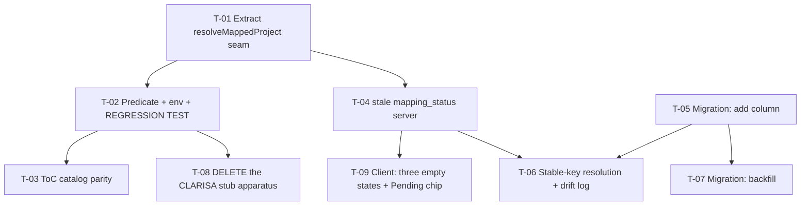

# Tasks — Bilateral / Pool Funding SP Picker Renders Empty

- **Module:** bilateral (server + client)
- **Spec id:** 2026-08-pool-funding-sp-picker-empty
- **Status:** not-started
- **Owner:** ARI squad — Juan Carlos Cadavid
- **Linked requirements:** [`./requirements.md`](./requirements.md)
- **Linked design:** [`./design.md`](./design.md)
- **Budget (design §13):** 9 tasks · ~700 LOC · 2 review rounds — *T-08 re-scoped to a deletion 2026-08-20; net LOC now lower*
- **Last updated:** 2026-08-20

---

## 1. Dependency Graph



No cycles. **T-01 → T-02 is the unblock path**; everything else can follow.

---

## 2. PR Strategy

~700 LOC exceeds the ~400 single-PR guideline. **Three PRs**, in this order:

| PR | Tasks | LOC | What it delivers |
| --- | --- | --- | --- |
| **PR 1 — RC-A + RC-C** | T-01, T-02, T-03, T-08 | ~420 (T-08 now mostly deletions) | **Unblocks the 198 on its own.** The picker populates without any client change |
| **PR 2 — RC-B identity + `stale`** | T-05, **T-04**, T-06, T-07 | ~240 | Stable key, `stale` status, two migrations (human-applied) |
| **PR 3 — client** | T-09 | ~120 | Three distinct empty states, `Pending` qualifier |

> **Corrected 2026-08-20 after PR 1 shipped.** T-04 was originally placed in PR 3 while T-06 — which **depends on it** (§1 graph) — sat in PR 2. That ordering was unbuildable. T-04 is server-side `stale` resolution and belongs with the identity work; PR 3 is now client-only.

**PR 1 is what the user is waiting for.** T-04/T-09 improve messages that PR 1 already stops showing for the cohort. Follow `cognitive-doc-design` review-empathy in each description: what to review first, what is out of scope, link previous/next PR.

---

## 3. Task List

### T-01 — Extract the mapping-resolution seam (behavior-preserving)

- **Requirements covered:** R-PSP-002 (`AND IT MUST` — same function), enabling structure for R-PSP-004/005
- **Design reference:** design §2.1 (the duplicated chain, with line map), §5.1 (seam steps), **D-PSP-1**
- **Files touched (intended):** `server/.../domain/entities/bilateral/bilateral.service.ts`
- **Description:** Extract the five-step chain duplicated at `:153–:202` and `:267–:322` into one private `resolveMappedProject()` returning a discriminated union. Both public methods consume it. **No behavior change whatsoever** in this task.
- **Implementation notes:**
  - Union members: `unmapped` / `mapped` (project + mapping row). `stale` is **not** added here — that is T-04.
  - Preserve the per-step `clarisa_project` null/snapshot semantics exactly; they differ between the two branches today and both must survive byte-identical.
- **Skills:** `nestjs-expert`, `systematic-debugging`
- **Verification:** `cd server/researchindicators && npm test -- --silent bilateral`
- **Named red input (K-012):** flip one branch's `clarisa_project` from the stored snapshot to `null` — the existing suite must redden. If it does not, the suite does not pin this refactor and the task needs a characterization test first.
- **K-019 — behaviour-preserving means proven, not declared:** run `getScienceProgramsForResult` **and** `getHlosIndicatorsForResult` over a fixed input set (mapped / no-agreement / no-row / unresolvable-project) before and after; require **zero divergences** in the full response object, not just `mapping_status`.
- **What disqualifies this evidence:** a green suite alone. The existing tests were written for the old shape and may not cover all four branches — if any branch has no pre-existing assertion, the old-vs-new comparison is the pass condition, not the suite.
- **Done:**
  - [x] Both public methods call the seam; zero duplicated resolution logic remains
  - [x] Old-vs-new comparison over the four branches shows zero divergences — *discharged by **auditor inspection** (9 cells via pre-existing tests, 1 cell by reading both versions), not by worker-supplied evidence; see `execution.md` Correction 1*
  - [x] Suite green — 18 suites / 320 tests, re-measured by the auditor in isolation
- **Effort:** M · **Status:** todo

---

### T-02 — Accepted-status predicate + env + the three call sites — **owns the regression test**

- **Requirements covered:** R-PSP-001 (both scenarios, all clauses, AC.1–AC.4), R-PSP-003 (scenario + AC.1–AC.3)
- **Files touched (intended):**
  - `server/.../domain/entities/bilateral/utils/sp-mapping.predicate.ts` *(new)*
  - `server/.../domain/entities/bilateral/bilateral.service.ts`
  - `server/.../domain/tools/clarisa/projects/clarisa-projects.service.ts`
  - `server/.../domain/shared/utils/env.utils.ts`
  - `server/researchindicators/.env.example`
  - `server/.../domain/entities/bilateral/bilateral.service.*.spec.ts`
- **Description:** Create the pure predicate module holding the accepted-status set and the four-clause SP-row rule. Point `isProjectScienceProgramMapping`, `deriveScienceProgramMetaByCode` and `hasSciencePrograms`'s **status clause** at it. Add `ENV.BILATERAL_ACCEPTED_SP_STATUSES` (default `Confirmed,Pending`).
- **Implementation notes (one clause per row — KZ-011):**
  - Only the status clause changes; portfolio, AOW and `/^SP\d/i` keep their current order and semantics.
  - `hasSciencePrograms` keeps its `code === 22` narrowing (**D-PSP-8**) — do not harmonize it here.
  - No Nest imports in the predicate module — pure, like `project-selector.util.ts`.
- **Skills:** `nestjs-expert`, `error-handling-patterns`, `tdd`, `systematic-debugging`
- **BUG MODE — the regression test lives here**, because this task changes the buggy code path. It drives `getScienceProgramsForResult` (existing code), **not** the new pure function — a test over newly-created code is green from the moment it compiles and could never have been red.
- **Named red input (K-012), verbatim:** a CLARISA project whose only mapping row is
  `{ status: 'Pending', global_unit_object: { smo_code: 'SP01', cgiar_entity_type_object: { prefix: 'SP' }, portfolio_object: { acronym: 'P25' } } }`.
  On current `HEAD` the endpoint returns `science_programs: []`; after the fix it returns exactly `['SP01']`.
- **Verification:** `npm test -- --silent bilateral` · `npx eslint src/domain/entities/bilateral` *(bare `eslint`, never `npm run lint` — it carries `--fix` and cannot gate, K-001)*
- **AC.4 is the falsifiability pin:** with the env set to `Confirmed` alone, the cohort must return `[]` again. If it does not, the set is not the discriminator and the change is a hardcoded widen (**K-005**, **D-PSP-4**).
- **What disqualifies this evidence:** the regression test passing on `HEAD`. Record the observed FAIL with its output in `execution.md` before the fix (**K-004**, **NFR-PSP-003**); a task whose evidence is "the test passes" is not done.
- **Manual (DC-8 — no automated gate exists):** against **Dev with real CLARISA**, `STAR-2227` → `SP01`, and `STAR-3403` → `SP02` + `SP06`. **Wait out the 5-minute CLARISA TTL or restart the process first** — re-saving restarts the window (**K-016**, misread as breakage twice).
- **Done:**
  - [x] Regression test observed FAILING on `HEAD`, output recorded — *auditor independently reproduced the red via the real path*
  - [x] Same test green after the change
  - [x] AC.4 reproduces the old empty result under `Confirmed`-only — pin at `…getScienceProgramsForResult.spec.ts:474`
  - [x] Repo-wide grep finds no surviving inline `'Confirmed'` status literal in the SP predicates — *discharged only on the retry; the first grep pattern could not match `'Confirmed,Pending'` (F-2)*
  - [x] A test proves the admin flag and the picker agree on **status** for one project
  - [x] `.env.example` declares the new var beside `ARI_BILATERAL_ACTIVE_PORTFOLIO`
  - [x] Manual Dev check passes on both named results — *`STAR-2227` → `SP01`; `STAR-3403` → `SP02`+`SP06`, against real CLARISA with the fixed code, 2026-08-20 16:57 UTC*
- **Dependencies:** T-01 · **Effort:** M · **Status:** todo

---

### T-03 — ToC catalog resolves the same SP set as the picker

- **Requirements covered:** R-PSP-002 (scenario + both clauses, AC.1–AC.2)
- **Design reference:** design §4 (API surface, item-level field), §5.2 (derivation + dedup semantics)
- **Files touched:** `bilateral.service.ts`, `dto/bilateral-science-programs.response.dto.ts`, `bilateral.service.getHlosIndicatorsForResult.spec.ts`
- **Description:** Confirm the catalog inherits T-02 through the shared derivation, add the per-item `mapping_status` field to the SP response, and add the cross-endpoint equality test.
- **Implementation notes:**
  - The item-level `mapping_status` reports the CLARISA status that admitted the row.
  - Dedup semantics are unchanged: first accepted row per code wins.
  - Update `@ApiOperation` for the changed response shape.
- **Skills:** `nestjs-expert`, `api-design-principles`
- **Verification:** `npm test -- --silent bilateral`
- **Named red input:** point `getHlosIndicatorsForResult` at a second, unwidened copy of the predicate — the equality test must redden. If it stays green, the test compares nothing.
- **What disqualifies this evidence:** an equality assertion over two **empty** sets. Assert non-emptiness first, then equality — two empty arrays are trivially equal and prove nothing (**KZ-001**).
- **Done:**
  - [x] SP-code sets from both endpoints are equal **and non-empty** for a `Pending`-only project — *auditor confirmed the test calls both endpoints and pins the concrete value*
  - [x] Swagger updated for the new item field
  - [x] **Rider from F-3:** `?` dropped on `BilateralScienceProgramItem.mapping_status`; the compiler forced mock updates across 6 spec files
- **Dependencies:** T-02 · **Effort:** S · **Status:** todo

---

### T-04 — `stale` as a third `mapping_status` (server)

- **Requirements covered:** R-PSP-004 (server half; AC.1), the seam half of R-PSP-005
- **Design reference:** design §5.1 step 4.iii (the `stale` branch), §4, **D-PSP-5**
- **Files touched:** `bilateral.service.ts`, `dto/bilateral-science-programs.response.dto.ts`, `dto/bilateral-hlos-indicators.response.dto.ts`, sibling specs
- **Description:** Add `stale` to the `MappingStatus` union and return it from the seam's unresolvable-project branch, carrying the stored snapshot. Update Swagger.
- **Implementation notes:**
  - `stale` replaces the current `unmapped` return **only** on the project-unresolvable branch. The no-agreement and no-mapping-row branches keep `unmapped`.
  - Both public methods inherit it via T-01's seam — no second edit site.
- **Skills:** `nestjs-expert`, `api-design-principles`
- **Verification:** `npm test -- --silent bilateral` · `npx tsc -p tsconfig.json --noEmit`
- **Named red input:** a mapping row whose `clarisa_project_id` is absent from the feed — the endpoint must return `stale`, not `unmapped`. Asserting `unmapped` must now fail.
- **What disqualifies this evidence:** a test that asserts only `mapping_status === 'stale'`. It must **also** assert the snapshot is present, or the branch can return `stale` with a null project and still pass.
- **Done:**
  - [x] All three `mapping_status` values reachable and covered — *auditor mutation confirmed each is pinned to its own branch*
  - [x] `stale` carries `clarisa_project` snapshot, never null — asserted on both endpoints
  - [x] Swagger describes the third state
- **Dependencies:** T-01 · **Effort:** S · **Status:** todo

---

### T-05 — Migration: add `clarisa_external_code`

- **Requirements covered:** R-PSP-005 (AC.1)
- **Files touched:** `db/migrations/<ts>-addClarisaExternalCodeToBilateralProjectMapping.ts`, `entities/bilateral-project-mapping.entity.ts`
- **Description:** Add the nullable column + `idx_bpm_clarisa_external_code`. Schema only — **no data written here** (template §5).
- **Implementation notes:**
  - Generate with `npm run migration:generate -- ./src/db/migrations/addClarisaExternalCodeToBilateralProjectMapping`.
  - Do not touch the MySQL generated column or the partial-unique index (D-PI-9).
- **Skills:** `nestjs-expert`
- **Verification:** apply forward, then `npm run migration:revert`, then re-apply.
- **Named red input:** drop the `down()` body — `migration:revert` must fail.
- **What disqualifies this evidence:** reading `migration:show` output without checking for an error first, or `grep`-ing it for `[ ]` — it emits **ANSI escapes**, and that grep has already reported a confident zero over a pending migration (**K-014**).
- **K-015:** CI/CD deploys code only. Applying this is a **separate human step** against the shared Dev DB.
- **Done:**
  - [x] Forward + revert + re-apply all clean — *executed on a scratch MySQL against the real DDL, through `namedPlaceholders: true`*
  - [~] Entity column matches the migration exactly — **F-11:** the `comment` strings differ (`(D-PSP-10)` suffix on the entity only); align in T-07
  - [x] Generated column and unique index untouched — both survived up/down/up
  - [x] **Applied to Dev** 2026-08-20 under explicit user authorization; `migration:show` → `[X] 381`; coverage held at 195/198
- **Dependencies:** none · **Effort:** S · **Status:** todo

---

### T-06 — Stable-key resolution, automapper write, coverage counting, drift log

- **Requirements covered:** R-PSP-005 (both scenarios, all clauses, AC.2–AC.4), NFR-PSP-002
- **Files touched:** `clarisa-projects.service.ts`, `bilateral.service.ts`, `automapper.service.ts`, `bilateral-mapping-coverage.service.ts`, `bilateral-project-mapping.service.ts`, sibling specs
- **Description:** Add `findProjectByExternalCode`, implement the resolution order (stable key → id → `stale`), populate the key in `newDerivedRow`, count coverage via the key, and emit the id-divergence warn.
- **Implementation notes (one clause per row):**
  - Normalization is `normalizeExternalCode` only — no second strip is written (NFR-CAM-003).
  - `AutomapperService` must keep injecting **only** `ClarisaProjectsService` + `DataSource` — a new dependency re-introduces the REQUEST-scope cascade its module header bans (NFR-BAS-001).
  - `clarisa_project_id` stays stored and returned; it is the drift signal, not dead weight (D-PSP-6).
- **Skills:** `nestjs-expert`, `systematic-debugging`
- **Verification:** `npm test -- --silent bilateral` · local stub reproduction: `curl …/results/3403/pool-funding-alignment/science-programs` must return `mapped` with SPs
- **Named red input:** a row whose stable key matches **no** project in the feed — must return `stale`, never a fuzzy or prefix-widened match. Add `X-A1676` as a key and assert it does **not** resolve to `A1676`.
- **NFR-PSP-002 — capture the before-value first.** Record Dev coverage **before** any change; a post-only reading cannot detect a regression. Pass condition: Dev coverage ≥ `mapped: 195 / reachable: 198`.
- **What disqualifies this evidence:** measuring Dev coverage while a delegated worker is active, or while two full-suite runs are in flight — that produces a **wrong** number, not a slow one (root guide §4.3). Measure in the window after a worker reports.
- **Done:**
  - [x] A feed numbering projects differently still resolves result `3403` — *the stub is gone (T-08); driven by a mocked feed, per the revised R-PSP-005 AC.2*
  - [x] Non-matching key returns `stale` — auditor mutation (`X-` added to the closed prefix set) reddens the guard
  - [x] Id divergence emits exactly one warn naming both ids and the agreement
  - [x] Dev coverage measured before and after; no regression — 195/198 throughout
  - [x] `AutomapperService` constructor unchanged — `ClarisaProjectsService` + `DataSource` only (NFR-BAS-001)
  - [x] Coverage query groups the OR so `is_active` gates both branches (F-12) — verified on generated SQL
  - [x] **Rider from F-14:** `getQuery()` assertion pinning the parenthesised WHERE — added in T-07, observed red on the flat form
- **Dependencies:** T-04, T-05 · **Effort:** L · **Status:** todo

---

### T-07 — Migration: backfill `clarisa_external_code`

- **Requirements covered:** R-PSP-006 (scenario + both clauses, AC.1–AC.3)
- **Design reference:** design §3 (two-migration split, nullable rationale **D-PSP-10**), §12 step 2 (rollout)
- **Files touched:** `db/migrations/<ts>-backfillClarisaExternalCode.ts`
- **Description:** Populate the column for existing rows from `agresso_agreement_id` (already the normalized form). Separate file from T-05.
- **Implementation notes:**
  - Idempotent: `WHERE clarisa_external_code IS NULL`.
  - Must not write `updated_at`, `updated_by`, or any other column.
- **Skills:** `nestjs-expert`
- **Verification:** run; then `SELECT COUNT(*) … WHERE is_active=1 AND clarisa_external_code IS NULL` → `0`; run again → 0 rows affected.
- **A-3 — re-measure, do not assume.** M-17's "170/170 stripped codes match" was measured on a different date against a different population. Confirm the `agreement_id` ⇒ `external_code` equivalence over **today's** rows before running the backfill.
- **Named red input:** a row whose `agresso_agreement_id` has surrounding whitespace or lower case — the backfill must still normalize it, and a test with such a row must redden an unnormalized implementation.
- **What disqualifies this evidence:** a row count that matches by coincidence. Snapshot `id`, `created_at`, `updated_at`, `clarisa_project_id` and `source` for all rows before and after and **diff them explicitly** — "the count is the same" does not prove no column moved.
- **K-015:** human-applied, like T-05.
- **Done:**
  - [x] Zero active rows left with a NULL key — applied to Dev 2026-08-20
  - [x] Before/after snapshot diff shows changes to `clarisa_external_code` **only** — 199 rows on scratch, 0 other columns moved; audit timestamps also verified intact on Dev
  - [x] Second run affects zero rows
  - [x] No row deactivated, deleted or recreated
  - [~] `down()` over-reverts (**F-15**, minor) — nulls every non-null key, not only the rows `up()` set. Accepted; note it in the migration comment
- **Dependencies:** T-05 · **Effort:** S · **Status:** todo

---

### T-08 — Delete the CLARISA stub apparatus

> **Re-scoped 2026-08-20** (user-approved pivot). Previously *"Fixture statuses harvested; D-4 inverted; M-14 corrected"*. The stub's own removal condition is now met, so repairing the fixture would maintain an artifact the code says to delete. See design **§5.4**, **D-PSP-11**, and R-PSP-007's superseded-text block.

- **Requirements covered:** R-PSP-007 (scenario + both clauses, AC.1–AC.5)
- **Design reference:** design §5.4, §11 Reversion 2 (re-challenged), **D-PSP-11**, **D-PSP-7**
- **Files touched:** delete `src/domain/tools/clarisa/stub/` in full (router, mount, config, `clarisa-stub.router.spec.ts`, `clarisa-stub.fidelity.spec.ts`, `tools/harvest-reference.ts`, `tools/convert-export.ts`, `tools/convert-export.spec.ts`, all four `fixtures/*.json`); edit `src/main.ts` (remove the mount); edit `.env.example` (retire `ARI_CLARISA_STUB_ENABLED`); annotate `docs/specs/archive/2026-08-19-bilateral--clarisa-fixture-stub/requirements.md`.
- **Description:** Execute the removal condition written verbatim into the stub's own source. Delete the folder, unwire the mount, retire the flag, and record in the archived spec that its condition fired — including M-14's correction.
- **Implementation notes (one clause per row):**
  - The mount in `main.ts` runs **before** `listen()` and outside the Nest pipeline; remove the call and its import, leave the surrounding bootstrap order untouched.
  - `.env.example` loses the flag; **`.env` itself is never edited** (symlink into another checkout).
  - The archive note **annotates**; the superseded M-14 text is preserved verbatim (**K-003**, **KZ-007**).
- **Skills:** `nestjs-expert`, `cognitive-doc-design`
- **Enabling measurement (K-013 — re-verify before acting, do not trust this line):**
  `GET https://clarisatest-back.ciat.cgiar.org/api/projects` on 2026-08-20 → 1210 projects · `external_code` **911/1210** · phase `{2025: 299, 2026: 911}` · shipped predicates at phase 2026 → **198 eligible, 198 with `external_code`**.
  **If a CLARISA reset has dropped either below full coverage of the eligible cohort, STOP** — the requirement is void and the stub must stay.
- **Verification:**
  ```
  cd server/researchindicators
  grep -rn "clarisa-stub\|clarisa-projects.fixture\|ARI_CLARISA_STUB_ENABLED" src .env.example   # expect ZERO
  npm test -- --silent            # full server suite — this task deletes suites, so scope it wide
  npx eslint src
  npm run build
  ```
- **Named red input (K-012):** leave **one** import of the deleted module behind (e.g. the `main.ts` mount import) — `npm run build` must fail. If the build passes with a dangling import, the build is not gating this task and you must say so.
- **What disqualifies this evidence:** a green **scoped** run. Deleting files cannot break the suites you deleted — it can only break the ones that remain, and those live outside `bilateral`. **Run the full server suite**, and compare the suite/test counts before and after: the drop must equal exactly the suites you removed, and **no remaining suite may go from passing to failing**. A smaller total is expected; a *different* failure is the defect.
- **Do not** delete anything outside `stub/` beyond the two named edits. If `grep` finds a consumer you did not expect, **stop and report** — that would falsify the closed-blast-radius premise this task rests on.
- **Done:**
  - [x] `grep` for `clarisa-stub` / fixture / env flag returns zero hits in `src`, **`test/`** and `.env.example` — *scope widened after F-6; the original `src`-only grep is what missed the orphan*
  - [x] Full server suite green; before/after counts explained, no new failure — 332 suites / 2364 tests; drop of 3 suites / 80 tests equals the deleted specs
  - [x] Dangling-import mutation observed FAILING the build
  - [x] `npm run build` succeeds and the app boots
  - [x] Archived spec carries the dated note **and** M-14's correction, superseded text preserved — original M-14 row intact at line 54
  - [x] `npx tsc --noEmit` clean — *the gate that spans `test/`; added after F-7*
  - [ ] `npm run test:integration` — **BLOCKED (F-9):** needs `T13_MYSQL_PASSWORD` + a MySQL container on `127.0.0.1:33107`. Types verified via `tsc`; behavior unverified
- **Dependencies:** T-02 · **Effort:** M · **Status:** todo

---

### T-09 — Client: three distinct empty states + `Pending` qualifier

- **Requirements covered:** R-PSP-004 (client half — both scenarios, all clauses, AC.2–AC.4), R-PSP-001 UI surface
- **Files touched:** `client/.../interfaces/bilateral/pool-funding-alignment.interface.ts`, `client/.../pool-funding-alignment.component.ts`, `.html`, `.component.spec.ts`
- **Description:** Widen `PoolFundingMappingStatus` with `stale`, add `isStale`, exclude it from `showSpPicker`, add the stale message, reword the filtered-out message, and render the `Pending` qualifier chip.
- **Implementation notes (one clause per row):**
  - The stale copy names the drift and points at ops for **reconciliation** — it must not ask the user to *register* a mapping that exists.
  - The filtered-out copy names the filter as the reason; a project with genuinely zero SP rows needs its own wording.
  - The qualifier chip reuses `.pf-stale-tag` verbatim; only the copy differs (precedent: `ORPHANED_TOC_TAG`, D-C2-10). No new token.
  - Token utilities or `var(--ac-*)` only — no hex literals (root guide §4.2).
- **Skills:** `angular-developer`, `ui-ux-pro-max`
- **Verification:** `cd client/research-indicators && npm test -- --silent pool-funding-alignment` · `npm run lint -- --quiet`
- **Named red input:** set `mappingStatus` to `'stale'` — `showSpPicker()` must be `false` and the rendered text must not equal `UNMAPPED_SP_MESSAGE`. Collapsing `isStale` into `isUnmapped` must redden the suite.
- **KZ-015 — arrange the TRANSITION, not the end state.** Set `mappingStatus` **after** the first `detectChanges()`; setting it before tests a state the component may never actually reach.
- **What disqualifies this evidence:** a jsdom assertion that a message **constant** is referenced. That proves presence, not that the state is reachable or legible. **DC-9 has no automated gate** — attach a screenshot of each of the three empty states at the HITL pause.
- **Done:**
  - [ ] Three messages pairwise distinct, asserted
  - [ ] Stale message ≠ `UNMAPPED_SP_MESSAGE`, asserted directly
  - [ ] No message instructs registering an existing mapping
  - [ ] `showSpPicker` false on `stale`
  - [ ] TypeScript compiles — the union widening surfaced and handled every consumer
  - [ ] `Pending` chip renders, using existing tokens only
  - [ ] Screenshots of all three states attached
- **Dependencies:** T-04 · **Effort:** M · **Status:** todo

---

## 4. Clause-Level Coverage Closure

Closure is at **scenario and clause** granularity, not requirement ID. Every `BUT it must NOT` / `AND IT MUST` has a named owner.

| Requirement | Scenario / clause | Owner |
| --- | --- | --- |
| R-PSP-001 | Pending-only project returns SPs · `BUT NOT []` · `AND IT MUST` other clauses unchanged | T-02 |
| R-PSP-001 | Non-accepted status excluded · `BUT NOT` sibling loss · `AND IT MUST` named set, no second literal | T-02 |
| R-PSP-001 | AC.1, AC.2 (real CLARISA, manual) | T-02 |
| R-PSP-002 | Catalog follows picker · `BUT NOT catalogs: []` | T-03 |
| R-PSP-002 | `AND IT MUST` same function | T-01 (structure) + T-03 (test) |
| R-PSP-003 | Status cannot drift · `BUT NOT` silently change code 22 | T-02 |
| R-PSP-003 | `AND IT MUST` record the entity-code decision | design D-PSP-8; verified in T-02 |
| R-PSP-004 | Existing mapping never "not linked" (server half) · AC.1 | T-04 |
| R-PSP-004 | `BUT NOT` unmapped copy · `AND IT MUST NOT` instruct registering | T-09 |
| R-PSP-004 | Filtered-out says so · `BUT NOT` "no SPs defined" · `AND IT MUST` stay accurate at genuine zero | T-09 |
| R-PSP-005 | Feed swap does not unmap · `BUT NOT` unmap on id difference · `AND IT MUST` log divergence | T-06 |
| R-PSP-005 | Unresolvable stays unresolvable · `BUT NOT` fuzzy match | T-06 |
| R-PSP-005 | AC.1 migration revert | T-05 |
| R-PSP-006 | Backfill complete + idempotent · `BUT NOT` other columns · `AND IT MUST NOT` recreate rows | T-07 |
| R-PSP-007 | Divergent copy gone · `BUT NOT` dangling import/flag/route · `AND IT MUST` leave production paths unchanged | T-08 |
| NFR-PSP-001 | TTL stated in verification | T-02, T-06 |
| NFR-PSP-002 | No Dev coverage regression | T-06 |
| NFR-PSP-003 | Every gate proven able to fail | all — recorded in `execution.md` |
| ~~NFR-PSP-004~~ | **RETIRED** — no fixture to package once the stub is deleted | — |

**No gap is discharged by citing a different requirement.** Every row above quotes the clause it covers.

---

## 5. Testing Expectations

| Suite | Added / updated |
| --- | --- |
| `bilateral.service.*.spec.ts` | Regression (T-02), seam branches (T-01, T-04), cross-endpoint parity (T-03), stable key (T-06) |
| `clarisa-projects.service.spec.ts` | `findProjectByExternalCode`, `hasSciencePrograms` status clause |
| `clarisa-stub.*.spec.ts` | **Deleted** with the rest of the stub (T-08) |
| `pool-funding-alignment.component.spec.ts` | Three states, `showSpPicker`, `Pending` chip |
| Migration | Forward/revert/idempotency + before/after snapshot diff |

Coverage floors unchanged: server 60%; client statements 40 / branches 20 / lines 45 / functions 30.

**Lean invocation** (root guide §4.3): `npm test -- --silent`; failures print complete and verbatim. Lint gate is bare `npx eslint <path>` on the server — `npm run lint` carries `--fix` and mutates files, so it cannot verify (**K-001**).

---

## 6. Execution Conventions

- One PR per group in §2; squash on merge.
- PR title: `fix(bilateral): <subject>`.
- Branch from the current integration branch — `JuankCadavid/AC-1676`.
- Never edit a merged migration; amend with a new one.
- Swagger annotation ships in the same PR as its handler.
- **Concurrency (root guide §4.3):** one AKILI session per checkout. Workers verify their own scope; the **Leader re-measures the full suite alone** after each worker reports. Never measure while a delegated worker is active.

---

## 7. Risks & Blockers Log

| # | Date | Risk / Blocker | Mitigation | Owner | Status |
| --- | --- | --- | --- | --- | --- |
| RB-1 | 2026-08-20 | **DC-8 has no automated gate** — suites mock the feed, and this bug existed *because* the double agreed with it | Manual check on `STAR-2227` and `STAR-3403` — **DONE 2026-08-20, PASSED** (`execution.md`) | Leader | **closed** |
| RB-2 | 2026-08-20 | DC-9 — jsdom asserts strings, not what a human sees | Screenshots of all three empty states at the HITL pause (T-09) | Implementer | open |
| RB-3 | 2026-08-20 | Migrations are **not** applied by CI/CD (K-015) | Explicit human step in §2 rollout; verify with `migration:show`, reading raw output for errors first | DevOps | open |
| RB-4 | 2026-08-20 | 5-min CLARISA TTL misread as breakage (K-016, 2 prior occurrences) | TTL stated in T-02 and T-06 verification steps | Leader | open |
| RB-5 | 2026-08-20 | OQ-1 unresolved — may a reporter *submit* on `Pending` SPs? | Does not block PR 1; resolve before archive | Product + PRMS | open |
| RB-6 | 2026-08-20 | Real-feed figures are a 2026-08-20 capture of a periodically-reset host (K-013) | Re-measure before relying on 283 / 493 / 1354 | Implementer | open |

---

## 8. Done Definition

- [ ] All `T-01`…`T-09` are `done`
- [ ] Every requirement AC checked; §4 clause map fully owned
- [ ] Every new gate has an **observed FAIL** recorded in `execution.md` with its input (K-004, K-012, KZ-014)
- [ ] Coverage floors green in both packages
- [ ] Swagger documents all three `mapping_status` values
- [ ] Both migrations applied to Dev by a human and confirmed via `migration:show`
- [ ] Manual DC-8 check passed on `STAR-2227` and `STAR-3403` against real CLARISA
- [ ] Screenshots for DC-9 attached
- [ ] OQ-1, OQ-2, OQ-3 resolved or carried forward as a new spec
- [ ] Budget respected (9 tasks · ~700 LOC · 2 rounds) or the overrun escalated, not absorbed
