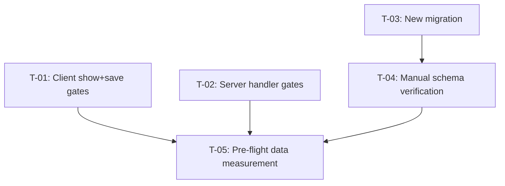

# Tasks — Alliance Alignment / Strategic (Impact) Outcomes for Innovation Use

- **Module:** results (Alliance Alignment tab, Portfolio 2 / 2026‑2030)
- **Spec id:** 2026-09-add-strategic-outcomes-field
- **Status:** not-started
- **Owner:** Manuel Ricardo Almanzar
- **Linked requirements:** [`./requirements.md`](./requirements.md)
- **Linked design:** [`./design.md`](./design.md)
- **Linked judgment:** [`./judgment.md`](./judgment.md) — design accepted as-is by explicit user override (option "Continue") after a FAIL verdict; several corroborated findings are folded into this file's task notes, verification steps, and Risks log below (no design decision was reopened)
- **Last updated:** 2026-09-09

---

## 1. Task numbering

T-01…T-05, matching requirements.md §7's site-per-task reference. Higher numbers do not imply priority — see the dependency graph.

## 2. Dependency graph

T-01 and T-02 are independent of each other and of T-03 (different tiers, no shared file). T-03 must be verified (T-04) before T-05's rollout decision can be made responsibly, since T-05's pre-flight count is only meaningful once the exact migrated logic is confirmed correct.

---

## 3. Task list

### T-01 — Client: show and save Impact Outcomes for Innovation Use

- **Requirements covered:** R-ALN-001 (AC.1–AC.4, full scenario)
- **Files touched (intended):**
  - `client/research-indicators/src/app/pages/platform/pages/result/pages/alliance-alignment/portfolio/alliance-alignment-p2.component.ts`
  - `client/research-indicators/src/app/pages/platform/pages/result/pages/alliance-alignment/alliance-alignment.component.ts`
  - `client/research-indicators/src/app/pages/platform/pages/result/pages/alliance-alignment/portfolio/alliance-alignment-p2.component.spec.ts`
  - `client/research-indicators/src/app/pages/platform/pages/result/pages/alliance-alignment/alliance-alignment.component.spec.ts`
- **Description:** Widen `shouldShowImpactOutcomes()` to `[4, 5, 6].includes(Number(indicatorId))`, matching the file's existing `Number(...)` coercion convention (design §6 left this open between two conventions — **use `Number(...)` at both client sites**, not a strict `===`, so a string-typed `indicator_id` cannot desync visibility from the save gate — judgment.md S-5). In `alliance-alignment.component.ts`, extend the `includeImpactOutcomes` argument passed to `buildPortfolio2AlignmentPatch(...)` with a third check for indicator `6` (a small `isInnovationUseIndicator()` computed signal, mirroring the existing `isOicrIndicator()`/`isPolicyChangeIndicator()` pattern, is the cleaner match for the file's own style).
- **Implementation notes:**
  - Do not touch the "Contribution to SDG" gate (`!isOicrIndicator()`) — R-ALN-001's `AND IT MUST` clause requires it stay unaffected, and it is a distinct condition (judgment.md S-7 — don't conflate the two).
  - Do not touch `research_areas` / `strategic_objectives` — always-on, out of scope.
- **Acceptance / done check:**
  - [x] `alliance-alignment-p2.component.spec.ts` — new case: `indicator_id = 6` → `shouldShowImpactOutcomes()` returns `true` and the fixture's stubbed template renders "Impact Outcomes" text (mirror the existing `indicator_id = 5` case at line ~44 and the `indicator_id = 4` case at line ~51).
    - **What this assertion cannot prove (KZ-017 / judgment.md S-6):** the spec overrides the component's template with an inline stub — it proves `shouldShowImpactOutcomes()` is wired to the boolean, not that the *real* `alliance-alignment-p2.component.html` template renders correctly for indicator 6. The real template already renders this exact field for indicators 4/5 unconditionally-per-boolean (no indicator-specific markup branch inside the multiselect), so no new markup risk exists — record this as the reasoned basis for not requiring a full-template render test, not as something this task's Jest assertion itself proves.
  - [x] `alliance-alignment.component.spec.ts` — new case mirroring the existing test at line ~254 ("should load and save portfolio 2 alignment...", using `indicator_id: 4`): same shape with `indicator_id: 6`, asserting the PATCH payload includes `impact_outcomes: [{ impact_outcome_id: <id> }]`.
  - [x] `alliance-alignment.component.spec.ts` — new case mirroring the existing test at line ~315 ("should send empty impact_outcomes... indicator is not OICR or Policy Change"): keep that test's `indicator_id: 1` case passing unmodified (it must still assert `impact_outcomes` is `undefined`), and add a sibling case for `indicator_id: 2` (Innovation Development) — the two excluded indicators nearest the new allow-list, so a future off-by-one can't slip through only being caught by `1`.
  - [x] Existing tests at those two line numbers keep passing with **zero** assertion changes (AC.4) — optional: rename their descriptions to drop "not OICR or Policy Change" wording that will be stale once the list is 3 long (judgment.md S-10); renaming is cosmetic and does not touch assertions. (Rename skipped — optional, out of scope per Implementer report.)
  - [x] `npx eslint <changed paths>` clean (no `--fix`).
- **Dependencies:** none.
- **Estimated effort:** S
- **Owner:** —
- **Status:** done
- **Skills:** `angular-developer`

---

### T-02 — Server: persist and return Impact Outcomes for Innovation Use

- **Requirements covered:** R-ALN-002 (AC.1–AC.4, both scenarios)
- **Files touched (intended):**
  - `server/researchindicators/src/domain/entities/results/portfolio-handlers/sections/alignment/portfolio-2/portfolio-2-alignment.handler.ts`
  - `server/researchindicators/src/domain/entities/results/portfolio-handlers/sections/alignment/portfolio-2/portfolio-2-alignment.handler.spec.ts`
- **Description:** Widen both `.includes([IndicatorsEnum.OICR, IndicatorsEnum.POLICY_CHANGE])` checks (`find()` ~line 133, `save()` ~line 90) to include `IndicatorsEnum.INNOVATION_USE`. **Also fix the newly-reachable crash path found in review (judgment.md C-2):** `save()`'s `payload.impact_outcomes.map(...)` (~line 97) has no optional chaining, and `impact_outcomes` is optional on `ResultAlignmentDto`. Widening the allow-list to indicator 6 — which has no existing client wiring for this key today — makes a PATCH that omits it (deploy-skew window, or any machine-token caller) throw a `TypeError` instead of the intended "key stays undefined" behavior. Change to `(payload.impact_outcomes ?? []).map(...)`.
- **Implementation notes:**
  - No DTO, DI, transaction-boundary, or route change — confirmed by design §4/§5.
  - This is in scope for R-ALN-002, not scope creep: R-ALN-002's own Outputs clause already states the key should be `undefined` when excluded/absent, which the current code only achieves by accident (never reaching the `.map` call) for indicators outside the allow-list — widening the allow-list is precisely what turns the latent gap into a reachable one.
- **Acceptance / done check:**
  - [x] New `save()` test mirroring the existing "should persist impact outcomes when indicator is OICR" / "...POLICY_CHANGE" cases (lines ~140, ~158): same shape with `indicator_id: IndicatorsEnum.INNOVATION_USE`, asserting `resultImpactOutcomesService.create` is called and `result.impact_outcomes` is populated.
  - [x] New `find()` test mirroring the existing OICR/POLICY_CHANGE cases (lines ~215, ~230): same shape for `INNOVATION_USE`.
  - [x] **New negative test (the C-2 fix):** `save()` called with `indicator_id: IndicatorsEnum.INNOVATION_USE` and a payload with **no** `impact_outcomes` key does not throw, and `resultImpactOutcomesService.create` is called with `[]` (or is not called — pick one and assert it; either is acceptable, but the call must not throw).
    - **Disqualifier:** a green test here that never actually omits the key from the payload object (e.g. sets it to `undefined` explicitly, which is different from key-absent for some destructuring patterns) is not evidence — construct the payload object literal without the key at all.
  - [x] Existing test "should clear legacy levers... (`KNOWLEDGE_PRODUCT`)" and both existing OICR/POLICY_CHANGE cases keep passing unmodified.
  - [x] `npx eslint <changed paths>` clean (no `--fix`).
- **Dependencies:** none.
- **Estimated effort:** S
- **Owner:** —
- **Status:** done
- **Skills:** `nestjs-expert`

---

### T-03 — Server: migration widening `alignment_validation` for Policy Change and Innovation Use

- **Requirements covered:** R-ALN-003 (behavioral change; verification split into T-04/T-05)
- **Files touched (intended):**
  - `server/researchindicators/src/db/migrations/<new-timestamp>-includeInnovationUseImpactOutcomes.ts` (new file)
- **Description:** New, append-only migration. `up()`: copy `1783021729548-UpdateAlignmentValidation.ts`'s `up()` function body **verbatim**, changing exactly one line inside the `elseif (portfolio_id = 2) then` branch: `if result_indicator = 5 then` → `if result_indicator in (4, 5, 6) then` (the block requiring ≥1 active `role_id = 1` `result_impact_outcomes` row). `down()`: copy that same `1783021729548` `up()` body verbatim, unchanged — this restores today's OICR-only behavior.
- **Implementation notes:**
  - **⚠ Disambiguation (judgment.md S-4):** the function body contains **two** occurrences of the string `if result_indicator = 5 then` — one inside the `if (portfolio_id = 1) then` branch (~line 72, an unrelated legacy Portfolio‑1 OICR lever/SDG-target check — **do not touch**), and one inside `elseif (portfolio_id = 2) then` (~line 111, the one to widen). Edit only the second. Do not use a blind find-and-replace across the file.
  - **⚠ Named-placeholder trap (server `CLAUDE.md` §7, judgment.md C-3):** `orm.config.ts` sets `extra.namedPlaceholders: true`, so any bare `?` or `:word` — **including inside a SQL comment** — is consumed as a bind parameter and throws before MySQL parses the query, since this migration passes no parameters. If a `[SPEC ...]`-style comment is added (repo convention in this migration family), drop the colon (`[SPEC changes/add-strategic-outcomes-field]`) and don't end a comment sentence with `?`. A verbatim copy of the current body has none of these — introduce none.
  - Copy the body from the file directly (read it, don't retype from memory) — verbatim copying is the only way to guarantee the untouched branches (contract check, strategic-objectives check, non-OICR SDG requirement, Portfolio‑1 branch) are provably unchanged.
- **Acceptance / done check:**
  - [x] `npm run migration:generate` naming convention followed (`<timestamp>-camelCaseAction.ts`); the migration is a new file, `1783021729548-UpdateAlignmentValidation.ts` is untouched.
  - [x] **Mechanical diff check (closes judgment.md S-4 and DD-3's "provably unchanged" claim):** a text diff of the new migration's `up()` SQL body against `1783021729548`'s `up()` SQL body shows **exactly one changed line**. If more than one line differs, the copy was not verbatim — stop and re-copy. (Confirmed independently by both Implementer and both Reviewer lenses.)
    - **What would fail this check:** any edit to the `portfolio_id = 1` branch, any reformatting/whitespace change to unrelated lines, any added/removed comment elsewhere in the body.
  - [x] `npx eslint <path>` clean (no `--fix`).
  - [x] Did **not** mark this task's "applied to a live environment" as done here — that is T-04/T-05.
- **Dependencies:** none (independent of T-01/T-02).
- **Estimated effort:** S
- **Owner:** —
- **Status:** done
- **Skills:** `nestjs-expert`

---

### T-04 — Manual verification: run the migration against a real schema and prove the six required cases

- **Requirements covered:** R-ALN-003 (AC.1–AC.5, the manual gate named in requirements.md §7 — no Jest equivalent exists for this)
- **Files touched:** none (verification only; no code change)
- **Description:** `green-checks.repository.spec.ts` mocks the raw datasource `query()` call and only asserts the SQL string contains a substring — it cannot execute a MySQL stored function (judgment.md confirmed this independently, twice). This task IS the gate for T-03's correctness.
- **Implementation notes:**
  - **⚠ Target a disposable schema, not shared Dev (judgment.md S-1).** `server/researchindicators/src/db/config/mysql/orm.config.ts`'s exported datasource is bound to `CORE` (`ARI_MYSQL_*`), and `npm run typeorm migration:run` applies **every pending migration**, not just this one, against whatever schema those env vars point at. Before running anything: (a) check pending state first — `npm run typeorm migration:show -- -d ./src/db/config/mysql/orm.config.ts` (note: this passthrough emits ANSI escapes; don't `grep '^\[ \]'` against it, read it directly); (b) point `ARI_MYSQL_*` at a local/disposable schema for this run (a fresh local MySQL container, or a schema nobody else uses) — never run this against the shared on-prem Dev database (root `CLAUDE.md` §4.3: Dev is remote, shared, not disposable).
  - **⚠ Full fixture prerequisites (judgment.md S-3) — the non-OICR branch also requires an active `result_sdgs` row.** `alignment_validation`'s `if result_indicator <> 5 then` block (present today, unchanged) requires `COUNT(rs.result_sdg_id) > 0` for indicators 4 and 6 same as it always has. A fixture result that is missing this will read `false` for reasons unrelated to `impact_outcomes` and produce a false failure. Each fixture result needs: one primary contract (`contract_role_id = 1`), one primary lever with `lever_role_id = 3` (Portfolio‑2 research-areas role), one `result_strategic_objectives` row (`role_id = 1`), and — for indicators 4 and 6 only — one active `result_sdgs` row, **before** varying `result_impact_outcomes` as the one thing under test.
  - **⚠ If `CREATE FUNCTION` fails mid-run (judgment.md S-2):** MySQL DDL auto-commits, so a failed `CREATE` after the `DROP FUNCTION IF EXISTS` leaves `alignment_validation` **missing entirely**, with no `migrations` table row recorded — `migration:revert` would then target the wrong (previous) migration, not restore this function. If this happens, the recovery is to manually re-apply `1783021729548`'s exact `up()` body directly (not via `migration:revert`) before anything else touches this schema.
- **Acceptance / done check — the fixture matrix (8 cases, not 6; adds the two negative-branch cases judgment.md flagged as ungated):**
  - [x] Apply the migration to the disposable schema; confirm `alignment_validation` exists and the `migrations` table recorded the new row. (Applied via the real TypeORM `queryRunner.query()` path, attempt 2 — see execution.md.)
  - [x] `indicator_id = 4`, Portfolio 2, full prerequisites, **zero** active `impact_outcomes` rows → `SELECT alignment_validation(<id>)` returns `false`.
  - [x] Same result, add one active `impact_outcomes` row (`role_id = 1`) → returns `true`.
  - [x] `indicator_id = 6`, Portfolio 2, full prerequisites, zero active `impact_outcomes` rows → `false`.
  - [x] Same result, add one active `impact_outcomes` row → `true`.
  - [x] `indicator_id = 5` (OICR), Portfolio 2, both with and without `impact_outcomes` → same result as before this migration. (4-observation matrix incl. real `down()`/`up()` cycle, attempt 2 — see execution.md.)
  - [x] **Negative — indicator outside the allow-list stays unaffected (closes S-4/AC.5):** `indicator_id = 3` (Knowledge Product), Portfolio 2, with and without an active `impact_outcomes` row → return value identical in both cases.
  - [x] **Negative — Portfolio 1 untouched (closes S-4/DD-3's "provably unchanged" claim):** a Portfolio‑1 OICR (`indicator_id = 5`) result with its existing lever-SDG-target/strategic-outcome fixtures unchanged returns the **same** value before and after the migration.
  - **What this evidence cannot prove:** performance/concurrency behavior of the function under load — out of scope; this is a correctness-only gate.
- **Dependencies:** T-03.
- **Estimated effort:** M (schema setup + 8 fixture combinations)
- **Owner:** —
- **Status:** done
- **Skills:** `nestjs-expert`

---

### T-05 — Pre-flight production-data measurement and rollout decision

- **Requirements covered:** R-ALN-003 (rollout safety; not a functional AC — closes judgment.md C-1)
- **Files touched:** none (measurement + a recorded decision; append the outcome to §7 below)
- **Description:** Both judges independently found that `design.md` asserted, **without measuring**, that "nothing currently relies on Policy Change being submittable without Impact Outcomes." Applying T-03's migration flips `alignment_validation` from `true` to `false` for every existing Portfolio‑2 result with `indicator_id ∈ {4, 6}` and zero active `impact_outcomes` rows — `alignment` is not in `VISUAL_ONLY_GREEN_CHECKS`, so this is a real Submit-blocking flip for anyone revising/resubmitting such a result, not a cosmetic one. This repo has direct precedent for the correct practice: migration `1786679227000`'s own documentation records measuring this exact class of impact on Dev before shipping ("22 of 23 alignments would have flipped from green to red") and treating the number as a human decision, not an assumption.
- **Implementation notes:**
  - Run against Dev (read-only query, safe): count Portfolio‑2 results with `indicator_id in (4, 6)` and zero active `role_id = 1` `result_impact_outcomes` rows, **broken out by `result_status_id`** (a draft with zero rows is low-stakes; an already-`APPROVED`/`SUBMITTED` result flipping to incomplete is the case that matters).
  - Present the count to the user/product owner **before** this migration is proposed for Staging/Prod. This is the human decision point R-ALN-003 itself does not resolve — the requirement says the field *should* be mandatory; it does not say what happens to results that already violate the new rule.
  - **Rollout order correction (judgment.md — Judge B's sharper framing of the same root risk):** `design.md` §11 currently says the migration should be applied "before or alongside" the client/server code deploy. That order is backwards for a different reason too: if the migration lands before T-01/T-02's code, the field becomes required for indicator 6 while the client still doesn't render it and the server still drops it — an unfixable-from-the-UI lock-out. Deploy T-01+T-02 first, confirm they're live, **then** apply T-03 only after this task's count has been reviewed.
- **Acceptance / done check:**
  - [ ] Count query run against Dev; result recorded here (or in a linked follow-up note) broken out by status.
  - [ ] Explicit go/no-go recorded from the product owner/user, referencing the count.
  - [ ] `design.md` §11 updated to state the corrected deploy order (code first, migration after this sign-off) once the decision is recorded.
- **Dependencies:** T-04 (the count is only meaningful once T-03's logic is confirmed correct — measuring against unverified SQL risks a wrong number).
- **Estimated effort:** S
- **Owner:** —
- **Status:** todo
- **Skills:** none (data/process task)

---

## 4. Standard task categories used here

Schema (T-03, via migration) · Service (T-02) · Frontend component (T-01) · Unit tests (T-01, T-02) · Manual DB verification (T-04) · Rollout decision (T-05). Not used: DTO/entity/repository changes, controller/route changes, cron, admin SSR, OpenSearch — none apply to this spec.

## 5. Testing expectations

| Task | Spec files touched | Coverage note |
| --- | --- | --- |
| T-01 | `alliance-alignment-p2.component.spec.ts`, `alliance-alignment.component.spec.ts` | Client coverage floors unaffected (statements 40/branches 20/lines 45/functions 30, project-wide) — new cases mirror existing ones 1:1 |
| T-02 | `portfolio-2-alignment.handler.spec.ts` | Server coverage floor 60% all — new cases mirror existing OICR/Policy Change cases 1:1, plus the new negative case |
| T-03 | none (migrations excluded from coverage) | — |
| T-04 | none (manual, not Jest) | This IS the test for T-03's SQL logic — see requirements.md §7 |
| T-05 | none (data/process) | — |

**Bug Mode does not apply** — this is a Change spec, not a bugfix; no red-before-green regression test is required, though T-01/T-02's new cases are themselves written test-first against the widened allow-list (they fail on current `HEAD` because indicator 6 is excluded today, and pass once T-01/T-02 land — verify this by running the new test against unmodified code before implementing, per K-004).

## 6. Execution conventions

One PR per task where practical; T-01+T-02 could reasonably ship as a single PR (client+server, same day) with T-03 as a separate PR (schema-risk work reviewed independently), per Kaizen precedent of separating schema-risk changes from application code. Branch from `staging` per the general template; confirm with the engineering lead before executing. PR title format: `feat(alliance-alignment): <subject>` for T-01/T-02, `feat(db): <subject>` for T-03.

## 7. Risks & blockers log

| # | Date | Risk / Blocker | Mitigation | Owner | Status |
| --- | --- | --- | --- | --- | --- |
| RB-1 | 2026-09-09 | Applying T-03's migration may flip already-submitted Policy Change results' completeness from green to red with no measurement (judgment.md C-1, both judges) | T-05 — pre-flight count + explicit human sign-off before Staging/Prod | — | open |
| RB-2 | 2026-09-09 | `payload.impact_outcomes.map(...)` has no optional chaining; widening the allow-list makes a missing-key PATCH throw a 500 (judgment.md C-2, both judges) | T-02's defensive fix + negative test | — | closed by T-02 |
| RB-3 | 2026-09-09 | DD-4's manual-verification command does not target a scratch schema by default; risks running against shared Dev and applying unrelated pending migrations (judgment.md S-1, Judge A) | T-04's explicit disposable-schema instruction | — | closed by T-04 |
| RB-4 | 2026-09-09 | A failed `CREATE FUNCTION` mid-migration leaves `alignment_validation` dropped with no migrations-table row; `migration:revert` would not recover it (judgment.md S-2, Judge B) | T-04's documented manual-recovery step | — | mitigated (documented, not eliminated — inherent to MySQL DDL auto-commit) |
| RB-5 | 2026-09-09 | The function's non-OICR SDG requirement is load-bearing for the manual gate's fixtures and was previously unstated (judgment.md S-3, Judge B) | T-04's full fixture prerequisite list | — | closed by T-04 |

## 8. Done definition

- [ ] All T-01…T-05 are `done`.
- [ ] R-ALN-001/002/003's ACs are all checked (client/server ACs via Jest; R-ALN-003's via T-04's manual matrix).
- [ ] Client and server coverage thresholds still green (re-run full suites, not per-file — see client `CLAUDE.md`'s K-020 note on targeted-run coverage floors).
- [ ] T-05's pre-flight count is recorded and the go/no-go decision is explicit before the migration reaches Staging/Prod.
- [ ] `design.md` §11 rollout order is corrected to reflect T-05's decision.
- [ ] Open questions from `proposal.md`/`requirements.md` (missing Innovation Use results-detail tab; "Strategic Outcomes" naming) remain explicitly recorded as non-goals, not silently dropped.
