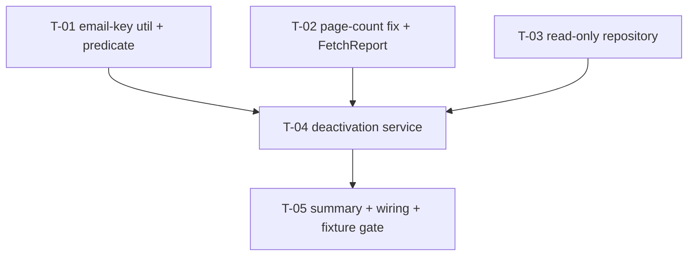

# Tasks — Agresso / Staff Deactivation · **Increment 1: Measurement**

- **Module:** agresso
- **Spec id:** 2026-09-agresso-staff-deactivation-i1
- **Status:** not-started
- **Owner:** ARI server squad
- **Linked requirements:** [`./requirements.md`](./requirements.md)
- **Linked design:** [`./design.md`](./design.md)
- **Last updated:** 2026-09-16

> **Budget (design §14): 5 tasks · ~850 LOC · 2 review rounds.** Exceeding any of these is information —
> stop and escalate rather than continuing.
>
> **No task in this increment may introduce an `UPDATE`, `INSERT`, `DELETE` or a transaction.** T-05's
> fixture gate exists to catch a violation; a task that needs one is increment 2's.

---

## 1. Execution arrangement

| Role | Host |
| --- | --- |
| Leader — plan, adjudicate, audit trail | Claude Code (`opus`) |
| Implementer | **Cursor** (`cursor-agent -p`) and **Claude Code**, split by task below |
| Reviewer — spec-conformance, read-only | Must differ from whoever implemented the task under review |

*Codex is out for this run by user ruling (2026-09-16).* Where Claude Code implements a task, its
review goes to Cursor, and vice versa — `author ≠ auditor` holds per task, not per run.

---

## 2. Dependency graph

`T-01`, `T-02` and `T-03` are **parallel-safe** (disjoint files). `T-04` needs all three. Two
implementers max, both in the server package — per the concurrency rule, **the Leader re-measures the
full suite after each worker reports**; workers verify only their own scope.

**PR strategy** (~850 LOC crosses the ~400-LOC single-PR line):

| PR | Tasks | ~LOC | Reviewer sees |
| --- | --- | --- | --- |
| **PR 1 — foundations** | T-01, T-02, T-03 | ~300 | Three independent, additive units. Review the `ceil` change first: it is the only one touching shipped behaviour |
| **PR 2 — the measurement** | T-04, T-05 | ~550 | Depends on PR 1. Review `shieldKeyFor`'s call sites first, then the zero-delta fixture. Out of scope: anything that writes — that is increment 2 |

---

## 3. Task list

### T-01 — Extract `normalizeEmail` and add the shield predicate beside it

- **Requirements covered:** R-AGD-001 AC.4, R-AGD-002 AC.1–AC.5
- **Design:** §5.3, `DD-D5`
- **Files:** `…/staff/email-key.util.ts` (new) · `…/staff/email-key.util.spec.ts` (new) · `…/staff/sec-user-reconciler.service.ts` (delegate only)
- **Description:** Create one module exporting `normalizeEmail(email)` — `email.trim().toLowerCase()` — and `shieldKeyFor(email): string | null`, which returns `null` when `email` is null/undefined or `email.trim()` is empty, and the normalized key otherwise. The reconciler's private `normalizeEmail` delegates to the util; **its behaviour must not change**.
- **Implementation notes:**
  - `shieldKeyFor` MUST guard null **before** calling `trim()` — the shield runs over the raw payload, before the only existing null guard.
  - `shieldKeyFor` MUST NOT consult `isUsableEmail` or any length limit. It measures the trimmed value; `isUsableEmail` measures the raw one, and that mismatch is `JD-3`.
  - Do not change `isUsableEmail` itself — the sibling's create/refresh path depends on its current semantics.
- **Done check:**
  - [ ] `shieldKeyFor('  MARIA.GOMEZ@CGIAR.ORG ')` → `'maria.gomez@cgiar.org'`
  - [ ] `shieldKeyFor('x@y.org' + ' '.repeat(140))` (raw 147+, trimmed short) → the trimmed key, **not** `null`
  - [ ] `shieldKeyFor(null)`, `shieldKeyFor(undefined)`, `shieldKeyFor('   ')` → `null`, no throw
  - [ ] The reconciler's existing suite passes **unchanged** — this is a behaviour-preserving move
- **Red input (K-012):** implement `shieldKeyFor` as `isUsableEmail(e) ? normalizeEmail(e) : null` → the padded-email case returns `null` and its test fails.
- **Disqualifies:** if the reconciler's suite needed *any* edit to pass, the move was not behaviour-preserving — report the divergence instead of adjusting the test (K-019).
- **Tests:** `email-key.util.spec.ts`. **Presence is not proof** — asserting the util exists proves nothing; the done-checks assert returned values.
- **Effort:** S · **Deps:** none · **Skills:** `nestjs-expert` · **Status:** todo

---

### T-02 — Fix the page count and record a per-page `FetchReport`

- **Requirements covered:** R-AGD-004 AC.2, AC.4
- **Design:** §5.1, `DD-D2`, §13
- **Files:** `…/staff/agresso-staff-tools.service.ts` · `…/staff/agresso-staff-tools.service.spec.ts`
- **Description:** Replace `Math.round(total/1000) + (total % 1000 !== 0 ? 1 : 0)` with `Math.ceil(total / pageSize)`, and have `findNumberOfPages` return `{ pages, totalElements }` instead of discarding the total. In the page loop, record per-page contributed row counts into a `FetchReport { totalElements, pageRowCounts: number[], distinctCarnets: number }`.
- **Implementation notes:**
  - `distinctCarnets` counts **non-empty, trimmed** `resourceId` values across the whole accumulated payload — this is the measure C-2 compares, and the one `JD-1` found missing.
  - Per-page count = `allStaff.length` after minus before. Do not infer it from the mapper's return.
  - The `?status=active` parameter stays in the shared `query()` builder — it must reach both the count call and the page fetch, or pagination desynchronises.
- **Done check:**
  - [ ] `findNumberOfPages` returns `3` for `totalElements = 2500` (was `4`) and `1` for `500` (was `2`)
  - [ ] `pageRowCounts.length === pages`, and each entry equals that page's contribution
  - [ ] `distinctCarnets` counts distinct values, proven with a payload repeating one carnet
  - [ ] The existing URL assertion still asserts `status=active` on **both** call sites
- **Red input (K-012):** revert to `round + remainder` → the `2500 → 3` case fails. Separately, feed a payload where two rows share a `resourceId` → a `distinctCarnets` implemented as `allStaff.length` fails.
- **Disqualifies:** a `distinctCarnets` test built from rows with identical defaults cannot distinguish distinct counting from row counting — **vary the carnet per row** (KZ-004).
- **Tests:** extend `agresso-staff-tools.service.spec.ts`.
- **Effort:** S · **Deps:** none · **Skills:** `nestjs-expert` · **Status:** todo

---

### T-03 — `SecUserDeactivationRepository` — read-only SQL

- **Requirements covered:** R-AGD-003 AC.1/AC.2, R-AGD-004 AC.5, NFR-AGD-001, NFR-AGD-004, NFR-AGD-005
- **Design:** §2.1, §2.2, §5.5, `DD-D6`
- **Files:** `…/staff/sec-user-deactivation.repository.ts` (new) · `…/staff/sec-user-deactivation.repository.spec.ts` (new) · `…/staff/agresso-staff-tools.module.ts`
- **Description:** A singleton repository holding **every** SQL statement this increment issues, all reads: `resolveExternalStatusId()`, `countActivePopulation()`, and a delegation to the reconciler repository's chunked role read for EX-2.
- **Implementation notes:**
  - Constructor takes `EntityManager` **only**. It MUST NOT inject `AppConfigService`, `CurrentUserUtil`, or `AppSecretRepository` — all carry or propagate `Scope.REQUEST`, and `mapping-phase.resolver.ts:11-15` forbids exactly this.
  - `resolveExternalStatusId` → `SELECT user_status_id, name FROM user_status WHERE is_active = 1 AND deleted_at IS NULL`; trim+lowercase both sides; compare to `'external'`. Return the id on exactly one match, otherwise the match count so the caller can abort with it.
  - Coerce every branched column: `Number(...)` for `user_status_id` and `status_id`, `Boolean(...)` for `is_active`. Raw `Repository.query` returns unhydrated driver values.
  - Register both new providers in `AgressoStaffModule`. **No new module import is needed** — verify that stays true.
- **Done check:**
  - [ ] Two `user_status` rows named `External` → returns a match count of 2, not an id
  - [ ] Zero matches → match count 0
  - [ ] A soft-deleted (`deleted_at` set) or `is_active = 0` `External` row is **not** counted
  - [ ] Every statement is a `SELECT` — no `UPDATE`/`INSERT`/`DELETE` token anywhere in the file
  - [ ] The module compiles with both providers as singletons
- **Red input (K-012):** drop `AND deleted_at IS NULL` → the soft-deleted-row case returns 2 matches and fails. Inject `AppConfigService` → the singleton-scope assertion fails.
- **Disqualifies:** a mocked query builder **cannot represent SQL operator precedence or the effect of a `WHERE` predicate** — the `deleted_at`/`is_active` filtering claim is asserted against generated SQL or at the fixture tier (T-05), never against a call sequence (KZ-017).
- **Tests:** `sec-user-deactivation.repository.spec.ts`; the predicate claims are re-asserted in T-05.
- **Effort:** M · **Deps:** none · **Skills:** `nestjs-expert` · **Status:** todo

---

### T-04 — `SecUserDeactivationService` — shields, exclusions, preconditions, candidate set

- **Requirements covered:** R-AGD-001, R-AGD-002, R-AGD-003, R-AGD-004
- **Design:** §5.1–§5.5
- **Files:** `…/staff/sec-user-deactivation.service.ts` (new) · `…/staff/sec-user-deactivation.service.spec.ts` (new)
- **Description:** The decision logic. Takes the raw payload, the reconciler's `sec_users` snapshot and the `FetchReport`; returns a measurement result. **Opens no transaction and issues no write.**
- **Implementation notes:**
  - Order: preconditions → shields → candidates → exclusions → report. An aborted run returns its counts and **no candidate set**.
  - `shieldKeys` is built from the **raw payload** with `shieldKeyFor`, before validation and before the collapse.
  - Candidates start as every snapshot row with `is_active = 1`. **Do not subtract `matchedIds`** — every matched key is in `shieldKeys` already, and subtracting made EX-3's rationale unreachable (`JD-7`).
  - EX-3 is evaluated over **candidates after shield removal**, never over the full index.
  - C-2: abort if `distinctCarnets < totalElements`, or if any page **except the last** contributed 0 rows.
  - The whole pass is wrapped so it never throws — the controller does not `await` it.
- **Done check:**
  - [ ] **The `JD-3` case:** a member with a 161-char padded email whose trimmed value matches active row 812 → 812 is **not** a candidate
  - [ ] A `CARNET_TOO_LONG` member with a valid email shields its account
  - [ ] A collapsed loser's key shields
  - [ ] A member with `email: null` does not throw and the pass completes
  - [ ] EX-4: a candidate whose own email is `''` or whitespace is excluded as `excludedUnmatchable`
  - [ ] EX-3: two **active** rows at one unmatched key → both excluded; one active + one inactive → the active row **is** a candidate
  - [ ] EX-2: an active `role_id = 1` row shields; an inactive-only one does not
  - [ ] C-2 distinctness: 1995 distinct carnets against `totalElements = 2000` → abort, duplicated carnets listed
  - [ ] C-2 last page: a final page contributing 0 rows does **not** trigger the empty-page clause
  - [ ] C-1: `totalElements = 0` → abort, no candidate set
- **Red input (K-012), one per clause — each observed FAILING before it is trusted (K-004):**
  - Swap `shieldKeyFor` → `isUsableEmail` ⇒ the padded-email check fails
  - Compare `allStaff.length` instead of `distinctCarnets` ⇒ the 1995/2000 check fails
  - Count inactive rows in EX-3 ⇒ the one-active-one-inactive check fails
  - Drop the last-page exemption ⇒ the short-final-page check fails
  - Build `shieldKeys` after `validate()` ⇒ the `CARNET_TOO_LONG` check fails
- **Disqualifies:** a fixture whose members share identical emails/carnets cannot distinguish per-member scoping from a batch-wide bug — **vary at least one discriminating field per member** (KZ-004). A test asserting a rule "is applied" without asserting the resulting candidate set proves presence, not effect.
- **Tests:** `sec-user-deactivation.service.spec.ts`. This is the task's own gate tier; DB-level claims belong to T-05.
- **Effort:** L · **Deps:** T-01, T-02, T-03 · **Skills:** `nestjs-expert`, `tdd` · **Status:** todo

---

### T-05 — Summary fields, wiring, and the no-write fixture gate

- **Requirements covered:** R-AGD-005, NFR-AGD-002, NFR-AGD-003
- **Design:** §2, §9, §10, `DD-D8`
- **Files:** `…/staff/dto/sec-user-reconciliation-summary.dto.ts` · `…/staff/agresso-staff-tools.service.ts` · `test/fixtures/agresso-staff-deactivation.fixture-spec.ts` (new)
- **Description:** Add this increment's summary fields, wire stage 5 into `cloneAllAgressoStaff` after `applyCreateAndGrant`, and add the fixture proving the increment writes nothing.
- **Implementation notes:**
  - `deactivationAbortReason` is a **new field**. Do **not** reuse the sibling's `abortReason` — it already carries `'GRANT_ASSERTION'`, and one field cannot hold two independent outcomes (`JS-4`).
  - `abortDetail` carries the abort's operand: page number, duplicated carnets, or `user_status` match count.
  - `shieldedBySkip` carries `{accountId, reason}` entries, not a bare count.
  - The fixture file MUST be named `*.fixture-spec.ts` or **no config collects it** — `npm test` uses `rootDir: src`, and `jest-fixtures.json` matches `.fixture-spec.ts$` only.
- **Done check:**
  - [ ] **Zero row deltas:** row counts and `is_active` sums over `sec_users`, `sec_user_roles` and `app_secrets` are byte-identical before and after a full run against the scratch schema
  - [ ] A successful run omits `deactivationAbortReason` entirely (absent, not `null`)
  - [ ] An aborted run reports counts + reason + `abortDetail`, and no candidate set
  - [ ] The sibling's `abortReason` is still independently set and readable
  - [ ] `user_status` resolution and the `deleted_at`/`is_active` predicates hold against real MySQL (T-03's deferred claim)
  - [ ] `/swagger` still renders the endpoint
- **Red input (K-012):** add a single `UPDATE sec_users SET is_active = 0 WHERE sec_user_id = <a candidate>` inside the service ⇒ the zero-delta assertion fails. This mutation MUST be run and observed red, then reverted — the gate is the increment's central safety claim and an unexercised one is worthless.
- **Disqualifies:** a zero-delta assertion over a database where the candidate set was **empty** proves nothing — the fixture MUST seed a payload/`sec_users` state producing **at least one** candidate, and assert the candidate count is non-zero **in the same test**. Without that the gate passes vacuously.
- **Tests:** `npm run test:fixtures` (single worker, scratch schema). **`npm test` is not evidence for any claim in this task** — `rootDir: src` never executes `test/fixtures/`.
- **Effort:** M · **Deps:** T-04 · **Skills:** `nestjs-expert` · **Status:** todo

---

## 4. Testing expectations

| Gate | Command | Note |
| --- | --- | --- |
| Unit | `npm test -- --silent` | Full suite re-measured by the Leader after each worker reports, never concurrently with an active worker |
| Fixture | `npm run test:fixtures` | Single worker. The **only** tier that is evidence for a DB claim |
| Lint | `npx eslint <path>` | Bare — `npm run lint` carries `--fix` and mutates (K-001) |
| Types | `npx tsc --noEmit` | |

A worker may run `npx prettier --write` on its own files; the Leader verifies. No single command both fixes and verifies.

---

## 5. Risks & blockers log

| # | Date | Risk / Blocker | Mitigation | Status |
| --- | --- | --- | --- | --- |
| RB-1 | 2026-09-16 | **The problem is not solved when this ships** — departed staff keep access | Increment 2 dated before this merges (requirements `RSK-1`, design `OQ-3`) | **open** |
| RB-2 | 2026-09-16 | `JS-1` — C-4 proves a named row exists, not that external accounts use it | This increment measures `excludedExternal`; increment 2 must not be designed until it is read | open |
| RB-3 | 2026-09-16 | Fixture tier needs the scratch schema up (`compose:test:up`, `migration:test:bootstrap`) | Pre-flight before T-05 starts, not when it fails | open |

---

## 6. Done definition

- [ ] All five tasks `done`
- [ ] **A human has triggered the endpoint against Dev and read the report** — this is the increment's purpose and the substitute control for its one ungateable class; it happens **before** any validation verdict (KZ-007)
- [ ] The four measurements are recorded: `deactivationCandidates`, `activePopulation`, `excludedExternal`, `distinctCarnets` vs `totalElements`
- [ ] Zero-delta fixture observed **red** under the injected-write mutation, then green
- [ ] Coverage thresholds still green (60% server floor)
- [ ] Increment 2 has a date
