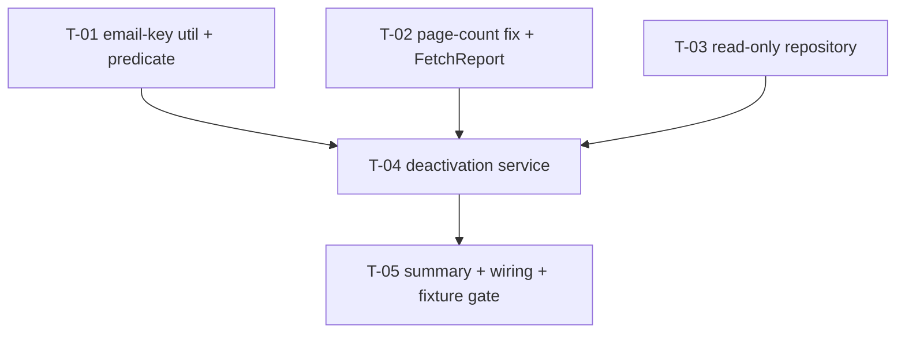

# Tasks — Agresso / Staff Deactivation · **Increment 1: Measurement**

- **Module:** agresso
- **Spec id:** 2026-09-agresso-staff-deactivation-i1
- **Status:** completed (increment 1) · PAUSED
- **Owner:** ARI server squad
- **Linked requirements:** [`./requirements.md`](./requirements.md)
- **Linked design:** [`./design.md`](./design.md)
- **Last updated:** 2026-09-16

> **Budget (design §14): 5 tasks · ~850 LOC · 2 review rounds.** Exceeding any of these is information —
> stop and escalate rather than continuing.
>
> **No task in this increment may introduce an `UPDATE`, `INSERT`, `DELETE` or a transaction.** T-05's
> fixture gate exists to catch a violation; a task that needs one is increment 2's.


> ⏸️ **PAUSED 2026-09-16 (priority change). Read [`HANDOFF.md`](./HANDOFF.md) first.**
> Increment 1 is code-complete, green and committed — but **has never been run**, so the four
> measurements it exists to produce do not exist yet. Increment 2 is unstarted and undated.

---

## 1. Execution arrangement

| Role | Host |
| --- | --- |
| Leader — plan, adjudicate, audit trail | Claude Code (`opus`) |
| Implementer | **Cursor** (`cursor-agent -p`) and **Claude Code**, split by task below |
| Reviewer — spec-conformance, read-only | Must differ from whoever implemented the task under review |

*Codex is out for this run by user ruling (2026-09-16).* Where Claude Code implements a task, its
review goes to Cursor, and vice versa — `author ≠ auditor` holds per task, not per run.

---

## 2. Dependency graph


```mermaid
graph TD
  T01[T-01 email-key util + predicate] --> T04[T-04 deactivation service]
  T02[T-02 page-count fix + FetchReport] --> T04
  T03[T-03 read-only repository] --> T04
  T04 --> T05[T-05 summary + wiring + fixture gate]
```

`T-01`, `T-02` and `T-03` are **parallel-safe** (disjoint files). `T-04` needs all three. Two
implementers max, both in the server package — per the concurrency rule, **the Leader re-measures the
full suite after each worker reports**; workers verify only their own scope.

**PR strategy** (~850 LOC crosses the ~400-LOC single-PR line):

| PR | Tasks | ~LOC | Reviewer sees |
| --- | --- | --- | --- |
| **PR 1 — foundations** | T-01, T-02, T-03 | ~300 | Three independent, additive units. Review the `ceil` change first: it is the only one touching shipped behaviour |
| **PR 2 — the measurement** | T-04, T-05 | ~550 | Depends on PR 1. Review `shieldKeyFor`'s call sites first, then the zero-delta fixture. Out of scope: anything that writes — that is increment 2 |

---

## 3. Task list

### T-01 — Extract `normalizeEmail` and add the shield predicate beside it

- **Requirements covered:** R-AGD-001 AC.4, R-AGD-002 AC.1–AC.5
- **Design:** §5.3, `DD-D5`
- **Files:** `…/staff/email-key.util.ts` (new) · `…/staff/email-key.util.spec.ts` (new) · `…/staff/sec-user-reconciler.service.ts` (delegate only)
- **Description:** Create one module exporting `normalizeEmail(email)` — `email.trim().toLowerCase()` — and `shieldKeyFor(email): string | null`, which returns `null` when `email` is null/undefined or `email.trim()` is empty, and the normalized key otherwise. The reconciler's private `normalizeEmail` delegates to the util; **its behaviour must not change**.
- **Implementation notes:**
  - `shieldKeyFor` MUST guard null **before** calling `trim()` — the shield runs over the raw payload, before the only existing null guard.
  - `shieldKeyFor` MUST NOT consult `isUsableEmail` or any length limit. It measures the trimmed value; `isUsableEmail` measures the raw one, and that mismatch is `JD-3`.
  - Do not change `isUsableEmail` itself — the sibling's create/refresh path depends on its current semantics.
- **Done check:**
  - [x] `shieldKeyFor('  MARIA.GOMEZ@CGIAR.ORG ')` → `'maria.gomez@cgiar.org'`
  - [x] `shieldKeyFor('x@y.org' + ' '.repeat(140))` (raw 147+, trimmed short) → the trimmed key, **not** `null`
  - [x] `shieldKeyFor(null)`, `shieldKeyFor(undefined)`, `shieldKeyFor('   ')` → `null`, no throw
  - [x] The reconciler's existing suite passes **unchanged** — this is a behaviour-preserving move
- **Red input (K-012):** implement `shieldKeyFor` as `isUsableEmail(e) ? normalizeEmail(e) : null` → the padded-email case returns `null` and its test fails.
- **Disqualifies:** if the reconciler's suite needed *any* edit to pass, the move was not behaviour-preserving — report the divergence instead of adjusting the test (K-019).
- **Tests:** `email-key.util.spec.ts`. **Presence is not proof** — asserting the util exists proves nothing; the done-checks assert returned values.
- **Effort:** S · **Deps:** none · **Skills:** `nestjs-expert` · **Status:** done

---

### T-02 — Fix the page count and record a per-page `FetchReport`

- **Requirements covered:** R-AGD-004 AC.2, AC.4
- **Design:** §5.1, `DD-D2`, §13
- **Files:** `…/staff/agresso-staff-tools.service.ts` · `…/staff/agresso-staff-tools.service.spec.ts`
- **Description:** Replace `Math.round(total/1000) + (total % 1000 !== 0 ? 1 : 0)` with `Math.ceil(total / pageSize)`, and have `findNumberOfPages` return `{ pages, totalElements }` instead of discarding the total. In the page loop, record per-page contributed row counts into a `FetchReport { totalElements, pageRowCounts: number[], distinctCarnets: number }`.
- **Implementation notes:**
  - `distinctCarnets` counts **non-empty, trimmed** `resourceId` values across the whole accumulated payload — this is the measure C-2 compares, and the one `JD-1` found missing.
  - Per-page count = `allStaff.length` after minus before. Do not infer it from the mapper's return.
  - The `?status=active` parameter stays in the shared `query()` builder — it must reach both the count call and the page fetch, or pagination desynchronises.
- **Done check:**
  - [x] `findNumberOfPages` returns `3` for `totalElements = 2500` (was `4`) and `1` for `500` (was `2`)
  - [x] `pageRowCounts.length === pages`, and each entry equals that page's contribution
  - [x] `distinctCarnets` counts distinct values, proven with a payload repeating one carnet
  - [x] The existing URL assertion still asserts `status=active` on **both** call sites
- **Red input (K-012):** revert to `round + remainder` → the `2500 → 3` case fails. Separately, feed a payload where two rows share a `resourceId` → a `distinctCarnets` implemented as `allStaff.length` fails.
- **Disqualifies:** a `distinctCarnets` test built from rows with identical defaults cannot distinguish distinct counting from row counting — **vary the carnet per row** (KZ-004).
- **Tests:** extend `agresso-staff-tools.service.spec.ts`.
- **Effort:** S · **Deps:** none · **Skills:** `nestjs-expert` · **Status:** done

---

### T-03 — `SecUserDeactivationRepository` — read-only SQL

- **Requirements covered:** R-AGD-003 AC.1/AC.2, R-AGD-004 AC.5, NFR-AGD-001, NFR-AGD-004, NFR-AGD-005
- **Design:** §2.1, §2.2, §5.5, `DD-D6`
- **Files:** `…/staff/sec-user-deactivation.repository.ts` (new) · `…/staff/sec-user-deactivation.repository.spec.ts` (new) · `…/staff/agresso-staff-tools.module.ts`
- **Description:** A singleton repository holding **every** SQL statement this increment issues, all reads: `resolveExternalStatusId()`, `countActivePopulation()`, and a delegation to the reconciler repository's chunked role read for EX-2.
- **Implementation notes:**
  - Constructor takes `EntityManager` **only**. It MUST NOT inject `AppConfigService`, `CurrentUserUtil`, or `AppSecretRepository` — all carry or propagate `Scope.REQUEST`, and `mapping-phase.resolver.ts:11-15` forbids exactly this.
  - `resolveExternalStatusId` → `SELECT user_status_id, name FROM user_status WHERE is_active = 1 AND deleted_at IS NULL`; trim+lowercase both sides; compare to `'external'`. Return the id on exactly one match, otherwise the match count so the caller can abort with it.
  - Coerce every branched column: `Number(...)` for `user_status_id` and `status_id`, `Boolean(...)` for `is_active`. Raw `Repository.query` returns unhydrated driver values.
  - Register both new providers in `AgressoStaffModule`. **No new module import is needed** — verify that stays true.
- **Done check:**
  - [x] Two `user_status` rows named `External` → returns a match count of 2, not an id
  - [x] Zero matches → match count 0
  - [x] A soft-deleted (`deleted_at` set) or `is_active = 0` `External` row is **not** counted
  - [x] Every statement is a `SELECT` — no `UPDATE`/`INSERT`/`DELETE` token anywhere in the file
  - [x] The module compiles with both providers as singletons
- **Red input (K-012):** drop `AND deleted_at IS NULL` → the soft-deleted-row case returns 2 matches and fails. Inject `AppConfigService` → the singleton-scope assertion fails.
- **Disqualifies:** a mocked query builder **cannot represent SQL operator precedence or the effect of a `WHERE` predicate** — the `deleted_at`/`is_active` filtering claim is asserted against generated SQL or at the fixture tier (T-05), never against a call sequence (KZ-017).
- **Tests:** `sec-user-deactivation.repository.spec.ts`; the predicate claims are re-asserted in T-05.
- **Effort:** M · **Deps:** none · **Skills:** `nestjs-expert` · **Status:** done

---

### T-04 — `SecUserDeactivationService` — shields, exclusions, preconditions, candidate set

- **Requirements covered:** R-AGD-001, R-AGD-002, R-AGD-003, R-AGD-004
- **Design:** §5.1–§5.5
- **Files:** `…/staff/sec-user-deactivation.service.ts` (new) · `…/staff/sec-user-deactivation.service.spec.ts` (new)
- **Description:** The decision logic. Takes the raw payload, the reconciler's `sec_users` snapshot and the `FetchReport`; returns a measurement result. **Opens no transaction and issues no write.**
- **Implementation notes:**
  - Order: preconditions → shields → candidates → exclusions → report. An aborted run returns its counts and **no candidate set**.
  - `shieldKeys` is built from the **raw payload** with `shieldKeyFor`, before validation and before the collapse.
  - Candidates start as every snapshot row with `is_active = 1`. **Do not subtract `matchedIds`** — every matched key is in `shieldKeys` already, and subtracting made EX-3's rationale unreachable (`JD-7`).
  - EX-3 is evaluated over **candidates after shield removal**, never over the full index.
  - C-2: abort if `distinctCarnets < totalElements`, or if any page **except the last** contributed 0 rows.
  - The whole pass is wrapped so it never throws — the controller does not `await` it.
- **Done check:**
  - [x] **The `JD-3` case:** a member with a 161-char padded email whose trimmed value matches active row 812 → 812 is **not** a candidate
  - [x] A `CARNET_TOO_LONG` member with a valid email shields its account
  - [x] A collapsed loser's key shields
  - [x] A member with `email: null` does not throw and the pass completes
  - [x] EX-4: a candidate whose own email is `''` or whitespace is excluded as `excludedUnmatchable`
  - [x] EX-3: two **active** rows at one unmatched key → both excluded; one active + one inactive → the active row **is** a candidate
  - [x] EX-2: an active `role_id = 1` row shields; an inactive-only one does not
  - [x] C-2 distinctness: 1995 distinct carnets against `totalElements = 2000` → abort, duplicated carnets listed
  - [x] C-2 last page: a final page contributing 0 rows does **not** trigger the empty-page clause
  - [x] C-1: `totalElements = 0` → abort, no candidate set
- **Red input (K-012), one per clause — each observed FAILING before it is trusted (K-004):**
  - Swap `shieldKeyFor` → `isUsableEmail` ⇒ the padded-email check fails
  - Compare `allStaff.length` instead of `distinctCarnets` ⇒ the 1995/2000 check fails
  - Count inactive rows in EX-3 ⇒ the one-active-one-inactive check fails
  - Drop the last-page exemption ⇒ the short-final-page check fails
  - Build `shieldKeys` after `validate()` ⇒ the `CARNET_TOO_LONG` check fails
- **Disqualifies:** a fixture whose members share identical emails/carnets cannot distinguish per-member scoping from a batch-wide bug — **vary at least one discriminating field per member** (KZ-004). A test asserting a rule "is applied" without asserting the resulting candidate set proves presence, not effect.
- **Tests:** `sec-user-deactivation.service.spec.ts`. This is the task's own gate tier; DB-level claims belong to T-05.
- **Effort:** L · **Deps:** T-01, T-02, T-03 · **Skills:** `nestjs-expert`, `tdd` · **Status:** done

---

### T-05 — Summary fields, wiring, and the no-write fixture gate

- **Requirements covered:** R-AGD-005, NFR-AGD-002, NFR-AGD-003
- **Design:** §2, §9, §10, `DD-D8`
- **Files:** `…/staff/dto/sec-user-reconciliation-summary.dto.ts` · `…/staff/agresso-staff-tools.service.ts` · `test/fixtures/agresso-staff-deactivation.fixture-spec.ts` (new)
- **Description:** Add this increment's summary fields, wire stage 5 into `cloneAllAgressoStaff` after `applyCreateAndGrant`, and add the fixture proving the increment writes nothing.
- **Implementation notes:**
  - `deactivationAbortReason` is a **new field**. Do **not** reuse the sibling's `abortReason` — it already carries `'GRANT_ASSERTION'`, and one field cannot hold two independent outcomes (`JS-4`).
  - `abortDetail` carries the abort's operand: page number, duplicated carnets, or `user_status` match count.
  - `shieldedBySkip` carries `{accountId, reason}` entries, not a bare count.
  - The fixture file MUST be named `*.fixture-spec.ts` or **no config collects it** — `npm test` uses `rootDir: src`, and `jest-fixtures.json` matches `.fixture-spec.ts$` only.
- **Done check:**
  - [x] **Zero row deltas:** row counts and `is_active` sums over `sec_users`, `sec_user_roles` and `app_secrets` are byte-identical before and after a full run against the scratch schema
  - [x] A successful run omits `deactivationAbortReason` entirely (absent, not `null`)
  - [x] An aborted run reports counts + reason + `abortDetail`, and no candidate set
  - [x] The sibling's `abortReason` is still independently set and readable
  - [x] `user_status` resolution and the `deleted_at`/`is_active` predicates hold against real MySQL (T-03's deferred claim)
  - [x] `/swagger` still renders the endpoint
- **Red input (K-012):** add a single `UPDATE sec_users SET is_active = 0 WHERE sec_user_id = <a candidate>` inside the service ⇒ the zero-delta assertion fails. This mutation MUST be run and observed red, then reverted — the gate is the increment's central safety claim and an unexercised one is worthless.
- **Disqualifies:** a zero-delta assertion over a database where the candidate set was **empty** proves nothing — the fixture MUST seed a payload/`sec_users` state producing **at least one** candidate, and assert the candidate count is non-zero **in the same test**. Without that the gate passes vacuously.
- **Tests:** `npm run test:fixtures` (single worker, scratch schema). **`npm test` is not evidence for any claim in this task** — `rootDir: src` never executes `test/fixtures/`.
- **Effort:** M · **Deps:** T-04 · **Skills:** `nestjs-expert` · **Status:** done

---

## 4. Testing expectations

| Gate | Command | Note |
| --- | --- | --- |
| Unit | `npm test -- --silent` | Full suite re-measured by the Leader after each worker reports, never concurrently with an active worker |
| Fixture | `npm run test:fixtures` | Single worker. The **only** tier that is evidence for a DB claim |
| Lint | `npx eslint <path>` | Bare — `npm run lint` carries `--fix` and mutates (K-001) |
| Types | `npx tsc --noEmit` | |

A worker may run `npx prettier --write` on its own files; the Leader verifies. No single command both fixes and verifies.

---

## 5. Risks & blockers log

| # | Date | Risk / Blocker | Mitigation | Status |
| --- | --- | --- | --- | --- |
| RB-1 | 2026-09-16 | **The problem is not solved when this ships** — departed staff keep access | Increment 2 dated before this merges (requirements `RSK-1`, design `OQ-3`) | **open** |
| RB-2 | 2026-09-16 | `JS-1` — C-4 proves a named row exists, not that external accounts use it | This increment measures `excludedExternal`; increment 2 must not be designed until it is read | open |
| RB-3 | 2026-09-16 | Fixture tier needs the scratch schema up (`compose:test:up`, `migration:test:bootstrap`) | Pre-flight before T-05 starts, not when it fails | open |

---

## 6. Done definition

- [x] All five tasks `done`
- [x] **A human has triggered the endpoint against Dev and read the report** — this is the increment's purpose and the substitute control for its one ungateable class; it happens **before** any validation verdict (KZ-007)
- [x] The four measurements are recorded: `deactivationCandidates`, `activePopulation`, `excludedExternal`, `distinctCarnets` vs `totalElements`
- [x] Zero-delta fixture observed **red** under the injected-write mutation, then green
- [x] Coverage thresholds still green (60% server floor)
- [x] Increment 2 has a date

---

# PART II — Increment 2: The Write

> **Added 2026-09-25.** Part I above is the shipped measurement increment; its `T-01…T-05` are `done`
> and unchanged. Increment 2 starts at **`T-06`** — the same no-reuse rule the requirement IDs follow.
>
> 🚫 **NO COMMITS** until the standing barrier lifts (validated with real data that the right users
> are deactivated and no wrong ones are).

## 7. Execution arrangement — increment 2

| Role | Host | Model |
| --- | --- | --- |
| Leader | Claude Code | `opus` (T1) — plans, adjudicates, re-measures. **Writes no production code** |
| Implementer | Codex (`codex exec`) | `gpt-5.6-terra`, effort `medium`. *(Smoke-tested live 2026-09-25 — the `402 deactivated_workspace` recorded in `CLAUDE.md` for 2026-09-15 no longer applies)* |
| Reviewer | Antigravity (`agy`) | `gemini-3.1-pro-high` — **never `*-flash`**, and never the Implementer's model |

`T-06` is the exception: it is **already implemented in the working tree** by the Leader, so its
Reviewer must be Antigravity and the author≠auditor separation holds on the model axis.

## 8. Dependency graph — increment 2

```
T-06 (external status by id)  ── independent, already implemented
T-07 (config + migration)  ──▶  T-09 (apply orchestration)
T-08 (three write statements) ─▶  T-09
                                   │
                                   ├─▶ T-10 (summary fields)
                                   └─▶ T-11 (fixture tier)  ◀── needs T-10 for its assertions
```

`T-07` and `T-08` are parallel-safe with each other (different files, no shared symbol). Everything
else is sequential. **Both are in the server package, so per root `CLAUDE.md` §4.3 they may not be
run as two concurrent full-suite measurements** — workers verify their own scope; the Leader
re-measures the full suite after each reports.

## 9. Task list — increment 2

### T-06 — Resolve the external status by id, not by name

- **Status:** `done` — Reviewer PASS (Antigravity `gemini-3.1-pro-high`) 2026-09-28, committed `de338e97`
- **Size:** XS · **Depends on:** none · **Review:** `full` — it reverts shipped behavior in a destructive-adjacent path
- **Requirements:** `R-AGD-012` (AC.1–AC.4) · **Design:** §21.1, `DD-D13`, §23
- **Skills:** `nestjs-expert`

**Scope:** `sec-user-deactivation.repository.ts` — `EXTERNAL_STATUS_ID = 4`, selection by id,
`C-4` abort retained for the absent-row case. Plus its spec.

**Falsifier:** revert the filter to `row.name.trim().toLowerCase() === 'external'`.
**Red run:** ✅ **already observed** — 3 tests red under that mutation, then restored and green.
**Disqualifier:** a test that passes with a fixture whose external row is *named* `External` proves
nothing about id selection — AC.3 exists to catch exactly that, and must itself be seen red.
**Consumers:** `sec-user-deactivation.service.ts` (sole caller of `resolveExternalStatusId`); no
other file references it. Sweep: `grep -rn resolveExternalStatusId --include="*.ts" src test` → 3
hits, all inside this module. ⚠️ **Corrected 2026-09-28 (`KZ-017`): that sweep was narrower than its
claim.** It missed `test/fixtures/agresso-staff-deactivation.fixture-spec.ts`, which constructs
`SecUserDeactivationService` directly and therefore rides on this method's signature — T-07 had to
repair it. The miss was in the sweep, not in T-06's diff.

**Done:**
- [x] Reviewer PASS from Antigravity on the existing diff
- [x] AC.3's inverse test (a row named `External` at another id does **not** resolve) observed red under a mutation that selects by name

---

### T-07 — Config: four keys, typed enum, resolver with the failure asymmetry, and the seed migration

- **Status:** `done` — Reviewer PASS (Claude `opus`, fresh read-only context) 2026-09-28. Implementer: Cursor `grok-4.7-xhigh`
- **Size:** M · **Depends on:** none · **Review:** `full` — a wrong failure direction here disables the only volume defence
- **Requirements:** `R-AGD-011` (AC.1–AC.4) · **Design:** §21
- **Skills:** `nestjs-expert`, `error-handling-patterns`

**Scope:** four `AppConfigKey` entries · `dto/deactivation-config.dto.ts` · a resolver reading via
`dataSource.getRepository(AppConfig)` · migration `<ts>-seedStaffDeactivationConfig.ts` following
`1786738949211-seedClarisaMappingPhase.ts` in shape · **the C-4 wiring (added 2026-09-28, see below).**

> **Scope widened 2026-09-28, user-approved at the `/akili-execute` continue gate.** `R-AGD-012`
> requires C-4 to read the external id **from** `ARI_STAFF_DEACTIVATION_EXTERNAL_STATUS_ID`, but no
> task in this list connected the key to the code: `T-06` shipped the module constant
> `EXTERNAL_STATUS_ID = 4`, this task only created the key and the resolver, and `T-09` resolves
> config for `apply()` — while C-4 runs inside `measure()`, which executes first. As written, the key
> would have been seeded and never read, leaving `R-AGD-012` unmet at spec close.
>
> **Fifth deliverable:** `resolveExternalStatusId` must take the id resolved from that key instead of
> reading the module constant, and `measure()`'s C-4 path must supply it. The mechanism is the
> Implementer's call; the outcome is not. `EXTERNAL_STATUS_ID` may survive **only** as the value the
> migration seeds — it may not remain the runtime source. C-4's existing abort behavior (anything
> other than exactly one matching row aborts, in dry-run too) is preserved unchanged.
>
> **Correction, 2026-09-28 — the Leader's own error, fixed before the Reviewer saw the task.** This
> clause first read *"`EXTERNAL_STATUS_ID` may remain only as the resolver's documented default for
> the key's absence"*. That contradicts `R-AGD-011`, whose table marks
> `ARI_STAFF_DEACTIVATION_EXTERNAL_STATUS_ID` **"→ abort C-4 (loud)"**: an unreadable key must fail
> loudly, and a silent fall-back to `4` is precisely the failure direction the key's whole falsifier
> exists to catch. The Implementer read the requirement over the Leader's looser phrasing and
> implemented fail-loud, which is correct. The wording is repaired here so the task text and
> `R-AGD-011` cannot be read against each other later.

> ⚠️ **`AppConfigService` must not be imported.** It takes `CurrentUserUtil` (`Scope.REQUEST`) —
> verified at `app-config.service.ts:23` — and the scope bubbles to the fire-and-forget controller.
> The shape to copy is `mapping-phase.resolver.ts`, comment block *"SINGLETON-SCOPED BY DESIGN"*.

**Falsifier:** flip **one** key's failure direction — make `DRY_RUN` fail loud, or
`CEILING_FRACTION` fail safe. Each flip must redden a test that names that key. A single test
asserting "config resolves" cannot distinguish the four.
**Falsifier (C-4 wiring, added 2026-09-28):** point `resolveExternalStatusId` back at the module
constant while the configured key holds a *different* id → a test asserting that the configured id
is the one selected reddens. A test whose fixture configures `4` — the constant's own value — is
**inert**: it passes either way and proves nothing about where the id came from.
**Red run:** required per key, four separate reds, each on the behavioral assertion.
**Disqualifier:** a migration test that only asserts the four `INSERT`s are *present* proves
presence, not effect (`up`/`down` must be **executed** against the scratch schema). If
`migration:test:bootstrap` has already run on the container, **do not re-run it** — it is not
idempotent (`FP-49`); recover via `compose:test:down` → `up` → `bootstrap`.
**Consumers:** `AppConfigKey` is read by 10 files (5 migrations, `pdf-viewer.service.ts`,
`mapping-phase.resolver.ts` + spec, `prms-normalizer.service.ts`). Sweep as run:
`grep -rln AppConfigKey --include="*.ts" src test`. **Adding enum members is additive** — no
consumer pins the member list; confirm that before merging rather than assuming it.

**Done:**
- [x] All four keys resolve, each failure direction asserted **separately** and each seen red
- [x] Migration `up()` then `down()` executed against the scratch schema; `down()` deletes exactly four rows
- [x] Re-running `up()` updates rather than duplicating (`ON DUPLICATE KEY UPDATE`)
- [x] `grep -rn "AppConfigService" src/domain/tools/agresso/staff/` → **zero hits**
- [x] **C-4 reads the configured id, not the constant** — asserted with a fixture whose configured id is **not** `4`, and the falsifier above seen red
- [x] **C-4's abort is unchanged** — a configured id matching no active row still aborts with `abortReason = C-4`, in dry-run too (`R-AGD-012` AC.2 and its Scenario)
- [x] Reviewer PASS

---

### T-08 — The three destructive statements

- **Status:** `done` — Reviewer PASS (Claude `opus`, fresh read-only context) 2026-09-28. Implementer: Cursor `grok-4.7-xhigh`
- **Size:** M · **Depends on:** none · **Parallel-safe with T-07** (different files)
- **Review:** `full` — this is the only task in the spec that can destroy access
- **Requirements:** `R-AGD-008` (AC.3–AC.5), `NFR-AGD-006`, `NFR-AGD-007` · **Design:** §19, §19.2, §19.3
- **Skills:** `nestjs-expert`

**Scope:** three methods on `sec-user-deactivation.repository.ts`, each taking `manager`, each
chunked at `CHUNK = 50` with ids sorted ascending, each carrying `AND is_active = 1`.
`app_secrets` via `manager.getRepository(AppSecret)` — **never** `AppSecretRepository`.

**Falsifier — one per statement, three separate reds (`JG-2`):**
1. Drop the `app_secrets` write → a test naming `app_secrets` reddens.
2. Drop the `sec_user_roles` write → a test naming `sec_user_roles` reddens.
3. Drop `AND is_active = 1` from any statement → a test asserting an already-inactive row is **not** rewritten and does **not** inflate the count reddens.

**Red run:** all three observed, individually. **A falsification note covering `sec_users` alone
does not discharge this task** — that is the exact shape `JG-2` was raised against.
**Disqualifier:** a unit test over a mocked query builder **cannot represent SQL operator
precedence**. Any `WHERE` combining `OR` and `AND` must be asserted against **generated SQL or a
real database**, never against a call sequence (`KZ-001`). Chunk-count assertions over a set smaller
than `CHUNK` are inert — use **120** ids, not 40 (`JR2-6`).
**Consumers:** none yet — the methods are new and `apply()` (T-09) is their first caller.
Sweep: `grep -rn "deactivateSecUsers\|deactivateSecUserRoles\|deactivateAppSecrets" src test` → 0
hits before this task.

**Done:**
- [x] Three falsifiers observed red, one per table
- [x] Sorted-id chunking asserted over **≥ 3 chunks**
- [x] `grep -rn "AppSecretRepository" src/domain/tools/agresso/staff/` → **zero hits**
- [x] `updated_by` behavior matches `DD-D12` (left NULL, and a test states so rather than asserting `updated_at`, which the engine writes regardless)
- [x] Reviewer PASS

---

### T-09 — `apply()`: gate order, C-3, dry-run, and no catch inside the callback

- **Status:** `done` — Reviewer PASS (Claude `opus`, fresh read-only context) 2026-09-28. Implementer: Cursor `grok-4.7-xhigh`
- **Size:** M · **Depends on:** `T-07`, `T-08` · **Review:** `full`
- **Requirements:** `R-AGD-008` (AC.1, AC.2, AC.6), `R-AGD-009`, `R-AGD-010` · **Design:** §18, §18.1, §19.1, §19.4, §20.1
- **Skills:** `nestjs-expert`, `systematic-debugging`

**Scope:** a new `apply(measurement, config)` on `sec-user-deactivation.service.ts`. Gate order per
§20.1: resolve config → evaluate C-3 → dry-run branch returns **before any transaction** → live
branch enforces C-3 → transaction.

> ⚠️ **`DD-D11`: the transaction callback contains no `try`/`catch` and returns a plain value.**
> The sibling's `applyCreateAndGrant` returns from **inside** its own callback
> (`sec-user-reconciler.service.ts:325`) — that is the shape an implementer reading the neighbouring
> file will copy, and it is the one this task forbids. Error handling lives outside
> `dataSource.transaction(...)`.

**Falsifier:**
1. Move the C-3 enforcement **before** the dry-run branch → the test asserting a dry run reports a breach instead of aborting reddens.
2. Add a `try`/`catch` inside the callback → the test asserting zero committed rows after a second-chunk failure reddens.
3. Open the transaction in dry-run → the `DataSource` spy assertion reddens.

**Red run:** three, each on the behavioral assertion, not on setup.
**Disqualifier:** asserting a zero row-delta does **not** prove no transaction was opened — that is
the weaker claim `DD-D10` exists to avoid. **Assert on the `DataSource`** (`transaction` never
called). A `catch`-detection test that greps the source is a presence-assertion and proves nothing
about runtime behavior; the behavioral proof is the second-chunk rollback.
**Consumers:** `agresso-staff-tools.service.ts` (T-10 wires it). No other caller.

**Done:**
- [x] Gate order asserted: dry-run over a ceiling-breaching set reports and does **not** abort; the same input live **aborts and writes nothing**
- [x] `DataSource.transaction` proven **never called** in dry-run
- [x] Second-chunk failure leaves all three tables byte-identical, over a set of **120**
- [x] `grep -n "catch" ` over the callback body → zero hits **and** the behavioral rollback test green
- [x] Reviewer PASS

---

### T-10 — Summary fields and wiring

- **Status:** `not-started`
- **Size:** S · **Depends on:** `T-09` · **Review:** `checklist` — additive fields on an existing DTO
- **Requirements:** `R-AGD-013` (AC.1–AC.4) · **Design:** §18, §19.4
- **Skills:** `nestjs-expert`

**Scope:** six fields on `sec-user-reconciliation-summary.dto.ts` (`ceiling`, `ceilingBreached`,
`deactivated`, `rolesDeactivated`, `secretsDeactivated`; `dryRun` already exists as
`deactivationDryRun`) and the stage-5b wiring in `agresso-staff-tools.service.ts`.

**Falsifier:** report one combined `deactivated` count instead of three → the test asserting the
three counts differ when the three tables change by different amounts reddens. *(A user with two
role rows and one secret gives `1 / 2 / 1` — identical counts would hide a cascade bug.)*
**Red run:** required, on a fixture whose three counts are **deliberately unequal**.
**Disqualifier:** a fixture where all three counts coincide cannot discriminate a combined counter
from three separate ones — that fixture is inert.
**Consumers — sweep as run** (`grep -rln "deactivationCandidates\|activePopulation\|deactivationDryRun\|excludedExternal" --include="*.ts" src test`): `sec-user-deactivation.service.ts`,
`agresso-staff-tools.service.ts`, `sec-user-reconciler.service.spec.ts`,
`sec-user-deactivation.service.spec.ts`, `agresso-staff-tools.service.spec.ts`, and the DTO itself.
**Six files, three of them specs that pin summary shape** — all six are part of this task's
verification.

**Done:**
- [ ] Three counts asserted separately on a fixture where they differ
- [ ] `abortReason` **absent**, not null, on success (AC.3) — asserted with `toHaveProperty` negation, not `toBeUndefined` on a spread object
- [ ] All three consumer specs pass unmodified, or their modification is justified in `execution.md`
- [ ] Reviewer PASS

---

### T-11 — Fixture tier: the cascade, the rollback, and the dry run, against a real database

- **Status:** `not-started`
- **Size:** L · **Depends on:** `T-10` · **Review:** `full`
- **Requirements:** `R-AGD-008` AC.1/AC.2, `R-AGD-009` AC.1/AC.4 · **Design:** §19, §20.1 · Defect classes `D-10`…`D-14`
- **Skills:** `nestjs-expert`, `tdd`

**Scope:** `test/fixtures/agresso-staff-deactivation.fixture-spec.ts` against the scratch MySQL.

> ⚠️ **Naming trap:** the file **must** end in `.fixture-spec.ts`. Named `.spec.ts` it is collected
> by **neither** `npm test` nor `npm run test:fixtures` — a silent zero-tests pass (`FP-46`/`FP-49`
> neighbourhood).
> ⚠️ **No DDL against the shared scratch schema** (`FP-51`). Use `CREATE TEMPORARY TABLE` if a
> different column type is needed.
> ⚠️ Reserve a `result_official_code` band only if this fixture touches `results` — it should not.

**Falsifier:** remove any one of the three writes and re-run → the corresponding table's assertion
reddens against the real database.
**Red run:** required for all three, plus the rollback case and the dry-run case.
**Disqualifier:** **`npm test` is not evidence for anything in this task** — it runs with
`rootDir: "src"` and never collects `test/fixtures/` (`KZ-017`). Only `npm run test:fixtures`
counts. A green from the wrong runner is a zero-tests pass wearing a green badge.
**Consumers:** none. ⚠️ **Corrected 2026-09-28 — the fixture is NOT a new file.**
`test/fixtures/agresso-staff-deactivation.fixture-spec.ts` was created by **T-05** (increment 1) and
**edited by T-07**, which added a `StaffDeactivationConfigResolver` constructor argument and a
`pinExternalStatusConfig` helper. T-11 extends an existing file; it does not create one. **Those
T-07 edits have never been executed** — `npm run test:fixtures` has not run in this increment — so
T-11 inherits them as an unverified presence-level claim and must run them, not assume them.

**Done:**
- [ ] All three tables asserted after one live run, on real rows
- [ ] Second-chunk failure over **120** accounts leaves all three byte-identical
- [ ] Dry run changes **zero** rows and opens **no** transaction
- [ ] Every falsifier observed red via `npm run test:fixtures`, never via `npm test`
- [ ] Reviewer PASS

---

## 10. Testing expectations — increment 2

| Tier | Command | What it can and cannot prove |
| --- | --- | --- |
| Unit | `npm test -- --silent` | Logic, gate order, config directions. **No database claim** (`rootDir: src`) |
| Fixture | `npm run test:fixtures` | The only tier that evidences any §19 claim |
| Lint | `npx eslint src test` — **bare** | `npm run lint` carries `--fix` and mutates (`K-001`) |
| Types | `npx tsc --noEmit` | Catches what the runner erases |

## 11. PR strategy

~1,150 LOC exceeds the ~400-LOC single-PR threshold. **Three PRs**, each independently reviewable:

| PR | Tasks | Boundary |
| --- | --- | --- |
| 1 | `T-06`, `T-07` | Config + the id fix. **Contains the migration** — reviewers should check `down()` first |
| 2 | `T-08`, `T-09` | The write path. The destructive half; review this one cold and slowly |
| 3 | `T-10`, `T-11` | Reporting + the real-database proof |

## 12. Done definition — increment 2

- [ ] `T-06` … `T-11` all `done` on a Reviewer PASS, each gate re-measured by the Leader rather than relayed
- [ ] **`DO-1` applied and verified**: the eight accounts carry `status_id = 4`, and a dry run reports `excludedExternal = 8`, **not 0** — the only evidence anywhere that `EX-1` is live (`D-15`)
- [ ] **BI has ruled on the 17 remaining `2026-08-24` accounts** (`P-9`, `OQ-D4`) — blocks rollout step 5, not the build
- [ ] Every scenario and every `BUT` / `AND IT MUST` clause in `R-AGD-008`…`R-AGD-013` owned and green
- [ ] `npm test -- --silent`, `npm run test:fixtures`, `npx eslint src test`, `npx tsc --noEmit` all green; coverage ≥ 60% **reported, not assumed**
- [ ] Actuals compared against the §24 budget (6 tasks / ~1,150 LOC / 6 rounds); **any overrun escalated, not absorbed**
- [ ] The no-commit barrier explicitly lifted by the user before anything is committed
