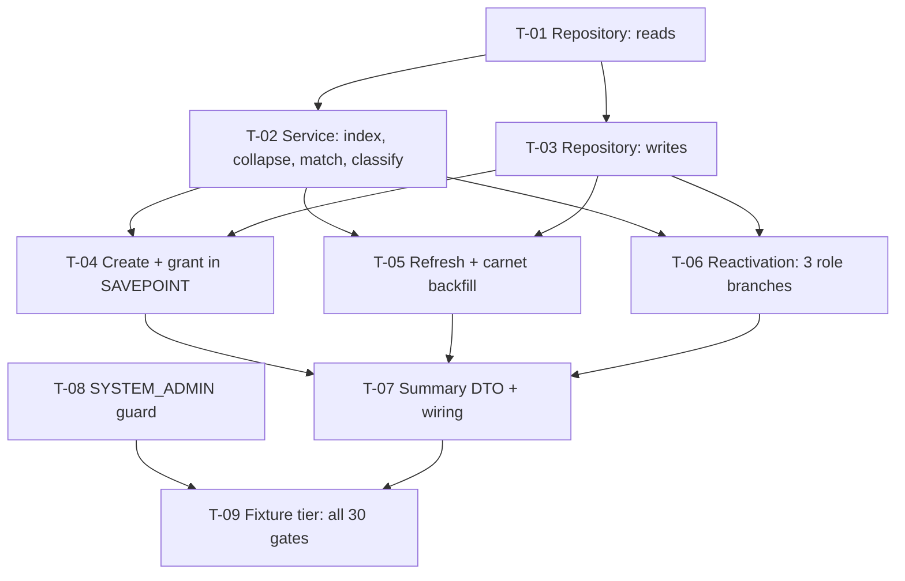

# Tasks — Agresso Staff / Provision and restore platform accounts

- **Module:** `agresso`
- **Spec id:** `changes/agresso-staff-sec-users-sync`
- **Status:** not-started
- **Owner:** TBD
- **Linked requirements:** [`./requirements.md`](./requirements.md)
- **Linked design:** [`./design.md`](./design.md)
- **Judgment ledger:** [`./judgment.md`](./judgment.md) — two lineages, five rounds, terminal
- **Last updated:** 2026-09-14

---

## 0. Before the first line of code

| # | Precondition | Owner |
| --- | --- | --- |
| 1 | **No DDL, no migration.** If a task appears to need one, stop — the spec is wrong, not the schema | — |
| 2 | **`OQ-8` pre-flight is OWED, not done.** `SELECT DISTINCT status FROM alliance_user_staff` (or a terms aggregation on its OpenSearch index). Blocked 2026-09-14 on VPN. **Blocks trusting a first Prod run, not implementation** | Human |
| 3 | Read `design.md` §5.2's **collapse winner rule** and §5.4's **write table** before T-02. Every severe finding in five review rounds lived in one of those two sections | Implementer |

**Budget (tripwire — `design.md` §14):** **9 tasks · ~1,580 LOC · 5 review rounds.** Exceeding it stops execution and escalates. Two of the five rounds are already spent.

---

## 1. Dependency graph

**T-08 is independent** of everything else and can land first or in parallel — it is the only task that touches the controller.

---

## 2. Task list

### T-01 — `SecUserReconcilerRepository`: the read side

- **Requirements covered:** R-AGS-001, R-AGS-007
- **Files touched (intended):**
  - `src/domain/tools/agresso/staff/sec-user-reconciler.repository.ts` (new)
  - `src/domain/tools/agresso/staff/sec-user-reconciler.repository.spec.ts` (new)
- **Description:** One bulk read of **ALL** `sec_users` rows — active *and* inactive — and one chunked read of `sec_user_roles` over the reactivation-target user ids. Raw parameterised SQL; no new TypeORM entities.
- **Implementation notes:**
  - The `sec_users` read covers inactive rows. Scoping it to active rows is Judgment Day **J-4**: it makes `R-AGS-007` unreachable and turns the pass into a duplicate factory.
  - The `sec_user_roles` read chunks by `user_id`, so **all of one user's role rows land in one chunk** — that is what makes `MIN(sec_user_role_id)` well-defined in memory (T-06).
  - `CHUNK` is **one module constant**, exported. `NFR-AGS-002`'s gate asserts an exact statement count and needs a fixed known value (`OQ-D4`).
  - **The bulk read runs OUTSIDE the transaction.** Its placement is load-bearing (`N-9`): moved inside, the re-select in T-04 goes blind to a concurrent insert under REPEATABLE READ.
- **Acceptance / done check:**
  - [ ] A seeded inactive `sec_users` row is returned by the bulk read. — **NOT discharged by T-01.** This is a database claim and T-01 has no fixture; the unit tier proves only that the emitted SQL carries no `WHERE` clause, which is a proxy. **Carried to T-09** (`execution.md` → T-01 → *Recorded gap*), which must copy this forward into its brief.
  - [x] Statement count is `O(⌈n / CHUNK⌉)`, asserted exactly at n ≥ 50 **and** n ≥ 100. — exact counts at n=53 and n=127 against the exported `CHUNK`; observed red under a single-chunk mutation.
  - [x] Every statement is parameterised; id lists are numeric-validated before interpolation. — observed red under both a removed-validation mutation and a literal-interpolation mutation.
- **Dependencies:** none
- **Estimated effort:** M (~120 LOC) — **actual ~299 LOC** across 3 files (145 impl + 151 spec + 3 module wiring). Over the line estimate; the spec's budget counted the repository's read side only.
- **Status:** **done** — PASS 2026-09-14, 2 Implementer attempts / 2 Reviewer rounds. See [`./execution.md`](./execution.md) → T-01.

---

### T-02 — `SecUserReconcilerService`: validate → index → collapse → match → classify

- **Requirements covered:** R-AGS-001, R-AGS-003 (validation + collapse)
- **Files touched (intended):**
  - `src/domain/tools/agresso/staff/sec-user-reconciler.service.ts` (new)
  - `src/domain/tools/agresso/staff/sec-user-reconciler.service.spec.ts` (new)
- **Description:** The decision logic, repository mocked. Implements `design.md` §5.2 steps 1–7 and §5.3's classification table, producing the five sets the write tasks consume.
- **Implementation notes:**
  - **Order is load-bearing and was a severe finding (`N-3`):** validation **first**, then build the index, then collapse. A null-email member has no collapse key; collapsing first groups every one of them under one key and reports them as email collisions instead of as skipped.
  - **Collapse winner: FIRST ARRIVAL WINS** (user ruling). Payload order = page order, then row order. **No comparator** — that is the point; `resourceId` is a `string` and *"lowest"* is undefined between `'10' < '9'` and `9 < 10` (`N-2`).
  - Matching is on `lower(trim(email))`, **exact**. Never `LIKE` — `findUserByEmail`'s `LIKE '%…%'` matches `ana@` against `susana@` (DD-6).
  - Tie-break when one email maps to several rows, in order: prefer **active**; then most recent `last_login_at` (**`NULL` sorts last**); then **lowest `sec_user_id`** as a pure determinism tiebreaker. Rule 3 is safe **only because this spec cannot deactivate** — see the warning in §5.2.
  - Carnet is **written, never matched on** (DD-12).
- **Acceptance / done check:**
  - [x] `ana@alliance.org` is never resolved for a staff member carrying `susana@alliance.org`. — red observed under a substring-scan mutation emulating `LIKE '%…%'`.
  - [x] A null-email member is counted in `skippedUnusableEmail`, **not** in `payloadEmailCollisions`. — red observed under a collapse-before-validate mutation (`N-3`).
  - [x] Two members sharing an email collapse to the **first**, and the loser carries both carnets into the log. — red observed under **both** a lexicographic and a numeric comparator, using carnets `'90'`/`'10'` so both wrong orderings disagree with first-arrival. ⚠️ The **log** half is asserted only on the structured `collapsed` record, not on `logger._warn` — see the OBSERVABILITY advisory, carried to T-07.
  - [x] Two runs over identical input classify identically (total ordering). — discharged, but by the sibling tie-break tests (rules 1/2/3 each observed red), **not** by the test of that name, which cannot fail for its stated reason. See the READABILITY advisory.
  - [x] A member matching only inactive rows classifies **reactivate**, never **create**. — red observed under the literal J-4 defect (candidate set filtered to active rows before the emptiness check).
- **Dependencies:** T-01
- **Estimated effort:** L (~200 LOC) — **actual 701 LOC** (242 impl + 459 spec).
- **Status:** **done** — PASS 2026-09-15, 1 Implementer attempt / 1 Reviewer round. See [`./execution.md`](./execution.md) → T-02.

---

### T-03 — `SecUserReconcilerRepository`: the write side

- **Requirements covered:** R-AGS-002, R-AGS-003, R-AGS-004, R-AGS-007
- **Files touched (intended):**
  - `src/domain/tools/agresso/staff/sec-user-reconciler.repository.ts`
  - `src/domain/tools/agresso/staff/sec-user-reconciler.repository.spec.ts`
- **Description:** Every write statement in `design.md` §5.4, all chunked, all through the transaction's `manager`. No statement is issued per member.
- **Implementation notes:**
  - **The carnet backfill guard lives in SQL:** `WHERE carnet IS NULL OR TRIM(carnet) = ''`. In the `WHERE` clause a batch-building bug still cannot overwrite a stored carnet; in TypeScript only, no test can observe it from the database.
  - **`role_id = 3` is pinned in SQL** in both reactivation statements — a `WHERE` predicate in the update, a **literal** in the insert. This is `N-4`, a severe finding: the guard was removed by the very correction meant to harden the statement.
  - Names are **truncated to 60** before the statement is built. Under strict mode an unhandled over-length value rolls back the whole transaction (`W-4`).
- **Acceptance / done check:**
  - [ ] A stored non-empty carnet survives a conflicting payload value, proven against the database, not the emitted string. — **NOT discharged by T-03.** The SQL guard `AND (carnet IS NULL OR TRIM(carnet) = '')` is present and its gate was observed red, but "proven against the database" is a DB claim and `npm test` never runs `test/fixtures/`. **Carried to T-09.**
  - [x] The reactivation update carries `AND role_id = 3 AND is_active = 0`. — present in SQL; gate asserts it by regex and was observed red when the predicate was deleted (finding N-4, the task's most dangerous line).
  - [x] A 75-character `firstName` is written truncated and the run completes. — truncation to 60 happens **before** the parameter array is built; observed red at 59. ⚠️ The *"and the run completes"* half is a strict-mode DB claim and belongs to **T-09**.
- **Dependencies:** T-01
- **Estimated effort:** M (~120 LOC) — **actual 385 LOC** (193 impl + 192 spec).
- **Status:** **done** — PASS 2026-09-15, 1 Implementer attempt / 1 Reviewer round. First task executed by **Codex** (`gpt-5.6-terra`) and reviewed by **Antigravity** (`gemini-3.1-pro-high`). See [`./execution.md`](./execution.md) → T-03.

---

### T-04 — Create + grant inside `SAVEPOINT create_grant`

- **Requirements covered:** R-AGS-003, R-AGS-004
- **Files touched (intended):** service + repository, `sec-user-reconciler.service.spec.ts`
- **Description:** The provisioning path and its double assertion, scoped to a savepoint so a failure costs the run its creates and not its refreshes.
- **Implementation notes:**
  - **`SET @run_start = NOW(6)` is the transaction's FIRST statement**, before any insert, kept **server-side** and never round-tripped through the app. Read after the insert, `created_at >= @run_start` matches **zero** rows and every run that creates anybody rolls back (`M-1`, the round's top severe). A `SELECT NOW(6)` returned through mysql2 becomes a JS `Date` at millisecond precision and truncates the microseconds this predicate is written in (`RB-9`).
  - Re-select by **`carnet` + `is_active = 1` + `created_at >= @run_start`**. **Never by email** — `sec_users.email` has no unique index (`J-5`).
  - **Assert BOTH: carnet set equality AND row count equality.** Neither is sufficient alone (`F-3`) — a duplicate carnet has the same set and a different count; a missing insert plus a foreign row balances the count and addresses the wrong rows.
  - On failure: `ROLLBACK TO create_grant`, `abortReason = GRANT_ASSERTION`, **`created = 0` and `rolesGranted = 0`** (`RA-10`).
  - `status_id = 1` on insert, matching `createUserInSecUsers`.
- **Acceptance / done check:**
  - [ ] A new hire has exactly one row and one active `role_id = 3` row.
  - [ ] A pre-existing account gains **no** role row.
  - [ ] Forcing the assertion leaves refreshes and reactivations **committed** and the counters at `0`.
  - [ ] A second run creates no additional row and no second role row.
- **Dependencies:** T-02, T-03
- **Estimated effort:** L (~180 LOC)
- **Status:** todo

---

### T-05 — Refresh and carnet backfill

- **Requirements covered:** R-AGS-002
- **Files touched (intended):** service + repository, service spec
- **Description:** Names always (truncated); carnet only when the stored value is empty; `email`, `status_id`, `is_active`, `last_login_at` and `deleted_at` never written.
- **Implementation notes:**
  - Applies to a matched **active** row. A matched-inactive row is T-06's.
  - A carnet conflict is **logged at `warn` with both values**, never resolved.
  - `R-AGS-002` AC.4 (`is_active` unchanged) governs the **refresh** path only; on a reactivated row `R-AGS-007` AC.1 wins.
- **Acceptance / done check:**
  - [ ] `carnet = NULL` is backfilled; `carnet = '12345'` survives a payload `'99999'` and logs the conflict.
  - [ ] `status_id`, `is_active` and `email` are byte-identical before and after.
  - [ ] An unmatched account is byte-identical, `updated_at` included.
- **Dependencies:** T-02, T-03
- **Estimated effort:** S (~90 LOC)
- **Status:** todo

---

### T-06 — Reactivation: `sec_users` + three disjoint role branches

- **Requirements covered:** R-AGS-007
- **Files touched (intended):** service + repository, service spec
- **Description:** Turn one matched-inactive account back on, and land it holding exactly one active `role_id = 3` row via three disjoint id lists computed from T-01's single chunked read.
- **Implementation notes:**
  - **(a)** user already holds an **active** role-3 row → **no statement is issued**.
  - **(b)** one or more **inactive** role-3 rows and no active one → update **one id per user**, `MIN(sec_user_role_id)` **computed among that user's `role_id = 3` rows** — filter to role 3 **before** taking the minimum. Taking `MIN` over all inactive rows first emits the id of a `role_id = 1` row and **restores `SYSTEM_ADMIN`** (`N-4`).
  - **(c)** no role-3 row at all → insert one, `role_id` a **literal 3**.
  - **Two tables only.** `app_secrets` is never read or written — a machine credential is never silently re-armed. Roles other than 3 stay inactive and are named in `rolesLeftInactive`.
  - When several rows match and **all** are inactive, exactly one is reactivated (§5.2 tie-break); the losers stay inactive and every candidate is reported.
  - **Step 4 dominates step 7:** one active plus one inactive row for the same person → refresh the active one, leave the inactive one alone. Two active rows for one person is the duplicate this spec exists not to create.
- **Acceptance / done check:**
  - [ ] A rehired employee keeps their original `sec_user_id`.
  - [ ] Two inactive role-3 rows → exactly **one** active afterwards.
  - [ ] An inactive `role_id = 1` row is **still inactive** afterwards, and appears in `rolesLeftInactive`.
  - [ ] No `app_secrets` row changes — no statement is issued against that table anywhere in the codebase path.
  - [ ] An **active** account carrying no role-3 row is left untouched and listed in `accountsWithoutRole` (`OQ-D6`).
- **Dependencies:** T-02, T-03
- **Estimated effort:** L (~190 LOC)
- **Status:** todo

---

### T-07 — Summary DTO and wiring into `cloneAllAgressoStaff`

- **Requirements covered:** NFR-AGS-003, R-AGS-001
- **Files touched (intended):**
  - `src/domain/tools/agresso/staff/dto/sec-user-reconciliation-summary.dto.ts` (new)
  - `src/domain/tools/agresso/staff/agresso-staff-tools.service.ts`
  - `agresso-staff-tools.service.spec.ts`
- **Description:** Accumulate staff members across pages, hand the assembled set to the reconciler **once** after the loop, and emit the per-run summary at `log`.
- **Implementation notes:**
  - `findNumberOfPages` is **unchanged** — this spec compares no count against anything (the completeness guard left with `R-AGS-005`).
  - A failed page means fewer people provisioned this run. **Do not abort** — that behaviour belongs to the sibling spec, where the same ambiguity is not benign.
  - The summary is the **only** feedback channel: the controller does not `await` (RSK-4). Every field in `design.md` §9 earns its place on that basis.
- **Acceptance / done check:**
  - [ ] All pages' members reach the reconciler in one call.
  - [ ] A failing page logs at `error` and the surviving members are still reconciled.
  - [ ] The summary carries every field in §9, with `abortReason` **absent** on a clean run.
- **Dependencies:** T-04, T-05, T-06
- **Estimated effort:** S (~70 LOC)
- **Status:** todo

---

### T-08 — Restrict the trigger to `SYSTEM_ADMIN`

- **Requirements covered:** R-AGS-006
- **Files touched (intended):**
  - `src/domain/tools/agresso/staff/agresso-staff-tools.controller.ts`
  - `agresso-staff-tools.controller.spec.ts` (new)
- **Description:** Add `@UseGuards(RolesGuard)` + `@Roles(SecRolesEnum.SYSTEM_ADMIN)`, matching `impact-outcomes.controller.ts:38,143`.
- **Implementation notes:**
  - **On the controller, not in the service.** The handler does not `await`, so a check inside the service would let the work begin and still return a refusal (DD-10).
  - ⚠️ **Breaking change for any non-admin caller.** The in-repo check found no callers, but it **cannot see** a cron, an ops runbook, or a saved Postman collection — and the endpoint is fire-and-forget, so such a caller breaks **silently**. Ask whoever operates the sync before deploying.
  - Side benefit, not a fix: `RolesGuard` denies a null `req.user` only on `@Roles`-decorated routes, so this also closes RSK-6 **on this route**. RSK-6 stays live elsewhere.
- **Acceptance / done check:**
  - [ ] A `CONTRIBUTOR` caller is refused and **no** reconciliation runs.
  - [ ] A `SYSTEM_ADMIN` caller gets the existing acknowledgement.
  - [ ] Swagger still declares `@ApiTags`, `@ApiBearerAuth`, `@ApiOperation`.
- **Dependencies:** none
- **Estimated effort:** S (~50 LOC)
- **Status:** todo

---

### T-09 — Fixture tier: prove all 30 gates against a real database

- **Requirements covered:** all, NFR-AGS-001, NFR-AGS-002
- **Files touched (intended):** `test/fixtures/agresso-staff-reconciler.fixture-spec.ts` (new)
- **Description:** Every DB-level claim in `design.md` §3 and §5, proven against the disposable scratch schema. This is where most of the budget lands, and it is the only tier that can evidence anything in this spec.
- **Implementation notes:**
  - ⚠️ **`npm test` has `rootDir: src` and NEVER runs `test/fixtures/`.** A green `npm test` is **not evidence** for any claim in this spec (KZ-017).
  - Files must be named `*.fixture-spec.ts` or they are collected by **neither** runner — a silent zero-tests pass.
  - `npm run migration:test:bootstrap` is **not idempotent** (FP-49): once per fresh container; recover with `compose:test:down` → `up` → `bootstrap`.
  - **Every gate must be observed FAILING before it is cited as evidence (K-004).** Apply the falsifier in §10's third column, watch it redden, revert, then trust it. Two gates in this spec's history reported green while being incapable of failing.
  - Two gates need a **specific** trigger shape: the F-3 and M-5 fixtures must seed the foreign row with a **different email** — same-email makes the bulk read classify the member *refresh*, no insert happens, and the assertion never runs (`RB-3`).
- **Acceptance / done check:**
  - [ ] All 30 rows of `requirements.md` §10 have a fixture, and **each falsifier was observed red**.
  - [ ] Idempotence: two runs over identical input leave identical row counts and `is_active` values.
  - [ ] Statement count asserted **exactly** at n ≥ 50 and n ≥ 100.
  - [ ] Full server suite green; coverage at or above the 60% floor.
  - [ ] `npx eslint <paths>` clean — **bare**, not `npm run lint`, which carries `--fix` and mutates (K-001).
- **Dependencies:** T-07, T-08
- **Estimated effort:** L (~530 LOC)
- **Status:** todo

---

## 3. Requirement → task coverage

| Requirement | Tasks |
| --- | --- |
| R-AGS-001 | T-01, T-02, T-07, T-09 |
| R-AGS-002 | T-03, T-05, T-09 |
| R-AGS-003 | T-02, T-03, T-04, T-09 |
| R-AGS-004 | T-03, T-04, T-09 |
| R-AGS-006 | T-08, T-09 |
| R-AGS-007 | T-01, T-03, T-06, T-09 |
| NFR-AGS-001 | T-04, T-06, T-09 |
| NFR-AGS-002 | T-01, T-03, T-09 |
| NFR-AGS-003 | T-07, T-09 |

**Scenario- and clause-level coverage** (not just requirement ids): every `BUT it must NOT` and `AND IT MUST` clause maps to a named done-check above, and every one of §10's 30 gates is owned by T-09 with its falsifier. No clause is discharged by citing a different requirement.

---

## 4. PR strategy

**~1,580 LOC — split into three PRs.** One PR is too large to review, and the three boundaries fail differently.

| PR | Tasks | Why it is its own review |
| --- | --- | --- |
| **PR 1** | T-08 | One decorator, one spec. **Breaking for non-admin callers** — it deserves its own discussion and its own revert |
| **PR 2** | T-01 … T-03 | Repository + decision logic, no writes committed yet. Reviewable as pure logic against `design.md` §5.2/§5.4 |
| **PR 3** | T-04 … T-07, T-09 | The three write paths and the whole fixture tier. This is where the savepoint, the double assertion and the role branches land — the sections every severe finding came from |

Each PR description should say what to review first and what is out of scope, and link the previous and next PR.

---

## 5. What this spec deliberately does NOT do

Stated here because a reader arriving at the code will wonder:

- **It never writes `is_active = 0`.** Deactivation is [`changes/agresso-staff-deactivation`](../agresso-staff-deactivation/proposal.md), which has never been specified and carries eleven open findings.
- **It never touches `app_secrets`.**
- **It adds no completeness guard.** `C-1`/`C-2`/`C-3` left with the requirement they defended.
- **It does not repair duplicate data** (RSK-1) or roleless accounts (RSK-10). It reports both.
- **It does not fix `findUserByEmail`'s `LIKE`** (DD-8) or the two sibling unguarded endpoints (RSK-5), or RSK-6.
