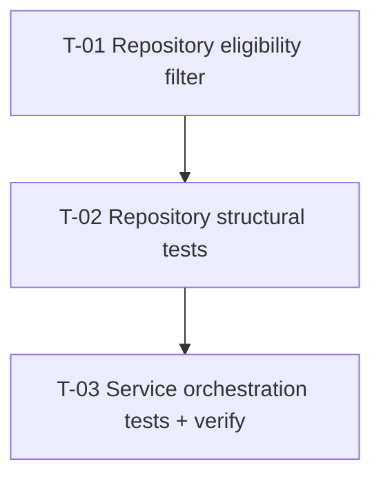

# Tasks — Results / CapDev Email Status Filter

- **Module:** results
- **Spec id:** 2026-08-capdev-email-status-filter
- **Status:** complete
- **Owner:** ARI squad
- **Linked requirements:** ./requirements.md
- **Linked design:** ./design.md
- **Linked judgment:** ./judgment.md
- **Worktree:** `/Users/pelitos/Documents/CIAT/alliance-research-indicators-ac1607-capdev-email`
- **Branch:** `AC-1607-Send-bulk-upload-completion-email-with-CapDev-metrics`
- **Execution models:** Cursor-hosted only (Implementer · Reviewer · Tester)
- **Last updated:** 2026-08-26

---

## Budget (from design.md — execute tripwire)

| Signal | Budget |
| --- | --- |
| Tasks | **3** |
| LOC | ~120–200 (mostly tests); ~25–40 production |
| Review rounds | 1–2 |

---

## Scenario & clause ownership

Every scenario / strict clause MUST map to a task. ID-level presence alone is not closure.

| Requirement | Scenario / clause | Task |
| --- | --- | --- |
| R-CESF-001 | AC.1–AC.5; scenario *Requested Approved, stays Draft* | T-01, T-02 |
| R-CESF-002 | AC.1–AC.3; scenario *Mixed statuses in one contract* | T-02 (structural + existing group/metrics tests updated) |
| R-CESF-002 | AC.4 — unattributed eligible only | T-01, T-02, T-03 |
| R-CESF-003 | AC.1–AC.3; scenario *Draft-only*; BUT must NOT fail HTTP | T-03 |
| R-CESF-004 | AC.1–AC.5; scenario *Persisted metrics exclude Drafts* | T-03 |
| R-CESF-004 | scenario *Eligible but unattributed only* | T-03 |
| R-CESF-005 | AC.1–AC.3; scenario *final_status skew* | T-01, T-02 |
| NFR-CESF-001 | no service post-filter | T-01 (code review gate in T-03) |
| NFR-CESF-002 | bulk isolation | T-03 |
| NFR-CESF-003 | unattributed log ids | T-03 |

---

## Dependency graph



---

## Task list

### T-01 — Repository: shared eligibility helper + spine / unattributed wiring

- **Requirements covered:** R-CESF-001, R-CESF-005 AC.1–AC.3, R-CESF-002 AC.4 (query side), NFR-CESF-001
- **Design refs:** §5.0, §5.1, §5.2, §5.3, DD-CESF-1, DD-CESF-2, DD-CESF-3, DD-CESF-5
- **Skills:** `nestjs-expert`
- **Files touched (intended):**
  - `server/researchindicators/src/domain/entities/ai-reports/notifications/capdev-bulk-notification.repository.ts`
- **Description:** Add module-level `ELIGIBLE_RESULT_STATUSES` and `applyEligibleResultStatusFilter(qb, alias?)` that **innerJoin**s `Result` on `result_id` and applies `result_status_id IN (:...eligibleStatuses)` using `ResultStatusEnum.SUBMITTED` and `APPROVED`. Call it from `capdevSpineQuery` and `findUnattributedResultIds`. Leave `countTotalResults` unchanged (no status join/filter).
- **Implementation notes:**
  - Import `Result` entity; bind statuses from enum — no raw `2`/`6` without enum reference.
  - Do **not** join `bur.final_status` / `suggested_status` or `@ManyToOne` metadata relations.
  - Export helper/constant only if tests need it; prefer testing via structural capture of QB calls.
- **Acceptance / done check:**
  - [ ] `capdevSpineQuery` descendants (groups/metrics/countries) inherit filter without duplicate status lists
  - [ ] `findUnattributedResultIds` uses same helper
  - [ ] `countTotalResults` has no `Result` join and no eligible-status `andWhere`
  - [ ] No new service-layer filtering added (DD-CESF-5)
- **Verification:** `npx eslint server/researchindicators/src/domain/entities/ai-reports/notifications/capdev-bulk-notification.repository.ts`
  - **Pass:** file lint-clean; manual read confirms single helper used in both query paths
  - **Disqualifies:** using `npm run lint` as gate (mutates — K-001); citing grep of `final_status` alone as proof of live-status filter
  - **Falsifier input:** remove `applyEligibleResultStatusFilter` call from spine — structural test in T-02 must fail
- **Dependencies:** none
- **Estimated effort:** S
- **Status:** done

---

### T-02 — Repository tests: mandatory structural asserts + update legacy “all created CapDev” expectations

- **Requirements covered:** R-CESF-001 (AC.1–AC.5), R-CESF-002 (AC.1–AC.4), R-CESF-005 (AC.1–AC.3 + skew scenario), NFR-CESF-001
- **Design refs:** §9.1, §9.3, judgment J-B-W1 fix
- **Skills:** `nestjs-expert`, `tdd` (red-before-green for new structural tests)
- **Files touched (intended):**
  - `server/researchindicators/src/domain/entities/ai-reports/notifications/capdev-bulk-notification.repository.spec.ts`
- **Description:** Add **STRUCTURAL** tests per design §9.1: after invoking `capdevSpineQuery` (via `findGroups` / `findMetrics` / `findCountries`) and `findUnattributedResultIds`, capture the QueryBuilder and assert:
  1. `innerJoin` to `Result` (alias `r`) — **not** `leftJoin` **of Result** (staff/rc leftJoins may remain)
  2. `andWhere` on `r.result_status_id IN (:...eligibleStatuses)` with bind `[SUBMITTED, APPROVED]`
  3. No eligibility filter on `countTotalResults`
  Update any existing repository tests that assumed all created CapDev rows count toward groups/metrics.
- **Implementation notes:**
  - Follow existing mock-QB patterns in the spec file; extend, do not replace unrelated AC-1607 coverage.
  - **KZ-004:** if adding outcome fixtures, vary discriminating fields (status, agreement_id) per row.
  - Skew scenario (R-CESF-005): document in test title that live Submitted + metadata Draft must pass structural live-status join — structural assert proves predicate uses `results`, not `bur.final_status`.
- **Acceptance / done check:**
  - [ ] New structural tests **fail** if status filter removed (run once before T-01 merge or with filter commented — K-004)
  - [ ] Structural tests pass after T-01
  - [ ] `countTotalResults` test proves absence of status filter
  - [ ] Unattributed structural test includes same eligibility helper calls
- **Verification:** `cd server/researchindicators && npm test -- --silent capdev-bulk-notification.repository.spec.ts`
  - **Pass:** all tests in file green; summary shows 0 failed
  - **Disqualifies:** tests that only mock `getRawMany` return rows without asserting join/where; a green run with `final_status` filter instead of `results.result_status_id`
  - **Falsifier input:** replace innerJoin Result with filter on `bur.final_status` — structural test MUST fail
- **Dependencies:** T-01
- **Estimated effort:** M
- **Status:** done

---

### T-03 — Service orchestration tests, comment hygiene, full notification suite

- **Requirements covered:** R-CESF-002 (AC.1–AC.3 email/persist via mocks), R-CESF-003 (all ACs + scenario), R-CESF-004 (all ACs + both scenarios), R-CESF-005 (skew via integration with repo — do not duplicate SQL proof), NFR-CESF-002, NFR-CESF-003
- **Design refs:** §2.1, §5.4, §9.2, §9.4, DD-CESF-5
- **Skills:** `nestjs-expert`, `error-handling-patterns`
- **Files touched (intended):**
  - `server/researchindicators/src/domain/entities/ai-reports/notifications/capdev-bulk-notification.service.spec.ts`
  - `server/researchindicators/src/domain/entities/ai-reports/notifications/capdev-bulk-notification.service.ts` (comments only unless a pre-existing bug forces logic change)
- **Description:** Extend service specs per design §9.2 using **pre-filtered** repository mocks (DD-CESF-5). Required cases:
  1. **Draft-only:** `findGroups` → `[]` → zero `sendEmail`, `notification_status = SKIPPED`, CapDev metrics zero/empty
  2. **Eligible-but-unattributed-only:** `findGroups` → `[]`, `findUnattributedResultIds` → `[101,102]` → zero `sendEmail`, `total_capdev_results = 0`, warn lists ids, `SKIPPED`
  3. **Mixed attributed eligible:** mocks return groups/metrics with counts reflecting eligible-only rows → persist matches email inputs
  4. **`total_results` carve-out:** `countTotalResults` returns N including Draft rows → persisted `total_results = N` while CapDev columns reflect eligible mocks only
  5. **Flag off:** still persists eligibility-filtered CapDev metrics + `SKIPPED` without send (R-CESF-004 AC.5)
  Update stale comments in service that say “created CapDev” where “eligible CapDev” is meant.
- **Implementation notes:**
  - Do **not** add tests feeding Draft+Approved raw rows expecting service to filter.
  - Do **not** cite e2e formalize-bulk spy tests as eligibility evidence (design §9.4).
- **Acceptance / done check:**
  - [ ] All §9.2 cases implemented with explicit assertions on `sendEmail`, `persistProcessMetrics`, `updateNotificationStatus`
  - [ ] R-CESF-003 scenario *Draft-only* — BUT must NOT throw from dispatch
  - [ ] R-CESF-004 scenarios *Persisted metrics exclude Drafts* and *Eligible but unattributed only*
  - [ ] No production logic added to service beyond comment fixes
- **Verification:** `cd server/researchindicators && npm test -- --silent capdev-bulk-notification`
  - **Pass:** all `capdev-bulk-notification*.spec.ts` and related formatter specs green (full notification folder)
  - **Disqualifies:** only running service spec while repository structural tests skipped; asserting `sendEmail` call count without checking `SKIPPED` / persist payload
  - **Falsifier input:** mock `findGroups` with one group but leave CapDev metrics unfiltered in persist — test asserting `total_capdev_results` must fail
- **Dependencies:** T-02
- **Estimated effort:** M
- **Status:** done

---

## PR strategy

**Single PR recommended** (~120–200 LOC, 3 sequential tasks, one module folder). Budget is under 400 LOC and graph is linear.

Suggested commit message: `fix(capdev-bulk-notification): filter email and CapDev metrics to Submitted/Approved only`

If review churn splits work: PR1 = T-01+T-02 (repository), PR2 = T-03 (service tests).

---

## Estimated LOC

| Area | Production | Tests |
| --- | --- | --- |
| Repository helper + wiring | ~25–35 | ~80–120 |
| Service comments | ~5 | ~40–60 |
| **Total** | **~30–40** | **~120–180** |

---

## Recommended first task

**T-01** — unblocks all verification; structural tests in T-02 must go red once before green (K-004).

---

## Risks & blockers log

| # | Date | Risk / Blocker | Mitigation | Owner | Status |
| --- | --- | --- | --- | --- | --- |
| RB-1 | 2026-08-26 | AC-1607 tests assume all created CapDev in metrics | T-02/T-03 update expectations per this spec | Implementer | open |
| RB-2 | 2026-08-26 | `final_status` skew if someone filters metadata column | Structural tests + R-CESF-005 scenario | Reviewer | open |

---

## Done definition

- [x] T-01, T-02, T-03 status = done
- [x] All scenario/clause rows in ownership table satisfied
- [x] `npm test -- --silent` green for touched notification specs
- [x] `npx eslint` clean on touched files (not `npm run lint --fix`)
- [ ] Manual product check (KZ-007): optional for backend-only; bulk upload + inspect process row / logs in Dev when deployed — not blocking merge if unit coverage complete
- [x] Work lands only in AC-1607 worktree

---

## Next step

After approval:

```text
/akili-execute changes/capdev-email-status-filter
```

Use a **fresh session** if context is heavy — spec files are the durable handoff.

---

## Authorship

AKILI-SPECS methodology by **Juan Carlos Cadavid** — [jcadavid.com](https://jcadavid.com). Licensed under the MIT License.
