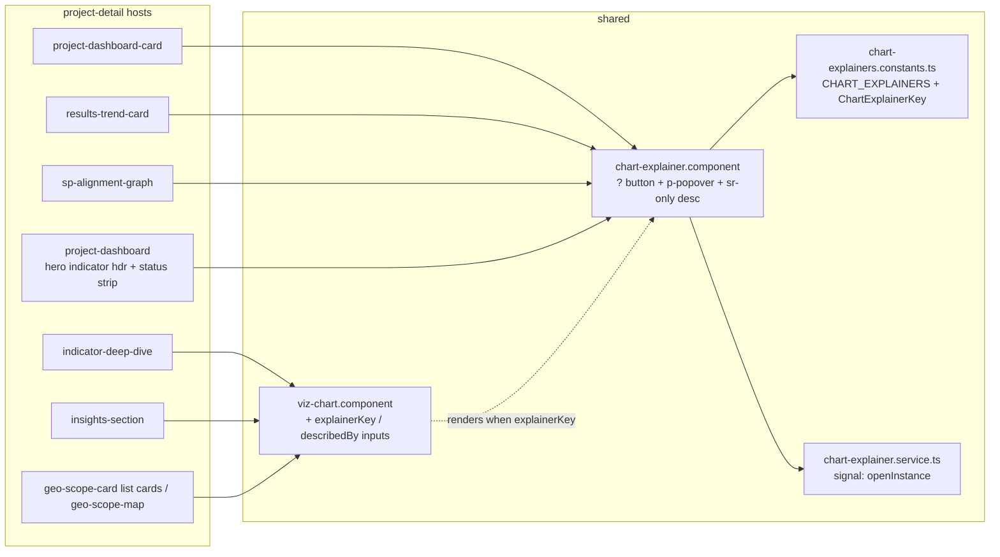

# Design — Changes / Chart Explainers

- **Module:** changes (client-only)
- **Spec id:** 2026-08-chart-explainers
- **Status:** draft
- **Owner:** J. Cadavid / bilateral-visual-improvements
- **Linked requirements:** ./requirements.md
- **Linked detailed design:** ../../../trd/trd.md (frontend architecture §, a11y §); `docs/ux-ui/design.md` §7.1, §8.1, §10.1, §12.2
- **Last updated:** 2026-08-24

---

## Executive summary

One new standalone shared component, **`chart-explainer`**, owns the whole pattern: the `?` button, the PrimeNG `p-popover`, the always-rendered sr-only description, `aria-expanded`/`aria-controls`, Esc handling, focus return, and "only one open" coordination (via a 20-line signal service). Copy lives in **`shared/constants/chart-explainers.constants.ts`** keyed by a string-literal union, so an unknown key is a build error and a completeness test closes the loop in both directions.

Two placements, one component:

| Host has a title row? | Who renders `<app-chart-explainer>` | Where the `?` sits | How the chart gets `aria-describedby` |
| --- | --- | --- | --- |
| **Yes** (card-variant `project-dashboard-card`, `results-trend-card`, `sp-alignment-graph`, hero indicator header, status strip) | The host, in the header's right slot | Beside the title, right-aligned | Host passes `chx.descriptionId` into `viz-chart`'s new `describedBy` input (or onto its own `figure`) |
| **No** (deep-dive grid ×20, insights cards ×5, geo list-variant ×3, geo map) | `viz-chart` itself, when given `explainerKey` | Top-right corner **inside** the chart surface, 8 px inset | `viz-chart` links its own sr-only table to the child explainer's `descriptionId` |

Budget (§12): **4 tasks · ≈ 950 LOC (≈ 400 of it registry copy) · 2 review rounds**.

---

## 1. Goals & non-goals

**Goals**
1. Every chart surface explained, one component, one registry — R-CXP-001/004.
2. Keyboard/touch/SR parity — R-CXP-002/003, NFR-CXP-001.
3. Copy that a non-analyst understands in one read — R-CXP-005.
4. Native look in light and dark with zero new tokens — R-CXP-006.
5. Pattern registered in the baseline — R-CXP-007.

**Non-goals**
- No change to chart data/options/click-through; no hover trigger (requirements OQ-1 default *no*); no i18n; no server work; no modal (`all-modals`) — a non-modal popover is the right primitive and the KPI popover precedent already uses `p-popover` outside `all-modals`.

> **KZ-016 cross-check (done 2026-08-24):** every `BUT`/`AND IT MUST` clause of requirements §5 is mapped in §8 below; the modules touched carry two constraints this design honors — `viz-chart` "every chart takes a `tableModel`" (untouched) and the child guide's "Modals: route through `all-modals`" (not a modal — see D-CXP-3).

---

## 2. Architecture

### 2.1 Composition (new files)

- `client/research-indicators/src/app/shared/components/chart-explainer/chart-explainer.component.{ts,html,scss,spec.ts}` — the pattern. Standalone, `OnPush`, signal inputs. Imports `PopoverModule` only.
- `client/research-indicators/src/app/shared/services/chart-explainer.service.ts` (+ spec) — `providedIn: 'root'`; one `WritableSignal<ChartExplainerComponent | null>` for "only one open"; `open(instance)` hides the previous one **with focus-return suppressed**; `close(instance)` clears if current.
- `client/research-indicators/src/app/shared/constants/chart-explainers.constants.ts` (+ spec) — `ChartExplainerKey` union, `ChartExplainer` shape, `CHART_EXPLAINERS` registry.
- `client/research-indicators/src/app/shared/interfaces/chart-explainer.interface.ts` — `ChartExplainer { title; what; howToRead; source; emptyHint?; derivedFrom }`.

### 2.2 Modified files

- `shared/components/viz-chart/viz-chart.component.{ts,html}` — two optional inputs: `explainerKey: ChartExplainerKey | null` (renders the in-surface explainer) and `describedBy: string | null` (external linkage). Mutually exclusive; when both are set, `explainerKey` wins and a `console.warn` fires in dev (D-CXP-6).
- 7 host templates (+ `project-dashboard-card.component.ts` for its new `explainerKey` input) — see §5 wiring table.
- `docs/ux-ui/design.md` §8.1, §10.1, §12.2.

### 2.3 Reuse

- PrimeNG `p-popover` (`appendTo="body"`, 340 px) — same chrome as `indicators-covered-popover`.
- Focus-ring and Barlow/token classes already used by dashboard buttons.
- `viz-chart`'s sr-only table is the natural `aria-describedby` anchor — no new accessible container.
- Test pattern from `project-dashboard.component.spec.ts:3767–3781` (real `<button>` in `document.body`, `focus` spy, `KeyboardEvent('keydown', {key:'Escape', bubbles:true})`).
- `oicr-helper-texts.constants.ts` as the precedent for a copy-constants file.

---

## 3. Data model

No data model changes.

## 4. API surface

No API changes.

---

## 5. Frontend component architecture

### 5.1 `chart-explainer` component contract

| Aspect | Decision |
| --- | --- |
| Inputs | `key: ChartExplainerKey` (required); `placement: 'inline' \| 'surface'` (default `inline`; `surface` adds absolute top-right positioning + a subtle `--ac-white-1`/`--ac-background` disc so the glyph stays legible over chart marks) |
| Public | `readonly descriptionId: string` (`chx-<key>-<n>-desc`, `n` = per-instance counter → unique even when the same key renders in two `insights-section` instances); `isOpen: Signal<boolean>` |
| Button | `<button type="button">` · `aria-label="Explain this chart: <title>"` · `aria-expanded` · `aria-controls` (only while open) · `aria-haspopup="dialog"` **not** used (non-modal region; `aria-expanded` is the honest signal) · glyph `pi pi-question-circle` 16 px · hit area 32×32 (padding), circular, `cursor-pointer`, `transition-colors duration-150` |
| Popover | `p-popover` `appendTo="body"` `[style]="{width:'340px', maxWidth:'calc(100vw - 24px)'}"` · panel root `role="region"` `[id]="panelId"` `aria-labelledby` the title heading · content: `h3` title (Barlow 13 px 600, `--ac-primary-blue-600`), then three `
` (14 px, `--ac-grey-700`, line-height 1.5): *what*, *how to read*, *source*; `emptyHint` rendered as a fourth muted line only when present |
| sr-only description | Always rendered `` = `what + ' ' + howToRead + ' ' + source (+ emptyHint)` |
| Open | `toggle(event)` → if open: close; else `service.open(this)` then `popover.toggle(event)`; **no focus move** into the panel |
| Close paths | (a) button toggle, (b) `@HostListener('document:keydown.escape')` when `isOpen()`, (c) PrimeNG outside-click → `(onHide)` — all converge on `onHidden(returnFocus: boolean)`; (a)(b) and PrimeNG's own outside-click hide return focus; **service-initiated hide (another explainer opened) passes `returnFocus=false`** |
| Loading | Not the component's concern — hosts/`viz-chart` do not render it while `loading()` |
| Reduced motion | Inherits Aura's popover transition; no bespoke animation |

### 5.2 `viz-chart` changes

- Wrapper becomes `position: relative` (it already is a block; verify no layout change with the existing 509-line spec).
- `@if (explainerKey() && !loading())` → `<app-chart-explainer #chx [key]="explainerKey()!" placement="surface">` rendered **before** the chart container so it precedes the canvas in DOM order (tab order: `?` then chart's internal focusables, if any).
- sr-only table `[attr.aria-describedby]="explainerKey() ? chx.descriptionId : describedBy()"`. Keyless + no `describedBy` → attribute absent (R-CXP-003 AC.4).

### 5.3 Wiring table (33 surfaces → 38 keys)

| Host | Placement | Key(s) | Notes |
| --- | --- | --- | --- |
| `project-dashboard` hero indicator header (`:802–834`) | inline, left of the Bars/Heatmap toggle group | `results-by-indicator` (bars morph), `results-by-indicator-heatmap` — **one button whose key follows the view mode** (a computed key) | Both `viz-chart`s get `describedBy` from the same `#chx`; morph mode and crossfade fallback both covered |
| `project-dashboard` status strip (`:348–360`) | inline in its `<header>` | `results-by-status` | `figure[role=img]` gets `aria-describedby` |
| `project-dashboard-card` (card variant) | inline, header right slot | new `explainerKey` input; 4 dashboard instances: `top-partner-institution`, `top-main-contact`, `top-contributing-projects`, `top-primary-levers` | Card forwards `chx.descriptionId` to its `viz-chart` via `describedBy`; **list variant ignores the header path and forwards `explainerKey` to `viz-chart`** (surface placement) |
| `geo-scope-card` list cards (`:32,:41,:51`) | surface (via card list-variant → `viz-chart`) | `geo-top-regions`, `geo-top-countries`, `geo-top-subnational` | Sibling `<h3>` stays; `?` sits inside each mini chart |
| `geo-scope-map` | surface — wrapper div hosts `<app-chart-explainer placement="surface">` | `geo-map` | Wrapper gets `aria-describedby`; fallback (no data) still renders it (R-CXP-001 empty rule) |
| `results-trend-card` | inline, header right slot | `results-trend` | Hidden while `loading()` |
| `sp-alignment-graph` | inline, header right slot **before** the two count chips | `sp-alignment` | Chips remain; `flex-wrap` header already tolerates a third item |
| `insights-section` (×3 instances) | surface via `viz-chart` | `insights-actor-reach`, `insights-evidence-role`, `insights-review-flow`, `insights-levers`, `insights-keywords` | Same key may render in more than one instance → per-instance id counter (§5.1) |
| `indicator-deep-dive` | surface via `viz-chart` | 20 keys, `deep-<indicator>-<chart>` (e.g. `deep-capacity-gender`, `deep-innovation-irl`) — exact list enumerated from the 20 literal `chartTitle`s in T-02 | Velocity strip (44 px tall) uses `placement="surface"` too; density risk RISK-3 checked at HITL |

### 5.4 Registry shape (conceptual)

- `ChartExplainerKey` = union of the 38 literals above.
- `CHART_EXPLAINERS: Record<ChartExplainerKey, ChartExplainer>` — `satisfies` the record so a missing member fails the build.
- Completeness spec: reads the seven host templates + `viz-chart` from disk (`fs.readFileSync`, allowed in jest), regex-extracts `explainerKey="…"` / `[explainerKey]="'…'"` / computed-key literals, asserts set-equality with `Object.keys(CHART_EXPLAINERS)`. Computed keys (hero header) are declared in a small `EXPECTED_DYNAMIC_KEYS` list inside the spec with a comment pointing at the template line — that list is the one place a future dynamic key must be registered.

### 5.5 UI states

| State | Explainer |
| --- | --- |
| Loading skeleton | not rendered |
| Loaded | rendered, closed |
| Empty / error | rendered; popover shows `emptyHint` line when the entry has one |
| Open | `aria-expanded=true`, panel in `body`, focus stays on button |
| Another opened | this one hides without stealing focus |
| Narrow viewport (≤ 375 px) | popover `maxWidth: calc(100vw - 24px)`; PrimeNG flips placement automatically |
| Dark mode | tokens flip; `surface` disc uses `--ac-background` |

---

## 6. Shared contracts

- `ChartExplainer` interface (§2.1). No wire contract — client-only.

---

## 7. Testing strategy

| File | Covers |
| --- | --- |
| `chart-explainer.component.spec.ts` | R-CXP-002 AC.1–4 (open, Esc→focus, toggle, one-at-a-time via two fixtures + service); R-CXP-003 AC.1 (`aria-expanded`/`aria-controls` transitions); R-CXP-006 AC.1 (no hex — a grep in the task, not a jest test). Arrange the **transition** (construct closed → open → close), never the end state (KZ-015). |
| `chart-explainer.service.spec.ts` | previous instance hidden with `returnFocus=false` |
| `chart-explainers.constants.spec.ts` | R-CXP-004 AC.2/AC.3 completeness (template-scan), AC.4 field/length rules, R-CXP-005 AC.2 jargon lint |
| `viz-chart.component.spec.ts` (extend) | R-CXP-003 AC.2/AC.4; loading hides explainer; `describedBy` passthrough |
| `project-dashboard-card.component.spec.ts` (extend) | header explainer + `describedBy` forwarding; list-variant forwards `explainerKey` |
| `project-dashboard.component.spec.ts` (extend) | computed hero key follows view mode; button count stable across Bars↔Heatmap toggle (D7) |
| Human, at HITL | D2 copy truth (100 %), D6 visuals light+dark, keyboard/SR pass |

Gates: `npm test -- --silent` (Leader, isolated) · `npm run build` · `npx tsc -p tsconfig.spec.json --noEmit` vs 945 baseline · `npm run lint -- --quiet` · targeted runs with `--coverage=false` (K-020). Each new test's falsifying input is named in `tasks.md`.

---

## 8. Requirement clause → design mapping

| Clause | Design element |
| --- | --- |
| R-001 hidden while loading | §5.2 `@if (!loading())`; hosts' header `@if (!loading())` |
| R-001 at most one `?` per surface across re-render | Explainer is a child of the surface it explains; the hero header's single button + computed key (§5.3) avoids two buttons in morph/crossfade modes — D7 test |
| R-001 no shared generic copy | Distinct keys per instance (§5.3) |
| R-002 no auto-focus into panel | §5.1 Open |
| R-002 Esc from anywhere | `document:keydown.escape` host listener, guarded by `isOpen()` |
| R-002 focus not returned to A when B opens | service `open()` → previous `onHidden(false)` |
| R-003 no duplicate in caption; sr-only not display:none | Description lives in the explainer's `span.sr-only`; caption untouched |
| R-004 keyless remains legal | `explainerKey` optional; no describedby when absent |
| R-005 gloss once | Copy rule + lint test on listed terms |

---

## 9. Security / observability / rollout

- Security: none. Observability: none (no logging for a help popover). Rollout: ships with the client build; no flag; backout = revert the PR. Comms: none.

---

## 10. Reversion challenge (Step 2.3)

No design decision removes, disables, or inverts delivered behavior. The only touch on existing code is additive (`viz-chart` inputs, header slots). **Skipped by rule** — nothing to challenge.

---

## 11. Design decisions log

| # | Date | Decision | Rationale |
| --- | --- | --- | --- |
| D-CXP-1 | 2026-08-24 | One shared component owns button + popover + sr-only description | 33 surfaces; a11y must be implemented once, not seven times |
| D-CXP-2 | 2026-08-24 | Two placements (`inline` header slot / `surface` top-right inside the chart) instead of forcing one | ~28 surfaces have no heading; a header-only rule would leave them unexplained, a surface-only rule would hide the `?` below the title on the cards that *do* have one |
| D-CXP-3 | 2026-08-24 | Non-modal `p-popover`, not `all-modals` | Reading help must not trap focus or dim the page; the child guide's modal rule targets dialogs. Precedent: KPI popover. |
| D-CXP-4 | 2026-08-24 | 32 px hit area / 16 px glyph | `ui-ux-pro-max` asks 44 px; WCAG 2.2 AA minimum is 24 px; 44 px in a 44-px-tall velocity strip or a 15 px title row would dominate the chart. 32 px clears AA with margin and matches PrimeNG's small icon-button size. |
| D-CXP-5 | 2026-08-24 | Per-instance id counter, not key-derived ids | Same key can render in multiple `insights-section` instances → duplicate ids would break `aria-describedby` |
| D-CXP-6 | 2026-08-24 | `explainerKey` and `describedBy` on `viz-chart` are mutually exclusive, key wins | One anchor per table; conflict is a wiring bug and should be loud in dev |
| D-CXP-7 | 2026-08-24 | Focus returns on every close **except** service-initiated hide | R-CXP-002 "focus follows the user's latest action" |
| D-CXP-8 | 2026-08-24 | Completeness test scans template source, not rendered DOM | Rendering all seven hosts with every data state is fragile; the template is the ground truth for which keys are wired (KZ-017: it **cannot** see keys built at runtime → `EXPECTED_DYNAMIC_KEYS` declared list) |
| D-CXP-9 | 2026-08-24 | Registry entries carry `derivedFrom` | KZ-007 — copy is a correction-record-class artifact; keep the audit trail in the data |

## 12. Budget (Step 2.4 — tripwire for `/akili-execute`)

| Metric | Estimate | Basis |
| --- | --- | --- |
| Tasks | **4** | component+service · registry+viz-chart+wiring · copy authoring · docs+HITL |
| LOC | **≈ 950** (component ~150, service ~25, specs ~350, registry ~380 for 38 entries, wiring ~60, docs ~30) | Standard depth matches; ≥ 1,400 LOC or a 6th task → stop and escalate |
| Review rounds | **2** | Round 1 code; round 2 copy review (100 % of entries) — a third round means the copy standard was under-specified, not that the Implementer failed |

Depth check: Phase-0 guess **Standard** — estimate matches; nothing to change.

## 13. Open questions

- none (requirements OQ-1 hover trigger stays *no* unless the user overrides at this gate).

## 14. References

- `docs/ux-ui/design.md` §7.1 tokens, §8.1 chart idiom registry, §10.1 a11y, §12.2 decisions
- Archived chart specs: `docs/specs/archive/2026-08-22-changes--project-dashboard-redesign/`, `docs/specs/archive/2026-08-22-changes--dashboard-advanced-analytics/` (source of truth for `derivedFrom`)
- `project-dashboard.component.ts:1566–1591` Esc/focus-return precedent; `.spec.ts:3767–3781` test pattern
