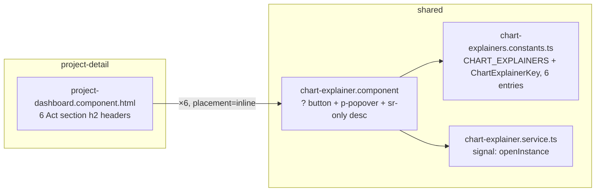

# Design — Changes / Chart Explainers

- **Module:** changes (client-only)
- **Spec id:** 2026-08-chart-explainers
- **Status:** draft
- **Owner:** J. Cadavid / bilateral-visual-improvements
- **Linked requirements:** ./requirements.md
- **Linked detailed design:** ../../../trd/trd.md (frontend architecture §, a11y §); `docs/ux-ui/design.md` §7.1, §8.1, §10.1, §12.2
- **Last updated:** 2026-08-25
- **Re-scoped 2026-08-25 (D-CXP-10):** per-chart explainer (33 surfaces, 38 keys) → per-section explainer (6 Act headers). This document describes the section-level design as it now stands; §11's decisions log keeps D-CXP-1…9 as the historical record of the superseded per-chart design and adds D-CXP-10 rather than editing them in place.

---

## Executive summary

The existing standalone shared component, **`chart-explainer`** (T-01, committed `5fcc730b`, unchanged), owns the whole pattern: the `?` button, the PrimeNG `p-popover`, the always-rendered sr-only description, `aria-expanded`/`aria-controls`, Esc handling, focus return, and "only one open" coordination (via a 20-line signal service). Copy lives in **`shared/constants/chart-explainers.constants.ts`** keyed by a string-literal union, so an unknown key is a build error and a completeness test closes the loop in both directions.

One placement, one host, six instances: every explainer sits `placement="inline"` beside an Act section's `<h2 id="act-N-title">` in `project-dashboard.component.html` — the only template this spec touches. `viz-chart` and `project-dashboard-card` are **not modified**; the per-chart `explainerKey`/`describedBy` inputs from the superseded design are dropped entirely (D-CXP-10).

| Act | Key | Anchor |
| --- | --- | --- |
| 1 — Identity | `act-1-identity` | `<h2 id="act-1-title">` |
| 2 — Production | `act-2-production` | `<h2 id="act-2-title">` |
| 3 — Reach | `act-3-reach` | `<h2 id="act-3-title">` |
| 4 — Direction | `act-4-direction` | `<h2 id="act-4-title">` |
| 5 — Quality | `act-5-quality` | `<h2 id="act-5-title">` |
| 6 — Depth | `act-6-depth` | `<h2 id="act-6-title">` |

Budget (§12): **4 tasks · ≈ 400 LOC · 2 review rounds per phase** (re-estimated from the original ≈ 950 LOC / 2 rounds; owner pre-approved the per-phase reading at the 2026-08-25 gate).

---

## 1. Goals & non-goals

**Goals**
1. Every Act section explained, reusing the existing component and registry unchanged — R-CXP-001/004.
2. Keyboard/touch/SR parity — R-CXP-002/003, NFR-CXP-001.
3. Copy that a non-analyst understands in one read, describing each Act's content collectively — R-CXP-005.
4. Native look in light and dark with zero new tokens — R-CXP-006.
5. Pattern registered in the baseline — R-CXP-007.

**Non-goals**
- No change to chart data/options/click-through; no per-chart explainer (superseded — D-CXP-10); no hover trigger (requirements OQ-1 default *no*); no i18n; no server work; no modal (`all-modals`) — a non-modal popover is the right primitive and the KPI popover precedent already uses `p-popover` outside `all-modals`. No change to `viz-chart` or `project-dashboard-card` at all.

> **KZ-016 cross-check (re-done 2026-08-25 for the re-scoped design):** every `BUT`/`AND IT MUST` clause of requirements §5 is mapped in §8 below; the child guide's "Modals: route through `all-modals`" constraint still applies and is still honored (not a modal — see D-CXP-3). The `viz-chart` "every chart takes a `tableModel`" constraint is no longer relevant to this design at all — `viz-chart` is untouched, not merely unmodified.

---

## 2. Architecture

### 2.1 Composition (reused, unchanged since T-01)

- `client/research-indicators/src/app/shared/components/chart-explainer/chart-explainer.component.{ts,html,scss,spec.ts}` — the pattern. Standalone, `OnPush`, signal inputs. Imports `PopoverModule` only. **Not touched by this re-scoped design** — every T-01 behavior (Esc, focus return, one-open-at-a-time, `placement` input) is reused as-is; `placement="surface"` remains in the component, legal and tested, simply unused for now.
- `client/research-indicators/src/app/shared/services/chart-explainer.service.ts` (+ spec) — unchanged.
- `client/research-indicators/src/app/shared/constants/chart-explainers.constants.ts` (+ spec) — `ChartExplainerKey` narrows to the **6-member** union (`act-1-identity` … `act-6-depth`); `CHART_EXPLAINERS` holds 6 entries instead of the superseded design's 38.
- `client/research-indicators/src/app/shared/interfaces/chart-explainer.interface.ts` — unchanged: `ChartExplainer { title; what; howToRead; source; emptyHint?; derivedFrom }`.

### 2.2 Modified files

- `client/research-indicators/src/app/pages/platform/pages/project-detail/components/project-dashboard/project-dashboard.component.{html,ts,spec.ts}` — the **only** host template touched: 6 `<app-chart-explainer key="act-N-...">` insertions beside each Act's `<h2>`, plus `aria-describedby` on each Act's `<section>`. Shares this file with `changes/executive-overview-grounded-context` (now committed at `d48ca945`) — edit additively.
- `docs/ux-ui/design.md` §8.1, §10.1, §12.2.
- **Not modified (dropped from the original scope — D-CXP-10):** `viz-chart.component.*`, `project-dashboard-card.component.*`, `results-trend-card`, `sp-alignment-graph`, `geo-scope-card`, `geo-scope-map`, `insights-section`, `indicator-deep-dive`.

### 2.3 Reuse

- PrimeNG `p-popover` (`appendTo="body"`, 340 px) — same chrome as `indicators-covered-popover`.
- Focus-ring and Barlow/token classes already used by dashboard buttons.
- Each Act's own `<section>` is the natural `aria-describedby` anchor — no new accessible container.
- Test pattern from `project-dashboard.component.spec.ts:3767–3781` (real `<button>` in `document.body`, `focus` spy, `KeyboardEvent('keydown', {key:'Escape', bubbles:true})`).
- `oicr-helper-texts.constants.ts` as the precedent for a copy-constants file.

---

## 3. Data model

No data model changes.

## 4. API surface

No API changes.

---

## 5. Frontend component architecture

### 5.1 `chart-explainer` component contract

| Aspect | Decision |
| --- | --- |
| Inputs | `key: ChartExplainerKey` (required); `placement: 'inline' \| 'surface'` (default `inline`; `surface` adds absolute top-right positioning + a subtle `--ac-white-1`/`--ac-background` disc so the glyph stays legible over chart marks) |
| Public | `readonly descriptionId: string` (`chx-<key>-<n>-desc`, `n` = per-instance counter → unique even when the same key renders in two `insights-section` instances); `isOpen: Signal<boolean>` |
| Button | `<button type="button">` · `aria-label="Explain this chart: <title>"` · `aria-expanded` · `aria-controls` (only while open) · `aria-haspopup="dialog"` **not** used (non-modal region; `aria-expanded` is the honest signal) · glyph `pi pi-question-circle` 16 px · hit area 32×32 (padding), circular, `cursor-pointer`, `transition-colors duration-150` |
| Popover | `p-popover` `appendTo="body"` `[style]="{width:'340px', maxWidth:'calc(100vw - 24px)'}"` · panel root `role="region"` `[id]="panelId"` `aria-labelledby` the title heading · content: `h3` title (Barlow 13 px 600, `--ac-primary-blue-600`), then three `
` (14 px, `--ac-grey-700`, line-height 1.5): *what*, *how to read*, *source*; `emptyHint` rendered as a fourth muted line only when present |
| sr-only description | Always rendered `` = `what + ' ' + howToRead + ' ' + source (+ emptyHint)` |
| Open | `toggle(event)` → if open: close; else `service.open(this)` then `popover.toggle(event)`; **no focus move** into the panel |
| Close paths | (a) button toggle, (b) `@HostListener('document:keydown.escape')` when `isOpen()`, (c) PrimeNG outside-click → `(onHide)` — all converge on `onHidden(returnFocus: boolean)`; (a)(b) and PrimeNG's own outside-click hide return focus; **service-initiated hide (another explainer opened) passes `returnFocus=false`** |
| Loading | Not the component's concern — the host (`project-dashboard`) does not render any explainer while `getProjectDetailService.loading()` |
| Reduced motion | Inherits Aura's popover transition; no bespoke animation |

### 5.2 `viz-chart` — untouched

**Dropped (D-CXP-10).** The superseded per-chart design added `explainerKey`/`describedBy` inputs to `viz-chart` so it could render its own in-surface explainer; this re-scoped design never touches `viz-chart` at all — no inputs, no template changes, no spec changes. Nothing in `viz-chart` or `project-dashboard-card` changes in this spec.

### 5.3 Wiring table (6 Act sections → 6 keys)

| Act | Placement | Key | Anchor | Notes |
| --- | --- | --- | --- | --- |
| Act 1 — Identity | inline, beside `<h2 id="act-1-title">` | `act-1-identity` | `<section aria-labelledby="act-1-title">` (unconditional — always renders) | Hero KPI strip, context chips, status semaphore |
| Act 2 — Production | inline, beside `<h2 id="act-2-title">` | `act-2-production` | `<section aria-labelledby="act-2-title">` (conditional — `@if (!trendEmpty() \|\| !indicatorsEmpty())`) | Results-over-time trend + results-by-indicator (bars/heatmap morph); explainer absent when the whole section is |
| Act 3 — Reach | inline, beside `<h2 id="act-3-title">` | `act-3-reach` | `<section aria-labelledby="act-3-title">` (conditional — `@if (!geoScopeEmpty() \|\| hasVisibleReachRankingCards())`) | Geo scope map/list, partner/contact/contributor rankings; explainer absent when the whole section is |
| Act 4 — Direction | inline, beside `<h2 id="act-4-title">` | `act-4-direction` | `<section aria-labelledby="act-4-title">` (unconditional) | Primary levers, SP alignment, SDG coverage & contributing levers |
| Act 5 — Quality | inline, beside `<h2 id="act-5-title">` | `act-5-quality` | `<section aria-labelledby="act-5-title">` (unconditional) | Evidence coverage, review flow, actor-group reach |
| Act 6 — Depth | inline, beside `<h2 id="act-6-title">` | `act-6-depth` | `<section aria-labelledby="act-6-title">` (unconditional) | Indicator deep-dive (20 charts) + keywords + pending-revision table |

All 6 buttons hide together while `getProjectDetailService.loading()` is true; a conditionally-rendered Act's button is absent exactly when that Act's `<section>` is absent (R-CXP-001 scenario "Act section that can disappear entirely").

### 5.4 Registry shape (conceptual)

- `ChartExplainerKey` = union of the 6 literals above.
- `CHART_EXPLAINERS: Record<ChartExplainerKey, ChartExplainer>` — explicit type annotation (not bare `satisfies` on an object literal — T-01 already found that an empty/under-populated literal loses its index signature) so a missing member fails the build.
- Completeness spec: reads **only `project-dashboard.component.html`** from disk (`fs.readFileSync`, allowed in jest — no other template renders `<app-chart-explainer>` in this spec), regex-extracts the 6 literal `key="…"` values, asserts set-equality with `Object.keys(CHART_EXPLAINERS)`. No computed/dynamic keys exist in this design (contrast with the superseded hero-toggle key, which needed an `EXPECTED_DYNAMIC_KEYS` escape hatch) — every Act's key is a fixed literal, so the scan is exhaustive on its own.

### 5.5 UI states

| State | Explainer |
| --- | --- |
| Dashboard loading skeleton | not rendered (all 6) |
| Act loaded | rendered, closed |
| Act's own content empty / error (Act still renders) | rendered — the Act's explainer describes the section, independent of any one chart's data state |
| Act absent entirely (Act 2 or 3 with no data) | not rendered — nothing to attach it to |
| Open | `aria-expanded=true`, panel in `body`, focus stays on button |
| Another Act's explainer opened | this one hides without stealing focus |
| Narrow viewport (≤ 375 px) | popover `maxWidth: calc(100vw - 24px)`; PrimeNG flips placement automatically |
| Dark mode | tokens flip; component unchanged from T-01 |

---

## 6. Shared contracts

- `ChartExplainer` interface (§2.1). No wire contract — client-only.

---

## 7. Testing strategy

| File | Covers |
| --- | --- |
| `chart-explainer.component.spec.ts` | R-CXP-002 AC.1–4 (open, Esc→focus, toggle, one-at-a-time via two fixtures + service); R-CXP-003 AC.1 (`aria-expanded`/`aria-controls` transitions); R-CXP-006 AC.1 (no hex — a grep in the task, not a jest test). Arrange the **transition** (construct closed → open → close), never the end state (KZ-015). |
| `chart-explainer.service.spec.ts` | previous instance hidden with `returnFocus=false` (unchanged, T-01) |
| `chart-explainers.constants.spec.ts` | R-CXP-004 AC.2/AC.3 completeness (single-template scan over `project-dashboard.component.html`), AC.4 field/length rules, R-CXP-005 AC.2 jargon lint |
| `project-dashboard.component.spec.ts` (extend) | 6 explainer buttons render when all Acts are visible (R-CXP-001 AC.1); each Act's `aria-describedby` resolves (R-CXP-003 AC.2/AC.3); button count stays 1 per Act across that Act's own re-render churn (D7); Act 2/3 absence takes the explainer with it |
| Human, at HITL | D2 copy truth (100 %, now 6 entries not 38), D6 visuals light+dark, keyboard/SR pass |

**Dropped test files (D-CXP-10):** `viz-chart.component.spec.ts` and `project-dashboard-card.component.spec.ts` gain no new assertions in this design — neither file changes.

Gates: `npm test -- --silent` (Leader, isolated) · `npm run build` · `npx tsc -p tsconfig.spec.json --noEmit` vs the 938 baseline (re-measured on this branch since T-01 landed — see T-01's own record) · `npm run lint -- --quiet` · targeted runs with `--coverage=false` (K-020). Each new test's falsifying input is named in `tasks.md`.

---

## 8. Requirement clause → design mapping

| Clause | Design element |
| --- | --- |
| R-001 hidden while loading | Each Act's `<app-chart-explainer>` gated by `@if (!getProjectDetailService.loading())` in `project-dashboard.component.html` (§5.3) |
| R-001 at most one `?` per Act across re-render | One `<app-chart-explainer key="act-N-...">` per Act, outside any inner conditional that re-renders that Act's own content — D7 test |
| R-001 no shared generic copy | 6 distinct keys, one per Act (§5.3/§5.4) |
| R-001 Act absence takes its explainer with it | Explainer sits inside the Act's own `@if`-gated `<section>` (Act 2/Act 3) — nothing renders it once the section itself doesn't |
| R-002 no auto-focus into panel | §5.1 Open (unchanged, T-01) |
| R-002 Esc from anywhere | `document:keydown.escape` host listener, guarded by `isOpen()` (unchanged, T-01) |
| R-002 focus not returned to A when B opens | service `open()` → previous `onHidden(false)` (unchanged, T-01) |
| R-003 aria-describedby at section scope | Each `<section aria-labelledby="act-N-title">` carries `[attr.aria-describedby]` to its explainer's `descriptionId` (§5.3) |
| R-003 no duplicate in caption; sr-only not display:none | Description lives in the explainer's `span.sr-only`; no chart caption inside an Act duplicates it |
| R-004 fail-closed keyless remains legal | `chart-explainer`'s `key` input still required; an unregistered key still renders no button (§5.1, unchanged T-01 behavior) |
| R-005 gloss once | Copy rule + lint test on listed terms (unchanged, now scoped to 6 entries) |

---

## 9. Security / observability / rollout

- Security: none. Observability: none (no logging for a help popover). Rollout: ships with the client build; no flag; backout = revert the PR. Comms: none.

---

## 10. Reversion challenge (Step 2.3)

No design decision removes, disables, or inverts delivered behavior. The only touch on existing code is additive (6 `<app-chart-explainer>` insertions + `aria-describedby` attributes in `project-dashboard.component.html`). **Skipped by rule** — nothing to challenge.

---

## 11. Design decisions log

| # | Date | Decision | Rationale |
| --- | --- | --- | --- |
| D-CXP-1 | 2026-08-24 | One shared component owns button + popover + sr-only description | 33 surfaces; a11y must be implemented once, not seven times |
| D-CXP-2 | 2026-08-24 | Two placements (`inline` header slot / `surface` top-right inside the chart) instead of forcing one | ~28 surfaces have no heading; a header-only rule would leave them unexplained, a surface-only rule would hide the `?` below the title on the cards that *do* have one |
| D-CXP-3 | 2026-08-24 | Non-modal `p-popover`, not `all-modals` | Reading help must not trap focus or dim the page; the child guide's modal rule targets dialogs. Precedent: KPI popover. |
| D-CXP-4 | 2026-08-24 | 32 px hit area / 16 px glyph | `ui-ux-pro-max` asks 44 px; WCAG 2.2 AA minimum is 24 px; 44 px in a 44-px-tall velocity strip or a 15 px title row would dominate the chart. 32 px clears AA with margin and matches PrimeNG's small icon-button size. |
| D-CXP-5 | 2026-08-24 | Per-instance id counter, not key-derived ids | Same key can render in multiple `insights-section` instances → duplicate ids would break `aria-describedby` |
| D-CXP-6 | 2026-08-24 | `explainerKey` and `describedBy` on `viz-chart` are mutually exclusive, key wins | One anchor per table; conflict is a wiring bug and should be loud in dev |
| D-CXP-7 | 2026-08-24 | Focus returns on every close **except** service-initiated hide | R-CXP-002 "focus follows the user's latest action" |
| D-CXP-8 | 2026-08-24 | Completeness test scans template source, not rendered DOM | Rendering all seven hosts with every data state is fragile; the template is the ground truth for which keys are wired (KZ-017: it **cannot** see keys built at runtime → `EXPECTED_DYNAMIC_KEYS` declared list) |
| D-CXP-9 | 2026-08-24 | Registry entries carry `derivedFrom` | KZ-007 — copy is a correction-record-class artifact; keep the audit trail in the data |
| D-CXP-10 | 2026-08-25 | **Pivot: per-section explainers (6 keys, one per Act header) replace the per-chart design (33 surfaces, 38 keys).** Superseded in scope: D-CXP-2 (two placements — only `inline` is used now, `surface` stays legal but unused), D-CXP-6 (`viz-chart` `explainerKey`/`describedBy` mutual exclusivity — `viz-chart` is untouched, the inputs never ship), D-CXP-8 (template scan across the seven hosts + `viz-chart` — now a single-template scan over `project-dashboard.component.html` only, with no `EXPECTED_DYNAMIC_KEYS` needed since every Act key is a fixed literal). D-CXP-1/3/4/5/7/9 are unaffected — they describe the `chart-explainer` component itself, reused unchanged. | Owner-directed: the approved per-chart design would have placed 33 `?` buttons on the dashboard; RISK-3 had already flagged density risk on the 20-chart deep-dive grid alone. The owner judged the section ("Act") the right explanatory unit and per-chart noise unacceptable, and chose per-section over the hybrid and keep-as-is alternatives presented at the pivot gate. Full incident record: execution.md "Pivot Record: T-02". |

## 12. Budget (Step 2.4 — tripwire for `/akili-execute`)

| Metric | Estimate | Basis |
| --- | --- | --- |
| Tasks | **4** | registry (6 keys) + wiring · copy authoring · docs+HITL — same 4-task shape as the original estimate, re-scoped in place |
| LOC | **≈ 400** (registry ~60 for 6 entries, wiring in `project-dashboard.component.{html,ts}` ~120, completeness + dashboard spec extensions ~180, docs ~40) — re-estimated down from the original ≈ 950 now that `viz-chart`, `project-dashboard-card`, and 6 other host templates are out of scope | ≥ 700 LOC or a 6th task → stop and escalate |
| Review rounds | **2 per phase** | Round 1 code (wiring + completeness test); round 2 copy review (100 % of 6 entries) — owner pre-approved reading this per-phase at the 2026-08-25 gate, matching the original spec's intent (a third round still means the copy standard was under-specified) |

Depth check: Phase-0 guess **Standard** — re-scoped estimate still matches; nothing to change.

## 13. Open questions

- none (requirements OQ-1 hover trigger stays *no* unless the user overrides at this gate).

## 14. References

- `docs/ux-ui/design.md` §7.1 tokens, §8.1 chart idiom registry, §10.1 a11y, §12.2 decisions
- Archived chart specs: `docs/specs/archive/2026-08-22-changes--project-dashboard-redesign/`, `docs/specs/archive/2026-08-22-changes--dashboard-advanced-analytics/` (source of truth for `derivedFrom`)
- `project-dashboard.component.ts:1566–1591` Esc/focus-return precedent; `.spec.ts:3767–3781` test pattern
