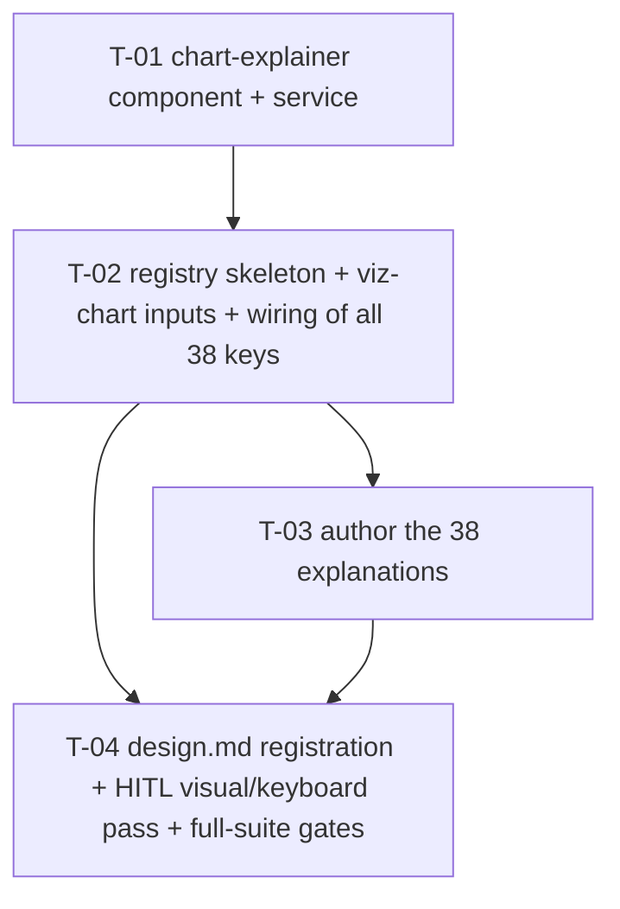

# Tasks — Changes / Chart Explainers

- **Module:** changes (client-only)
- **Spec id:** 2026-08-chart-explainers
- **Status:** not-started
- **Owner:** J. Cadavid / bilateral-visual-improvements
- **Linked requirements:** ./requirements.md
- **Linked design:** ./design.md
- **Depth:** Standard · **Approval Mode:** gated
- **Budget (design §12):** 4 tasks · ≈ 950 LOC · 2 review rounds — exceeding any of these **stops and escalates**
- **Sequencing:** start only after `changes/executive-overview-grounded-context` has landed on this branch (shared `project-dashboard.component.*`)
- **Last updated:** 2026-08-24

All commands run from `client/research-indicators/`. Targeted jest runs MUST add `--coverage=false` (K-020). Every gate below must be **observed red once** before it is cited as evidence (K-004) — record the red in `execution.md`.

---

## 1. Dependency graph

T-02 and T-03 are split on purpose: T-02 lands placeholder copy (`TODO:` sentences that the registry lint test **rejects**) so the wiring can be verified structurally, and T-03 is a copy-only task reviewed by a different lens (content truth, KZ-007).

---

## 2. Task list

### T-01 — `chart-explainer` shared component + `ChartExplainerService`

- **Requirements covered:** R-CXP-002 (all ACs + both scenarios), R-CXP-003 AC.1, R-CXP-006 AC.1, NFR-CXP-001
- **Design refs:** design §2.1, §5.1, §7, D-CXP-1/3/4/5/7
- **Files touched (intended):**
  - `src/app/shared/components/chart-explainer/chart-explainer.component.{ts,html,scss,spec.ts}` (new)
  - `src/app/shared/services/chart-explainer.service.{ts,spec.ts}` (new)
  - `src/app/shared/interfaces/chart-explainer.interface.ts` (new)
  - `src/app/shared/constants/chart-explainers.constants.ts` (new — **type + empty-able skeleton only**; keys/copy are T-02/T-03)
- **Description:** Build the pattern once. Button with accessible name, `aria-expanded`, `aria-controls` while open; `p-popover` (`appendTo="body"`, 340 px, `maxWidth: calc(100vw - 24px)`); always-rendered `span.sr-only` description with a per-instance id; document-level Esc; focus return on every close path except service-initiated hide; `placement` input (`inline` | `surface`).
- **Implementation notes:**
  - Copy the standalone + `OnPush` + `input()` + `componentRef.setInput` shape from `shared/components/viz-chart`.
  - Esc: `@HostListener('document:keydown.escape')` guarded by `isOpen()` (precedent `project-dashboard.component.ts:1579`).
  - Close paths converge on one `onHidden(returnFocus: boolean)`; PrimeNG `(onHide)` calls it with `true` unless the service marked this hide as displaced.
  - Tokens only: `text-[var(--ac-grey-700)]`, hover/focus `text-[var(--ac-light-blue-400)]`, `focus-visible:ring-2 ring-[var(--ac-light-blue-400)]`; `surface` placement adds `bg-[var(--ac-white-1)] dark:…` via tokens — **no hex**.
  - Do **not** move focus into the panel on open.
  - Until T-01 lands, `ChartExplainerKey` may be `string` with a `// T-02 narrows to a literal union` note — but the component's `key` input must already be typed against `ChartExplainerKey` so T-02's narrowing propagates without touching T-01.
- **Tests (`chart-explainer.component.spec.ts`, `chart-explainer.service.spec.ts`)** — each with its falsifying input (K-012):
  - Open on click → panel in `document.body` contains title + 3 sentences. *Red if:* `toggle()` never calls `popover.toggle`.
  - `aria-expanded` `false`→`true`→`false` and `aria-controls` present only while open. *Red if:* attribute bound to a constant.
  - Esc closes and `document.activeElement === button`. *Red if:* remove the `.focus()` call in `onHidden`.
  - Esc while focus is on `document.body` still closes (document listener). *Red if:* listener moved to the host element.
  - Second toggle closes; focus remains on button. *Red if:* `toggle()` always opens.
  - Two fixtures: opening B hides A **and** A's button is **not** focused afterwards (`focus` spy on A's button not called). *Red if:* service `open()` passes `returnFocus=true`.
  - Arrange transitions, not end state (KZ-015): construct closed, assert closed, then act.
- **Acceptance / done check:**
  - [ ] `npx jest src/app/shared/components/chart-explainer src/app/shared/services/chart-explainer --coverage=false --silent` green, **after** each listed red was observed
  - [ ] `grep -nE '#[0-9a-fA-F]{3,8}\b' src/app/shared/components/chart-explainer/*` → no output (**this check cannot see** token misuse such as `var(--ac-red-1)` for a neutral glyph — the T-04 HITL screenshot covers appearance)
  - [ ] `npm run build` green (app type-check incl. `strictTemplates`)
  - [ ] `npx tsc -p tsconfig.spec.json --noEmit 2>&1 | grep -c 'error TS'` ≤ 945 baseline (**disqualifier:** if the baseline itself moved on this branch, re-measure it on `HEAD~` before comparing; a count is not evidence without its baseline)
- **Evidence disqualifiers:** a green targeted run **without** `--coverage=false` exits 1 regardless (K-020) — an exit code from such a run is not a signal either way.
- **Dependencies:** none
- **Estimated effort:** M
- **Skills:** `angular-developer`, `ui-ux-pro-max`, `tdd`
- **Effort dial:** `medium` (a11y focus logic → bump to `high` on any rework)
- **Status:** todo

---

### T-02 — Registry key union, `viz-chart` inputs, and wiring of every chart surface

- **Requirements covered:** R-CXP-001 (all ACs; scenarios *Explainer present on an empty chart* incl. `BUT` loading / `AND IT MUST` no duplicate, *Multi-instance host*), R-CXP-003 AC.2/AC.3/AC.4 (+ scenario *Description available while closed*, both clauses), R-CXP-004 AC.1/AC.2/AC.3 (+ scenario *A new chart is added later*, all three clauses)
- **Design refs:** design §5.2, §5.3 wiring table, §5.4, D-CXP-2/6/8
- **Files touched (intended):**
  - `src/app/shared/constants/chart-explainers.constants.ts` (+ new `.spec.ts`) — `ChartExplainerKey` union of the **38** literals; every entry present with **placeholder** sentences prefixed `TODO:` and a real `derivedFrom`
  - `src/app/shared/components/viz-chart/viz-chart.component.{ts,html,spec.ts}`
  - `src/app/pages/platform/pages/project-detail/components/project-dashboard-card/project-dashboard-card.component.{ts,html,spec.ts}`
  - `.../project-dashboard/project-dashboard.component.{html,ts,spec.ts}` (hero indicator header computed key; status strip)
  - `.../results-trend-card/…html`, `.../sp-alignment-graph/…html`, `.../geo-scope-card/…html`, `.../geo-scope-map/…html`, `.../insights-section/…html`, `.../indicator-deep-dive/…html`
- **Description:** Add `explainerKey` / `describedBy` to `viz-chart`; add `explainerKey` to `project-dashboard-card` (header placement in card variant, forwarded to `viz-chart` in list variant); wire all 33 surfaces per design §5.3 with their 38 keys; write the completeness test that scans the host templates.
- **Implementation notes:**
  - Enumerate the 20 deep-dive keys from the literal `chartTitle`s in `indicator-deep-dive.component.html` (lines 28, 102–172) — **list them in the task PR description**; the count 20 is the scout's and must be re-counted (KZ-008: record what was executed — `grep -c app-viz-chart` on that file).
  - Hero header: single `<app-chart-explainer #chx [key]="indicatorExplainerKey()">` where the computed signal maps view mode → `results-by-indicator` | `results-by-indicator-heatmap`; both `viz-chart`s take `[describedBy]="chx.descriptionId"`; register both keys in the spec's `EXPECTED_DYNAMIC_KEYS`.
  - `geo-scope-map`: wrapper `div` hosts `<app-chart-explainer placement="surface">` and carries `aria-describedby`; still rendered in the `geo-scope-map-fallback` branch.
  - Hide while `loading()` in every host that has a loading signal; `viz-chart` hides on its own `loading()`.
  - `viz-chart`: `explainerKey` wins over `describedBy`; `console.warn` in dev when both set (D-CXP-6).
- **Tests** — falsifying input per assertion:
  - `chart-explainers.constants.spec.ts` completeness: template-scan set == registry keys ∪ dynamic list. *Red if:* delete one registry entry → missing; add `zzz-unused` → dead entry. **Both reds must be observed and recorded.** **Declared blind spot (KZ-017):** the scan cannot see keys built at runtime — that is why `EXPECTED_DYNAMIC_KEYS` exists; a new computed key not added there passes the scan silently and is caught only by `strictTemplates` (unknown literal) — record this in `execution.md`.
  - Build gate: temporarily set `explainerKey="not-a-key"` in one template → `npm run build` must fail with a TS error on the union; revert. (R-CXP-004 AC.1)
  - `viz-chart.component.spec.ts`: with `explainerKey` + `loading=false` → one `app-chart-explainer` and table `aria-describedby` resolves to the explainer's description element; `loading=true` → none; keyless → no attribute; `describedBy='x'` → attribute `x`. *Red if:* `@if` dropped / attribute hard-coded. Arrange `loading=true` first, then flip (KZ-015).
  - `project-dashboard-card.component.spec.ts`: card variant renders explainer in `header` and forwards `describedBy`; list variant renders none in header and passes key to `viz-chart`. *Red if:* placement branches swapped.
  - `project-dashboard.component.spec.ts`: toggle Bars→Heatmap→Bars, assert exactly **one** explainer button in the indicator section throughout and its key changes. *Red if:* two buttons rendered or key constant. (R-CXP-001 `AND IT MUST` no duplicate; D7)
  - Distinct-keys assertion: the four dashboard-card instances carry four different keys (template scan already proves it; add a one-line assert on `CHART_EXPLAINERS` having all four).
- **Acceptance / done check:**
  - [ ] Completeness spec green after both reds observed
  - [ ] Build-gate red observed (`not-a-key`) and recorded, then reverted
  - [ ] `grep -c "app-viz-chart" src/app/pages/platform/pages/project-detail/components/*/*.html` totals **31** and `grep -rn "app-viz-chart" src/app --include=*.html | grep -v project-detail | grep -v shared/components/viz-chart` is empty — if either differs from the scout's figures, **stop and update design §5.3 before wiring** (a count over a moved target is not evidence)
  - [ ] Existing `viz-chart` (509-line) and card specs still green unchanged except additive tests
  - [ ] `npm run build` green; registry lint test (T-01's shape rules) **fails** on the `TODO:` placeholders — this red is expected and is T-03's starting state; do **not** weaken the test to get green here
- **Evidence disqualifiers:** the template scan passing while `npm run build` was not run proves nothing about dynamic keys (see blind spot). A count taken with `head`/`tail` is not a count (K-014).
- **Dependencies:** T-01
- **Estimated effort:** L
- **Skills:** `angular-developer`, `ui-ux-pro-max`
- **Effort dial:** `medium`
- **Status:** todo

---

### T-03 — Author the 38 explanations

- **Requirements covered:** R-CXP-005 (AC.1, AC.2, scenario *Acronym glossed* incl. `BUT` no repeated gloss), R-CXP-004 AC.4
- **Design refs:** design §5.4, D-CXP-9; requirements §5 R-CXP-005 copy standard
- **Files touched (intended):**
  - `src/app/shared/constants/chart-explainers.constants.ts` (replace every `TODO:` placeholder)
  - `src/app/shared/constants/chart-explainers.constants.spec.ts` (jargon/gloss/length lint — extend if T-02 stubbed it)
- **Description:** Write `title`, `what`, `howToRead`, `source`, optional `emptyHint` for all 38 keys in plain language, each ≤ 3 sentences, each sentence ≤ 220 chars, acronyms glossed on first use, chart jargon paraphrased. Verify each entry's semantics against the archived spec named in `derivedFrom` (`project-dashboard-redesign`, `dashboard-advanced-analytics`) — **not** against the chart title alone.
- **Implementation notes:**
  - Load `cognitive-doc-design` (lead with the answer; one idea per sentence) and `ui-ux-pro-max` (`data-table`/`color-guidance` rules inform the "how to read" sentence).
  - Structure every entry: *what it shows* (mark + unit) → *how to read it* (encoding + interaction, e.g. "click a bar to open those results" only where the host actually emits `chartClick`) → *source / caveat* (which statuses are counted; why it may be empty).
  - For the heatmap ramp, say "darker blue = more results" — matches `--ac-viz-ramp-*` monotonicity (design.md §7.1).
  - Do not describe interactions a surface does not have (deep-dive charts emit no `chartClick`).
- **Tests:**
  - Registry lint (`chart-explainers.constants.spec.ts`): no `TODO:`; non-empty fields; ≤ 3 sentences; ≤ 220 chars/sentence; listed jargon (`bipartite|treemap|funnel|heatmap`) only with a gloss in the same sentence; acronyms `IRL|SP|AOW|HLO|OICR` glossed on first use per entry. *Red if:* leave one `TODO:` — observed at the start of this task by construction (T-02 leaves it red). **Cannot reach:** semantic truth and unlisted jargon — declared, covered by the human review below.
- **Acceptance / done check:**
  - [ ] Registry lint test green (was red at task start — cite the T-02 record)
  - [ ] Reviewer reads **all 38** entries against `derivedFrom` and records a per-key PASS table in `execution.md` (R-CXP-005 AC.1) — a sample is not a review
  - [ ] Every "click …" sentence corresponds to a host that binds `(chartClick)` — verified by grep over the 7 host templates and listed in the PR
- **Evidence disqualifiers:** a green lint with a shortened jargon list is not evidence — the list in the test must be the one in R-CXP-005 AC.2 verbatim.
- **Dependencies:** T-02
- **Estimated effort:** M
- **Skills:** `cognitive-doc-design`, `ui-ux-pro-max`
- **Effort dial:** `high` (content correctness is the dominant defect class D2)
- **Status:** todo

---

### T-04 — Baseline registration, HITL visual/keyboard pass, full-suite gates

- **Requirements covered:** R-CXP-006 AC.2/AC.3, R-CXP-007 (all ACs), NFR-CXP-001 (manual pass), NFR-CXP-002, NFR-CXP-003
- **Design refs:** design §5.5 UI states, §7, §12 budget
- **Files touched (intended):**
  - `docs/ux-ui/design.md` §8.1 (inventory row), §10.1 (one line), §12.2 (dated decision citing D-CXP-1…9)
  - `docs/specs/changes/chart-explainers/execution.md` (screenshots + measurements)
- **Description:** Register the pattern in the baseline; run the human checks jsdom cannot; run the full client gates in isolation.
- **HITL checklist (light AND dark, attach screenshots before any checkbox flips — KZ-014):**
  - [ ] Card-header explainer (e.g. Top partner institution) closed + open
  - [ ] Deep-dive grid explainer on a 44 px velocity strip and on a 220 px chart — density judged acceptable (RISK-3); if not → **Adjust**, do not tune ad hoc
  - [ ] Geo list-variant ranking explainer
  - [ ] Status strip explainer
  - [ ] Popover at 375 px viewport does not overflow (`maxWidth`)
  - [ ] Glyph contrast ≥ 3:1 on `--ac-white-1` (light) and `--ac-background` (dark) — compute from the token values (`npm run tokens:validate` style) or measure with a contrast tool; record the numbers
  - [ ] Keyboard walkthrough: Tab reaches a `?`, Enter opens, Esc closes, focus visibly returns; VoiceOver (macOS) reads "Explain this chart: …, button, collapsed" and the chart's description via describedby
  - [ ] Hit area ≥ 32 px measured in DevTools (jsdom cannot)
- **Gates (Leader runs, no concurrent workers — root CLAUDE.md §4.3):**
  - [ ] `npm test -- --silent` full suite green
  - [ ] `npm run lint -- --quiet` clean
  - [ ] `npm run build` green; record the `project-dashboard` lazy chunk size before/after — **disqualifier:** measure the baseline **twice**; if the before/after delta is within the two-baseline spread, report "within noise", not a number (NFR-CXP-002)
  - [ ] Budget check against design §12: tasks ≤ 4, LOC ≤ ~950 (`git diff --stat` on the branch range), review rounds ≤ 2 — over any → escalate, do not continue
- **Evidence disqualifiers:** a screenshot of only light mode is half the evidence; a full-suite run while a worker is active is a wrong measurement, not a slow one.
- **Dependencies:** T-02, T-03
- **Estimated effort:** S
- **Skills:** `ui-ux-pro-max` (checklist), `cognitive-doc-design` (design.md entries)
- **Effort dial:** `medium`; visual review is **T6 Multimodal** — dispatch cross-host if the session host cannot view the screenshots
- **Status:** todo

---

## 3. Clause coverage (scenario / `BUT` / `AND IT MUST` granularity)

| Requirement clause | Owner |
| --- | --- |
| R-001 AC.1–4 | T-02 (AC.4 measured in T-04) |
| R-001 *Empty chart* THEN/AND | T-02 (render on empty) + T-03 (`emptyHint`) |
| R-001 *Empty chart* BUT loading | T-02 |
| R-001 *Empty chart* AND IT MUST no duplicate | T-02 (view-mode toggle test) |
| R-001 *Multi-instance* THEN / BUT | T-02 (distinct keys) |
| R-002 AC.1–5 | T-01 |
| R-002 *Keyboard walkthrough* BUT no auto-focus / AND IT MUST Esc anywhere | T-01 |
| R-002 *Only one open* THEN / BUT | T-01 (service) |
| R-003 AC.1 | T-01 |
| R-003 AC.2–4 | T-02 |
| R-003 *Closed* BUT no caption dup / AND IT MUST sr-only | T-02 (viz-chart test asserts caption unchanged and `.sr-only` class) |
| R-004 AC.1–3 | T-02 |
| R-004 AC.4 | T-03 |
| R-004 *New chart* THEN / AND IT MUST / BUT keyless legal | T-02 |
| R-005 AC.1 | T-03 (human) |
| R-005 AC.2 | T-03 |
| R-005 *Acronym* THEN / BUT | T-03 |
| R-006 AC.1 | T-01 |
| R-006 AC.2–3 | T-04 |
| R-007 AC.1–3 | T-04 |
| NFR-001 | T-01 (automated) + T-04 (manual) |
| NFR-002, NFR-003 | T-04 |

No clause is discharged by citing a different requirement.

---

## 4. Testing expectations

- Spec files: 3 new (`chart-explainer.component`, `chart-explainer.service`, `chart-explainers.constants`), 3 extended (`viz-chart`, `project-dashboard-card`, `project-dashboard`).
- Coverage floors unchanged (40/20/45/30); targeted runs use `--coverage=false`.
- No `jest-axe` — hand-written DOM assertions per repo convention.

## 5. Execution conventions

- Commits: `[SPEC:changes/chart-explainers] feat(chart-explainer): …` (repo style `<type>(<module>): <subject>` with the AKILI prefix).
- **PR strategy:** ≈ 950 LOC → **two PRs**: **PR 1** = T-01 + T-02 (component, engine inputs, wiring, placeholder copy; reviewers read `chart-explainer.component.ts` first, then the wiring table); **PR 2** = T-03 + T-04 (copy + baseline docs + screenshots; review is content truth). Chain them; PR 2 description links PR 1 and states "out of scope: any behavior change".
- Branch: this worktree branch `bilateral-visual-improvements`; deliver to `main` via PR (memory: dev takes direct merges, main takes PRs).

## 6. Risks & blockers log

| # | Date | Risk / Blocker | Mitigation | Owner | Status |
| --- | --- | --- | --- | --- | --- |
| RB-1 | 2026-08-24 | `executive-overview-grounded-context` not yet landed → same-file conflicts | Do not start T-02 until it lands | Leader | open |
| RB-2 | 2026-08-24 | Scout counts (31 instances / 20 deep-dive) may drift | T-02 re-counts before wiring | Implementer | open |
| RB-3 | 2026-08-24 | PrimeNG `onHide` firing on service-initiated hide could refocus the displaced button | Service marks the hide as displaced before calling `hide()` | Implementer | open |

## 7. Done definition

- [ ] T-01…T-04 `done` with `execution.md` PASS records (guardrail hook enforces evidence-before-checkbox)
- [ ] All ACs checked; both HITL screenshot sets attached
- [ ] Coverage floors green; `design.md` baseline updated in the same PR as the copy
- [ ] Budget not exceeded (or escalation recorded)
