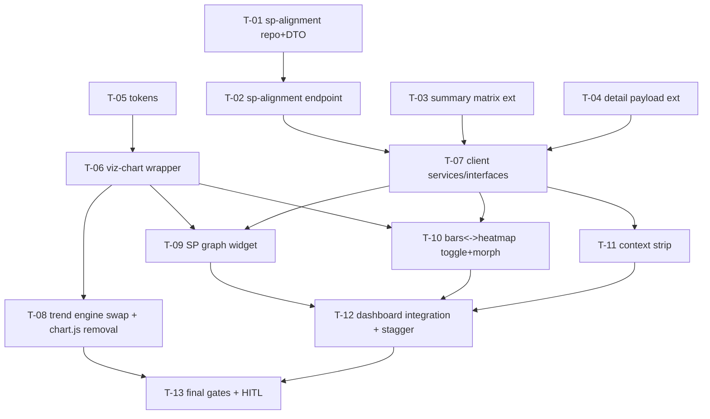

# Tasks — project-detail / Dashboard Advanced Analytics

- **Module:** project-detail (client) + agresso-contract (server)
- **Spec id:** 2026-08-dashboard-advanced-analytics
- **Status:** not-started
- **Owner:** j.cadavid@cgiar.org
- **Linked requirements:** ./requirements.md
- **Linked design:** ./design.md
- **Last updated:** 2026-08-22
- **Budget (design §13):** 13 tasks · ~1,600 LOC · 2 review rounds — `/akili-execute` trips against these; first descope candidate on a trip: the morph (crossfade fallback)

Global rules (bind every task): suites serial, never both packages concurrently (root guide §4.3); client targeted runs `--coverage=false` (K-020); lint gates `npm run lint -- --quiet` (client) / bare `npx eslint <path>` (server) (K-001); spec-tsc judged as delta vs the 945 baseline (K-002/K-004).

---

## 2. Dependency graph

PR strategy: **PR 1** = T-01..T-04 (server, additive, merges first) · **PR 2a** = T-05..T-07 (client foundations) · **PR 2b** = T-08..T-13 (client UI). Chained descriptions per `cognitive-doc-design` review-empathy rules.

---

## 3. Task list

### T-01 — Server: sp-alignment aggregation (repository + DTO)
- **Requirements:** R-DA-001 (Details, Scenario incl. `AND IT MUST` SQL/primary-scope and `BUT` no-invented-role, AC.2/AC.3/AC.4 data halves) · **Design:** §2.1.1, D-DA-4
- **Files:** `agresso-contract/repositories/agresso-contract.repository.ts` (+spec), `dto/contract-sp-alignment-report.dto.ts` (NEW)
- **Skills:** `nestjs-expert`
- **Done checks:**
  - [x] Repo spec asserts generated SQL contains the primary subquery predicates, the alignment/SP joins, and `COALESCE`→`'UNKNOWN'` (KZ-001). *Red input (K-012): drop the COALESCE — the UNKNOWN fixture assertion must fail.*
  - [x] Fixtures: result with 2 SP links (appears under both — AC.2); null-role row → UNKNOWN (AC.3); contract with zero alignments → `sps: []` + counters (AC.4). *Disqualifier: fixtures lacking a null-role row prove nothing for AC.3.*
  - [x] Server suite green. *KZ-017: SQL semantics vs real MySQL → T-13 Dev cross-check.*

### T-02 — Server: sp-alignment endpoint + Swagger
- **Requirements:** R-DA-001 AC.1 + 400-on-empty · **Design:** §4
- **Files:** `agresso-contract.controller.ts`, `agresso-contract.service.ts` (+specs)
- **Skills:** `nestjs-expert`, `api-design-principles` · **Deps:** T-01
- **Done checks:**
  - [x] Controller/service specs: happy path + empty `contract-id` → 400. *Red input: `''` with the guard removed.*
  - [x] Swagger presence deferred evidence → T-13 (manual screenshot).

### T-03 — Server: results-summary matrix extension
- **Requirements:** R-DA-002 (AC.1 sums, AC.2 byte-compat, Scenario `BUT` no-zero-cells + `AND IT MUST` null bucket) · **Design:** §2.1.2, D-DA-2
- **Files:** repository (+spec), `dto/contract-results-summary-report.dto.ts`
- **Skills:** `nestjs-expert` · **Deps:** none (parallel with T-01)
- **Done checks:**
  - [x] Reconciliation fixture: cell sums = indicator totals = `total`; null-year cell present; **no** cell for empty pairs. *Red input: emit zero-filled cells — the no-fabrication assertion must fail.*
  - [x] **D11:** the previous spec's summary specs run untouched and green. *Disqualifier: any edit to those spec files to make them pass = byte-compat violated, report instead of patching.*

### T-04 — Server: findOneContract payload extension
- **Requirements:** R-DA-005 sources (funding_type, center_amount_usd, sdgs, cgiar_entities) · **Design:** §2.1.3, D-DA-3
- **Files:** repository `findOneContract` (+spec)
- **Skills:** `nestjs-expert` · **Deps:** none
- **Done checks:**
  - [ ] New fields present; existing fields byte-identical (fixture diff old-vs-new shape — K-019 style comparison over a fixed input). *Red input: rename an existing field — the comparison must fail.*
  - [ ] `pooled_funding_contracts` join returns `[]` (not null) when absent.

### T-05 — Client: token extension + validation + mirrors
- **Requirements:** R-DA-008 (AC.1 validator both themes + ramp monotonicity, AC.2 registration) · **Design:** §6 Tokens, D-DA-8
- **Files:** `src/styles/colors.scss`, client `README.md`, `docs/ux-ui/design.md` §7
- **Skills:** `ui-ux-pro-max`
- **Done checks:**
  - [ ] Validator outputs (light+dark, categorical additions + ramp) pasted in `execution.md`; gate previously seen red (P12 precedent stands). *Disqualifier: validating against literal surfaces instead of resolved card-surface tokens; skipping dark.* Executing agent must load the `dataviz` skill; unavailable → escalate (SU7 lesson).
  - [ ] 3-file registration grep (colors.scss + README + ux-ui §7).

### T-06 — Client: viz-chart wrapper
- **Requirements:** R-DA-009 AC.1 (structural table pairing), R-DA-007 AC.1 (reduced-motion init), R-DA-006 lazy confinement grounds · **Design:** §6 viz-chart, D-DA-1
- **Files:** `shared/components/viz-chart/` (NEW, +spec), `shared/utils/chart-tokens.util.ts` (+spec ext)
- **Skills:** `angular-developer` · **Deps:** T-05
- **Done checks:**
  - [ ] Structural test: rendering without a `tableModel` fails/refuses (a chart cannot exist untabled). *Red input: omit tableModel — must fail.*
  - [ ] Reduced-motion: init options carry `animation: false` under emulated `prefers-reduced-motion` (presence assertion — **cannot prove visual absence**; declared, visual half in T-13 HITL — D9 split).
  - [ ] Theme signal flip re-resolves option colors (assert requested token names — jsdom returns `''`, KZ-017 declared).
  - [ ] Bundle probe (K-004): eager-import echarts once, observe initial-chunk delta/budget error, revert, record both numbers. *Disqualifier: deltas within build noise read as proof.*

### T-07 — Client: services + interfaces
- **Requirements:** R-DA-001/002/005 client data paths · **Design:** §2.2
- **Files:** `api.service.ts`, `get-contract-sp-alignment.service.ts` (NEW, +spec), interfaces (sp-alignment NEW; summary + GetProjectDetail extended)
- **Skills:** `angular-developer` · **Deps:** T-02/T-03/T-04 shapes (parallel-dev vs DTOs allowed)
- **Done checks:**
  - [ ] `HttpTestingController` specs: envelope, error signal, retry. *Red input: `successfulRequest:false` with the error branch removed.*
  - [ ] Interface extensions compile against strict TS (D1 gate covers).

### T-08 — Client: trend-card engine swap + chart.js removal
- **Requirements:** R-DA-006 (AC.1 greps, AC.2 behavior parity, Scenario `BUT` no-contract-change + `AND IT MUST` lazy) · **Design:** §6 Trend card; reversion-challenge row
- **Files:** `results-trend-card/` (+spec realignment), `package.json`
- **Skills:** `angular-developer` · **Deps:** T-06
- **Done checks:**
  - [ ] Previous behavioral tests green (sparse fallback, dashed year, table alt); engine-specific realignments derived **from the failing suite** (K-018) — list the failures in `execution.md` before editing. *Disqualifier: a realignment list built by grep.*
  - [ ] Greps: zero `chart.js`/`primeng/chart` imports; `package.json` clean of both. *Red input: leave the ChartModule import — grep must hit.*

### T-09 — Client: SP alignment graph widget
- **Requirements:** R-DA-003 (all ACs, Scenario `BUT` no-Contributing-coercion + `AND IT MUST` table inclusion), R-DA-009 AC.2/AC.3, NFR-DA-005 cap · **Design:** §5.2, §6 SP graph, D-DA-5
- **Files:** `sp-alignment-graph/` (NEW, +spec), dashboard template hook
- **Skills:** `angular-developer`, `ui-ux-pro-max` · **Deps:** T-06, T-07
- **Done checks:**
  - [ ] Rendered-DOM: three role treatments incl. UNKNOWN legend entry (fixture with null-role rows — *red input: map null→CONTRIBUTING, the UNKNOWN assertion must fail*); tabular alternative enumerates SP↔result↔role incl. UNKNOWN rows.
  - [ ] Bilateral fixture with `sps: []` → absent-state card; **non-bilateral fixture → widget absent from DOM** (KZ-002: both fixtures mandatory). *Disqualifier: testing only the bilateral path.*
  - [ ] Result-node activation navigates (click + keyboard, router spy).
  - [ ] Cap fixture (>150 result nodes) renders the "showing N of M" disclosure. *Red input: exceed the cap without the disclosure line.*

### T-10 — Client: bars↔heatmap toggle + morph
- **Requirements:** R-DA-004 (all ACs, Scenario `BUT` no-refetch + `AND IT MUST` reduced-motion usability), R-DA-007 morph clauses · **Design:** §5.3, §6 Heatmap/Motion
- **Files:** indicator card region in `project-dashboard.component.*` (+spec), viz-chart consumption
- **Skills:** `angular-developer`, `ui-ux-pro-max` · **Deps:** T-06, T-07
- **Done checks:**
  - [ ] Toggle issues **zero** HTTP requests (`HttpTestingController.verify()` across the toggle — *red input: refetch on toggle, must fail*).
  - [ ] Both views reconcile totals (rendered-DOM against one fixture); ramp legend present; toggle keyboard-operable with state announced.
  - [ ] Reduced-motion fixture: instant swap (init-option assertion; visual → T-13). Crossfade fallback flag exists and switches the transition config. *Presence caveat declared: flag presence ≠ morph visual quality — that is T-13's HITL call.*

### T-11 — Client: project context strip
- **Requirements:** R-DA-005 (all ACs, Scenario `BUT` no-fabrication + `AND IT MUST` stable layout) · **Design:** §6 Context strip
- **Files:** `project-context-strip/` (NEW, +spec)
- **Skills:** `angular-developer` · **Deps:** T-07 (T-04 shape)
- **Done checks:**
  - [ ] Null-field fixture renders without those chips and **without** `0`/`N/A` placeholders. *Red input: render `N/A` for null funding_type — must fail.*
  - [ ] Elapsed % clamps at 0 and 100 (fixtures: pre-start and post-end dates). Currency formatted with USD unit.
  - [ ] SDG chips reuse the existing SDG display convention (no new taxonomy — C-3).

### T-12 — Client: dashboard integration + entry stagger
- **Requirements:** R-DA-007 AC.2 + stagger, R-DA-003/005 placement, region independence (inherited three-state pattern) · **Design:** §2.2 layout, §6 Motion
- **Files:** `project-dashboard.component.{ts,html}` (+spec)
- **Skills:** `angular-developer` · **Deps:** T-09, T-10, T-11
- **Done checks:**
  - [ ] Rendered order: KPI strip → context strip → analytics grid (graph among charts) → pending table → AI block (previous hierarchy preserved — its AC.1 test stays green).
  - [ ] One region's error leaves siblings rendering (extend the existing isolation tests to the new regions).
  - [ ] Stagger totals ≤400 ms across widgets (config assertion; visual feel → T-13).

### T-13 — Final gates + HITL validation
- **Requirements:** NFR-DA-001/002/005, R-DA-006 AC.1 final, D6/D9 substitutes, R-DA-001 Dev cross-check, T-02 Swagger evidence · **Design:** §10, §11
- **Skills:** `systematic-debugging` · **Deps:** T-08, T-12
- **Done checks:**
  - [ ] Bundle: base-vs-branch initial-chunk diff recorded (echarts added, chart.js removed — both directions); budgets green. *Disqualifier: mixed raw/gzip; noise-level deltas as proof.*
  - [ ] Full suites serial (client, then server); `npm run build` clean; spec-tsc delta 0 vs baseline; hex grep over all new/touched files → 0 (total counted first, K-014).
  - [ ] Dev: `sp-alignment` + summary payload sizes recorded (≤50 kB); sp counts sanity vs per-result alignment spot-check on one real bilateral contract. *Disqualifier: cross-checking a non-bilateral contract (vacuously empty).*
  - [ ] Swagger screenshot (new endpoint + extended DTO).
  - [ ] **HITL (D6/D9):** light+dark screenshots + interaction pass on Dev — graph adjacency hover, morph (decide: keep vs crossfade, record the decision), reduced-motion emulation, graph fluidity at the largest Dev bilateral contract (NFR-DA-005). *Disqualifier: one theme only, tiny-fixture fluidity, or skipping the reduced-motion emulation.*

---

## 4. Traceability — scenario/clause closure

| Clause | Owner |
|---|---|
| R-DA-001 Scenario (`AND IT MUST` SQL/primary, `BUT` no-invented-role) + AC.2/3/4 | T-01 |
| R-DA-001 AC.1 + 400 + Swagger evidence | T-02 (+T-13) |
| R-DA-002 AC.1 sums · AC.2 byte-compat · `BUT` no-zero-cells · `AND IT MUST` null bucket | T-03 |
| R-DA-003 AC.1 roles/UNKNOWN · AC.2 table · AC.3 activation · AC.4 empty · Scenario clauses | T-09 |
| R-DA-004 AC.1/2/3 · `BUT` no-refetch · `AND IT MUST` reduced-motion usable | T-10 |
| R-DA-005 AC.1/2/3 · `BUT` no-fabrication · `AND IT MUST` stable layout | T-11 (sources T-04) |
| R-DA-006 AC.1 greps · AC.2 parity · Scenario clauses | T-08 (final grep T-13) |
| R-DA-007 AC.1 reduced-motion init · AC.2 info-without-motion · Scenario clauses · morph valve | T-06 (init) + T-10 (toggle/morph) + T-12 (stagger) + T-13 (visual + valve decision) |
| R-DA-008 AC.1 validator · AC.2 zero-hex | T-05 (+T-13 sweep) |
| R-DA-009 AC.1 structural pairing · AC.2 keyboard/no-title · AC.3 non-color | T-06 · T-09/T-10/T-12 · T-09 |
| NFR-DA-001 · 002 · 004 · 005 | T-06 probe + T-13 · T-13 · every task + T-13 · T-09 cap + T-13 fluidity |

## 7. Risks & blockers log

| # | Date | Risk | Mitigation | Status |
|---|---|---|---|---|
| RB-1 | 2026-08-22 | Morph legibility unknown until real render | T-13 HITL decision point; crossfade valve wired in T-10 | open |
| RB-2 | 2026-08-22 | Largest Dev bilateral contract unknown for NFR-DA-005 | identify during T-13 Dev pass; cap+disclosure already in T-09 | open |

## 8. Done definition

- [ ] T-01…T-13 done with evidence in `execution.md` (hook enforces PASS-before-checkbox)
- [ ] All ACs checked; floors green; Swagger documents the new surface
- [ ] HITL screenshots + morph decision recorded; budget actuals vs §13 noted
- [ ] Rollout: server PR first; backout = revert client; no migrations
